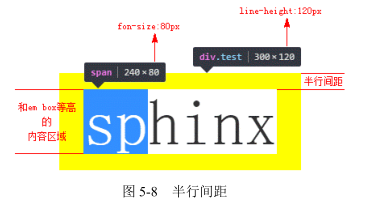
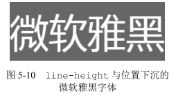
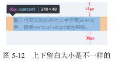

块级元素负责结构，内联元素接管内容，而 CSS 世界是面向图文混排，也就是内联元素设计的，由此可见，本章内容在整个 CSS 世界体系中占有非常重要的位置。

# 字母 x —— CSS 世界中隐匿的举足轻重的角色

## 字母 x 与 CSS 世界的基线

在各种内联相关模型中，凡是涉及垂直方向的排版或者对齐的，都离不开最基本的基线
（baseline）。例如，line-height 行高的定义就是两基线的间距，vertical-align 的默认
值就是基线，其他中线顶线一类的定义也离不开基线，基线甚至衍生出了很多其他基线概念（如
图 5-1 所示）。


字母 x 的下边缘（线）就是我们的基线。


## 字母 x 与 CSS 中的 x-height

CSS 中有一个概念叫作 x-height，指的是字母 x 的高度，术语描述就是基线和等分线（mean line）（也称作中线，midline）之间的距离。


- ascender height: 上行线高度。
- cap height: 大写字母高度。
- median: 中线。
- descender height: 下行线高度。

CSS 中有些属性值的定义就和这个 x-height 有关，最典型的代表就是 vertical-align:middle，这里的 middle 是中间的意思。注意，跟上面的 median（中线）不是一个意思。在 CSS 世界中，middle 指的是基线往上 1/2 x-height 高度。我们可以近似理解为字母 x 交叉点那个位置。

由此可见，vertical-align:middle 并不是绝对的垂直居中对齐，我们平常看到的 middle 效果只是一种近似效果，因为不同的字体在行内盒子中的位置是不一样的

## 字母 x 与 CSS 中的 ex

字母 x 衍生出了 x-height 概念，并在这个基础上深耕细作，进一步衍生出了 ex。注意，这里的 ex 是 CSS 中的一个尺寸单位。

ex 是 CSS 中的一个相对单位，指的是小写字母 x 的高度，没错，就是指 x-height。

虽然说 em、px 这类单位的主要作用是限定元素的尺寸，但是，由于字母 x 受字体等 CSS 属性影响大，不稳定，因此 ex 不太适合用来限定元素的尺寸

没错，ex 的价值就在其副业上 — 不受字体和字号影响的内联元素的垂直居中对齐效果。

内联元素默认是基线对齐的，而基线就是 x 的底部，而 1ex 就是一个 x 的高度。设想一下，假如图标高度就是 1ex，同时背景图片居中，岂不是图标和文字天然垂直居中，而且完全不受字体和字号的影响？因为 ex 就是一个相对于字体和字号的单位。

比如以下的文字后面跟着一个小三角形图标的效果

```css
.icon-arrow {
  display: inline-block;
  width: 20px;
  height: 1ex;
  background: url(arrow.png) no-repeat center;
}
```

<iframe src="/examples/code-editor.html?html=zhangxinxu%3Ci%20class%3D%22icon-arrow%22%3E%3C/i%3E%0A%0A%u5F20%u946B%u65ED%3Ci%20class%3D%22icon-arrow%22%3E%3C/i%3E&css=.icon-arrow%20%7B%0A%20%20%20%20display%3A%20inline-block%3B%0A%20%20%20%20width%3A%2020px%3B%0A%20%20%20%20height%3A%201ex%3B%0A%20%20%20%20background%3A%20url%28/images/5/arrow.png%29%20no-repeat%20center%3B%0A%7D" width="400" height="200"></iframe>

# 内联元素的基石 line-height

下文中所有的“行高”指的就是 line-height

## 内联元素的高度之本 — line-height

默认空`<div>`高度是 0，但是一旦里面写上几个文字，`<div>`高度就有了，请问这个高度由何而来，或者说是由哪个 CSS 属性决定的？

本质上是由 line-height 属性全权决定的，尽管某些场景确实与font-size 大小有关。

例如：

```html
<div class="test1">我的高度是？</div>
<style>
.test1 {
  font-size: 16px;
  line-height: 0;
  border: 1px solid #ccc;
  background: #eee;
}
</style>
```

和

```html
<div class="test2">我的高度是？</div>
<style>
.test1 {
  font-size: 0;
  line-height: 16px;
  border: 1px solid #ccc;
  background: #eee;
}
</style>
```

这两段代码的区别在于一个 line-height 行高为 0，一个 font-size 字号为 0。结果，第一段代码，最后元素的高度只剩下边框那么丁点儿，而后面一段代码，虽然文字小到都看不见了，但是 16px 的内部高度依然坚挺


对于非替换元素的纯内联元素，其可视高度完全由 line-height 决定，也就是什么 padding、border 属性对可视高度是没有任何影响的，这也是我们平常口中的“盒模型”约定俗成说的是块级元素的原因

因此，对于文本这样的纯内联元素，line-height 就是高度计算的基石，用专业说法就是指定了用来计算行框盒子高度的基础高度。比方说，line-height 设为 16px，则一行文字高度是 16px，两行就是 32px，三行就是 48px，所有浏览器渲染解析都是这个值，1 像素都不差

line-height 在替换元素，又或者是块级元素的作用：

行距 = line-height - font-size

半行距的显示：(当我们的字体是宋体的时候，内容区域和 em-box 是等同的)

```css
.test {
  font-family: simsun;
  font-size: 24px;
  line-height: 36px;
  background-color: yellow;
}
.test > span {
  background-color: white;
}
<div class="test">
  <span>sphinx</span>
</div>
```

此时，平常虚无的 em-box 借助内容区域（图 5-8 中字符 sp 的选中区域）暴露出了庐山真面目，“半行距”也准确显现出来了，如图 5-8 右侧标注



所有与文字相关的间距都是从文字的上边缘和下边缘开始标注的，假设 line-height 是 1.5，font-size 大小是 14px，那么我们的半行距大小就是（套用上面的行距公式再除以 2）：(14px * 1.5 - 14px) / 2 = 14px * 0.25 = 3.5px。border 以及 line-height 等传统 CSS 属性并没有小数像素的概念（从 CSS3 动画的细腻程度可以看出），因此，这里的 3.5px 需要取整处理，如果标注的是文字上边距，则向下取整；如果是文字下边距，则向上取整，因为绝大多数的字体在内容区域中都是偏下的。所以，假设设计师标注了文字字形上边缘到图片下边缘间距 20px，则我们实际的 margin-top 值应该是 17px，因为 3.5px 向下取整是 3px。

line-height如何通过改变行距实现文字排版？

当line-height设为 2 的时候，半行距是一半的文字大小，两行文字中间的间隙差不多一个文字尺寸大小；如果 line-height 大小是 1 倍文字大小，则根据计算，半行距是 0，也就是两行文字会紧密依偎在一起；如果 line-height 值是 0.5，则此时的行距就是负值，虽然 line-height 不支持负值，但是行距可以为负值，此时，两行文字就是重叠纠缠在一起


替换元素和块级元素中line-height的影响？

line-height 可以影响替换元素（如图片的高度）？

```html
<style>
.box {
  line-height: 256px;
}
</style>
<div class="box">
  
</div>
```

不可以，不是 line-height 把图片占据高度变高了，而是把“幽灵空白节点”的高度变高了，图片为内联元素，会构成一个“行框盒子”，而在 HTML5 文档模式下，每一个“行框盒子”的前面都有一个宽度为 0 的“幽灵空白节点”，其内联特性表现和普通字符一模一样，所以，这里的容器高度会等于 line-height 设置的属性值 256px。

实际开发的时候，图文和文字混在一起是很常见的，那这种内联替换元素和内联非替换元素在一起时的高度表现又是怎样的呢？

由于同属内联元素，因此，会共同形成一个“行框盒子”，line-height 在这个混合元素的“行框盒子”中扮演的角色是决定这个行盒的最小高度，对于纯文本元素，line-height 直接决定了最终的高度。但是，如果同时有替换元素，则 line-height 只能决定最小高度，为什么会这样呢？一是替换元素的高度不受 line-height 影响，二是 vertical-align 属性在背后作祟。

对于这种混合替换元素的场景，line-height 要想一统江山，需要值足够大才行。但是，实际开发的时候，我们给 line-height 设置的值总是很中规中矩，于是，就会出现类似下面的场景：明明文字设置了 line-height 为 20px，但是，如果文字后面有小图标，最后“行框盒子”高度却是 21px 或是 22px。这种现象背后最大的黑手其实是 vertical-align 属性，我们会在下一章好好深入剖析为什么会有这样的表现

对于块级元素，line-height 对其本身是没有任何作用的，我们平时改变 line-height，块级元素的高度跟着变化实际上是通过改变块级元素里面内联级别元素占据的高度实现的。

## 为什么 line-height 可以让内联元素“垂直居中”

要想让单行文字垂直居中，只要设置 line-height 大小和 height 高度一样就可以了，误区：

- 要让单行文字垂直居中，只需要 line-height 这一个属性就可以，与 height 一点儿关系都没有。也就是说，我们直接：

```css
.title {
  line-height: 24px;
}
```

- 行高控制文字垂直居中，不仅适用于单行，多行也是可以的。准确的说法应该是“line-height 可以让单行或多行元素近似垂直居中”

实现“垂直居中”原因在于 CSS 中“行距的上下等分机制”，如果行距的添加规则是在文字的上方或者下方，则行高是无法让文字垂直居中的。

说“近似”是因为文字字形的垂直中线位置普遍要比真正的“行框盒子”的垂直中线位置低，譬如我们拿现在用得比较多的微软雅黑字体举例：

```html
<style>
p {
  font-size: 80px;
  line-height: 120px;
  background-color: #666;
  font-family: 'microsoft yahei';
  color: #fff;
}
</style>
<p>微软雅黑</p>
```

字形明显偏下，font-size 12px～16px 很多，因此，虽然微软雅黑字体有下沉，但也就 1 像素的样子



多行文本或者替换元素的垂直居中实现原理和单行文本就不一样了，需要 line-height 属性的好朋友 vertical-align 属性帮助才可以，示例代码如下：

```html
<style>
  .box {
    line-height: 120px;
    background-color: #f0f3f9;
  }
  .content {
    display: inline-block;
    line-height: 20px;
    margin: 0 20px;
    vertical-align: middle;
  }
</style>
<div class="box">
  <div class="content">基于行高实现的...</div>
</div>
```

<iframe src="/examples/code-editor.html?html=%3Cdiv%20class%3D%22box%22%3E%0A%20%20%20%20%3Cdiv%20class%3D%22content%22%3E%u57FA%u4E8E%u884C%u9AD8%u5B9E%u73B0%u7684...%3C/div%3E%0A%3C/div%3E&css=.box%20%7B%0A%20%20%20%20width%3A%20280px%3B%0A%20%20%20%20line-height%3A%20120px%3B%0A%20%20%20%20background-color%3A%20%23f0f3f9%3B%0A%20%20%20%20margin%3A%20auto%3B%0A%7D%0A.content%20%7B%0A%20%20%20%20display%3A%20inline-block%3B%0A%20%20%20%20line-height%3A%2020px%3B%0A%20%20%20%20margin%3A%200%2020px%3B%0A%20%20%20%20text-align%3A%20left%3B%0A%20%20%20%20vertical-align%3A%20middle%3B%0A%7D" width="400" height="200"></iframe>

实现的原理大致如下:

1. 多行文字使用一个标签包裹，然后设置 display 为 inline-block。好处在于既能重置外部的 line-height 为正常的大小，又能保持内联元素特性，从而可以设置 vertical-align 属性，以及产生一个非常关键的“行框盒子”。我们需要的其实并不是这个“行框盒子”，而是每个“行框盒子”都会附带的一个产物 — “幽灵空白节点”，即一个宽度为0、表现如同普通字符的看不见的“节点”。有了这个“幽灵空白节点”，我们的 line-height:120px 就有了作用的对象，从而相当于在.content 元素前面撑起了一个高度为 120px 的宽度为 0 的内联元素。
2. 因为内联元素默认都是基线对齐的，所以我们通过对.content 元素设置 vertical-align:middle 来调整多行文本的垂直位置，从而实现我们想要的“垂直居中”效果。如果是要借助 line-height 实现图片垂直居中效果，也是类似的原理和做法

这里实现的“垂直居中”确实也不是真正意义上的垂直居中，也是“近似垂直居中”。还是上面的多行文本垂直居中的例子，如果我们捕获到多行文本元素的尺寸空间，截个图，然后通过尺子工具一量就会发现，上面的留空是41px，下面的留空是 39px，对啦，原来不是完全的垂直居中



不垂直居中与 line-height 无关，而是 vertical-align 导致的，具体原因我们将在 5.3 节讲解。