块级元素负责结构，内联元素接管内容，而 CSS 世界是面向图文混排，也就是内联元素设计的，由此可见，本章内容在整个 CSS 世界体系中占有非常重要的位置。

# 字母 x —— CSS 世界中隐匿的举足轻重的角色

## 字母 x 与 CSS 世界的基线

在各种内联相关模型中，凡是涉及垂直方向的排版或者对齐的，都离不开最基本的基线 （baseline）。例如，line-height 行高的定义就是两基线的间距，vertical-align 的默认值就是基线，其他中线顶线一类的定义也离不开基线，基线甚至衍生出了很多其他基线概念（如图 5-1 所示）。


字母 x 的下边缘（线）就是我们的基线。

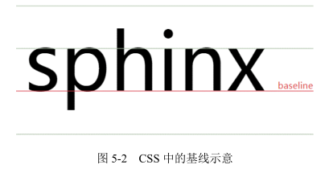

## 字母 x 与 CSS 中的 x-height

CSS 中有一个概念叫作 x-height，指的是字母 x 的高度，术语描述就是基线和等分线（mean line）（也称作中线，midline）之间的距离。

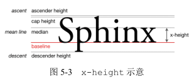

- ascender height: 上行线高度。
- cap height: 大写字母高度。
- median: 中线。
- descender height: 下行线高度。

CSS 中有些属性值的定义就和这个 x-height 有关，最典型的代表就是 vertical-align:middle，这里的 middle 是中间的意思。注意，跟上面的 median（中线）不是一个意思。在 CSS 世界中，middle 指的是基线往上 1/2 x-height 高度。我们可以近似理解为字母 x 交叉点那个位置。

由此可见，vertical-align:middle 并不是绝对的垂直居中对齐，我们平常看到的 middle 效果只是一种近似效果，因为不同的字体在行内盒子中的位置是不一样的

## 字母 x 与 CSS 中的 ex

字母 x 衍生出了 x-height 概念，并在这个基础上深耕细作，进一步衍生出了 ex。注意，这里的 ex 是 CSS 中的一个尺寸单位。

ex 是 CSS 中的一个相对单位，指的是小写字母 x 的高度，没错，就是指 x-height。

虽然说 em、px 这类单位的主要作用是限定元素的尺寸，但是，由于字母 x 受字体等 CSS 属性影响大，不稳定，因此 ex 不太适合用来限定元素的尺寸

没错，ex 的价值就在其副业上 — 不受字体和字号影响的内联元素的垂直居中对齐效果。

内联元素默认是基线对齐的，而基线就是 x 的底部，而 1ex 就是一个 x 的高度。设想一下，假如图标高度就是 1ex，同时背景图片居中，岂不是图标和文字天然垂直居中，而且完全不受字体和字号的影响？因为 ex 就是一个相对于字体和字号的单位。

比如以下的文字后面跟着一个小三角形图标的效果

<iframe src="/examples/code-editor.html?html=zhangxinxu%3Ci%20class%3D%22icon-arrow%22%3E%3C/i%3E%0A%0A%u5F20%u946B%u65ED%3Ci%20class%3D%22icon-arrow%22%3E%3C/i%3E&css=.icon-arrow%20%7B%0A%20%20%20%20display%3A%20inline-block%3B%0A%20%20%20%20width%3A%2020px%3B%0A%20%20%20%20height%3A%201ex%3B%0A%20%20%20%20background%3A%20url%28/images/5/arrow.png%29%20no-repeat%20center%3B%0A%7D" width="400" height="200"></iframe>

# 内联元素的基石 line-height

下文中所有的“行高”指的就是 line-height

## 内联元素的高度之本 — line-height

默认空`<div>`高度是 0，但是一旦里面写上几个文字，`<div>`高度就有了，请问这个高度由何而来，或者说是由哪个 CSS 属性决定的？

本质上是由 line-height 属性全权决定的，尽管某些场景确实与 font-size 大小有关。

例如：

```html
<div class="test1">我的高度是？</div>
<style>
   .test1 {
      font-size: 16px;
      line-height: 0;
      border: 1px solid #ccc;
      background: #eee;
   }
</style>
```

和

```html
<div class="test2">我的高度是？</div>
<style>
   .test1 {
      font-size: 0;
      line-height: 16px;
      border: 1px solid #ccc;
      background: #eee;
   }
</style>
```

这两段代码的区别在于一个 line-height 行高为 0，一个 font-size 字号为 0。结果，第一段代码，最后元素的高度只剩下边框那么丁点儿，而后面一段代码，虽然文字小到都看不见了，但是 16px 的内部高度依然坚挺


对于非替换元素的纯内联元素，其可视高度完全由 line-height 决定，也就是什么 padding、border 属性对可视高度是没有任何影响的，这也是我们平常口中的“盒模型”约定俗成说的是块级元素的原因

因此，对于文本这样的纯内联元素，line-height 就是高度计算的基石，用专业说法就是指定了用来计算行框盒子高度的基础高度。比方说，line-height 设为 16px，则一行文字高度是 16px，两行就是 32px，三行就是 48px，所有浏览器渲染解析都是这个值，1 像素都不差

### line-height 在替换元素、块级元素的作用

行距 = line-height - font-size

半行距的显示：(当我们的字体是宋体的时候，内容区域和 em-box 是等同的)

```html
<style>
   .test {
      font-family: simsun;
      font-size: 24px;
      line-height: 36px;
      background-color: yellow;
   }

   .test > span {
      background-color: white;
   }
</style>
<div class="test">
   <span>
      sphinx
   </span>
</div>
```

此时，平常虚无的 em-box 借助内容区域（图 5-8 中字符 sp 的选中区域）暴露出了庐山真面目，“半行距”也准确显现出来了，如图 5-8 右侧标注


所有与文字相关的间距都是从文字的上边缘和下边缘开始标注的，假设 line-height 是 1.5，font-size 大小是 14px，那么我们的半行距大小就是（套用上面的行距公式再除以 2）：(14px _ 1.5 - 14px) / 2 = 14px _ 0.25 = 3.5px。border 以及 line-height 等传统 CSS 属性并没有小数像素的概念（从 CSS3 动画的细腻程度可以看出），因此，这里的 3.5px 需要取整处理，如果标注的是文字上边距，则向下取整；如果是文字下边距，则向上取整，因为绝大多数的字体在内容区域中都是偏下的。所以，假设设计师标注了文字字形上边缘到图片下边缘间距 20px，则我们实际的 margin-top 值应该是 17px，因为 3.5px 向下取整是 3px。

### line-height 如何通过改变行距实现文字排版

当 line-height 设为 2 的时候，半行距是一半的文字大小，两行文字中间的间隙差不多一个文字尺寸大小；如果 line-height 大小是 1 倍文字大小，则根据计算，半行距是 0，也就是两行文字会紧密依偎在一起；如果 line-height 值是 0.5，则此时的行距就是负值，虽然 line-height 不支持负值，但是行距可以为负值，此时，两行文字就是重叠纠缠在一起


### 替换元素和块级元素中 line-height 的影响

line-height 可以影响替换元素（如图片的高度）？

```html
<style>
   .box {
      line-height: 256px;
   }
</style>
<div class="box">
   
</div>
```

不可以，不是 line-height 把图片占据高度变高了，而是把“幽灵空白节点”的高度变高了，图片为内联元素，会构成一个“行框盒子”，而在 HTML5 文档模式下，每一个“行框盒子”的前面都有一个宽度为 0 的“幽灵空白节点”，其内联特性表现和普通字符一模一样，所以，这里的容器高度会等于 line-height 设置的属性值 256px。

实际开发的时候，图文和文字混在一起是很常见的，那这种内联替换元素和内联非替换元素在一起时的高度表现又是怎样的呢？

由于同属内联元素，因此，会共同形成一个“行框盒子”，line-height 在这个混合元素的“行框盒子”中扮演的角色是决定这个行盒的最小高度，对于纯文本元素，line-height 直接决定了最终的高度。但是，如果同时有替换元素，则 line-height 只能决定最小高度，为什么会这样呢？一是替换元素的高度不受 line-height 影响，二是 vertical-align 属性在背后作祟。

对于这种混合替换元素的场景，line-height 要想一统江山，需要值足够大才行。但是，实际开发的时候，我们给 line-height 设置的值总是很中规中矩，于是，就会出现类似下面的场景：明明文字设置了 line-height 为 20px，但是，如果文字后面有小图标，最后“行框盒子”高度却是 21px 或是 22px。这种现象背后最大的黑手其实是 vertical-align 属性，我们会在下一章好好深入剖析为什么会有这样的表现

对于块级元素，line-height 对其本身是没有任何作用的，我们平时改变 line-height，块级元素的高度跟着变化实际上是通过改变块级元素里面内联级别元素占据的高度实现的。

## 为什么 line-height 可以让内联元素“垂直居中”

要想让单行文字垂直居中，只要设置 line-height 大小和 height 高度一样就可以了，这是个误区，正确的做法如下：

- 要让单行文字垂直居中，只需要 line-height 这一个属性就可以，与 height 一点儿关系都没有。也就是说，我们直接：

   ```css
   .title {
      line-height: 24px;
   }
   ```

- 行高控制文字垂直居中，不仅适用于单行，多行也是可以的。准确的说法应该是“line-height 可以让单行或多行元素近似垂直居中”

实现“垂直居中”原因在于 CSS 中“行距的上下等分机制”，如果行距的添加规则是在文字的上方或者下方，则行高是无法让文字垂直居中的。

说“近似”是因为文字字形的垂直中线位置普遍要比真正的“行框盒子”的垂直中线位置低，譬如我们拿现在用得比较多的微软雅黑字体举例：

```html
<style>
   p {
      font-size: 80px;
      line-height: 120px;
      background-color: #666;
      font-family: 'microsoft yahei';
      color: #fff;
   }
</style>
<p>微软雅黑</p>
```

字形明显偏下，font-size 12px ～ 16px 很多，因此，虽然微软雅黑字体有下沉，但也就 1 像素的样子


多行文本或者替换元素的垂直居中实现原理和单行文本就不一样了，需要 line-height 属性的好朋友 vertical-align 属性帮助才可以，示例代码如下：

<iframe src="/examples/code-editor.html?html=%3Cdiv%20class%3D%22box%22%3E%0A%20%20%20%20%3Cdiv%20class%3D%22content%22%3E%u57FA%u4E8E%u884C%u9AD8%u5B9E%u73B0%u7684...%3C/div%3E%0A%3C/div%3E&css=.box%20%7B%0A%20%20%20%20width%3A%20280px%3B%0A%20%20%20%20line-height%3A%20120px%3B%0A%20%20%20%20background-color%3A%20%23f0f3f9%3B%0A%20%20%20%20margin%3A%20auto%3B%0A%7D%0A.content%20%7B%0A%20%20%20%20display%3A%20inline-block%3B%0A%20%20%20%20line-height%3A%2020px%3B%0A%20%20%20%20margin%3A%200%2020px%3B%0A%20%20%20%20text-align%3A%20left%3B%0A%20%20%20%20vertical-align%3A%20middle%3B%0A%7D" width="400" height="200"></iframe>

实现的原理大致如下:

1. 多行文字使用一个标签包裹，然后设置 display 为 inline-block。好处在于既能重置外部的 line-height 为正常的大小，又能保持内联元素特性，从而可以设置 vertical-align 属性，以及产生一个非常关键的“行框盒子”。我们需要的其实并不是这个“行框盒子”，而是每个“行框盒子”都会附带的一个产物 — “幽灵空白节点”，即一个宽度为 0、表现如同普通字符的看不见的“节点”。有了这个“幽灵空白节点”，我们的 line-height:120px 就有了作用的对象，从而相当于在.content 元素前面撑起了一个高度为 120px 的宽度为 0 的内联元素。
2. 因为内联元素默认都是基线对齐的，所以我们通过对 .content 元素设置 vertical-align:middle 来调整多行文本的垂直位置，从而实现我们想要的“垂直居中”效果。如果是要借助 line-height 实现图片垂直居中效果，也是类似的原理和做法

这里实现的“垂直居中”确实也不是真正意义上的垂直居中，也是“近似垂直居中”。还是上面的多行文本垂直居中的例子，如果我们捕获到多行文本元素的尺寸空间，截个图，然后通过尺子工具一量就会发现，上面的留空是 41px，下面的留空是 39px，对啦，原来不是完全的垂直居中


不垂直居中与 line-height 无关，而是 vertical-align 导致的，具体原因我们将在 5.3 节讲解。

## 深入 line-height 的各类属性值

line-height 的默认值是 normal，还支持数值、百分比值以及长度值。

```css
div {
   line-height: normal;
   font-family: 'microsoft yahei';
}

div {
   line-height: normal;
   font-family: simsun;
}
```

此时两段 CSS 中 line-height 的属性值 normal 的计算值是不一样的，下表给出的是我在几个桌面浏览器的测试数据。

|   字体   | chrome | Firefox |  IE   |
| :------: | :----: | :-----: | :---: |
| 微软雅黑 |  1.32  |  1.321  | 1.32  |
|   宋体   | 1.141  |  1.142  | 1.141 |

只要字体确定，各个浏览器下的默认 line-height 解析值基本上都是一样的，然而不同的浏览器所使用的默认中英文字体并不是一样的，并且不同操作系统的默认字体也不一样，换句话说，就是不同系统不同浏览器的默认 line-height 都是有差异的。因此，在实际开发的时候，对 line-height 的默认值进行重置是势在必行的。下面问题来了，line-height 应该重置为多大的值呢？是使用数值、百分比值还是长度值呢？

要回答这个问题，我们需要先对这几种属性值有一定的了解才行

- 数值，如 line-height:1.5，其最终的计算值是和当前 font-size 相乘后的值。例如，假设我们此时的 font-size 大小为 14px，则 line-height 计算值是 1.5\*14px = 21px。
- 百分比值，如 line-height:150%，其最终的计算值是和当前 font-size 相乘后的值。例如，假设我们此时的 font-size 大小为 14px，则 line-height 计算值是 150%\*14px=21px。
- 长度值，也就是带单位的值，如 line-height:21px 或者 line-height:1.5em 等，此处 em 是一个相对于 font-size 的相对单位，因此，line-height:1.5em 最终的计算值也是和当前 font-size 相乘后的值。例如，假设我们此时的 font-size 大小为 14px，则 line-height 计算值是 1.5\*14px=21px。

实际上，line-height:1.5 和另外两个有一点儿不同，那就是继承细节有所差别。如果使用数值作为 line-height 的属性值，那么所有的子元素继承的都是这个值；但是，如果使用百分比值或者长度值作为属性值，那么所有的子元素继承的是最终的计算值。什么意思呢？比方说下面 3 段 CSS 代码

```css
body {
   font-size: 14px;
   line-height: 1.5;
}

body {
   font-size: 14px;
   line-height: 150%;
}

body {
   font-size: 14px;
   line-height: 1.5em;
}
```

对于`<body>`元素而言，上面 3 段 CSS 最终的行高计算值是 21px 是没有任何区别的，但是，如果同时还有子元素，例如：

```html
<style>
   h3,
   p {
      margin: 0;
   }

   h3 {
      font-size: 32px;
   }

   p {
      font-size: 20px;
   }
</style>
<h3>标题</h3>
<p>内容</p>
```

结果 line-height:150% 和 line-height:1.5em 的最终表现是“标题”文字和“内容”文字重叠在了一起，如图 5-13 所示

俗话讲“没有对比就没有伤害”，我们来看看 line-height:1.5 的最终表现，排版令人舒畅

<iframe src="/examples/code-editor.html?html=%3Cdiv%20class%3D%22box%20box-1%22%3E%0A%20%20%20%20%3Ch3%3E%u6807%u9898%3C/h3%3E%0A%20%20%20%20%3Cp%3E%u5185%u5BB9%3C/p%3E%0A%3C/div%3E%0A%3Cdiv%20class%3D%22box%20box-2%22%3E%0A%20%20%20%20%3Ch3%3E%u6807%u9898%3C/h3%3E%0A%20%20%20%20%3Cp%3E%u5185%u5BB9%3C/p%3E%0A%3C/div%3E%0A%3Cdiv%20class%3D%22box%20box-3%22%3E%0A%20%20%20%20%3Ch3%3E%u6807%u9898%3C/h3%3E%0A%20%20%20%20%3Cp%3E%u5185%u5BB9%3C/p%3E%0A%3C/div%3E&css=.box%20%20%20%7B%20font-size%3A%2014px%3B%20%7D%0A.box-1%20%7B%20line-height%3A%201.5%3B%20%7D%0A.box-2%20%7B%20line-height%3A%20150%25%3B%20%7D%0A.box-3%20%7B%20line-height%3A%201.5em%3B%20%7D%0A%0Ah3%2C%20p%20%7B%0A%20%20%20%20margin%3A%200%3B%0A%7D%0Ah3%20%7B%20font-size%3A%2032px%3B%20%7D%0Ap%20%20%7B%20font-size%3A%2020px%3B%20%7D" width="400" height="200"></iframe>

line-height:150% 和 line-height:1.5em 代码下的文字重叠的原因在于`<h3>`和`<p>`元素继承的并不是 150% 或者 1.5em，而是`<body>`元素的 line-height 计算值 21px，也就是说，`<h3>`和`<p>`元素的行高都是 21px，考虑到`<h3>`的 font-size 大小为 32px，此时`<h3>`的半行间距就是-5.5px，因而“标题”文字和下面的“内容”文字发生重叠。

但是 line-height:1.5 的继承则不同，`<h3>`和`<p>`元素的 line-height 继承的不是计算值，而是属性值 1.5，因此，对于`<h3>`元素，此时的行高计算值是 1.5 _ 32px = 48px，`<p>`元素的行高计算值是 1.5 _ 20px = 30px，于是，间距合理，排版舒适。

实际上，line-height:150%、line-height:1.5em 要想有类似 line-height:1.5 的继承效果，也是可以实现的，类似下面的 CSS 代码：

```css
* {
   line-height: 150%;
}
```

既然 line-height 数值可以让元素天然继承相对计算特性，那这里的通配符岂不完全没必要？

两者还是有差别的。HTML 中的很多替换元素，尤其表单类的替换元素，如输入框、按钮之类的，很多具有继承特性的 CSS 属性其自己也有一套，如 font-family、font-size 以及这里的 line-height。由于继承是属于最弱的权重，因此 body 中设置的 line-height 是无法影响到这些替换元素的，但是 _ 作为一个选择器，就不一样了，会直接重置这些替换元素默认的 line-height，这其实是我们需要的，因此从道义上讲，使用 _ 通配也是合理的。但又考虑到\*的性能以及明明有继承却不好好利用的羞耻感，我们可以折中使用下面的方法：

```css
body {
   line-height: 1.5;
}

input,
button {
   line-height: inherit;
}
```

## 内联元素 line-height 的“大值特性”

一个子元素行高是 20px，一个是 96px，假如文字就 1 行，.box 元素的高度分别是多少？

<iframe src="/examples/code-editor.html?html=%3Cdiv%20class%3D%22box%20box1%22%3E%0A%20%20%20%20%3Cspan%3Espan%3A%20line-height%3A20px%3C/span%3E%0A%3C/div%3E%0A%3Cdiv%20class%3D%22box%20box2%22%3E%0A%20%20%20%20%3Cspan%3Espan%3A%20line-height%3A20px%3C/span%3E%0A%3C/div%3E&css=.box%20%7B%0A%20%20%20%20width%3A%20280px%3B%0A%20%20%20%20margin%3A%201em%20auto%3B%0A%20%20%20%20outline%3A%201px%20solid%20%23beceeb%3B%0A%20%20%20%20background%3A%20%23f0f3f9%3B%0A%7D%0A.box1%20%7B%0A%20%20%20%20line-height%3A%2096px%3B%0A%7D%0A.box1%20span%20%7B%0A%20%20%20%20line-height%3A%2020px%3B%0A%7D%0A.box2%20%7B%0A%20%20%20%20line-height%3A%2020px%3B%0A%7D%0A.box2%20span%20%7B%0A%20%20%20%20line-height%3A%2096px%3B%0A%7D" width="400" height="200"></iframe>

全都是 96px 高，无论内联元素 line-height 如何设置，最终父级元素的高度都是由数值大的那个 line-height 决定的，称之为“内联元素 line-height 的大值特性”，因为幽灵空白节点的问题，“幽灵空白节点”就在`<span>`元素的前方

于是，就效果而言，我们的 HTML 实际上等同于：

```html
<div class="box">字符<span>内容...</span></div>
```

这下就好理解了，当 .box 元素设置 line-height:96px 时，“字符”高度 96px；当设置 line-height:20px 时，`<span>`元素的高度则变成了 96px，而行框盒子的高度是由高度最高的那个“内联盒子”决定的，这就是 .box 元素高度永远都是最大的那个 line-height 的原因。

知道了原因也就能够对症下药，要避免“幽灵空白节点”的干扰，例如，设置`<span>`元素 display:inline-block，创建一个独立的“行框盒子”，这样`<span>`元素设置的 line-height:20px 就可以生效了，否则 line-height 都是 96px，这也是多行文字垂直居中示例中这么设置的原因。

# line-height 的好朋友 vertical-align

```html
<style>
   .box {
      line-height: 32px;
   }

   .box > span {
      font-size: 24px;
   }
</style>
<div class="box">
   <span>
      文字
   </span>
</div>
```

.box 元素的高度是多少？

很多人一定认为是 32px，但是事实上，高度并不是 32px，而是要大那么几像素（受不同字体影响，增加高度也不一样），比方说 36px

这里，之所以最终.box 元素的高度并不等于 line-height，就是因为行高的朋友属性 vertical-align 在背后默默地下了黑手

## vertical-align 家族基本认识

抛开 inherit 这类全局属性值不谈，我把 vertical-align 属性值分为以下 4 类：

- 线类，如 baseline（默认值）、top、middle、bottom；
- 文本类，如 text-top、text-bottom；
- 上标下标类，如 sub、super；
- 数值百分比类，如 20px、2em、20%等。

实际上，“数值百分比类”应该是两类，分别是“数值类”和“百分比类”，这里之所以把它们合在一起归为一类，是因为它们有不少共性，包括“都带数字”和“行为表现一致”。

行为表现一致”表示具有相同的渲染规则，具体为：根据计算值的不同，相对于基线往上或往下偏移，到底是往上还是往下取决于 vertical-align 的计算值是正值还是负值，如果是负值，往下偏移，如果是正值，往上偏移。

由于 vertical-align 的默认值是 baseline，即基线对齐，而基线的定义是字母 x 的下边缘。因此，内联元素默认都是沿着字母 x 的下边缘对齐的。对于图片等替换元素，往往使用元素本身的下边缘作为基线，因此，进入上面的演示页面，看到的是图 5-18 所示的图文排列效果。

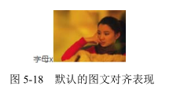

由于是相对字母 x 的下边缘对齐，而中文和部分英文字形的下边缘要低于字母 x 的下边缘，因此，会给人感觉文字是明显偏下的，一般都会进行调整。比方说，我们给文字内容设置 vertical-align:10px，则文字内容就会在当前基线位置再往上精确偏移 10px，效果如图 5-19 所示。

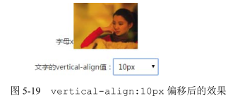

vertical-align 的数值属性值在实际开发的时候实用性非常强

- 其兼容性非常好
- 其可以精确控制内联元素的垂直对齐位置

假设有一个 display 值为 inline-block 的尺寸为 20 像素 ×20 像素的小图标，默认状态下，文字是明显偏下的，类似图 5-20 中“请选择”三个字和后面三角图形的位置关系。

这里，我们需要的是垂直居中对齐效果，所以很多人都使用具有强烈语义的 vertical-align:middle 控制图标的垂直位置，然而，由于 middle 并不是真正意义上的垂直居中，因此还是会有像素级别的误差，误差大小与字体和字号均有关。例如，在本例中，图标往下多偏移了 1 像素而导致容器的可视高度变成了 21 像素，如图 5-21 所示。


但是，如果我们使用精确的数值，则一切尽在掌控之中。例如，设置 vertical-align:-5px，此时，图标和文字实现了真正意义上的垂直居中，此时容器的可视高度和当前行高 20 像素保持了一致

在 CSS 世界中，凡是百分比值，均是需要一个相对计算的值，例如，margin 和 padding 是相对于宽度计算的，line-height 是相对于 font-size 计算的，而这里的 vertical-align 属性的百分比值则是相对于 line-height 的计算值计算的。可见，CSS 世界中的各类属性相互间有着紧密联系而非孤立的个体。

但是事实上，平时开发中很少使用。原因在于，在如今的网页布局中，line-height 的计算值都是相对固定并且已知的，因此，直接使用具体的数值反而更方便

## vertical-align 作用的前提

### 为什么我设置了 vertical-align 却没任何作用？

只能应用于内联元素以及 display 值为 table-cell 的元素，当然 CSS 世界中，有一些 CSS 属性值会在背后默默地改变元素 display 属性的计算值，从而导致 vertical-align 不起作用。比方说，浮动和绝对定位会让元素块状化，因此，下面的代码组合 vertical-align 是没有理由出现的：

```css
.example {
   float: left;
   vertical-align: middle; /* 没有作用 */
}

.example {
   position: absolute;
   vertical-align: middle; /* 没有作用 */
}
```

```html
<style>
   .box {
      height: 128px;
   }

   .box > img {
      height: 96px;
      vertical-align: middle;
   }
</style>
<div class="box">
   
</div>
```

此时图片顶着.box 元素的上边缘显示，根本没垂直居中，完全没起作用！

这种情况看上去是 vertical-align:middle 没起作用，实际上，vertical-align 是在努力地渲染的，只是行框盒子前面的“幽灵空白节点”高度太小，如果我们通过设置一个足够大的行高让“幽灵空白节点”高度足够，就会看到 vertical-align:middle 起作用了，CSS 代码如下：

```css
.box {
   height: 128px;
   line-height: 128px; /* 关键 CSS 属性 */
}

.box > img {
   height: 96px;
   vertical-align: middle;
}
```

### 为什么 display:table-cell 却可以无视行高？

那是因为对 table-cell 元素而言，vertical-align 起作用的是 table-cell 元素自身

```html
<style>
   .cell {
      height: 128px;
      display: table-cell;
   }

   .cell > img {
      height: 96px;
      vertical-align: middle;
   }
</style>
<div class="cell">
   
</div>
```

结果图片并没有要垂直居中的迹象，还是紧贴着父元素的上边缘

但是，如果 vertical-align:middle 是设置在 table-cell 元素上，图片就居中了

```css
.cell {
   height: 128px;
   display: table-cell;
   vertical-align: middle;
}

.cell > img {
   height: 96px;
}
```

虽然就效果而言，table-cell 元素设置 vertical-align 垂直对齐的是子元素，但是其作用的并不是子元素，而是 table-cell 元素自身

## vertical-align 和 line-height 之间的关系

最明显的就是 vertical-align 的百分比值是相对于 line-height 计算的，实际是只要出现内联元素，这对好朋友一定会同时出现

```html
<style>
   .box {
      line-height: 32px;
   }

   .box > span {
      font-size: 24px;
   }
</style>
<div class="box">
   <span>
      文字
   </span>
</div>
```

其中有一个很关键的点，那就是 24px 的 font-size 大小是设置在`<span>`元素上的，这就导致了外部`<div>`元素的字体大小和`<span>`元素有较大出入

大家一定还记得图 5-16。这里也是类似的，`<span>`标签前面实际上有一个看不见的类似字符的“幽灵空白节点”。看不见的东西不利于理解，因此我们不妨使用一个看得见的字符 x 占位，同时“文字”后面也添加一个 x，便于看出基线位置，于是就有如下 HTML：

```html
<div class="box">x<span>文字 x</span></div>
```

我们可以明显看到两处大小完全不同的文字。一处是字母 x 构成了一个“匿名内联盒子”，另一处是“文字 x”所在的`<span>`元素，构成了一个“内联盒子”。由于都受 line-height:32px 影响，因此，这两个“内联盒子”的高度都是 32px。下面关键的来了，对字符而言，font-size 越大字符的基线位置越往下，因为文字默认全部都是基线对齐，所以当字号大小不一样的两个文字在一起的时候，彼此就会发生上下位移，如果位移距离足够大，就会超过行高的限制，而导致出现意料之外的高度，如图 5-25 所示。


图 5-25 非常直观地说明了为何最后容器的高度会是 36px，而非 line-height 设置的 32px。

知道了问题发生的原因，那问题就很好解决了。我们可以让“幽灵空白节点”和后面`<span>`元素字号一样大，也就是

```css
.box {
   line-height: 32px;
   font-size: 24px;
}

.box > span {
}
```

或者改变垂直对齐方式，如顶部对齐，这样就不会有参差位移了：

```css
.box {
   line-height: 32px;
}

.box > span {
   font-size: 24px;
   vertical-align: top;
}
```

搞清楚了大小字号文字的高度问题，对更为常见的图片底部留有间隙的问题的理解就容易多了。现象是这样的：任意一个块级元素，里面若有图片，则块级元素高度基本上都要比图片的高度高

```css
.box {
   width: 280px;
   outline: 1px solid #aaa;
   text-align: center;
}
.box > img {
   height: 96px;
}
```

结果.box 元素的高度可能就会像图 5-26 一样，底部平白无故多了 5 像素。

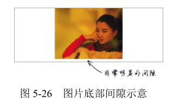

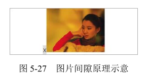

当前 line-height 计算值是 20px，而 font-size 只有 14px，因此，字母 x 往下一定有至少 3px 的半行间距（具体大小与字体有关），而图片作为替换元素其基线是自身的下边缘。根据定义，默认和基线（也就是这里字母 x 的下边缘）对齐，字母 x 往下的行高产生的多余的间隙就嫁祸到图片下面，让人以为是图片产生的间隙，实际上，是“幽灵空白节点”、line-height 和 vertical-align 属性共同作用的结果

解决方法如下：

1. 图片块状化。可以一口气干掉“幽灵空白节点”、line-height 和 vertical-align。
2. 容器 line-height 足够小。只要半行间距小到字母 x 的下边缘位置或者再往上，自然就没有了撑开底部间隙高度空间了。比方说，容器设置 line-height:0。
3. 容器 font-size 足够小。此方法要想生效，需要容器的 line-height 属性值和当前 font-size 相关，如 line-height:1.5 或者 line-height:150% 之类；否则只会让下面的间隙变得更大，因为基线位置因字符 x 变小而往上升了。
4. 图片设置其他 vertical-align 属性值。间隙的产生原因之一就是基线对齐，所以我们设置 vertical-align 的值为 top、middle、bottom 中的任意一个都是可以的。

### 内联特性导致的 margin 无效的案例

```html
<div class="box">
   
</div>
<style>
   .box > img {
      height: 96px;
      margin-top: -200px;
   }
</style>
```

此时，按照理解，-200px 远远超过图片的高度，图片应该完全跑到容器的外面，但是，图片依然有部分在.box 元素中，而且就算 margin-top 设置成-99999px，图片也不会继续往上移动，完全失效。其原理和上面图片底部留有间隙实际上是一样的，图片的前面有个“幽灵空白节点”，而在 CSS 世界中，非主动触发位移的内联元素是不可能跑到计算容器外面的，导致图片的位置被“幽灵空白节点”的 vertical-align:baseline 给限死了。

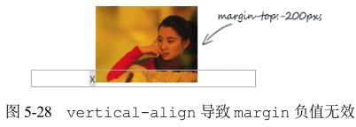

因为字符 x 下边缘和图片下边缘对齐，字符 x 非主动定位，不可能跑到容器外面，所以图片就被限死在此问题，margin-top 失效。

### text-align:jusitfy 声明

text-align:jusitfy 声明可以帮助我们实现兼容的列表两端对齐效果，但是 text-align:jusitfy 两端对齐需要内容超过一行，同时为了让任意个数的列表最后一行也是左对齐排列，我们需要在列表最后辅助和列表宽度一样的空标签元素来占位，类似下面 HTML 代码的`<i>`标签

```html
<style>
   .box {
      text-align: justify;
   }
   .justify-fix {
      display: inline-block;
      width: 96px;
   }
</style>
<div class="box">
   
   
   
   
   <i class="justify-fix"></i>
   <i class="justify-fix"></i>
   <i class="justify-fix"></i>
</div>
```

空的 inline-block 元素的高度是 0，按照通常的理解，下面应该是一马平川，结果却有非常大的空隙存在，如图 5-29 所示


为了便于大家看个究竟，我把占位`<i>`元素的 outline 属性用虚外框标示一下，此时效果如图 5-30 所示。

结果发现，上面巨大的空隙是由占位`<i>`元素上面和下面的间隙共同组成的。

很多时候，复杂问题是由简单问题组合而成的。实际上，这里的间隙现象和上面的图片间隙现象本质一样，都是 vertical-align 和 line-height 共同作用的结果。

按照之前解决问题的方法，我们可以直接给.box 元素来个 line-height:0 解决垂直间隙问题，结果，这样设置之后的效果却如图 5-31 所示。图片和图片之间的间隙是没有了，但是图片和最后的占位元素之间依然有几像素的间距，真有些让人抓狂了。这究竟是为什么？

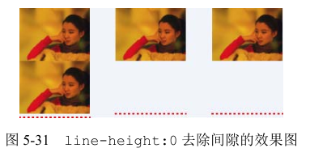

这就要理解 inline-block 元素和基线 baseline 之间的一些关系

## 深入理解 vertical-align 线性类属性值

### inline-block 与 baseline

vertical-align 属性的默认值 baseline 在文本之类的内联元素那里就是字符 x 的下边缘，对于替换元素则是替换元素的下边缘。但是，如果是 inline-block 元素，则规则要复杂了：一个 inline-block 元素，如果里面没有内联元素，或者 overflow 不是 visible，则该元素的基线就是其 margin 底边缘；否则其基线就是元素里面最后一行内联元素的基线。

两个同尺寸的 inline-block 水平元素，唯一区别就是一个是空的，一个里面有字符，代码如下：

```html
<style>
   .dib-baseline {
      display: inline-block;
      width: 150px;
      height: 150px;
      border: 1px solid #cad5eb;
      background-color: #f0f3f9;
   }
</style>
<span class="dib-baseline"> </span>
<span class="dib-baseline">
   x-baseline
</span>
```


你会发现，明明尺寸、display 水平都是一样的，结果两个却不在一个水平线上对齐，为什么呢？上面的规范已经说明了一切。第一个框里面没有内联元素，因此基线就是容器的 margin 下边缘，也就是下边框下面的位置；而第二个框里面有字符，纯正的内联元素，因此第二个框就是这些字符的基线，也就是字母 x 的下边缘了。于是，我们就看到了左边框框下边缘和右边框框里面字符 x 底边对齐的好戏。

同情境模拟，我们也设置右边框的 line-height 值为 0，于是就有所图 5-33 所示的表现。

因为字符实际占据的高度是由 line-height 决定的，当 line-height 变成 0 的时候，字符占据的高度也是 0，此时，高度的起始位置就变成了字符内容区域的垂直中心位置，于是文字就有一半落在框的外面了。由于文字字符上移了，自然基线位置（字母 x 的底边缘）也往上移动了，于是两个框的垂直落差就更大了。

紧接着上面的复杂例子，如果我们在最后一个占位的`<i>`元素后面新增同样的 x-baseline 字符，则结果如图 5-34 所示。


现在行高 line-height 是 0，则字符 x-baseline 行间距就是-1em，也就是高度为 0，由于 CSS 世界中的行间距是上下等分的，因此，此时字符 x-baseline 的对齐点就是当前内容区域（可以看成文字选中背景区域，如图 5-35 所示，截自 Firefox 浏览器）的垂直中心位置。由于图 5-34 中的 x-baseline 使用的是微软雅黑字体，字形下沉明显，因此，内容区域的垂直中心位置大约在字符 x 的上面 1/4 处，而这个位置就是字符 x-baseline 和最后一行图片下边缘交汇的地方


理解了 x-baseline 的垂直位置表现，间隙问题就很好理解了。由于前面的`<i class="justify-fix"></i>`是一个 inline-block 的空元素，因此基线就是自身的底部，于是下移了差不多 3/4 个 x 的高度，这个下移的高度就是上面产生的间隙高度。

好了，一旦知道了现象的本质，我们就能轻松对症下药了！要么改变占位`<i>`元素的基线，要么改造“幽灵空白节点”的基线位置，要么使用其他 vertical-align 对齐方式。

1. 改变占位`<i>`元素的基线。这个很简单，只要在空的`<i>`元素里面随便放几个字符就可以了。例如，塞一个空格`&nbsp`;
2. 改造“幽灵空白节点”的基线位置可以使用 font-size，当字体足够小时，基线和中线会重合在一起。什么时候字体足够小呢？就是 0。于是，如下 CSS 代码（line-height 如果是相对 font-size 的属性值，line-height:0 也可以省掉），看上去好像效果类似，都是没有间隙，但是 font-size:0 下的各类对齐效果都更彻底。
3. 使用其他 vertical-align 对齐方式就是让`<i>`占位元素 vertical-align:top/bottom 之类，当前，前提还是先让容器 line-height:0

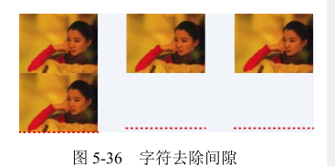

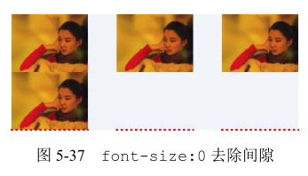

准确了解 inline-block 与 baseline 之间多变的关系，除了便于理解一些令人抓狂的现象外，还可以专门利用其来简化我们的开发，比方说一直很头疼的背景小图标和文字对齐的问题。我这里再给大家介绍一个 vertical-align 负值以外的其他处理技巧。

例如，要删除一个小图标，通常的做法无非是下面两种：

```html
<i class="icon-delete"></i> 删除
```

或者直接一个按钮图标，里面包含文本内容，保证可访问性：

```html
<i class="icon-delete">删除</i>
```

而以上两种实现基本上图标元素的基线都是元素的下边缘，之前讲过 inline-block 元素的基线规则：一个 inline-block 元素，如果里面没有内联元素，或者 overflow 不是 visible，则该元素的基线就是其 margin 底边缘。

第一种做法中，`<i class="icon-delete"></i>`是一个空标签，里面无内联元素，因此，基线是底边缘；而第二种做法中，虽然里面有文字，但是此文字是不显示的，因此开发者习惯设置 overflow:hidden，这又导致基线是底边缘。而正是由于基线是元素底边缘，才导致图标和文字默认严重不对齐, 但是，我们不妨反过来试想下，如果图标和后面的文字高度一致，同时图标的基线和文字基线一样，那岂不是图标和文字天然对齐，根本就不需要 margin 或 vertical-align 的垂直偏移了？

基于 20px 图标对齐的处理技巧，该技巧有下面 3 个要点。

1. 图标高度和当前行高都是 20px。
2. 图标标签里面永远有字符
3. 图标 CSS 不使用 overflow:hidden 保证基线为里面字符的基线，但是要让里面潜在的字符不可见。

于是，最终形成的最佳图标实践 CSS 如下：

```css
.icon {
   display: inline-block;
   width: 20px;
   height: 20px;
   background: url(sprite.png) no-repeat;
   white-space: nowrap;
   letter-spacing: -1em;
   text-indent: -999em;
}

.icon:before {
   content: '\3000';
}

/* 具体图标 */
.icon-xxx {
   background-position: 0 -20px;
}
```

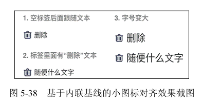

可以看到，小图标和文字对齐完全不受 font-size 大小的影响。可以说，整个网站所有小图标的对齐问题都可以解决了，节省了大量 CSS 代码，降低了大量开发和维护成本，是个好处非常明显的处理技巧。

### 了解 vertial-align:top/bottom

顾名思义，vertial-align:top 就是垂直上边缘对齐，具体定义如下

- 内联元素：元素底部和当前行框盒子的顶部对齐
- table-cell 元素：元素底 padding 边缘和表格行的顶部对齐。

用更通俗的话解释就是：如果是内联元素，则和这一行位置最高的内联元素的顶部对齐；如果 display 计算值是 table-cell 的元素，我们不妨脑补成`<td>`元素，则和`<tr>`元素上边缘对齐。

已知一个`<div>`元素中有两张图片，其中后面一张图片设置了 vertial-align:bottom，请问这两张图片的底边缘是对齐的吗？

不是对齐的。因为图片所在行框盒子的最低点是“幽灵空白节点”的底部，所以最后的表现会如图 5-39 所示。

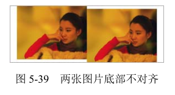

### vertial-align:middle 与近似垂直居中

line-height 和 vertial-align: middle 实现的多行文本或者图片的垂直居中全部都是“近似垂直居中”，原因与 vertial-align:middle 的定义有关。

- 内联元素：元素的垂直中心点和行框盒子基线往上 1/2 x-height 处对齐。
- table-cell 元素：单元格填充盒子相对于外面的表格行居中对齐。

vertial-align:middle 可以让内联元素的真正意义上的垂直中心位置和字符 x 的交叉点对齐

基本上所有的字体中，字符 x 的位置都是偏下一点儿的，font-size 越大偏移越明显，这才导致默认状态下的 vertial-align:middle 实现的都是“近似垂直居中”。

为了更直观地表示上面的解释，其中，图片上线显示的是图片垂直中心位置，而贯穿整个容器的线就是容器的垂直中心位置，可以看到，默认状态下，两根线就不在一个水平线上，如图 5-40 所示。

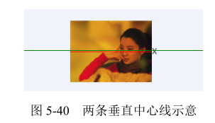

因为图片上的那根线趋向于和字符 x 的中心靠近，而不是容器的垂直中心。如果我们把 font-size 改大，如 48px，则效果更加明显，如图 5-41 所示。

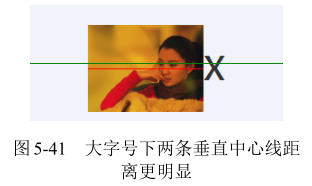

如果想要实现真正意义上的垂直居中对齐，只要想办法让字符 x 的中心位置就是容器的垂直中心位置即可，通常的做法是设置 font-size:0，整个字符 x 缩小成了一个看不见的点，根据 line-height 的半行间距上下等分规则，这个点就正好是整个容器的垂直中心位置，这样就可以实现真正意义上的垂直居中对齐了。

不过话又说回来，平常我们开发的时候，font-size 可能就 12px 或 14px，虽然最终的效果是“近似垂直居中”，但偏差也就 1px ～ 2px 的样子，普通用户其实是很难觉察到其中的差异的，因此，是否非要真正意义上垂直居中，还是要根据项目的实现情况权衡做出决策。

## 无处不在的 vertical-align

对于内联元素，如果大家遇到不太好理解的现象，请一定要意识到，有个“幽灵空白节点”以及无处不在的 vertical-align 属性。

虽然同属线性类属性值，但是 top/bottom 和 baseline/middle 却是完全不同的两个帮派，前者对齐看边缘看行框盒子，而后者是和字符 x 打交道。因此，细细考究，两者的行为表现实则大相径庭，一定要注意区分。

## 基于 vertical-align 属性的水平垂直居中弹框

纯 CSS 实现大小不固定的弹框永远居中的效果，并且如果伪元素换成普通元素，连 IE7 浏览器都可以兼容。

其 HTML 结构很简单，一个 container，显示半透明背景，然后里面的子元素就是弹框主体，假设类名是.dialog，则 HTML 如下：

```html
<style>
  .container {
    position: fixed;
    top: 0;
    right: 0;
    bottom: 0;
    left: 0;
    background-color: rgba(0, 0, 0, .5);
    /* 水平居中 */
    text-align: center;
    /* 使vertical-align: middle;真正的居中，防止幽灵结点“x”的干扰 */
    font-size: 0;
    /* 阻止换行，为了:after伪元素和.dialog在同一行 */
    white-space: nowrap;
    /* 过长时滚动 */
    overflow: auto;
  }

  /* 参考实例“辅助实现两端对齐以及垂直居中、上边缘、下边缘对齐效果” */
  .container:after {
    content: '';
    display: inline-block;
    vertical-align: middle;
    height: 100%;
  }

  .dialog {
    display: inline-block;
    vertical-align: middle;
    text-align: left;
    font-size: 14px;
    /* 恢复换行 */
    white-space: normal;
  }
</style>
<div class="container">
  <div class="dialog"></dialog>
</div>
```

此时，无论浏览器尺寸是多大，也无论弹框尺寸是多少，我们的弹框永远都是居中的。

优点：

- 节省了很多无谓的定位的 JavaScript 代码，也不需要浏览器 resize 事件之类的处理，当弹框内容动态变化的时候，也无须重新定位。
- 性能更改、渲染速度更快，毕竟浏览器内置 CSS 的即时渲染显然比 JavaScript 的处理要更好。
- 可以非常灵活控制垂直居中的比例，比方说设置：

```css
.container:after {
   height: 90%;
}
```

则弹框不是垂直居中对齐，而是近似上下 2 : 3 这种感觉的对齐，反而会让人有视觉上居中的感觉。

- 容器设置 overflow:auto 可以实现弹框高度超过一屏时依然能看见屏幕外的内容，传统实现方法则比较尴尬。

这里的技巧还有一个关键点是半透明黑色蒙层和弹框元素是在一起的父子关系

此方法实现的原理关键就是两个 vertical-align:middle，前面“图片近似垂直居中”那里只图片一个元素 vertical-align:middle 就实现了垂直居中，原因就是 line-height 大小设置得恰到好处，但是对于弹框，高度不确定，显然不能使用某个具体的行高值创建足够高的内联元素。于是，这里借助伪元素创建了一个和外部容器一样高的宽度为 0 的 inline-block 元素。有种“幽灵空白节点”的感觉

下面是原理作用的关键部分，在 5.3.7 节讲过如何分析多个 vertical-align 的作用，根据定义专注当前元素即可。vertical-align:middle 定义是元素的中线和字符 x 中心点对齐。

1. 在本例中，由于 font-size 设置为 0，所以 x 中心点位置就是 .container 的上边缘，此时，高度 100% 的宽度为 0 的伪元素和这个中心点对齐。如果中心点位置不动，这个伪元素上面一半的位置应该在.container 的外面，但是 CSS 中默认是左上方排列对齐的，所以，伪元素和这个原本在容器上边缘的 x 中心点一起往下移动了半个容器高度，也就是此时 x 中心点就在容器的垂直中心线上。
2. 弹框元素 .dialog 也设置了 vertical-align:middle。根据定义，弹框的垂直中心位置和 x 中心点位置对齐，此时，x 中心点就在容器的垂直中心位置，于是 .dialog 元素就和容器的垂直中心位置对齐了，从而实现了垂直居中效果。
3. 水平居中就 text-align:center 实现，非常好理解。

按照初衷，块级元素负责布局，内联元素设置内容。但是，这里的弹框居中却是把块级元素内联化，利用一些内联属性实现垂直居中效果，这也是不得已而为之，因为 vertical-align 等内联属性确实比块级属性强悍，也正因为 CSS 世界在布局上的弱势，后来多栏布局、弹性盒子布局以及栅格布局一个一个都出来补强了。
