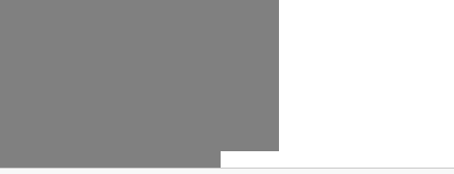
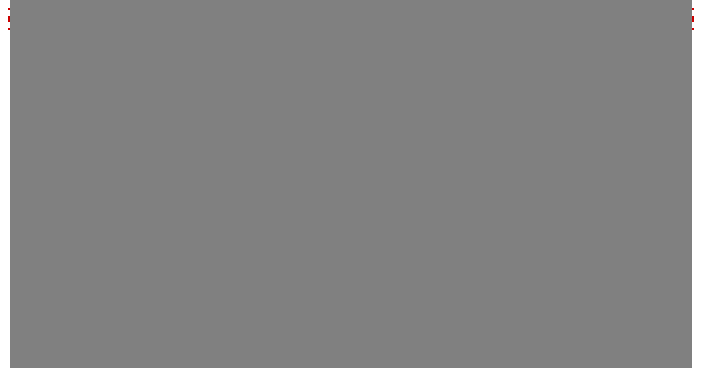
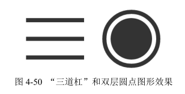
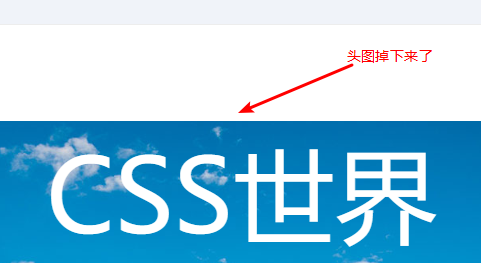
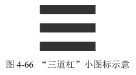
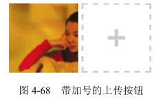

# 深入理解 content

## content 与替换元素

### 替换元素

- 根据外在盒子是内联还是块级，元素分为内联元素和块级元素，而根据是否具有可替换内容，我们也可以把元素分为替换元素和非替换元素
- 通过修改某个属性值呈现的内容就可以被替换的元素称为替换元素，例如 img、object、video、iframe 或者表单元素 textarea、input

#### 特性

1. 内容外观不受页面上 CSS 的影响，需要类似 appearance 属性或者浏览器暴露的一些样式接口
2. 有自己的尺寸，在没有明确规定尺寸的情况下，video、iframe、canvas 默认尺寸是 300\*150，img 默认为 0，表单元素尺寸则和浏览器有关，无统一标准
3. 在很多 CSS 属性上有自己的一套表现规则，比如 vertical-align 在非替换元素里是基线（字符 x 的下边缘），而替换元素中被定义成下边缘

### 替换元素默认 display 值

| 元素             | chrome       | Firefox      | IE           |
| :--------------- | :----------- | :----------- | :----------- |
| img              | inline       | inline       | inline       |
| iframe           | inline       | inline       | inline       |
| video            | inline       | inline       | inline       |
| select           | inline-block | inline-block | inline-block |
| input            | inline-block | inline       | inline-block |
| range file input | inline-block | inline-block | inline-block |
| hidden input     | none         | none         | none         |
| button           | inline-block | inline-block | inline-block |
| textarea         | inline-block | inline       | inline-block |

其中可以发现 IE 和 chrome 基本一致，Firefox 在替换元素的内联表现有自己的想法

### 替换元素的尺寸计算规则

1. 固有尺寸：替换元素原本的尺寸
2. HTML 尺寸：HTML 原生属性，包括 img 的 width 和 height、input 的 size、textarea 的 cols 和 rows
3. CSS 尺寸：width 和 height 或者 max-height/min-height 和 max-width/min-width 设置的尺寸，对应盒尺寸的 content-box

优先级：CSS 尺寸>HTML 尺寸>固有尺寸

#### 例外情况

```html

```

以上 HTML 表示一个没有替换内容也没有尺寸设定的裸露的 img 元素，各个浏览器下的尺寸不同，IE 下是`28*30`，chrome 下是`0*0`，Firefox 下是 0\*22

这个即将被异步加载的图片为了布局稳健，往往会使用一张透明的图片占位，其实按照下面的不需要占位图也可以实现，注意 img 没有 src 属性，否则依然会请求，请求当前页面数据

```html
<!DOCTYPE html>
<html lang="en">
    <head>
        <meta charset="UTF-8" />
        <meta name="viewport" content="width=device-width, initial-scale=1.0" />
        <meta http-equiv="X-UA-Compatible" content="ie=edge" />
        <title>clearfix</title>
        <style>
            img {
                visibility: hidden;
            }

            img[src] {
                visibility: visible;
            }
        </style>
    </head>
    <body>
        
    </body>
</html>
```

对于 Firefox 浏览器，src 缺省的 img 不是替换元素，而是普通的内联元素，此时设置宽高会无效，需要给 img 设置 display:inline-block 属性，推荐在 CSS 重置时提前设置

证明图片的固有尺寸无法改变，可以看到图片依然是 200\*200 不改变

<iframe src="/examples/image-fix-size.html" width="400" height="100"></iframe>

`embed:image-fix-size.html`

通过 object-fit 可以改变 content 替换内容的适配方式，img 默认适配方式是填充（fill），这就是为什么设定图片 height 和 width 会影响图片的尺寸，上例的非替换元素::before 尺寸表现和 object-fit:none 类似，图片尺寸不受 CSS 控制

### 替换元素和非替换元素转换

#### src

Firefox 下的``、chrome 下``是一个普通的内联标签，成为了非替换元素；

基于伪元素的图片内容生成技术

1. 不能有 src 属性（证明观点的关键所在）
2. 不能使用 content 属性生成图片（针对 chrome）
3. 需要有 alt 属性并有值（针对 chrome）
4. Firefox 下::before 伪元素的 content 值会被无视，::after 无此问题，应该与 Firefox 自己占用了有关

<iframe src="/examples/image-alt-show.html" width="400" height="100"></iframe>

`embed:image-alt-show.html`

#### content

img 可以用 content 属性来生成图片

hover 实现另一张图片

<iframe src="/examples/image-hover-content.html" width="400" height="100"></iframe>

`embed:image-hover-content.html`

网站名称和标志图片使用背景图，在不改变 html 的情况下（为了 SEO）改变背景图

<iframe src="/examples/h1-content-image.html" width="400" height="100"></iframe>

`embed:h1-content-image.html`

上述的文字虽然被替换了，但在移动端 Retina 清晰度不足，导致图片模糊，应尽量采用 svg 图片

### content 与替换元素关系剖析

content 属性生成的对象称为"匿名替换元素"，也就是生成的替换元素

表现的特征为：

1. content 生成的文本是无法选中、无法复制的、无法 SEO，仅用来生成一些无关紧要的内容，如装饰性图形或序号之类
2. :empty 伪类忽略 content 生成的内容
3. content 动态生成值无法获取

<iframe src="/examples/content-empty-class.html" width="400" height="100"></iframe>

`embed:content-empty-class.html`

```css
/* 动态生成值 */
.total::after {
    content: counter(icecream);
}
```

## content 内容生成技术

IE 浏览器仅支持单冒号的伪元素，为了兼容性，下面内容全部使用单冒号

### content 辅助元素生成

#### 清除浮动带来的影响

```css
.clear:after {
    content: '';
    display: table; /*或者是block*/
    clear: both;
}
```

#### 辅助实现两端对齐以及垂直居中、上边缘、下边缘对齐效果

<iframe src="/examples/content-auto-divide.html" width="400" height="100"></iframe>

`embed:content-auto-divide.html`

:before 用于实现底对齐，:after 伪元素用于辅助实现两端对齐

### content 字符内容生成

#### 生成专用图标

<iframe src="/examples/content-font-face.html" width="400" height="100"></iframe>

`embed:content-font-face.html`

#### 插入换行实现某些布局或效果

```css
:after {
    /* LF字符，指代换行，还有CR指代回车 */
    content: '\A';
    white-space: pre;
}
```

#### 实现正在加载中

<iframe src="/examples/content-LF-loading.html" width="400" height="100"></iframe>

`embed:content-LF-loading.html`

1. 为什么使用 dot 这个元素

- dot 是自定义的一个标签元素，除了简约，语义化明显之外，更重要的是方便向下兼容，IE8 不认识此标签，因此会只显示默认的 3 个点，对 CSS 代码完全忽略

2. 为什么使用::before，不用::after

- 伪元素使用 before 同时 display 设置 block，是为了在高版本浏览器下原来的 3 个点推到最下面，不会影响 content 的 3 行内容显示，如果使用 after 很难实现

3. 为什么 3 个点在第一行

- 第 3 个点在第一行的目的在于兼容 IE9 浏览器，因为 IE9 浏览器认识 dot 以及 before，但是不支持 animation 属性，所以为了 IE9 能正常显示，把 3 个点放在第一行

4. white-space 为何使用的是 pre-wrap

- 效果相同，不必深究，后面会介绍

### content 图片生成

直接用 url 功能符生成图片，虽然支持 png、jpg、ico、svg 以及 base64，但生成的图片的宽高无法改变图片的固有尺寸，此时更多的是用 background-image 模拟，类似这样

```css
div:before {
    content: '';
    background: url(1jpg);
}
```

content 生成图片的意义在于 base64 位图片，由于它内联在 CSS 文件中，因此直接出现，没有尺寸为 0 的状态，同时无须设置 display:block，不会出现页面加载的晃动情况

<iframe src="/examples/content-image-base64.html" width="400" height="100"></iframe>

`embed:content-image-base64.html`

### content 开启闭合符号生成

```css
.ask:before {
    content: '提问："';
}

.answer:before {
    content: '回答："';
}

.ask:after,
.answer:after {
    content: '"';
}
```

相当于

```css
.ask {
    quotes: '提问："' '"';
}

.answer {
    quotes: '回答: "' '"';
}

.ask:before,
.answer:before {
    content: open-quote;
}

.ask:after,
.answer:after {
    content: close-quote;
}
```

### content attr 属性值内容生成

前面 alt 属性显示图片描述信息的例子，还有可以生成自定义的 HTML 属性

```css
.icon:before {
    content: attr(data-title);
}
```

### 深入理解 content 计数器

#### counter-reset

计数器重置，默认是 0，可以是负数，可以多个技术器同时命名，空格分隔，还可以设置为 none 或 inherit

```css
/* 显示23 */
.xxx {
    /* 有两个计数器分别是wangxiaoer初始值为2，wangxiaosan初始值为3 */
    counter-reset: wangxiaoer 2 wangxiaosan 3;
}
```

#### counter-increment

计数器递增，值为 counter-reset 的 1 个或多个关键字，后面跟数字，表示每次递增的值，省略时默认为 1

普照规则：普照源唯一（counter-reset），每普照一次（counter-increment）一次，普照源增加一次计数值

```css
/*显示3，不是2，counter-increment默认值起作用，父类普照一次*/
.counter {
    counter-reset: wangxiaoer 2;
    counter-increment: wangxiaoer;
}

.counter:before {
    content: counter(wangxiaoer);
}
```

```css
/* 显示4，父类普照1，子类普照1次 */
.counter {
    counter-reset: wangxiaoer 2;
    counter-increment: wangxiaoer;
}

.counter:before {
    content: counter(wangxiaoer);
    counter-increment: wangxiaoer;
}
```

```css
/* 显示34，子类分别普照一次，累加 */
.counter {
    counter-reset: wangxiaoer 2;
}

.counter:before,
.counter:after {
    content: counter(wangxiaoer);
    counter-increment: wangxiaoer;
}
```

```css
/* 显示31 */
.counter {
    counter-reset: wangxiaoer 2 wangxiaosan 3;
    counter-increment: wangxiaoer wangxiaosan -2;
}

.counter:before {
    content: counter(wangxiaoer);
}

.counter:after {
    content: counter(wangxiaosan);
}
```

#### counter()/counters()

- counter(name,style)，style 有许多值，可以支持英文字母或罗马数字（lower-roman）
- 一个 content 可以有多个 counter 方法
- counters(name,string,style)嵌套计数专用，比如子序号 1.1、1.2、1.3，见打开的文章目录，就是应用此技术
- 显示 cotent 计数值的 DOM 元素一定要在 counter-increment 后面，否则没有计数效果

<iframe src="/examples/content-counters-catalog.html" width="400" height="100"></iframe>

`embed:content-counters-catalog.html`

### content 内容生成的混合特性

各种 content 内容生成可以混合在一起使用

```css
a:after {
    content: '(' attr(href) ')';
}

q:before {
    content: open-quote url(1jpg);
}

.counter:before {
    content: counters(wangxiaoer, '-') '. ';
}
```

# 温和的 padding 属性

## padding 与元素尺寸

### padding 与 box-sizing

因为 CSS 默认的 box-sizing 是 content-box，所以使用 padding 会增加元素尺寸，不推荐使用全局重置 box-sizing:border-box 方法，尽量使用之前提到的无宽度以及宽度分离的准则实现

如果设置了 box-sizing:border-box，元素尺寸还是可能会变化，如果 padding 足够大，那么 width 也无能为力

```css
.box {
    width: 80px;
    padding: 20 60px;
    box-sizing: border-box;
}
```

则此时的 width 会无效，最终宽度还是 120px，满足`首选最小宽度`原则

### padding 在内联元素中垂直方向上的影响

上述的尺寸表现是对于具有块状特性的元素而言的，对于内联元素 padding 在水平和垂直方向同样会影响到布局，只不过内联元素垂直方向上的表现完全受 line-height 和 vertical-align 的影响，视觉感受上 padding 没有起作用，见下例说明一切

<iframe src="/examples/padding-inline-vertical.html" width="400" height="100"></iframe>

`embed:padding-inline-vertical.html`

上面只是垂直方向上发生了层叠，对上下元素的布局没有影响，类似的还有 relative 元素的定位、盒阴影 box-shadow 以及 outline 等

### 层叠的分类

层叠分为两类

1. 纯视觉层叠，不影响外部尺寸
2. 会影响外部尺寸

box-shadow 以及 outline 属于前者，而这里的 inline 元素的 padding 层叠属于后者；区分方式很简单，如果父容器 overflow:auto，层叠区域超出父容器的时候没有滚动条出现，则是纯视觉的；反之则会影响尺寸，影响布局

### 内联元素 padding 的应用

#### 增加可点击区域

在不影响当前布局的情况下，增加可点击区域的大小，为了在移动端更好的点击，增加垂直方向上的 padding 高度

#### 实现高度可控的分隔线

使用`|`高度会不可控，如果对视觉要求比较高，需要用 CSS 模拟

<iframe src="/examples/inline-padding-realize-pipe.html" width="400" height="100"></iframe>

`embed:inline-padding-realize-pipe.html`

#### 锚点定位时希望标题与页面顶部有距离

试试使用内联元素，块级元素设置 padding-top:50px 会影响布局，但是内联元素不会

假设这是原来的实现：

```html
<h3 id="hash">标题</h3>
<style>
    h3 {
        line-height: 30px;
        font-size: 14px;
    }
</style>
```

可以改为：

```html
<h3><span id="hash">标题</span></h3>
<style>
    h3 {
        line-height: 30px;
        font-size: 14px;
    }

    h3 > span {
        padding-top: 58px;
    }
</style>
```

如果 h3 设置了 overflow:hidden，则 IE 浏览器会定位在 h3 标签位置

实际上，对于非替换元素的内联元素，不仅 padding 不会加入到行盒高度的计算，margin 和 border 也是如此，但实际上在内联盒周围发生了渲染

## padding 的百分比值

1. padding 属性不支持负值，margin 支持
2. 支持百分比值，无论在水平还是垂直方向都是相对于宽度计算的，与 height 等属性的计算规则不同

> 可能要按照高度计算的话大多数情况为 0，还不如按相对宽度计算，因为 CSS 默认的是水平流，计算值会一直有效

### 应用场景

#### 实现不同比例的矩形效果

```css
div {
    padding: 50%;
}

div {
    padding: 25% 50%;
}
```

#### 小屏幕头图高度等比例缩小

```css
.box {
    padding: 10% 50%;
    position: relative;
}

.box > img {
    position: absolute;
    width: 100%;
    left: 0;
    top: 0;
}
```

实现了一个宽高比为 5:1 的比例固定的头图效果

以上百分比值是应用在具有块状特性的元素上的，如果是内联元素则表现为

- 同样对于宽度计算
- 默认的高度与宽度细节有差异
- padding 会断行

### 内联元素的 padding 断行

```html
<style>
    .box {
        border: 2px dashed #cd0000;
    }
    span {
        padding: 50%;
        background-color: gray;
    }
</style>
<div class="box">
    <span>内有文字若干</span>
</div>
```




效果如上图所示，诡异之处有：

1. 内字不见了
2. 有文字若居右显示
3. 背景区域非矩形，右下角缺了一块
4. 背景色宽度与外部容器宽度不一致

对于内联元素，其 padding 是会断行的，也就是 padding 区域是跟着内联盒模型中的行框盒子走的，上面的例子由于文字比较多，一行显示不了，于是干字换到下一行，于是原本的 padding 区域也跟着一起掉下来，根据后来居上的层叠规则，内字正好被覆盖，于是看不见了；同时，规则的矩形区域因为换行，也变成了五条边；至于宽度和外部容器盒子不一样宽，因为有 6 个字实际宽度是容器宽度和这 6 个字的总和，换行后的宽度和容器宽度一样的概率很小。

还有一种情况是假如是空的内联元素，里面没有任何文字，仅有一个 span 标签：

```html
<style>
    .box {
        border: 2px dashed #cd0000;
    }

    span {
        padding: 50%;
        background-color: gray;
    }
</style>
<div class="box">
    <span />
</div>
```



此时会发现宽高度不相等，原因是因为幽灵空白节点的显现

由于内联元素的高度完全受 font-size 大小控制，只要如下方法宽高即可一致

```css
span {
    padding: 50%;
    font-size: 0;
    background-color: gray;
}
```

## 标签元素内置的 padding

1. ol、ul 列表内置 padding-left 单位是 px 不是 em，导致字体比较大时项目符号可能跑到 ol、ul 外面，当然用 content 计数器模拟是更好的选择
2. 很多表单元素都内置 padding

- 所有浏览器 input、textarea 输入框内置 padding
- 所有浏览器 button 按钮内置 padding
- 部分浏览器 select 下拉内置 padding
- 所有浏览器 redio、checkbox 单复选框无内置 padding
- button 按钮元素的 padding 最难控制

1. 设置 padding: 0 不同浏览器下不同
2. 按钮 padding 与高度计算不同浏览器下千差万别，这使得很少用原生的 button

有一个可以保留良好的语义，同时 UI 效果兼容性效果好的实现小技巧，那就是 label 元素

```html
<button id="btn"></button>
<label for="btn">按钮</label>
<style>
    button {
        position: absolute;
        clip: rect(0 0 0 0);
    }

    label {
        display: inline-block;
        line-height: 20px;
        padding: 10px;
    }
</style>
```

## padding 与图形绘制

padding 属性和 background-clip 属性配合，可以在有限的标签下实现一些 CSS 图形绘制效果

### 不使用伪元素，仅一层标签实现大队长的“三道杠”分类图标效果

```css
.icon-menu {
    display: inline-block;
    width: 140px;
    height: 10px;
    padding: 35px 0;
    border-top: 10px solid;
    border-bottom: 10px solid;
    background-color: currentColor;
    background-clip: content-box;
}
```

### 不使用伪元素，仅一层标签实现双层圆点效果

```css
.icon-dot {
    display: inline-block;
    width: 100px;
    height: 100px;
    padding: 10px;
    border: 10px solid;
    border-radius: 50%;
    background-color: currentColor;
    background-clip: content-box;
}
```



# 激进的 margin 属性

padding 性格温和，负责内间距；而 margin 则比较激进，负责外间距。虽然都是间距，但是差别相当大，尤其是 margin，特异之处相当多。

## margin 与元素尺寸以及相关布局

### 元素尺寸的相关概念

- 元素尺寸: 对应 jQuery 中的 `$().width()` 和 `$().height()` 方法，包括 padding 和 border，也就是元素的 border box 的尺寸。在原生的 DOM API 中写作 offsetWidth 和 offsetHeight，所以，有时候也成为“元素偏移尺寸”。
- 元素内部尺寸：对应 jQuery 中的 `$().innerWidth()` 和 `$().innerHeight()` 方法，表示元素的内部区域尺寸，包括 padding 但不包括 border，也就是元素的 paddingbox 的尺寸。在原生的 DOM API 中写作 clientWidth 和 clientHeight，所以，有时候也称为“元素可视尺寸”。
- 元素外部尺寸：对应 jQuery 中的 `$().outerWidth(true)` 和 `$().outerHeight(true)` 方法，表示元素的外部尺寸，不仅包括 padding 和 border，还包括 margin，也就是元素的 margin box 的尺寸。没有相对应的原生的 DOM API

“外部尺寸”有个很不一样的特性，就是尺寸的大小有可能是负数。

### margin 与元素的内部尺寸

margin 同样可以改变元素的可视尺寸，但是和 padding 几乎是互补态势

对于 padding，元素设定了 width 或者保持“包裹性”的时候，会改变元素可视尺寸；但是对于 margin 则相反，元素设定了 width 值或者保持“包裹性”的时候，margin 对尺寸没有影响，只有元素是“充分利用可用空间”状态的时候，margin 才可以改变元素的可视尺寸

只要元素的尺寸表现符合“充分利用可用空间”，无论是垂直方向还是水平方向，都可以通过 margin 改变尺寸。

CSS 世界默认的流方向是水平方向，因此，对于普通流体元素，margin 只能改变元素水平方向尺寸；但是，对于具有拉伸特性的绝对定位元素，则水平或垂直方向都可以，因为此时的尺寸表现符合“充分利用可用空间”。

#### 如果图片左侧定位

```html
<style>
    .box {
        overflow: hidden;
    }

    .box > img {
        float: left;
    }

    .box > p {
        margin-left: 140px;
    }
</style>
<div class="box">
    
    <p>文字内容...</p>
</div>
```

#### 如果图片右侧定位

```css
.box {
    overflow: hidden;
}

.box > img {
    float: right;
}

.box > p {
    margin-right: 140px;
}
```

html 文件标签的顺序与视觉表现上的不一致，这个可以借助 margin 负值实现

#### 如果图片右侧定位，同时顺序一致

```html
<style>
    .box {
        overflow: hidden;
    }

    .full {
        width: 100%;
        float: left;
    }

    .box > img {
        /* 必须有这个属性，否则看不到元素 */
        float: left;
        margin-left: -128px;
    }

    .full > p {
        margin-right: 140px;
    }
</style>
<div class="box">
    <div class="full">
        <p>文字内容...</p>
    </div>
    
</div>
```

#### margin 改变元素尺寸的特性来实现两端对齐布局效果

列表块两端对齐，一行显示 3 个，中间有 2 个 20 像素的间隙

假如我们使用浮动来实现：

```css
li {
    float: left;
    width: 100px;
    margin-right: 20px;
}
```


最右侧永远有个 20 像素的间隙, 无法完美实现两端对齐

解决办法：

- 不考虑 IE8，我们可以使用 CSS3 的 nth-of-type 选择器：

```css
li:nth-of-type(3n) {
    margin-right: 0;
}
```

- 考虑 IE8，给父容器添加 margin 属性，增加容器的可用宽度来实现

```css
ul {
    margin-right: -20px;
}
ul > li {
    float: left;
    width: 100px;
    margin-right: 20px;
}
```

此时`<ul>`的宽度就相当于 100%+20px，于是，第 3n 的`<li>`标签的 margin-right:20px 就多了 20 像素的使用空间，正好列表的右边缘就是父级`<ul>`容器 100% 宽度位置，两端对齐效果就此实现了


### margin 与元素的外部尺寸

对于普通块状元素，在默认的水平流下，margin 只能改变左右方向的内部尺寸，垂直方向则无法改变。如果我们使用 writing-mode 改变流向为垂直流，则水平方向内部尺寸无法改变，垂直方向可以改变。这是由 margin:auto 的计算规则决定的。

对于外部尺寸，margin 属性的影响则更为广泛，只要元素具有块状特性，无论有没有设置 width/height，无论是水平方向还是垂直方向，即使发生了 margin 合并，margin 对外部尺寸都着着实实发生了影响

#### margin-bottom 外部尺寸实现滚动容器的底部留白

padding 也有兼容性问题，如果容器可以滚动，在 IE 和 Firefox 浏览器下是会忽略 padding-bottom 值的，Chrome 等浏览器则不会。也就是说，在 IE 和 Firefox 浏览器下：

```html
<div style="height:100px; padding:50px 0;">
    
</div>
```

本质区别在于：Chrome 浏览器是子元素超过 content box 尺寸触发滚动条显示，而 IE 和 Firefox 浏览器是超过 padding box 尺寸触发滚动条显示

可以借助 margin 的外部尺寸特性来实现底部留白，只能使用子元素的 margin-bottom 来实现滚动容器的底部留白

```html
<div style="height:200px;">
    
</div>
```

#### margin 外部尺寸实现等高布局

使用 margin 负值实现：

```css
.column-box {
    overflow: hidden;
}

.column-left,
.column-right {
    margin-bottom: -9999px;
    padding-bottom: 9999px;
}
```

为什么可以等高的原因:

垂直方向 margin 无法改变元素的内部尺寸，但却能改变外部尺寸，这里我们设置了 margin-bottom:-9999px 意味着元素的外部尺寸在垂直方向上小了 9999px。默认情况下，垂直方向块级元素上下距离是 0，一旦 margin-bottom:-9999px 就意味着后面所有元素和上面元素的空间距离变成了-9999px，也就是后面元素都往上移动了 9999px。此时，通过神来一笔 padding-bottom:9999px 增加元素高度，这正负一抵消，对布局层并无影响，但却带来了我们需要的东西 — 视觉层多了 9999px 高度的可使用的背景色。但是，9999px 太大了，所以需要配合父级 overflow:hidden 把多出来的色块背景隐藏掉，于是实现了视觉上的等高布局效果。

不足之处：

1. 如果需要有子元素定位到容器之外，父级的 overflow:hidden 是一个棘手的限制
2. 当触发锚点定位或者使用 DOM.scrollIntoview()方法的时候，可能就会出现奇怪的定位问题

使用 border 和 table-cell 实现等高布局的优缺点：

前者优势在于兼容性好，没有锚点定位的隐患，不足之处在于最多 3 栏，且由于 border 不支持百分比宽度，因此只能实现至少一侧定宽的布局；table-cell 的优点是天然等高，不足在于 IE8 及以上版本浏览器才支持，所以，如果项目无须兼容 IE6、IE7，则推荐使用 table-cell 实现等高布局

上述 margin 对尺寸的影响是针对具有块状特性的元素而言的，对于纯内联元素则不适用。和 padding 不同，内联元素垂直方向的 margin 是没有任何影响的，既不会影响外部尺寸，也不会影响内部尺寸，对于水平方向，由于内联元素宽度表现为“包裹性”，也不会影响内部尺寸。

## margin 的百分比值

1. 和 padding 属性一样，margin 的百分比值无论是水平方向还是垂直方向都是相对于宽度计算的
2. 相对于 padding，margin 的百分比值的应用价值就低了一截：元素设置 margin 在垂直方向上无法改变元素自身的内部尺寸，往往需要父元素作为载体，由于 margin 合并的存在，垂直方向往往需要双倍尺寸才能和 padding 表现一致

```html
<style>
    .box {
        background-color: olive;
        overflow: hidden;
    }

    .box > div {
        margin: 50%;
    }
</style>
<div class="box">
    <div></div>
</div>
```

结果.box 是一个宽高比为 2:1 的橄榄绿长方形

## 正确看待 CSS 世界里的 margin 合并

### 什么是 margin 合并

块级元素的上外边距（margin-top）与下外边距（margin-bottom）有时会合并为单个外边距，这样的现象称为“margin 合并”

1. 块级元素，但不包括浮动和绝对定位元素，尽管浮动和绝对定位可以让元素块状化
2. 只发生在垂直方向，需要注意的是，这种说法在不考虑 writing-mode 的情况下才是正确的，严格来讲，应该是只发生在和当前文档流方向的相垂直的方向上。由于默认文档流是水平流，因此发生 margin 合并的就是垂直方向

### margin 合并的 3 种场景

#### 相邻兄弟元素 margin 合并

这是 margin 合并中最常见、最基本的

```html
<style>
    p {
        margin: 1em 0;
    }
</style>
<p>第一行</p>
<p>第二行</p>
```

则第一行和第二行之间的间距还是 1em，因为第一行的 margin-bottom 和第二行的 margin-top 合并在一起了，并非上下相加

#### 父级和第一个/最后一个子元素

```html
<div class="father">
    <div class="son" style="margin-top:80px;"></div>
</div>
<div class="father" style="margin-top:80px;">
    <div class="son"></div>
</div>
<div class="father" style="margin-top:80px;">
    <div class="son" style="margin-top:80px;"></div>
</div>
```

在默认状态下，以上 3 种设置是等效的



问题产生的原因就是这里的父子 margin 合并

那该如何阻止这里 margin 合并的发生呢？对于 margin-top 合并，可以进行如下操作（满足一个条件即可）：

- 父元素设置为块状格式化上下文元素；
- 父元素设置 border-top 值；
- 父元素设置 padding-top 值；
- 父元素和第一个子元素之间添加内联元素进行分隔。

对于 margin-bottom 合并，可以进行如下操作（满足一个条件即可）：

- 父元素设置为块状格式化上下文元素；
- 父元素设置 border-bottom 值；
- 父元素设置 padding-bottom 值；
- 父元素和最后一个子元素之间添加内联元素进行分隔；
- 父元素设置 height、min-height 或 max-height。

jQuery 中有个 `$().slideUp()` / `$().slideDown()` 方法，如果在使用这个动画效果的时候，发现这内容在动画开始或结束的时候会跳一下，那八九不离十就是布局存在 margin 合并。跳动之所以产生，就是因为 jQuery 的 slideUp 和 slideDown 方法在执行的时候会被对象元素添加 overflow:hidden 设置，而 overflow: hidden 会阻止 margin 合并，于是一瞬间间距变大，产生了跳动。

#### 空块级元素的 margin 合并

```html
<style>
    .father {
        overflow: hidden;
    }

    .son {
        margin: 1em 0;
    }
</style>
<div class="father">
    <div class="son"></div>
</div>
```

结果，此时.father 所在的这个父级`<div>`元素高度仅仅是 1em，因为.son 这个空`<div>`元素的 margin-top 和 margin-bottom 合并在一起了。这也是上一节 margin:50% 最终宽高比是 2:1 的原因，因为垂直方向的上下 margin 值合二为一了，所以垂直方向的外部尺寸只有水平方向的一半。

这种空块级元素的 margin 合并特性即使自身没有设置 margin 也是会发生的

### margin 合并的计算规则

1. 正正取大值
2. 正负值相加
3. 负负最负值

#### margin 合并的意义

CSS 世界的 CSS 属性是为了更好地进行图文信息展示而设计的，博客文章或者新闻信息是图文信息的典型代表，基本上离不开下面这些 HTML:

```html
<h2>文章标题</h2>
<p>文章段落 1...</p>
<p>文章段落 2...</p>
<ul>
    <li>列表 1</li>
    <li>列表 2</li>
    <li>列表 3</li>
</ul>
```

而这里的`<h2>`、`<p>`、`<ul>`默认全部都是有垂直方向的 margin 值的，而且单位全部都是 em。

HTML 标签默认内置的 CSS 属性值完全就是为了更好地进行图文信息展示而设计的。

父子 margin 合并的意义在于：在页面中任何地方嵌套或直接放入任何裸 `<div>`，都不会影响原来的块状布局。

```html
<!-- 好像设置在外面的div元素上一样 -->
<div style="margin-top:20px;"></div>
```

自身 margin 合并的意义在于可以避免不小心遗落或者生成的空标签影响排版和布局。

```html
<p>第一行</p>
<p></p>
<p></p>
<p></p>
<p></p>
<p>第二行</p>
```

等效于：

```html
<p>第一行</p>
<p>第二行</p>
```

## 深入理解 CSS 中的 margin:auto

margin:auto 的作用机制举例：

- 有时候元素就算没有设置 width 或 height，也会自动填充。

```html
<div></div>
```

- 有时候元素就算没有设置 width 或 height，也会自动填充对应的方位

```css
div {
    position: absolute;
    left: 0;
    right: 0;
}
```

此时`<div>`宽度就会自动填满包含块容器，如果设置 width 或 height，自动填充特性就会被覆盖

margin:auto 的填充规则如下。

1. 如果一侧定值，一侧 auto，则 auto 为剩余空间大小。
2. 如果两侧均是 auto，则平分剩余空间。

```css
.father {
    width: 300px;
}

.son {
    width: 200px;
    margin-right: 80px;
    margin-left: auto;
}
```

此时.son 的左右边距计算值是 20px、80px

由于 CSS 世界中 margin 的初始值大小是 0，因此，上面的例子如果 margin-right 缺失，实现的效果正好是块级元素的右对齐效果。

margin 属性的 auto 计算就是为块级元素左中右对齐而设计的，和内联元素使用 text-align 控制左中右对齐

居中对齐左右同时 auto 计算即可

```css
.son {
    width: 200px;
    margin-right: auto;
    margin-left: auto;
}
```

有时为什么明明容器定高、元素定高，margin:auto 却无法垂直居中？

```css
.father {
    height: 200px;
}

.son {
    height: 100px;
    margin: auto;
}
```

原因在于触发 margin:auto 计算有一个前提条件，就是 width 或 height 为 auto 时，元素是需要具有对应方向的自动填充特性的。比方说这里，假如说把.son 元素的 height:100px 去掉，.son 的高度会自动和父元素等高变成 200px 吗？显然不会！因此无法触发 margin:auto 计算，故而无法垂直居中。

垂直方向 margin 实现居中

- 使用 writing-mode 改变文档流的方向：

```css
.father {
    height: 200px;
    writing-mode: vertical-lr;
}

.son {
    height: 100px;
    margin: auto;
}
```

此时.son 就是垂直居中对齐的，但是这也带来另外的问题，就是水平方向无法 auto 居中了。

- 绝对定位元素的 margin:auto 居中

```css
.father {
    width: 300px;
    height: 150px;
    position: relative;
}

.son {
    position: absolute;
    top: 0;
    right: 0;
    bottom: 0;
    left: 0;
}
```

此时.son 这个元素的尺寸表现为“格式化宽度和格式化高度”，和`<div>`的“正常流宽度”一样，同属于外部尺寸，也就是尺寸自动填充父级元素的可用尺寸，此时我们给.son 设置尺寸。例如：

```css
.son {
    position: absolute;
    top: 0;
    right: 0;
    bottom: 0;
    left: 0;
    width: 200px;
    height: 100px;
}
```

此时宽高被限制，原本应该填充的空间就被空余了出来，这多余的空间就是 margin:auto 计算的空间，因此，如果这时候我们再设置一个 margin:auto：

```css
.son {
    position: absolute;
    top: 0;
    right: 0;
    bottom: 0;
    left: 0;
    width: 200px;
    height: 100px;
    margin: auto;
}
```

那么我们这个.son 元素就水平方向和垂直方向同时居中了。因为 auto 正好把上下左右剩余空间全部等分了，自然就居中！

## margin 无效情形解析

- display 计算值 inline 的非替换元素的垂直 margin 是无效的，虽然规范提到有渲染，但浏览器表现却未寻得一点踪迹，这和 padding 是有明显区别的。对于内联替换元素，垂直 margin 有效，并且没有 margin 合并的问题，所以图片永远不会发生 margin 合并
- 表格中的`<tr>`和`<td>`元素或者设置 display 计算值是 table-cell 或 table-row 的元素的 margin 都是无效的。但是，如果计算值是 table-caption、table 或者 inline-table 则没有此问题，可以通过 margin 控制外间距，甚至 ::first-letter 伪元素也可以解析 margin
- margin 合并的时候，更改 margin 值可能是没有效果的。以父子 margin 重叠为例，假设父元素设置有 margin-top:50px，则此时子元素设置 margin-top:30px 就没有任何效果表现，除非大小比 50px 大，或者是负值
- 绝对定位元素非定位方位的 margin 值“无效”。什么意思呢？很多时候，我们对元素进行绝对定位的时候，只会设置 1 ～ 2 个相邻方位。例如：

```css
img {
    top: 10%;
    left: 30%;
}
```

此时 right 和 bottom 值属于 auto 状态，也就是右侧和底部没有进行定位，此时，这两个方向设置 margin 值我们在页面上是看不到定位变化的。例如：

```css
img {
    top: 10%;
    left: 30%;
    margin-right: 30px;
}
```

此时 margin-right:30px 几乎就是摆设。是 margin 没起作用吗？实际上不是的，绝对定位元素任意方位的 margin 值无论在什么场景下都一直有效。譬如这个例子，假设``宽度 70%，同时父元素是具有定位属性，且 overflow 设置为 auto 的元素，则此时就会出现水平滚动条，因为 margin-right:30px 增加了图片的外部尺寸。

那为什么一般情况下没有效果呢？主要是因为绝对定位元素的渲染是独立的，普通元素和兄弟元素是心连心，你动我也动，但是绝对定位元素由于独立渲染无法和兄弟元素插科打诨，因此，margin 无法影响兄弟元素定位，所以看上去就“无效”。

- 定高容器的子元素的 margin-bottom 或者宽度定死的子元素的 margin-right 的定位“失效”。

我们先看例子：

```html
<div class="box">
    <div class="child"></div>
</div>
<style>
    .box {
        height: 100px;
    }

    .child {
        height: 80px;
        margin-bottom: 100px;
    }
</style>
```

这里，margin-bottom:100px 是不会在容器底部形成 100px 的外间距的，看上去就像是“失效”一样，同样的 HTML，CSS 代码如下：

```css
.box {
    width: 100px;
}

.child {
    width: 80px;
    margin-right: 100px;
}
```

此时，margin-right:100px 对元素的定位也没有任何影响，给人“无效”的感觉，实际上，这个现象的本质和上面绝对定位元素非对立方位 margin 值“无效”类似。原因在于，若想使用 margin 属性改变自身的位置，必须是和当前元素定位方向一样的 margin 属性才可以，否则，margin 只能影响后面的元素或者父元素。

例如，一个普通元素，在默认流下，其定位方向是左侧以及上方，此时只有 margin-left 和 margin-top 可以影响元素的定位。但是，如果通过一些属性改变了定位方向，如 float:right 或者绝对定位元素的 right 右侧定位，则反过来 margin-right 可以影响元素的定位，margin-left 只能影响兄弟元素。

在本例中，父容器只有一个子元素，因此没有影响兄弟元素的说法，加上要么定宽要么定高，右侧和底部无 margin 重叠，因此外部的元素也不会有任何布局上的影响，因此就给人“无效”的错觉，实际上是 margin 自身的特性导致，有渲染只是你看不到变化而已。

- 鞭长莫及导致的 margin 无效。我们直接看下面这个例子：

```html
<div class="box">
    
    <p>内容</p>
</div>
<style>
    .box > img {
        float: left;
        width: 256px;
    }

    .box > p {
        overflow: hidden;
        margin-left: 200px;
    }
</style>
```

其中的 margin-left:200px 是无效的，准确地讲，此时的`<p>`的 margin-left 从负无穷到 256px 都是没有任何效果的。要解释这里为何会无效，需要对 float 和 overflow 深入理解，而这两个属性都是后面的内容

- 内联特性导致的 margin 无效。我们直接看下面这个例子：

```html
<div class="box">
    
</div>
<style>
    .box > img {
        height: 96px;
        margin-top: -200px;
    }
</style>
```

这里的例子也很有代表性。一个容器里面有一个图片，然后这张图片设置 margin-top 负值，让图片上偏移。但是，随着我们的负值越来越负，结果达到某一个具体负值的时候，图片不再往上偏移了。比方说，本例 margin-top 设置的是-200px，如果此时把 margin-top 设置成-300px，图片会再往上偏移 100px 吗？不会！它会微丝不动，margin-top 变得无效了。要解释这里为何会无效，需要对 vertical-align 和内联盒模型有深入的理解，而 vertical-align 是后面的内容

# 功勋卓越的 border 属性

## 为什么 border-width 不支持百分比值

由语义和使用场景决定，语义方面在现实中边框不会随着设备的增大而增大，使用场景方面边框没有使用上的场景。还有其他的属性如 outline、box-shadow、text-shadow 等，都是不支持百分比值的，原因也与此类似

为什么 border 属性的默认宽度大小是 medium，也就是 3px

因为 border-style:double 至少 3px 才有效果

## 了解各种 border-style 类型

### border-style:none

```css
div {
    border: 10px;
} /* 无边框出现 */
div {
    border: red;
} /* 无边框出现 */
```

border-style 的默认值是 none, 故以上没有出现边框，而下面的 CSS 会出现 3 像素的边框

```css
div {
    border: solid;
} /* 有边框出现 */
```

平时我们使用 border-style:none 多出现在重置边框样式的时候，例如，实现一个没有下边框的边框效果：

```css
div {
    border: 1px solid;
    border-bottom: none;
}
```

也可以通过直接设置边框宽度为 0 进行重置：

```css
div {
    border: 1px solid;
    border-bottom: 0;
}
```

渲染性能高的写法：

```css
div {
    border: 1px solid;
    border-bottom: 0 none;
}
```

### border-style:dashed

兼容性的差异，基本上就只能当作虚框来用了

### border-style:dotted

虚点边框在表现上同样有兼容性差异，虽然规范上明确表示是个圆点，但是 Chrome 以及 Firefox 浏览器下虚点实际上是个小方点

### border-style:double

双线边框，顾名思义，即两根线且为实线。虽然平常使用少，但是其兼容性非常好。视觉表现为线框 — 透明线框


当边框宽度是 1px 和 2px 的时候，其表现和 border-style:solid 是一模一样的：当边框为 3px 的时候，才开始有双线边框的表现

border-style:double 的表现规则：双线宽度永远相等，中间间隔 ±1

等比例“三道杠”图标效果如下图所示。



CSS 代码如下：

```css
.icon-menu {
    width: 120px;
    height: 20px;
    border-top: 60px double;
    border-bottom: 20px solid;
}
```

## border-color 和 color

border-color 有一个很重要也很实用的特性，就是“border-color 默认颜色就是 color 色值”。具体来讲，就是当没有指定 border-color 颜色值的时候，会使用当前元素的 color 计算值作为边框色。



通常，正常思维下，我们都是使用 width/height 外加一个 background-color 绘制加号的，核心 CSS 代码如下：

```css
.add {
    border: 2px dashed #ccc;
}

.add:before,
.add:after {
    background: #ccc;
}

/* hover 变色 */
.add:hover {
    border-color: #06c;
}

.add:hover:before,
.add:hover:after {
    background: #06c;
}
```

功能没有任何问题，唯独当我们 hover 变色的时候，需要同时重置 3 处（元素本身以及两个伪元素）颜色。实际上，如果这里不是使用 background-color，而是使用 border 来绘制加号，则代码要简单得多，如下：

<iframe src="/examples/code-editor.html?html=%3Ca%20href%20class%3D%22add%22%20title%3D%22%u7EE7%u7EED%u4E0A%u4F20%22%3E%0A%20%20%u6DFB%u52A0%u56FE%u7247%0A%3C/a%3E&css=.add%20%7B%0A%20%20%20%20display%3A%20inline-block%3B%0A%20%20%20%20width%3A%2076px%3B%20height%3A%2076px%3B%0A%20%20%20%20color%3A%20%23ccc%3B%0A%20%20%20%20border%3A%202px%20dashed%3B%0A%20%20%20%20text-indent%3A%20-12em%3B%0A%20%20%20%20transition%3A%20color%20.25s%3B%0A%20%20%20%20position%3A%20relative%3B%0A%20%20%20%20overflow%3A%20hidden%3B%0A%7D%0A.add%3Ahover%20%7B%0A%20%20%20%20color%3A%20%2334538b%3B%0A%7D%0A.add%3A%3Abefore%2C%20.add%3A%3Aafter%20%7B%0A%20%20%20%20content%3A%20%27%27%3B%0A%20%20%20%20position%3A%20absolute%3B%0A%20%20%20%20top%3A%2050%25%3B%0A%20%20%20%20left%3A%2050%25%3B%0A%7D%0A.add%3A%3Abefore%20%7B%0A%20%20%20%20width%3A%2020px%3B%0A%20%20%20%20border-top%3A%204px%20solid%3B%0A%20%20%20%20margin%3A%20-2px%200%200%20-10px%3B%0A%7D%0A.add%3A%3Aafter%20%7B%0A%20%20%20%20height%3A%2020px%3B%0A%20%20%20%20border-left%3A%204px%20solid%3B%0A%20%20%20%20margin%3A%20-10px%200%200%20-2px%3B%0A%7D" width="400" height="200"></iframe>

可以看到，使用 border 实现，我们 hover 变色的时候，只需要重置 1 处，也就是重置元素本身的 color 就可以了。因为整个图形都是使用 border 绘制的，同时颜色缺省，所以所有图形颜色自动跟着一起变了

## border 与透明边框技巧

### 右下方 background 定位的技巧

在 CSS3 还没到来的时候，background 定位有一个比较大的局限性，就是只能相对左上角数值定位，不能相对右下角。假设现在有一个宽度不固定的元素，我们需要在距离右边缘 50 像素的位置设置一个背景图片，此时 background 属性就不好处理了：由于宽度不固定，所以无法通过设定具体数值来实现我们想要的效果，因为 background 是相对左上角定位的，我们的需求是右侧定位。

要实现上面的需求，方法挺多。其中一种方法就是使用透明边框，如下 CSS 代码：

```css
.box {
    border-right: 50px solid transparent;
    background-position: 100% 50%;
}
```

对 50px 的间距我们使用 transparent 边框表示，这样就可以使用百分比 background-position 定位到我们想要的位置了。因为，默认 background 背景图片是相对于 padding box 定位的，也就是说，background-position:100%的位置计算默认是不会把 border-width 计算在内的

### 优雅地增加点击区域大小

稳妥的方法是外部再嵌套一层标签，专门控制点击区域大小。如果对代码要求较高，则可以使用 padding 或者透明 border 增加元素的点击区域大小。

其中，首推透明 border 方法，原因很简单，假设我们的图标是使用工具生成的，那么 background-position 就是限定死的值，若再使用 padding 撑开间距，就会遇到定位不准的问题。但是，若是使用透明 border 增加点击区域，则无此问题，只要合并时留下足够的间距就可以了。

<iframe src="/examples/code-editor.html?html=%3Cinput%20id%3D%22search%22%20type%3D%22search%22%20value%3D%22%u6211%u662F%u521D%u59CB%u503C%22%20required%3E%0A%3Clabel%20for%3D%22search%22%20class%3D%22icon-clear%22%3E%3C/label%3E&css=input%5Btype%3D%22search%22%5D%20%7B%0A%20%20%20%20width%3A%20200px%3B%20height%3A%2040px%3B%0A%20%20%20%20padding%3A%2010px%2040px%2010px%2010px%3B%0A%20%20%20%20border%3A%201px%20solid%20%23ccc%3B%0A%20%20%20%20box-sizing%3A%20border-box%3B%0A%7D%0A.icon-clear%20%7B%0A%20%20%20%20width%3A%2016px%3B%20height%3A%2016px%3B%0A%20%20%20%20margin%3A%201px%200%200%20-38px%3B%0A%20%20%20%20border%3A%2011px%20solid%20transparent%3B%0A%20%20%20%20border-radius%3A%2050%25%3B%0A%20%20%20%20background%3A%20%23999%3B%0A%20%20%20%20color%3A%20white%3B%0A%20%20%20%20position%3A%20absolute%3B%0A%20%20%20%20visibility%3A%20hidden%3B%0A%7D%0A.icon-clear%3Abefore%20%7B%0A%20%20%20%20content%3A%20%22%D7%22%3B%0A%7D%0Ainput%3Avalid%20+%20.icon-clear%20%7B%20%0A%20%20%20%20visibility%3A%20visible%3B%0A%7D&js=var%20eleLabel%20%3D%20document.querySelector%28%27label%5Bfor%3D%22search%22%5D%27%29%2C%0AeleSearch%20%3D%20document.getElementById%28%27search%27%29%3B%0A%0Aif%20%28eleLabel%20%26%26%20eleSearch%29%20%7B%0A%20%20%20%20eleLabel.onclick%20%3D%20function%28%29%20%7B%0A%20%20%20%20%20%20%20%20eleSearch.value%20%3D%20%27%27%3B%0A%20%20%20%20%7D%3B%0A%7D" width="400" height="200"></iframe>

### 三角等图形绘制

即使在移动端，使用 CSS 的 border 属性绘制三角形等图形仍是性价比最高的方式。

一个朝下的等腰直角三角形，直接用：

```css
div {
    width: 0;
    border: 10px solid;
    border-color: #f30 transparent transparent;
}
```

## border 与图形构建

border 属性可以轻松实现兼容性非常好的三角图形效果，为什么可以呢？其底层原因受 inset/outset 等看上去没有实用价值的 border-style 属性影响

```css
div {
    width: 10px;
    height: 10px;
    border: 10px solid;
    border-color: #f30 #00f #396 #0f0;
}
```


```css
div {
    width: 10px;
    height: 10px;
    border: 10px solid;
    border-color: #f30 transparent transparent;
}
```


```css
div {
    width: 0;
    border: 10px solid;
    border-color: #f30 transparent transparent;
}
```


```css
div {
    width: 0;
    border-width: 10px 20px;
    border-style: solid;
    border-color: #f30 transparent transparent;
}
```


```css
div {
    width: 0;
    border-width: 10px 20px;
    border-style: solid;
    border-color: #f30 #f30 transparent transparent;
}
```


这种三角形可以作为类似于如图 4-78 所示对话框的尖角。

如果把两个不同倾斜角度的三角效果叠加，则可以实现更加刁钻的尖角效果，如图 4-79 所示。


甚至我们可以借助 border 生成的梯形实现包括 IE8 浏览器在内的小圆角效果


<iframe src="/examples/code-editor.html?html=%3Ca%20href%20class%3D%22button%22%3E%u6211%u662F%u6309%u94AE%3C/a%3E&css=.button%20%7B%0A%20%20%20%20display%3A%20inline-block%3B%0A%20%20%20%20line-height%3A%2036px%3B%0A%20%20%20%20padding%3A%200%2040px%3B%0A%20%20%20%20color%3A%20%23fff%3B%0A%20%20%20%20background-color%3A%20%23cd0000%3B%0A%20%20%20%20position%3A%20relative%3B%0A%7D%0A.button%3Abefore%2C%0A.button%3Aafter%20%7B%0A%20%20%20%20content%3A%20%22%22%3B%0A%20%20%20%20position%3A%20absolute%3B%0A%20%20%20%20left%3A%200%3B%20right%3A%200%3B%0A%20%20%20%20border-style%3A%20solid%3B%0A%7D%0A.button%3Abefore%20%7B%0A%20%20%20%20top%3A%20-2px%3B%0A%20%20%20%20border-width%3A%200%202px%202px%3B%0A%20%20%20%20border-color%3A%20transparent%20transparent%20%23cd0000%3B%0A%7D%0A.button%3Aafter%20%7B%0A%20%20%20%20bottom%3A%20-2px%3B%0A%20%20%20%20border-width%3A%202px%202px%200%3B%0A%20%20%20%20border-color%3A%20%23cc0000%20transparent%20transparent%3B%0A%7D" width="400" height="200"></iframe>

只要是与三角形或者梯形相关的图形，都可以使用 border 属性来模拟。

## border 等高布局技术

margin+padding 可以实现等高布局，同样，border 属性也可以实现等高布局。

<iframe src="/examples/code-editor.html?html=%3Cdiv%20class%3D%22box%22%3E%0A%20%20%3Cnav%3E%0A%20%20%20%20%3Ch3%20class%3D%22nav%22%3E%u5BFC%u822A1%3C/h3%3E%0A%20%20%3C/nav%3E%0A%20%20%3Csection%3E%0A%20%20%20%20%3Cdiv%20class%3D%22module%22%3E%u6A21%u57571%3C/div%3E%0A%20%20%3C/section%3E%0A%3C/div%3E%0A%0A%3Cinput%20type%3D%22button%22%20id%3D%22navMore%22%20value%3D%22%u66F4%u591A%u5BFC%u822A%22%3E%0A%3Cinput%20type%3D%22button%22%20id%3D%22moduleMore%22%20value%3D%22%u66F4%u591A%u6A21%u5757%22%3E&css=/*%20%u5BFC%u822A%u80CC%u666F%u533Aborder%u521B%u5EFA%20*/%0A.box%20%7B%20%0A%20%20border-left%3A%20150px%20solid%20%23333%3B%0A%20%20background-color%3A%20%23f0f3f9%3B%0A%7D%0A/*%20%u6E05%u9664%u6D6E%u52A8%u5F71%u54CD%uFF0C%u4E0D%u80FD%u4F7F%u7528overflow%3Ahidden%20*/%0A.box%3Aafter%20%7B%0A%20%20content%3A%20%22%22%3B%0A%20%20display%3A%20block%3B%0A%20%20clear%3A%20both%3B%0A%7D%0A/*%20%u5E03%u5C40%u4E3B%u7ED3%u6784%20*/%0A.box%20%3E%20nav%20%7B%0A%20%20width%3A%20150px%3B%0A%20%20margin-left%3A%20-150px%3B%0A%20%20float%3A%20left%3B%0A%7D%0A.box%20%3E%20section%20%7B%0A%20%20%20%20overflow%3A%20hidden%3B%0A%7D%0A/*%20%u5BFC%u822A%u5217%u8868%u548C%u6A21%u5757%u5217%u8868%20*/%0A.nav%20%7B%0A%20%20%20%20line-height%3A%2040px%3B%0A%20%20%20%20color%3A%20%23fff%3B%0A%7D%0A.module%20%7B%0A%20%20%20%20line-height%3A%2040px%3B%0A%7D&js=var%20navMore%20%3D%20document.getElementById%28%27navMore%27%29%2C%0A%20%20%20%20moduleMore%20%3D%20document.getElementById%28%27moduleMore%27%29%3B%0A%0Aif%20%28navMore%20%26%26%20moduleMore%29%20%7B%0A%20%20%20%20var%20nav%20%3D%20document.querySelector%28%27nav%27%29%2C%20%0A%20%20%20%20%20%20%20%20section%20%3D%20document.querySelector%28%27section%27%29%3B%0A%20%20%20%20var%20navIndex%20%3D%201%2C%20sectionIndex%20%3D%201%3B%0A%20%20%20%20var%20rand%20%3D%20function%28%29%20%7B%0A%20%20%20%20%20%20%20%20return%20%27f%27%20+%20%28Math.random%28%29%20+%20%27%27%29%20.slice%28-1%29%3B%0A%20%20%20%20%7D%3B%0A%20%20%20%20navMore.onclick%20%3D%20function%28%29%20%7B%0A%20%20%20%20%20%20%20%20navIndex++%3B%0A%20%20%20%20%20%20%20%20nav.insertAdjacentHTML%28%27beforeEnd%27%2C%20%0A%20%20%20%20%20%20%20%20%20%20%27%3Ch3%20class%3D%22nav%22%3E%u5BFC%u822A%27+%20navIndex%20+%27%3C/h3%3E%27%29%3B%0A%20%20%20%20%7D%3B%0A%20%20%20%20moduleMore.onclick%20%3D%20function%28%29%20%7B%0A%20%20%20%20%20%20%20%20sectionIndex++%3B%0A%20%20%20%20%20%20%20%20section.insertAdjacentHTML%28%27beforeEnd%27%2C%20%0A%20%20%20%20%20%20%20%20%20%20%27%3Cdiv%20class%3D%22module%22%20style%3D%22background%3A%23%27+%20%5Brand%28%29%2C%20rand%28%29%2C%20rand%28%29%5D.join%28%27%27%29%20+%27%22%3E%u6A21%u5757%27+%20sectionIndex%20+%27%3C/div%3E%27%29%3B%0A%20%20%20%20%7D%3B%20%20%0A%7D" width="400" height="200"></iframe>

核心 CSS 代码如下：

```css
.box {
    border-left: 150px solid #333;
    background-color: #f0f3f9;
}
.box > nav {
    width: 150px;
    margin-left: -150px;
    float: left;
}
.box > section {
    overflow: hidden;
}
```

也就是说，左侧深色背景区域是由 border-left 属性生成的。元素边框高度总是和元素自身高度保持一致，因此可以巧妙地实现等高布局效果。

此方法要想生效，有一点需要注意，父级容器不能使用 overflow:hidden 清除浮动影响，因为溢出隐藏是基于 padding box 的，如果设置了 overflow:hidden，则左浮动的导航列表元素就会被隐藏掉，这显然不是我们想要的效果。

此方法与用 margin+padding 实现的等高布局相比更加稳健，不会出现锚点定位带来的问题，但同样它也是有局限性的。

首先，由于 border 不支持百分比宽度，因此，适合至少一栏是定宽的布局。当然，如果不考虑 IE8 浏览器，可以试试使用 vw 单位，其可实现近似的百分比宽度效果。

其次，等高布局的栏目有限制。因为一个元素的边框数目是有限的，基本上，border 等高布局只能满足 2 ～ 3 栏的情况，除非正好是等比例的，那还可以使用 border-style:double 实现最多 7 栏布局，但这只是理论上而已。所以，一旦等高布局栏目过多，则建议使用 table-cell 等高布局或者 margin 负值等高布局。
