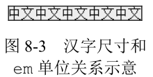
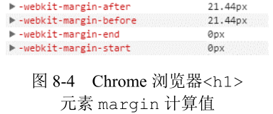
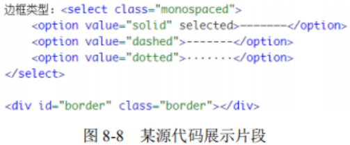
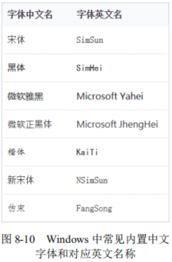

# line-height 的另外一个朋友 font-size

第 5 章介绍过 line-height 和 vertical-align 的好朋友关系，实际上，font-size 也和 line-height 是好朋友，同样也无处不在，并且纸面上 line-height 的数值属性值和百分比值属性值都是相对于 font-size 计算的，其关系可谓不言而喻。

## font-size 和 vertical-align 的隐秘故事

line-height 的部分类别属性值是相对于 font-size 计算的，vertical-align 百分比值属性值又是相对于 line-height 计算的，于是，看上去八辈子都搭不上边的 vertical-align 和 font-size 属性背后其实也有有着关联的。

例如，下面的 CSS 代码组合：

```css
p {
   font-size: 16px;
   line-height: 1.5;
}

p > img {
   vertical-align: -25%;
}
```

此时，p > img 选择器对应元素的 vertical-align 计算值应该是：

16px \* 1.5 \* -25% = -6px

也就是上面的 CSS 代码等同于：

```css
p {
   font-size: 16px;
   line-height: 1.5;
}

p > img {
   vertical-align: -6px;
}
```

但是两者又有所不同，很显然 `-25%` 是一个相对计算属性值，如果此时元素的 font-size 发生变化，则图片会自动进行垂直位置调整。我们可以看一个无论 font-size 如何变化、后面图标都垂直居中对齐的例子，无论文字字号是大还是小，后面的图标都非常良好地垂直居中对齐，如图 8-1 所示。


核心 CSS 代码如下：

```css
p > img {
   width: 16px;
   height: 16px;
   vertical-align: 25%;
   position: relative;
   top: 8px;
}
```

原理如下：内联元素默认基线对齐，图片的基线可以看成是图片的下边缘，文字内容的基线是字符 x 下边缘，因此，本例中，图片下边缘默认和“中文”两个汉字字形底边缘往上一点的位置对齐。然后，我们通过 `vertical-align: 25%` 声明让图片的下边缘和中文汉字的中心线对齐。此时，图标和文字的状态应该如图 8-2 所示。


图 8-2 完全就是实例效果注释 `top: 8px` 后的截图标注，没有任何加工。看上去似乎上面小，实际上是视觉误差，分隔线上下完全均等，1 像素不差。

由于我们这里的图标是固定的像素尺寸，因此，通过偏移自身 1/2 高度来实现真正的居中，可以使用 CSS3 transform 位移，我这里为了兼容性，使用了 relative 相对定位。

其居中原理本质上和绝对定位元素 50% 定位加偏移自身 1/2 尺寸实现居中是一样的，只不过这里的偏移使用的是 vertical-align 百分比值。

这么一看，vertical-align 百分比属性值似乎还是有点用的！如果再联想到 `vertical-align: middle` 实现垂直居中效果经常不尽如人意，说不定还能找到一块更好的宝。但我要告诉你，其实还有更好的实现，那就是使用单位 ex。例如，将前面例子中的 `vertical-align: 25%` 改成 `vertical-align: .6ex`，效果基本上就是一样的，并且还多了一个优点，就是使用 `vertical-align: .6ex` 实现的垂直居中效果不会受 line-height 变化影响，而使用 `vertical-align: 25%`，line-height 一旦变化，就必须改变原来的 vertical-align 大小、重新调整垂直位置，这容错性明显就降了一个层次。

因此，虽然例子演示的是 vertical-align 百分比值，实际上是推荐使用与 font-size 有着密切关系的 ex 单位。

说到这里，忍不住想介绍另外一些和 font-size 有着密切的关系的东西。

## 理解 font-size 与 ex、em 和 rem 的关系

ex 是字符 x 高度，显然和 font-size 关系密切，font-size 值越大，自然 ex 对应的大小也就大，对此本书前面已经有介绍，这里不赘述。

下面来看看单位 em。如果说 ex 是字符 x 高度，那是不是 em 就是字符 m 的高度？

我的回答是“不是的”，但是 em 和字符 m 确实有关。em 在传统排版中指一个字模的高度（可以脑补下活字印刷的字模）。

例如，浏览器默认 font-size 大小是 16px，假设一个`<div>`宽度是 160px，则正好可以放下 10 个汉字不换行；如果是 159px 像素，第十个汉字就会掉下来；如果再同时设置 line-height:1 和一个背景色，代码如下：

```css
div {
   width: 160px;
   line-height: 1;
   background-color: #eee;
}
```

我们就会发现中文汉字的尺寸就可以看作 em 单位的代名词，尤其在高度这一块，简直分毫不差，如图 8-3 所示。



也就是说，em 就是'中'等汉字的高度！于是，我们对 em 的理解就更加简单了，直接看一个很容易理解错误的题目，在 Chrome 浏览器下，`<h1>`元素有如下的默认 CSS：

```css
h1 {
   font-size: 2em;
   -webkit-margin-before: 0.67em;
   -webkit-margin-after: 0.67em;
}
```

那么，假设页面没有任何 CSS 重置，根元素 font-size 就是默认的 16px，请问：此时`<h1>`元素 margin-before 的像素计算值是多少？

如果对 em 了解不够，很容易认为 1em 大小就是 16px，于是计算值是 `16px × 0.67 = 10.72px`，实际上这是错误的。

我们可以这样想，假设 `<h1>` 里面有汉字，此时汉字的高度是多少？这个高度就是此时 1em 大小。`<h1>` 元素此时 font-size 是 2em，算一下就是 32px，因此，此时里面汉字的高度应该是 32px，也就是说，此时`<h1>`元素的 1em 应该是 32px，于是 margin-before 的像素计算值为 `32px × 0.67 = 21.44px`，和浏览器自己的计算值一样，如图 8-4 所示。



乍一看，似乎出现了死循环悖论：`font-size: 2em`，于是 1em 变成 32px，那此时的 2em 不又是 64px，然后又……

正如前面提到过的一样，CSS 世界的渲染是一次渲染，是不会有死循环的。这里是先计算 font-size，然后再计算给其他使用 em 单位的属性值大小。

总结如下：在 CSS 中，1em 的计算值等同于当前元素所在的 font-size 计算值，可以将其想象成当前元素中（如果有）汉字的高度。

所有相对单位的好处都是一样的，样式表现更具有弹性。例如，理论上，有一个布局，希望小屏时整体缩小，大屏时再弹性扩大，此时就可以让所有元素宽高尺寸等都使用 em，于是，最后只要改变布局祖先元素的 font-size 大小就可以实现整体的弹性变化。

这种策略很棒，也确实可行，但是有一个比较麻烦的事情，它和上面 `<h1>` 元素计算一样的麻烦，em 是根据当前 font-size 大小计算的，一旦布局中出现标题这种跟基础 font-size 大小不一样的场景的时候，标题里面所有元素 em 都要重新计算一遍，甚为麻烦，最终的成品维护成本就比较高了。

正是由于这种局限性，另外一个和 font-size 密切相关的单位出现了，就是 rem，即 root em，顾名思义，就是根元素 em 大小。em 相对于当前元素，rem 相对于根元素，本质差别在于当前元素是多变的，根元素是固定的，也就是说，如果使用 rem，我们的计算值不会受当前元素 font-size 大小的影响，假设 `<h1>` 的默认 CSS 是这样：

```css
h1 {
   font-size: 2em;
   -webkit-margin-before: 0.67rem;
   -webkit-margin-after: 0.67rem;
}
```

那么 2em 的 font-size 计算值会被忽略，直接使用根元素的 16px 进行计算，于是 margin-before 计算值是 16 像素 ×0.67 = 10.72 像素。

因此，要想实现带有缩放性质的弹性布局，使用 rem 是最佳策略，但 rem 是 CSS3 单位，IE9 以上浏览器才支持，需要注意兼容性，我这里就不再多介绍了。

回到 em 单位。em 实际上更适用于图文内容展示的场景，对此进行弹性布局。例如 `<h1>～<h6>` 以及 `<p>` 等与文本内容展示的元素的 margin 都是用 em 作为单位，这样，当用户把浏览器默认字号从“中”设置成“大”或改成“小”的时候，上下间距也能根据字号大小自动调整，使阅读更舒服。

再举个适用于 em 的场景，如果我们使用 SVG 矢量图标，建议设置 SVG 宽高如下：

```css
svg {
   width: 1em;
   height: 1em;
}
```

这样，无论图标是个大号文字混在一起还是和小号文字混在一起，都能和当前文字大小保持一致，既省时又省力。

## 理解 font-size 的关键字属性值

font-size 支持长度值，如 1em，也支持百分比值，如 100%。这两点想必众所周知，但 font-size 还支持关键字属性值这一点怕是就有不少人不清楚了。

font-size 的关键字属性值分以下两类。

1. **相对尺寸关键字。**

   指相对于当前元素 font-size 计算，包括：

   - larger：大一点，是 `<big>` 元素的默认 font-size 属性值。
   - smaller：小一点，是 `<small>` 元素的默认 font-size 属性值。

2. **绝对尺寸关键字。**

   与当前元素 font-size 无关，仅受浏览器设置的字号影响。注意这里的措辞，是“浏览器设置”，而非“根元素”，两者是有区别的。

   - xx-large：好大好大，和 `<h1>` 元素计算值一样。
   - x-large：好大，和 `<h2>` 元素计算值一样。
   - large：大，和 `<h3>` 元素计算值近似
   - medium：不上不下，是 font-size 的初始值，和 `<h4>` 元素计算值一样。
   - small：小，和 `<h5>` 元素计算值近似。
   - x-small：好小，和 `<h6>` 元素计算值近似。
   - xx-small：好小好小，无对应的 HTML 元素。

其中，相对尺寸关键字 larger 和 smaller 由于计算的系数在不同浏览器下差异很大，因此实用价值有限，只有类似文档页、帮助页这类对文字尺寸要求不高的场合才有用；而绝对尺寸关键字的实用性要大一些，而且在某些场合是推荐使用的关键字属性值，这个要慢慢讲。

下面两个 CSS 代码有什么区别？

```css
html {
   font-size: 14px;
}

html {
   font-size: 87.5%;
}
```

在绝大多数场景下，两者没有差别，全都计算为 14px，但是如果用户对浏览器的字号进行了调整，例如，把默认的“中”设置成了“大”，如图 8-5 所示（截自 Chrome 浏览器），那么此时，font-size: 14px 计算值还是 14px，但 font-size: 87.5% 的计算值则大了一圈，于是差别就出现了。如果是像素单位 font-size，用户改变浏览器的默认字号后，页面会微丝不动；如果是百分比值 font-size，则字号相应放大，这就涉及用户体验和可访问性问题了。


正常情况下，14 像素的文字大小是足够的，但是，如果是高度近视的用户，或者上班急急忙忙忘记戴眼镜，或者在投影仪上投影网页内容，此时就有大字号浏览网页的需求，如果使用固定的像素单位，显然对这些使用场景是不友好的。

好在浏览器还提供了“网页缩放”功能，但是此功能也是有局限性的：如果网页是定宽非响应式的，则网页放大后窗体以外的内容就看不到了，在 Chrome/Firefox 浏览器下甚至连个水平滚动条都没有，说不定重要信息就会看不到。由此可见，我们是不能轻易忽视浏览器字号设置功能的。

然而，现代网页设计得很精致，要想网页布局跟随字体内容缩放实在两难，要么使用 em，但 em 计算与当前 font-size 耦合，不好维护；要么使用 rem，但 IE8 不支持，桌面端使用尴尬。因此，现实的压迫导致我们只能使用 px 进行布局，尤其桌面端网页。

如何权衡“易于实现维护”“视觉还原”“可访问性”这三者，我这里有两个建议。

1. 即使是定宽的传统桌面端网页，也需要做响应式处理，尤其是针对 1200 像素宽度设计的网页，但只需要响应到 800 像素即可，可以保证至少有 1.5 倍的缩放空间，如果做到这一步，那么是否需要响应浏览器的字号设置这一点就可以忽略。
2. 如果因各种原因无法做响应式处理，也没有必要全局都使用相对单位，毕竟成本等现实问题摆在那里，其实只需要在图文内容为主的重要局部区域使用可缩放的 font-size 处理即可。例如，小说网站的阅读页、微信公众号文章展示区、私信对话内容区、搜索引擎的落地页、评论区等，都强烈建议摒弃 px 单位，而采用下面的实践策略。

   - 容器设置 font-size: medium，此时，这个局部展示区域的字号就跟着浏览器的设置走了，默认计算值是 16px。
   - 容器内的文字字号全部使用相对单位，如百分比值或者 em 都可以，然后基于 16px 进行转换。例如：

      ```css
      .article {
         font-size: medium;
      }
      .article h1 {
         font-size: 2em;
         margin: 0.875em 0;
      }
      .article p {
         font-size: 87.5%; /* 默认字号下计算值是 14px */
         margin: 1em 0;
      }
      ```

同时使用自适应流体布局，间距什么的也使用相对单位，例如上面 margin 使用的是 em 单位。于是，当用户改变了浏览器的字号后，整个阅读区域的所有字样甚至布局都会跟着放大，文字一下子就看清楚了。这种局部处理的好处在于，页面的导航、侧边栏这些不需要长时间阅读的模块还是原来的像素布局，还是那么精致，丝毫不受影响。就这么很微小的变动，就可以让你的网页在可访问性这一块超越大多数的网站，何乐而不为？

可以看到，绝对尺寸关键字在实际项目中还有很有价值的，但有价值的仅仅是 medium，至于其他关键字，作用仅限于字面上的那点儿，大家了解一下即可。

## font-size: 0 与文本的隐藏

桌面 Chrome 浏览器下有个 12px 的字号限制，就是文字的 font-size 计算值不能小于 12px，我猜是因为中文，如宋体，要是小于 12px，就会挤成成一团，略丑，Chrome 看不下去，就直接禁用了。

正是这种限制导致我们在使用 em 或 rem 进行布局的时候，不能这么处理：

```css
html {
   font-size: 62.5%;
}
```

理论上，此时根字号计算值是 16px\*0.625=10px，于是 `width: 14px` 可以写成 `width: 1.4em`，省了很多计算的麻烦。但是，在 Chrome 下由于 12px 的限制，根字号计算值实际不是 10px，而是 12px，所以，可以试试处理成这样：

```css
html {
   font-size: 625%;
}
```

此时根字号计算值是 100px，既计算无忧，又没有 12px 的最小字号限制。

但是我个人建议还是不要这样处理，尤其使用 em 的时候，因为 font-size 属性和 line-height 属性一样，由于继承性的存在，会影响贯穿整个网页，100px 的环境 font-size 一定会将平时不显山露水的底边对齐问题、间隙问题等放大，导致出现一些明显的样式问题，如果对 CSS 了解不是很深刻，怕是很难明白为什么会发生这样的问题。同时这样做也限制了 px 等其他单位的使用，有时候是比较要命的。

因此，我的建议是仍基于浏览器默认的字号进行相对计算，也就是 medium 对应的 16px，16 这个数字是一定可以整除的，因此计算成本还行，或者使用 Sass 或 Less 之类的工具辅助计算。

还是回到字号限制的问题。实际上，并不是所有小于 12px 的 font-size 都会被当作 12px 处理，有一个值例外，那就是 0，也就是说，如果 font-size:0 的字号表现就是 0，那么文字会直接被隐藏掉，并且只能是 `font-size: 0`，哪怕设置成 font-size:0.0000001px，都还是会被当作 12px 处理的。

因此，如果希望隐藏 logo 对应元素内的文字，除了 text-indent 缩进隐藏外，还可以试试下面这种方法：

```css
.logo {
   font-size: 0;
}
```

# 字体属性家族的大家长 font-family

font-family 默认值由操作系统和浏览器共同决定，例如 Windows 和 OS X 下的 Chrome 默认字体不一样，同一台 Windows 系统的 Chrome 和 Firefox 浏览器默认字体也不一样。

font-family 支持两类属性值，一类是“字体名”，一类是“字体族”。“字体名”很好理解，就是使用的对应字体的名称。例如：

```css
body {
   font-family: simsun;
}
```

就表示使用的是“宋体”。如果字体名包含空格，需要使用引号包起来。例如：

```css
body {
   font-family: 'Microsoft Yahei';
}
```

根据我的实践，可以不用区分大小写。如果有多个字体设定，从左往右依次寻找本地是否有对应的字体即可。例如：

```css
body {
   font-family: 'PingFang SC', 'Microsoft Yahei';
}
```

就是先寻找是否本地有 PingFang SC 字体；如果没有，则继续寻找本地是否有 Microsoft Yahei 字体；如果都没找到，就使用默认值。

但是，“字体族”分为很多类，MDN 上文档分类如下：

- font-family: serif;
- font-family: sans-serif;
- font-family: monospace;
- font-family: cursive;
- font-family: fantasy;
- font-family: system-ui;

具体含义解释如下。

- serif：衬线字体。
- sans-serif：无衬线字体。
- monospace：等宽字体。
- cursive：手写字体。
- fantasy：奇幻字体。
- system-ui：系统 UI 字体。

对于中文网站，cursive 和 fantasy 应用场景有限，因此这里不予探讨，这里着重介绍一下衬线字体、无衬线字体和等宽字体。

## 了解衬线字体和无衬线字体

字体分衬线字体和无衬线字体。所谓衬线字体，通俗讲就是笔画开始、结束的地方有额外装饰而且笔画的粗细会有所不同的字体。网页中常用中文衬线字体是“宋体”，常用英文衬线字体有 Times New Roman、Georgia 等。无衬线字体没有这些额外的装饰，而且笔画的粗细差不多，如中文的“雅黑”字体，英文包括 Arial、Verdana、Tahoma、Helivetica、Calibri 等

以前人们排正文喜欢使用衬线字体，但是如今，不知是审美疲劳还是人们更加追求简洁干净的缘故，更喜欢使用无衬线字体，如“微软雅黑”或者“苹方”之类的字体。

在 CSS 世界中，字体是有对应的属性值的，如下：

```css
font-family: serif; /* 衬线字体 */
font-family: sans-serif; /* 无衬线字体 */
```

我们在移动端 Web 开发的时候，虽然设备的默认中文字体不一样，但都是无衬线，都挺好看的，因此可以直接使用下面的 CSS 代码：

```css
body {
   font-family: sans-serif;
}
```

没有必要特别指定中文字体，否则说不定会画蛇添足。

serif 和 sans-serif 还可以和具体的字体名称写在一起，例如：

```css
body {
   font-family: 'Microsoft Yahei', sans-serif;
}
```

但是需要注意的是，serif 和 sans-serif 一定要写在最后，因为在大多数浏览器下，写在 serif 和 sans-serif 后面的所有字体都会被忽略。例如：

```css
body {
   font-family: sans-serif, 'Microsoft Yahei';
}
```

在 Chrome 浏览器下，后面的 Microsoft Yahei 字体是不会被渲染的。据我的推测，有可能浏览器认为当前“字体族”已经满足了文本渲染的需要，没必要再往后解析了

## 等宽字体的实践价值

所谓等宽字体，一般是针对英文字体而言的。据我所知，东亚字体应该都是等宽的，就是每个字符在同等 font-size 下占据的宽度是一样的。但是英文字体就不一定了，我随便写一个单词，就 iMac 吧，大家很明显地发现这个字符 i 要比 M 占据的宽度小。如果这样看着还不够清楚，那我换一种呈现方式，上下两行，上一行 6 个 i，下一行 6 个 M，如下：

```
iiiiii
MMMMMM
```

实际的两行文本的宽度可能就如图 8-6 所示这般差异明显。

但是，如果是等宽字体（可以让英文字符同等宽度显示的字体就称为“等宽字体”），如 Consolas、Monaco、monospace，则宽度表现就不一样了，如图 8-7 所示。


等宽字体在 Web 中有什么用呢？

1. 等宽字体与代码呈现

首先等宽字体利于代码呈现。对于写代码的人来说，无论是什么语言，易读是第一位，使用等宽字体，我们阅读起来会更轻松舒服。因此，一般编辑器使用的字体或者 Web 上需要呈现源代码的字体都是等宽字体。例如，即将出现的演示页面的源代码如图 8-8 所示。



2. 等宽字体与图形呈现案例一则

假设某工具有这么一个功能：通过下拉选择，可以改变元素的边框样式，也就是 borderStyle 在 solid/dashed/dotted 间切换。

大家都知道，原生的 `<select>` 的 `<option>` 元素的 innerHTML 只能是纯 text 字符，不能有 html，也不支持伪元素，因此，要模拟 solid、dashed 和 dotted，只能使用字符，而字符有长有短，可以模拟成像样的规整的图形吗？

可以的，试试使用等宽字体。

[equal-width-font-performance](embedded-codesandbox://css-world-text-processing/equal-width-font-performance)

3. ch 单位与等宽字体布局

ch 和 em、rem、ex 一样，是 CSS 中和字符相关的相对单位。和 ch 相关的字符是 0，没错，就是阿拉伯数字 0。1ch 表示一个 0 字符的宽度，所以 6 个 0 所占据的宽度就是 6ch。

由于 ch 是个 CSS3 单位，且 IE9 浏览器的宽度和其他浏览器明显不一样，因此此处不展开，但可以提一提一些不错的应用场景。例如，有些输入框是输入手机号的，在中国，手机号是 11 位，因此我们可以设置该输入框宽度为 11ch，同时让字体等宽，则用户一眼就能看出自己是否少输入或者多输入了 1 位数字。又如，我们想实现一个屏幕上代码一个一个出现的动效，如果代码是等宽字体，此时使用 ch 单位来控制宽度，配合 overflow 属性和 CSS animation 就能在完全不使用 JavaScript 的情况下将此效果模拟出来。当然，还有其他一些应用场景，不一一说明。

## 中文字体和英文名称

使用中文字体，就必须要知道其对应的英文名称，下面是一些常见中文字体对应的 font-family 英文属性名称。

1. Windows 常见内置中文字体和对应英文名称见图 8-10
2. OS X 系统内置中文字体和对应英文名称见图 8-11
3. Office 软件安装新增中文字体和对应英文名称见图 8-12
4. 其他一些中文字体和对应英文名称见图 8-13




## 一些补充说明

微软正黑体是一款全面支持 ClearType 技术的 TrueType 无衬线字体，用于繁体中文系统。相对应地，中国大陆地区用的是微软雅黑。但由于中国大陆和中国港、澳、台地区在各自的文字规范中对汉字的写法规定有很多细节上的不同，所以这两套字形在正式场合是不能混淆使用的。

我们平常所说的“宋体”，指的都是“中易宋体”，英文名称 SimSun，“黑体”类似的是“中易黑体”。在 OS X 常见内置中文字体中我罗列了一个“宋体-简”，需要注意的是，这个“宋体- 简”和我们平常所说的“宋体”并不是同一个字体，其英文名称是“Songti SC”，字形表现也有差异。

OS X 也就是苹果操作系统的字体名称中经常会出现“SC”，这个“SC”指的是“简体” （simplified chinese）的意思，相对应的还有“TC”，指的是“繁体”（traditional chinese）的意思。

// TODO CSS 世界读书笔记待完成
