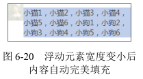
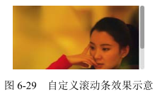
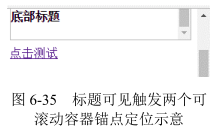
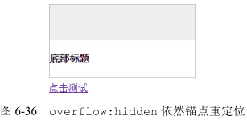
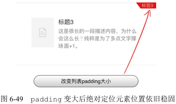
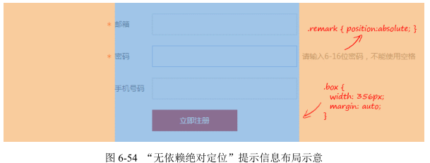
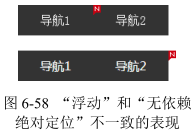

# 魔鬼属性 float

## float 的本质与特性

浮动的本质就是为了实现文字环绕效果。

- 包裹性；
- 块状化并格式化上下文；
- 破坏文档流；
- 没有任何 margin 合并；

所谓“包裹性”，由“包裹”和“自适应性”两部分组成。

1. 包裹。假设浮动元素父元素宽度 200px，浮动元素子元素是一个 128px 宽度的图片，则此时浮动元素宽度表现为“包裹”，就是里面图片的宽度 128px，代码如下：
    ```html
    <style>
      .father {
        width: 200px;
      }
      .float {
        float: left;
      }
      .float img {
        width: 128px;
      }
    </style>
    <div class="father">
      <div class="float">
        
      </div>
    </div>
    ```
2. 自适应性。如果浮动元素的子元素不只是一张 128px 宽度的图片，还有一大波普通的文字，例如：
    ```html
    <div class="father">
      <div class="float">
        我是帅哥，好巧啊，我也是帅哥，原来看这本书的人都是帅哥~
      </div>
    </div>
    ```
    则此时浮动元素宽度就自适应父元素的 200px 宽度，最终的宽度表现也是 200px。

当然，要想最大宽度自适应父元素宽度，一定是在浮动元素的“首选最小宽度”比父元素的宽度要小的前提下，比方说上面示意的“我是帅哥”等文字全是一连串超长的英文字母，则浮动元素的宽度显然就不是 200px 了。

块状化的意思是，元素一旦 float 的属性值不为 none，则其 display 计算值就是 block 或者 table。举个例子，打开浏览器控制台，输入如下 JavaScript 代码：

```js
var span = document.createElement('span');
document.body.appendChild(span);
console.log('1. ' + window.getComputedStyle(span).display);
// 设置元素左浮动
span.style.cssFloat = 'left';
console.log('2. ' + window.getComputedStyle(span).display);
```

结果如图 6-2 所示。


因此，没有任何理由出现下面的样式组合：

```css
span {
  display: block; /* 多余 */
  float: left;
}

span {
  float: left;
  vertical-align: middle; /* 多余 */
}
```

也不要指望使用 text-align 属性控制浮动元素的左右对齐，因为 text-align 对块级元素是无效的。

float 属性与 display 属性值转换关系如表 6-1 所示。

| 设定值 | 计算值 |
|:--------: | :-------: |
| inline | block |
| inline-block | block |
| inline-table | table |
| table-row | block |
| table-row-group | block |
| table-column | block |
| table-column-group | block |
| table-cell | block |
| table-caption | block |
| table-header-group | block |
| table-footer-group | block |

除了 inline-table 计算为 table 外，其他全都是 block。

## float 的作用机制

float 属性有个著名的特性表现，就是会让父元素的高度塌陷，大多数场景下，这种特性会影响“正常的”布局，float 属性让父元素高度塌陷的原因就是为了实现文字环绕效果，然而这种效果现在已经不流行。于是 float 很少发挥其原本的作用，反而被大肆使用满屏布局。

```html
<div class="father">
  
</div>
<p class="animal">小猫 1，小猫 2，...</p>
```


然而，“高度塌陷”只是让跟随的内容可以和浮动元素在一个水平线上，但这只是实现“环绕效果”的条件之一，要想实现真正的“环绕效果”，就需要另外一个平时大家不太在意的特性，那就是“行框盒子和浮动元素的不可重叠性”，也就是“行框盒子如果和浮动元素的垂直高度有重叠，则行框盒子在正常定位状态下只会跟随浮动元素，而不会发生重叠”。

注意，这里说的是“行框盒子”，也就是每行内联元素所在的那个盒子，而非外部的块状盒子。实际上，由于浮动元素的塌陷，块状盒子是和图片完全重叠的，例如，我们给环绕的`<p>`元素设置个背景色，同时把图片搞透明，则效果如图 6-6 所示。


但是，块状盒子中的“行框盒子”却被浮动元素限制，没有任何的重叠，我们可以借助::first-line 伪元素暴露第一行的“行框盒子”区域，CSS 代码如下：

```css
.animal:first-line {
  background: red;
  color: white;
}
```

结果如图 6-7 所示。

这种“限制”是根深蒂固的，也就是“行框盒子”的区域永远就这么大，只要不改变当前布局方式，我们是无法通过其他 CSS 属性改变这个区域大小的。这就是在 4.3 节提到的浮动后面元素 margin 负无穷大依然无效的原因。例如，这里再新增如下 CSS 代码：

```css
.animal {
  margin-left: -100px;
}
```

就会发现，只有外部的块状容器盒子尺寸变大，而和浮动元素垂直方向有重叠的“行框盒子”依然被限死在那里，如图 6-8 所示。


一个元素只要设置了具体的高度值，就不需要担心 float 属性造成的高度塌陷的问题了，既然有了高度，何来“高度塌陷”。这句话对不对呢？是对的。但是，其中也隐含了陷阱，因为“文字环绕效果”是由两个特性（即“父级高度塌陷”和“行框盒子区域限制”）共同作用的结果，定高只能解决“父级高度塌陷”带来的影响，但是对“行框盒子区域限制”却没有任何效果，结果导致的问题是浮动元素垂直区域一旦超出高度范围，或者下面元素 margin-top 负值上偏移，就很容易使后面的元素发生“环绕效果”，代码示意如下：

```html
<style>
  .father {
    height: 64px;
    border: 1px solid #444;
  }
  .float {
    float: left;
  }
  .float img {
    width: 60px;
    height: 64px;
  }
</style>
<div class="father">
  <div class="float">
    
  </div>
  我是帅哥，好巧啊，我也是帅哥，原来看这本书的人都是帅哥~
</div>
<div>
  虽然你很帅，但是我对你不感兴趣。
</div>
```


从这段代码可以看出父级元素.father 高度设置的和图片高度一模一样，都是 64px。按道理，下面的“虽然你很帅，但是我对你不感兴趣。”这些文字应该居左显示，但最后的结果却是图 6-9 所示的这样。

虽然肉眼看上去容器和图片一样高，但是，大家都读过 5.3 节，应该都知道内联状态下的图片底部是有间隙的，也就是.float 这个浮动元素的实际高度并不是 64px，而是要比 64px 高几像素，带来的问题就是浮动元素的高度超出.father 几像素。于是，下面的文字就遭殃了，因为“虽然你很帅……”这段文字所在的“行框盒子”和浮动元素在垂直位置有了重叠，尽管就那么几像素。于是，区域被限制，形成了图6-9 所示的“被环绕”效果。

因此，当使用浮动元素的时候，比较稳妥的做法还是采用一些手段干净地清除浮动带来的影响，以避免很多意料之外的样式问题的发生。

## float 更深入的作用机制

实际项目开发中不可能总是浮动元素在正常流元素的前面，下面来看一个例子。例如，有一个标题，代码如下：

```html
<h3>
  标题
</h3>
```

一直用得好好的，突然来了一个需求，要在右侧加一个“更多”链接，于是 HTML 变成下面这样（我们这里先忽略语义是否得当的问题）：

```html
<h3>
  标题
  <a href="#">
    更多
  </a>
</h3>
```

请问：我们直接让`<a>`元素 float:right 可不可以？

考虑到本书的目标浏览器是 IE8 及以上版本浏览器，因此，答案是：可以。但是，如果你的项目很不幸还需要兼容 IE7 之类的浏览器，则不能这样处理，因为“更多”文字会浮动在下一行内容的右边，而非标题的右边。


比方说，还是这个例子，假设这里的“标题”内容非常长，超过了一行内容，请问：这里的“更多”`<a>`链接元素该如何显示？是图 6-10 所示的这样吗？答案是：不是的。正确表现应该如图 6-11 所示。

为什么呢？首先，我们需要了解两个和 float 相关的术语，一是“浮动锚点”（float anchor），二是“浮动参考”（float reference）。

- 浮动锚点是 float 元素所在的“流”中的一个点，这个点本身并不浮动，就表现而言更像一个没有 margin、border 和 padding 的空的内联元素。
- 浮动参考指的是浮动元素对齐参考的实体。

在 CSS 世界中，float 元素的“浮动参考”是“行框盒子”，也就是 float 元素在当前“行框盒子”内定位。再强调一遍，是“行框盒子”，不是外面的包含块盒子之类的东西，因为CSS 浮动设计的初衷仅仅是实现文字环绕效果。在 CSS 新世界中，float 被赋予了更多的作用和使命，“浮动参考”就不仅仅是“行框盒子”了，不过此非本书重点，就不展开了。

正是因为 float 定位参考的是“行框盒子”，所以“更多”才会在第二行显示。还没理解？那再具体解释一下：每一行内联元素都有一个“行框盒子”，这个例子中标题文字比较多，两行显示了，因此有上下两个“行框盒子”，而“更多”所在的`<a>`元素是在标题文字后面，位于第二行，因此，这里设置了 float:right 的`<a>`元素是相对于第二行的“行框盒子”对齐的，也就是图 6-11 所示的效果。

假如说我们的标题文字再多两个字，正好两行，请问：“更多”两字又当如何显示呢？估计不少人已经可以脑补出最终的样式表现了，“更多”会孤零零地显示在第三行的右边，但容器高度仍然是两行文字的高度，如图 6-12 所示


然而，上面的解释有一个很大的漏洞就是，如果 float 元素前后全是块元素，那根本没有“行框盒子”，何来对齐的说法？此时，就需要上面提到的“浮动锚点”出马了。“浮动锚点”这个术语名称本身很具有欺骗性，看上去应该与 float 的定位位置有关，实际上关系浅薄，在我看来，其作用就是产生“行框盒子”，因为“浮动锚点”表现如同一个空的内联元素，有内联元素自然就有“行框盒子”，于是，float 元素对齐的参考实体“行框盒子”对于块状元素也同样适用了，只不过这个“行框盒子”由于没有任何内容，所以无尺寸，看不见也摸不着罢了。

## float 与流体布局

float 通过破坏正常 CSS 流实现 CSS 环绕，带来了烦人的“高度塌陷”的问题，然而，凡事都具有两面性，只要了解透彻，说不定就可以变废为宝、化腐朽为神奇。例如。我们可以利用 float 破坏 CSS 正常流的特性，实现两栏或多栏的自适应布局。还记不记得之前小动物环绕的例子？其实我们稍加改造，就能变成一侧定宽的两栏自适应布局，HTML 和 CSS 代码如下：

```html
<style>
  .father {
    overflow: hidden;
  }
  .father > img {
    width: 60px;
    height: 64px;
    float: left;
  }
  .animal {
    margin-left: 70px;
  }
</style>
<div class="father">
  
  <p class="animal">
    小猫 1，小猫 2，...
  </p>
</div>
```

和文字环绕效果相比，区别就在于.animal 多了一个margin-left:70px，也就是所有小动物都要跟男主保持至少70px 的距离，由于图片宽度就60px，因此不会发生环绕，自适应效果达成。

原理其实很简单，.animal 元素没有浮动，也没有设置宽度，因此，流动性保持得很好，设置margin-left、border-left或者padding-left都可以自动改变content box的尺寸，继而实现了宽度自适应布局效果。我们不妨对比一下环绕效果的背景区域和这里自适应效果的背景区域（见图 6-13），理解起来应该会更加直白。


没有对比就没有震撼。很多人实现这样的效果会采用下面这样的砖头式的浮动布局：

```css
.animal {
  width: 170px;
  float: right;
}
```

乍一看，效果一样，但是实际上这容错性和可拓展性就差远了。一旦我们的容器宽度发生了变化，那么这个布局就基本作废，宽度小了，两栏内容上下错位，宽度变大，中间间隙宽到可以撑船，就是因为浮动和宽度破坏了 CSS 的流动性。这种感觉就像是把记忆合金变成了死板砖头。在我看来，这类布局是没有任何理由使用这种“砌砖头”式的技术方案的。一个简简单单的 margin-left 岂不比需要计算、代码量多、可维护性差的一堆 CSS 代码好很多！

一般而言，上面的技巧适用于一侧定宽一侧自适应：如果是宽度不固定，也有办法处理，这会在 6.3.2 节中介绍。如果是百分比宽度，则也是可以的，例如：

```css
.left {
  float: left;
  width: 50%;
}

.right {
  margin-left: 50%;
}
```

如果是多栏布局，也同样适用，尤其图 6-14 所示的这种布局。


假设 HTML 结构如下：

```html
<div class="box">
  <a href class="prev">
    &laquo; 上一章
  </a>
  <a href class="next">
    下一章 &raquo;
  </a>
  <h3 class="title">
    第 112 章 动物环绕
  </h3>
</div>
```

则 CSS 可以如下：

```css
.prev {
  float: left;
}

.next {
  float: right;
}

.title {
  margin: 0 70px;
  text-align: center;
}
```

也就是说，.title 所在的`<h3>`标题元素直接左右 margin，借助流体特性，保证不会和两个文字链接重叠。

# float 的天然克星 clear

## 什么是 clear 属性

生生相克，float 这个魔鬼属性也不例外。CSS 有一个专门用来处理 float 属性带来的
高度塌陷等问题的属性，这个属性就是 clear。其语法如下：

```
clear: none | left | right | both
```

如果单看字面意思，clear:left 应该是“清除左浮动”，clear:right 应该是“清除右浮动”的意思，实际上，这种解释是有问题的，因为浮动一直还在，并没有清除。没错，并没有清除。

官方对 clear 属性的解释是：“元素盒子的边不能和前面的浮动元素相邻。”虽然有些拗口，但是有一点是可以体会出来的，就是设置了 clear 属性的元素自身如何如何，而不是让 float 元素如何如何，有种“己所不欲勿施于人”的意味在里面。因此，我对clear 属性值的理解是下面这样的。

- none：默认值，左右浮动来就来。
- left：左侧抗浮动。
- right：右侧抗浮动。
- both：两侧抗浮动。

大家有没有发现，我们平时除了 clear:both 这个声明比较多以外，left 和 right 这两个属性值几乎无人问津，是因为 left 和 right 这两个值没有作用吗？

没错，确实没有什么用！凡是 clear:left 或者 clear:right 起作用的地方，一定可以使用 clear:both 替换！

举个例子，假设容器宽度足够宽，有 10 个`<li>`元素，设置了如下 CSS 代码：

```css
li {
  width: 20px;
  height: 20px;
  margin: 5px;
  float: left;
}

li:nth-of-type(3) {
  clear: both;
}
```

列表最后是 1 行显示、2 行显示，还是 3 行显示呢？


原因在于，clear 属性是让自身不能和前面的浮动元素相邻，注意这里“前面的”3 个字，也就是 clear 属性对“后面的”浮动元素是不闻不问的，因此才 2 行显示而非 3 行。

## 成事不足败事有余的 clear

clear 属性只有块级元素才有效的，而::after 等伪元素默认都是内联水平，这就是借助伪元素清除浮动影响时需要设置 display 属性值的原因。

```css
.clear:after {
  content: '';
  /* 也可以是'block'，或者是'list-item' */
  display: table; 
  clear: both;
}
```

然而，利用伪元素或者直接使用下面 HTML，有时候也会产生一些意想不到的问题：

```html
<div style="clear:both;">
</div>
```

继续前面那个小动物环绕的例子，如果我们在右侧自适应内容里面使用了类似这样的样式，则可能会发生右边的内容跑到图片下边的情况，HTML 代码如下：

```html
<div class="father">
  
  <div class="animal">
    小猫 1，小猫 2，
    <div class="clear">
    </div>
    小猫 3，小猫 4，...
  </div>
</div>
```

结果却是如图 6-16 所示。


由于 clear:both 的作用本质是让自己不和 float 元素在一行显示，并不是真正意义上的清除浮动，因此 float 元素一些不好的特性依然存在，于是，会有类似下面的现象。

1. 如果 clear:both 元素前面的元素就是 float 元素，则 margin-top 负值即使设成-9999px，也不见任何效果。
2. clear:both 后面的元素依旧可能会发生文字环绕的现象。举个例子，如下 HTML 和 CSS：

    ```html
    <style>
      .father:after {
        content: '';
        display: table;
        clear: both;
      }
      .father img {
        float:left;
        width: 60px;
        height: 64px;
      }
      .father + div {
        margin-top: -2px;
      }
    </style>
    <div class="father">
      
      我是帅哥，好巧啊，我也是帅哥，原来看这本书的人都是帅哥~
    </div>
    <div>虽然你很帅，但是我对你不感兴趣。</div>
    ```
    虽然.father 父元素的最后设置了 clear:both 来阻止浮动对后面元素的影响，但是最后结果错位依然发生了，如图 6-17 所示。


由此可见，clear:both 只能在一定程度上消除浮动的影响，要想完美地去除浮动元素的影响，还需要使用其他 CSS 声明。那应该使用哪些 CSS 声明呢？请看 6.3 节。

# CSS 世界的结界 ——BFC

## BFC 的定义

BFC 全称为 block formatting context，中文为“块级格式化上下文”。相对应的还有 IFC，也就是 inline formatting context，中文为“内联格式化上下”。不过 IFC 作用和影响比较隐晦，我们就不介绍了，我们将学习重点放在 BFC 上。

关于 BFC 各种特性什么的，说起来很啰嗦，而我喜欢用“CSS 世界的结界”这种称谓概括 BFC 的特性。“结界”这个词大家应该都理解的，指通过一些特定的手段形成的封闭空间，里面的人出不去，外面的人进不来，具有极强的防御力。BFC 的特性表现如出一辙。

大家请记住下面这个表现原则：如果一个元素具有 BFC，内部子元素再怎么翻江倒海、翻云覆雨，都不会影响外部的元素。所以，BFC 元素是不可能发生 margin 重叠的，因为 margin 重叠是会影响外面的元素的；BFC 元素也可以用来清除浮动的影响，因为如果不清除，子元素浮动则父元素高度塌陷，必然会影响后面元素布局和定位，这显然有违 BFC 元素的子元素不会影响外部元素的设定。

那什么时候会触发 BFC 呢？常见的情况如下：

- `<html>`根元素；
- float 的值不为 none；
- overflow 的值为 auto、scroll 或 hidden；
- display 的值为 table-cell、table-caption 和 inline-block 中的任何一个；
- position 的值不为 relative 和 static。

换言之，只要元素符合上面任意一个条件，就无须使用 clear:both 属性去清除浮动的影响了。因此，不要见到一个`<div>`元素就加个类似.clearfix 的类名，否则只能暴露你孱弱的 CSS 基本功。

## BFC 与流体布局

BFC 的结界特性最重要的用途其实不是去 margin 重叠或者是清除 float 影响，而是实现更健壮、更智能的自适应布局。

我们还是从最基本的文字环绕效果说起。还是那个小动物环绕的例子：

```html
<style>
  img { 
    float: left;
  }
</style>
<div class="father">
  
  <p class="animal">
    小猫 1，小猫 2，...
  </p>
</div>
```

效果如图 6-18 所示。此时.animal 的内容显然受到了设置了 float 属性值的图片的影响而被环绕了。此时如果我们给.animal 元素设置具有 BFC 特性的属性，如 overflow:hidden，如下：

```css
.animal {
  overflow: hidden;
}
```

则根据 BFC 的表现原则，具有 BFC 特性的元素的子元素不会受外部元素影响，也不会影响外部元素。于是，这里的.animal 元素为了不和浮动元素产生任何交集，顺着浮动边缘形成自己的封闭上下文，如图 6-19 所示（垂直虚线为辅助示意）。


也就是说，普通流体元素在设置了 overflow:hidden 后，会自动填满容器中除了浮动元素以外的剩余空间，形成自适应布局效果，而且这种自适应布局要比纯流体自适应更加智能。比方说，我们让图片的尺寸变小或变大，右侧自适应内容无须更改任何样式代码，都可以自动填满剩余的空间。例如，我们把图片的宽度从 60px 改成 30px，结果如图 6-20 所示。



实际项目开发的时候，图片和文字不可能靠这么近，如果想要保持合适的间距，那也很简单，如果元素是左浮动，则浮动元素可以设置 margin-right 成透明 border-right 或 padding-right；又或者右侧 BFC 元素设置成透明 border-left 或者 padding-left，但不包括 margin-left，因为如果想要使用 margin-left，则其值必须是浮动元素的宽度加间隙的大小，就变成动态不可控的了，无法大规模复用。因此，套用上面例子的 HTML，假设我们希望间隙是 10px，则下面这几种写法都是可以的：

- img { margin-right: 10px; }
- img { border-right: 10px solid transparent; }
- img { padding-right: 10px; }
- .animal { border-left: 10px solid transparent; }
- .animal { padding-right: 10px; }

一般而言，我喜欢通过在浮动元素上设置 margin 来控制间距，也就是下面的 CSS 代码：

```css
img {
  float: left;
  margin-right: 10px;
}

.animal {
  overflow: hidden;
}
```

布局效果如图 6-21 所示。


和基于纯流体特性实现的两栏或多栏自适应布局相比，基于 BFC 特性的自适应布局有如下优点：

1. 自适应内容由于封闭而更健壮，容错性更强。比方说，内部设置 clear:both 不会与 float 元素相互干扰而导致错位，也就不会发生类似于图 6-22 所示的问题。
2. 自适应内容自动填满浮动以外区域，无须关心浮动元素宽度，可以整站大规模应用。比方说，抽象几个通用的布局类名，如：
    ```css
    .left {
      float: left; 
    }
    .right {
      float: right;
    }
    .bfc {
      overflow: hidden;
    }
    ```

于是，只要遇到两栏结构，直接使用上面的结构类名就可以完成基本的布局。HTML 示意如下：

```html
<div class="bfc">
  
  <p class="bfc">
    小猫 1，小猫 2，...
  </p>
</div>
```

上面的类名只是示意，具体可根据自己项目的规范设定，甚至直接用.l 或者.r 这样的极短命名也是可以的。

而纯流体布局需要大小不确定的 margin 或 padding 等值撑开合适间距，无法 CSS 组件化。例如，前面出现的 70px，其他类似布局可能就是 90px，无法大规模复用：

```css
.animal {
  margin-left: 70px;
}
```

两种不同原理的自适应布局策略的高下一看便知。甚至可以这么说，有了 BFC 自适应布局，纯流体特性布局基本上没有了存在的价值。然而，只是理论上如此。如果 BFC 自适应布局真那么超能，那为何并没有口口相传呢？

理论上，任何 BFC 元素和 float 元素相遇的时候，都可以实现自动填充的自适应布局。但是，由于绝大多数的触发 BFC 的属性自身有一些古怪的特性，所以，实际操作的时候，能兼顾流体特性和 BFC 特性来实现无敌自适应布局的属性并不多。下面我们一个一个来看，每个 CSS 属性选一个代表来进行说明。

1. float:left。浮动元素本身 BFC 化，然而浮动元素有破坏性和包裹性，失去了元素本身的流体自适应性，因此，无法用来实现自动填满容器的自适应布局。不过，其因兼容性还算良好，与搭积木这种现实认知匹配，上手简单，因此在旧时代被大肆使用，也就是常说的“浮动布局”，也算阴差阳错地开创了自己的一套布局。
2. position:absolute。这个脱离文档流有些严重，过于清高，和非定位元素很难玩到一块儿去，我就不说什么了。
3. overflow:hidden。这个超棒！不像浮动和绝对定位，玩得有点儿过。其本身还是一个很普通的元素，因此，块状元素的流体特性保存得相当完好，附上 BFC 的独立区域特性，可谓如虎添翼、宇宙无敌！而且 overflow:hidden 的 BFC 特性从 IE7 浏览器开始就支持，兼容性也很不错。唯一的问题就是容器盒子外的元素可能会被隐藏掉，一定程度上限制了这种特性的大规模使用。不过，溢出隐藏的交互场景比例不算很高，所以它还是可以作为常用 BFC 布局属性使用的。
4. display:inline-block。这是 CSS 世界最伟大的声明之一，但是用在这里，就有些捉襟见肘了。display:inline-block 会让元素尺寸包裹收缩，完全就不是我们想要的 block 水平的流动特性。只能是一声叹息舍弃掉！然而，峰回路转，世事难料。大家应该知道，IE6 和 IE7 浏览器下，block 水平的元素设置 display:inline-block 元素还是 block 水平，也就是还是会自适应容器的可用宽度显示。于是，对于 IE6 和 IE7 浏览器，我们会阴差阳错得到一个比 overflow:hidden 更强大的声明，既 BFC 特性加身，又流体特性保留
    ```css
    .float-left {
      float: left;
    }
    .bfc-content {
      display: inline-block;
    }
    ```
    当然，*zoom: 1 也是类似效果，不过只适用于低级的 IE 浏览器，如 IE7。
5. display:table-cell。其让元素表现得像单元格一样，IE8 及以上版本浏览器才支持。跟 display:inline-block 一样，它会跟随内部元素的宽度显示，看样子也是不合适的命。但是，单元格有一个非常神奇的特性，就是宽度值设置得再大，实际宽度也不会超过表格容器的宽度。第 3 章单元格一柱擎天的例子利用的就是这种特性，如图 6-23 所示。
    
    因此，如果我们把 display:table-cell 这个 BFC 元素宽度设置得很大，比方说 3000px，那其实就跟 block 水平元素自动适应容器空间效果一模一样了，除非你的容器宽度超过 3000px。实际上，一般 Web 页面不会有 3000px 宽的模块，所以，要是实在不放心，设个 9999px 好了！
    ```css
    .float-left {
      float: left;
    }
    .bfc-content {
      display: table-cell;
      width: 9999px;
    }
    ```
    看上去好像还不错。但是，还是有两点制约，一是需要 IE8 及以上版本的浏览器；二是应付连续英文字符换行有些吃力。但是，总体来看，其适用的场景要比 overflow:hidden 更为广泛。
6. display:table-row。对 width 无感，无法自适应剩余容器空间。
7. display:table-caption。此属性一无是处。

总结一下，我们对 BFC 声明家族大致过了一遍，能担任自适应布局重任的也就是以下几个。

- overflow:auto/hidden，适用于 IE7 及以上版本浏览器；
- display:inline-block，适用于 IE6 和 IE7；
- display:table-cell，适用于 IE8 及以上版本浏览器。

最后，我们可以提炼出两套 IE7 及以上版本浏览器适配的自适应解决方案。

1. 借助 overflow 属性，如下：
    ```css
    .lbf-content {
      overflow: hidden;
    }
    ```
2. 融合 display:table-cell 和 display:inline-block，如下：
    ```css
    .lbf-content {
      display: table-cell;
      width: 9999px;
      /* 如果不需要兼容 IE7，下面样式可以省略 */
      *display: inline-block;
      *width: auto;
    }
    ```

这两种基于 BFC 的自适应方案均支持无限嵌套，因此，多栏自适应可以通过嵌套方式实现。这两种方案均有一点不足，前者如果子元素要定位到父元素的外面可能会被隐藏，后者无法直接让连续英文字符换行。所以，大家可以根据实际的项目场景选择合适的技术方案。

最后，关于 display:table-cell 元素内连续英文字符无法换行的问题，事实上是可以解决的，就是使用类似下面的 CSS 代码：

```css
.word-break {
  display: table;
  width: 100%;
  table-layout: fixed;
  word-break: break-all;
}
```

# 最佳结界 overflow

要想彻底清除浮动的影响，最适合的属性不是 clear 而是 overflow。一般使用 overflow:hidden，利用 BFC 的“结界”特性彻底解决浮动对外部或兄弟元素的影响。虽然有很多其他 CSS 声明也能清除浮动，但基本上都会让元素的宽度表现为“包裹性”，也就是会影响原来的样式布局，而 overflow:hidden 声明不会影响元素原先的流体特性或宽度表现，因此在我看来是最佳“结界”。

不过话又说回来，overflow 属性原本的作用指定了块容器元素的内容溢出时是否需要裁剪，也就是“结界”只是其衍生出来的特性，“剪裁”才是其本职工作。

## overflow 剪裁界线 border box

一个设置了 overflow:hidden 声明的元素，假设同时存在 border 属性和 padding 属性，类似于下面的 CSS 代码：

```css
.box {
  width: 200px;
  height: 80px;
  padding: 10px;
  border: 10px solid;
  overflow: hidden;
}
```

则当子元素内容超出容器宽度高度限制的时候，剪裁的边界是 border box 的内边缘，而非 padding box 的内边缘，如图 6-24 所示。


如果想实现元素剪裁同时四周留有间隙的效果的话，可以试试使用透明边框，此时内间距 padding 属性是无能为力的。这里举这个实例并不只是为了传授这个小技能，也是为了以此为契机，深入探讨一下 overflow 属性的一个很经典的不兼容问题，即 Chrome 浏览器下，如果容器可滚动（假设是垂直滚动），则 padding-bottom 也算在滚动尺寸之内，IE 和 Firefox 浏览器忽略 padding-bottom。例如，上面的 .box，我们把 overflow 属性值改成 auto，滚动到底部会发现，Chrome 浏览器下面是有 10 像素的空白的，如图 6-25 所示。Firefox 和 IE 却没有，Firefox 浏览器呈现的效果如图 6-26 所示。


曾经有人写邮件和我交流过这个问题，认为 Chrome 浏览器的解析是正确的，IE 和 Firefox 浏览器则是不准确的。在我看来，Chrome 浏览器的解析反而是不准确的，只是 Chrome 浏览器的渲染表现是我们开发所需要的，我们就会偏心地认为 Chrome 是正确的。但是，正如一开始的例子所展示的，overflow 的剪裁或者滚动的边界是 border box 的内边缘，而非 padding box 的内边缘，因此，忽略 padding-bottom 才是符合解析规则的渲染行为。

但是事已至此，争辩到底谁对谁错其实并没有多大的意义，重要的是我们知道了这种不兼容性，所以我们在实际项目开发的时候，要尽量避免滚动容器设置 padding-bottom 值，除了样式表现不一致外，还会导致 scrollHeight 值不一样，这往往会给开发带来难以察觉的麻烦，需要引起注意。

## 了解 overflow-x 和 overflow-y

自 IE8 以上版本的浏览器开始，overflow 属性家族增加了两个属性，就是这里的 overflow-x 和 overflow-y，分别表示单独控制水平或垂直方向上的剪裁规则。

支持的属性值和 overflow 属性一模一样。

- visible：默认值。
- hidden：剪裁。
- scroll：滚动条区域一直在。
- auto：不足以滚动时没有滚动条，可以滚动时滚动条出现。

这种相似性很容易让大家产生一个误区，认为只要 overflow-x 和 overflow-y 设置了上面的属性值，就一定会是这样的表现，实际上 overflow-x 和 overflow-y 的表现规则要比看上去复杂些：如果 overflow-x 和 overflow-y 属性中的一个值设置为 visible 而另外一个设置为 scroll、auto 或 hidden，则 visible 的样式表现会如同 auto。也就是说，除非 overflow-x 和 overflow-y 的属性值都是 visible，否则 visible 会当成 auto 来解析。换句话说，永远不可能实现一个方向溢出剪裁或滚动，另一方向内容溢出显示的效果。

因此，下面 CSS 代码中的 overflow-y:auto 是多余的：

```css
html {
  overflow-x: hidden;
  overflow-y: auto; /* 多余 */
}
```

但是，scroll、auto 和 hidden 这 3 个属性值是可以共存的。

## overflow 与滚动条

HTML 中有两个标签是默认可以产生滚动条的，一个是根元素`<html>`，另一个是文本域`<textarea>`。之所以可以出现滚动条，是因为这两个标签默认的 overflow 属性值不是 visible，从 IE8 浏览器开始，都使用 auto 作为默认的属性值。这也就意味着，从 IE8 浏览器开始，默认状态下是没有滚动栏的，尺寸溢出才会出现，对于 IE7 浏览器，其样式表现就好像设置了 overflow-y:scroll 一般。

关于浏览器的滚动条，有以下几个小而美的结论。

1. 在 PC 端，无论是什么浏览器，默认滚动条均来自`<html>`，而不是`<body>`标签。验证很简单，新建一个空白页面，此时`<body>`标签的默认 margin 值是.5em，如果滚动条是由`<body>`标签产生的，那么效果应该如图 6-27 所示这般边缘留有间隙。但是最后实现结果却是图 6-28 所示的这样没有间隙。

    

    所以，如果我们想要去除页面默认滚动条，只需要：

    ```css
    html { 
      overflow: hidden; 
    }
    ```

    而没必要把`<body>`也拉下水：

    注意，上述规则只对 PC 端有效，对于移动端并不一定适用。例如，在 PC 端，对`<html>`标签设置 overflow:hidden 可以隐藏滚动条禁止滚动，但是在移动端基本上无效。在 PC 端，窗体滚动高度可以使用 document.documentElement.scrollTop 获取，但是在移动端，可能就要使用 document.body.scrollTop 获取。
2. 滚动条会占用容器的可用宽度或高度。假设一个元素的宽度是 400px，CSS 代码如下：
    ```css
    .box {
      width: 400px;
      height: 100px;
      overflow: auto;
    }
    ```

    当子元素高度超过 100px 出现滚动条的时候，子元素可用的实际宽度实际上要小于400px，因为滚动条（准确地说应该是滚动栏）占据了一定的宽度。当然这还要看操作系统，比方说在移动端就不会有这样的问题，因为移动端的屏幕尺寸本身就有限，滚动条一般都是悬浮模式，不会占据可用宽度，但是在 PC 端，尤其 Windows 操作系统下，几乎所有浏览器的滚动栏都会占据宽度，而且这个宽度大小是固定的。我通过在 Windows 7 系统下的测试和对比发现，IE7 及以上版本 IE、Chrome、Firefox 浏览器滚动栏所占据的宽度均是17px，注意，很精准的是17px，我不知道网上那些误人子弟的20px、14px 是从哪里来的。当然，随着以后操作系统的升级，滚动栏的宽度发生变化也是有可能的。

要知道自己浏览器的滚动栏宽度是多少其实很简单，代码如下：

```html
<style>
  .box {
    width: 400px;
    overflow: scroll;
  }
</style>
<div class="box">
  <div id="in" class="in"></div>
</div>
<script>
  console.log(400 - document.getElementById("in").clientWidth);
</script>
```

这种滚动栏占据宽度的特性有时候会给我们的布局带来不小的麻烦。比方说，布局直接错位，如宽度设定死的浮动布局；又或者布局不对齐，如我们希望实现一个表格头固定、表格主体可以滚动的效果，常见的实现方法是使用双`<table>`，表格头是一个独立的`<table>`，主体也是一个独立的`<table>`元素，放在一个 overflow:auto 的`<div>`元素中，这种实现，如果滚动条不出现还好，两个表格的表格列可以完美对齐，但是一旦滚动条出现，主题表格可用宽度被压缩，表格列往往就无法完美对齐了。

常用的解决方法有下面两种：一种是`<table>`元素使用固定的宽度值，但是距离右侧留有 17px 的间隙，这样即使滚动条出现，也不会产生任何的宽度影响；另一种就是表格的最后一列不设定宽度（文字最好左对齐），前面每一列都定死宽度，这样最后一列就是自适应结构，就算滚动条出现，也只是自身有一些宽度变小，对整体对齐并无多大影响。

然而，滚动栏占据宽度的特性最大的问题就是页面加载的时候水平居中的布局可能会产生晃动，因为窗体默认是没有滚动条的，而 HTML 内容是自上而下加载的，就会发生一开始没有滚动条，后来突然出现滚动条的情况，此时页面的可用宽度发生变化，水平居中重新计算，导致页面发生晃动，这个体验是非常不好的。比较简单的做法是设置如下 CSS：

```css
html {
  overflow-y: scroll;
}
```

如果页面注定会很高，这种做法也是可以接受的，但是如果是 404 页面这种不足一屏高度的页面，右侧也依然有个滚动栏，那就有种回到解放前的感觉了。

这里分享一个可以让页面滚动条不发生晃动的小技巧，即使用如下 CSS 代码：

```css
html {
  overflow-y: scroll; /* for IE8 */
}

/* :root 这个 CSS 伪类匹配文档树的根元素。对于 HTML 来说，:root 表示 <html> 元素，除了优先级更高之外，与 html 选择器相同。 */
:root {
  overflow-y: auto;
  overflow-x: hidden;
}

:root body {
  position: absolute;
}

body {
  width: 100vw;
  overflow: hidden;
}
```

滚动条是可以自定义的。因为 IE 浏览器的自定义效果实在是比原生的还要难看，就不浪费大家时间了，就此打住。

倒是支持-webkit-前缀的浏览器可以说说。例如，对于 Chrome 浏览器：

- 整体部分，::-webkit-scrollbar；
- 两端按钮，::-webkit-scrollbar-button；
- 外层轨道，::-webkit-scrollbar-track；
- 内层轨道，::-webkit-scrollbar-track-piece；
- 滚动滑块，::-webkit-scrollbar-thumb；
- 边角，::-webkit-scrollbar-corner。

但是我们平时开发中只用下面 3 个属性：

```css
::-webkit-scrollbar { /* 血槽宽度 */
  width: 8px;
  height: 8px;
}

::-webkit-scrollbar-thumb { /* 拖动条 */
  background-color: rgba(0,0,0,.3);
  border-radius: 6px;
}

::-webkit-scrollbar-track { /* 背景槽 */
  background-color: #ddd;
  border-radius: 6px;
}
```

在目标浏览器下的滚动条效果就会如图 6-29 所示这般。



## 依赖 overflow 的样式表现

在 CSS 世界中，很多属性要想生效都必须要有其他 CSS 属性配合，其中有一种效果就离不开 overflow:hidden 声明，即单行文字溢出点点点效果。虽然效果的核心是 text-overflow:ellipsis，效果实现必需的 3 个声明如下：

```css
.ell {
  text-overflow: ellipsis;
  white-space: nowrap;
  overflow: hidden;
}
```

这 3 个声明缺一不可。

目前，对-webkit-私有前缀支持良好的浏览器还可以实现多行文字打点效果，但是却无须依赖 overflow:hidden。比方说，最多显示 2 行内容，再多就打点的核心 CSS 代码如下：

```css
.ell-rows-2 {
  display: -webkit-box;
  -webkit-box-orient: vertical;
  -webkit-line-clamp: 2;
}
```

## overflow 与锚点定位

锚点，通俗点的解释就是可以让页面定位到某个位置的点。其在高度较高的页面中经常见到，如百度百科页面中标题条目的快速定位效果，如图 6-30 所示。点击其中任意一个标题链接，比如说“发展历程”，页面就会快速定位到“发展历程”这一块内容，同时地址栏中的 URL 地址最后多了一个#1，如图 6-31 所示。


我所知道的基于 URL 地址的锚链（如上面的#1，可以使用 location.hash 获取）实现锚点跳转的方法有两种，一种是`<a>`标签以及 name 属性，还有一种就是使用标签的 id 属性。百度百科就是使用`<a>`标签的 name 属性实现锚点跳转的，其代码如图 6-32 所示。


使用更精练的代码表示就是：

```html
<a href="#1">发展历程></a>
<a name="1"></a>
```

就我个人而言，我更喜欢使用下面的做法，也就是利用标签的 id 属性，因为 HTML 会显得更干净一些，也不存在任何兼容性问题：

```html
<a href="#1">发展历程></a>
<h2 id="1">发展历程</h2>
```

下面思考这两个问题：锚点定位行为是基于什么条件触发的？锚点定位作用的发生本质上是什么在起作用？

### 锚点定位行为的触发条件

下面两种情况可以触发锚点定位行为的发生：

1. URL 地址中的锚链与锚点元素对应并有交互行为；
2. 可 focus 的锚点元素处于 focus 状态。

上面百度百科的例子就是基于 URL 地址的锚链与锚点实现的，定位效果的发生需要行为触发。比方说，点击一个链接，改变地址栏的锚链值，或者新打开一个链接，后面带有一个锚链值，当然前提是这个锚链值可以找到页面中对应的元素，并且是非隐藏状态，否则不会有任何的定位行为发生。如果我们的锚链就是一个很简单的#，则定位行为发生的时候，页面是定位到顶部的，所以我们一般实现返回顶部效果都是使用这样的 HTML：

```html
<a href="#">返回顶部></a>
```

然后配合 JavaScript 实现一些动效或者避免点击时候 URL 地址出现#，而很多人实现返回顶部效果的时候使用的是类似下面的 HTML：

```html
<a href="javascript:">返回顶部></a>
```

然后使用 JavaScript 实现定位或者加一些平滑动效之类。显然我是推荐上面那种做法的，因为锚点定位行为的发生是不需要依赖 JavaScript 的，所以即使页面 JavaScript 代码失效或者加载缓慢，也不会影响正常的功能体验，也就是用户无论在什么状态下都能准确地返回顶部。

“focus 锚点定位”指的是类似链接或者按钮、输入框等可以被 focus 的元素在被 focus 时发生的页面重定位现象。

举个很简单的例子，在 PC 端，我们使用 Tab 快速定位可 focus 的元素的时候，如果我们的元素正好在屏幕之外，浏览器就会自动重定位，将这个屏幕之外的元素定位到屏幕之中。

再举一个例子，一个可读写的`<input>`输入框在屏幕之外，则执行类似下面的 JavaScript 代码的时候：

```js
document.querySelector('input').focus();
```

这个输入框会自动定位在屏幕之中，这些就是“focus 锚点定位”。

同样，“focus 锚点定位”也不依赖于 JavaScript，是浏览器内置的无障碍访问行为，并且所有浏览器都是如此。

虽然都是锚点定位，但是这两种定位方法的行为表现还是有差异的，“URL 地址锚链定位”是让元素定位在浏览器窗体的上边缘，而“focus 锚点定位”是让元素在浏览器窗体范围内显示即可，不一定是在上边缘。

### 锚点定位作用的本质

锚点定位行为的发生，本质上是通过改变容器滚动高度或者宽度来实现的。由于平时大多数页面都是垂直滚动，且水平滚动与之类似，因此接下来的内容我都是以垂直滚动示意。

注意，这里说的是容器的滚动高度，而不是浏览器的滚动高度，这一点小小区分非常重要。没错，非常重要。由于我们平常接触锚点定位都是浏览器窗体滚动条级别的，因此很容易被一些表象迷惑而产生一些错误的认识。

首先，锚点定位也可以发生在普通的容器元素上，而且定位行为的发生是由内而外的。什么意思呢？例如，我们的页面上有一个`<div>`元素设置了 overflow:auto，且子元素高度超出其自身高度限制，代码示意 CSS 和 HTML 如下：

```html
<style>
  .box {
    height: 120px;
    border: 1px solid #bbb;
    overflow: auto;
  }
  .content {
    height: 200px;
    background-color: #eee;
  }
</style>
<div class="box">
  <div class="content"></div>
  <h4 id="title">
    底部标题
  </h4>
</div>
<p>
  <a href="#title">点击测试</a>
</p>
```

由于 .content 元素高度超过 .box 容器，因此`<h4>`元素必然不可见，如图 6-33 所示。然后，我们点击下面的“点击测试”链接，则滚动条位置变化（实际上改变了 scrollTop 值），“底部标题”自动出现了，如图 6-34 所示。


“由内而外”指的是，普通元素和窗体同时可滚动的时候，会由内而外触发所有可滚动窗体的锚点定位行为。继续上面的例子，假设我们的浏览器窗体也是可滚动的，则点击“点击测试”链接后，“底部标题”先触发.box 容器的锚点定位，也就是滚动到底部，然后再触发窗体的锚点定位，“底部标题”和浏览器窗口的上边缘对齐，如图 6-35 所示（图中最上方一条线就是浏览器窗体上边缘）。



其次就是设置了 overflow:hidden 的元素也是可滚动的，这也是本小节的核心。说得更干脆点儿就是：overflow:hidden 跟 overflow:auto 和 overflow：scroll 的差别就在于有没有那个滚动条。元素设置了 overflow:hidden 声明，里面内容高度溢出的时候，滚动依然存在，仅仅滚动条不存在！

有人肯定会反驳：不会呀，元素设置了 overflow:hidden，同时高度溢出，我的鼠标无论怎么滚，都没有滚动行为发生啊！

对，你说的那是表现，表面看起来确实是那样，但是如果发生锚点定位，你就会发现滚动发生了。还是上面的例子，假设 .box 元素的 css 变成下面这样，overflow 属性值不是 auto，而是 hidden：

```css
.box {
  height: 120px;
  border: 1px solid #bbb;
  overflow: hidden;
}
```

我们点击下面的“点击测试”链接时，标题同样发生了重定位，如图 6-36 所示。



锚点定位本质上是改变了 scrollTop 或 scrollLeft 值，因此，上面的定位效果等同于执行了下面的 JavaScript 代码：

```js
document.querySelector('.box').scrollTop = 200; // 随便一个足够大的值即可
```

什么？浏览器的锚点定位实现了类似 JavaScript 的效果？那岂不是我们可以利用这种兼容的浏览器行为实现更复杂的无 JavaScript 的交互效果？例如，实现选项卡切换效果，这个示例是基于 URL 地址的锚链触发锚点定位实现的选项卡切换效果。例如，点击切换按钮 3，效果如图 6-37 所示。


HTML 和核心 CSS 代码如下：

```html
<style>
  .box {
    height: 10em;
    border: 1px solid #ddd;
    overflow: hidden;
  }

  .list {
    line-height: 10em;
    background: #ddd;
  }
</style>
<div class="box">
  <div class="list" id="one">1</div>
  <div class="list" id="two">2</div>
  <div class="list" id="three">3</div>
  <div class="list" id="four">4</div>
</div>
<div class="link">
  <a href="#one">1</a>
  <a href="#two">2</a>
  <a href="#three">3</a>
  <a href="#four">4</a>
</div>
```

容器设置了 overflow:hidden，且每个列表高度和容器的高度一样高，这样保证永远只显示一个列表。当我们点击按钮，如第三个按钮，会改变 URL 地址的锚链为#three，从而触发 id 为 three 的第三个列表发生的锚点定位，也就是改变容器滚动高度让列表 3 的上边缘和滚动容器上边缘对齐，从而实现选项卡效果，如图 6-38 所示。


此效果乍一看很酷，但却有不少不足之处：其一，容器高度需要固定；其二，也是最麻烦的，就是“由内而外”的锚点定位会触发窗体的重定位，也就是说，如果页面也是可以滚动的，则点击选项卡按钮后页面会发生跳动，这种体验显然是非常不好的。那有没有什么解决办法呢？

有，还记不记得前面提过有两种方法可以触发锚点定位，其中有一种方法就是“focus 锚点定位”，只要定位的元素在浏览器窗体中，就不会触发窗体的滚动，也就是选项卡切换的时候页面不会发生跳动。

可以发现，就算页面窗体就有滚动条，绝大多数情况下，也都不会发生跳动现象，HTML 和核心 CSS 代码如下：

```html
<style>
  .box {
    height: 10em;
    border: 1px solid #ddd;
    overflow: hidden;
  }

  .list {
    height: 100%;
    background: #ddd;
    position: relative;
  }

  .list > input {
    position: absolute;
    top: 0;
    height: 100%;
    width: 1px;
    border: 0;
    padding: 0;
    margin: 0;
    clip: rect(0 0 0 0);
  }
</style>
<div class="box">
  <div class="list">
    <input id="one" />
    1
  </div>
  <div class="list">
    <input id="two" />
    2
  </div>
  <div class="list">
    <input id="three" />
    3
  </div>
  <div class="list">
    <input id="four" />
    4
  </div>
</div>
<div class="link">
  <label class="click" for="one">
    1
  </label>
  <label class="click" for="two">
    2
  </label>
  <label class="click" for="three">
    3
  </label>
  <label class="click" for="four">
    4
  </label>
</div>
```

原理其实很简单，就是在每个列表里塞入一个肉眼看不见的`<input>`输入框，然后选项卡按钮变成`<label>`元素，并通过 for 属性与`<input>`输入框的 id 相关联，这样，点击选项按钮会触发输入框的 focus 行为，触发锚点定位，实现选项卡切换效果。

这种原理实现的选项卡还有一个优点就是，我们可以直接使用 Tab 键来切换、浏览各个选项面板的内容，传统的选项卡实现并没有如此便捷的可访问性。

然而，上面这种技术要想用在实际项目中还离不开 JavaScript 的支持，一个是选项卡按钮的选中效果，另一个就是处理列表部分区域在浏览器外面时依然会跳动的问题。相关处理类似下面的做法，即使用 jQuery 语法：

```js
$('label.click').removeAttr('for').on('click', function() {
  // 'xxx'表示滚动数值
  $('.box').scrollTop(xxx);
});
```

于是，就算 JavaScript 出现异常或者加载缓慢，选项卡点击功能依然正常，并且直接用 Tab 键浏览选项卡内容的超级便捷的可访问性也保留下来了。综合来看，这是非常不错的一种选项卡实现技巧。

同样，这一技术只适用于高度固定的选项卡效果，如各大站点首页经常出现的幻灯片广告切换效果等。

实际上，如果不用考虑 IE8 浏览器，可以利用:checked 伪类、单选按钮和`<label>`标签的点击行为实现选项卡切换，由于本书知识点面向 IE8 及以上版本的浏览器，因此这一技术不做详细介绍。

知道 overflow:hidden 元素依然可以滚动，除了可以帮助我们实现无 JavaScript 的选项卡效果外，还可以帮助我们理解一些现象发生的原因。例如，我之前提到过的使用 margin-bottom 负值加 padding-bottom 正值以及父元素 overflow:hidden 配合实现的等高布局，在大多数情况下，这种布局使用是没有任何问题的，但是如果使用 dom.scrollIntoView() 或者触发窗体视区范围之外的内部元素的锚点定位行为，布局就会飞掉，没错，布局就像长了翅膀一样飞掉了。因为，此时容器的 scrollHeight（视区高度+可滚动高度）要远远大于 clientHeight（视区高度），而锚点定位的本质就是改变容器的滚动高度，因此，容器的滚动高度不是 0，发生了与上面无 JavaScript 的选项卡类似的效果，产生布局问题。

时刻牢记 overflow:hidden 元素依然可以滚动这一点，可以让我们以更简单、更原生的方式实现一些交互效果。举个例子，实现自定义的滚动条效果，因为 Windows 系统下浏览器的滚动条会占据宽度，而且长得不好看，所以就存在实现自定义滚动条的需求，也就是类似移动端的悬浮式滚动条。

传统实现都是父容器设置 overflow:hidden，然后子元素使用一个大的`<div>`包起来，设置绝对定位，然后通过改变 top 值，或者使用 transform 进行偏移。

但是在我看来，最推荐的实现还是基于父容器自身的 scrollTop 值改变来实现自定义滚动条效果，其好处有如下这些。

1. 实现简单，无须做边界判断。因为就算 scrollTop 设为-999，浏览器依然按照 0 来渲染，要想滚动到底部，直接一个很大的 scrollTop 值就可以了，无须任何计算。例如：

    container.scrollTop = 99999;

    列表滚动了多少直接就是 scrollTop 值，实时获取，天然存储。传统实现要变量以及边界更新，很啰嗦。
2. 可与原生的 scroll 事件天然集成，无缝对接。例如，我们的滚动延迟加载图片效果就可以直接应用，因为图片位置的计算往往都是和 scrollTop 值相关联的，所以传统实现 scrollTop 值一直是 0，很可能导致这类组件出现异常。
3. 无须改变子元素的结构。传统实现为了定位方便，会给所有的列表元素外面包一层独立的`<div>`元素，这可能会导致某些选择器（类似于.container > .list{}）失效，但是，基于父容器本身的 scrollTop 滚动实现则无此问题，即使子元素全是兄弟元素也是可以的。

当然，没有哪种技术是万能的，基于改变 overflow:hidden 父容器的 scrollTop 实现自定义滚动条效果也有几点不足：一是无法添加类似 Bounce 回弹这种动效；二是渲染要比一般的渲染慢一些，但大多数场景下用户都是无感知的。

# float 的兄弟 position:absolute

```css
.brother {
  position: absolute;
  float: left; /* 无效 */
}
```

“块状化”和浮动类似，元素一旦 position 属性值为 absolute 或 fixed，其 display 计算值就是 block 或者 table。

“破坏性”，指的是破坏正常的流特性。

都能“块状格式化上下文”，也就是 BFC。

两者都具有“包裹性”，也就是尺寸收缩包裹，同时具有自适应性。

```css
.wrap {
  display: inline-block; /* 没有必要 */
  position: absolute;
}
```

实际上 absolute 天然具有“包裹性”，因此没有必要使用 display:inline-block，如果要让元素显示或者“无依赖定位”，可以试试更简短的 display:inline。但是，和 float 或其他“包裹性”声明带来的“自适应性”相比，absolute 有一个平时不太被人注意的差异，那就是 absolute 的自适应性最大宽度往往不是由父元素决定的，本质上说，这个差异是由“包含块”的差异决定的。换句话说，absolute 元素具有与众不同的“包含块”。

## absolute 的包含块

包含块（containing block）: 元素用来计算和定位的一个框。

比方说，width:50%，也就是宽度一半，那到底是哪个“元素”宽度的一半呢？注意，这里的这个“元素”实际上就是指的“包含块”。

普通元素的百分比宽度是相对于父元素的 content box 宽度计算的，而绝对定位元素的宽度是相对于第一个 position 不为 static 的祖先元素计算的，具体如下（剔除了不常用的部分内容）。

1. 根元素（很多场景下可以看成是`<html>`）被称为“初始包含块”，其尺寸等同于浏览器可视窗口的大小。
2. 对于其他元素，如果该元素的 position 是 relative 或者 static，则“包含块”由其最近的块容器祖先盒的 content box 边界形成。
3. 如果元素 position:fixed，则“包含块”是“初始包含块”。
4. 如果元素 position:absolute，则“包含块”由最近的 position 不为 static 的祖先元素建立，具体方式如下：

    如果该祖先元素是纯 inline 元素，则规则略复杂：

    - 假设给内联元素的前后各生成一个宽度为 0 的内联盒子（inline box），则这两个内联盒子的 padding box 外面的包围盒就是内联元素的“包含块”；
    - 如果该内联元素被跨行分割了，那么“包含块”是未定义的，也就是 CSS2.1 规范并没有明确定义，浏览器自行发挥。

    否则，“包含块”由该祖先的 padding box 边界形成。

    如果没有符合条件的祖先元素，则“包含块”是“初始包含块”。

可以看到，和常规元素相比，absolute 绝对定位元素的“包含块”有以下 3 个明显差异：

1. 内联元素也可以作为“包含块”所在的元素；
2. “包含块”所在的元素不是父块级元素，而是最近的 position 不为 static 的祖先元素或根元素；
3. 边界是 padding box 而不是 content box。

### 差异点一：内联元素可以作为“包含块”

首先讲第一点差异，也就是内联元素可以作为“包含块”。这一点估计很多人都不知道，因为平时使用得少。为何平时用得少？原因如下。

1. 我们一旦使用 absolute 绝对定位，基本上都是用来布局，而内联元素主要的作用是图文展示，所谓道不同不相为谋，因此两者很难凑到一块儿。
2. 理解和学习成本比较高。内联元素的“包含块”不能按照常规块级元素的“包含块”来理解。举个例子，如下 HTML 代码：

    ```html
    <span style="position:relative;">
      我是<big style="font-size:200%;">字号很大</big>的文字！
    </span>
    ```
    其效果如图 6-41 所示。请问：此时`<span>`元素的“包含块”范围是什么？

    

    如果对定义理解不够，很容易误认为包含块的上下边缘被其中“字号很大”的`<big>`元素给撑大了。实际上，此时元素的“包含块”范围与`<big>`元素毫无关系，就算其字号大小设置得再大，“包含块”范围依然是图 6-42 虚线所示的那么大。原因很简单，内联元素的“包含块”是由“生成的”前后内联盒子决定的，与里面的内联盒子细节没有任何关系。

    我根据自己的进一步测试发现，内联元素的“包含块”可以受::first-line 伪元素影响，但不受::first-letter 伪元素影响。

    可以看出，内联元素的“包含块”范围相对稳固，不会受 line-height 等属性影响，因此，理论上其还是有实用价值的。
3. 兼容性问题。无论内联元素是单行还是跨行都存在兼容性问题。单行的兼容性问题存在于“包含块”是一个空的内联元素的时候。例如，按照我们的理解，下面的代码实现的效果应该是图片在容器的右上角对齐：
    ```html
    <p>
      <span>
        
      </span>
    </p>
    <style>
      p { 
        text-align: right; 
      }

      p > span {
        position: relative;
      }

      p > span > img {
        position: absolute;
        right: 0;
      }
    </style>
    ```
    在 IE8 至 IE10 浏览器下，图片完全在`<p>`容器的左侧外部显示了，IE、Edge 中则无此问题。需要给空的`<span>`元素设置 border 或 padding 让“幽灵空白节点”显现或者直接插入字符才能表现一致。

    跨行的兼容性问题在于规范对此行为并未定义，导致浏览器在实现上各有差异。主要差异在于，Firefox 浏览器的“包含块”仅覆盖第一行，而 IE 和 Chrome 浏览器“包含块”的表现完全符合定义，由第一行开头和最后一行结尾的内联盒子共同决定。差异如图 6-43 所示。

    

    个人认为，IE（包括 IE8）和 Chrome 浏览器的渲染规则是更准确的，但这种渲染可能会带来另外一个疑惑：如果内联元素最后一个内联盒子的右边缘比第一个内联盒子的左边缘还要靠左，那岂不是“包含块”宽度要为负了？眼见为实，例如，我们修改一下 HTML，让“包含块”从后面的文字开始算起：

    ```html
    我是<big style="font-size:200%;">字号很大</big>
    <span style="position:relative;">的文字！我是第二行内容。</span>
    ```

    结果“包含块”的宽度按照 0 来处理了，起始位置为第一个内联盒子所在的位置，如图 6-44 所示。

    

### 差异点二：绝对定位元素计算的容器

第二点差异，也就是绝对定位元素计算的容器是第一个 position 不为 static 的祖先元素。这个很多人知道，因为平时 left、top 定位用得很频繁，用着用着就知道了百分比宽度、高度以及定位什么的和普通元素不一样。这也衍生出了另外一个有意思的小问题，就是 height:100% 和 height:inherit 的区别。对于普通元素，两者确实没什么区别，但是对于绝对定位元素就不一样了。height:100% 是第一个具有定位属性值的祖先元素的高度，而 height:inherit 则是单纯的父元素的高度继承，在某些场景下非常好用。

绝对定位元素的“包裹性”中的“宽度自适应性”其实也是相对于“包含块”来表现的。

我们先从一个简单的例子说起，代码如下：

```html
<style>
  .box { 
    position: absolute;
  }
</style>
<div class="box">
  文字内容
</div>
```

请问：.box 元素的宽度是多少？文字会换行吗？如果.box 元素中有满满 1000 个汉字，文字会换行吗？如果换行，在哪里换行？

在通常场景下，.box 元素宽度就是里面文字的宽度，不会换行；随着文字越来越多，如果文字足够多，.box 元素宽度会越来越大，但是不会无限制大下去，因为超过一定限制是会自动换行的，而这个限制就是 .box 元素的“包含块”。

注意这里的几个措辞，第一个是“通常场景下”，第二个是“会自动换行”。“会自动换行”说的就是“包裹性”中的“宽度自适应性”。举个简单的例子，假设.box 元素有一个宽度 200px 同时 position 为 relative 的容器元素，CSS 代码如下：

```css
.container {
  width: 200px;
  border: 1px solid;
  position: relative;
}

.box {
  position: absolute;
}
```

同时.box 元素里面的文字内容非常多，此时，.box 元素的“包含块”就是.container 元素，因此，.box 元素最终的宽度就是 200px（见图 6-45），也就是说，绝对定位元素默认的最大宽度就是“包含块”的宽度。


.container 高度塌陷是因为 absolute 破坏了正常的 CSS 流，此乃“破坏性”；宽度被 relative 限制在最大 200px，此乃“包裹性”，因此，对于弹框这种绝对定位或固定定位的元素是没有必要设置 max-width: 100% 的：

```css
dialog {
  position: absolute;
  max-width: 100%; /* 多余 */
}
```

而“通常场景下”说的是，有可能我们的“包含块”（或者“包含块”剩余的空间）小到不足以放下“文字内容”这 4 个汉字。于是，一些“怪异”的现象就很好理解了，比方说纯 CSS 定位或 JavaScript 计算定位实现的提示效果一柱擎天的问题。

我们的目标效果是鼠标 hover 图标出现类似于如图 6-46 所示的效果。

我们可以利用::before 和::after 伪元素实现我们想要的效果，一个实现三角，一个实现矩形区。为了不干扰布局，显然实现提示效果的两个伪元素会使用 absolute 绝对定位，为了定位准确，我们会给小图标元素设置 position:relative。此时问题来了：由于提示信息的内容有长有短，我们不可能给提示元素设置一个特定的宽度，于是宽度表现走“包裹性”，也就是最大宽度不超过“包含块”的宽度，但是恰好此时“包含块”就是我们的小图标元素，并且宽度往往都不超过 20 像素，也就是我们的提示信息只能够在 20 像素宽的区域内显示，这就导致了最终的文字内容“一柱擎天”，如图 6-47 所示。


要修复这一问题其实很简单，只要改变默认的宽度显示类型就可以，添加 white-space: nowrap，让宽度表现从“包裹性”变成“最大可用宽度”，点击演示页面的删除图标可看到修复“一柱擎天”问题后的效果。

绝对定位元素“包裹性”的“包含块”限制不仅出现在宽度不足的时候，有时候就算“包含块”的宽度足够大，也依然会出现“一柱擎天”。眼见为实，还是提示信息效果，不过这次我们使用 JavaScript 实现，黑色提示条相关的 HTML 内容直接插入`<body>`标签中，此时“包含块”的宽度就是浏览器窗体的宽度，按道理讲，是不会出现“一柱擎天”效果的，但是人算不如天算，不该发生的还是发生了！

原因不难理解。虽然说黑色的提示元素的“包含块”宽度是整个浏览器窗体宽度，放几个文字绰绰有余，但是，由于我们的图标位于浏览器的右边缘，JavaScript 定位的时候，就会设置一个很大的 left 属性值，导致“包含块”剩余的空间不足，也就是提示元素的“自适应宽度”不足，导致文字只能竖着显示，从而出现“一柱擎天”。

要修复此问题其实很简单，只要改变默认的宽度显示类型就可以，添加 white-space:nowrap，让宽度表现从“包裹性”变成“最大可用宽度”，点击演示页面的删除图标可看到修复“一柱擎天”问题后的效果。当然，实际开发的时候，最好改变提示的方向，例如右边缘的时候，左侧提示。

### 差异点三：计算和定位是相对于祖先定位元素的 padding box

第三点差异，也就是计算和定位是相对于祖先定位元素的 padding box。为何绝对定位的定位要相对于 padding box 呢？这其实和 overflow 隐藏也是 padding box 边界类似，都是由使用场景决定的。

举个例子，在移动端，为了实现良好的视觉感受，列表或者模块的信息内容主体距离窗体两侧都有一定的空白，这个空白一般都会使用 padding 撑开的，而不是 margin，原因在于这些列表是链接，外部一定会使用`<a>`元素，而为了准确反馈响应区域，`<a>`元素在 tap 的时候会由加深的背景块示意（参见微信列表 tap 时候的反馈），所以，如果左右的间距使用 margin 撑开，就会出现列表的点击反馈背景区域左右边距透明的问题，视觉效果和体验都是不好的，因为 margin box 永远是透明的。

现在来需求了：需要在列表或者模块的右上角显示一个明显的标签，如“精华”“皇冠”之类。此时，我们无须任何计算，直接使用数值 0 定位在列表的右上角即可，代码示意如下：

```css
.list {
  padding: 1rem;
}

.tag {
  position: absolute;
  top: 0;
  right: 0;
}
```

但是，如果我们的定位是相对于 content box 计算的，则 CSS 代码应该类似这样：

```css
.list {
  padding: 1rem;
}

.tag {
  position: absolute;
  top: 1rem;
  right: 1rem;
}
```

看上去好像没什么问题，但实际上增加了我们日后开发维护的成本，因为绝对定位元素的定位值和列表容器的 padding 值耦合在一起了：当我们对 padding 间距进行调整的时候，绝对定位元素的 right、top 值也一定要跟着一起调整，否则就会出现样式问题，而实际开发的时候，忘记调整绝对定位元素的定位值是非常常见的，bug 继而出现。

对一个项目而言，间距并非一成不变，列表间的上下左右间距会因为内容或者场景的不同而不同，这就导致每一次出现有差异的布局，我们都需要重新额外写一个定位样式。例如：

```css
.list-2 {
  padding: .75rem;
}

.tag-2 {
  position: absolute;
  top: .75rem;
  right: .75rem;
}
```

这显然增加了一定的开发成本。而相对于 padding box 定位，列表的 padding 属性值是多少对我们的样式表现没有任何影响。点击列表下面的按钮改变列表的 padding 值大小会发现，我们的标签在右上角微丝不动，如图 6-49 所示。



然而，实际项目场景千变万化，有时候，我们需要的效果并不是定位在列表的边缘，而是定位在内容的边缘，很多人不假思索就直接使用类似下面的代码实现：

```css
.list {
  padding: 1rem;
}

.tag {
  position: absolute;
  top: 1rem;
  right: 1rem;
}
```

效果虽然达成了，但是底子还是不够稳固，因为 top、right 属性值大小和 padding 属性值耦合在了一起。实际上，有小技巧可以使其不耦合，那就是间距不是使用 padding 撑开，而是使用透明的 border 撑开。例如：

```css
.list {
  border: 1rem solid transparent;
}

.tag {
  position: absolute;
  top: 0;
  right: 0;
}
```

top、right 属性值都是 0，被固定了下来，于是当间距发生变化的时候，只需要改变 border 宽度就可以，示意如下：

```css
.list-2 {
  border: .75rem solid transparent;
}
```

此技巧唯一需要注意的就是尽量不要设置 overflow:hidden。

## 具有相对特性的无依赖 absolute 绝对定位

即使写了很多年 CSS 代码的人也可能会错误地回答下面这个问题：一个绝对定位元素，没有任何 left/top/right/bottom 属性设置，并且其祖先元素全部都是非定位元素，其位置在哪里？

很多人都认为是在浏览器窗口左上方。实际上，还是当前位置，不是在浏览器左上方。

这是关于 absolute 绝对定位最典型的错误认知。正是这种错误认知导致凡是使用 absolute 绝对定位的地方，一定父容器 position: relative，同时 left/top 等属性定位，甚至必同时使用 z-index 属性设置层级。

absolute 是非常独立的 CSS 属性值，其样式和行为表现不依赖其他任何 CSS 属性就可以完成。

图 6-50 左上角有一个“TOP1”的图形标志，请问如何布局？


很多人是这么实现的：

```css
.father {
  position: relative;
}

.shape {
  position: absolute;
  top: 0;
  left: 0;
}
```

如果你也是这么实现的，就要注意了，因为这说明你对 absolute 认知还是太浅薄了。实际上，只用下面一行 CSS 就足够了：

```css
.shape {
  position: absolute;
}
```

这种没有设置 left/top/right/bottom 属性值的绝对定位称为“无依赖绝对定位”。很多场景下，“无依赖绝对定位”要比使用 left/top 之类属性定位实用和强大很多，因为其除了代码更简洁外，还有一个很棒的特性，就是“相对定位特性”。

明明 absolute 是‘绝对定位’的意思，怎么又扯到‘相对定位特性’了呢？没错，“无依赖绝对定位”本质上就是“相对定位”，仅仅是不占据 CSS 流的尺寸空间而已。“相对性”和“不占据空间”这两个特性在实际开发的时候非常有用，除了上面左上角加“TOP1”图形标志的案例，我再举几个实用例子，展示一下“无依赖绝对定位”的强大之处。

### 各类图标定位

我们经常会在导航右上方增加一个“NEW”或者“HOT”这样的小图标，如图 6-51 所示。要实现在导航文字右上方的定位很简单，直接对加图标这个元素进行样式设定就可以了，原来纯文字导航时的样式完全不需要有一丁点儿的修改。下面以“HOT”图标为例：

```css
.icon-hot {
  position: absolute;
  margin: -6px 0 0 2px;
  width: 28px;
  height: 11px;
  background: url(hot.gif);
}
```


一个简简单单的 position:absolute，然后通过 margin 属性进行定位，效果即达成，包括 IE6 在内的浏览器都是兼容良好的。

日后这个图标下架了，我们只需要把图标对应的 HTML 代码和 CSS 删掉就可以，原来的代码完全不需要改动。不仅代码简洁，日后的维护也很方便，更关键的是，即使导航中的文字长度发生了变化，我们的图标依然定位良好，因为“无依赖绝对定位”的图标是自动跟在文字后面显示的。

设想一下，如果给父元素设置 position:relative，然后 right/top 定位，文字长度一旦发生变化，CSS 代码就要重新调整，这维护成本显然要比前一种方法高了很多。实际上，即使是普通的水平对齐的图标也可以使用“无依赖绝对定位”实现，类似图 6-52 所示效果。


```html
<style>
  .icon-x {
    line-height: 20px;
    padding-left: 20px;
  }

  .icon-warn {
    position: absolute;
    margin-left: -20px;
    width: 20px;
    height: 20px;
    background: url(warn.png) no-repeat center;
  }
</style>
<span class="icon-x">
  <i class="icon-warn"></i>邮箱格式不准确
</span>
```

同样是 position:absolute，然后简单的 margin 偏移实现。此方法兼容性很好，与 inline-block 对齐相比的好处在于，inline-block 对齐最终行框高度并不是 20px，因为中文下沉，图标居中，要想视觉上水平，图标 vertical-align 对齐要比实际低一点儿，这就会导致最终整个行框的高度不是预期的 20px，而是 21px 或者更大。但是，如果使用“无依赖绝对定位”实现，则完全不要担心这一问题，因为绝对定位元素不会改变正常流的尺寸空间，就算我们的图标有 30px 大小，行框高度依然是纯文本所在的 20px 高度。

### 超越常规布局的排版

图 6-53 给出的是一个常见的注册表单，为了保证视觉舒适，我们往往会让表单水平居中对齐。例如，这里宽度 300 多像素，于是有：

```css
.box {
  width: 356px;
  margin: auto;
}
```

通过设置 margin:auto 实现水平居中效果，乍一看效果达成，但是实际开发的时候还有提示或报错等交互效果。有一种做法是提示信息放在输入框的下面，但这样做会带来一种不好的体验，那就是提示信息出现和隐藏的时候，整个容器的高度会突然变化；还有一种做法就是在输入框的后面显示，但是为了让默认状态下表单水平居中，外面容器的宽度不是很大，因此如果在后面显示，就会有宽度不够的问题。如果我们使用“无依赖绝对定位”，那这个问题就不再是问题了。假设提示文字内容元素的类名是.remark，则有 CSS 代码如下：

```css
.remark {
  position: absolute;
  margin-left: 10px;
}
```

就这么简简单单的 CSS 代码，效果即达成，既在输入框的后面显示，又跳出了容器宽度的限制，同时显隐不会影响原先的布局。效果如图 6-54 所示。



更为关键的是，提示信息的位置智能跟随输入框。例如，我们这里把输入框的宽度改小，会看到提示信息会自动跟着往前走，如图 6-55 所示。与容器设置 position: relative 再通过 left 属性实现的定位相比，其代码更简洁，容错性更强，维护成本更低。


此外，页面中的星号也是典型的“无依赖绝对定位”，自身绝对定位，然后通过 margin-left 负值偏移实现，从而保证所有输入信息头左对齐，同时又不会影响原先的布局，也就是星号有没有对布局没有任何影响。

### 下拉列表的定位

在实现静态下拉效果的时候，也是可以使用“无依赖绝对定位”的。当我们 focus 输入框的时候，下拉列表会呈现，如图 6-56 所示。

这里，这个下拉列表的定位采用的就是“无依赖绝对定位”，相关 HTML 和 CSS 代码如下：

```html
<style>
  /* 下拉列表的无依赖绝对定位 */
  .datalist {
    position: absolute;
  }

  /* 列表的显隐控制 */
  .search-result {
    display: none;
  }

  input:focus ~ .search-result {
    display: block;
  }
</style>
<input />
<div class="search-result">
  <div class="datalist">
    <a href>搜索结果 1</a>
    <a href>搜索结果 2</a>
    <a href>搜索结果 3</a>
  </div>
</div>
```

就一个 position: absolute 就实现了我们想要的效果，没有 left、top 定位，父元素也没有 position: relative 设定，效果就达成了，而且兼容性好到 IE6 都完美定位。

除了代码少这个好处外，维护成本也在一定程度上降低了，比方说，输入框的高度发生了变化，我们不需要修改任何 CSS 代码，列表依然在输入框的底部完美对齐显示。不仅如此，没有了父元素 position: relative 限定，我们的 z-index 层级管理规则更简单了，并且也无须担心父元素设置 oveflow:hidden 会裁剪下拉列表。

虽然“无依赖绝对定位”好处多多，但建议只用在静态交互效果上，比方说，导航二级菜单的显示与定位。如果是动态呈现的列表，建议还是使用 JavaScript
来计算和定位。

### 占位符效果模拟

IE9 及其以下浏览器不支持 placeholder 占位符效果，实际开发的时候，针对这些浏览器，需要进行模拟。比较好的做法是使用`<label>`标签和输入框关联并覆盖在输入框上面，好处是点击占位文字输入框天然 focus，并且不会污染输入框的 value。

这里的覆盖效果也可以使用“无依赖绝对定位”实现，好处是组件化的时候适用性更广，因为不会对父级元素进行定位属性限制。用下面的代码简单演示一下实现原理：

```html
<style>
  /* 和输入框一样的样式 */
  .placeholder,
  input {

  }

  /* 占位符元素特有样式 */
  .placeholder {
    position: absolute;
  }
</style>
<label class="placeholder" for="text">
  占位符
</label>
<input id="test" />
```

由于“无依赖绝对定位”本质上就是一个不占据任何空间的相对定位元素，因此这里我们让占位符元素和输入框的布局样式一模一样，再设置绝对定位，就可以和输入完美重叠定位。当然有一些样式是需要重置的，比方说，输入框经常会设置 border 边框样式，那么我们的占位符元素就需要把边框颜色设置成透明的，例如：

```css
.placeholder {
  border-color: transparent;
}
```

### 进一步深入“无依赖绝对定位”

虽然说元素 position: absolute 后的 display 计算值都是块状的，但是其定位的位置和没有设置 position: absolute 时候的位置相关。举个简单的例子，有下面两段 HTML 代码：

```html
<h3>
  标题
  <span class="follow">
    span
  </span>
</h3>
<h3>
  标题
  <div class="follow">
    div
  </div>
</h3>
```

其差别就在于“标题”文字后面跟随的标签，一个是内联的`<span>`，还有一个是块状的`<div>`，此时，显然 span 字符是跟在“标题”后面显示，div 字符则换行在“标题”下面显示，这个想必大家都知道。好，现在有如下 CSS 代码：

```css
.follow {
  position: absolute;
}
```

虽然此时无论是内联的`<span>`还是块状的`<div>`，计算值都是 block，但是它们的位置还和没有应用 position:absolute 的时候一样，一个在后面，一个在下面，如图 6-57 所示。


假如 HTML 是下面这样的：

```html
<h3>
  标题
</h3>
<span class="follow">
  span
</span>
<h3>
  标题
</h3>
<div class="follow">
  div
</div>
```

那么由于非绝对定位状态下 span 和 div 都在“标题”的下面，因此，这里最后的效果也同样是都在“标题”的下面。

“无依赖绝对定位”的定位原理还是挺简单的，但是在实际开发的时候，有时候会遇到一点问题。

首先，IE7 浏览器下，块状的`<div>`“无依赖绝对定位”的定位表现如同内联的`<span>`，也就是无论是块级元素还是内联元素，“无依赖绝对定位”后都和内联元素一行显示。若要保证兼容，可以在外部套一层空的`<div>`标签来维持原始的块状特性。不过，因为现在很少需要兼容 IE7 浏览器，所以这不算事儿。

其次，前文提到浮动和绝对定位是死对头，当“浮动”和“无依赖绝对定位”相遇的时候，就会发生一些不愉快的事情。HTML 代码如下：

```html
<div class="nav">
  导航 1
</div>

<div class="nav">
  导航 2
</div>
```

这里.nav 是一个浮动色块，相关 CSS 如下：

```css
.follow {
  position: absolute;
}

.nav {
  width: 100px;
  line-height: 40px;
  background-color: #333;
  color: #fff;
  text-align: center;
  float: left;
}
```

结果在 IE 和 Chrome 浏览器下，夹在中间的``在中间显示（见图 6-58 上），但是 Firefox 浏览器却是在最后显示（见图 6-58 下）。



此处的浏览器不一致的行为表现应该属于“未定义行为”，没有谁对谁错，只是各自按照自己的渲染规则表现而已。Firefox 浏览器下的定位位置或许比较好理解，因为和没有设置 position: absolute 表现一致，符合我们对上面规则的理解。那为何 IE 和 Chrome 浏览器却在中间显示呢？我认为是这样的：浏览器对于 DOM 元素的样式渲染是从前往后、由外及内的，因此渲染顺序是先“导航 1”，再“图片”，最后是“导航 2”。当渲染到“图片”的时候，由于“导航 1”左浮动，因此内联的图片跟在后面显示，此时由于设置了 position: absolute，因此当前位置定位并不占据任何空间，再渲染“导航 2”的时候，中间的“图片”基本上跟不存在没什么区别，因此也就和“导航 1”紧密相连了，最终形成了“图片”在中间显示的样式表现。

对于上述场景，如果希望各个浏览器的表现都是一样的，``外层嵌套一层标签并浮动即可，注意，是外层标签浮动。由于浮动和绝对定位水火不容，本身设置浮动是没有任何效果的。

## absolute 与 text-align

按道理讲，absolute 和 float 一样，都可以让元素块状化，应该不会受控制内联元素对齐的 text-align 属性影响，但是最后的结果却出人意料，text-align 居然可以改变 absolute 元素的位置。

如下简单的 HTML 和 CSS 代码：

```html
<style>
  p {
    text-align: center;
  }

  img {
    position: absolute;
  }
</style>
<p>
  
</p>
```

在 Chrome 和 Firefox 浏览器下，图片在中间位置显示了，但是仅仅是在中间区域显示，并不是水平居中，如果我们给`<p>`设定尺寸并添加背景色，就会看到如图 6-59 所示的效果。


虽然本示例中图片位置确实受 text-align 属性影响，但是并不是 text-align 和 absolute 元素直接发生关系，absolute 元素的 display 计算值是块状的，text-align 是不会有作用的。这里之所以产生了位置变化，本质上是“幽灵空白节点”和“无依赖绝对定位”共同作用的结果。

具体的渲染原理如下：

1. 由于``是内联水平，`<p>`标签中存在一个宽度为 0、看不见摸不着的“幽灵空白节点”，也是内联水平，于是受 text-align:center 影响而水平居中显示。
2. ``设置了 position:absolute，表现为“无依赖绝对定位”，因此在“幽灵空白节点”后面定位显示；同时由于图片不占据空间，这里的“幽灵空白节点”当仁不让，正好在`<p>`元素水平中心位置显示，于是我们就看到了图片从`<p>`元素水平中间位置显示的效果。

这是非常简约的定位表现。此时，我们只要 margin-left 一半图片宽度负值大小，就可以实现图片的水平居中效果了，与父元素 position:relative 然后定位元素设置 left:50% 的方法相比，其优势在于不需要改变父元素的定位属性，避免可能不希望出现的层级问题等。

然而，IE 浏览器的支持不一样导致此方法的场景实用性打了折扣。当然，有小技巧可以使所有浏览器都完美支持，如果只需要兼容 IE Edge（移动端开发时候），额外加下面这一段 CSS 语句就可以了：

```css
p:before {
  content: '';
}
```

如果希望兼容 IE8 浏览器，则 CSS 代码还要再多一点儿：

```css
p {
  text-align: center;
  font-size: .1px;
  font-size: -webkit-calc(1px - 1px);
}

p:before {
  content: '\2002';
}

img {
  position: absolute;
}
```

其中，\2002 表示某一种空格。通过插入显式的内联字符，而非借助飘渺的“幽灵空白节点”实现所有浏览器下的一致表现。

需要注意的是，只有原本是内联水平的元素绝对定位后可以受 text-align 属性影响，这不难理解，因为块级元素的“无依赖绝对定位”是掉在下面显示的，水平方向上并无可“依赖”的内联元素，text-align 属性自然鞭长莫及。

利用 text-align 控制 absolute 元素的定位最适合的使用场景就是主窗体右侧的“返回顶部”以及“反馈”等小布局的实现。核心区域如图 6-60 所示。图 6-60 所示的效果的核心 HTML 和 CSS 代码如下：


```html
<style>
  .alignright {
    height: 0;
    text-align: right;
    overflow: hidden;
  }

  .alignright:before {
    content: "\2002";
  }

  .follow {
    position: fixed;
    bottom: 100px;
    z-index: 1;
  }
</style>
<div class="alignright">
  <span class="follow"></span>
</div>
```

使用:before 伪元素在前面插入一个空格，此时 .alignright 设置 text-align:right，则此空格对齐主结构的右边缘显示，后面的固定定位元素（同绝对定位元素）由于“无依赖定位”特性，左边缘正好就是主结构的右边缘，天然跑到主结构的外面显示了，而这个效果正是固定在右下角的“返回顶部”以及“反馈”小按钮布局需要的效果。

此方法兼容性很好，层级单纯，唯一的问题就是插入了一个空格，会占据一定的高度，这是不推荐的，最好就是有没有“返回顶部”等元素都不影响主结构的布局。所以，我们要把占据的高度抹掉，方法很简单，设置 height：0 同时 overflow:hidden 即可。

此时，有人可能会惊呼：什么？设置 height:0 同时 overflow:hidden？那岂不是里面所有元素都被剪裁看不见啦？

如果是普通元素确实会如此，但是对于 absolute 绝对定位以及 fixed 固定定位元素，规则要更复杂！

# absolute 与 overflow

overflow 对 absolute 元素的剪裁规则用一句话表述就是：绝对定位元素不总是被父级overflow 属性剪裁，尤其当 overflow 在绝对定位元素及其包含块之间的时候。

如果 overflow 不是定位元素，同时绝对定位元素和 overflow 容器之间也没有定位元素，则 overflow 无法对 absolute 元素进行剪裁。

因此下面 HTML 中的图片不会被剪裁：

```html
<div style="overflow: hidden;">
  
</div>
```

overflow 元素父级是定位元素也不会剪裁，例如：

```html
<div style="position: relative;">
  <div style="overflow: hidden;">
    
  </div>
</div>
```

但是，如果 overflow 属性所在的元素同时也是定位元素，里面的绝对定位元素会被剪裁：

```html
<div style="overflow: hidden; position: relative;">
   <!-- 剪裁 -->
</div>
```

如果 overflow 元素和绝对定位元素之间有定位元素，也会被剪裁：

```html
<div style="overflow: hidden;">
  <div style="position: relative;">
     <!-- 剪裁 -->
  </div>
</div>
```

如果 overflow 的属性值不是 hidden 而是 auto 或者 scroll，即使绝对定位元素高宽比 overflow 元素高宽还要大，也都不会出现滚动条。例如，下面的 HTML 和 CSS 代码：

```html
<style>
  .box {
    width: 300px;
    height: 100px;
    background-color: #f0f3f9;
    overflow: auto;
  }

  .box > img {
    width: 256px;
    height: 192px;
    position: absolute;
  }
</style>
<div class="box">
  
</div>
```

图片高度 256px 比容器 .box 高度 100px 明显高出了一截，但是，没有滚动条出现。

实际开发的时候，绝对定位元素和非绝对定位元素往往可能混杂在一起，虽然绝对定位元素不能让滚动条出现，但是非绝对定位元素可以，于是，就可能出现另外一种很有特色的现象，即当容器滚动的时候，绝对定位元素微丝不动，不跟着滚动，表现类似 fixed 固定定位，如图 6-61 所示，滚动到头和滚动到尾，图片的位置都是一样的。


由于 position:fixed 固定定位元素的包含块是根元素，因此，除非是窗体滚动，否则上面讨论的所有 overflow 剪裁规则对固定定位都不适用。这一点后面还会提及。

## overflow的作用

作用一是解决实际问题。例如上一节最后“返回顶部”的案例，保证高度为 0，同时里面的定位内容不会被剪裁，或者在局部滚动的容器中模拟近似 position:fixed 的效果。作用二是在遇到类似现象的时候知道问题所在，可以“对症下药”，快速解决问题。

然而，虽然实际开发的时候，对于局部滚动，我们经常会有元素不跟随滚动的需求，如表头固定，但是从可维护性的角度讲，建议还是将这个表头元素移动到滚动容器外进行模拟，因为我们总会不小心在某一层标签添加个类似 position:relative 的声明，此时，原本的不跟随滚动的表头会因为包含块的变化变得可以滚动了，这显然是我们不愿意看到的。当然，如果 HTML 结构被限制无法修改，则利用 overflow 滚动 absolute 元素不滚动的特性来实现表头固定的效果则是上上之选，会让人眼前一亮！

在 CSS 世界中，上面说的这些几乎都是完美无瑕的，但是，随着 CSS3 新世界到来的冲击，规则在不经意间发生了一些变化，其中最明显的就是 transform 属性对 overflow 剪裁规则的影响，CSS3 新世界中 transform 属性似乎扮演了原本“定位元素”的角色，但是这种角色扮演并不完全。什么意思呢？我们先看下面我统计的出现 transform 属性时 overflow 剪裁绝对定位元素的数据。

overflow 元素自身 transform：

- IE9 及以上版本浏览器、Firefox 和 Safari（OS X、iOS）剪裁；
- Chrome 和 Opera 不剪裁。

overflow 子元素 transform：

- IE9 及以上版本浏览器、Firefox 和 Safari（OS X、iOS）剪裁；
- Chrome 和 Opera 剪裁。

可以看到 overflow 元素自身 transform 的时候，Chrome 和 Opera 浏览器下的 overflow 剪裁是无效的，这是唯一和有定位属性时的 overflow 剪裁不一样的地方，因此才有“角色扮演并不完全”的说法。

transform 除了改变 overflow 属性原有规则，对层叠上下文以及 position:fixed 的渲染都有影响。因此，当大家遇到 absolute 元素被剪裁或者 fixed 固定定位失效时，可以看看是不是 transform 属性在作祟。

# absolute 与 clip

# absolute 的流体特性

## 当 absolute 遇到 left/top/right/bottom 属性

当 absolute 遇到 left/top/right/bottom 属性的时候，absolute 元素才真正变成绝对定位元素。例如：

```css
.box {
  position: absolute;
  left: 0;
  top: 0;
}
```

表示相对于绝对定位元素包含块的左上角对齐，此时原本的相对特性丢失。但是，如果我们仅设置了一个方向的绝对定位，又会如何呢？例如：

```css
.box {
  position: absolute;
  left: 0;
}
```

此时，水平方向绝对定位，但垂直方向的定位依然保持了相对特性。

## absolute 的流体特性

说到流体特性，我们通常第一反应就是`<div>`之类的普通块级元素。实际上，绝对定位元素也具有类似的流体特性，当然，不是默认就有的，而是在特定条件下才具有，这个条件就是“对立方向同时发生定位的时候”。

left/top/right/bottom 是具有定位特性元素专用的 CSS 属性，其中 left 和 right 属于水平对立定位方向，而 top 和 bottom 属于垂直对立定位方向。

当一个绝对定位元素，其对立定位方向属性同时有具体定位数值的时候，流体特性就发生了。例如：

```html
<style>
  .box {
    position: absolute;
    left: 0;
    right: 0;
  }
</style>
<div class="box"></div>
```

如果只有 left 属性或者只有 right 属性，则由于包裹性，此时 .box 宽度是 0。但是在本例中，因为 left 和 right 同时存在，所以宽度就不是 0，而是表现为“格式化宽度”，宽度大小自适应于 .box 包含块的 padding box，也就是说，如果包含块 padding box 宽度发生变化，.box 的宽度也会跟着一起变。

因此，假设 .box 元素的包含块是根元素，则下面的代码可以让 .box 元素正好完全覆盖浏览器的可视窗口，并且如果改变浏览器窗口大小，.box 会自动跟着一起变化：

```css
.box {
  position: absolute;
  left: 0;
  right: 0;
  top: 0;
  bottom: 0;
}
```

绝对定位元素的这种流体自适应特性从 IE7 就开始支持了，但是出于历史习惯或者其他什么原因，很多同行依然使用下面这样的写法：

```css
.box {
  position: absolute;
  left: 0;
  top: 0;
  width: 100%;
  height: 100%;
}
```

好像也能覆盖浏览器的可视窗口，并且用得挺好。那问题来了：这两种实现有什么区别呢？

乍一看，效果都是一样的，但是骨子里却已经严重分化了。后者，也就是设定宽高都是 100% 的那个 .box，实际上已经完全丧失了流动性，我们可以通过添加简单的 CSS 声明让大家一眼就看出差别。例如，对两者都添加 padding: 30px：

```css
.box {
  position: absolute;
  left: 0;
  right: 0;
  top: 0;
  bottom: 0;
  padding: 30px;
  /* 或 margin: 30px; */
}

.box {
  position: absolute;
  left: 0;
  top: 0;
  width: 100%;
  height: 100%;
  padding: 30px;
  /* 或 margin: 30px; */
}
```

前者此时宽高依然是窗体可视区域的宽高，但是，后者此时的尺寸是100%+60px，多出了60px。有人可能会立马想到使用 box-sizing: border-box，这样确实可以让 padding 表现保持一致，但是，如果添加的是 margin:30px 呢？

前者自动上下左右留白 30px，但是后者的布局已经跑到窗体外面去了，并不支持 margin box 的 box-sizing 此时也无能为力。

通过上面几个例子可以看到，设置了对立定位属性的绝对定位元素的表现神似普通的 `<div>` 元素，无论设置 padding 还是 margin，其占据的空间一直不变，变化的就是 content box 的尺寸，这就是典型的流体表现特性。

所以，如果想让绝对定位元素宽高自适应于包含块，没有理由不使用流体特性写法，除非是替换元素的拉伸。而绝对定位元素的这种流体特性比普通元素要更强大，普通元素流体特性只有一个方向，默认是水平方向，但是绝对定位元素可以让垂直方向和水平方向同时保持流动性。

有人可能还没意识到垂直方向也保持流动性的好处，实际上，其对我们的布局非常有价值。举个最简单的例子，因为子元素的 height 百分比值可以生效了（IE8 及以上版本浏览器），所以高度自适应、高度等比例布局等效果都可以从容实现了。

## absolute 的 margin:auto 居中

当绝对定位元素处于流体状态的时候，各个盒模型相关属性的解析和普通流体元素都是一模一样的，margin 负值可以让元素的尺寸更大，并且可以使用 margin:auto 让绝对定位元素保持居中。

绝对定位元素的 margin:auto 的填充规则和普通流体元素的一模一样：

- 如果一侧定值，一侧 auto，auto 为剩余空间大小；
- 如果两侧均是 auto，则平分剩余空间。

唯一的区别在于，绝对定位元素 margin:auto 居中从 IE8 浏览器开始支持，而普通元素的 margin:auto 居中很早就支持了。

如果项目不需要管 IE7 浏览器的话，下面这种绝对定位元素水平垂直居中用法就可以直接淘汰了：

```css
.element {
  width: 300px;
  height: 200px;
  position: absolute;
  left: 50%;
  top: 50%;
  margin-left: -150px; /* 宽度的一半 */
  margin-top: -100px; /* 高度的一半 */
}
```

如果绝对定位元素的尺寸是已知的，也没有必要使用下面这种用法，因为按照我的经验，在有些场景下，百分比 transform 会让 iOS 微信闪退，还是尽量避免的好。

```css
.element {
  width: 300px;
  height: 200px;
  position: absolute;
  left: 50%;
  top: 50%;
  transform: translate(-50%, -50%); /* 50%为自身尺寸的一半 */
}
```

首推的方法就是利用绝对定位元素的流体特性和 margin:auto 的自动分配特性实现居中，例如：

```css
.element {
  width: 300px;
  height: 200px;
  position: absolute;
  left: 0;
  right: 0;
  top: 0;
  bottom: 0;
  margin: auto;
}
```

# position:relative 才是大哥

# 强悍的 position:fixed 固定定位


