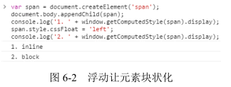
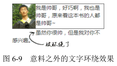
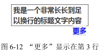
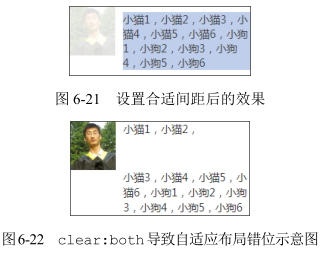

# 魔鬼属性 float

## float 的本质与特性

浮动的本质就是为了实现文字环绕效果。

- 包裹性；
- 块状化并格式化上下文；
- 破坏文档流；
- 没有任何 margin 合并；

所谓“包裹性”，由“包裹”和“自适应性”两部分组成。

1. 包裹。假设浮动元素父元素宽度 200px，浮动元素子元素是一个 128px 宽度的图片，则此时浮动元素宽度表现为“包裹”，就是里面图片的宽度 128px，代码如下：
    ```html
      <style>
        .father {
          width: 200px;
        }
        .float {
          float: left;
        }
        .float img {
          width: 128px;
        }
      </style>
      <div class="father">
        <div class="float">
          
        </div>
      </div>
    ```
2. 自适应性。如果浮动元素的子元素不只是一张 128px 宽度的图片，还有一大波普通的文字，例如：
    ```html
    <div class="father">
      <div class="float">
        我是帅哥，好巧啊，我也是帅哥，原来看这本书的人都是帅哥~
      </div>
    </div>
    ```
    则此时浮动元素宽度就自适应父元素的 200px 宽度，最终的宽度表现也是 200px。

当然，要想最大宽度自适应父元素宽度，一定是在浮动元素的“首选最小宽度”比父元素的宽度要小的前提下，比方说上面示意的“我是帅哥”等文字全是一连串超长的英文字母，则浮动元素的宽度显然就不是 200px 了。

块状化的意思是，元素一旦 float 的属性值不为 none，则其 display 计算值就是 block 或者 table。举个例子，打开浏览器控制台，输入如下 JavaScript 代码：

```js
var span = document.createElement('span');
document.body.appendChild(span);
console.log('1. ' + window.getComputedStyle(span).display);
// 设置元素左浮动
span.style.cssFloat = 'left';
console.log('2. ' + window.getComputedStyle(span).display);
```

结果如图 6-2 所示。



因此，没有任何理由出现下面的样式组合：

```css
span {
  display: block; /* 多余 */
  float: left;
}

span {
  float: left;
  vertical-align: middle; /* 多余 */
}
```

也不要指望使用 text-align 属性控制浮动元素的左右对齐，因为 text-align 对块级元素是无效的。

float 属性与 display 属性值转换关系如表 6-1 所示。

| 设定值 | 计算值 |
|:--------: | :-------: |
| inline | block |
| inline-block | block |
| inline-table | table |
| table-row | block |
| table-row-group | block |
| table-column | block |
| table-column-group | block |
| table-cell | block |
| table-caption | block |
| table-header-group | block |
| table-footer-group | block |

除了 inline-table 计算为 table 外，其他全都是 block。

## float 的作用机制

float 属性有个著名的特性表现，就是会让父元素的高度塌陷，大多数场景下，这种特性会影响“正常的”布局，float 属性让父元素高度塌陷的原因就是为了实现文字环绕效果，然而这种效果现在已经不流行。于是 float 很少发挥其原本的作用，反而被大肆使用满屏布局。

```html
<div class="father">
  
</div>
<p class="animal">小猫 1，小猫 2，...</p>
```


然而，“高度塌陷”只是让跟随的内容可以和浮动元素在一个水平线上，但这只是实现“环绕效果”的条件之一，要想实现真正的“环绕效果”，就需要另外一个平时大家不太在意的特性，那就是“行框盒子和浮动元素的不可重叠性”，也就是“行框盒子如果和浮动元素的垂直高度有重叠，则行框盒子在正常定位状态下只会跟随浮动元素，而不会发生重叠”。

注意，这里说的是“行框盒子”，也就是每行内联元素所在的那个盒子，而非外部的块状盒子。实际上，由于浮动元素的塌陷，块状盒子是和图片完全重叠的，例如，我们给环绕的`<p>`元素设置个背景色，同时把图片搞透明，则效果如图 6-6 所示。


但是，块状盒子中的“行框盒子”却被浮动元素限制，没有任何的重叠，我们可以借助::first-line 伪元素暴露第一行的“行框盒子”区域，CSS 代码如下：

```css
.animal:first-line {
  background: red;
  color: white;
}
```

结果如图 6-7 所示。

这种“限制”是根深蒂固的，也就是“行框盒子”的区域永远就这么大，只要不改变当前布局方式，我们是无法通过其他 CSS 属性改变这个区域大小的。这就是在 4.3 节提到的浮动后面元素 margin 负无穷大依然无效的原因。例如，这里再新增如下 CSS 代码：

```css
.animal {
  margin-left: -100px;
}
```

就会发现，只有外部的块状容器盒子尺寸变大，而和浮动元素垂直方向有重叠的“行框盒子”依然被限死在那里，如图 6-8 所示。


一个元素只要设置了具体的高度值，就不需要担心 float 属性造成的高度塌陷的问题了，既然有了高度，何来“高度塌陷”。这句话对不对呢？是对的。但是，其中也隐含了陷阱，因为“文字环绕效果”是由两个特性（即“父级高度塌陷”和“行框盒子区域限制”）共同作用的结果，定高只能解决“父级高度塌陷”带来的影响，但是对“行框盒子区域限制”却没有任何效果，结果导致的问题是浮动元素垂直区域一旦超出高度范围，或者下面元素 margin-top 负值上偏移，就很容易使后面的元素发生“环绕效果”，代码示意如下：

```html
<style>
  .father {
    height: 64px;
    border: 1px solid #444;
  }
  .float {
    float: left;
  }
  .float img {
    width: 60px;
    height: 64px;
  }
</style>
<div class="father">
  <div class="float">
    
  </div>
  我是帅哥，好巧啊，我也是帅哥，原来看这本书的人都是帅哥~
</div>
<div>
  虽然你很帅，但是我对你不感兴趣。
</div>
```



从这段代码可以看出父级元素.father 高度设置的和图片高度一模一样，都是 64px。按道理，下面的“虽然你很帅，但是我对你不感兴趣。”这些文字应该居左显示，但最后的结果却是图 6-9 所示的这样。

虽然肉眼看上去容器和图片一样高，但是，大家都读过 5.3 节，应该都知道内联状态下的图片底部是有间隙的，也就是.float 这个浮动元素的实际高度并不是 64px，而是要比 64px 高几像素，带来的问题就是浮动元素的高度超出.father 几像素。于是，下面的文字就遭殃了，因为“虽然你很帅……”这段文字所在的“行框盒子”和浮动元素在垂直位置有了重叠，尽管就那么几像素。于是，区域被限制，形成了图6-9 所示的“被环绕”效果。

因此，当使用浮动元素的时候，比较稳妥的做法还是采用一些手段干净地清除浮动带来的影响，以避免很多意料之外的样式问题的发生。

## float 更深入的作用机制

实际项目开发中不可能总是浮动元素在正常流元素的前面，下面来看一个例子。例如，有一个标题，代码如下：

```html
<h3>
  标题
</h3>
```

一直用得好好的，突然来了一个需求，要在右侧加一个“更多”链接，于是 HTML 变成下面这样（我们这里先忽略语义是否得当的问题）：

```html
<h3>
  标题
  <a href="#">
    更多
  </a>
</h3>
```

请问：我们直接让`<a>`元素 float:right 可不可以？

考虑到本书的目标浏览器是 IE8 及以上版本浏览器，因此，答案是：可以。但是，如果你的项目很不幸还需要兼容 IE7 之类的浏览器，则不能这样处理，因为“更多”文字会浮动在下一行内容的右边，而非标题的右边。


比方说，还是这个例子，假设这里的“标题”内容非常长，超过了一行内容，请问：这里的“更多”`<a>`链接元素该如何显示？是图 6-10 所示的这样吗？答案是：不是的。正确表现应该如图 6-11 所示。

为什么呢？首先，我们需要了解两个和 float 相关的术语，一是“浮动锚点”（float anchor），二是“浮动参考”（float reference）。

- 浮动锚点是 float 元素所在的“流”中的一个点，这个点本身并不浮动，就表现而言更像一个没有 margin、border 和 padding 的空的内联元素。
- 浮动参考指的是浮动元素对齐参考的实体。

在 CSS 世界中，float 元素的“浮动参考”是“行框盒子”，也就是 float 元素在当前“行框盒子”内定位。再强调一遍，是“行框盒子”，不是外面的包含块盒子之类的东西，因为CSS 浮动设计的初衷仅仅是实现文字环绕效果。在 CSS 新世界中，float 被赋予了更多的作用和使命，“浮动参考”就不仅仅是“行框盒子”了，不过此非本书重点，就不展开了。

正是因为 float 定位参考的是“行框盒子”，所以“更多”才会在第二行显示。还没理解？那再具体解释一下：每一行内联元素都有一个“行框盒子”，这个例子中标题文字比较多，两行显示了，因此有上下两个“行框盒子”，而“更多”所在的`<a>`元素是在标题文字后面，位于第二行，因此，这里设置了 float:right 的`<a>`元素是相对于第二行的“行框盒子”对齐的，也就是图 6-11 所示的效果。

假如说我们的标题文字再多两个字，正好两行，请问：“更多”两字又当如何显示呢？估计不少人已经可以脑补出最终的样式表现了，“更多”会孤零零地显示在第三行的右边，但容器高度仍然是两行文字的高度，如图 6-12 所示



然而，上面的解释有一个很大的漏洞就是，如果 float 元素前后全是块元素，那根本没有“行框盒子”，何来对齐的说法？此时，就需要上面提到的“浮动锚点”出马了。“浮动锚点”这个术语名称本身很具有欺骗性，看上去应该与 float 的定位位置有关，实际上关系浅薄，在我看来，其作用就是产生“行框盒子”，因为“浮动锚点”表现如同一个空的内联元素，有内联元素自然就有“行框盒子”，于是，float 元素对齐的参考实体“行框盒子”对于块状元素也同样适用了，只不过这个“行框盒子”由于没有任何内容，所以无尺寸，看不见也摸不着罢了。

## float 与流体布局

float 通过破坏正常 CSS 流实现 CSS 环绕，带来了烦人的“高度塌陷”的问题，然而，凡事都具有两面性，只要了解透彻，说不定就可以变废为宝、化腐朽为神奇。例如。我们可以利用 float 破坏 CSS 正常流的特性，实现两栏或多栏的自适应布局。还记不记得之前小动物环绕的例子？其实我们稍加改造，就能变成一侧定宽的两栏自适应布局，HTML 和 CSS 代码如下：

```html
<style>
  .father {
    overflow: hidden;
  }
  .father > img {
    width: 60px;
    height: 64px;
    float: left;
  }
  .animal {
    margin-left: 70px;
  }
</style>
<div class="father">
  
  <p class="animal">
    小猫 1，小猫 2，...
  </p>
</div>
```

和文字环绕效果相比，区别就在于.animal 多了一个margin-left:70px，也就是所有小动物都要跟男主保持至少70px 的距离，由于图片宽度就60px，因此不会发生环绕，自适应效果达成。

原理其实很简单，.animal 元素没有浮动，也没有设置宽度，因此，流动性保持得很好，设置margin-left、border-left或者padding-left都可以自动改变content box的尺寸，继而实现了宽度自适应布局效果。我们不妨对比一下环绕效果的背景区域和这里自适应效果的背景区域（见图 6-13），理解起来应该会更加直白。


没有对比就没有震撼。很多人实现这样的效果会采用下面这样的砖头式的浮动布局：

```css
.animal {
  width: 170px;
  float: right;
}
```

乍一看，效果一样，但是实际上这容错性和可拓展性就差远了。一旦我们的容器宽度发生了变化，那么这个布局就基本作废，宽度小了，两栏内容上下错位，宽度变大，中间间隙宽到可以撑船，就是因为浮动和宽度破坏了 CSS 的流动性。这种感觉就像是把记忆合金变成了死板砖头。在我看来，这类布局是没有任何理由使用这种“砌砖头”式的技术方案的。一个简简单单的 margin-left 岂不比需要计算、代码量多、可维护性差的一堆 CSS 代码好很多！

一般而言，上面的技巧适用于一侧定宽一侧自适应：如果是宽度不固定，也有办法处理，这会在 6.3.2 节中介绍。如果是百分比宽度，则也是可以的，例如：

```css
.left {
  float: left;
  width: 50%;
}

.right {
  margin-left: 50%;
}
```

如果是多栏布局，也同样适用，尤其图 6-14 所示的这种布局。


假设 HTML 结构如下：

```html
<div class="box">
  <a href class="prev">
    &laquo; 上一章
  </a>
  <a href class="next">
    下一章 &raquo;
  </a>
  <h3 class="title">
    第 112 章 动物环绕
  </h3>
</div>
```

则 CSS 可以如下：

```css
.prev {
  float: left;
}

.next {
  float: right;
}

.title {
  margin: 0 70px;
  text-align: center;
}
```

也就是说，.title 所在的`<h3>`标题元素直接左右 margin，借助流体特性，保证不会和两个文字链接重叠。

# float 的天然克星 clear

## 什么是 clear 属性

生生相克，float 这个魔鬼属性也不例外。CSS 有一个专门用来处理 float 属性带来的
高度塌陷等问题的属性，这个属性就是 clear。其语法如下：

```
clear: none | left | right | both
```

如果单看字面意思，clear:left 应该是“清除左浮动”，clear:right 应该是“清除右浮动”的意思，实际上，这种解释是有问题的，因为浮动一直还在，并没有清除。没错，并没有清除。

官方对 clear 属性的解释是：“元素盒子的边不能和前面的浮动元素相邻。”虽然有些拗口，但是有一点是可以体会出来的，就是设置了 clear 属性的元素自身如何如何，而不是让 float 元素如何如何，有种“己所不欲勿施于人”的意味在里面。因此，我对clear 属性值的理解是下面这样的。

- none：默认值，左右浮动来就来。
- left：左侧抗浮动。
- right：右侧抗浮动。
- both：两侧抗浮动。

大家有没有发现，我们平时除了 clear:both 这个声明比较多以外，left 和 right 这两个属性值几乎无人问津，是因为 left 和 right 这两个值没有作用吗？

没错，确实没有什么用！凡是 clear:left 或者 clear:right 起作用的地方，一定可以使用 clear:both 替换！

举个例子，假设容器宽度足够宽，有 10 个`<li>`元素，设置了如下 CSS 代码：

```css
li {
  width: 20px;
  height: 20px;
  margin: 5px;
  float: left;
}

li:nth-of-type(3) {
  clear: both;
}
```

列表最后是 1 行显示、2 行显示，还是 3 行显示呢？


原因在于，clear 属性是让自身不能和前面的浮动元素相邻，注意这里“前面的”3 个字，也就是 clear 属性对“后面的”浮动元素是不闻不问的，因此才 2 行显示而非 3 行。

## 成事不足败事有余的 clear

clear 属性只有块级元素才有效的，而::after 等伪元素默认都是内联水平，这就是借助伪元素清除浮动影响时需要设置 display 属性值的原因。

```css
.clear:after {
  content: '';
  /* 也可以是'block'，或者是'list-item' */
  display: table; 
  clear: both;
}
```

然而，利用伪元素或者直接使用下面 HTML，有时候也会产生一些意想不到的问题：

```html
<div style="clear:both;">
</div>
```

继续前面那个小动物环绕的例子，如果我们在右侧自适应内容里面使用了类似这样的样式，则可能会发生右边的内容跑到图片下边的情况，HTML 代码如下：

```html
<div class="father">
  
  <div class="animal">
    小猫 1，小猫 2，
    <div class="clear">
    </div>
    小猫 3，小猫 4，...
  </div>
</div>
```

结果却是如图 6-16 所示。


由于 clear:both 的作用本质是让自己不和 float 元素在一行显示，并不是真正意义上的清除浮动，因此 float 元素一些不好的特性依然存在，于是，会有类似下面的现象。

1. 如果 clear:both 元素前面的元素就是 float 元素，则 margin-top 负值即使设成-9999px，也不见任何效果。
2. clear:both 后面的元素依旧可能会发生文字环绕的现象。举个例子，如下 HTML 和 CSS：

    ```html
    <style>
      .father:after {
        content: '';
        display: table;
        clear: both;
      }
      .father img {
        float:left;
        width: 60px;
        height: 64px;
      }
      .father + div {
        margin-top: -2px;
      }
    </style>
    <div class="father">
      
      我是帅哥，好巧啊，我也是帅哥，原来看这本书的人都是帅哥~
    </div>
    <div>虽然你很帅，但是我对你不感兴趣。</div>
    ```
    虽然.father 父元素的最后设置了 clear:both 来阻止浮动对后面元素的影响，但是最后结果错位依然发生了，如图 6-17 所示。


由此可见，clear:both 只能在一定程度上消除浮动的影响，要想完美地去除浮动元素的影响，还需要使用其他 CSS 声明。那应该使用哪些 CSS 声明呢？请看 6.3 节。

# CSS 世界的结界 ——BFC

## BFC 的定义

BFC 全称为 block formatting context，中文为“块级格式化上下文”。相对应的还有 IFC，也就是 inline formatting context，中文为“内联格式化上下”。不过 IFC 作用和影响比较隐晦，我们就不介绍了，我们将学习重点放在 BFC 上。

关于 BFC 各种特性什么的，说起来很啰嗦，而我喜欢用“CSS 世界的结界”这种称谓概括 BFC 的特性。“结界”这个词大家应该都理解的，指通过一些特定的手段形成的封闭空间，里面的人出不去，外面的人进不来，具有极强的防御力。BFC 的特性表现如出一辙。

大家请记住下面这个表现原则：如果一个元素具有 BFC，内部子元素再怎么翻江倒海、翻云覆雨，都不会影响外部的元素。所以，BFC 元素是不可能发生 margin 重叠的，因为 margin 重叠是会影响外面的元素的；BFC 元素也可以用来清除浮动的影响，因为如果不清除，子元素浮动则父元素高度塌陷，必然会影响后面元素布局和定位，这显然有违 BFC 元素的子元素不会影响外部元素的设定。

那什么时候会触发 BFC 呢？常见的情况如下：

- `<html>`根元素；
- float 的值不为 none；
- overflow 的值为 auto、scroll 或 hidden；
- display 的值为 table-cell、table-caption 和 inline-block 中的任何一个；
- position 的值不为 relative 和 static。

换言之，只要元素符合上面任意一个条件，就无须使用 clear:both 属性去清除浮动的影响了。因此，不要见到一个`<div>`元素就加个类似.clearfix 的类名，否则只能暴露你孱弱的 CSS 基本功。

## BFC 与流体布局

BFC 的结界特性最重要的用途其实不是去 margin 重叠或者是清除 float 影响，而是实现更健壮、更智能的自适应布局。

我们还是从最基本的文字环绕效果说起。还是那个小动物环绕的例子：

```html
<style>
  img { 
    float: left;
  }
</style>
<div class="father">
  
  <p class="animal">
    小猫 1，小猫 2，...
  </p>
</div>
```

效果如图 6-18 所示。此时.animal 的内容显然受到了设置了 float 属性值的图片的影响而被环绕了。此时如果我们给.animal 元素设置具有 BFC 特性的属性，如 overflow:hidden，如下：

```css
.animal {
  overflow: hidden;
}
```

则根据 BFC 的表现原则，具有 BFC 特性的元素的子元素不会受外部元素影响，也不会影响外部元素。于是，这里的.animal 元素为了不和浮动元素产生任何交集，顺着浮动边缘形成自己的封闭上下文，如图 6-19 所示（垂直虚线为辅助示意）。


也就是说，普通流体元素在设置了 overflow:hidden 后，会自动填满容器中除了浮动元素以外的剩余空间，形成自适应布局效果，而且这种自适应布局要比纯流体自适应更加智能。比方说，我们让图片的尺寸变小或变大，右侧自适应内容无须更改任何样式代码，都可以自动填满剩余的空间。例如，我们把图片的宽度从 60px 改成 30px，结果如图 6-20 所示。


实际项目开发的时候，图片和文字不可能靠这么近，如果想要保持合适的间距，那也很简单，如果元素是左浮动，则浮动元素可以设置 margin-right 成透明 border-right 或 padding-right；又或者右侧 BFC 元素设置成透明 border-left 或者 padding-left，但不包括 margin-left，因为如果想要使用 margin-left，则其值必须是浮动元素的宽度加间隙的大小，就变成动态不可控的了，无法大规模复用。因此，套用上面例子的 HTML，假设我们希望间隙是 10px，则下面这几种写法都是可以的：

- img { margin-right: 10px; }
- img { border-right: 10px solid transparent; }
- img { padding-right: 10px; }
- .animal { border-left: 10px solid transparent; }
- .animal { padding-right: 10px; }

一般而言，我喜欢通过在浮动元素上设置 margin 来控制间距，也就是下面的 CSS 代码：

```css
img {
  float: left;
  margin-right: 10px;
}

.animal {
  overflow: hidden;
}
```

布局效果如图 6-21 所示。



和基于纯流体特性实现的两栏或多栏自适应布局相比，基于 BFC 特性的自适应布局有如下优点：

1. 自适应内容由于封闭而更健壮，容错性更强。比方说，内部设置 clear:both 不会与 float 元素相互干扰而导致错位，也就不会发生类似于图 6-22 所示的问题。
2. 自适应内容自动填满浮动以外区域，无须关心浮动元素宽度，可以整站大规模应用。比方说，抽象几个通用的布局类名，如：
    ```css
    .left {
      float: left; 
    }
    .right {
      float: right;
    }
    .bfc {
      overflow: hidden;
    }
    ```

于是，只要遇到两栏结构，直接使用上面的结构类名就可以完成基本的布局。HTML 示意如下：

```html
<div class="bfc">
  
  <p class="bfc">
    小猫 1，小猫 2，...
  </p>
</div>
```

上面的类名只是示意，具体可根据自己项目的规范设定，甚至直接用.l 或者.r 这样的极短命名也是可以的。

而纯流体布局需要大小不确定的 margin 或 padding 等值撑开合适间距，无法 CSS 组件化。例如，前面出现的 70px，其他类似布局可能就是 90px，无法大规模复用：

```css
.animal {
  margin-left: 70px;
}
```

两种不同原理的自适应布局策略的高下一看便知。甚至可以这么说，有了 BFC 自适应布局，纯流体特性布局基本上没有了存在的价值。然而，只是理论上如此。如果 BFC 自适应布局真那么超能，那为何并没有口口相传呢？

理论上，任何 BFC 元素和 float 元素相遇的时候，都可以实现自动填充的自适应布局。但是，由于绝大多数的触发 BFC 的属性自身有一些古怪的特性，所以，实际操作的时候，能兼顾流体特性和 BFC 特性来实现无敌自适应布局的属性并不多。下面我们一个一个来看，每个 CSS 属性选一个代表来进行说明。

1. float:left。浮动元素本身 BFC 化，然而浮动元素有破坏性和包裹性，失去了元素本身的流体自适应性，因此，无法用来实现自动填满容器的自适应布局。不过，其因兼容性还算良好，与搭积木这种现实认知匹配，上手简单，因此在旧时代被大肆使用，也就是常说的“浮动布局”，也算阴差阳错地开创了自己的一套布局。
2. position:absolute。这个脱离文档流有些严重，过于清高，和非定位元素很难玩到一块儿去，我就不说什么了。
3. overflow:hidden。这个超棒！不像浮动和绝对定位，玩得有点儿过。其本身还是一个很普通的元素，因此，块状元素的流体特性保存得相当完好，附上 BFC 的独立区域特性，可谓如虎添翼、宇宙无敌！而且 overflow:hidden 的 BFC 特性从 IE7 浏览器开始就支持，兼容性也很不错。唯一的问题就是容器盒子外的元素可能会被隐藏掉，一定程度上限制了这种特性的大规模使用。不过，溢出隐藏的交互场景比例不算很高，所以它还是可以作为常用 BFC 布局属性使用的。
4. display:inline-block。这是 CSS 世界最伟大的声明之一，但是用在这里，就有些捉襟见肘了。display:inline-block 会让元素尺寸包裹收缩，完全就不是我们想要的 block 水平的流动特性。只能是一声叹息舍弃掉！然而，峰回路转，世事难料。大家应该知道，IE6 和 IE7 浏览器下，block 水平的元素设置 display:inline-block 元素还是 block 水平，也就是还是会自适应容器的可用宽度显示。于是，对于 IE6 和 IE7 浏览器，我们会阴差阳错得到一个比 overflow:hidden 更强大的声明，既 BFC 特性加身，又流体特性保留
    ```css
    .float-left {
      float: left;
    }
    .bfc-content {
      display: inline-block;
    }
    ```
    当然，*zoom: 1 也是类似效果，不过只适用于低级的 IE 浏览器，如 IE7。
5. display:table-cell。其让元素表现得像单元格一样，IE8 及以上版本浏览器才支持。跟 display:inline-block 一样，它会跟随内部元素的宽度显示，看样子也是不合适的命。但是，单元格有一个非常神奇的特性，就是宽度值设置得再大，实际宽度也不会超过表格容器的宽度。第 3 章单元格一柱擎天的例子利用的就是这种特性，如图 6-23 所示。
    
    因此，如果我们把 display:table-cell 这个 BFC 元素宽度设置得很大，比方说 3000px，那其实就跟 block 水平元素自动适应容器空间效果一模一样了，除非你的容器宽度超过 3000px。实际上，一般 Web 页面不会有 3000px 宽的模块，所以，要是实在不放心，设个 9999px 好了！
    ```css
    .float-left {
      float: left;
    }
    .bfc-content {
      display: table-cell;
      width: 9999px;
    }
    ```
    看上去好像还不错。但是，还是有两点制约，一是需要 IE8 及以上版本的浏览器；二是应付连续英文字符换行有些吃力。但是，总体来看，其适用的场景要比 overflow:hidden 更为广泛。
6. display:table-row。对 width 无感，无法自适应剩余容器空间。
7. display:table-caption。此属性一无是处。

总结一下，我们对 BFC 声明家族大致过了一遍，能担任自适应布局重任的也就是以下几个。

- overflow:auto/hidden，适用于 IE7 及以上版本浏览器；
- display:inline-block，适用于 IE6 和 IE7；
- display:table-cell，适用于 IE8 及以上版本浏览器。

最后，我们可以提炼出两套 IE7 及以上版本浏览器适配的自适应解决方案。

1. 借助 overflow 属性，如下：
    ```css
    .lbf-content {
      overflow: hidden;
    }
    ```
2. 融合 display:table-cell 和 display:inline-block，如下：
    ```css
    .lbf-content {
      display: table-cell;
      width: 9999px;
      /* 如果不需要兼容 IE7，下面样式可以省略 */
      *display: inline-block;
      *width: auto;
    }
    ```

这两种基于 BFC 的自适应方案均支持无限嵌套，因此，多栏自适应可以通过嵌套方式实现。这两种方案均有一点不足，前者如果子元素要定位到父元素的外面可能会被隐藏，后者无法直接让连续英文字符换行。所以，大家可以根据实际的项目场景选择合适的技术方案。

最后，关于 display:table-cell 元素内连续英文字符无法换行的问题，事实上是可以解决的，就是使用类似下面的 CSS 代码：

```css
.word-break {
  display: table;
  width: 100%;
  table-layout: fixed;
  word-break: break-all;
}
```
