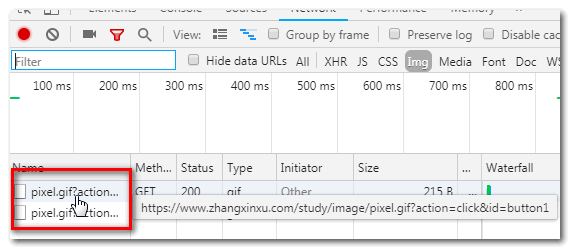
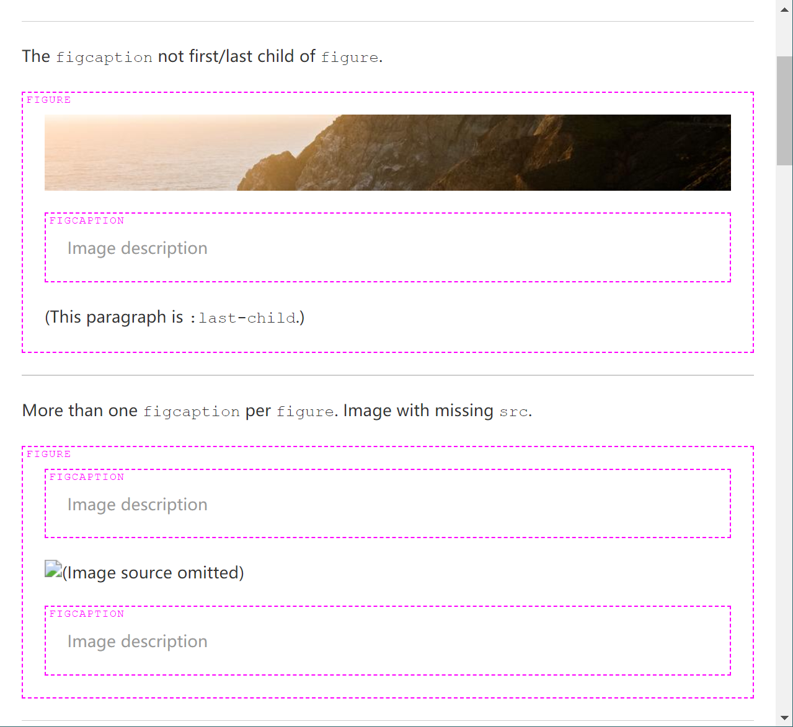

# 纯 CSS 实现数据上报

举个例子，要跟踪并统计某个按钮的点击事件：

```css
.button-1:active::after {
  content: url(./pixel.gif?action=click&id=button1);
  display: none;
}
.button-2:active::after {
  content: url(./pixel.gif?action=click&id=button2);
  display: none;
}
```

此时，当我们点击按钮的时候，相关行为数据就会上报给服务器，这种上报，就算把 JS 禁掉也无法阻止。

点击页面的两个按钮，可以看到发出了如下的请求：



当然，我们可以统计的不仅仅是单击行为，hover 行为，focus 行为都可以统计，当然，还有很多其他方面的。例如：

## 不支持 CSS3 浏览器比例统计

```css
.any-element {
  background: url(./pixel.gif?css=2);
  background-image: url(./pixel.gif?css=3), none;
}
```

例如，我的 Chrome 发出的图片请求地址就是：


类似的，我们可以检测支持其他一些 CSS 属性的比例，要比单纯看浏览器的占比要精准的多。因为同样是 Chrome 浏览器，不同用户版本可能不一样，要想准确知道某些 CSS 新特性支持情况，这种 CSS 上报方法要更准确。

可以使用@supports 规则。

```css
.any-element {
  background: url(./pixel.gif?grid=0);
}

@supports (display: grid) {
  .any-element {
    background: url(./pixel.gif?grid=1);
  }
}
```

## retina 屏幕占比统计

要么上报 0，要么上报 1，最后可以知道 retina 屏幕的比例。

```css
.any-element {
  background: url(./pixel.gif?retina=0);
}

@media screen and (-webkit-min-device-pixel-ratio: 2) {
  .any-element {
    background: url(./pixel.gif?retina=1);
  }
}
```

例如，我家里的 window 普通显示屏：


类似的，可以检测宽屏设备比例等。

## 是否支持某字体

例如，用户是否电脑是否安装了思源黑体：

```css
@font-face {
  font-family: anyFontName;
  src: url(../image/pixel.gif?font=unmatch&id=s_h_s);
}

.element-with-text {
  font-family: 'Source Han Sans CN', 'anyFontName';
}
```

这个要看 font 请求，如果你的浏览器没有安装思源黑体，则会尝试加载 anyFontName 这个字体，于是发起了请求，如下图所示：


如果安装，则没有上报。

我们还可以借助浏览器原生行为简化我们上报成本，比方说表单验证出错，用来统计用户注册或者其他重要表单操作的成功率。

```css
.track:invalid {
  background: url(./pixel.gif?action=regist&status=invalid);
}

.track:valid {
  background: url(./pixel.gif?action=regist&status=valid);
}
```

每当表单提交的时候，我们给 form 元素添加类名.track，此时，其会自动上报表单是否填写完全成功，:invalid 和:valid 都是标准的原生的 CSS 伪类选择器，我们无需自己写验证逻辑。

JS 如下：

```js
forms.addEventListener('submit', function(event) {
  event.preventDefault();
  // 上报成功与否
  this.classList.add('track');
  // 这个是不影响原生表单的提交行为，实际开发多走Ajax
  if (this.reportValidity()) {
    this.submit();
  }
  setTimeout(
    function() {
      this.classList.remove('track');
    }.bind(this),
    0
  );
});
```

HTML 这里也需要 novalidate 属性配合下：

```html
<form novalidate></form>
```

不过，这种方法有个缺陷，无论成功与失败，只能上报一次。

表单的 reportValidity()方法虽然很省力，但是会呼起浏览器原生的提示，过不了设计师那一关的，因此，恩，大家 high 一下即可。

# 纯 CSS 实现 HTML 验证与提示

再说说另外一个纯 CSS 应该，那就是进行 HTML 验证，并且直接在页面上输出来。

举个简单例子，图片如果空 alt 属性，则高亮这个图片：

```css
img[alt=''] {
  outline: 2px solid red;
}
```

又或者\_blank 链接的 rel 属性没有加 noopener 和 noreferrer。

```css
a[target='_blank']:not([rel='noopener noreferrer']) {
  outline: 2px solid red;
}
```

然后配合伪元素在页面上显示提示的文字：

```css
script[src]:not([async]) {
  display: block;
}
script[src]:not([async])::after {
  content: '试试给带有[src="…"]的<script>元素添加[async]属性';
}
```

然后，就有清闲的有志之士还专门搞了个通过 CSS 验证检测 HTML 合法性的 CSS 库，名为 construct.css，项目地址为：https://github.com/t7/construct.css

这里有个 demo，有兴趣的可以进去瞅瞅。

使用很简单，你的项目引入这个 CSS，那些使用有问题的 HTML 就会标记并提示，类似下面截图：



# 应用

本文提到的两个 CSS 的新奇应用，怎么说呢，有点像手工耿哥的的各种手工作品，很有新意，很有特色，可惜，并不实用。

比方说一开始的数据上报，局限很大，很多行为你无法统计；另外维护非常不方便，把一大堆 URL 地址塞到 CSS 中，回头要是改个什么东西，很啰嗦的。CSS 是偏前前端的玩具，而数据上报偏后的前端更合适，实际开发肯定不会这么玩的，人力资源利用完全没有最大化嘛。

还有那个 HTML 验证，这年头，还有谁关心 HTML 语义，结构啥的嘛，小程序，Vue 这种 HTML 结构都是自定义的，和标准越走越远了，没有市场，就没有价值。而且里面很多验证，有些想得太多，空 div 为什么就不能存在呢？我就想不通了。

因此看来，本文介绍的这两个 CSS 应用，只适合远观，不适合亵玩。
