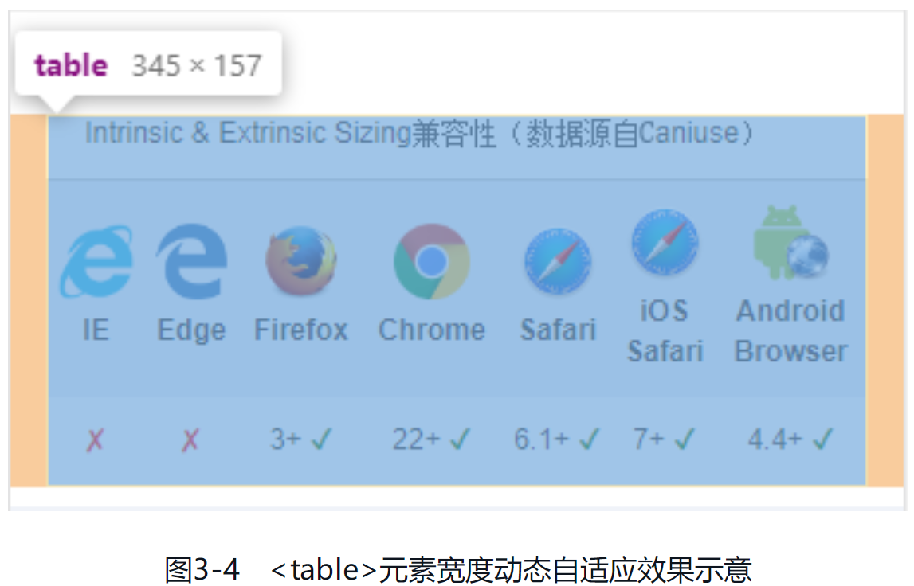
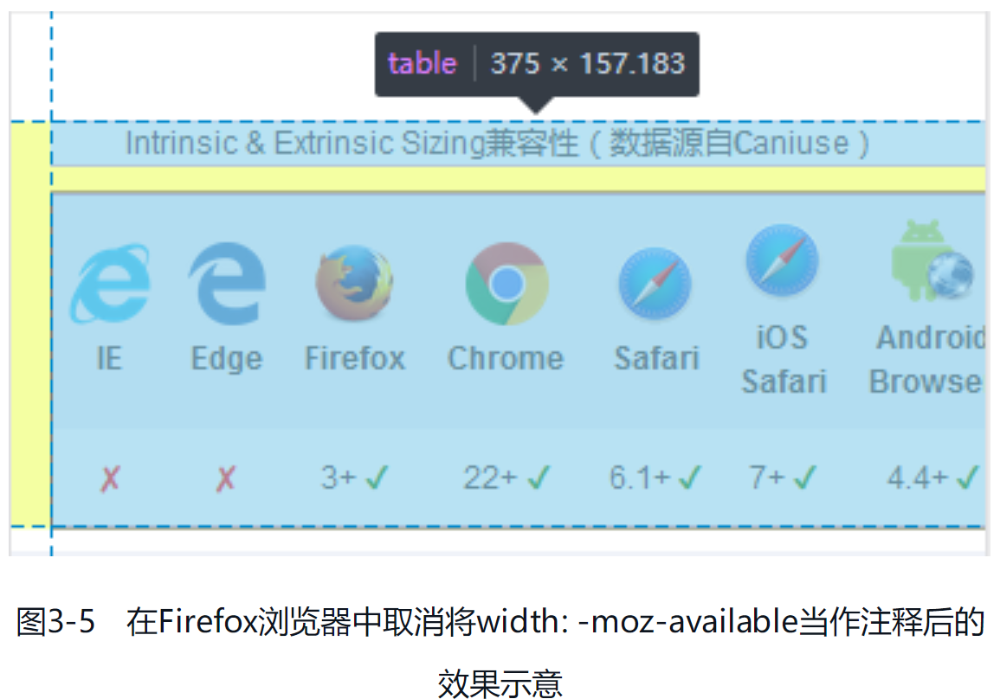

CSS 新世界中有大量的 CSS 新特性源自对 CSS2.1 中已有的 CSS 属性的增强，本章内容所讲述的就是在已有 CSS 属性上新增的那些 CSS 新特性

# 贯穿全书的尺寸体系

在 CSS2.1 中，CSS 中的尺寸概念都隐藏在具体的 CSS 用法中。例如，`display: inline-block`、`float: left` 和 `position: absolute` 等 CSS 声明带来的 `shrink-to-fit` 收缩；`white-space: nowrap` 带来的“最大内容宽度”；连续英文字符的宽度溢出其实是因为“最小内容宽度”。

因为这些尺寸的表现过于隐晦，所以学习时很难理解，学起来就很吃力，这就是我在第 1 章提过的，CSS2.1 中的 CSS 语法虽简单，但理解很难。这种困扰在纯理性思维的开发者身上体现得尤为明显，因为过于理性的人不擅长将模糊的概念转换为感性的认知来进行学习，所以他们学习 JavaScript 得心应手，但是学习 CSS 就会觉得比较困难。

不过从 CSS3 开始，以前很多模糊的概念有了明确的定义，并且这些明确的定义有与之相匹配的 CSS 属性或 CSS 属性值。这种变化的优点很明显，那就是我们不需要再去理解 CSS 属性背后隐藏的含义和特性，知识变得更表层、更浅显了。虽说 CSS 学习的广度有所增加，但是总体来看，把概念规范起来的利还是远远大于弊的。例如接下来要介绍的尺寸体系，如果用一个金字塔来表示，那么在最上层的概念就是 `Intrinsic Sizing` 和 `Extrinsic Sizing`。`Intrinsic Sizing` 被称为 `内在尺寸`，表示元素最终的尺寸表现是由内容决定的；`Extrinsic Sizing` 被称为 `外在尺寸`，表示元素最终的尺寸表现是由上下文决定的。

由于新的尺寸关键字在 width 属性中最常用，因此，本节以 width 属性为示例属性，和大家深入探讨 CSS 新世界中的尺寸概念。本节内容很重要，大家请仔细阅读，如有必要，可以反复阅读。

CSS 的 width 属性新增了 4 个与尺寸概念相匹配的关键字，包括 fit-content、fill-available、min-content 和 max-content，每一个关键字背后都有知识点。我们先从最常用的 fit-content 关键字开始讲解。

## 从 width: fit-content 声明开始

fit-content 关键字是新的尺寸体系关键字中使用频率最高的关键字。你可以把 fit-content 关键字的尺寸表现想象成“紧身裤”，大腿的肉对应的就是元素里面的内容，如果是宽松的裤子，那肉眼所见的尺寸就比较大，但是如果是紧身裤，则呈现的尺寸就是大腿实际的尺寸。同样，元素应用 fit-content 关键字就像给元素里面的内容穿上了超薄紧身裤，此时元素的尺寸就是里面内容的尺寸。

实际上，fit-content 关键字的样式表现就是 CSS2.1 规范中的“shrink-to-fit”，我称其为“包裹性”。这种尺寸表现和元素应用 display: inline-block、position: absolute 等 CSS 声明类似，尺寸收缩但不会超出包含块级元素的尺寸限制。

举个例子，要实现和 [CSS 世界流、元素与基本尺寸——包裹性](/css-world-flow-element-size/#包裹性) 的例子一样的效果，需求描述为：一段文字，字数少的时候居中显示，字数多的时候左对齐显示。当然这里使用了不一样的方法，关键 CSS 代码如下：

```css
/* 传统实现 display: table */
.cw-content {
   display: table;
   margin: auto;
}

/* fit-content 实现 */
.cw-content {
   width: fit-content;
   margin: auto;
}
```

可以看到，在现代浏览器中，两种方法实现的效果一模一样：

[fit-content-x-center](embedded-codesandbox://css-new-world-enhance-existing-css/fit-content-x-center)

如果是内联元素要收缩，可以使用 display: inline-block 声明；如果是块级元素要收缩，可以使用 display: table 声明。这两种方式效果一样，兼容性还更好，IE8+ 浏览器都提供了支持。这么一看，fit-content 关键字岂不是没什么用？实际上并不是这样，使用 fit-content 关键字有两大优点。

1. 保护了元素原始的 display 计算值，例如 `<li>` 元素要是设置成了 display: table，前面的项目符号就不会出现，::marker 伪元素也会失效。

2. 让元素的尺寸有了确定的值，这是 fit-content 关键字最重要也最可贵的优点。第二个优点有必要展开讲一下。

### fit-content 关键字让元素有了确定的尺寸

CSS 中有不少布局需要有明确的元素的尺寸才能实现，非常典型的例子就是绝对定位元素使用 margin: auto 实现居中效果时需要设置具体的 width 或 height 的属性值，CSS 代码示意如下：

```css
.cw-dialog {
   width: 300px;
   height: 200px;
   position: absolute;
   left: 0;
   top: 0;
   right: 0;
   bottom: 0;
   margin: auto;
   border: solid;
}
```

但是，很多时候绝对定位元素的尺寸是不固定的，最终的尺寸会根据内容自动变化，此时上面的 CSS 代码就不适合，该怎么办呢？很多人会想到使用 transform 属性进行偏移：

```css
.cw-dialog {
   position: absolute;
   left: 50%;
   top: 50%;
   border: solid;
   transform: translate(-50%, -50%);
}
```

这是一种不错的方法，但并不完美，而且这个方法占用了 transform 属性，这会导致绝对定位元素无法使用包含 transform 属性的动画效果。例如，现在项目中有一个整站通用的体验增强的位移小动画：

```css
@keyframe tinyUp {
   from {
      transform: translateY(5px);
   }

   to {
      transform: translateY(0);
   }
}
```

.cw-dialog 元素就没办法使用这个名为 tinyUp 的位移小动画，因为 CSS 动画关键帧中的 CSS 语句的优先级最高，会干扰原本设置的 transform 偏移值：

```css
.cw-dialog {
   position: absolute;
   left: 50%;
   top: 50%;
   border: solid;
   /* transform 会被 animation 动画干扰 */
   transform: translate(-50%, -50%);
   animation: tinyUp 0.2s;
}
```

有没有什么更好的方法呢？有，就是使用 fit-content 关键字，例如：

```css
.cw-dialog {
   width: fit-content;
   height: fit-content;
   position: absolute;
   left: 0;
   top: 0;
   right: 0;
   bottom: 0;
   margin: auto;
   border: solid;
   animation: tinyUp 0.2s;
}
```

此时元素尺寸自适应，同时完全居中，不用担心包括 transform 属性的动画带来的冲突。

[fit-content-xy-center](embedded-codesandbox://css-new-world-enhance-existing-css/fit-content-xy-center)

在 webkit 浏览器中，大家可以看到弹框出现的时候会有一个向上微移的动画，这就是 fit-content 关键字带来的体验增强。其他浏览器则做了降级处理（兼容到 IE9），即居中功能正常，但没有动画，兼容细节可参见示例页面源码。

### fit-content 关键字的兼容性

fit-content 关键字的兼容性比较复杂，很多人会误认为 width 属性和 height 属性都表示尺寸，fit-content 关键字作为这两个属性的属性值，兼容性应该与它们一样，然而实际上差异很大，具体细节如下。

1. IE 浏览器和 Edge 浏览器不支持 fit-content 关键字，若要兼容，可以使用传统方法进行模拟。

   Chrome 浏览器最早在 2012 年的时候就已支持 width: fit-content，Safari 等浏览器紧随其后很快也支持了，因此 width: fit-content 目前在移动端是可以放心使用的。为了兼顾少部分陈旧手机用户，稳妥起见，我们可以加上 -webkit- 私有前缀：

   ```css
   .example {
      width: -webkit-fit-content;
      width: fit-content;
   }
   ```

   对于 Firefox 浏览器，还需要添加 -moz- 私有前缀，因此，对于用户量较大的对外项目，下面的书写方式是最稳妥的：

   ```css
   .example {
      width: -webkit-fit-content;
      width: -moz-fit-content;
      width: fit-content;
   }
   ```

   height: fit-content 则是在 2015 年才开始被支持的，比 width: fit-content 晚了 3 年，不过依旧可以放心大胆使用：

   ```css
   .example {
      height: -webkit-fit-content;
      height: fit-content;
   }
   ```

   至于 Firefox 浏览器，虽然它在语法上支持 height: fit-content，但是并没有任何实际的效果。例如我们设置 height: -moz-fit-content，Firefox 浏览器不会认为它是错误的语法，但是没有任何实际的效果，可以说 Firefox 浏览器目前并不支持 height: fit-content。因此，请勿出现下面的特征检测语法：

   ```css
   @support (height: fit-content) or (height: -moz-fit-content) {
      .example {
         height: -moz-fit-content;
         height: fit-content;
      }
   }
   ```

   当然，随着时间推进，若干年后，Firefox 浏览器也可能会完美支持 height: fit-content 声明。

2. min-width 属性和 max-width 属性可以正确渲染 fit-content 关键字，而 max-height 和 min-height 属性设置 fit-content 关键字虽然语法正确，但没有任何具体的样式表现。

   有人可能会问，既然无效，那浏览器还认为 fit-content 关键字对于 max-height 和 min-height 属性是合法的，这也太奇怪了吧？

   实际并不是这样，max-height: fit-content、min-height: fit-content 和 Firefox 浏览器中的 height: -moz-fit-content 声明在某些情况下也是有效的：

   ```css
   .parent {
      writing-mode: vertical-rl;
   }

   .child {
      /* 有效 */
      max-height: fit-content;
   }
   ```

   即在图文内容垂直排版的时候，height 相关的 CSS 属性是可以准确渲染 fit-content 关键字的。

## stretch、available 和 fill-available 关键字究竟用哪个

我们在页面中放置一个没有样式设置的 `<div>` 元素，此时，该 `<div>` 元素的宽度自动填满可用空间。

stretch、available 和 fill-available 这 3 个关键字虽然名称有所不同，但是作用都是一致的，那就是让元素的尺寸自动填满可用空间，就如同 `<div>` 元素的默认尺寸表现。

下面问题来了，究竟该使用 stretch、available 和 fill-available 这 3 个关键字中的哪一个呢？先简单分析一下这 3 个关键字。

- stretch 指 `弹性拉伸`，是最新的规范中定义的关键字，替换之前的 fill-available 和 available。
- available 指 `可用空间`，是 Firefox 浏览器使用的关键字，需要配合 -moz- 私有前缀使用。
- fill-available 指 `填充可用空间`，是 webkit 浏览器使用的关键字，需要配合 -webkit- 私有前缀使用。

因此，立足现在，面向未来，我们的 CSS 应该这么写：

```css
.element {
   width: -webkit-fill-available;
   width: -moz-available;
   width: stretch;
}
```

为了统一，接下来分享的内容都以 stretch 关键字为代表进行介绍。

### stretch 关键字的应用场景

实际开发的时候，我们需要用到 stretch 关键字的场景并不多。首先，block 水平的元素、弹性布局和网格布局中的子项默认都自带弹性拉伸特性；其次，对于替换元素、表格元素、内联块级元素等这些具有“包裹性”的元素，建议使用 `宽度分离原则` 进行自适应，例如：

```css
.container {
   margin: 15px;
   padding: 10px;
}

.container > img {
   width: 100%;
}
```

也就是外面嵌套一层普通的块级元素，块级元素具有弹性拉伸特性，因此可以很好地实现替换元素的宽度自适应布局效果。

只有当我们的 HTML 标签使用受限的时候，才需要考虑使用 stretch 关键字。例如一个 `<button>` 按钮元素，希望距离容器左右边缘各 15px 的间距，但是外部又不方便嵌套其他标签元素，此时就非常适合使用 stretch 关键字，这样连 box-sizing 属性都可以省略：

```css
button {
   height: 40px;
   width: -webkit-fill-available;
   width: -moz-available;
   width: stretch;
   margin-left: 15px;
   margin-right: 15px;
}
```

[stretch-button](embedded-codesandbox://css-new-world-enhance-existing-css/stretch-button)

然而，IE 浏览器和 Edge 浏览器是不支持 stretch 关键字的，因此如果你的项目需要兼容这两个浏览器，stretch 关键字就不能使用，需要换成其他兼容性更好的方法，那就是使用 calc() 函数，示例如下：

```css
button {
   height: 40px;
   width: calc(100% - 30px);
   margin-left: 15px;
   margin-right: 15px;
   box-sizing: border-box;
}
```

其实现效果和使用 stretch 关键字是一样的。兼容性问题限制了 stretch 关键字的使用场景。

当然，如果你的项目没有兼容性的顾虑，例如后台产品、实验项目或者是移动端项目，我还是建议使用 stretch 关键字。因为 calc() 函数的代码有些麻烦，宽度要手动计算，而且当 margin 在水平方向的大小发生变化的时候，width 属性值也要同步变化，这增加了维护成本，不如使用 stretch 关键字省心。

或者各退一步，既使用新特性，又兜底低版本浏览器；既满足使用新特性的要求，又不用担心兼容问题：

```css
button {
   height: 40px;
   width: calc(100% - 30px);
   width: -webkit-fill-available;
   width: -moz-available;
   width: stretch;
   margin-left: 15px;
   margin-right: 15px;
   box-sizing: border-box;
}
```

个中权衡还需要大家根据实际场景进行判断。

### stretch 关键字在 Firefox 浏览器中的问题

`<table>` 元素的默认尺寸表现是收缩，并且实际开发的时候往往需要宽度自适应于外部容器，因此 `<table>` 元素很适合使用 stretch 关键字。在 CSS 重置的时候，不要再使用下面这样的 CSS 代码：

```css
table {
   width: 100%;
   table-layout: fixed;
   box-sizing: border-box;
}
```

可以优化成：

```css
table {
   width: 100%;
   width: -webkit-fill-available;
   width: -moz-available;
   width: stretch;
   table-layout: fixed;
   box-sizing: border-box;
}
```

这样就算我们的 `<table>` 元素设置 margin 属性，也能完美自适应尺寸。

但是有一个例外，那就是 Firefox 浏览器。Firefox 浏览器在其他所有场景下都运行完美，唯独对 table 和 inline-table 水平的元素的渲染有问题，这些元素设置 width: -moz-available 的效果和设置 width: 100% 是一样的。

我们不妨来看一个例子，实现一个左右留有 15px 间距的 `<table>` 元素布局：

```css
table {
   width: calc(100% - 32px);
   width: -webkit-fill-available;
   /* width: -moz-available; */
   width: stretch;
   margin-left: 15px;
   margin-right: 15px;
   border: 1px solid lightgray;
}
```

此时，无论 `<table>` 元素的 width、margin 或者 border 如何变化，`<table>` 元素的宽度永远自适应外部容器。图 3-4 展示的就是上述代码在 375px 宽度屏幕下的运行效果，可以看到 `<table>` 元素的尺寸正好自适应屏幕尺寸。



但是，如果打开 Firefox 浏览器的开发者工具，取消将 width: -moz-available 当作注释，就会发现 `<table>` 元素的宽度超出了屏幕的尺寸，如图 3-5 所示。



[stretch-firefox-table](embedded-codesandbox://css-new-world-enhance-existing-css/stretch-firefox-table)

因此，如果宽度自适应拉伸效果用在 `<table>` 元素上，就不要再使用 -moz-available。

// TODO CSS 新世界增强已有的 CSS 属性
