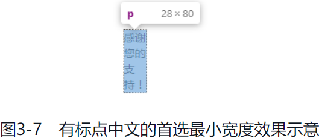
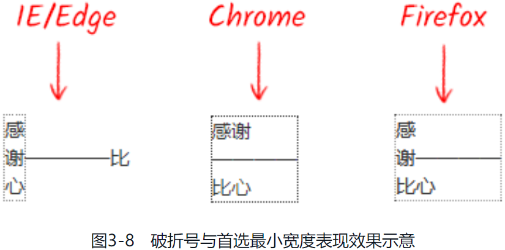
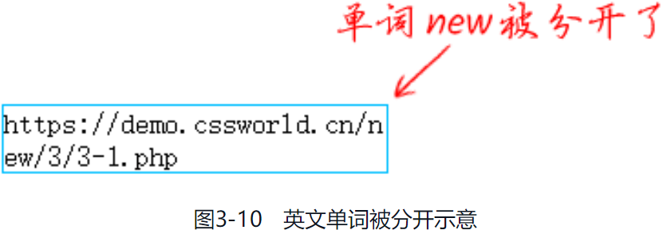
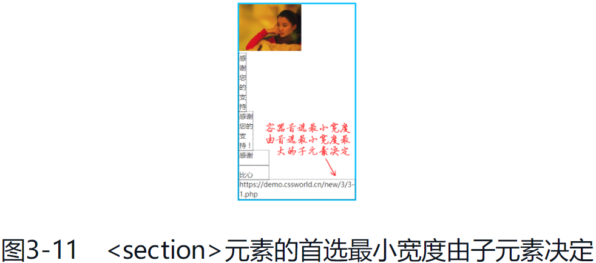
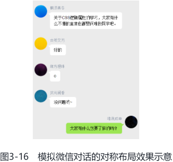
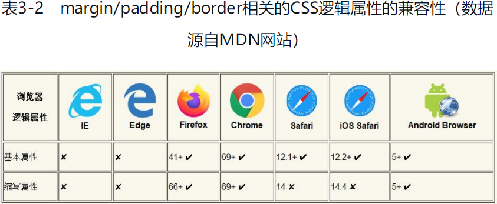

CSS 新世界中有大量的 CSS 新特性源自对 CSS2.1 中已有的 CSS 属性的增强，本章内容所讲述的就是在已有 CSS 属性上新增的那些 CSS 新特性

# 贯穿全书的尺寸体系

在 CSS2.1 中，CSS 中的尺寸概念都隐藏在具体的 CSS 用法中。例如，`display: inline-block`、`float: left` 和 `position: absolute` 等 CSS 声明带来的 `shrink-to-fit` 收缩；`white-space: nowrap` 带来的“最大内容宽度”；连续英文字符的宽度溢出其实是因为“最小内容宽度”。

因为这些尺寸的表现过于隐晦，所以学习时很难理解，学起来就很吃力，这就是我在第 1 章提过的，CSS2.1 中的 CSS 语法虽简单，但理解很难。这种困扰在纯理性思维的开发者身上体现得尤为明显，因为过于理性的人不擅长将模糊的概念转换为感性的认知来进行学习，所以他们学习 JavaScript 得心应手，但是学习 CSS 就会觉得比较困难。

不过从 CSS3 开始，以前很多模糊的概念有了明确的定义，并且这些明确的定义有与之相匹配的 CSS 属性或 CSS 属性值。这种变化的优点很明显，那就是我们不需要再去理解 CSS 属性背后隐藏的含义和特性，知识变得更表层、更浅显了。虽说 CSS 学习的广度有所增加，但是总体来看，把概念规范起来的利还是远远大于弊的。例如接下来要介绍的尺寸体系，如果用一个金字塔来表示，那么在最上层的概念就是 `Intrinsic Sizing` 和 `Extrinsic Sizing`。`Intrinsic Sizing` 被称为 `内在尺寸`，表示元素最终的尺寸表现是由内容决定的；`Extrinsic Sizing` 被称为 `外在尺寸`，表示元素最终的尺寸表现是由上下文决定的。

由于新的尺寸关键字在 width 属性中最常用，因此，本节以 width 属性为示例属性，和大家深入探讨 CSS 新世界中的尺寸概念。本节内容很重要，大家请仔细阅读，如有必要，可以反复阅读。

CSS 的 width 属性新增了 4 个与尺寸概念相匹配的关键字，包括 fit-content、fill-available、min-content 和 max-content，每一个关键字背后都有知识点。我们先从最常用的 fit-content 关键字开始讲解。

## 从 width: fit-content 声明开始

fit-content 关键字是新的尺寸体系关键字中使用频率最高的关键字。你可以把 fit-content 关键字的尺寸表现想象成“紧身裤”，大腿的肉对应的就是元素里面的内容，如果是宽松的裤子，那肉眼所见的尺寸就比较大，但是如果是紧身裤，则呈现的尺寸就是大腿实际的尺寸。同样，元素应用 fit-content 关键字就像给元素里面的内容穿上了超薄紧身裤，此时元素的尺寸就是里面内容的尺寸。

实际上，fit-content 关键字的样式表现就是 CSS2.1 规范中的“shrink-to-fit”，我称其为“包裹性”。这种尺寸表现和元素应用 display: inline-block、position: absolute 等 CSS 声明类似，尺寸收缩但不会超出包含块级元素的尺寸限制。

举个例子，要实现和 [CSS 世界流、元素与基本尺寸——包裹性](/css-world-flow-element-size/#包裹性) 的例子一样的效果，需求描述为：一段文字，字数少的时候居中显示，字数多的时候左对齐显示。当然这里使用了不一样的方法，关键 CSS 代码如下：

```css
/* 传统实现 display: table */
.cw-content {
   display: table;
   margin: auto;
}

/* fit-content 实现 */
.cw-content {
   width: fit-content;
   margin: auto;
}
```

可以看到，在现代浏览器中，两种方法实现的效果一模一样：

[fit-content-x-center](embedded-codesandbox://css-new-world-enhance-existing-css/fit-content-x-center)

如果是内联元素要收缩，可以使用 display: inline-block 声明；如果是块级元素要收缩，可以使用 display: table 声明。这两种方式效果一样，兼容性还更好，IE8+ 浏览器都提供了支持。这么一看，fit-content 关键字岂不是没什么用？实际上并不是这样，使用 fit-content 关键字有两大优点。

1. 保护了元素原始的 display 计算值，例如 `<li>` 元素要是设置成了 display: table，前面的项目符号就不会出现，::marker 伪元素也会失效。

2. 让元素的尺寸有了确定的值，这是 fit-content 关键字最重要也最可贵的优点。第二个优点有必要展开讲一下。

### fit-content 关键字让元素有了确定的尺寸

CSS 中有不少布局需要有明确的元素的尺寸才能实现，非常典型的例子就是绝对定位元素使用 margin: auto 实现居中效果时需要设置具体的 width 或 height 的属性值，CSS 代码示意如下：

```css
.cw-dialog {
   width: 300px;
   height: 200px;
   position: absolute;
   left: 0;
   top: 0;
   right: 0;
   bottom: 0;
   margin: auto;
   border: solid;
}
```

但是，很多时候绝对定位元素的尺寸是不固定的，最终的尺寸会根据内容自动变化，此时上面的 CSS 代码就不适合，该怎么办呢？很多人会想到使用 transform 属性进行偏移：

```css
.cw-dialog {
   position: absolute;
   left: 50%;
   top: 50%;
   border: solid;
   transform: translate(-50%, -50%);
}
```

这是一种不错的方法，但并不完美，而且这个方法占用了 transform 属性，这会导致绝对定位元素无法使用包含 transform 属性的动画效果。例如，现在项目中有一个整站通用的体验增强的位移小动画：

```css
@keyframe tinyUp {
   from {
      transform: translateY(5px);
   }

   to {
      transform: translateY(0);
   }
}
```

.cw-dialog 元素就没办法使用这个名为 tinyUp 的位移小动画，因为 CSS 动画关键帧中的 CSS 语句的优先级最高，会干扰原本设置的 transform 偏移值：

```css
.cw-dialog {
   position: absolute;
   left: 50%;
   top: 50%;
   border: solid;
   /* transform 会被 animation 动画干扰 */
   transform: translate(-50%, -50%);
   animation: tinyUp 0.2s;
}
```

有没有什么更好的方法呢？有，就是使用 fit-content 关键字，例如：

```css
.cw-dialog {
   width: fit-content;
   height: fit-content;
   position: absolute;
   left: 0;
   top: 0;
   right: 0;
   bottom: 0;
   margin: auto;
   border: solid;
   animation: tinyUp 0.2s;
}
```

此时元素尺寸自适应，同时完全居中，不用担心包括 transform 属性的动画带来的冲突。

[fit-content-xy-center](embedded-codesandbox://css-new-world-enhance-existing-css/fit-content-xy-center)

在 webkit 浏览器中，大家可以看到弹框出现的时候会有一个向上微移的动画，这就是 fit-content 关键字带来的体验增强。其他浏览器则做了降级处理（兼容到 IE9），即居中功能正常，但没有动画，兼容细节可参见示例页面源码。

### fit-content 关键字的兼容性

fit-content 关键字的兼容性比较复杂，很多人会误认为 width 属性和 height 属性都表示尺寸，fit-content 关键字作为这两个属性的属性值，兼容性应该与它们一样，然而实际上差异很大，具体细节如下。

1. IE 浏览器和 Edge 浏览器不支持 fit-content 关键字，若要兼容，可以使用传统方法进行模拟。

   Chrome 浏览器最早在 2012 年的时候就已支持 width: fit-content，Safari 等浏览器紧随其后很快也支持了，因此 width: fit-content 目前在移动端是可以放心使用的。为了兼顾少部分陈旧手机用户，稳妥起见，我们可以加上 -webkit- 私有前缀：

   ```css
   .example {
      width: -webkit-fit-content;
      width: fit-content;
   }
   ```

   对于 Firefox 浏览器，还需要添加 -moz- 私有前缀，因此，对于用户量较大的对外项目，下面的书写方式是最稳妥的：

   ```css
   .example {
      width: -webkit-fit-content;
      width: -moz-fit-content;
      width: fit-content;
   }
   ```

   height: fit-content 则是在 2015 年才开始被支持的，比 width: fit-content 晚了 3 年，不过依旧可以放心大胆使用：

   ```css
   .example {
      height: -webkit-fit-content;
      height: fit-content;
   }
   ```

   至于 Firefox 浏览器，虽然它在语法上支持 height: fit-content，但是并没有任何实际的效果。例如我们设置 height: -moz-fit-content，Firefox 浏览器不会认为它是错误的语法，但是没有任何实际的效果，可以说 Firefox 浏览器目前并不支持 height: fit-content。因此，请勿出现下面的特征检测语法：

   ```css
   @support (height: fit-content) or (height: -moz-fit-content) {
      .example {
         height: -moz-fit-content;
         height: fit-content;
      }
   }
   ```

   当然，随着时间推进，若干年后，Firefox 浏览器也可能会完美支持 height: fit-content 声明。

2. min-width 属性和 max-width 属性可以正确渲染 fit-content 关键字，而 max-height 和 min-height 属性设置 fit-content 关键字虽然语法正确，但没有任何具体的样式表现。

   有人可能会问，既然无效，那浏览器还认为 fit-content 关键字对于 max-height 和 min-height 属性是合法的，这也太奇怪了吧？

   实际并不是这样，max-height: fit-content、min-height: fit-content 和 Firefox 浏览器中的 height: -moz-fit-content 声明在某些情况下也是有效的：

   ```css
   .parent {
      writing-mode: vertical-rl;
   }

   .child {
      /* 有效 */
      max-height: fit-content;
   }
   ```

   即在图文内容垂直排版的时候，height 相关的 CSS 属性是可以准确渲染 fit-content 关键字的。

## stretch、available 和 fill-available 关键字究竟用哪个

我们在页面中放置一个没有样式设置的 `<div>` 元素，此时，该 `<div>` 元素的宽度自动填满可用空间。

stretch、available 和 fill-available 这 3 个关键字虽然名称有所不同，但是作用都是一致的，那就是让元素的尺寸自动填满可用空间，就如同 `<div>` 元素的默认尺寸表现。

下面问题来了，究竟该使用 stretch、available 和 fill-available 这 3 个关键字中的哪一个呢？先简单分析一下这 3 个关键字。

- stretch 指 `弹性拉伸`，是最新的规范中定义的关键字，替换之前的 fill-available 和 available。
- available 指 `可用空间`，是 Firefox 浏览器使用的关键字，需要配合 -moz- 私有前缀使用。
- fill-available 指 `填充可用空间`，是 webkit 浏览器使用的关键字，需要配合 -webkit- 私有前缀使用。

因此，立足现在，面向未来，我们的 CSS 应该这么写：

```css
.element {
   width: -webkit-fill-available;
   width: -moz-available;
   width: stretch;
}
```

为了统一，接下来分享的内容都以 stretch 关键字为代表进行介绍。

### stretch 关键字的应用场景

实际开发的时候，我们需要用到 stretch 关键字的场景并不多。首先，block 水平的元素、弹性布局和网格布局中的子项默认都自带弹性拉伸特性；其次，对于替换元素、表格元素、内联块级元素等这些具有“包裹性”的元素，建议使用 `宽度分离原则` 进行自适应，例如：

```css
.container {
   margin: 15px;
   padding: 10px;
}

.container > img {
   width: 100%;
}
```

也就是外面嵌套一层普通的块级元素，块级元素具有弹性拉伸特性，因此可以很好地实现替换元素的宽度自适应布局效果。

只有当我们的 HTML 标签使用受限的时候，才需要考虑使用 stretch 关键字。例如一个 `<button>` 按钮元素，希望距离容器左右边缘各 15px 的间距，但是外部又不方便嵌套其他标签元素，此时就非常适合使用 stretch 关键字，这样连 box-sizing 属性都可以省略：

```css
button {
   height: 40px;
   width: -webkit-fill-available;
   width: -moz-available;
   width: stretch;
   margin-left: 15px;
   margin-right: 15px;
}
```

[stretch-button](embedded-codesandbox://css-new-world-enhance-existing-css/stretch-button)

然而，IE 浏览器和 Edge 浏览器是不支持 stretch 关键字的，因此如果你的项目需要兼容这两个浏览器，stretch 关键字就不能使用，需要换成其他兼容性更好的方法，那就是使用 calc() 函数，示例如下：

```css
button {
   height: 40px;
   width: calc(100% - 30px);
   margin-left: 15px;
   margin-right: 15px;
   box-sizing: border-box;
}
```

其实现效果和使用 stretch 关键字是一样的。兼容性问题限制了 stretch 关键字的使用场景。

当然，如果你的项目没有兼容性的顾虑，例如后台产品、实验项目或者是移动端项目，我还是建议使用 stretch 关键字。因为 calc() 函数的代码有些麻烦，宽度要手动计算，而且当 margin 在水平方向的大小发生变化的时候，width 属性值也要同步变化，这增加了维护成本，不如使用 stretch 关键字省心。

或者各退一步，既使用新特性，又兜底低版本浏览器；既满足使用新特性的要求，又不用担心兼容问题：

```css
button {
   height: 40px;
   width: calc(100% - 30px);
   width: -webkit-fill-available;
   width: -moz-available;
   width: stretch;
   margin-left: 15px;
   margin-right: 15px;
   box-sizing: border-box;
}
```

个中权衡还需要大家根据实际场景进行判断。

### stretch 关键字在 Firefox 浏览器中的问题

`<table>` 元素的默认尺寸表现是收缩，并且实际开发的时候往往需要宽度自适应于外部容器，因此 `<table>` 元素很适合使用 stretch 关键字。在 CSS 重置的时候，不要再使用下面这样的 CSS 代码：

```css
table {
   width: 100%;
   table-layout: fixed;
   box-sizing: border-box;
}
```

可以优化成：

```css
table {
   width: 100%;
   width: -webkit-fill-available;
   width: -moz-available;
   width: stretch;
   table-layout: fixed;
   box-sizing: border-box;
}
```

这样就算我们的 `<table>` 元素设置 margin 属性，也能完美自适应尺寸。

但是有一个例外，那就是 Firefox 浏览器。Firefox 浏览器在其他所有场景下都运行完美，唯独对 table 和 inline-table 水平的元素的渲染有问题，这些元素设置 width: -moz-available 的效果和设置 width: 100% 是一样的。

我们不妨来看一个例子，实现一个左右留有 15px 间距的 `<table>` 元素布局：

```css
table {
   width: calc(100% - 32px);
   width: -webkit-fill-available;
   /* width: -moz-available; */
   width: stretch;
   margin-left: 15px;
   margin-right: 15px;
   border: 1px solid lightgray;
}
```

此时，无论 `<table>` 元素的 width、margin 或者 border 如何变化，`<table>` 元素的宽度永远自适应外部容器。图 3-4 展示的就是上述代码在 375px 宽度屏幕下的运行效果，可以看到 `<table>` 元素的尺寸正好自适应屏幕尺寸。


但是，如果打开 Firefox 浏览器的开发者工具，取消将 width: -moz-available 当作注释，就会发现 `<table>` 元素的宽度超出了屏幕的尺寸，如图 3-5 所示。


[stretch-firefox-table](embedded-codesandbox://css-new-world-enhance-existing-css/stretch-firefox-table)

因此，如果宽度自适应拉伸效果用在 `<table>` 元素上，就不要再使用 -moz-available。

## 深入了解 min-content 关键字

min-content 关键字实际上就是 CSS2.1 规范中提到的“preferred minimum width”或者“minimum content width”，即“首选最小宽度”或者“最小内容宽度”。

“首选最小宽度”在 CSS 世界中有过简单的介绍，这里再把最小宽度规则深入讲解一下。

众所周知，元素由 content-box、padding-box、border-box 和 margin-box 组成，元素最终占据的尺寸由这 4 个盒子占据的尺寸决定。其中 padding-box、border-box 和 margin-box 的尺寸表现规则不会因为元素的不同而有所不同，但是 content-box 不一样，它随着内容的不同，首选最小宽度也会不同。这个有必要好好讲一讲。

### 替换元素

按钮、视频和图片等元素属于替换元素，替换元素的首选最小宽度是当前元素内容自身的宽度。例如：

```html
<section>
   
</section>
```

上面这段 HTML 代码中的图片，如果原始尺寸是 256px×192px，则 `<section>` 元素的首选最小宽度就是 256px。

### CJK 文字

CJK 是 Chinese/Japanese/Korean 的缩写，指的是中文、日文、韩文这几种文字。这里以中文为代表加以说明。如果是一段没有标点的中文文字，则首选最小宽度是单个汉字的宽度。例如：

```html
<style>
   p {
      width: min-content;
      outline: 1px dotted;
   }
</style>
<p>感谢你的支持</p>
```

最终的宽度表现效果如图 3-6 所示。


但是，如果这段中文文字包含避头标点或避尾标点，同时 line-break 的属性值不是 anywhere，则最终的首选最小宽度需要包含标点字符的宽度。例如：

```html
<p>感谢你的支持！</p>
```

最终的宽度表现效果如图 3-7 所示。



之所以首选最小宽度是两个字符的宽度，是因为叹号是避头标点，不能出现在一行的头部，前面需要其他文字字符。

有一个比较特别的标点是中文破折号，在 IE 浏览器和 Edge 浏览器中它既是避头标点，又是避尾标点；在 Firefox 浏览器中它是避头标点，不是避尾标点；在 Chrome 等 webkit 浏览器中它既不是避头标点，也不是避尾标点。但是，无论在哪个浏览器中，连续的中文破折号都会被认为是一个字符单元。例如：

```html
<p>感谢————————比心</p>
```

上述代码在各个浏览器中运行的首选最小宽度表现效果如图 3-8 所示。



### 非 CJK 文字

非 CJK 文字指的是除中文、日文、韩文之外的文字，如英文、数字和标点等字符。非 CJK 文字的首选最小宽度是由字符单元的宽度决定的，所有连续的英文字母、数字和标点都被认为是一个字符单元，直到遇到中断字符。

哪些字符可以中断字符单元呢？首先无论是哪个浏览器，Space 空格（U+0020）都能中断字符单元，并且忽略 Space 空格前后字符的类型，例如 `min content` 的最小宽度排版是：

```
min
content
```

而其他字符的中断规则在每个浏览器中都是不一样的。

1. 在 webkit 浏览器中，短横线（即连字符）（U+002D）和英文问号（U+003F）可以中断字符单元，各种前括号（如“(”“[”“{”）也可以中断字符单元。其中，短横线和英文问号只有当后面是字母或数字的时候才会中断字符单元，前括号则只有当前面不是字母和数字的时候才会中断字符单元。例如，min-content 字符在最小宽度下的排版是：

   ```
   min-
   content
   ```

   如果短横线后面的字符不是字母，而是其他标点，例如 min-.content，则最小宽度排版就会是下面这样，不会换行：

   ```
   min-.content
   ```

   如果新加一对括号变成 min-.(content)，则由于前括号前面是点字符，不是字母和数字，因此前括号会中断字符单元，最小宽度排版效果是下面这样的：

   ```
   min-.
   (content)
   ```

   如果前括号前面的字符是字母或者数字，如 min-.2(content)，则不会发生换行：

   ```
   min-.2(content)
   ```

2. 在 Firefox 浏览器中，英文问号（U+003F）不能中断字符单元，而短横线（U+002D）可以，不过后面的字符必须是字母而不能是数字。例如 min-content 字符在最小宽度下的排版是：

   ```
   min-
   content
   ```

   但是，如果短横线后面是数字，如 min-2content，则不会换行：

   ```
   min-2content
   ```

   Firefox 浏览器中前括号的中断规则和 webkit 浏览器一致，这里就不重复介绍了。Firefox 浏览器还对斜杠（/）做了特别的中断处理，目的是优化 URL 地址的排版体验，例如：

   ```html
   <p>https://demo.cssworld.cn/new/3/3-1.php</p>
   ```

   在 Chrome 浏览器和 Firefox 浏览器中的排版效果分别是：

   ```
   /* Chrome 浏览器中 */
   https://demo.cssworld.cn/new/3/3-1.php
   /* Firefox 浏览器中 */
   https://demo.cssworld.cn/new/3/3-1.php
   ```

   至于从哪一处斜杠中断 URL 地址，是浏览器按照整体宽度最小、行数最少的算法进行计算的，因此不同的字符串的中断位置会有所不同。

3. 在 IE 浏览器和 Edge 浏览器中，英文问号（U+003F）不能中断字符单元，而短横线（U+002D）可以，但是要求短横线前后是由字母、数字或短横线组成的字符单元，且这个字符单元的长度要大于 1，例如 min-content 字符可以换行：

   ```
   min-
   content
   ```

   但是 m-content 就不会换行，因为虽然短横线前面是字母，但是只有一个字符：

   ```
   m-content
   ```

   m-i-n-content 可以换行，从前往后遍历短横线，m, i-n-content 不符合要求，m-i, n-content 和 m-i-n, content 符合要求，本着“宽度尽可能小，行数尽可能少”的原则，最终的排版是下面这样的：

   ```
   m-i-n
   -content
   ```

   如果将前面几个短横线改成下划线 m_i_n-content，由于短横线前面符合“字母、数字或短横线”规则的字符只有 1 个 n，因此无法换行：

   ```
   m_i_n-content
   ```

   但是 m_in-content 就可以，短横线前面符合“字母、数字或短横线”规则的字符是 2 个（字符 in），因此可以换行：

   ```
   m_in
   -content
   ```

   在 IE 浏览器和 Edge 浏览器中，各种前括号也可以中断字符单元，而且无论前面的字符类型是字母数字还是标点，各种前括号都能中断字符单元，例如 min-.2(content) 的最小宽度排版是：

   ```
   min-.2
   (content)
   ```

   另外，在 IE 浏览器和 Edge 浏览器中，百分号（%）的前面也是百分号的时候也能中断字符单元。

可以看到，不同浏览器中的非 CJK 文字的字符单元的中断规则都不一样，但是不要紧张，我们平常是不会使用 min-content 关键字的，因为在实际开发中没有任何场景需要专门把一个元素设置为首选最小宽度。但是，学习 min-content 关键字的含义还是很有用的，因为我们在实际开发的时候会非常频繁地遇到 min-content 的表现场景。如果你不了解 min-content 关键字，就不明白为什么会有这样的行为表现。这一点在弹性布局和网格布局的学习过程中非常重要，因为在弹性布局中，尺寸不足是非常容易遇到的问题。就算抛开弹性布局不谈，平常普通的文本呈现也会用到 min-content 的相关知识，例如，我们经常遇到的连续英文字符不换行的问题：

```html
<style>
   p {
      width: 210px;
      border: 1px solid deepskyblue;
   }
</style>
<p>https://demo.cssworld.cn/new/3/3-1.php</p>
```

链接地址没有换行，而是跑到了容器的外部，如图 3-9 所示。


这是因为 content-box 的宽度不会小于首选最小宽度，所以字符内容跑到容器的外面去了。我们可以使用 word-break: break-all 或者 word-wrap: break-word 改变字符单元的中断规则，从而改变容器元素的首选最小宽度。但是，中断的效果不太理想，因为完整的英文单词被分开了，如图 3-10 所示。



对于这个问题，一种解决方法是使用 hyphen 属性优化；另外一种解决方法就是使用 `<wbr>` 标签。不过这两种方法非本节重点，因此不在这里展开介绍，详见之后介绍。

### 最终的首选最小宽度

一个元素最终的首选最小宽度是所有内部子元素中最大的那个首选最小宽度值。例如：

```html
<section>
   
   <p>感谢您的支持</p>
   <p>感谢您的支持！</p>
   <p>感谢————————比心</p>
   <p>https://demo.cssworld.cn/new/3/3-1.php</p>
</section>
```

每个 `` 元素和 `<p>` 元素都有一个首选最小宽度的值，这些值中最大的那个值就是 `<section>` 元素的首选最小宽度，如图 3-11 所示。



[final-min-width](embedded-codesandbox://css-new-world-enhance-existing-css/final-min-width)

最后再补充一句，随着浏览器的迭代，首选最小宽度规则的细节可能会发生变化。

## 快速了解 max-content 关键字

max-content 关键字表示最大内容宽度，max-content 关键字的作用是让元素尽可能大，保证图文内容在一行显示，哪怕最终的宽度溢出外部容器元素。例如：

```html
<div class="container">
   <p>可以让元素尽可能的大，保证图文内容在一行显示</p>
</div>
<style>
   .container {
      border: solid deepskyblue;
   }

   .container > p {
      width: max-content;
   }
</style>
```

最终的效果如图 3-12 所示。


[max-content-single-row](embedded-codesandbox://css-new-world-enhance-existing-css/max-content-single-row)

max-content 关键字和 min-content 关键字的兼容性一样，IE 浏览器和 Edge 浏览器都不支持，其他浏览器都支持，因此这两个关键字在移动端项目中是可以放心使用的。不过实际开发中却没有任何场景必须要使用 max-content 关键字。理论上，满足以下条件的场景是可以体现 max-content 关键字的价值的。

1. 各项宽度不确定，整体宽度自适应。
2. 当前项的内容较少。
3. 当前项的宽度需要尽可能的小。

表格布局、弹性布局和网格布局都可以满足上述条件，但是很遗憾，这些布局自带与内容相关的尺寸规则，在大多数时候，给子项设置 width: max-content 是没有任何效果的。同时所有需要使用 max-content 关键字的场景，都能使用 white-space: nowrap 声明实现一模一样的效果，并且 white-space: nowrap 的兼容性更好，所以实际上 max-content 关键字没有任何实用价值。但是，当遇到合适的场景时，我还是推荐大家使用 width: max-content，而不是 white-space: nowrap。因为使用 width: max-content 更有档次，可以彰显自己的 CSS 技术深度。另外，我认为 max-content 关键字最大的作用还是其概念本身，抽象出这样一个关键字，能帮助我们更好地理解 CSS 新世界的尺寸体系。

最后，对 CSS 新的尺寸体系做一个总结。带 content 这个单词的 3 个关键字 fit-content、min-content 和 max-content 都是“内在尺寸”（intrinsic sizing），尺寸表现和内容相关；stretch 关键字（也包括 available 关键字和 fill-available 关键字）是“外在尺寸”（extrinsicsizing），尺寸表现和上下文有关。这 4 个关键字一起撑起了 CSS 世界的尺寸体系。

# 深入了解 CSS 逻辑属性

整个 CSS 世界就是围绕“流”来构建的。在 CSS2.1 时代，CSS 属性的定位都是基于方向的，而不是“流”。这样的设计其实是有问题的，基于方向进行定位虽然符合现实世界认知，但和 CSS 世界基于“流”的底层设计理念不符，这样就会产生不合理的问题。举个例子，有两个按钮，HTML 代码如下：

```html
<p>
   <button>
      确定
   </button>
   <button>
      取消
   </button>
</p>
```

这两个按钮是左对齐按钮，因为彼此之间需要一点间距，所以就设置了下面这样的 CSS：

```css
button {
   margin-right: 10px;
}
```

其中，margin-right 就是一个基于方向的 CSS 属性，因为 right 表示右侧，和现实世界的右侧匹配。

通常情况下，我们这么使用是不会有任何问题的。但是，如果开发者使用 direction 属性改变了文档的水平流向，希望按钮从右往左排列，这段 CSS 声明就会有预期之外的表现，示例如下：

```css
p {
   background-color: deepskyblue;
   direction: rtl;
}
```

此时 margin-right 产生的 10px 间隙就不是我们想要的，如图 3-13 所示。margin-left: 10px 才是我们想要的。


但是，如果我们一开始设置的不是符合现实世界认知的 margin-right 属性，而是符合 CSS 世界“流”概念的逻辑属性 margin-inline-end，代码如下：

```css
button {
   margin-inline-end: 10px;
}
```

那么我们使用 direction 属性改变文档的水平流向是不会出现布局上的任何问题的，如图 3-14 所示。


margin-inline-end 是一个“流淌”在文档流中的 CSS 逻辑属性，表示内联元素文档流结束的方向。也就是说，当文档流的方向是从左往右的时候，margin-inline-end 属性的渲染表现就等同于 margin-right 属性；当文档流的方向是从右往左的时候，margin-inline-end 属性的渲染表现就等同于 margin-left 属性。

[margin-inline-end-direction](embedded-codesandbox://css-new-world-enhance-existing-css/margin-inline-end-direction)

## CSS 逻辑属性有限的使用场景

CSS 逻辑属性需要配合 writing-mode 属性、direction 属性或者 text-orientation 属性使用才有意义。

CSS 中还有其他一些 CSS 属性值也可以改变 DOM 元素的呈现方向，例如 flex-direction 属性中的属性值 row-reverse 和 column-reverse，但是请注意，这些属性值和 CSS 逻辑属性之间没有任何关系。例如：

```html{9,15}
<div class="flex">
   <div class="item">1</div>
   <div class="item">2</div>
   <div class="item">3</div>
</div>
<style>
   .flex {
      display: flex;
      flex-direction: row-reverse;
   }

   .item {
      flex: 1;
      padding: 40px;
      border-inline-start: 1rem solid deepskyblue;
      background-color: azure;
   }
</style>
```

结果如图 3-15 所示，虽然 .item 从右往左呈现，但是 border-inline-start 属性表示的依然是左边框。


[css-logic-effect](embedded-codesandbox://css-new-world-enhance-existing-css/css-logic-effect)

writing-mode、direction 和 text-orientation 属性都不是常用 CSS 属性，这就导致 CSS 逻辑属性的使用场景非常有限。有些人可能会说，平常使用 margin-inline-end 属性代替 margin-right 属性不就好了？对，但是这样做没有必要，因为 margin-right 属性兼容性更好，且更容易理解，再怎么考虑也不会想到使用 margin-inline-end 属性代替。

当然，也存在非常适合使用 CSS 逻辑属性的场景，那就是对称布局，例如，图 3-16 所示的模拟微信对话的效果就是典型的对称布局。

这种布局效果使用 CSS 逻辑属性实现会有较好的体验，因为我们只需要使用 CSS 逻辑属性实现一侧的布局效果，然后另外一侧的布局效果我们只需要使用一句 direction: rtl 就完成了，代码超级简洁：

```html
<section>
   <!-- 其他 HTML -->
</section>
<section data-self>
   <!-- 自己对话内容，和上面 HTML 一样 -->
</section>
<style>
   [data-self] {
      direction: rtl;
   }
</style>
```



[css-logic-attr-wechat](embedded-codesandbox://css-new-world-enhance-existing-css/css-logic-attr-wechat)

那么问题来了，既然 CSS 逻辑属性使用场景比较有限，那我们还要不要学呢？当然要学，因为学习它的成本实在是太低了，所以投入产出比其实还不错。

## inline / block 与 start / end 元素

只要理解了本节的 inline / block 与 start / end，CSS 逻辑属性就算学完了，因为所有 CSS 逻辑属性都是围绕 inline / block 与 start / end 展开的。

以 margin 属性为例，在中文或英文网页环境中，默认情况下，margin 方位属性和 margin 逻辑属性相互的映射关系如下：

```
margin-left   == margin-inline-start
margin-top    == margin-block-start
margin-right  == margin-inline-end
margin-bottom == margin-block-end
```

其中，inline / block 表示方向，start / end 表示起止方位。

在中文和英文网页环境中，inline 元素（文字、图片、按钮等）默认是从左往右水平排列的；block 元素（如 `<div>`、`<p>` 元素等）默认是从上往下垂直排列的。因此，margin-inline-start 就表示内联元素排列方向的起始位置，即“左侧”；margin-inline-end 就表示内联元素排列方向的终止位置，即“右侧”。

如果设置 direction: rtl，则水平文档流方向就是从右往左，此时 start 对应的就是“右侧”，end 对应的就是“左侧”。如果设置 writing-mode: vertical-rl 属性，把文档流改为垂直且从右往左排列，则此时内联元素是从上往下排列的。inline 指的是垂直方向，block 指的是水平方向，margin 方位属性和 margin 逻辑属性相互映射关系就变成了下面这样：

```
/* writing-mode: vertical-rl 环境下 */
margin-left   == margin-block-end
margin-top    == margin-inline-start
margin-right  == margin-block-start
margin-bottom == margin-inline-end
```

如果对上面的映射关系存疑，可以查看以下 demo

[css-logic-attr-mapping](embedded-codesandbox://css-new-world-enhance-existing-css/css-logic-attr-mapping)

下面快速介绍一下可能会用到的 CSS 逻辑属性和 CSS 逻辑属性值。

## width / height 属性与 inline-size / block-size 逻辑属性

在中文或英文网页环境中，默认情况下，width 属性对应的 CSS 逻辑属性是 inline-size，height 属性对应的 CSS 逻辑属性是 block-size。

width 属性新支持的几个关键字属性值也可以作为 inline-size 的属性值，例如：

```css
/* 浏览器支持 */
inline-size: fit-content;
inline-size: min-content;
inline-size: max-content;
```

除了 width 属性和 height 属性，min-width、min-height、max-width 和 max-height 也都有对应的 CSS 逻辑属性，示例如下：

- min-inline-size
- min-block-size
- max-inline-size
- max-block-size

### 兼容性

inline-size 和 block-size 属性的兼容性如表 3-1 所示。


IE 浏览器和 Edge 浏览器并不支持这两个属性，而移动端目前全部支持这两个属性，很快就可以放心使用。接下来要介绍的几个 CSS 逻辑属性的兼容性也是类似的。

## 由 margin / padding / border 演变而来的逻辑属性

margin 和 padding 属性对应的 CSS 逻辑属性很早就被支持了，最早可以追溯到 2008 年，然而当时使用的不是现在的语法，且只支持水平方向上的逻辑控制，同时需要添加私有前缀，如下所示：

- -webkit-margin-start、-webkit-margin-end；
- -webkit-padding-start、-webkit-padding-end。

在规范稳定之后，margin、padding 和 border 属性一起，演变成了按照 inline / block 与 start / end 这几个关键字组合的新的 CSS 逻辑属性，无须私有前缀。新的 CSS 逻辑属性如下：

- margin-inline-start、margin-inline-end、margin-block-start、margin-block-end；
- padding-inline-start、padding-inline-end、padding-block-start、padding-block-end；
- border-inline-start、border-inline-end、border-block-start、border-block-end；
- border-inline-start-color、border-inline-end-color、border-block-start-color、border-block-end-color；
- border-inline-start-style、border-inline-end-style、border-block-start-style、border-block-end-style；
- border-inline-start-width、border-inline-end-width、border-block-start-width、border-block-end-width。

现在还支持 CSS 逻辑属性的缩写语法，例如 margin-inline 属性是 margin-inline-start 属性和 margin-inline-end 属性的缩写，margin-block 属性是 margin-block-start 属性和 margin-block-end 属性的缩写。完整的 CSS 缩写逻辑属性如下：

- margin-inline、margin-block；
- padding-inline、padding-block；
- border-inline、border-block；
- border-inline-color、border-block-color；
- border-inline-style、border-block-style；
- border-inline-width、border-block-width。

可以看到 CSS 缩写逻辑属性的数量是非常多的，但是，它们都是由传统的带有方位性质的 CSS 属性按照特定规则演变而来的，即把原来的 left、top、right、bottom 换成对应的 inline / block 与 start / end 并组合。

### 兼容性

margin/padding/border 相关的 CSS 逻辑属性的兼容性如表 3-2 所示。



由于目前 Safari 浏览器并不支持 CSS 缩写逻辑属性，因此要慎用 CSS 缩写逻辑属性，最好使用包含 start 和 end 的基本 CSS 逻辑属性。

## text-align 属性支持的逻辑属性值

对 text-align 属性而言，演变的不是属性而是属性值。

- text-align: start
- text-align: end

### 兼容性

text-align 支持 start 和 end 属性值的兼容性如表 3-3 所示。


## 最有用的 CSS 逻辑属性 inset

使用绝对定位的时候经常会用到 left、top、right、bottom 等属性。同样，在 CSS 新世界中也有与之相对应的 CSS 逻辑属性，全部都是以 inset 开头，这其中包括：

- inset-inline-start
- inset-inline-end
- inset-block-start
- inset-block-end

也包括水平方位或者垂直方位的缩写：

- inset-inline
- inset-block

还包括完整的缩写：

- inset

以上属性中最有用的当属 inset 属性，在使用绝对定位或固定定位的时候，我们经常会使用下面的 CSS 代码：

```css
.overlay {
   position: absolute;
   left: 0;
   top: 0;
   right: 0;
   bottom: 0;
}
```

有了 inset 属性，事情就简单多了：

```css
.overlay {
   position: absolute;
   inset: 0;
}
```

这就很有意思了，CSS 大多数的逻辑属性在平时开发过程中都用不到，只有一个例外，那就是 inset 属性。inset 属性有两大特点，一个是逻辑，另一个是缩写。当然，逻辑就是摆设，平常根本用不到。但是缩写实在是太诱人了，因为绝对定位元素在 4 个方向上同时定位是很常见的，每次都要写 4 个属性真的很麻烦。inset 属性谁用了都说好，以后一定会成为热门的 CSS 属性。

目前阻碍 inset 属性普及的唯一因素就是兼容性，主要问题出在 Safari 浏览器。在我写本书的时候，Safari 浏览器不支持所有缩写逻辑属性，希望本书出版后能看到 Safari 浏览器支持这些缩写逻辑属性的好消息。最后提一句，inset 属性支持的值的数量范围是 1 ～ 4，例如：

```css
.overlay {
   inset: 100px;
   inset: 100px 200px;
   inset: 100px 200px 300px;
   inset: 100px 200px 300px 400px;
}
```

不同数量的值所表示的方位和 margin、padding 等属性一样，这里不再赘述。

虽然前面几节列举了很多 CSS 逻辑属性，但是这不是全部，还有很多其他 CSS 逻辑属性或者 CSS 逻辑属性值，如 scroll-margin、scroll-padding，以及它们衍生出的十几个 CSS 逻辑属性，以及 float 属性和 clear 属性支持的 inline-start 和 inline-end 逻辑属性值等。CSS 逻辑属性大同小异，这里就不一一展开说明了。

// TODO CSS 新世界增强已有的 CSS 属性
