随着显示器的不断升级，人们对 Web 产品的视觉效果的要求也越来越高，如半透明、圆角、阴影等效果。于是，这些细致的样式表现就率先加入了 CSS 新世界中。本章将介绍这些 CSS 新属性的细节知识，并且这些 CSS 属性都非常实用，值得读者反复阅读、深入学习。

# 透明度控制属性 opacity

opacity 属性可以让元素表现为半透明，属性计算值范围是 0 ～ 1，初始值是 1.0，没有继承性。大多数开发者对 opacity 属性的认识就只有这些，实际上 opacity 属性还有很多细节知识。

例如，在所有支持 CSS 过渡和动画的 CSS 属性中，opacity 属性是性能最高的，因此很多动画效果都可以使用 opacity 属性进行性能优化。例如盒阴影动画效果很耗性能，就可以使用伪元素在元素底部创建一个盒阴影，然后使用 opacity 属性控制这个伪元素的显示与隐藏，性能会因此提高很多，具体参见 box-shadow 相关的介绍。

又如，opacity 属性值不为 1 的元素会创建一个层叠上下文，层叠顺序会变高。因此，如果你希望某个 DOM 顺序在前的元素覆盖后面的元素，可以试试设置 opacity: 0.99。

下面讲解一些细节。

## opacity 属性的叠加计算规则

由于 opacity 属性没有继承性，因此父、子元素同时设置半透明时，半透明效果是叠加的。例如：

```css
.father {
   opacity: .5:
}

.son {
   opacity: .5;
}
```

此时，子元素的视觉透明度不是 0.5，而是一个叠加计算的值，即 0.25，没错，就是 0.5×0.5 的计算值。下面这个例子可以证明这一点：

```html
<div class="father opacity1">
   <p class="son"></p>
</div>
<div class="father opacity2">
   <p class="son"></p>
</div>
<style>
   .father {
      width: 120px;
   }

   .son {
      height: 120px;
      background: deepskyblue;
   }

   .opacity1,
   .opacity1 .son {
      opacity: 0.5;
   }

   .opacity2 {
      opacity: 0.25;
   }
</style>
```

两个 `<p>` 元素呈现的色值是一模一样的，如图 4-1 所示，这表明父、子元素同时为半透明时，最终的透明度值就是两者的乘积。

CSS 中半透明颜色和非透明颜色的叠加算法如下：

```js
r = foreground.r * alpha + background.r * (1.0 - alpha);
g = foreground.g * alpha + background.g * (1.0 - alpha);
b = foreground.b * alpha + background.b * (1.0 - alpha);
```

例如，deepskyblue 的 RGB 值是 rgb(0, 191, 255)，白色的 RGB 值是 rgb(255, 255, 255)，因此 25% deepskyblue 色值和白色的混合值就是：

```js
r = 0 * 0.25 + 255 * (1.0 - 0.25) = 191.25 ≈ 191;
g = 191 * 0.25 + 255 * (1.0 - 0.25) = 239;
b = 255 * 0.25 + 255 * (1.0 - 0.25) = 255;
```

于是，最终呈现的颜色就是 rgb(191, 239, 255)，这和图 4-1 所示的色值完全一致，详见图 4-2 所示的取色结果。


## opacity 属性的边界特性与应用

opacity 属性有一个实用的边界特性，即 opacity 属性设置的数值大小如果超出 0 ～ 1 的范围限制，最终的计算值是边界值，如下所示：

```css
.example {
   opacity: -999; /* 解析为 0，完全透明 */
   opacity: -1; /* 解析为 0，完全透明 */
   opacity: 2; /* 解析为 1，完全不透明 */
   opacity: 999; /* 解析为 1，完全不透明 */
}
```

不仅 opacity 属性有边界特性，RGBA 颜色或者 HSLA 颜色中任意一个颜色通道数值都有边界特性，如下所示：

```css
.example {
   color: hsl(0, 0%, -100%); /* 解析为 hsl(0, 0%, 0%)，黑色 */
   color: hsl(0, 0%, 200%); /* 解析为 hsl(0, 0%, 100%)，白色 */
}
```

这种边界特性配合 CSS 变量可以在 CSS 中实现类似于 if...else 的逻辑判断，可以用在元素显隐或者色值变化的场景。

### 自动配色按钮

借助透明度和颜色的边界特性可以实现这样一个效果：如果按钮背景颜色比较浅，则按钮的文字颜色自动变成黑色，同时显示边框；如果按钮的背景颜色比较深，则按钮的文字颜色自动变成白色。CSS 代码如下：

```css
:root {
   /* 定义 RGB 变量 */
   --red: 44;
   --green: 135;
   --blue: 255;
   /**
   * 使用 sRGB Luma 方法计算灰度（可以看成亮度），算法为：
   * lightness = (red * 0.2126 + green * 0.7152 + blue * 0.0722) / 255
   */
   --lightness: calc((var(--red) * 0.2126 + var(--green) * 0.7152 + var(--blue) * 0.0722) / 255);
}

.button {
   /* 固定样式 */
   border: 0.2em solid;
   /* 按钮背景色就是基本背景色 */
   background: rgb(var(--red), var(--green), var(--blue));
   /**
   * --lightness 亮度和 0.5 对比
   * 大于，则正数，和 -999999% 相乘，会得到一个巨大负数，浏览器会按照边界 0% 渲染，也就是亮度为 0，于是颜色是黑色；
   * 小于，则和 -999999% 相乘，会得到一个巨大的正数，以最大合法值 100% 渲染，于是颜色是白色；
   */
   color: hsl(0, 0%, calc((var(--lightness) - 0.5) * -999999%));
   /**
   * 深色颜色加一点浅一点颜色的阴影
   */
   text-shadow: 1px 1px rgba(calc(var(--red) + 50), calc(var(--green) + 50), calc(var(--blue) + 50), calc((
                  var(--lightness) - 0.5
               ) * 9999));
   /**
   * 确定边框透明度。
   * 如果亮度比 0.8 大，在说明按钮背景色比较淡，我们出现一个深色边框；
   * 如果亮度比较小，说明按钮背景色较深，没有必要出现边框。
     此时，计算后为负值，透明度小于 0 的时候，浏览器会按照 0 渲染，因此边框透明。
   */
   /* 设置边框相关样式 */
   border-color: rgba(
      calc(var(--red) - 50),
      calc(var(--green) - 50),
      calc(var(--blue) - 50),
      calc((var(--lightness) - 0.8) * 100)
   );
}
```

此时 .button 按钮的文字颜色、文字阴影和边框颜色都是由 --red、--green、--blue 这 3 个变量决定的，而且前景颜色、背景颜色和边框颜色是自动适配的。

图 4-3 所示的是使用不同的 R、G、B 色值后的按钮效果，可以看到深色背景的按钮的文字颜色是白色（图 4-3 左图）；浅色背景的按钮的文字颜色是黑色，还有浅色的投影（图 4-3 中图）；当背景颜色足够浅的时候，边框也出现了（图 4-3 右图）。

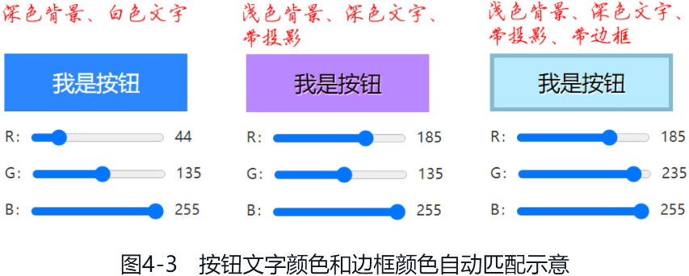

原理其实很简单，有了 R、G、B 色值我们就可以计算出亮度 --lightness。

- 这里 color 属性使用的是 HSL 颜色，L 的值是 0%，即黑色；如果 L 的值是 100%，则是白色。L 色值的计算公式是 `var((--lightness) - 0.5) * -999999%`。如果亮度大于 0.5，则是一个正数和 -999999% 相乘，最后计算结果是一个巨大的负数，这时会按照 L 色值的最小边界 0% 渲染，于是文字颜色就是黑色；如果亮度小于 0.5，则是一个负数和 -999999% 相乘，最后结果就是一个很大的正数，这时会按照 L 色值的最大边界 100% 渲染，于是文字颜色就是白色。
- 我们重点关注 text-shadow 属性的 `(var(--lightness) - 0.5) * 9999` 这个计算。如果亮度大于 0.5，则最终的计算值极大概率大于 1，因此透明度就是 1，文字投影会显示；如果亮度小于 0.5，则最终的计算值一定是负数，此时会按照透明度的边界值 0 来渲染，于是文字投影就不会显示。这就实现了背景颜色亮度比较高时显示更强的文字投影效果。
- border-color 边框颜色的出现和 text-shadow 的出现类似，只不过边框颜色比背景颜色更深。边框颜色是在亮度大于 0.8 的时候显示，这样，按钮在白色页面中也不会显得刺眼。

本案例中使用亮度 0.5 和亮度 0.8 作为判断点，不过这不一定是最佳判断点，在实际开发的时候大家可以根据自己的需求进行调整。

[opacity-color-auto-fit](embedded-codesandbox://css-new-world-detailed-style-performance/opacity-color-auto-fit)

### 静态饼图

这个案例将展示如何利用 opacity 属性的边界特性控制元素的显示与隐藏。图 4-4 所示的就是利用 opacity 属性的边界特性实现的静态饼状图效果。

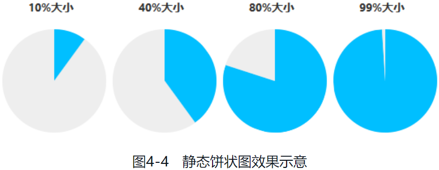

饼状图的比例通过 CSS 变量 --percent 控制，HTML 代码如下：

```html
<h4>10% 大小</h4>
<div class="pie-simple" style="--percent: 10;">
   <div class="pie-left"></div>
   <div class="pie-right"></div>
</div>
<h4>40% 大小</h4>
<div class="pie-simple" style="--percent: 40;">
   <div class="pie-left"></div>
   <div class="pie-right"></div>
</div>
```

CSS 代码如下：

```css{33, 44}
.pie-simple {
   width: 128px;
   height: 128px;
   background-color: #eee;
   border-radius: 50%;
   overflow: hidden;
}

.pie-left,
.pie-right {
   width: 50%;
   height: 100%;
   float: left;
   position: relative;
   overflow: hidden;
}

.pie-left::before,
.pie-right::before,
.pie-right::after {
   content: '';
   position: absolute;
   width: 100%;
   height: 100%;
   background-color: deepskyblue;
}

.pie-left::before {
   left: 100%;
   transform-origin: left;
   transform: rotate(calc(3.6deg * (var(--percent) - 50)));
   /* 比例小于或等于 50% 的时候左半圆隐藏 */
   opacity: calc(99999 * (var(--percent) - 50));
}

.pie-right::before {
   right: 100%;
   transform-origin: right;
   transform: rotate(calc(3.6deg * var(--percent)));
}

.pie-right::after {
   /* 比例大于 50% 的时候左半圆一直显示 */
   opacity: calc(99999 * (var(--percent) - 50));
}
```

实现原理如下所述。

左右两个矩形区域拼接，且左右两个矩形中都有一个会跟着旋转的半圆，由 .pie-left::before 和 .pie-right::before 这两个 ::before 伪元素创建，我们可以称它们为“左半圆”和“右半圆”。右边的矩形里面还藏了一个不会旋转的撑满整个矩形的半圆，我们可以称它为“右覆盖圆”，由 .pie-right::after 创建。

1. 左半圆和右半圆一直处于旋转状态。
2. 比例不大于 50% 时候，左半圆隐藏，右半圆显示，因此只能看到右半圆旋转。
3. 比例大于 50% 时候，左半圆显示，于是可以看到左半圆旋转，同时右覆盖圆显示，挡住后面的右半圆。此时可以看到右侧完整的静止半圆和左侧旋转的左半圆。

可以看出，我们除了要控制左右半圆的旋转，还需要控制左半圆和右覆盖圆的显隐，这个效果非常巧妙地利用了 opacity 属性的边界特性来实现，关键 CSS 代码见上面代码的高亮行。

假设 --percent 的值是 40，也就是 40% 范围的饼状图，将 40 代入 `99999 * (var(--percent) - 50)` 计算可以得到 -999990 的结果，opacity: -999990 等同于 opacity: 0，也就是饼状图百分比不足 50% 的时候，左半圆和右覆盖圆是隐藏的，只有右半圆在旋转。假设 --percent 的值是 80，可以发现最终的 opacity 计算值远大于 1，此时会按照 opacity: 1 渲染，也就是饼状图百分比大于 50% 的时候，左半圆和右覆盖圆是显示的。于是，我们就实现了一个基于 CSS 变量自动绘制的饼状图效果了。

[opacity-pie](embedded-codesandbox://css-new-world-detailed-style-performance/opacity-pie)

# 深入了解圆角属性 border-radius

border-radius 属性是一个典型的符合“二八原则”的 CSS 属性，也就是说要想深入了解 border-radius 属性，需要花费额外 80% 的学习精力，但是用这一部分精力所学到的知识只能用在 20% 的场景中。

在日常开发中，我们使用 border-radius 属性的场景无非下面两类。

1. 为按钮、输入框等控件，或者为背景色块增加小圆角，例如：

   ```css
   input,
   button {
      border-radius: 4px;
   }
   ```

2. 将用户头像变成圆形：

   ```css
   .user-avatar {
      border-radius: 50%;
   }
   ```

上面两类场景就满足了日常 80% 与圆角相关的开发需求了，那么到此结束了吗？显然没有，如果继续深入了解 border-radius 属性，你会发现 border-radius 属性远没有你想的那么简单，它可以呈现的效果也绝对超出你的预期。

## 了解 border-radius 属性的语法

我们平时使用的 border-radius 属性其实是一种缩写，它是 border-top-left-radius、border-top-right-radius、border-bottom-left-radius 和 border-bottom-right-radius 这 4 个属性的缩写。这 4 个属性的圆角位置如图 4-5 所示。


这 4 个属性很好理解，因为属性名称就暴露了一切，例如 border-top-left-radius 显然就是用来设置左上角圆角大小的。不过，虽然它们好理解，但是不好记忆，一段时间后就会不记得到底是 border-top-left-radius 还是 border-left-top-radius。我是使用这种方法让自己记住的：圆角属性的方位顺序和中文表述是相反的。例如中文我们都是说左上角、右上角，或者左下角、右下角，顺序是先左右再上下，但是，CSS 圆角属性却是先上下再左右，例如 border-top-left-radius 先是 top 再是 left，又如 border-bottom-right-radius 先是 bottom 再是 right。

### 1 ～ 4 个值表示的方位

border-radius 属性支持 1 ～ 4 个值，分别表示不同的角。

1. 如果只有 1 个值，则表示圆角效果作用在全部 4 个角，效果如图 4-6 所示，代码如下：

   ```css
   border-radius: 10px;
   ```

   

2. 如果有 2 个值，则第一个值作用于左上角和右下角，第二个值作用于右上角和左下角，效果如图 4-7 所示，代码如下：

   ```css
   border-radius: 10px 50%;
   ```

   

3. 如果有 3 个值，则第一个值作用于左上角，第二个值作用于右上角和左下角，第三个值作用于右下角，效果如图 4-8 所示，代码如下：

   ```css
   border-radius: 10px 50% 30px;
   ```

   

4. 如果有 4 个值，则 4 个值按照顺时针方向依次作用于左上角、右上角、右下角和左下角，效果如图 4-9 所示。

   ```css
   border-radius: 10px 50% 30px 0;
   ```

   

### 水平半径和垂直半径

还有很多人不知道我们平时使用的圆角值也是一种缩写。例如，下面 CSS 代码中的 10px 就是一种缩写：

```css
border-top-left-radius: 10px;
```

它等同于：

```css
border-top-left-radius: 10px 10px;
```

其中，第一个值表示水平半径，第二个值表示垂直半径。又如：

```css
border-top-left-radius: 30px 60px;
```

表示左上角的圆角是由水平半径（短半轴）为 30px、垂直半径（长半轴）为 60px 的椭圆产生的，效果如图 4-10 所示。


如果是 border-radius 属性，则水平半径和垂直半径不是通过空格进行区分，而是通过斜杠区分。例如：

```css
border-radius: 30px / 60px;
```

表示 4 个角落的圆角的水平半径都是 30px，垂直半径都是 60px，效果如图 4-11 所示。


斜杠前后都支持 1 ～ 4 个长度值。因此，下面的语法都是合法的：

```css
/* 左上 右上+左下 右下 / 左上 右上+左下 右下 */
border-radius: 10px 5px 2em / 20px 25px 30%;
/* 左上+右下 右上+左下 / 左上 右上 右下 左下 */
border-radius: 10px 5% / 20px 25em 30px 35em;
```

现在了解了语法，那这里的水平半径和垂直半径究竟是如何作用才让边角产生圆角效果的呢？这个问题就是接下来要深入探讨的。

## 弄懂圆角效果是如何产生的

虽然我们口头上都称 border-radius 为圆角属性，实际上 border-radius 属性的字面意思不是“圆角”，而是“边界半径”，也就是圆角效果来自以这个半径值绘制的圆或以半轴值绘制的椭圆。例如，图 4-10 所示左上角的圆角效果是由水平半径为 30px、垂直半径为 60px 的椭圆产生的，原理如图 4-12 所示。


如果进一步放大半径值，例如设置垂直半径大小和元素等高，也就是 100% 高度值，如下所示：

```css
border-top-left-radius: 30px 100%;
```

效果和原理此时如图 4-13 所示。


### 重叠曲线的渲染机制

左上角和左下角的垂直半径都是 100%，代码如下：

```css
border-top-left-radius: 30px 100%;
border-bottom-left-radius: 30px 100%;
```

显然，元素的高度并不足以放下两个半轴为 100% 尺寸的椭圆，如果我们对这种场景不加以约束，则曲线一定会发生重叠，而且曲线的交叉点一定不是平滑的，最后得到的绝对不会是我们想看到的效果。

因此，CSS 规范对圆角曲线重叠这一问题做了额外的渲染设定，具体算法如下：设置 $f = min(L_h/S_h, L_v/S_v)$，其中 S 是半径之和，L 是元素宽高，下标 h 和 v 表示方向，f 是计算值，简称“f 计算值”。CSS 圆角曲线的渲染规则很简单，如果 f 计算值小于 1，则所有圆角半径都乘以 f。

回到这里的例子，左上角和左下角的垂直半径都是 100%，水平半径都是 30px，因此 $f = min(L_h/S_h, L_v/S_v) = min(150/60, 100/200) = 0.5$，f 计算值是 0.5，小于 1，所有圆角值都要乘以 0.5，因此：

```css
border-top-left-radius: 30px 100%;
border-bottom-left-radius: 30px 100%;
```

实际上，这等同于：

```css
border-top-left-radius: 15px 50%;
border-bottom-left-radius: 15px 50%;
```

此时会有图 4-14 所示的效果。

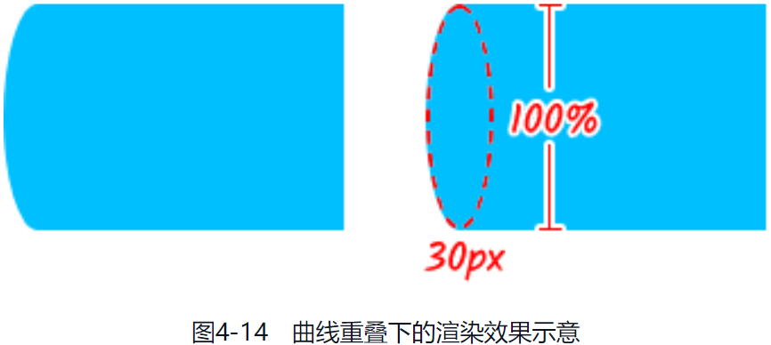

明白了重叠曲线的渲染机制，一些常见却不太理解的现象也就明白了。

如果元素的高度和宽度是一样的，例如都是 150px，则下面两段 CSS 声明的效果是一样的：

```css
border-radius: 100%;
border-radius: 150px;
```

但是，如果元素的高度和宽度是不一样的，例如宽度是 150px，高度是 100px，则下面两段 CSS 声明的效果就不一样：

```css
border-radius: 100%;
border-radius: 150px;
```

效果如图 4-15 所示。


为什么会不一样呢？很多人百思不得其解。其实，简单套用一下重叠曲线的算法，一切就豁然开朗了：

- border-radius: 100% 的 f 计算值是 0.5，因此，最终的圆角半径都要乘以 0.5，等同于：

   ```css
   border-radius: 75px / 50px;
   ```

- border-radius: 150px 水平方向的 $L/S$ 的计算值是 0.5，而垂直方向的 $L/S$ 计算值是 100/300，也就是 0.3333，于是 $f = min(0.5, 0.3333) = 0.3333$，也就是所有圆角半径（都是 150px）都要乘以 0.3333，等同于：

   ```css
   border-radius: 50px;
   ```

## border-radius 属性渲染 border 边框的细节

如果元素设置了 border 边框，则圆角半径会被分成内半径和外半径，如图 4-16 所示。


其中直线为外半径，圆心到内部虚线圆的距离为内半径。

1. padding 边缘的圆角大小为设置的 border-radius 大小减去边框的厚度，如果结果为负，则内半径为 0。例如：

   ```css
   .radius {
      width: 100px;
      height: 100px;
      border-top: 40px solid deepskyblue;
      border-left: 40px solid deepskyblue;
      border-radius: 40px 0 0;
   }
   ```

   圆角半径大小和边框的大小均是 40px，此时内半径大小为 0，因此，padding 边缘是直角，没有弧度。最终效果如图 4-17 所示。

   

   此特性在边框颜色透明的场景下依旧适用。另外，当内半径大于 0 的时候边框会和 padding box 重叠，此时文字内容可能会出现在边框之上。

2. 如果相邻两侧边框的厚度不同，则圆角大小将在较厚和较薄边界之间显示平滑过渡。例如：

   ```css
   .radius {
      width: 100px;
      height: 100px;
      border-top: 40px solid deepskyblue;
      border-left: 20px solid deepskyblue;
      border-radius: 40px 0 0 / 60px 0 0;
   }
   ```

   最终效果如图 4-18 所示。可以明显看出在圆角位置处，边框的厚度在 20px ～ 40px 范围内变化的时候是平滑的，是流畅的。

   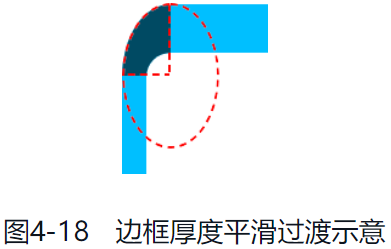

   我们可以利用这一特性实现图 4-24 所示的带尾巴的小尖角效果。

3. 圆角边框的连接线和直角边框连接线位置一致，但是角度会有所不同。例如：

   ```css
   .radius {
      width: 100px;
      height: 100px;
      border-top: 40px solid deepskyblue;
      border-left: 20px solid deeppink;
      border-right: 20px solid deeppink;
      border-radius: 40px 0 0 / 60px 0 0;
   }
   ```

   最终效果如图 4-19 所示。

   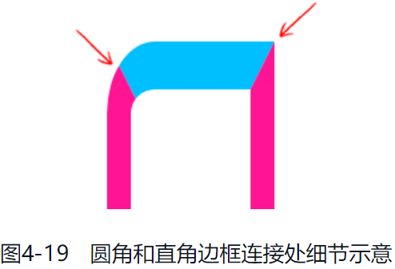

下面是其他一些细节。

1. border-radius 不支持负值。
2. 圆角以外的区域不可点击，无法响应 click 事件。
3. border-radius 没有继承性，因此父元素设置了 border-radius，子元素依然是直角效果。我们可以通过给父元素设置 overflow: hidden 让子元素视觉上表现为圆角。
4. border-radius 属性支持 transition 过渡效果，也支持 animation 动画效果，因此在图形表现领域，border-radius 属性会非常给力。
5. border-radius 属性也是可以应用于 display 的计算值为 table、inline-table 或者 table-cell 的元素上的，但是有一个前提，那就是表格元素的 border-collapse 属性值需要是 separate（separate 是 border-collapse 属性的默认值），如果 border-collapse 属性值是 collapse，那么是没有圆角效果的。

## border-radius 属性的高级应用技巧

border-radius 在实际开发中的高级应用主要在两方面，一个是增强原本的圆角效果，另外一个就是绘制各类图形效果。

### border-radius 与不规则圆角头像

我们平时给头像设置的圆角效果都是规则的圆，其实还可以使用百分比值设置不同的水平半径和垂直半径，实现不规则的圆角效果，例如：

```css
.avatar {
   border-radius: 70% 30% 30% 70% / 60% 40% 60% 40%;
}
```

效果如图 4-20 所示。


再配点标题和描述，一个非常有设计感的布局效果就出来了，如图 4-21 所示。


[border-radius-avatar](embedded-codesandbox://css-new-world-detailed-style-performance/border-radius-avatar)

如果是很多个头像，我们还可以利用“蝉原则”（质数）实现随机圆角效果。

一种方法是直接指定圆角大小，IE9+ 浏览器均提供支持，例如：

```css
.avatar {
   border-radius: 87% 91% 98% 100%;
}

.avatar:nth-child(2n + 1) {
   border-radius: 59% 52% 56% 59%;
}

.avatar:nth-child(3n + 2) {
   border-radius: 84% 94% 83% 72%;
}

.avatar:nth-child(5n + 3) {
   border-radius: 73% 100% 82% 100%;
}

.avatar:nth-child(7n + 5) {
   border-radius: 93% 90% 85% 78%;
}

.avatar:nth-child(11n + 7):hover {
   border-radius: 58% 98% 78% 83%;
}
```

另外一种方法是选取圆角动画中的某一帧，这可以借助 animation-delay 负值技术实现，例如：

```css
.avatar {
   border-radius: 50%;
   animation: morph 6s paused linear;
}

@keyframes morph {
   0% {
      border-radius: 40% 60% 60% 40% / 60% 30% 70% 40%;
   }
   100% {
      border-radius: 40% 60%;
   }
}

.avatar:nth-child(2n + 1) {
   animation-delay: -1s;
}

.avatar:nth-child(3n + 2) {
   animation-delay: -2s;
}

.avatar:nth-child(5n + 3) {
   animation-delay: -3s;
}

.avatar:nth-child(7n + 5) {
   animation-delay: -4s;
}

.avatar:nth-child(11n + 7) {
   animation-delay: -5s;
}
```

最终可以实现图 4-22 所示的随机不规则圆角头像效果，支持任意数量的头像。

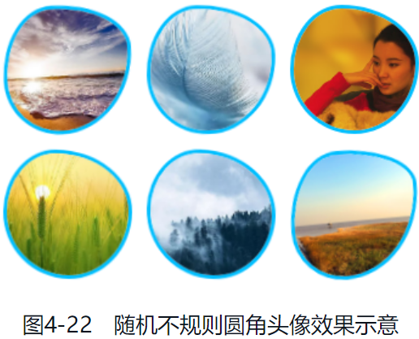

[border-radius-random-avatar-1](embedded-codesandbox://css-new-world-detailed-style-performance/border-radius-random-avatar-1)

[border-radius-random-avatar-2](embedded-codesandbox://css-new-world-detailed-style-performance/border-radius-random-avatar-2)

### border-radius 图形绘制技巧

一句话，只要是带圆弧的图形效果，border-radius 属性都能绘制出来，前提是对 border-radius 属性有足够深入的了解。想要出神入化地绘制图形，离不开人的创造力，下面先来介绍几个常用的图形效果，其他效果可以在此基础上延伸。

下面两个例子纯属抛砖引玉。

1. 绘制 1/4 圆作为角标，用来显示序号，关键 CSS 代码如下：

   ```css
   border-bottom-right-radius: 100%;
   ```

   效果如图 4-23 所示。

   

2. 例如，border 边框应用 border-radius 属性时，可以使用平滑特性实现带尖角的对话框小尾巴效果：

   ```css
   .corner-tail {
      width: 15px;
      height: 10px;
      border-top: 10px solid deepskyblue;
      border-top-left-radius: 80%;
   }
   ```

   效果如图 4-24 所示。

   

   [border-radius-graphics-drawing](embedded-codesandbox://css-new-world-detailed-style-performance/border-radius-graphics-drawing)

# box-shadow 盒阴影

box-shadow 盒阴影也是非常实用的 CSS 属性，可以给元素设置阴影效果，让视觉表现更富有层次。例如，为固定定位的头部元素设置方向朝下的阴影效果可以让页面层次更清晰：

```css
header {
   background-color: #fff;
   position: fixed;
   left: 0;
   right: 0;
   top: 0;
   box-shadow: 0 2px 4px rgba(0, 0, 0, 0.2);
}
```

其中，`box-shadow: 0 2px 4px rgba(0, 0, 0, .2)` 这段 CSS 声明包含 box-shadow 属性最常使用的几个值，0 表示水平偏移，2px 表示垂直偏移，4px 是模糊大小，`rgba(0, 0, 0, .2)` 则是投影的颜色。

常规的投影效果使用上面几个值就可以了，偏移+模糊+颜色，例如 filter 属性中的 drop-shadow 投影滤镜就是上面几个部件组成的。

无论是盒阴影还是投影效果，其光源都默认在页面的左上角。因此水平偏移的值如果是正数则表示投影偏右，如果是负数则表示投影偏左，垂直偏移也是类似效果。这种偏移方位与文档流的方向没有任何关系，例如我们设置文档流是从右往左（direction: rtl），正数偏移值依然表示投影偏右下，不会有任何变化。

本书不会在 box-shadow 属性的常规用法上多费笔墨，主要介绍你可能不知道的其他的一些应用。

## inset 关键字与内阴影

box-shadow 属性支持 inset 关键字，表示阴影朝向元素内部。先看一个简单的内外阴影对比案例：

```css
.inset {
   width: 180px;
   height: 100px;
   background-color: deepskyblue;
   box-shadow: inset 2px 2px 4px rgba(0, 0, 0, 0.5);
}

.normal {
   width: 180px;
   height: 100px;
   background-color: deepskyblue;
   box-shadow: 2px 2px 4px rgba(0, 0, 0, 0.5);
}
```

效果如图 4-25 所示。

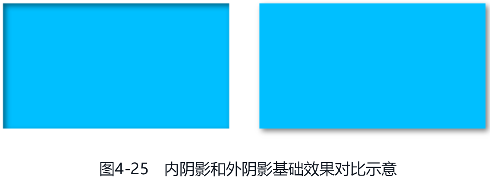

从图 4-25 中可以看出以下两点。

1. box-shadow 内阴影效果适合实现内嵌效果，表现更低一层级的视觉效果。
2. box-shadow 内阴影的水平和垂直偏移方向和外阴影一致，都是左上角光源。

然而，根据我多年的实践经验，内阴影更常见的使用场景并不是视觉层级表现，而是辅助图形效果。

### 模拟边框

在 border 边框被占用，或者不方便使用 border 属性的情况下，我们可以借助 box-shadow 内阴影来模拟边框效果。

例如，一套按钮组件，深色背景按钮无边框，浅色背景按钮需要有边框，这就带来了一点小麻烦。因为 border 会影响元素的尺寸，为了保证所有按钮尺寸一致的同时代码被高度复用，很多人会给深色背景按钮设置透明边框。其实还有更好的做法，那就是使用 box-shadow 内阴影模拟边框，例如：

```html
<button class="normal">正常</button>
<button class="primary">主要</button>
<button class="warning">警示</button>
<style>
   button {
      height: 40px;
      border: 0;
      border-radius: 4px;
   }

   .normal {
      background-color: #fff;
      /* 模拟边框 */
      box-shadow: inset 1px 0 #a2a9b6, inset -1px 0 #a2a9b6, inset 0 1px #a2a9b6, inset 0 -1px #a2a9b6;
   }

   .primary {
      color: #fff;
      background-color: #2a80eb;
   }

   .warning {
      color: #fff;
      background-color: #eb4646;
   }
</style>
```

效果如图 4-26 所示，有边框按钮和无边框按钮的尺寸完全一致。


[border-shadow-inset-button](embedded-codesandbox://css-new-world-detailed-style-performance/border-shadow-inset-button)

### 颜色覆盖

box-shadow 内阴影有一个实用特性，那就是生成的阴影会位于文字内容的下面，背景颜色的上面。于是我们可以使用 box-shadow 属性在元素上面再覆盖一层颜色，这种做法在不少场景下非常有用。

在 Chrome 浏览器中，输入框在自动填充的时候会自带背景颜色，一般是黄色或者浅蓝色，我们可以使用 box-shadow 内阴影创建白色颜色层对其进行覆盖，代码如下：

```css
input:-webkit-autofill {
   -webkit-box-shadow: inset 0 0 0 1000px #fff;
   background-color: transparent;
}
```

又如，按钮在被按下的时候其背景色要深一点，这用来给用户提供操作反馈。使用 box-shadow 内阴影，只用一行代码便可以搞定所有按钮，无须一个一个专门进行颜色设置，例如：

```css
button:active {
   box-shadow: inset 0 0 0 999px rgba(0, 0, 0, 0.1);
}
```

效果如图 4-27 所示，在中间按钮被按下的时候背景颜色明显加深了。


box-shadow 内阴影颜色覆盖也是有局限的，其对于部分替换元素是无效的，例如 `` 元素：

```css
/* 无效 */
img:active {
   box-shadow: inset 0 0 0 999px rgba(0, 0, 0, 0.1);
}
```

因为替换元素的内容在盒阴影之上。此时可以使用 outline 属性进行模拟，假设图片尺寸是 75px×100px，则可以：

```css
img:active {
   outline: 50px solid rgba(0, 0, 0, 0.1);
   outline-offset: -50px;
}
```

## 不要忽略第四个长度值

box-shadow 属性支持 2 ～ 4 个长度值，前两个长度值是固定的，表示水平偏移和垂直偏移，第三个长度值表示模糊半径，还有第四个长度值，表示扩展半径。“扩展”这一特性并不符合现实世界对投影的认知，因此在模拟真实世界投影效果的时候是用不到的，用得少自然知道的人就少。

不过扩展半径在某些时候还是很有用的，扩展半径主要用在以下两个场景：一是轮廓模拟，二是实现单侧阴影。

### 轮廓模拟

理论上，按钮的轮廓可以借助第四个长度值，即扩展半径来实现，代码如下：

```css
.normal {
   background-color: #fff;
   /* 模拟轮廓 */
   box-shadow: inset 0 0 0 1px #a2a9b6;
}
```

使用扩展半径模拟轮廓的代码量要比实现 4 个方向分别投影的代码量小很多。但是很遗憾，在有圆角的情况下，使用扩展半径的方法在 IE 浏览器中的渲染是有问题的，4 个圆角阴影会重叠，如图 4-28 所示，这不符合我们的预期。


因此，扩展半径多用来模拟大范围的色块效果，例如新手引导的蒙层效果：

```css
.guide {
   box-shadow: 0 0 0 9999px rgba(0, 0, 0, 0.75);
   border-radius: 50%;
}
```

相比 outline 属性，使用 box-shadow 属性实现蒙层效果出现的 bug 要更少（Firefox 浏览器的 outline 轮廓有些小问题），同时还支持圆角，是最佳的实现方法，效果如图 4-29 所示。


[border-shadow-guide](embedded-codesandbox://css-new-world-detailed-style-performance/border-shadow-guide)

### 单侧阴影

扩展半径还支持负值，可以用来实现单侧阴影效果。理论上，实现单侧阴影效果只要设置一侧阴影的偏移大小为 0 即可，但是，如果模糊半径设置得较大，就会看到有部分阴影显示在左右两侧了，并不是单侧阴影效果，例如：

```css
header {
   width: 150px;
   padding: 10px;
   background-color: white;
   box-shadow: 0 2px 5px rgba(0, 0, 0, 0.5);
}
```

效果如图 4-30 所示。

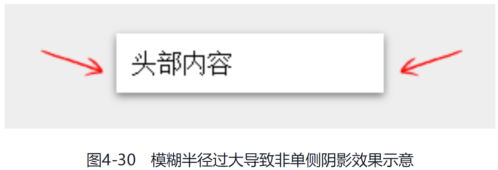

此时可以设置扩展半径为负值，让阴影只在一侧显示，相关代码如下：

```css
header {
   box-shadow: 0 7px 5px -5px rgba(0, 0, 0, 0.5);
}
```

效果如图 4-31 所示。

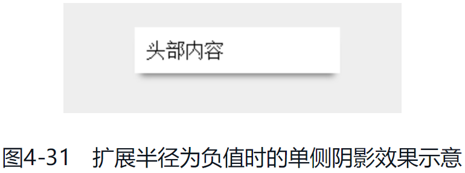

## 多阴影特性与图形绘制

box-shadow 属性支持无限多个阴影效果不断累加，因此理论上 box-shadow 属性可以实现任意图形效果，我们只需要设置 1px×1px 的元素，然后不断投影。当然，我们在实际开发中不会这么使用，因为没必要，性能也很糟糕。但是，box-shadow 属性的多阴影特性确实让 box-shadow 属性在图形绘制领域大放光彩。

### 多边框和渐变边框效果

我们可以使用 box-shadow 属性模拟多边框效果，该属性也支持圆角效果，例如：

```css
.multi-border {
   height: 100px;
   border-radius: 10px;
   background-color: deepskyblue;
   box-shadow: 0 0 0 4px #fff, 0 0 0 8px deeppink, 0 0 0 12px yellow, 0 0 0 16px purple;
}
```

效果如图 4-32 所示。


如果我们多边框的过渡颜色足够细腻，我们还可以使用 box-shadow 属性实现由内往外但并不是径向渐变的渐变效果，例如：

```css
.gradient-border {
   height: 100px;
   border-radius: 10px;
   background-color: deepskyblue;
   box-shadow: 0 0 0 1px #07b9fb, 0 0 0 2px #17aef4, 0 0 0 3px #27a4ee, 0 0 0 4px #3799e7, 0 0 0 5px #478ee0, 0 0 0 6px
         #5784d9, 0 0 0 7px #6779d3, 0 0 0 8px #776ecc, 0 0 0 9px #8764c5, 0 0 0 10px #9759be, 0 0 0 11px #a74eb8, 0 0 0
         12px #b744b1, 0 0 0 13px #c739aa, 0 0 0 14px #d72ea3, 0 0 0 15px #e7249d, 0 0 0 16px #f71996;
}
```

效果如图 4-33 所示。


### 加载效果

box-shadow 属性可以实现多种 CSS 加载效果，例如下面这个经典的旋转加载效果：

```css
.loading {
   width: 4px;
   height: 4px;
   border-radius: 100%;
   color: rgba(0, 0, 0, 0.4);
   box-shadow: 0 -10px rgba(0, 0, 0, 0.9), 10px 0px, 0 10px, -10px 0 rgba(0, 0, 0, 0.7), -7px -7px rgba(0, 0, 0, 0.8), 7px -7px
         rgba(0, 0, 0, 1), 7px 7px, -7px 7px;
   animation: spin 1s steps(8) infinite;
}

@keyframes spin {
   0% {
      transform: rotate(0deg);
   }

   100% {
      transform: rotate (360deg);
   }
}
```

效果如图 4-34 所示。


### 云朵效果

使用 box-shadow 属性实现云朵效果的代码如下：

```css
.cloud {
   width: 60px;
   height: 50px;
   color: white;
   background-color: currentcolor;
   border-radius: 50%;
   box-shadow: 100px 0px 0 -10px, 40px 0px, 70px 15px, 30px 20px 0 -10px, 70px -15px, 30px -30px;
}
```

效果如图 4-35 所示。


实现原理很简单，就是使用 box-shadow 属性克隆多个圆，然后让圆不断交错重叠。

### 3D 投影效果

给按钮设置一个 3D 投影效果，按下按钮的时候按钮的位置发生偏移，同时投影高度降低，这可以实现非常有立体感的按钮效果，代码如下：

```css
.shadow-3d-button {
   width: 100px;
   height: 36px;
   border: 1px solid #a0b3d6;
   background-color: #f0f3f9;
   box-shadow: 1px 1px #afc4ea, 2px 2px #afc4ea, 3px 3px #afc4ea;
}

.shadow-3d-button:active {
   transform: translate(1px, 1px);
   box-shadow: 1px 1px #afc4ea, 2px 2px #afc4ea;
}
```

效果如图 4-36 所示。

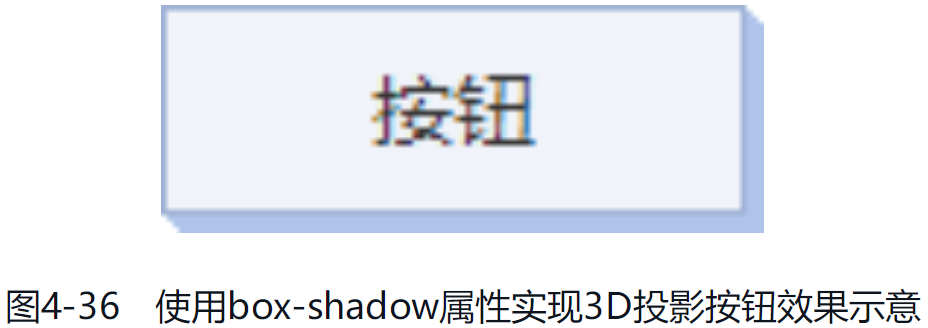

[border-shadow-graphics-drawing](embedded-codesandbox://css-new-world-detailed-style-performance/border-shadow-graphics-drawing)

## box-shadow 动画与性能优化

在日常开发中，对 box-shadow 属性的使用没有什么限制，不用担心相对较大的性能开销。个别元素应用 box-shadow 动画也没问题，毕竟抛开数量谈性能是没有意义的。但是，如果页面本身比较复杂，应用渐变、半透明、盒阴影、滤镜等特性的元素很多，则此时 box-shadow 动画所带来的性能开销就会很大，实现的动画效果帧率不足 60f/s，GPU 加速疯狂运转，手机电量迅速减少。这时可以使用一些小技巧优化一下。

例如，有一个盒阴影过渡效果：

```css
.normal {
   transition: all 0.5s;
   box-shadow: 0 8px 12px rgba(0, 0, 0, 0.5);
}

.normal:hover {
   box-shadow: 0 16px 24px rgba(0, 0, 0, 0.7);
}
```

在鼠标经过盒的时候会伴随大量的样式重计算和 GPU 加速，此时，我们可以使用伪元素创建盒阴影，然后在鼠标经过盒的时候改变盒阴影的透明度，以此进行优化，代码如下：

```css
.optimize::before,
.optimize::after {
   content: '';
   transition: opacity 0.6s;
}

.optimize::before {
   box-shadow: 0 8px 12px rgba(0, 0, 0, 0.5);
}

.optimize::after {
   opacity: 0;
   box-shadow: 0 16px 24px rgba(0, 0, 0, 0.7);
}

.optimize:hover::before {
   opacity: 0;
}

.optimize:hover::after {
   opacity: 1;
}
```

图 4-37 所示是优化前后的一些性能指标，从左往右共 4 段动画区间，分别代表正常实现鼠标经过、正常实现鼠标移开、优化实现鼠标经过和优化实现鼠标移开触发的 transition 过渡效果，可以看到正常实现的盒阴影动画的样式重计算和 GPU 开销明显更大（左方块内的栅格数量更多）。

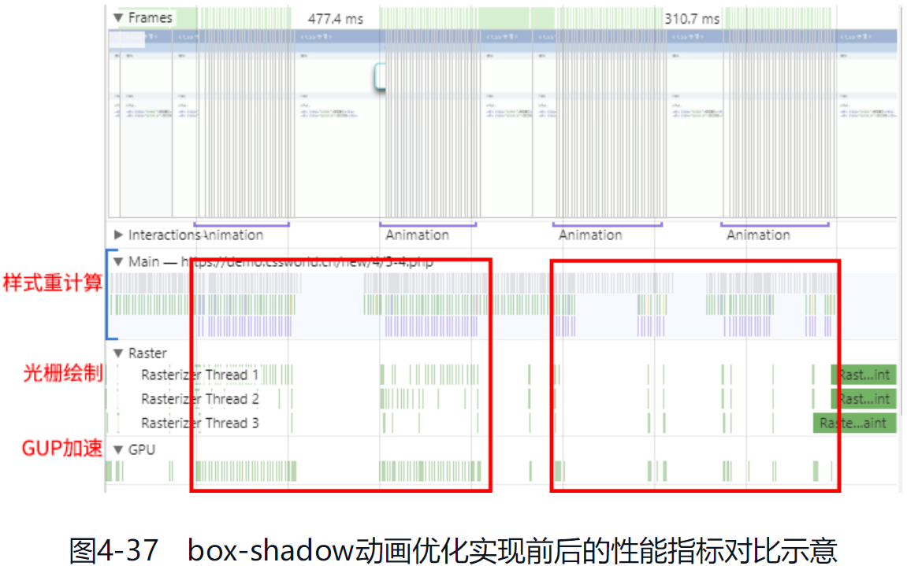

[border-shadow-performance-optimize](embedded-codesandbox://css-new-world-detailed-style-performance/border-shadow-performance-optimize)

# CSS 2D 变换

本节主要介绍 2D 变换，3D 变换会在之后详细讲解。

首先说一下私有前缀，现在已经不是 10 年前了，没有任何理由需要给 transform 属性添加 -moz- 和 -o- 私有前缀。如果是需要兼容 IE 浏览器的传统 Web 产品，则需要加上 -ms- 私有前缀，但不需要加上 -webkit- 私有前缀，示例如下：

```css
.pc {
   -ms-transform: none;
   transform: none;
}
```

如果是移动端项目，考虑到还有不到 4% 的 Android 4.4 操作系统用户，因此还需要加 -webkit- 私有前缀，但不需要加 -ms- 私有前缀。

```css
.mobile {
   -webkit-transform: none;
   transform: none;
}
```

transform 属性相关特性和细节非常多，想要理解本节内容需要反复阅读。

## 从基本的变换方法说起

2D 变换常用的变换方法包括位移、旋转、缩放和斜切，示例如下：

```css
/* 位移 */
transform: translate(0, 0);
/* 旋转 */
transform: rotate(0deg);
/* 缩放 */
transform: scale(1);
/* 斜切 */
transform: skew(0deg);
```

我们先逐个快速了解一下各个变换方法的基本特性。

### translate() 位移

以自身坐标为基准，进行水平方向或垂直方向的位移，语法如下：

```css
/* 往右偏移 10px，往下偏移 20px */
transform: translate(10px, 20px);
/* 往右偏移 10px */
transform: translateX(10px);
/* 往下偏移 20px */
transform: translateY(20px);
```

其中，translate() 函数中的第二个值可以省略，省略后表示垂直方向的偏移大小是 0。因此，translate(10px) 等同于 translate(10px, 0)，也等同于 translateX(10px)。大家千万不要被 scale() 函数的语法给误导，translate(10px) 不是 translate(10px, 10px) 的简写。

位移的方向和文档流的顺序没有任何关系，也就是即使祖先元素设置 direction: rtl，translateX(10px) 依然表示往右偏移。

位移变换最不可替代的特性就是设定百分比偏移值，因为 CSS 世界中就没有几个属性的百分比值是相对于自身尺寸计算的，示例如下：

```css
/* 往左偏移自身宽度的一半，往上偏移自身高度的一半 */
transform: translate(-50%, -50%);
```

百分比值相对于自身计算的这个特性非常适合用来实现高宽不固定元素的水平垂直居中效果，例如，弹框元素想要居中定位，可以使用下面的 CSS 语句：

```css
.dialog {
   position: absolute;
   left: 50%;
   top: 50%;
   transform: translate(-50%, -50%);
}
```

然而对于绝对定位元素，如果可以，请尽量避免使用 transform 属性进行位置偏移，应改用 margin 属性进行偏移定位，这样就可以把 transform 属性预留出来，方便实现各种 animation 动画效果。例如，我们希望元素出现的时候有一个缩放动画效果，但是如果偏移是使用 transform 属性实现的，那么这个动画执行的时候元素的定位就会出现问题。

### rotate() 旋转

例如，将图片旋转 45 度：

```css
img {
   transform: rotate(45deg);
}
```

效果如图 4-38 所示。


由此可见，正值是顺时针旋转。

这里顺便详细介绍一下角度单位，CSS 中的角度单位包括下表所示的 4 个单位。

| 单位 | 含义              |
| :--- | :---------------- |
| deg  | degrees，表示角度 |
| grad | grads，表示百分度 |
| rad  | radians，表示弧度 |
| turn | turns，表示圈数   |

下面分别介绍一下这 4 个单位。

- 角度（deg）：角度范围为 0 ～ 360 度，角度为负值可以理解为逆时针旋转。例如，−45deg 可以理解为逆时针旋转 45 度。
- 百分度（grad）：一个梯度，或者说一个百分度表示 1/400 个整圆。因此 100grad 相当于 90deg，它和 deg 单位一样支持负值，负值可以理解为逆时针方向旋转。
- 弧度（rad）：1 弧度等于 180/π 度，或者大致等于 57.3 度。1.5708rad 相当于 100grad 或是 90deg，如图 4-39 所示。

   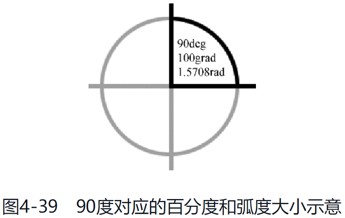

- 圈数（turn）：这个很好理解，1 圈表示 360 度，平时体操或跳水中出现的“后空翻 720 度”，也就是后空翻两圈的意思。于是有等式 1turn=360deg、2turn=720deg 等。

下面的 CSS 代码均表示顺时针旋转 45 度：

```css
transform: rotate(45deg);
transform: rotate(50gard);
transform: rotate(0.7854rad);
transform: rotate(0.25turn);
```

在实际开发的时候，我们只需要使用 deg 单位就好了，没必要“炫技”使用其他角度单位。那么什么时候使用 grad 或者 rad 这些 CSS 单位呢？这些单位一般用在动态计算的场景（例如 JavaScript 计算运动轨迹或者根据坐标计算角度的时候，使用弧度更方便）。

### scale() 缩放

缩放变换也支持 x 和 y 两个方向，因此，下面的语法都属于 2D 变换的语法：

```css
/* 水平放大 2 倍，垂直缩小 1 / 2 */
transform: scale(2, 0.5);
/* 水平放大 2 倍 */
transform: scaleX(2);
/* 垂直缩小 1 / 2 */
transform: scaleY(0.5);
```

图 4-40 所示就是图片元素应用 scale(2, .5) 变换后的效果。


缩放变换不支持百分比值，仅支持数值，因此 scale(200%, 50%) 是无效的。

缩放变换支持负值。如果我们想要实现元素的水平翻转效果，可以设置 transform: scaleX(-1)；想要实现元素的垂直翻转效果，可以设置 transform: scaleY(-1)。如果水平缩放和垂直缩放的大小一样，我们可以只使用一个值，例如，transform: scale(2) 表示将元素水平方向和垂直方向的尺寸放大到现有尺寸的 2 倍。

### skew() 斜切

斜切变换也支持 x 和 y 两个方向，例如：

```css
/* 水平切斜 10 度，垂直切斜 20 度 */
transform: skew(10deg, 20deg);
/* 水平切斜 10 度 */
transform: skewX(10deg);
/* 垂直切斜 20 度 */
transform: skewY(20deg);
```

所有包含 X 和 Y 字符的变换函数都不区分大小写，例如 skewX(10deg) 写作 skewx(10deg) 是合法的，translateX(10px) 写作 translatex(10px) 也是合法的，不过我们约定俗成字符 X 和 Y 都是大写。skew(10deg) 可以看成 skew(10deg, 0) 的简写，效果等同于 skewX(10deg)。

图 4-41 所示的是图片元素分别应用 skewX (10deg) 和 skewY(20deg) 变换后的效果。

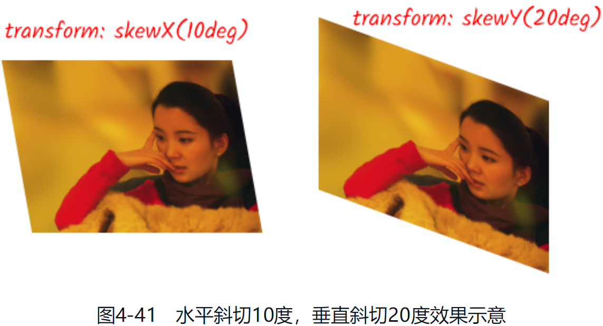

旋转是 360 度一个轮回，斜切则是 180 度一个轮回。元素处于 90 度或者 270 度斜切的时候是看不见的，因为此时元素的尺寸在理论上是无限的。对浏览器而言，尺寸不可能是无限的，因为没办法表现出来！于是这种情况下的尺寸为 0，所以元素在 90 度或者 270 度斜切的时候是不会影响祖先元素的滚动状态的。如果读者对这句话不理解，把 skewY() 函数的角度调成 89 度或者 271 度就知道什么意思了。skew() 函数支持所有角度单位值。

斜切变换在图形绘制的时候非常有用，这是一个被低估的变换特性。举个例子，使用 CSS 实现图 4-42 所示的导航效果。


有些人会使用 clip-path 属性以剪裁方式实现这个效果，有些人会使用 border 属性以模拟边框方式实现这个效果，其实，完全不需要这么复杂，使用斜切变换就可以轻松实现这个效果。

首先按照正常的方块布局进行排版，让每一个导航元素由上下两个矩形盒子组成，使用 skew() 函数斜切一下效果就出来了，连定位都不需要，这是最佳实现方式，没有之一。实现原理如图 4-43 所示。

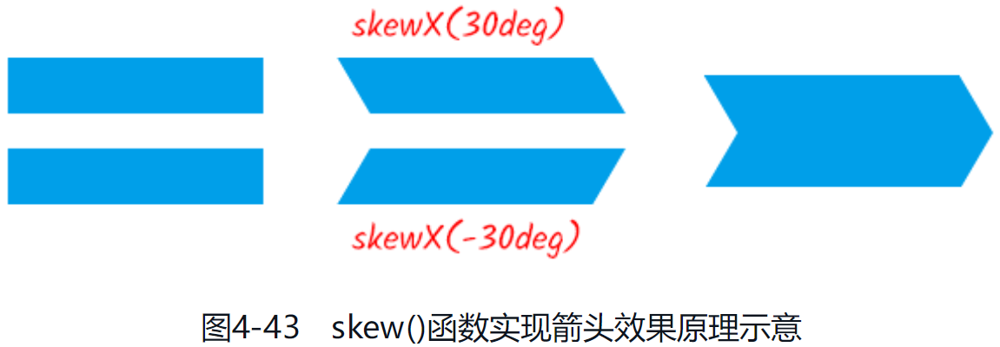

## transform 属性的若干细节特性

这里介绍的 transform 特征对于 2D 变换和 3D 变换均适用。

### 盒模型尺寸不会变化

页面中的元素无论应用什么 transform 属性值，该元素盒模型的尺寸和位置都不会有任何变化。例如，页面中有一个 `` 元素，尺寸是 128px×96px，则无论应用什么 transform 属性值，这个 `` 元素的尺寸依然是 128px×96px，位置依然是原来的位置。例如：

```css
img {
   transfrom: translateX(-9999px);
}
```

图片原来的位置会变成一片空白，图片在视觉上已经不知道偏移到何处了。这和 position: relative 相对定位偏移的行为有些类似。又如：

```css
img {
   transfrom: scale(2);
}
```

虽然图片的视觉尺寸放大了 2 倍，但是，并不会推开旁边的元素，只会在视觉上重叠与覆盖。

元素尺寸和位置不会变化的特性让人又爱又恨，爱的是可以放心使用 transform 实现各类交互效果，恨的是有时候我们又希望位置可以发生变化。例如，我们希望一个元素往上移动自身高度的 50%，同时后面的元素也跟着一起位移，这在目前的 CSS 世界中，是没有有效的实现方法的，需要借助 JavaScript 计算实现。原因在于相对自身尺寸偏移的特性只有 translate 位移才有，但是 translate 位移无法影响其他元素的布局；可以影响其他元素布局的 margin 负值定位虽然也支持百分比值，但这个百分比值却是相对宽度计算的。于是，这就形成了一个死结。

但需要注意的是，元素应用 transform 变换后还是可能因为某些间接的原因影响排版，主要是在触发滚动条的显示与隐藏的情况下影响容器的可用尺寸（Windows 操作系统中的滚动条默认占据一定的宽度和高度）。且看下面这个具有代表性的案例：

```html
<p></p>
<style>
   img {
      width: 100%;
   }

   p {
      width: 128px;
      border: solid deepskyblue;
      overflow: auto;
   }
</style>
```

很显然，此时 `` 元素的宽度是 128px，但是，如果 `` 元素旋转一下，则 `` 元素尺寸就会发生变化，尺寸瞬间变小了。

```css
img {
   width: 100%;
   transform: rotate(45deg);
}
```

例如，在 Windows 10 操作系统下的 Chrome 浏览器中，`` 元素的宽度变成了 111px，如图 4-44 所示。

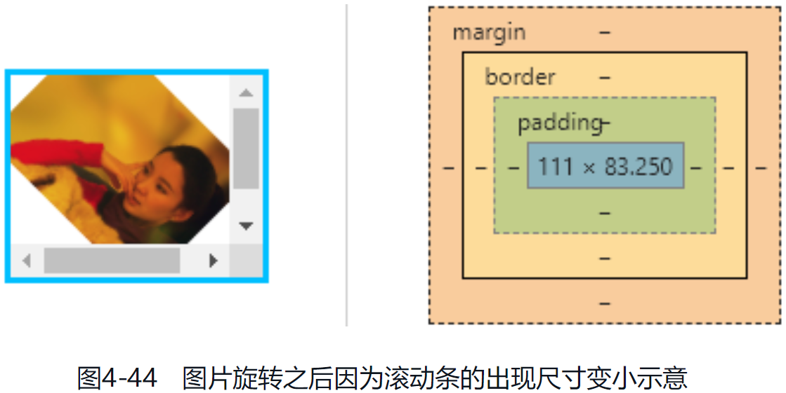

之所以是这样的结果，是因为 `` 元素旋转导致 `<p>` 元素出现滚动条，滚动条占据了 17px 的宽度，进而导致 width: 100% 的 `` 元素的宽度变成了 111px。

### 内联元素无效

内联元素（不包括替换元素）是无法应用 transform 变换的，且不支持所有变换特性。例如：

```html
<span>不能变换</span>
<style>
   span {
      transform: translateX(99px);
   }
</style>
```

此时 `<span>` 元素是不会有位移效果的。但有两种方法可以实现位移效果，一种是给元素增加块状特性，例如设置 display 属性值为 inline-block，如下所示：

```css
span {
   display: inline-block;
   transform: translateX(99px);
}
```

还有一种方法是改用相对定位：

```css
span {
   position: relative;
   left: 99px;
}
```

### 锯齿或虚化的问题

在应用旋转或者斜切变换的时候，元素边缘会表现出明显的锯齿，文字会明显虚化。这个现象主要出现在桌面端浏览器上，而且这个问题是没有办法避免的，因为显示器的密度跟不上。

目前大部分桌面显示器还都是 1 倍屏，显示的最小单元是 1px× 1px，你可以理解为显示器屏幕是由一个个 1px×1px 大小的格子组成的。如果像素点旋转 45 度，那么这个正方形像素点的端点和边必然就会穿过其他的格子，如图 4-45 所示。

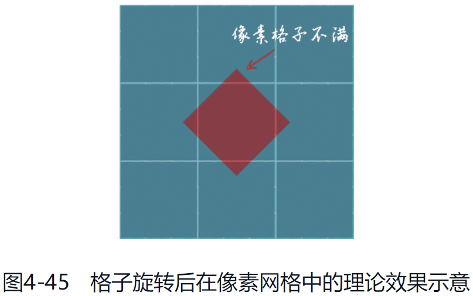

于是，有一个问题出现了，显示器没有能力显示小于 1px×1px 的图形，于是，要么裁剪像素点（锯齿），要么使用算法进行边缘模糊计算（虚化）。因此，要想解决 transform 变换锯齿和虚化的问题，只要把我们的显示器换掉就可以了。换成一个高清屏，类似 iMac 那种 5KB 显示屏，这个现象就没了。因为这类屏幕密度足够高，0.2px×0.2px 的元素都可以细腻渲染。

### 不同顺序不同效果

我们可以一次性应用多个不同的变换函数，但需要注意的是，即使变换内容一样，如果顺序不同，最终的效果也会不一样，例如：

```html
<p></p>
<p></p>
<style>
   p {
      width: fit-content;
      border: solid deepskyblue;
   }

   .transform-1 {
      transform: translateX(40px) scale(0.75);
   }

   .transform-2 {
      transform: scale(0.75) translateX(40px);
   }
</style>
```

结果两张图片的位置表现出了明显的不一致，如图 4-46 所示。

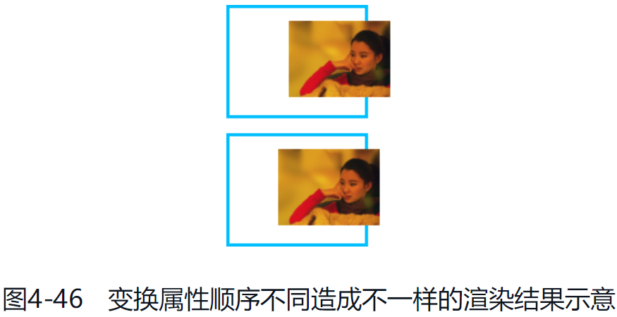

下面一张图片实际偏移大小是 30px，因为先缩小到了原大小的 75%。

[transform-order](embedded-codesandbox://css-new-world-detailed-style-performance/transform-order)

### clip/clip-path 前置剪裁

一个元素应用 transform 变换之后，同时再应用 clip 或者 clip-path 等属性，此时很多人会误认为剪裁的是应用变换之后的图形，实际上不是的，剪裁的还是变换之前的图形，也就是先剪裁再变换。例如：

```css
img {
   width: 128px;
   height: 96px;
   transform: scale(2);
   clip-path: circle(48px at 64px 48px);
}
```

如果是先执行 transform 再执行 clip-path，则最终剪裁的圆的半径应该还是 circle() 函数中的 48px，即最终剪裁的圆的直径是 96px；如果是先执行 clip-path 再执行 transform，则最终剪裁的圆的直径应该是 192px，在各个浏览器中实际渲染的结果都是直径为 192px 的圆，如图 4-47 所示。


由此可以证明，transform 和 clip-path 同时用的时候，是先执行 clip-path 剪裁，另外一个剪裁属性 clip 也是类似的。

[transform-clip-path](embedded-codesandbox://css-new-world-detailed-style-performance/transform-clip-path)

### 动画性能优秀

CSS 高性能动画三要素指的是绝对定位、opacity 属性和 transform 属性。因此，同样的动画效果，优先使用 transform 属性实现。例如，元素移动动画应使用 transform 属性，而不是 margin 属性。

## 元素应用 transform 属性后的变化

元素应用 transform 属性后还会带来很多看不见的特性变化。

### 创建层叠上下文

和 opacity 属性值不是 1 的元素类似，如果元素的 transform 属性值不是 none，则会创建一个新的层叠上下文。这一特性常被用在下面两个场景中。

1. 覆盖其他元素。
2. 限制 z-index: -1 的层级表现。

在默认情况下，多个 `` 元素相互重叠的时候，一定是 DOM 位置偏后的 `` 元素覆盖 DOM 位置靠前的元素，例如：

```css
img + img {
   margin-left: -60px;
}
```

效果如图 4-48 所示，可以看到 DOM 位置靠后的图片覆盖了 DOM 位置靠前的图片。


但是，如果我们给 DOM 位置靠前的图片设置 transform 属性，例如：

```css
img:first-child {
   transform: scale(1);
}
```

则此时 DOM 位置靠前的图片会覆盖 DOM 位置靠后的图片，如图 4-49 所示。

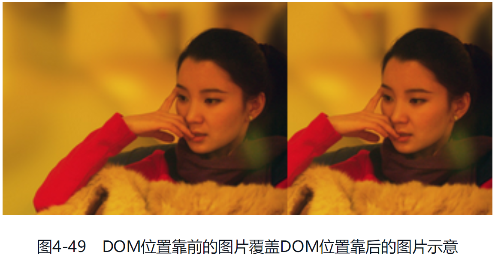

[transform-z-index](embedded-codesandbox://css-new-world-detailed-style-performance/transform-z-index)

这就是我们实现鼠标悬停图片放大效果的时候无须指定层级的原因。

我们再看一个使用 transform 属性限制 z-index: -1 层级位置的案例，有一个模拟纸张投影的效果，HTML 代码结构如下：

```html
<div class="container">
   <div class="page"></div>
</div>
```

其中，容器元素设置了让效果更突出的深灰色背景，纸张元素使用 ::before 和 ::after 伪元素创建了模拟卷角投影的效果，由于投影效果需要放在纸张元素后面，因此 z-index 设为了负值，如下所示：

```css
.container {
   background-color: #666;
}

.page {
   width: 300px;
   height: 200px;
   background-color: #f4f39e;
   box-shadow: 0 2px 10px 1px rgba(0, 0, 0, 0.2);
   border-bottom-right-radius: 50% 10px;
   position: relative;
}

.page::before {
   transform: skew(-15deg) rotate(-5deg);
   left: 15px;
   bottom: 10px;
   box-shadow: 0 8px 16px rgba(0, 0, 0, 0.3);
}

.page::after {
   transform: skew(15deg) rotate(8deg);
   right: 15px;
   bottom: 25px;
   box-shadow: 8px 8px 10px rgba(0, 0, 0, 0.4);
}

.page:before,
.page:after {
   content: '';
   width: 90%;
   height: 30%;
   position: absolute;
   z-index: -1;
}
```

此时，::before 和 ::after 伪元素创建的投影效果不见了，如图 4-50 所示

原因就在于，z-index: -1 是定位在第一个层叠上下文祖先元素的背景层上的，而网页在默认状态下的层叠上下文元素就是 `<html>` 根元素，也就是伪元素创建的阴影效果其实是在页面根元素的上面、在 .container 元素的下面，而 .container 元素设置了背景颜色，挡住了伪元素，因此阴影效果在视觉上不可见。

要想解决这个问题很简单，把 .container 元素作为层叠上下文元素即可，实现这个操作的方法很多，比较合适的方法就是设置一个无关紧要的 transform 属性值。例如我就喜欢设置 scale(1)，因为拼写更快：

```css
.container {
   transform: scale(1);
}
```

此时的结果如图 4-51 所示，可以看到纸张底部两个角落均出现了明显的卷角投影效果。


[transform-page-shadow-z-index](embedded-codesandbox://css-new-world-detailed-style-performance/transform-page-shadow-z-index)

### 固定定位失效

想要实现固定定位效果，可以应用 position: fixed 声明。大部分情况下，最终的样式表现是符合预期的，但是，如果父元素设置了 transform 变换，则固定定位效果就会失效，样式表现就会类似于绝对定位。例如：

```html
<p>
   
</p>
<p class="transform">
   
</p>
<style>
   img {
      position: fixed;
   }

   .transform {
      transform: scale(1);
   }
</style>
```

结果页面滚动的时候，第一张图片纹丝不动，第二张图片跟着页面滚动，这说明第二张图片的固定定位效果失效了。

[transform-fixed-invalid](embedded-codesandbox://css-new-world-detailed-style-performance/transform-fixed-invalid)

此特性表现不包括 IE 浏览器。

另外，顺便提一下，filter 滤镜也会让子元素的固定定位效果失效。那么，问题来了，如何让变换效果和固定定位同时有效呢？之前有人问过我这样一个问题：产品的要求是既要有动画又要固定定位，有什么方法可以使两者共存呢？解决方法就是使用嵌套，外层元素负责固定定位，内层元素负责实现动画。

### 改变 overflow 对绝对定位元素的限制

下面这句话源自 CSS2.1 规范：

> 如果绝对定位元素含有 overflow 属性值不为 visible 的祖先元素，同时，该祖先元素以及到该绝对定位元素之间的任何嵌套元素都没有 position: static 的声明，则 overflow 对该 absolute 元素不起作用。

现在这个规范已经不准确了，因为现在不仅 position 属性值不为 static 的元素可以影响绝对定位在 overflow 元素中的表现，transform 属性值不为 none 的元素也可以影响绝对定位在 overflow 元素中的表现。例如：

```html
<p>
   
</p>
<p class="transform">
   
</p>
<style>
   p {
      border: solid deepskyblue;
      width: 150px;
      height: 150px;
      overflow: hidden;
   }

   img {
      position: absolute;
   }

   .transform {
      transform: scale(1);
   }
</style>
```

第一个 `` 元素没有被 overflow: hidden 隐藏，第二个 `` 元素被 overflow: hidden 隐藏了（因为设置了 transform 变换），如图 4-52 所示。


[transform-overflow-absolute](embedded-codesandbox://css-new-world-detailed-style-performance/transform-overflow-absolute)

### 改变绝对定位元素的包含块

过去绝对定位元素的包含块是第一个 position 属性值不为 static 的祖先元素，现在 transform 属性值不为 none 的元素也可以作为绝对定位元素的包含块。例如：

```html
<p>
   
</p>
<style>
   p {
      border: solid deepskyblue;
      width: 150px;
      height: 150px;
      transform: scale(1);
   }

   img {
      width: 100%;
      position: absolute;
   }
</style>
```

`` 元素的宽度是 150px，因为此时的 100% 宽度是相对于父元素 `<p>` 计算的，如图 4-53 所示。但是，如果父元素 `<p>` 没有设置 `transform: scale(1)`，则图片的宽度就不一定是 150px 了。

[transform-absolute](embedded-codesandbox://css-new-world-detailed-style-performance/transform-absolute)

### 深入了解矩阵函数 matrix()

transform 变换还支持矩阵函数 matrix()。无论是位移、旋转、缩放还是斜切，其变换的本质都是应用矩阵函数 matrix() 进行矩阵变换。所谓矩阵变换，就是套用矩阵公式，把原先的坐标点转换成另外一个坐标点的过程。其语法如下：

```css
transform: matrix(a, b, c, d, e, f);
```

可以看到总共有 6 个参数（a ～ f），参数数量多是多了点，但是，只要你认真学习，就会发现，矩阵真的很难！所以，这里只介绍 2D 变换中的矩阵变换，关于 3D 变换中的矩阵变换大家可以参考更专业的资料。

matrix() 函数的 6 个参数对应的矩阵如图 4-54 所示。

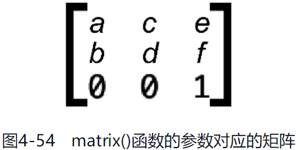

注意书写方向是从上到下的。

大家可以把矩阵想象成古代的士兵方阵，若要让其发生变化，就要让其与另外一个士兵方阵对战，即使这是一个小方阵。这个变化过程可以用图 4-55 所示的转换公式表现。

图 4-55 所示的 x 和 y 表示转换元素的所有坐标变量，后面的 ax + cy + e 和 bx + dy + f 就是转换之后的新的坐标，这个新的坐标是如何计算得来的呢？


这就是大学线性代数的知识了，其实挺简单的。3×3 矩阵每一行的第一个值与后面 1×3 矩阵的第一个值相乘，3×3 矩阵每一行的第二个值与 1×3 矩阵的第二个值相乘，3×3 矩阵每一行的第三个值与 1×3 矩阵的第三个值相乘，然后将 3 个乘积结果相加，如图 4-56 所示。其中，ax + cy + e 表示变换后的水平坐标，bx + dy + f 表示变换后的垂直坐标。


我们通过一个简单的例子来快速了解一下，假设矩阵参数如下：

```css
transform: matrix(1, 0, 0, 1, 30, 30); /* a=1, b=0, c=0, d=1, e=30, f=30 */
```

我们随便选取一个点坐标，例如(0, 0)，即 x=0, y=0。于是，矩阵计算后的 x 坐标就是 ax + xy + e = 1 × 0 + 0 × 0 + 30 = 30。矩阵计算后的 y 坐标就是 bx + dy + f = 0 × 0 + 1 × 0 + 30 = 30。

也就是点坐标从 (0, 0) 变成了 (30, 30)。请读者好好想象一下，原来 (0, 0) 的位置，经过矩阵变换后就移到了 (30, 30) 的位置，是不是等同于往右方和下方各偏移了 30px？如果我们再选取其他坐标点进行计算，就会发现计算后的坐标相比原坐标同样是往右方和下方各偏移了 30px。实际上 transform: matrix(1, 0, 0, 1, 30, 30) 等同于 transform: translate(30px, 30px)。

注意，translate()、rotate() 等函数都是需要单位的，而 matrix() 函数中的参数的单位是省略的。

#### 位移：translate() 函数

位移变换函数 translate(x, y) 中的 x 和 y 分别对应 matrix() 函数中的 e 和 f 两个参数，语法示意如下：

```css
transform: matrix(a, b, c, d, 水平偏移距离, 垂直偏移距离);
```

我们只要关心最后 2 个参数就可以了，至于前面 4 个参数，它们和位移变化没有关系。

#### 缩放：scale() 函数

偏移变换只需要关心最后 2 个参数，缩放变换同样也只需要关心 2 个参数，那么是哪两个呢？

下面的 CSS 声明是位移变换使用的矩阵变换值，其中两个数值为 1 的参数就是与缩放变换计算相关的参数，因为缩放默认大小就是 1：

```css
transform: matrix(1, 0, 0, 1, 30, 30); /* a=1, b=0, c=0, d=1, e=30, f=30 */
```

其中参数 a 表示 x 轴缩放大小，参数 d 表示 y 轴缩放大小。

我们套用矩阵计算公式计算下就明白了，假设原始坐标是 (x, y)，缩放比例是 s，则：

```
x' = ax + cy + e = sx + 0y + 0 = sx
y' = bx + dy + f = 0x + sy + 0 = sy
```

可以看到最终的坐标就是原始坐标按缩放比例缩放的结果，表明参数 a 和参数 d 确实是和缩放相关的矩阵参数。我们不妨测试一下：

```css
img {
   transform: matrix(3, 0, 0, 1, 0, 0);
}
```

其中参数 a 是 3，参数 d 是 1，这表示水平 x 轴放大 3 倍，垂直 y 轴的大小是原来的 1 倍（相等），最终的效果如图 4-57 所示。


可以看到图片水平拉伸了 3 倍。

#### 旋转：rotate() 函数

旋转要比位移和缩放难一些，需要用到三角函数的知识。

假设旋转角度为 θ，则矩阵计算方法和参数如下：

```css
matrix(cosθ, sinθ, -sinθ, cosθ, 0, 0)
```

结合矩阵公式，就有：

```
x' = xcosθ - ysinθ + 0 = xcosθ - ysinθ
y' = xsinθ + ycosθ + 0 = xsinθ + ycosθ
```

假设原坐标是 (100, 100)，旋转角度为 60 度，则有：

```
x' = 100 * 0.5 - 100 * 0.866025 = -36.6025
y' = 100 * 0.866025 + 100 * 0.5 = 136.6025
```

用坐标图表示就是图 4-58 所示的 A 点 (100, 100) 变换到了 B 点 (−36.6025, 136.6025)。

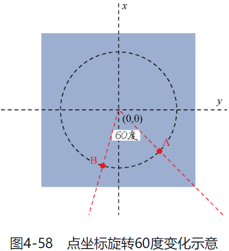

因此，元素旋转 60 度也可以使用下面的矩阵函数表示：

```css
transform: matrix(0.5, 0.866025, -0.866025, 0.5, 0, 0);
/* 等同于 */
transform: rotate(60deg);
```

#### 斜切：skew() 函数

斜切用到了三角函数 tan，对应的是 b 和 c 两个参数，需要注意的是 b 参数表示的是 y 轴的斜切，而后面的参数 c 才是 x 轴的斜切。计算公式如下：

```css
matrix(1, tan(θy), tan(θx), 1, 0, 0);
```

假设原坐标是 (x, y)，则套用矩阵公式后的坐标计算结果为：

```
x' = x + ytan(θx) + 0 = x + ytan(θx)
y' = xtan(θy) + y + 0 = xtan(θy) + y
```

#### 汇总说明

通过上面的分析，我们可以得到下面的结论：

- 位移变换使用的是矩阵参数 e 和 f；
- 缩放变换使用的是矩阵参数 a 和 d；
- 旋转变换使用的是矩阵参数 a、b、c 和 d；
- 斜切变换使用的是矩阵参数 b 和 c。

仔细查看上面的结论，不难发现同时使用不同的变换就会有参数冲突的问题，假如想要同时使用旋转变换和缩放变换，各个参数值该如何使用矩阵表示呢？使用空格分开表示即可，例如：

```css
transform: matrix(0.5, 0.866, -0.866, 0.5, 0, 0) matrix(3, 0, 0, 1, 0, 0);
```

可以看到，使用 matrix() 函数表示实在太麻烦了，参数很多，还要计算和记忆。因此日常开发中我们使用的都是更加语义化的快捷函数，例如上面的矩阵表示实际上可以写作：

```css
transform: rotate(60deg) scale(3, 1);
```

但是，这并不表示 matrix()函数一无是处，举两个应用场景例子。

1. 跨语言的图形变换处理。矩阵的计算是各个语言通用的，在跨语言、跨设备处理的时候，matrix() 函数就很有用。例如，在 Web 中呈现医学影像的图形，后台数据库存储的往往就是矩阵变换坐标，此时有了 matrix() 函数，就可以直接呈现了。
2. 前面提到运行 `transform: scale(.75) translateX(40px)` 最后元素的水平偏移大小是 30px，这让不少开发者“踩了坑”，如果使用 matrix() 函数表示，就不会有这样的问题出现了：

   ```css
   transform: matrix(0.75, 0, 0, 0.75, 40, 0);
   ```

#### 3D 矩阵变换

最后，关于 3D 矩阵变换再多说一两句。3D 矩阵变换不再是 3×3，而是 4×4，其计算方式和 2D 变换一致，只是上升了 1 个维度，计算复杂度增加了。这里简单示意下 3D 缩放效果的矩阵计算公式，如图 4-59 所示。

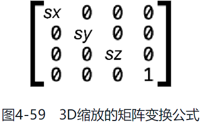

用代码表示就是：

```css
transform: matrix3d(sx, 0, 0, 0, 0, sy, 0, 0, 0, 0, sz, 0, 0, 0, 0, 1);
```

### 常常被遗忘的 transform-origin 属性

transform-origin 属性可以用来改变元素变换的中心坐标点。很多开发者容易把这个 CSS 属性给遗忘，这个属性还是很实用的，大家可以强化记忆一下。

变换默认是相对于元素的中心点进行的，这个中心点是由 transform-origin 属性决定的。

在 IE9 浏览器中的 transform-origin 属性支持 2 个属性值，在 IE10+ 浏览器中则支持 3 个属性值，分别表示 x 轴、 y 轴和 z 轴的变换中心点，初始值是 50%、50% 和 0，其中需要注意以下几点。

- z 轴只能是数值。
- x 轴和 y 轴支持百分比值、数值和关键字属性值（left | center | right | top | bottom）。
- 关键字属性值自带方位，因此 y 轴关键字写在前面也是合法的，例如：

```css
/* x轴 | y轴 */
transform-origin: right top;
/* y轴 | x轴 */
transform-origin: top right;
```

center 关键字可省略，例如：

```css
transform-origin: bottom center;
/* 可以写作 */
transform-origin: bottom;
```

同样，如果看到单个值语法，则另外一个省略的值就是 50%，例如：

```css
transform-origin: 20px;
/* 等同于 */
transform-origin: 20px 50%;
```

transform-origin 属性在实际项目开发中主要用在下面两个场景。

1. 模拟现实世界物体的运动。例如蜡烛火焰摆动的效果，该效果需要设置火焰元素的 transform-origin 属性值为 bottom，这样火焰摆动的时候才自然。又如实现钟摆运动的动画效果，需要设置 transform-origin 属性值为 top，这样钟摆顶部就会固定，下方会摆动。
2. 布局与定位。例如，在 Chrome 浏览器中想要实现 10px 大小的字符，可以先设置 12px 大小的字符，然后缩放一下：

   ```css
   .text {
      transform: scale(0.83333);
   }
   ```

   但是这样做有一个问题，transform 变换的时候元素的原始位置是保留的，这会导致元素缩小后原本设定的间距变大，此时可以使用 transform-origin 属性优化一下。如果元素是左对齐的，则可以设置：

   ```css
   transform-origin: left;
   ```

   如果元素是右对齐的，则可以设置：

   ```css
   transform-origin: right;
   ```

transform-origin 属性是支持 CSS 过渡和 CSS 动画效果的，活用这个特性可以实现体现数学之美的运动轨迹效果，本书不展开讲解。

#### transform-origin 属性作用原理

transform-origin 属性的作用原理就是改变 transform 变换的中心点坐标。transform 变换默认的中心点坐标为 (0, 0)，如图 4-60 所示。

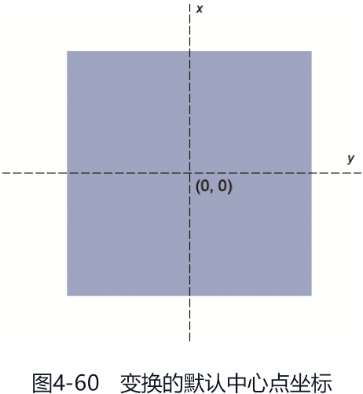

为了方便大家理解，我就使用这个中心点坐标来做原理讲解。在默认状态下，这个点的坐标是 (0, 0)。2D 矩阵变换的坐标转换公式如下：

```
x' = ax + cy + e
y' = bx + dy + f
```

坐标 (0, 0) 表示 x 是 0，y 是 0，因此，此时无论旋转多少度，变换后的坐标还是 (0, 0)，因为旋转相关的 4 个参数 a、b、c、d 都是与 0 相乘。

现在，我们设置变换中心点位于左上角：

```css
transform-origin: 0 0;
```

现在的中心点坐标就不是 (0, 0) 了，而是 (140, -145)（这是因为色块尺寸为 280px×290px），如图 4-61 所示。

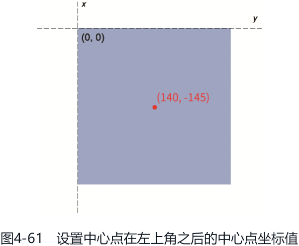

此时，中心点的旋转变换坐标值就变成了：

```
x' = ax + cy + e = a * 140 - c * 145 + e
y' = bx + dy + f = b * 140 - d * 145 + f
```

显然是一个有着明显坐标变化的新的坐标点，于是视觉上就有元素绕着左上角旋转的效果了。

总结一下，所有 transform 变换本质上都是坐标点位置的矩阵变换，transform-origin 属性变化后，所有点的坐标都会发生变化，这导致最终的矩阵变换计算结果也发生变化。

### scale() 函数缩放和 zoom 属性缩放的区别

除了 Firefox 浏览器不支持 zoom 属性，其他所有浏览器都支持，且支持时间非常早，移动端也可以放心使用。zoom 属性的正式语法如下：

```css
zoom: normal | reset | <number> | <percentage>;
```

从语法中可以看出 zoom 属性支持以下属性值。

- 百分比值。zoom: 50%，表示缩小到原来的一半。
- 数值。zoom: 0.5，表示缩小到原来的一半。
- normal 关键字。zoom: normal 等同于 zoom: 1，是默认值。
- reset 关键字。zoom: reset，表示用户按 Ctrl 和 − 或 Ctrl 和 + 进行文档缩放的时候，元素不跟着缩小与放大。不过，这个关键字兼容性很糟糕，仅被 Safari 浏览器支持。

下面我通过对比 zoom 属性缩放和 scale() 函数缩放的不同之处带大家快速了解一下 zoom 属性。

1. 标准和非标准区别。zoom 属性是一个非标准属性，虽然 MDN 文档建议不要在非生产环境使用，但是根据我的判断，浏览器日后绝无可能放弃对 zoom 属性的支持。
2. 坐标系不同。zoom 属性缩放的中心坐标是相对于元素的左上角，且不能修改。transform 变换中的 scale() 函数缩放默认的中心坐标是元素的中心点。
3. 占据的尺寸空间表现不同。zoom 属性缩放会实时改变元素占据的尺寸空间。例如，一个图片原始尺寸是 128px×96px，则应用下面的 CSS 代码后，图片占据的尺寸就会变成 256px×192px，该图片周围的元素会被推开，并会触发重绘和重计算，因此 zoom 属性缩放的性能比 scale() 函数缩放的性能差。

   ```css
   img {
      zoom: 2;
   }
   ```

   如果图片使用的是 scale() 函数缩放，则占据的尺寸还是原先的 128px×96px。

4. 元素应用 zoom 属性不会出现应用 transform 属性后的 N 个变化。元素应用 zoom 属性不会创建层叠上下文，不会影响 fixed 元素的定位和 overflow 属性对绝对定位的溢出隐藏，也不会改变绝对定位元素的包含块。

总而言之，zoom 属性就是一个普普通通的改变元素比例的 CSS 属性。

### 了解全新的 translate、scale 和 rotate 属性

最新的 CSS Transforms Level 2 规范针对位移、缩放和旋转定义了全新的 CSS 属性。例如，位移可以直接使用 translate 属性，该属性支持 1 ～ 3 个值，分别表示 x 轴、y 轴和 z 轴，语法如下：

```css
translate: 50%;
translate: 10px 20px;
translate: 50% 105px 5rem;
```

缩放可以直接使用 scale 属性，支持 1 ～ 3 个值，分别表示 x 轴、y 轴和 z 轴，语法如下：

```css
scale: 1;
scale: 1.5;
scale: 1 2 3;
```

旋转可以直接使用 rotate 属性，语法相对复杂些：

```css
rotate: 45deg;
/* 指定旋转轴 */
rotate: x 90deg;
rotate: y 0.25turn;
rotate: z 1.57rad;
/* 矢量角度值 */
rotate: 1 1 1 90deg;
```

下面将逐一讲解上述语法中的元素：

- rotate: 45deg 等同于 transform: rotate(45deg)，是一个 2D 旋转变换；
- rotate: x 90deg 等同于 transform: rotateX(90deg)；
- rotate: y 0.25turn 等同于 transform: rotateY(0.25turn)；
- rotate: z 1.57rad 等同于 transform: rotateZ(1.57rad)；
- rotate: 1 1 1 90deg 等同于 transform: rotate3D(1, 1, 1, 90deg)。

目前只有 Firefox 浏览器支持这个新特性，想要在实际项目中使用这个新特性，还需要一段时间，大家了解即可。最后，没有 skew 属性。
