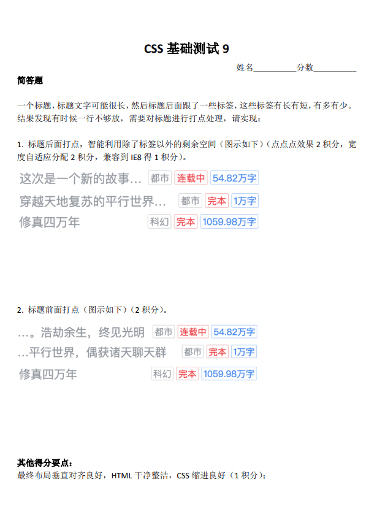
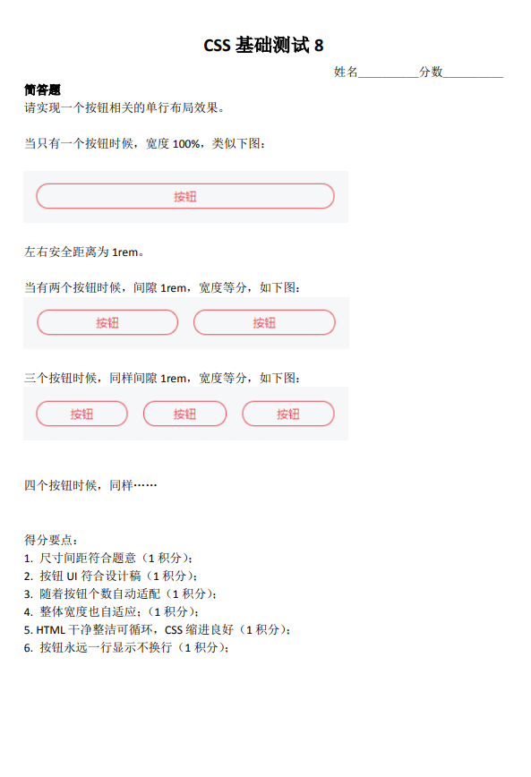

练习地址：[小测答题收集区](https://github.com/zhangxinxu/quiz)

# CSS测试一

## 具体实现

### float

<iframe src="/examples/css-practice-1-1.html" width="400" height="100"></iframe>

`embed:css-practice-1-1.html`

### flex

<iframe src="/examples/css-practice-1-2.html" width="400" height="100"></iframe>

`embed:css-practice-1-2.html`

### table

<iframe src="/examples/css-practice-1-3.html" width="400" height="100"></iframe>

`embed:css-practice-1-3.html`

## 实现要点

1. 大家布局其实这3类：float+overflow，然后是flex布局，很少人使用的table布局。
2. float布局技巧：float:right+overflow:hidden;text-overflow:ellipsis;white-space:nowrap; 原理：overflow:hidden可以创建格式化上下文，也就是BFC，类似结界，不受浮动影响，自动分配剩余空间。
3. flex布局：display:flex > flex: 1;overflow:hidden;text-overflow:ellipsis;white-space:nowrap;
4. 重点是table布局：float布局有个非常明显的不足，那就是DOM的位置和视觉是不一致的。XboxYan 的table布局虽然效果有，但是却有很多的不足。1. 左侧table-cell的尺寸不建议使用字符撑开，然后内容绝对定位打点布局有较大的限制。非table-layout:fixed的表格，其每个单元格尺寸宽度是根据里面内容自动分配的，如果你没有设置white-space: nowrap是自动宽度自适应的。但是设置了white-space: nowrap则尺寸表现就不符合要求，怎么办呢？其实很简单，再嵌套一层display:table;table-layout:fixed;的元素。table布局中，打点只能在table-layout:fixed的场景下。所以，我们设置很大宽度的table-cell的子元素display:table;table-layout:fixed;此时就能正常打点了。优点：兼容性更好，DOM顺序符合认知。
5. 开头打点 direction: rtl 就可以。

# CSS测试二

## 具体实现

### flex

<iframe src="/examples/css-practice-2-1.html" width="400" height="100"></iframe>

`embed:css-practice-2-1.html`

### grid

<iframe src="/examples/css-practice-2-2.html" width="400" height="100"></iframe>

`embed:css-practice-2-2.html`

### table

<iframe src="/examples/css-practice-2-3.html" width="400" height="100"></iframe>

`embed:css-practice-2-3.html`

## 实现要点

1. flex和grid布局都能实现我们想要的效果，但是推荐使用flex布局，因为语义更好。grid更适合页面大的框架结构布局，偏向二维。本题语义偏向一维。虽然grid控制间隙更方便（grid-gap）。
2. justify-content可以不需要，flex-wrap也是多余的，因为默认就是nowrap，flex-direction也是不需要的，因为默认就是row。因此，我们直接在容器元素设置display:flex就好了。
3. 子项可以flex: 1，以及其他很多设置方法。例如flex: auto;（语义更合适-推荐）。设置flex:1实际上空间分配是不足的，于是，等分。因此设置flex:2, 3, 4...都是可以。还有就是width:100%，除了还有一种方法：width:-webkit-fill-available语义是更好的（推荐）。
4. 下面是grid布局：grid-template-columns: repeat(auto-fit, minmax(0, 1fr))是一种方法，但是并不是最好的实现，因为这个比较难理解，也不好记忆。更好的实现是grid-auto-flow: column;
5. 兼容性更好的table布局，IE8+都支持，放心使用。.table {  display: table;  table-layout: fixed;  width: 100%; }.cell {  display: table-cell;} 固定组合。务必掌握，基础必备布局知识。
6. 不少人.container左右0.5rem，子项margin:0 .5rem实现1rem间隙，这样方式和实际开发是不符合的。实际开发左右1rem，是一个大的结构元素控制的。使用:last-child或者:first-child更符合实际开发，虽然代码更啰嗦了点，因为有一个重置。最好的实现其实还是使用:not()伪类（AsyncGuo的实现），:not(:last-child) {margin-right: 1rem;} 或者  .btn_item + .btn_item 或者 .btn_item ~ .btn_item（IE7+）

