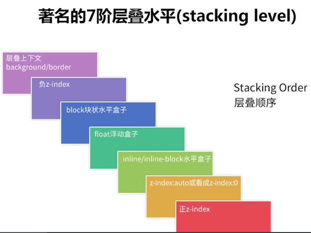
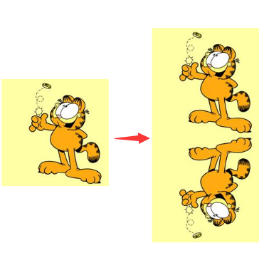
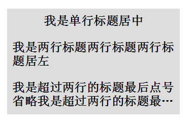
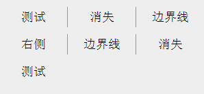

# 下面这个图形，只使用一个标签，可以有多少种实现方式：


假设单标签是一个div:

```html
<div></div>
```

定义如下通用CSS：

```css
div {
  position:relative;
  width:200px;
  height:60px;
  background:#ddd;
}
```

## border

```css
div {
  border-left:5px solid deeppink;
}
```

## 使用伪元素

```css
div::after{
  content:"";
  width:5px;
  height:60px;
  position:absolute;
  top:0;
  left:0;
  background:deeppink;
}
```

## 使用具有相对特性的无依赖的absolute绝对定位

父元素去掉position:relative属性

```css
div::after{
  content:"";
  width:5px;
  height:60px;
  position:absolute;
  background:deeppink;
}
```

## 外 box-shadow

box-shadow: 水平阴影位置 垂直阴影位置 模糊距离 阴影的尺寸 阴影的颜色 内部阴影

```css
div{
  box-shadow:-5px 0px 0 0 deeppink;
}
```

## 内box-shadow

```css
div{
  box-shadow:inset 5px 0px 0 0 deeppink;
}
```

## drop-shadow

```css
div{
  filter:drop-shadow(-5px 0 0 deeppink);
}
```

## 渐变 linearGradient

/* 从下到上，从蓝色开始渐变、到高度40%位置是绿色渐变开始、最后以红色结束 */
linear-gradient(0deg, blue, green 40%, red);

```css
div{
  background-image:linear-gradient(90deg, deeppink 0px, deeppink 5px, transparent 5px);
}
```

## 轮廓 outline（未实现)

```css
div{
  height:50px;
  outline:5px solid deeppink;
}
div{
  position:absolute;
  content:"";
  top:-5px;
  bottom:-5px;
  right:-5px;
  left:0;
  background:#ddd;
}
```

## 滚动条

```css
div{
  width:205px;
  background:deeppink;
  overflow-y:scroll;
}
div::-webkit-scrollbar{
  width: 200px;
  background-color:#ddd;
}
```

# 类似下面这个图形，只使用一个标签，可以有多少种实现方式：


```html
<div></div>
```

定义如下通用CSS：

```css
div{
  position:relative;
  width: 180px;
  height: 180px;
}
```

## 从 border 开始填充，伪元素设置白色背景色填充 div

```css
div{
  background:#9c27b0;
  border:20px dashed #2196f3;
}
div::after{
  content:"";
  position:absolute;
  top:0;
  left:0;
  bottom:0;
  right:0;
  background:#fff;
}
```

## 使用伪元素背景色从 border-box 开始填充，使用 div 的背景色填充中间 padding-box区域

```css
div{
  background:#fff;
  background-clip:padding-box;
  border:20px dashed #cccc99;
}
div::before{
  content:"";
  position:absolute;
  top:-20px;
  left:-20px;
  bottom:-20px;
  right:-20px;
  background:#996699;
  z-index:-1;
}
```

# 层叠顺序（stacking level）与堆栈上下文（stacking context）知多少？

z-index 看上去其实很简单，根据 z-index 的高低决定层叠的优先级，实则深入进去，会发现内有乾坤。

```html
<div class="container">
  <div class="inline-block">#divA display:inline-block</div>
  <div class="float"> #divB float:left</div>
</div>
```

```css
.container{
  position:relative;
  background:#ddd;
}
.container > div{
  width:200px;
  height:200px;
}
.float{
  float:left;
  background-color:deeppink;
}
.inline-block{
  display:inline-block;
  background-color:yellowgreen;
  margin-left:-100px;
}
```

会发现，无论顺序如何，始终是 display:inline-block 的 div 叠在上方



下面我们修改一下题目，给两个 div ，增加一个 opacity:

```css
.container{
  position:relative;
  background:#ddd;
}
.container > div{
  width:200px;
  height:200px;
  opacity:0.9; // 注意这里，增加一个 opacity
}
.float{
  float:left;
  background-color:deeppink;
}
.inline-block{
  display:inline-block;
  background-color:yellowgreen;
  margin-left:-100px;
}
```

会看到，inline-block 的 div 不再一定叠在 float 的 div 之上，而是和 HTML 代码中 DOM 的堆放顺序有关，后添加的 div 会 叠在先添加的 div 之上。

添加的 opacity:0.9 让两个 div 都生成了 stacking context（堆叠上下文） 的概念。此时，要对两者进行层叠排列，就需要 z-index ，z-index 越高的层叠层级越高。

如何触发一个元素形成堆叠上下文？

- 根元素 (HTML),
- z-index 值不为"auto"的 绝对/相对定位
- 一个 z-index 值不为"auto"的 flex 项目 (flex item)，即：父元素 display: flex|inline-flex
- opacity 属性值小于 1 的元素（参考 the specification for opacity）
- transform 属性值不为"none"的元素
- mix-blend-mode 属性值不为"normal"的元素
- filter值不为“none”的元素，
- perspective值不为“none”的元素
- isolation 属性被设置为 "isolate"的元素
- position: fixed
- 在 will-change 中指定了任意 CSS 属性，即便你没有直接指定这些属性的值
- -webkit-overflow-scrolling 属性被设置"touch"的元素

在层叠上下文中，其子元素同样也按照上面解释的规则进行层叠。 特别值得一提的是，其子元素的 z-index 值只在父级层叠上下文中有意义。意思就是父元素的 z-index 低于父元素另一个同级元素，子元素 z-index 再高也没用。

理解上面的 stacking-level 与 stacking-context 是理解 CSS 的层叠顺序的关键。

# 从倒影说起，谈谈 CSS 继承 inherit

给定一张有如下背景图的 div：


制作如下的倒影效果：



## -webkit-box-reflect

```css
div{
  -webkit-box-reflect: below;
}
```

## inherit，使用继承

```css
div::after {
  content: "";
  position: absolute;
  top: 100%;
  left: 0;
  right: 0;
  bottom: -100%;
  background-image: inherit;
  transform: rotateX(180deg);
}
```

# 单行居中显示文字，多行居左显示，最多两行超过用省略号结尾

使用纯 CSS，完成单行文本居中显示文字，多行居左显示，最多两行超过用省略号结尾，效果如下：



```html
<h2><p><em>单行居中，多行居左<em></p></h2>
```

## 普通方法

我们让内层 p 居左 text-align:left，外层 h2 居中 text-align:center，并且将 p 设置为 display:inline-block ，利用 inline-block 元素可以被父级 text-align:center 居中的特性，这样就可以实现单行居中，多行居左，CSS 如下：

```css
p {
  display: inline-block;
  text-align: left;
}

h2{
  text-align: center;
}

em {
  overflow : hidden;
  text-overflow: ellipsis;
  display: -webkit-box;
  -webkit-line-clamp: 2;
  -webkit-box-orient: vertical;
}
```

超出两行省略，主要用到如下几个：

- display: -webkit-box; // 设置display，将对象作为弹性伸缩盒子模型显示
- -webkit-line-clamp: 2; // 限制在一个块元素显示的文本的行数
- -webkit-box-orient: vertical; // 规定框的子元素应该被水平或垂直排列

上述 3 条样式配合 overflow : hidden 和 text-overflow: ellipsis 即可实现 webkit 内核下的多行省略。

## 绝对定位障眼法

```html
<div class="container">
  <h2>
    <p>我是单行标题居中</p>
    <p class="pesudo">我是单行标题居中</p>
  </h2>
</div>
```

```css
h2{
  position:relative;
  line-height:30px;
}
p{
  overflow : hidden;
  text-overflow: ellipsis;
  display: -webkit-box;
  -webkit-line-clamp: 2;
  -webkit-box-orient: vertical;
}
.pesudo{
  position:absolute;
  width:100%;
  height:30px;
  overflow:hidden;
  top:0;
  background:#ddd;
  text-align:center;
}
```

# 全兼容的多列均匀布局问题

# display:flex

# 借助伪元素及 text-align:justify

```html
<div class="container">
  <div class="justify">
    <i>1</i>
    <i>2</i>
    <i>3</i>
    <i>4</i>
    <i>5</i>
  </div>
</div>  
```

```css
.justify{
  text-align: justify;
  text-align-last: justify; // 新增这一行
}

.justify i{
  width:24px;
  line-height:24px;
  display:inline-block;
  text-align:center;
  border-radius:50%;
}
```


由于text-align-last兼容性太低，故使用伪元素

```css
.justify{
  text-align: justify;
}

.justify i{
  width:24px;
  line-height:24px;
  display:inline-block;
  text-align:center;
  border-radius:50%;
}

/* 制造假的第二行 */
.justify:after{ 
  content: "";
  display: inline-block;
  position: relative;
  width: 100%;
}
```

# 消失的边界线问题



## 不需要兼容 IE8-

```css
/* 使用伪类选择器，选择第 3n 个元素去掉边框 */
li:nth-child(3n){
  border-right:none;
}
```

## 添加反向添加边框并且增加一个负的 margin

```html
<div class="ul-container">
  <ul>
    <li>测试</li>
    <li>消失</li>
    <li>边界线</li>
    <li>右侧</li>
    <li>边界线</li>
    <li>消失</li>
    <li>测试</li>
  </ul>
</div>
```

```css
.ul-container, 
ul{
  width:300px;
}

li{
  float:left;
  width:99px;
  border-left:1px solid #999;
}

.ul-container{
  overflow:hidden;
}

ul{
  margin-left:-1px;
}
```
