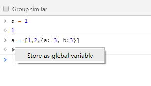
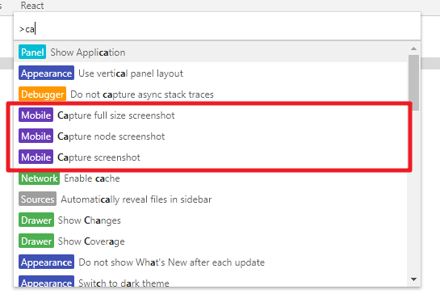

# 通用篇

## 复制与保存

### copy方法

可以通过全局的方法 `copy()` 在 `console` 里 `copy` 任何你能拿到的资源

### 存储为一个全局变量

如果你在 `console` 中打印了一堆数据 (例如你在 App 中计算出来的一个数组)，然后你想对这些数据做一些额外的操作比如我们刚刚说的 `copy` (在不影响它原来值的情况下)。那就可以将它转换成一个全局变量，只需要右击它，并选择 “Store as global variable” (保存为全局变量) 选项。

第一次使用的话，它会创建一个名为 temp1 的变量，第二次创建 temp2，第三次 ... 。通过使用这些变量来操作对应的数据，不用再担心影响到他们原来的值

### 保存堆栈信息

大多数情况下都不是一个人开发一个项目，而是一个团队协作，那么如何准确的描述问题，就成为了沟通的关键，这时候 `console` 打印出来的堆栈跟踪的信息对你和同事来说就起大作用了，可以省去很多沟通成本，所以你可以直接把堆栈跟踪的信息保存为一个文件，而不只是截图发给对方

### 直接Copy HTML

几乎所有人都知道，右击或者点击在 `HTML` 元素边上的省略号 (...) 就可以将它 `copy` 到剪贴板中，但是你不知道的是：古老的 `[ctrl] + [c]` 大法依旧可用！

## 快捷键

### 切换 DevTools 窗口的展示布局

快捷键 `ctrl + shift + D (⌘ + shift + D Mac)` 来实现位置的切换（通常是从 `开始的位置` 到 `右边位置`， 但是如果一开始就是 `右边的位置` 那么会切换到 `左边的位置`）

### 切换 DevTools 的面板

- 按下 `ctrl + [ 和 ctrl + ]` 可以从当前面板的分别向左和向右切换面板
- 按下 `ctrl + 1` 到 `ctrl + 9`可以直接转到编号1...9的面板(`ctrl + 1`转到元素面板，`ctrl + 4` 转到 网络信息面板等等)

### 递增/递减

通过使用 `带有` 或者 `不带有修饰键` 的 `上 / 下` 箭头按键， 你可以实现递增和递减 `0.1` ， `1` 或者 `10` 这样数值类型的值

`ctrl + 上 / 下`递增和递减 100，`shift + 上 / 下`递增和递减 10

### elements， logs， sources & network 中的查找

DevTools 中的前4个主要的面板，每一个都支持 `[ctrl] + [f]` 快捷方式，你可以使用对应的查询方式来查找信息:

- 在 `Elements` 面板中 - 通过 `string`，`选择器` 或者 `XPath` 来查找
- 而在 `Console`， `Network` 以及 `Source` 面板 - 通过区分大小写，或者可以被视为表达式的 `strings` 来查找

## 使用 Command

快捷键 `Ctrl + Shift + P`

### 截屏

节点截图与全屏截图

> 注：节点截图有时会失效，全屏截图暂时没有遇到问题，建议大家使用后者。

### 快速切换面板

输入 layout ，你会看到 2 到 3 个选项

- 使用横向面板布局
- 使用纵向面板布局
- 使用自动面板布局

### 快速切换主题

输入 theme 切换主题

## 代码块的使用

### Snippets

它允许你存放 JavaScript 代码到 DevTools 中，方便你复用这些 JavaScript 代码块，进入到 Sources 面板，在导航栏里选中 Snippets 这栏，点击 New snippet(新建一个代码块) ，然后输入你的代码之后保存，大功告成！现在你可以通过右击菜单或者快捷键： `[ctrl] + [enter]` 来运行它了：

### 运行其他来源的代码块

预设了 Snippets 之后，使用 Command Menu 才是最快的方式，只需在它的输入框中输入 ! ，就可以根据名字来筛选预设代码块：

> 查找预设代码块 有时候会出现失效的情况

以上更新于`2019-3-11 20:02:21`

---

# 控制台篇

## console 中的 &amp;

### &amp;0

在 Chrome 的 Elements 面板中， $0 是对我们当前选中的 html 节点的引用。

理所当然，`$1` 是对上一次我们选择的节点的引用，$2 是对在那之前选择的节点的引用等等，一直到 `$4`

你可以尝试一些相关操作(例如: `$1.appendChild($0)`)

### &amp; 和 &amp;&amp;

如果你没有在 App 中定义过 `$` 变量 (例如 jQuery )的话，它在 console 中就是对这一大串函数 document.querySelector 的别名。

如果是 `$$` 就更加厉害了，还能节省更多的时间，因为它不仅执行 `document.QuerySelectorAll` 并且它返回的是：一个节点的 数组 ，而不是一个 Node list

本质上来说 `Array.from(document.querySelectorAll('div')) === $$('div')` ，但是`document.querySelectorAll('div')` 和 `$$('div')` 哪一种方式更加优雅呢？

### &amp;_

调试的过程中，你经常会通过打印查看一些变量的值，但如果你想看一下上次执行的结果呢？再输一遍表达式吗？

这时候 `$_` 就派上了用场，`$_` 是对上次执行的结果的 引用 ：

### &amp;i

现在的前端开发过程，离不开各种 `npm` 插件，但你可能没有想过，有一天我们竟然可以在 Dev Tools 里面来使用 `npm` 插件！

有时你只是想玩玩新出的 npm 包，现在不用再大费周章去建一个项目测试了，只需要在 Chrome插件: [Console Importer](https://chrome.google.com/webstore/detail/console-importer/hgajpakhafplebkdljleajgbpdmplhie/related) 的帮助之下，快速的在 console 中引入和测试一些 npm 库。

运行 `$i('lodash')` 或者 `$i('moment')` 几秒钟后，你就可以获取到 `lodash / momentjs` 了:

## console.log 的 "bug" ?

一般来说，我们会使用 console.log() 来打印某个对象，并且，两次打印之间，还会对这个对象进行修改，最后我们查看打印的结果发现，修改前的打印和修改后的打印，竟然是一样的？这样出乎意料的情况，让我们难以继续 console.log 的调试。

打印的时候，两次都是我们修改之后的值？

> console 中打印出的对象，在你打印出他内容之前，是以引用的方式保存的。

**解决方案**

- 打印一个从这个对象复制出来的对象。
- 使用资源面中的断点来调试
- 使用 JSON.stringify() 方法处理打印的结果