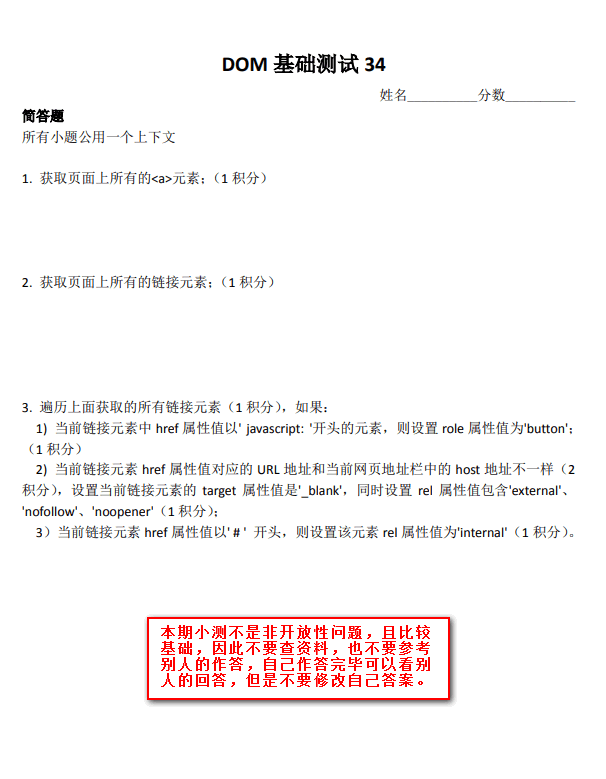

# DOM测试一



## 具体实现

### 我的解答

```js
// 第一题
document.getElementsByTagName('a')
// 第二题
document.querySelectorAll('a[href]')
// 第三题
// 1)
[...document.querySelectorAll('a[href^="javascript:"]')].forEach((item) => {
  item.setAttribute('role', 'button');
})
// 2)
[...document.querySelectorAll('a[href]')].forEach((item) => {
    if(item.getAttribute('href') !== location.host) {
        item.setAttribute('target', '_blank');
        item.setAttribute('rel', 'external nofollow noopener');
    }
})
// 3)
[...document.querySelectorAll('a[href^="#"]')].forEach((item) => {
    item.setAttribute('rel', 'internal');
})
```

### 最佳解答

```js
// 第一题
document.getElementsByTagName('a')
// 第二题
// 链接元素与 a 的区别
document.querySelectorAll(':link')
// 第三题
// 1)
[].slice.call(document.querySelectorAll(':link')).forEach((item) => {
  if (item.href.startsWith('javascript:')) {
    item.setAttribute('role', 'button');
  }
  if (item.host === location.host) {
    item.setAttribute('target', '_blank');
    // 包含，不是设置
    item.relList.add('external', 'nofollow', 'noopener');
  }
  // 这里不能用 item.href，会带有 http
  if (item.getAttribute('href').startsWith('#')) {
    item.setAttribute('rel', 'internal');
  }
})
```

## 本期要点

1. 获取所有a元素，两种方法：document.getElementsByTagName('a') 所有浏览器都支持，还有document.querySeletorAll('a')，IE8+。
2. 答案是：document.links或者document.querySelectorAll(':link')都是可以的。链接元素和`<a>`元素的区别：首先没有href属性的`<a>`元素不是链接元素，其次链接元素还包括`<area>`元素（带href）。`document.querySelectorAll('[href]')`的问题在于，普通元素设置href属性也能获取。
3. NodeList直接forEach IE浏览器不支持，Chrome、Firefox也是最近几年才支持。需要转换成数组，使用[].slice.call(links)，IE9+支持的。ES6 `[...aLink]`，Arrar.from((links)转数组（其实没必要，因为支持ES6也就支持NodeList直接forEach）。如有要兼容IE8，那就是for循环。
4. startsWith可以关注下，字符串前匹配。
5. 链接地址和当前地址栏地址host匹配，eleLink.host == location.host。链接元素天然自带：host（包括端口）, hostname, hash等属性，和location对象一样。不要使用hostname有bug，端口不一也会匹配，例如：`<a href="//www.xxxx.com:80">`和URL //www.xxxx.com:90 会认为是一个域下，实际上不是的。
6. rel属性值包含。就是不覆盖原来设置的rel属性值。需要用到relList，需要注意的是多个rel属性值赋值需要使用relList的add方法，而不是直接等于。直接等于不是赋值多个，而是一个，例如：element.relList = ['external', 'nofollow', 'noopener']，最后结果是`<a href rel="external,nofollow,noopener">`是不合法的，应该空格分隔。正确用法（出题本意）：link.relList.add('external', 'nofollow', 'noopener')。relList和classList API细节都是一样的，只不过一个针对class属性，一个是rel属性。
7. link.href.indexOf('#') > -1有bug，例如 href="//otherdomain.com#xxxx"，还有一种/^#/.test(link.href)也是有bug的，因为href属性通过DOM对象直接获取是带有域名的，需要匹配getAttribute获取的href属性值，也就是这里可以/^#/.test(link.getAttribute('href'))
