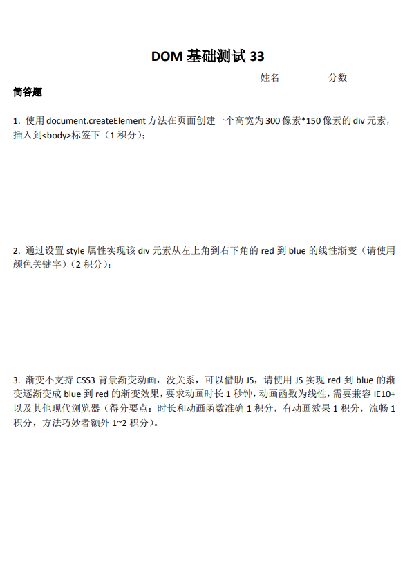
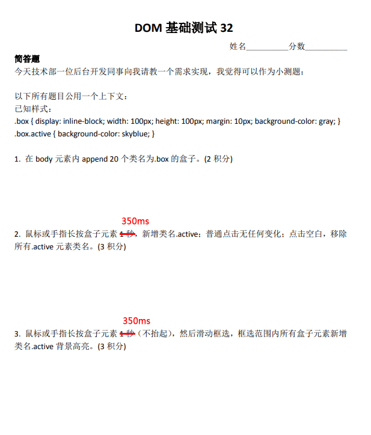

# DOM测试一


## 具体实现

### 我的解答

```js
// 第一题
document.getElementsByTagName('a')
// 第二题
document.querySelectorAll('a[href]')
// 第三题
// 1)
[...document.querySelectorAll('a[href^="javascript:"]')].forEach((item) => {
  item.setAttribute('role', 'button');
})
// 2)
[...document.querySelectorAll('a[href]')].forEach((item) => {
    if(item.getAttribute('href') !== location.host) {
        item.setAttribute('target', '_blank');
        item.setAttribute('rel', 'external nofollow noopener');
    }
})
// 3)
[...document.querySelectorAll('a[href^="#"]')].forEach((item) => {
    item.setAttribute('rel', 'internal');
})
```

### 最佳解答

```js
// 第一题
document.getElementsByTagName('a')
// 第二题
// 链接元素与 a 的区别
document.querySelectorAll(':link')
// 第三题
// 1)
[].slice.call(document.querySelectorAll(':link')).forEach((item) => {
  if (item.href.startsWith('javascript:')) {
    item.setAttribute('role', 'button');
  }
  if (item.host === location.host) {
    item.setAttribute('target', '_blank');
    // 包含，不是设置
    item.relList.add('external', 'nofollow', 'noopener');
  }
  // 这里不能用 item.href，会带有 http
  if (item.getAttribute('href').startsWith('#')) {
    item.setAttribute('rel', 'internal');
  }
})
```

## 实现要点

1. 获取所有a元素，两种方法：document.getElementsByTagName('a') 所有浏览器都支持，还有document.querySeletorAll('a')，IE8+。
2. 答案是：document.links或者document.querySelectorAll(':link')都是可以的。链接元素和`<a>`元素的区别：首先没有href属性的`<a>`元素不是链接元素，其次链接元素还包括`<area>`元素（带href）。`document.querySelectorAll('[href]')`的问题在于，普通元素设置href属性也能获取。
3. NodeList直接forEach IE浏览器不支持，Chrome、Firefox也是最近几年才支持。需要转换成数组，使用[].slice.call(links)，IE9+支持的。ES6 `[...aLink]`，Arrar.from((links)转数组（其实没必要，因为支持ES6也就支持NodeList直接forEach）。如有要兼容IE8，那就是for循环。
4. startsWith可以关注下，字符串前匹配。
5. 链接地址和当前地址栏地址host匹配，eleLink.host == location.host。链接元素天然自带：host（包括端口）, hostname, hash等属性，和location对象一样。不要使用hostname有bug，端口不一也会匹配，例如：`<a href="//www.xxxx.com:80">`和URL //www.xxxx.com:90 会认为是一个域下，实际上不是的。
6. rel属性值包含。就是不覆盖原来设置的rel属性值。需要用到relList，需要注意的是多个rel属性值赋值需要使用relList的add方法，而不是直接等于。直接等于不是赋值多个，而是一个，例如：element.relList = ['external', 'nofollow', 'noopener']，最后结果是`<a href rel="external,nofollow,noopener">`是不合法的，应该空格分隔。正确用法（出题本意）：link.relList.add('external', 'nofollow', 'noopener')。relList和classList API细节都是一样的，只不过一个针对class属性，一个是rel属性。
7. link.href.indexOf('#') > -1有bug，例如 href="//otherdomain.com#xxxx"，还有一种/^#/.test(link.href)也是有bug的，因为href属性通过DOM对象直接获取是带有域名的，需要匹配getAttribute获取的href属性值，也就是这里可以/^#/.test(link.getAttribute('href'))

# DOM测试二



## 具体实现

### 我的解答

```js
//第一题
const div = document.createElement('div');
div.style.width = '300px';
div.style.height = '150px';
document.body.appendChild(div);
//第二题
div.style.background = 'linear-gradient(to bottom right, red, blue);';
//第三题
let start = null;
requestAnimationFrame((timestamp) => {
  if (!start) {
    start = timestamp;
  }
  let progress = timestamp - start;
  if (progress > 1000) {
    return;
  }
  div.style.background = 'linear-gradient(to bottom right, red, blue);';
  div.style.background = 'linear-gradient(to bottom right, blue, red);';
})
```

### 最佳解答

<iframe src="/examples/dom-practice/2-1.html" width="400" height="100"></iframe>

`embed:dom-practice/2-1.html`

## 实现要点

1. 通常我们使用JS给DOM元素设置style样式的时候，不通过改变style属性值，因为容器覆盖以前的样式，然后.style.xxx这样的方式不会有性能问题，即使有很多行，因为浏览器它会自动合并成一次解析。
2. to bottom right，这样无论宽高比例是多少都没有问题。没有to就是从右下方开始。
3. CSS渐变本质上是backgroundImage，是无法transition或者animation的，但可以使用JS。seasonley的方法就是大多数人实现的合集，非常感谢。但是非常遗憾，虽然花了很多功夫，但是对于复杂色值，其颜色变化可能并不是最舒服的那种，可能就像早期的Safari色值变化，而且如果有Alpha透明度变化，就很困难了。
4. XboxYan的方法比较接近：我们可以借助animation或者transition本身的颜色变化来赋值，实现更简单，更准确，更接近原生的backgroundImage色值变化效果。我写的小demo：https://output.jsbin.com/hojesabawe
5. 颜色转换的技巧。任意颜色转换为RGB(A)色值，给DOM元素赋值，然后使用getComputedStyle()获取。举个例子，请把色值skyblue转换成RGB色值，div.style.color = 'skyblue'; getComputedStyle(div).color -> RGB色值，所有浏览器都是这样的，包括IE。

# DOM测试三



## 具体实现

### 我的解答

<iframe src="/examples/dom-practice/3-1.html" width="400" height="100"></iframe>

`embed:dom-practice/3-1.html`

### 最佳解答

<iframe src="/examples/dom-practice/3-2.html" width="400" height="100"></iframe>

`embed:dom-practice/3-2.html`

## 实现要点

1. 直接快速滑动是不应该选中的，在手机端，会和滚动交互冲突。
2. 移动端长按网页会弹出默认菜单，取消方法：https://codepen.io/wingmeng/pen/PvymKN
3. wingmeng的碰撞检测没有问题。
4. createDocumentFragment片段创建提高性能，requestAnimationFrame提高绘制性能，缓存box位置，resize的时候无需重新获取，提高性能。Seasonley是一个比较关注性能的伙伴。
5. 三人行，必有我师。longclick的检测，我们以前全部都使用setTimeout，XboxYan使用了一个transition检测，配合transitionend回调。这种方法很巧妙，也有一个优点，我们无需clearTimeout这样的操作，浏览器帮我执行了取消检测。也不是完全完美，移动端还需要多多检测下。
6. 移动和PC可以统一使用方法，不同设备下mousedown/touchstart, mousemove/touchmove, mouseup/touchend，通过判断处理。判断是否是移动设备直接：'ontouchstart' in document.body 。同时document.addEventListener('mouseup', handleup);document.addEventListener('touchend', handleup);这样是有问题的，因为会重复触发handleup。
7. 碰撞检测比较好理解的算法。A盒子最左边比B最左边小，或A盒子最右边比B最右边大，或上小，下大，再整体取非。

# DOM测试四


## 具体实现

### 我的解答

### 最佳解答

## 实现要点
