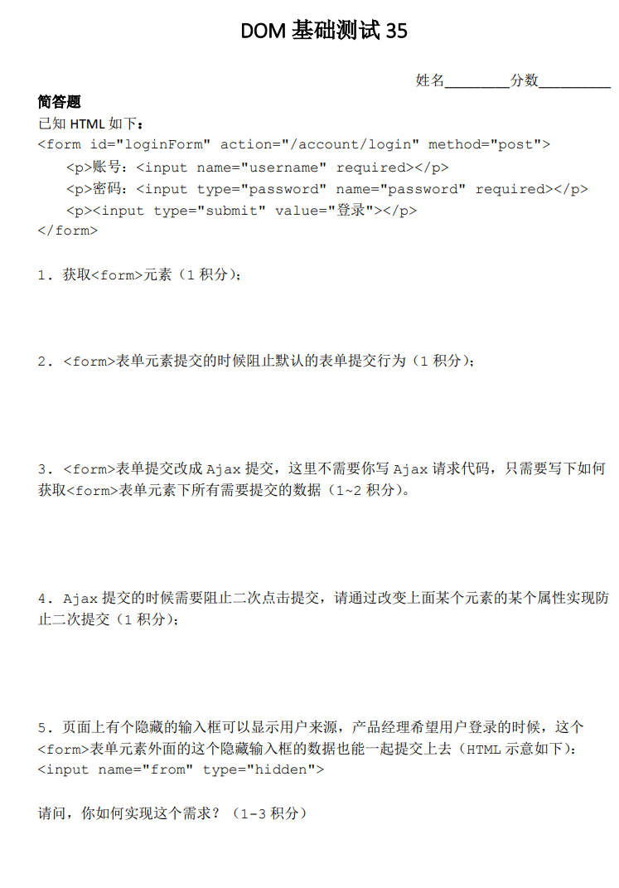
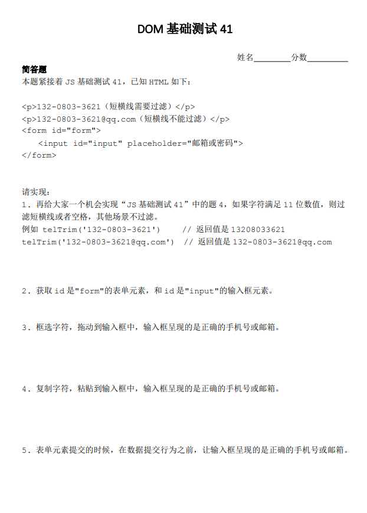

# DOM 测试一


## 具体实现

### 我的解答

```js
// 第一题
document.getElementsByTagName('a')
// 第二题
document.querySelectorAll('a[href]')
// 第三题
// 1)
[...document.querySelectorAll('a[href^="javascript:"]')].forEach((item) => {
  item.setAttribute('role', 'button');
})
// 2)
[...document.querySelectorAll('a[href]')].forEach((item) => {
    if(item.getAttribute('href') !== location.host) {
        item.setAttribute('target', '_blank');
        item.setAttribute('rel', 'external nofollow noopener');
    }
})
// 3)
[...document.querySelectorAll('a[href^="#"]')].forEach((item) => {
    item.setAttribute('rel', 'internal');
})
```

### 最佳解答

```js
// 第一题
document.getElementsByTagName('a')
// 第二题
// 链接元素与 a 的区别
document.querySelectorAll(':link')
// 第三题
// 1)
[].slice.call(document.querySelectorAll(':link')).forEach((item) => {
  if (item.href.startsWith('javascript:')) {
    item.setAttribute('role', 'button');
  }
  if (item.host === location.host) {
    item.setAttribute('target', '_blank');
    // 包含，不是设置
    item.relList.add('external', 'nofollow', 'noopener');
  }
  // 这里不能用 item.href，会带有 http
  if (item.getAttribute('href').startsWith('#')) {
    item.setAttribute('rel', 'internal');
  }
})
```

## 实现要点

1. 获取所有 a 元素，两种方法：document.getElementsByTagName('a') 所有浏览器都支持，还有 document.querySeletorAll('a')，IE8+。
2. 答案是：document.links 或者 document.querySelectorAll(':link')都是可以的。链接元素和`<a>`元素的区别：首先没有 href 属性的`<a>`元素不是链接元素，其次链接元素还包括`<area>`元素（带 href）。`document.querySelectorAll('[href]')`的问题在于，普通元素设置 href 属性也能获取。
3. NodeList 直接 forEach IE 浏览器不支持，Chrome、Firefox 也是最近几年才支持。需要转换成数组，使用[].slice.call(links)，IE9+支持的。ES6 `[...aLink]`，Arrar.from((links)转数组（其实没必要，因为支持 ES6 也就支持 NodeList 直接 forEach）。如有要兼容 IE8，那就是 for 循环。
4. startsWith 可以关注下，字符串前匹配。
5. 链接地址和当前地址栏地址 host 匹配，eleLink.host == location.host。链接元素天然自带：host（包括端口）, hostname, hash 等属性，和 location 对象一样。不要使用 hostname 有 bug，端口不一也会匹配，例如：`<a href="//www.xxxx.com:80">`和 URL //www.xxxx.com:90 会认为是一个域下，实际上不是的。
6. rel 属性值包含。就是不覆盖原来设置的 rel 属性值。需要用到 relList，需要注意的是多个 rel 属性值赋值需要使用 relList 的 add 方法，而不是直接等于。直接等于不是赋值多个，而是一个，例如：element.relList = ['external', 'nofollow', 'noopener']，最后结果是`<a href rel="external,nofollow,noopener">`是不合法的，应该空格分隔。正确用法（出题本意）：link.relList.add('external', 'nofollow', 'noopener')。relList 和 classList API 细节都是一样的，只不过一个针对 class 属性，一个是 rel 属性。
7. link.href.indexOf('#') > -1 有 bug，例如 href="//otherdomain.com#xxxx"，还有一种/^#/.test(link.href)也是有 bug 的，因为 href 属性通过 DOM 对象直接获取是带有域名的，需要匹配 getAttribute 获取的 href 属性值，也就是这里可以/^#/.test(link.getAttribute('href'))

# DOM 测试二


## 具体实现

### 我的解答

```js
//第一题
const div = document.createElement('div');
div.style.width = '300px';
div.style.height = '150px';
document.body.appendChild(div);
//第二题
div.style.background = 'linear-gradient(to bottom right, red, blue);';
//第三题
let start = null;
requestAnimationFrame((timestamp) => {
  if (!start) {
    start = timestamp;
  }
  let progress = timestamp - start;
  if (progress > 1000) {
    return;
  }
  div.style.background = 'linear-gradient(to bottom right, red, blue);';
  div.style.background = 'linear-gradient(to bottom right, blue, red);';
});
```

### 最佳解答

<iframe src="/examples/dom-practice/2-1.html" width="400" height="100"></iframe>

`embed:dom-practice/2-1.html`

## 实现要点

1. 通常我们使用 JS 给 DOM 元素设置 style 样式的时候，不通过改变 style 属性值，因为容器覆盖以前的样式，然后.style.xxx 这样的方式不会有性能问题，即使有很多行，因为浏览器它会自动合并成一次解析。
2. to bottom right，这样无论宽高比例是多少都没有问题。没有 to 就是从右下方开始。
3. CSS 渐变本质上是 backgroundImage，是无法 transition 或者 animation 的，但可以使用 JS。seasonley 的方法就是大多数人实现的合集，非常感谢。但是非常遗憾，虽然花了很多功夫，但是对于复杂色值，其颜色变化可能并不是最舒服的那种，可能就像早期的 Safari 色值变化，而且如果有 Alpha 透明度变化，就很困难了。
4. XboxYan 的方法比较接近：我们可以借助 animation 或者 transition 本身的颜色变化来赋值，实现更简单，更准确，更接近原生的 backgroundImage 色值变化效果。我写的小 demo：https://output.jsbin.com/hojesabawe
5. 颜色转换的技巧。任意颜色转换为 RGB(A)色值，给 DOM 元素赋值，然后使用 getComputedStyle()获取。举个例子，请把色值 skyblue 转换成 RGB 色值，div.style.color = 'skyblue'; getComputedStyle(div).color -> RGB 色值，所有浏览器都是这样的，包括 IE。

# DOM 测试三


## 具体实现

### 我的解答

<iframe src="/examples/dom-practice/3-1.html" width="400" height="100"></iframe>

`embed:dom-practice/3-1.html`

### 最佳解答

<iframe src="/examples/dom-practice/3-2.html" width="400" height="100"></iframe>

`embed:dom-practice/3-2.html`

## 实现要点

1. 直接快速滑动是不应该选中的，在手机端，会和滚动交互冲突。
2. 移动端长按网页会弹出默认菜单，取消方法：https://codepen.io/wingmeng/pen/PvymKN
3. wingmeng 的碰撞检测没有问题。
4. createDocumentFragment 片段创建提高性能，requestAnimationFrame 提高绘制性能，缓存 box 位置，resize 的时候无需重新获取，提高性能。Seasonley 是一个比较关注性能的伙伴。
5. 三人行，必有我师。longclick 的检测，我们以前全部都使用 setTimeout，XboxYan 使用了一个 transition 检测，配合 transitionend 回调。这种方法很巧妙，也有一个优点，我们无需 clearTimeout 这样的操作，浏览器帮我执行了取消检测。也不是完全完美，移动端还需要多多检测下。
6. 移动和 PC 可以统一使用方法，不同设备下 mousedown/touchstart, mousemove/touchmove, mouseup/touchend，通过判断处理。判断是否是移动设备直接：'ontouchstart' in document.body 。同时 document.addEventListener('mouseup', handleup);document.addEventListener('touchend', handleup);这样是有问题的，因为会重复触发 handleup。
7. 碰撞检测比较好理解的算法。A 盒子最左边比 B 最左边小，或 A 盒子最右边比 B 最右边大，或上小，下大，再整体取非。

# DOM 测试四



## 具体实现

### 我的解答

```js
//第一题
document.querySelector('#loginForm');
//第二题
e.preventDefault();
//第三题
[].slice.call(document.querySelectorAll('#loginForm input')).map((item) => item.value)
//第四题
//通过登录按钮disabled实现
//第五题
[].slice.call(document.querySelectorAll('#loginForm input')).concat(document.querySelector('input[name=from]')).map((item) => item.value)
```

## 实现要点

```js
//第一题
document.getElementById('loginForm'); // 方法1：经典的 id 选择器
document.querySelector('#loginForm'); // 方法2：万能的 querySelector
document.forms.loginForm; // 方法3：表单原生方法，还可以写作：document.forms['loginForm']
loginForm; // 方法4：标签的 id 可以直接当变量来用
//第二题
loginForm.addEventListener('submit', function(event) {
  event.preventDefault();
  // 其他操作...
});
//第三题
new FormData(loginForm) // IE10+
//第四题
setAttribute('disabled', '')或者loginForm.querySelector('[type="submit"]').disabled = true;
//第五题
<input name="from" type="hidden" form="loginForm"> // IE10+
```

# DOM 测试五


## 具体实现

### 我的解答

```js
//第一题
const element = document.querySelector('textarea');
//第二题
element.rows = 5;
//第三题
element.clientHeight;
//第四题
//第五题
```

### 最佳解答

```js
//第一题
const element = document.querySelector('textarea');
//第二题
element.rows = 5;
//第三题
// 用 clientHeight  获取会包含 padding，所以用下面方法获取计算样式来得到高度
const { height } = window.getComputedStyle(myTextarea);
console.log(height); // Chrome: 75px, FF: 112px
//第四题
// textarea 默认的 lineHeight 值为 normal，此时是无法计算的，而且每个浏览器解析出的 normal 数值存在差异，另外它的值还和字体有关。详情
// 所以想要实现题目中的要求的话，有个大前提就是必须通过 CSS Reset 的方式对 textarea 的行高进行预定义，我这里采用了 Normalize.css 中的相关样式：
// textarea {line-height: 1.15;}
// 然后就可以正常获取行高进行后续计算了：
const { lineHeight } = window.getComputedStyle(myTextarea);
myTextarea.style.height = parseFloat(lineHeight) * myTextarea.rows + 'px';
//第五题
document.addEventListener('DOMNodeInserted', function(event) {
  var elm = event.target;
  if (elm.nodeName.toLowerCase() === 'textarea') {
    var lineHt = window.getComputedStyle(elm).lineHeight;
    elm.style.height = parseFloat(lineHt) * elm.rows + 'px';
  }
});
```

## 实现要点

1. document.querySelector;
2. myTextarea.rows = 5;
3. window.getComputedStyle(myTextarea).height
4. IE 下 textarea 的高度不是行高决定的，而是 font-size 和 font-family。
5. DOMNodeInserted(DOM level 3, IE9+)以及 MutationObserver(DOM level 4 IE11+)。前者不是异步的，所以如果有大量的 DOM 变化和事件处理，性能影响会很明显，MutationObserver 则是异步的，先观察，然后一次性处理。

   ```js
   document.addEventListener('DOMNodeInserted', function(event) {
     if (event.target.nodeName.toLowerCase() === 'textarea') {
       //...
     }
   });
   ```

# DOM 测试六


## 具体实现

### 我的解答

```js
// 第一题
const dialog = document.createElement('dialog');
document.body.appendChild(dialog);
// 第二题
dialog.open = 'fff';
// 第三题
const button = document.createElement('button');
button.onclick = function() {
  dialog.close();
};
dialog.appendChild(button);
// 第四题
// 第五题
```

### 最佳解答

```js
// 第一题
const dialog = document.createElement('dialog');
document.body.appendChild(dialog);
// 第二题
// 方法1：
dialog.open = true; // 或其他为“真值”的基本类型，如 1，"abc" 等
// 方法2：
dialog.show();
// 方法3：
dialog.showModal();
// 第三题
const btn = document.createElement('button');
btn.innerText = 'close';
btn.addEventListener('click', () => {
  // 方法1：
  dialog.open = false; // 或其他“非真”的基本类型，如 0、null 等
  // 方法2：
  dialog.close();
});
dialog.appendChild(btn);
// 第四题
// 用 showModal 方法即可让打开的 dialog 自带遮罩，在 CSS 里可通过 ::backdrop 设置遮罩层样式
dialog.showModal();
// 第五题
// 思路：如果是 showModal() 方法打开的 dialog，则其覆盖层级默认是置顶的；而通过 show() 方法或 open 属性打开的 dialog，其覆盖层级遵循“后来居上”原则，所以需要手动调整其 z-index 值来使其覆盖层级置顶。
(function(dialogElm) {
  if (!dialogElm) return;

  const proto = dialogElm.prototype;
  const oldShow = proto.show;
  const dialogBaseLevel = 100; // 对话框弹层的基准层级（根据项目zIndex规范合理设置）
  const getMaxZIndex = () => {
    const dialogs = document.querySelectorAll('dialog[open]');
    const maxZIndex = Math.max.apply(
      null,
      [...dialogs].map((it) => it.style.zIndex || Number(window.getComputedStyle(it).zIndex) || dialogBaseLevel)
    );

    return maxZIndex;
  };
  const setMaxZIndex = (el) => (el.style.zIndex = getMaxZIndex() + 1);

  // 重写 show 方法
  proto.show = function() {
    setMaxZIndex(this);
    oldShow.call(this);
  };

  // "劫持" open 属性
  Object.defineProperty(proto, 'open', {
    set: function(value) {
      const isOpen = Boolean(isNaN(value) ? value : Number(value));
      this[isOpen ? 'show' : 'close']();
    }
  });
})(window.HTMLDialogElement);
```

## 实现要点

1. createElement 的时候，里面的标签名称是不区分大小写的。appendChild 这里也可以使用 append 这个 API，新 API，IE 不支持，如果是 HTML 字符串，会自动转义为安全的纯本文。
2. 如果直接.open，则根据值是否 == true/false 判断是否弹框显示；如果是 setAttribute 方法，则任意字符串和值。
3. `<dialog>`关闭使用.close()方法。
4. dialog.showModal()自带本透明蒙层。如果我们想要修改透明度，可以使用::backdrop 伪元素进行设置。
5. showModal 时后弹框层级就是最高，其他元素设置再高的 z-index 值都无效。但是 show()显示的就不一样了，我们需要动态计算处理，原理：遍历所有 dialog 再把最大的 zindex 加 1。

# DOM 测试七


## 具体实现

### 我的解答

```js
// 第一题
document.querySelector('#list').addEventListener('click', function(e) {
  if (e.target.tagName === 'LI') {
    [].slice.apply(document.querySelectorAll('#list li')).forEach(function(item) {
      item.classList.remove('selected');
    });
    document.querySelector('#input').value = e.target.innerText;
    e.target.classList.add('selected');
  }
});
// 第二题
document.addEventListener('keydown', function(e) {
  var li = [].slice.apply(document.querySelectorAll('#list li'));
  var selectedIndex = 0;
  li.forEach(function(item, index) {
    if ([].slice.apply(item.classList).indexOf('selected') !== -1) {
      item.classList.remove('selected');
      selectedIndex = index + 1;
    }
  });
  if (e && e.keyCode === 38) {
    const index = (selectedIndex - 1) % (li.length + 1);
    let realIndex = index;
    if (index === -1 || index === 0) {
      realIndex = li.length;
    }
    document.querySelector('#list li:nth-child(' + realIndex + ')').click();
  }
  if (e && e.keyCode === 40) {
    console.log(selectedIndex);
    const index = (selectedIndex + 1) % (li.length + 1);
    const realIndex = index === 0 ? 1 : index;
    document.querySelector('#list li:nth-child(' + realIndex + ')').click();
  }
});
```

## 实现要点

1. 点击事件绑定在 #list 列表容器上是更合适的，两点原因：
1. 开销更小；
2. 更健壮，不要担心里面 li 列表的动态变化（包括刷新更新）。
2. 判断索引是否匹配再进行样式控制是符合人类逻辑的直觉认知的一种方式（因为现实世界重复做一件事情的成本是很高的），但是在程序代码里面并不是最好的实现。逻辑更清晰的实现：选中 .selected 元素并移除（不管是不是点击元素自身），点击元素添加.selected。牺牲不值一提的执行成本，降低逻辑复杂度。意义在于，执行成本是计算机的，逻辑复杂度是给人看的。最终目的都是人更轻松，计算机累一点。
3. 键盘事件在实际开发时候，由于这种列表，都是使用 keydown 事件，不是 keyup。
4. 事件建议绑定在 `<input>` 元素上，全局上下键绑定是会有问题，会和浏览器上下键微调页面滚动高度冲突。
5. input.setAttribute('autocomplete', 'off'); 然后设置 event.preventDefault();
6. event.key 对比 event.keyCode，如果不考虑兼容 IE8 这样的老 IE 浏览器，推荐使用 event.key，键盘是千奇百怪的，操作系统也是多样的，event.keyCode 值会有较大出入（常规键都是一样的），使用 event.key 更保险一点（虽然也不是完全 100% 兼容），也更好记忆。

# DOM 测试八



## 具体实现

### 我的解答

```js
// 第一题
function telTrim(strTel) {
  return (strTel.match(/[0-9]/g).length === 11 && strTel.replace(/[-\s]/g, '')) || strTel;
}
telTrim('132-0803-3621');
telTrim('132-0803-3621@qq.com');
// 第二题
document.querySelector('#form');
document.querySelector('#input');
// 第三题
// 第四题
// 第五题
document.querySelector('#form').addEventListener('submit', function(e) {
  e && e.preventDefault();
  var input = document.querySelector('#input');
  var value = input.value;
  input.value = telTrim(value);
});
```

### 最佳解答

```js
// 第一题
function telTrim(strTel) {
  return (strTel.match(/[0-9]/g).length === 11 && strTel.replace(/[-\s]/g, '')) || strTel;
}
telTrim('132-0803-3621');
telTrim('132-0803-3621@qq.com');
// 第二题
document.querySelector('#form');
document.querySelector('#input');
// 第三题
// 方法一
document.querySelector('#input').addEventListener('input', function(e) {
  if (e.inputType === 'insertFromDrop') {
    e.target.value = telTrim(e.target.value);
  }
});
// 方法二
document.querySelector('#input').addEventListener('drop', function(e) {
  if (e.target.value.length !== 0) {
    return;
  }
  e.preventDefault();
  var text = e.dataTransfer.getData('text');
  e.target.value = telTrim(text);
});
// 方法三
var dragText = '';
window.addEventListener('dragstart', function(event) {
  //copy from https://www.zhangxinxu.com/study/201104/get-selection-text.html
  var userSelection, text;
  if (window.getSelection) {
    //现代浏览器
    userSelection = window.getSelection();
  } else if (document.selection) {
    //IE浏览器 考虑到Opera，应该放在后面
    userSelection = document.selection.createRange();
  }
  if (!(text = userSelection.text)) {
    text = userSelection;
  }
  dragText = text.toString();
});
input.addEventListener('drop', function(e) {
  e.preventDefault();
  this.value = telTrim(dragText);
});
// 第四题
// 方法一
document.querySelector('#input').addEventListener('input', function(e) {
  if (e.inputType === 'insertFromPaste') {
    e.target.value = telTrim(e.target.value);
  }
});
// 方法二
// 获取剪贴板数据方法
function getClipboardText(event) {
  var clipboardData = event.clipboardData || window.clipboardData;
  return clipboardData.getData('text');
}
document.querySelector('#input').addEventListener('paste', function(e) {
  e.preventDefault();
  // 默认原始输入框为空
  var txt = getClipboardText(e);
  // console.log(txt);
  var newTxt = telTrim(txt);
  document.execCommand('insertText', false, newTxt);
});
// 第五题
document.querySelector('#form').addEventListener('submit', (e) => {
  e && e.preventDefault();
  var input = document.querySelector('#input');
  var value = input.value;
  input.value = telTrim(value);
});
```

## 实现要点

1. dataTransfer.getData 替换是没问题的，但是需要判断，字符为空，有值的时候不应该直接替换（例如 livetune 的实现）。
2. 插值的处理，拖进来的东西，直接就是替换好的，同时又不会替换之前的值。1. 有人通过获取框选位置，进行替换拼接。2. 是使用 document.execCommand 插入（ylfeng250 粘贴那里）。3. 我认为比较好的实现，直接改变拖拽数据或者粘贴数据，在'dragstart'事件中（dataTransfer.setData 以及 clipboardData.setData）。
3. 有人使用了定时器，但是体验并不好，会闪一下。
4. 还有一种更容易理解的简单方法，也是看了大家的回答才知道一个新特性，InputEvent.inputType，值包括 insertText, deleteContentBackward, insertFromPaste, insertFromDrop 以及 formatBold。但是 IE 并不支持，慎用。可参考 ziven27 实现。
5. 最后一题，先 preventDefault，再过滤，再提交。在表单提交中，写在最后的 return true 是没有意义的。
6. event.clipboardData || window.clipboardData 是比较好的书写，可以兼容 IE 浏览器。
