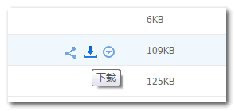
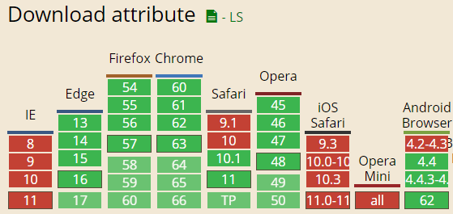

# 简介

首先看下面这种截图：



如果我们想实现点击上面的下载按钮下载一张图片，你会如何实现？

我们可能会想到一个最简单的方法，就是直接按钮a标签链接一张图片，类似下面这样：

```html
<a href="large.jpg">下载</a>
```

但是，想法虽好，实际效果却不是我们想要的，因为浏览器可以直接浏览图片，因此，我们点击下面的“下载”链接，并是不下载图片，而是在新窗口直接浏览图片。

于是，基本上，目前的实现都是放弃HTML策略，而是使用，例如php这样的后端语言，通过告知浏览器header信息，来实现下载。

```js
header('Content-type: image/jpeg'); 
header("Content-Disposition: attachment; filename='download.jpg'"); 
```

然而，这种前后端都要操心的方式神烦，现在都流行前后端分离，还搅在一起太累了，感觉不会再爱了。

那有没有什么只需要前端动动指头就能实现下载的方式呢？有，就是本文要介绍的download属性。

例如，我们希望点击“下载”链接下载图片而不是浏览，直接增加一个download属性就可以：

```html
<a href="large.jpg" download>下载</a>
```

结果在Chrome浏览器下（FireFox浏览器因为跨域限制无效）：


不仅如此，我们还可以指定下载图片的文件名：

```js
<a href="index_logo.gif" download="_5332_.gif">下载</a>
```

如果后缀名一样，我们还可以缺省，直接文件名：

```js
<a href="index_logo.gif" download="_5332_">下载</a>
```


# 浏览器兼容性和跨域策略



然而，caniuse展示的兼容性不是很准确，主要表现在跨域策略的处理上，由于我手上没有IE13，所以，只能对比Chrome浏览器和FireFox浏览器：

如果需要下载的资源是跨域的，包括跨子域，在Chrome浏览器下，使用download属性是可以下载的，但是，并不能重置下载的文件的命名；而FireFox浏览器下，则download属性是无效的，也就是FireFox浏览器无论如何都不支持跨域资源的download属性下载。

而如果资源是同域名的，则两个浏览器都是畅通无阻的下载，不会出现下载变浏览的情况。


## 是否支持download属性的监测

要监测当前浏览器是否支持download属性，一行JS代码就可以了，如下：

```js
var isSupportDownload = 'download' in document.createElement('a');
```

# 总结

除了图片资源，我们还可以是PDF资源，或者txt资源等等。尤其Chrome等浏览器可以直接打开PDF文件，使得此文件格式需要download处理的场景越来越普遍。

此HTML属性虽然非常实用和方便，但是兼容性制约了我们的大规模应用。

同时考虑到很多时候，需要进行一些下载的统计，纯前端的方式想要保存下载量数据，还是有些吃紧，需要跟开发的同学配合才行，还不如使用传统方法。

所以，download属性的未来前景在哪里？当下是否可以直接加入到实际项目？还需要我们一起好好想想。其实使用JS实现download属性的polyfill并不难，但是，考虑到为何不所有浏览器都使用polyfill的方法，又觉得为了技术而技术是不太妥当的。

如果是需要用JS触发下载，见下一篇文章[使用JS让文本字符串作为html或JSON文件下载](/js-text-string-download-as-html-json-file/)