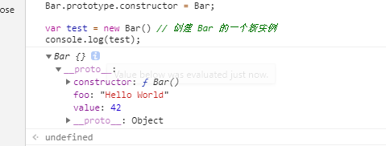

# 构造函数

constructor 返回创建实例对象时构造函数的引用，此属性的值是对函数本身的引用，而不是一个包含函数名称的字符串

```js
function Parent(age) {
    this.age = age;
}

var p = new Parent(50);
p.constructor === Parent; // true
p.constructor === Object; // false
```

构造函数本身就是一个函数，与普通函数没有任何区别，不过为了规范一般将其首字母大写。构造函数和普通函数的区别在于，使用 new 生成实例的函数就是构造函数，直接调用的就是普通函数。

那是不是意味着普通函数创建的实例没有 constructor 属性呢？不一定。

```js
// 普通函数
function parent2(age) {
    this.age = age;
}
var p2 = parent2(50);
// undefined

// 普通函数
function parent3(age) {
    return {
        age: age
    }
}
var p3 = parent3(50);
p3.constructor === Object; // true
p3.constructor === Object.prototype.constructor // true
```

## Symbol的构造函数

Symbol 是基本数据类型，但作为构造函数来说它并不完整，因为它不支持语法 new Symbol()，Chrome 认为其不是构造函数，如果要生成实例直接使用 Symbol()

```js
new Symbol(123); // Symbol is not a constructor 

Symbol(123); // Symbol(123)
```

虽然是基本数据类型，但 Symbol(123) 实例可以获取 constructor 属性值

```js
var sym = Symbol(123); 
console.log( sym );
// Symbol(123)

console.log( sym.constructor );
// ƒ Symbol() { [native code] }
```

这里的 constructor 属性来自哪里？其实是 Symbol 原型上的，即 Symbol.prototype.constructor 返回创建实例原型的函数， 默认为 Symbol 函数。

## constructor 只读？

对于引用类型来说 constructor 属性值是可以修改的，但是对于基本类型来说是只读的

```js
function Foo() {
    this.value = 42;
}
Foo.prototype = {
    method: function() {}
};

function Bar() {}

// 设置 Bar 的 prototype 属性为 Foo 的实例对象
Bar.prototype = new Foo();
Bar.prototype.foo = 'Hello World';

Bar.prototype.constructor === Object; // true

// 修正 Bar.prototype.constructor 为 Bar 本身
// Bar.prototype.constructor = Bar;

var test = new Bar() // 创建 Bar 的一个新实例
console.log(test);
```



对于基本类型来说是只读的，比如 1、“muyiy”、true、Symbol，当然 null 和 undefined 是没有 constructor 属性的。

```js
function Type() { };
var	types = [1, "muyiy", true, Symbol(123)];

for(var i = 0; i < types.length; i++) {
	types[i].constructor = Type;
	types[i] = [ types[i].constructor, types[i] instanceof Type, types[i].toString() ];
};

console.log( types.join("\n") );
// function Number() { [native code] }, false, 1
// function String() { [native code] }, false, muyiy
// function Boolean() { [native code] }, false, true
// function Symbol() { [native code] }, false, Symbol(123)
```

为什么呢？因为创建他们的是只读的原生构造函数（native constructors），这个例子也说明了依赖一个对象的 constructor 属性并不安全。

# 模拟实现 new

```js
function create() {
  // 1、创建一个空的对象
  var obj = new Object(),
  // 2、获得构造函数，同时删除 arguments 中第一个参数
  Con = [].shift.call(arguments);
  // 3、链接到原型，obj 可以访问构造函数原型中的属性
  Object.setPrototypeOf(obj, Con.prototype); // obj.__proto__ = Con.prototype 没有这个效率高
  // 4、绑定 this 实现继承，obj 可以访问到构造函数中的属性
  var ret = Con.apply(obj, arguments);
  // 5、优先返回构造函数返回的对象
  return ret instanceof Object ? ret : obj;
};
```