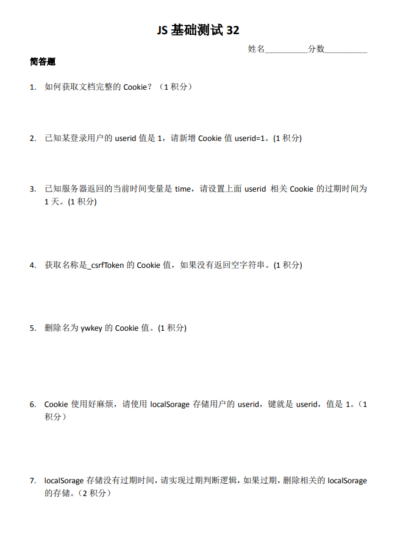

# JS测试一


## 具体实现

### 我的解答

```js
//第一题
4
//第二题
arr.filter((item) => !!item)
//第三题
[1, NaN, empty, NAN]
//第四题
var arr3 = [];
for (var i = 0;i < arr.length; i++) {
  arr3.push(arr[i]);
}
for (var j = 0;j < arr2.length; j++) {
  arr3.push(arr2[i]);
}
//第五题
[...new Set(arr3)]
```

### 最佳解答

```js
//第一题
4
//第二题
arr.filter((item) => true)
// 或者 arr.flat()
//第三题
[1, NaN, empty, NAN]
//第四题
arr.concat(arr2)
//第五题
[...new Set(arr3)]
```

## 实现要点

1. 空数组项也会作为length的一部分；空数组项和空字符串项是有区别的。
2. 第2题，本题只是过滤空数组项，不包括null, undefined这类。
3. 去除空数组项两个比较好的回答：
   1. 数组中的 empty 元素不会参与数组项遍历，故只需返回 true 即可过滤掉 empty 元素（而不会牵连 0、NaN、null、undefined、'' 这些）arr.filter(it => true)。然后补充，但是走for循环，还是会遍历empty数组项。
   2. 或者filter方法参数直接就是一个function即可。例如：~arr.filter(Boolean)~（纠正：不能是Boolean，false会被过滤），arr.filter(Number)， arr.filter(String)
   3. 上面并不是最好的方法。数组有个API，天然去除空数组项，arr.flat()。flat()可以让数组扁平化的方法。
4. 第3题标准答案应该是[1, NaN, NaN]，map里面Function支持参数(value, index, arr)，参见wingmeng的释义。
5. 第4题就是concat，可以数组合并。我自己用“连接猫”记忆这个API。可以分别连接子项，也可以直接连接数组。如果不考虑兼容，可以[...arr, ...arr2]。其他参考方法：Array.prototype.push.apply(arr3, arr2)，也可以[].push.apply(arr3, arr2)，此时arr3是合并后的数组。
6. 数组去重。使用new Set(arr3)，然后把Set对象转换成数组。转数组两个常用方法，一个是Array.from，还有一个是`[...]`。

# JS测试二


## 具体实现

### 我的解答

```js
//第一题
"1"
//第二题
"2"
//第三题
"0.04"
//第四题
"0.04"
//第五题
//不会
```

### 最佳解答

```js
//第一题
"1"
//第二题
"2"
//第三题
"0.04"
//第四题
"0.04"
//第五题
var oldtoFixed = Number.prototype.toFixed
Number.prototype.toFixed = function(digits){
   var length = (parseFloat(this) + '').replace(/^\d+\.?/, '').length;
   var len = length > digits ? length : digits;
   var number = Number(this) + Math.pow(10, -len-1);
   return oldtoFixed.call(number, digits);
}
```

## 实现要点

1. toFixed有两个问题，一是兼容性，二是四舍五入不符合正常的四舍五入认知。金钱计算的时候容易出问题，必须两位小数。
2. 应该返回字符串；补全末尾的0。
3. 机智是实现：方式一：替换小数点保留精度后面一位5为6，方式二：给小数点保留精度后面补一位小数。其中方式2是最简单的，XboxYan 和 frankyeyq 实现都有bug，下面是调整后的实现。

```js
var oldtoFixed = Number.prototype.toFixed
Number.prototype.toFixed = function(digits){
   var length = (parseFloat(this) + '').replace(/^\d+\.?/, '').length;
   var len = length > digits ? length : digits;
   var number = Number(this) + Math.pow(10, -len-1);
   return oldtoFixed.call(number, digits);
}
```

# JS测试三



## 具体实现

### 我的解答

```js
//第一题
document.cookie
//第二题
document.cookie='userid=1';
//第三题
document.cookie='userid=1;expire=' + new Date(Date.now() + 24 * 3600 * 1000).toGMTString();
//第四题
function getCookie(name){
  var strCookie = document.cookie;
  var arrCookie = strCookie.split("; ");
  for (var i = 0;i < arrCookie.length; i++) {
    var arr = arrCookie[i].split("=");
    if (arr[0] === name) {
      return arr[1];
    }
  }
  return "";
}
getCookie('_csrfToken');
//第五题
document.cookie='ywkey=1;expire=' + new Date(Date.now() - 24 * 3600 * 1000).toGMTString();
//第六题
localStorage.setItem('userid', 1);
//第七题
if (timestamp <= Date.now()) {
  localStorage.removeItem('userid');
}
```

### 最佳解答

```js
//第七题
/**
  * 重写localStorage
  */
function rewriteLocalStorage() {
  if (!window.__rewrite__localStorage) {
    Object.assign(window, {
      __rewrite__localStorage: true,
      __localStorage__setItem: localStorage.setItem,
      __localStorage__getItem: localStorage.getItem,
      __localStorage__removeItem: localStorage.removeItem
    })

    if (!localStorage.__expires) {
      localStorage.__expires = "{}"
    }

    localStorage.setItem = function (key, value, millisecond) {
      if (millisecond) {
        let __expires = JSON.parse(localStorage.__expires)
        __expires[key] = +Date.now() + millisecond
        localStorage.__expires = JSON.stringify(__expires)
      }
      window.__localStorage__setItem.call(this, key, value)
    }

    localStorage.getItem = function (key) {
      window.clearExpires()
      return window.__localStorage__getItem.call(this, key)
    }

    localStorage.removeItem = function (key) {
      let __expires = JSON.parse(localStorage.__expires)
      delete __expires[key]
      localStorage.__expires = JSON.stringify(__expires)
      return window.__localStorage__removeItem.call(this, key)
    }

    window.clearExpires = function () {
      let __expires = JSON.parse(localStorage.__expires)
      for (let key in __expires) {
        if (__expires[key] < Date.now()) {
          localStorage.removeItem(key)
        }
      }
    }
  }
}
/**
  * 销毁重写localStorage
  */
function destoryRewriteLocalStorage() {
  if (window.__rewrite__localStorage) {

    localStorage.setItem = window.__localStorage__setItem

    localStorage.getItem = window.__localStorage__getItem

    localStorage.removeItem = window.__localStorage__removeItem

    delete window.__rewrite__localStorage
    delete window.__localStorage__setItem
    delete window.__localStorage__getItem
    delete window.__localStorage__removeItem
    delete window.clearExpires
    localStorage.removeItem("__expires")
  }
}
```

## 实现要点

1. 通过前端手段设置cookie的过期时间，一定要使用服务器时间，不能使用本地时间。两个原因：一个是和服务端统一；本地时间是不准的，用户可以修改的；
2. 获取cookie方法，一类：字符分隔，数组遍历，查询对应的键值。二类：正则，可以看看Seasonley的实现。
3. ?<指的什么？--- （“(?<=\bsub)\w+\b”定位“sub”后面的字符串）。零宽断言。有兼容性问题，见下面讨论，不推荐实际项目使用。
4. 设置过期时间可以expires，也可以是max-age。区别是什么呢？max-age是更新的过期时间用法，是IE9+浏览器才支持的，更容易理解和记忆。
5. 删除cookie可以设置过期时间为之前。
6. localStorage.setItem('userid', 1)或者简写：localStorage.userid = 1;
7. localStorage过期时间，JSON.stringify和JSON.parse是可读性很不错，也容易维护的实现。
8. 可以看下liyongleihf2006的localStorage重写，隐藏时间过期的细节，非常适合作为小工具，小组件。

# JS测试四


## 具体实现

### 我的解答

```js
// 第一题
content.length <= 140
// 第二题
content.trim().replace(/\s+/g,' ')
// 第三题
Math.ceil([...content.trim().replace(/\s+/g,' ')].map((item) => item.charCodeAt()).join('').length / 2)
// 第四题
// 正则实现
```

### 最佳解答

```js
// 第一题
function testLength(str) {
   return str.length > 140;
}

// 第二题
function testLengthNoSpace(str) {
   return testLength(str.trim().replace(/\s+/g,' '));
}

// 第三题
function testLengthNoASCII(str){
  str = str.trim().replace(/\s+/g,' ');
  let ascLen = 0;
  for (let i = 0; i < str.length; i++) {
    // 小于 128 的是可见字符
    str.charCodeAt(i) < 128 && ascLen++;
  }
  return str.length - Math.floor(ascLen / 2) > 140;
}

// 第四题
function testLengthNoURL(str){
   let placeHolder = Array(21).join(',');
   str = str.trim()
      .replace(/\s+/g,' ')
      // \x21-\x7e 匹配不可见字符
      .replace(/http:\/\/[\x21-\x7e]{13,}?(?=[^\x21-\x7e]|$)/g, placeHolder)
      .replace(/https:\/\/[\x21-\x7e]{12,}?(?=[^\x21-\x7e]|$)/g, placeHolder);
   return testLengthNoASCII(str);
}
```

## 实现要点

1. 空格替换直接trim()方法，以及/\s+/g正则即可；
2. ASCII字符非连续也算半个字符，可以使用`str.match(/[\x00-\xff]/g).length`；
3. 网址优先判断；
4. 替换的字符务必是非ASCII字符（否则会认为是5个字符长度）；
5. 20个ASCII字符长度，可以Array(20).join()或者','.repeat(20)；
