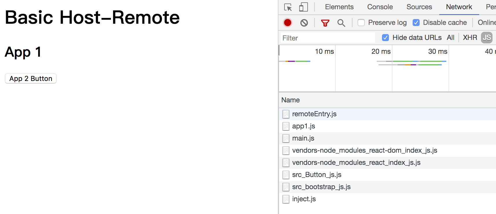

首先了解一下 webpack 的打包原理

# webpack 的打包原理

## chunk 和 module

webpack 里面有两个很核心的概念，叫 chunk 和 module，这里为了简单，只看 js 相关的，用笔者自己的理解去解释一下他们直接的区别：

> module：每一个源码 js 文件其实都可以看成一个 module  
chunk：每一个打包落地的 js 文件其实都是一个 chunk，每个 chunk 都包含很多 module

默认的 chunk 数量实际上是由你的入口文件的 js 数量决定的，但是如果你配置动态加载或者提取公共包的话，也会生成新的 chunk。

## 打包代码解读

有了基本理解后，我们需要去理解 webpack 打包后的代码在浏览器端是如何加载执行的。为此我们准备一个非常简单的 demo，来看一下它的生成文件。

```js
// src
// ---main.js
// ---moduleA.js
// ---moduleB.js
 
/**
* moduleA.js
*/
export default function testA() {
    console.log('this is A');
}
 
/**
* main.js
*/
import testA from './moduleA';
 
testA();
 
import('./moduleB').then(module => {
 
});
```

非常简单，入口 js 是 main.js，里面就是直接引入 moduleA.js，然后动态引入 moduleB.js，那么最终生成的文件就是两个 chunk，分别是:

1. main.js 和 moduleA.js 组成的 bundle.js
2. moduleB.js 组成的 0.bundle.js

如果你了解 webpack 底层原理的话，那你会知道这里是用 mainTemplate 和 chunkTemplate 分别渲染出来的，不了解也没关系，我们继续解读生成的代码

### import 变成了什么样

整个 main.js 的代码打包后是下面这样的

```js
(function (module, __webpack_exports__, __webpack_require__) {
 
    "use strict";
    __webpack_require__.r(__webpack_exports__);
    /* harmony import */
    var _moduleA__WEBPACK_IMPORTED_MODULE_0__ = __webpack_require__( /*!        ./moduleA */ "./src/moduleA.js");
 
    Object(_moduleA__WEBPACK_IMPORTED_MODULE_0__["default"])();
 
    __webpack_require__.e( /*! import() */ 0).then(__webpack_require__.bind(null, /*! ./moduleB             */ "./src/moduleB.js")).then(module => {
 
    });
 
})
```

可以看到，我们的直接 import moduleA 最后会变成 webpack_require，而这个函数是 webpack 打包后的一个核心函数，就是解决依赖引入的。

### webpack_require 是怎么实现的

那我们看一下 webpack_require 它是怎么实现的：

```js
function __webpack_require__(moduleId) {
    // Check if module is in cache
    // 先检查模块是否已经加载过了，如果加载过了直接返回
    if (installedModules[moduleId]) {
        return installedModules[moduleId].exports;
    }
    // Create a new module (and put it into the cache)
    // 如果一个import的模块是第一次加载，那之前必然没有加载过，就会去执行加载过程
    var module = installedModules[moduleId] = {
        i: moduleId,
        l: false,
        exports: {}
    };
    // Execute the module function
    modules[moduleId].call(module.exports, module, module.exports, __webpack_require__);
    // Flag the module as loaded
    module.l = true;
    // Return the exports of the module
    return module.exports;
}
```

如果简化一下它的实现，其实很简单，就是每次 require，先去缓存的 installedModules 这个缓存 map 里面看是否加载过了，如果没有加载过，那就从 modules 这个所有模块的 map 里去加载。

### modules 从哪里来的

那相信很多人都有疑问了，modules 这么个至关重要的 map 是从哪里来的呢，我们把 bundle.js 生成的 js 再简化一下：

```js
(function (modules) {})({
    "./src/main.js": (function (module, __webpack_exports__, __webpack_require__) {}),
    "./src/moduleA.js": (function (module, __webpack_exports__, __webpack_require__) {})
});
```

所以可以看到，这其实是个立即执行函数，modules 就是函数的入参，具体值就是我们包含的所有 module，到此一个 chunk 是如何加载的，以及 chunk 如何包含 module，相信大家一定会有自己的理解了。

### 动态引入如何操作呢

上面的 chunk 就是一个 js 文件，所以维护了自己的局部 modules，然后自己使用没啥问题，但是动态引入我们知道是会生成一个新的 js 文件的，那这个新的 js 文件 0.bundle.js 里面是不是也有自己的 modules 呢？那 bundle.js 如何知道 0.bundle.js 里面的 modules 呢？

先看动态 import 的代码变成了什么样：

```js
__webpack_require__.e( /*! import() */ 0).then(__webpack_require__.bind(null, /*! ./moduleB             */ "./src/moduleB.js")).then(module => {
 
});
```

从代码看，实际上就是外面套了一层 webpck_require.e，然后这是一个 promise，在 then 里面再去执行 webpack_require。

实际上 webpck_require.e 就是去加载 chunk 的 js 文件 0.bundle.js，具体代码就不贴了，没啥特别的。

等到加载回来后它认为 bundle.js 里面的 modules 就一定会有了 0.bundle.js 包含的那些 modules，这是如何做到的呢？

我们看 0.bundle.js 到底是什么内容，让它拥有这样的魔力：

```js
(window["webpackJsonp"] = window["webpackJsonp"] || []).push(
    [
        [0],
        {
            "./src/moduleB.js": (function (module, __webpack_exports__, __webpack_require__) {})
        }
    ]
);
```

拿简化后的代码一看，大家第一眼想到的是 jsonp，但是很遗憾的是它不是一个函数，却只是向一个全局数组里面 push 了自己的模块 id 以及对应的 modules。那看起来魔法的核心应该是在 bundle.js 里面了，事实的确也是如此。

```js
var jsonpArray = window["webpackJsonp"] = window["webpackJsonp"] || [];
var oldJsonpFunction = jsonpArray.push.bind(jsonpArray);
jsonpArray.push = webpackJsonpCallback;
jsonpArray = jsonpArray.slice();
for(var i = 0; i < jsonpArray.length; i++) webpackJsonpCallback(jsonpArray[i]);
var parentJsonpFunction = oldJsonpFunction;
```

在 bundle.js 的里面，我们看到这么一段代码，其实就是说我们劫持了 push 函数，那 0.bundle.js 一旦加载完成，我们岂不是就会执行这里，那不就能拿到所有的参数，然后把 0.bundle.js 里面的所有 module 加到自己的 modules 里面去！

## 总结一下

如果你没有很理解，可以配合下面的图片，再把上面的代码读几遍。


其实简单来说就是，对于 mainChunk 文件，我们维护一个 modules 这样的所有模块 map，并且提供类似 webpack_require 这样的函数。对于 chunkA 文件（可能是因为提取公共代码生成的、或者是动态加载）我们就用类似 jsonp 的方式，让它把自己的所有 modules 添加到主 chunk 的 modules 里面去。

# Module federation

## Module federation 的介绍

允许运行时动态决定代码的引入和加载。

## Module federation 的 demo

我们最关心的还是 Module federation 的实现方式：

[module-federation-examples/basic-host-remote](https://github.com/module-federation/module-federation-examples/tree/master/basic-host-remote)

在此之前，还是需要向大家介绍一下这个 demo 做的事情

```
app1
---index.js 入口文件
---bootstrap.js 启动文件
---App.js react组件
 
app2
---index.js 入口文件
---bootstrap.js 启动文件
---App.js react组件
---Button.js react组件
```

这是文件结构，其实你可以看成是两个独立应用 app1 和 app2，那他们之前有什么爱恨情仇呢？

```js
/** app1 **/
/**
* index.js
**/
import('./bootstrap');
 
/**
* bootstrap.js
**/
import('./bootstrap');
import App from "./App";
import React from "react";
import ReactDOM from "react-dom";
 
ReactDOM.render(<App />, document.getElementById("root"));
 
/**
* App.js
**/
import('./bootstrap');
import React from "react";
 
import RemoteButton from 'app2/Button';
 
const App = () => (
  <div>
    <h1>Basic Host-Remote</h1>
    <h2>App 1</h2>
    <React.Suspense fallback="Loading Button">
      <RemoteButton />
    </React.Suspense>
  </div>
);
 
export default App;
```

我这里只贴了 app1 的 js 代码，app2 的代码你不需要关心。代码没有什么特殊的，只有一点，app1 的 App.js 里面：

```js
import RemoteButton from 'app2/Button';
```

也就是关键来了，跨应用复用代码来了！app1 的代码用了 app2 的代码，但是这个代码最终长什么样？是如何引入 app2 的代码的？

## Module federation 的配置

```js
/**
 * app1/webpack.js
 */
{
    plugins: [
        new ModuleFederationPlugin({
            name: "app1",
            library: {
                type: "var",
                name: "app1"
            },
            remotes: {
                app2: "app2"
            },
            shared: ["react", "react-dom"]
        })
    ]
}
```

这个其实就是 Module federation 的配置了，大概能看到想表达的意思：

1. 用了远程模块 app2，它叫 app2
2. 用了共享模块，它叫 shared

remotes 和 shared 还是有一点区别的，我们先来看效果。

生成的 html 文件：

```html
<html>
  <head>
    <script src="app2/remoteEntry.js"></script>
  </head>
  <body>
    <div id="root"></div>
    <script src="app1/app1.js"></script>
    <script src="app1/main.js"></script>
  </body>
</html>
```

ps：这里的 js 路径有修改，这个是可以配置的，这里只是表明从哪里加载了哪些 js 文件

app1 打包生成的文件：

```
app1/index.html
app1/app1.js
app1/main.js
app1/react.js
app1/react-dom.js
app1/src_bootstrap.js
```

ps: app2 你也需要打包，只是我没有贴 app2 的代码以及配置文件，后面需要的时候会再贴出来的

最终页面表现以及加载的 js：



从上往下加载的 js 时序其实是很有讲究的，后面将会是解密的关键：

```
app2/remoteEntry.js
app1/app1.js
app1/main.js
app1/react.js
app1/react-dom.js
app2/src_button_js.js
app1/src_bootstrap.js
```

这里最需要关注的其实还是每个文件从哪里加载，在不去分析原理之前，看文件加载我们至少有这些结论：

1. remotes 的代码自己不打包，类似 external，例如 app2/button 就是加载 app2 打包的代码
2. shared 的代码自己是有打包的

