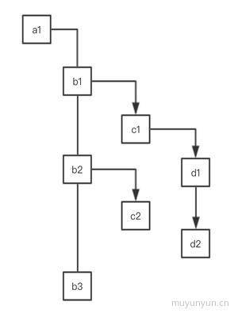
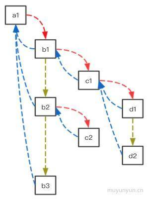

# Fiber 的数据结构

此小节会通过两个 `demo` 来展示 `Stack Reconciler` 以及 `Fiber Reconciler` 的数据结构。



首先用代码表示上图节点间的关系。比如 `a1 节点`下有 `b1、b2、b3 节点`, 就可以把它们间的关系写成 `a1.render = () => [b1, b2, b3]`;

```js
var a1 = { name: 'a1', render = () => [b1, b2, b3] }
var b1 = { name: 'b1', render = () => [c1] }
var b2 = { name: 'b2', render = () => [c2] }
var b3 = { name: 'b3', render = () => [] }
var c1 = { name: 'c1', render = () => [d1] }
var c2 = { name: 'c2', render = () => [] }
var d1 = { name: 'd1', render = () => [d2] }
var d2 = { name: 'd2', render = () => [] }
```

## Stack Reconciler

在 `React 16` 之前，节点之间的关系可以用数据结构中 `树的深度遍历` 来表示。

如下实现 `walk` 函数, 将深度遍历的节点打印出来。

```js
walk(a1);

function walk(instance) {
  if (!instance) return;
  console.log(instance.name);
  instance.render().map(walk);
}
```

输出结果为: `a1 b1 c1 d1 d2 b2 c2 b3`

## Fiber Reconciler

在 `React 16` 中，节点之间的关系可以用数据结构中的 `链表` 来表示。

节点之间的链表有三种情形, 用图表示如下:



1. 父节点到子节点(红色虚线)
2. 同层节点(黄色虚线)
3. 子节点到父节点(蓝色虚线)

> 父节点指向第一个子节点, 每个子节点都指向父节点，同层节点间是单向链表。

首先, 构建节点的数据结构, 如下所示:

```js
var FiberNode = function(instance) {
  this.instance = instance;
  this.parent = null;
  this.sibling = null;
  this.child = null;
};
```

然后创建一个将节点串联起来的 `connect` 函数:

```js
var connect = function(parent, childList) {
  parent.child = childList.reduceRight((prev, current) => {
    const fiberNode = new FiberNode(current);
    fiberNode.parent = parent;
    fiberNode.sibling = prev;
    return fiberNode;
  }, null);

  return parent.child;
};
```

> 在 JavaScript 中实现链表的数据结构可以巧用 reduceRight

`connect` 函数中实现了上述链表关系。可以像这样使用它:

```js
var parent = new FiberNode(a1);
var childFirst = connect(
  parent,
  a1.render()
);
```

这样子便完成了 `a1 节点`指向 `b1 节点`的链表、`b1、b2、b3 节点间`的单向链表以及 `b1、b2、b3 节点`指向 `a1 节点` 的链表。

最后剩下 `goWalk` 函数将全部节点给遍历完。

```js
// 打印日志以及添加列表
var walk = function(node) {
  console.log(node.instance.name);
  const childLists = node.instance.render();
  let child = null;
  if (childLists.length > 0) {
    child = connect(
      node,
      childLists
    );
  }
  return child;
};

var goWalk = function(root) {
  let currentNode = root;

  while (true) {
    const child = walk(currentNode);
    // 如果有子节点
    if (child) {
      currentNode = child;
      continue;
    }

    // 如果没有相邻节点, 则返回到父节点
    while (!currentNode.sibling) {
      currentNode = currentNode.parent;
      if (currentNode === root) {
        return;
      }
    }

    // 相邻节点
    currentNode = currentNode.sibling;
  }
};

// 调用
goWalk(new FiberNode(a1));
```

打印结果为 `a1 b1 c1 d1 d2 b2 c2 b3`

`Fiber` 在一个节点上的执行流程总结如下:

- 在当前节点下寻找是否有子节点
  - 若有, 则进入子节点
  - 若没有, 则在当前节点下寻找是否有下一个相邻节点
    - 若有, 则进入下一个相邻节点
    - 若没有, 则返回它的父节点

# Fiber Reconciler 的优势

通过分析上述两种数据结构实现的代码，可以得出下面结论:

- 基于树的深度遍历实现的 Reconciler: 一旦进入调用栈便无法暂停;
- 基于链表实现的 Reconciler: 在 `while(true) {}` 的循环中, 可以通过 `currentNode` 的赋值重新得到需要操作的节点，而在赋值之前便可以'暂停'来执行其它逻辑, 这也是 `requestIdleCallback` 能得以在 `Fiber Reconciler` 的原因。

# 相关链接

- [The how and why on React’s usage of linked list in Fiber to walk the component’s tree](https://medium.com/react-in-depth/the-how-and-why-on-reacts-usage-of-linked-list-in-fiber-67f1014d0eb7)
- [Fiber Principles: Contributing To Fiber](https://github.com/facebook/react/issues/7942): Fiber 设计思想相关 issue, 推荐。
