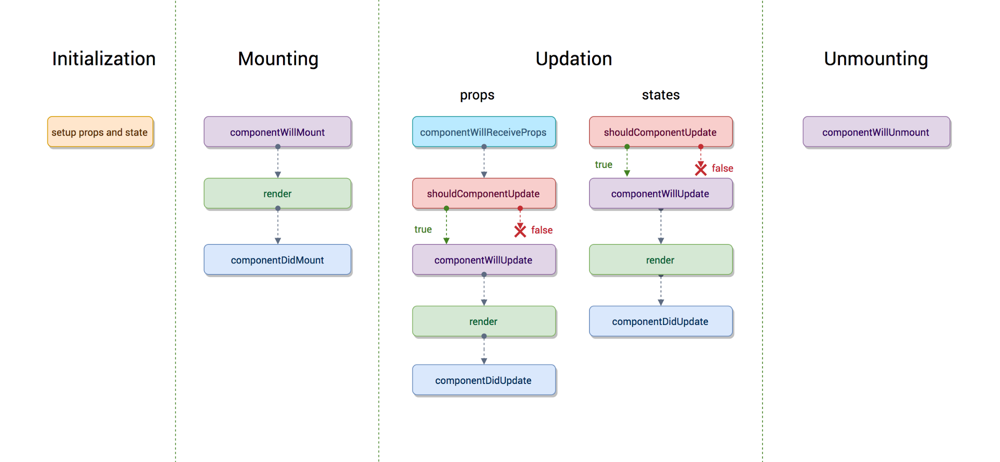
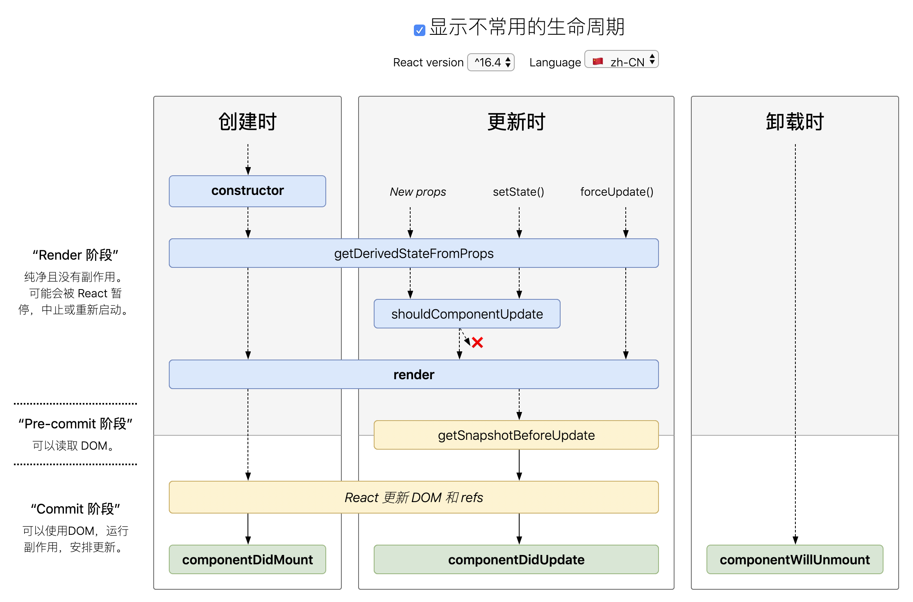

React 生命周期很多人都了解，但通常我们所了解的都是 **单个组件** 的生命周期，但针对 **Hooks 组件、多个关联组件**（父子组件和兄弟组件） 的生命周期又是怎么样的喃？你有思考和了解过吗，接下来我们将完整的了解 React 生命周期。

关于 **组件** ，我们这里指的是 `React.Component` 以及 `React.PureComponent` ，但是否包括 Hooks 组件呢？

# Hooks 组件

**函数组件** 的本质是函数，没有 state 的概念的，因此**不存在生命周期**一说，仅仅是一个 **render 函数**而已。

但是引入 **Hooks** 之后就变得不同了，它能让组件在不使用 class 的情况下使用 state 以及其他的 React 特性，相比与 class 的生命周期概念来说，它更接近于实现状态同步，而不是响应生命周期事件。但我们可以利用 `useState`、 `useEffect()` 和 `useLayoutEffect()` 来模拟实现生命周期。

即：**Hooks 组件更接近于实现状态同步，而不是响应生命周期事件**。

下面，是具体的 生命周期 与 Hooks 的**对应关系**：

- `constructor`：函数组件不需要构造函数，我们可以通过调用 **`useState` 来初始化 state**。如果计算的代价比较昂贵，也可以传一个函数给 `useState`。

  ```js
  const [num, UpdateNum] = useState(0);
  ```

- `getDerivedStateFromProps`：一般情况下，我们不需要使用它，我们可以在**渲染过程中更新 state**，以达到实现 `getDerivedStateFromProps` 的目的。

  ```js
  function ScrollView({ row }) {
    let [isScrollingDown, setIsScrollingDown] = useState(false);
    let [prevRow, setPrevRow] = useState(null);

    if (row !== prevRow) {
      // Row 自上次渲染以来发生过改变。更新 isScrollingDown。
      setIsScrollingDown(prevRow !== null && row > prevRow);
      setPrevRow(row);
    }

    return `Scrolling down: ${isScrollingDown}`;
  }
  ```

  React 会立即退出第一次渲染并用更新后的 state 重新运行组件以避免耗费太多性能。

- `shouldComponentUpdate`：可以用 **`React.memo`** 包裹一个组件来对它的 `props` 进行浅比较

  ```js
  const Button = React.memo((props) => {
    // 具体的组件
  });
  ```

  注意：**`React.memo` 等效于 `PureComponent`**，它只浅比较 props。这里也可以使用 `useMemo` 优化每一个节点。

- `render`：这是函数组件体本身。
- `componentDidMount`, `componentDidUpdate`： `useLayoutEffect` 与它们两的调用阶段是一样的。但是，我们推荐你**一开始先用 useEffect**，只有当它出问题的时候再尝试使用 `useLayoutEffect`。`useEffect` 可以表达所有这些的组合。

  ```js
  // componentDidMount
  useEffect(() => {
    // 需要在 componentDidMount 执行的内容
  }, []);

  useEffect(() => {
    // 在 componentDidMount，以及 count 更改时 componentDidUpdate 执行的内容
    document.title = `You clicked ${count} times`;
    return () => {
      // 需要在 count 更改时 componentDidUpdate（先于 document.title = ... 执行，遵守先清理后更新）
      // 以及 componentWillUnmount 执行的内容
    }; // 当函数中 Cleanup 函数会按照在代码中定义的顺序先后执行，与函数本身的特性无关
  }, [count]); // 仅在 count 更改时更新
  ```

  **请记得 React 会等待浏览器完成画面渲染之后才会延迟调用 `useEffect`，因此会使得额外操作很方便**

- `componentWillUnmount`：相当于 `useEffect` 里面返回的 `cleanup` 函数

  ```js
  // componentDidMount/componentWillUnmount
  useEffect(() => {
    // 需要在 componentDidMount 执行的内容
    return function cleanup() {
      // 需要在 componentWillUnmount 执行的内容
    };
  }, []);
  ```

- `componentDidCatch` and `getDerivedStateFromError`：目前**还没有**这些方法的 Hook 等价写法，但很快会加上。

为方便记忆，大致汇总成表格如下。

| class 组件               | Hooks 组件                |
| ------------------------ | ------------------------- |
| constructor              | useState                  |
| getDerivedStateFromProps | useState 里面 update 函数 |
| shouldComponentUpdate    | useMemo                   |
| render                   | 函数本身                  |
| componentDidMount        | useEffect                 |
| componentDidUpdate       | useEffect                 |
| componentWillUnmount     | useEffect 里面返回的函数  |
| componentDidCatch        | 无                        |
| getDerivedStateFromError | 无                        |

# 单个组件的生命周期

## 生命周期

### V16.3 之前

我们可以将生命周期分为三个阶段：

- 挂载阶段
- 组件更新阶段
- 卸载阶段

分开来讲：

1. 挂载阶段

- `constructor`：避免将 props 的值复制给 state
- `componentWillMount`
- `render`：react 最重要的步骤，创建虚拟 dom，进行 diff 算法，更新 dom 树都在此进行
- `componentDidMount`

2. 组件更新阶段

- `componentWillReceiveProps`
- `shouldComponentUpdate`
- `componentWillUpdate`
- `render`
- `componentDidUpdate`

3. 卸载阶段

- `componentWillUnMount`



这种生命周期会存在一个问题，那就是当更新复杂组件的最上层组件时，调用栈会很长，如果在进行复杂的操作时，就可能长时间阻塞主线程，带来不好的用户体验，**Fiber** 就是为了解决该问题而生。

### V16.3 之后

**Fiber 本质上是一个虚拟的堆栈帧，新的调度器会按照优先级自由调度这些帧，从而将之前的同步渲染改成了异步渲染，在不影响体验的情况下去分段计算更新。**

对于异步渲染，分为两阶段：

- `reconciliation`：
   - `componentWillMount`
   - `componentWillReceiveProps`
   - `shouldConmponentUpdate`
   - `componentWillUpdate`
- `commit`
   - `componentDidMount`
   - `componentDidUpdate`

其中，`reconciliation` 阶段是可以被打断的，所以 `reconcilation` 阶段执行的函数就会出现多次调用的情况，显然，这是不合理的。

所以 V16.3 引入了新的 API 来解决这个问题：

1. `static getDerivedStateFromProps`： 该函数在**挂载阶段和组件更新阶段**都会执行，即**每次获取新的`props` 或 `state` 之后都会被执行**，**在挂载阶段用来代替`componentWillMount`**；在组件更新阶段配合 `componentDidUpdate`，可以覆盖 `componentWillReceiveProps` 的所有用法。

   同时它是一个静态函数，所以函数体内不能访问 `this`，会根据 `nextProps` 和 `prevState` 计算出预期的状态改变，返回结果会被送给 `setState`**，**返回 `null` 则说明不需要更新 `state`，并且这个返回是**必须的**。

2. `getSnapshotBeforeUpdate`: 该函数会在 **`render` 之后， DOM 更新前**被调用，用于读取最新的 DOM 数据。

   返回一个值，**作为 `componentDidUpdate` 的第三个参数**；配合 `componentDidUpdate`, 可以覆盖`componentWillUpdate` 的所有用法。

注意：V16.3 中只用在组件挂载或组件 `props` 更新过程才会调用，即如果是因为自身 setState 引发或者 forceUpdate 引发，而不是由父组件引发的话，那么`static getDerivedStateFromProps`也不会被调用，在 V16.4 中更正为都调用。

即更新后的生命周期为：

1. 挂载阶段

- `constructor`
- `static getDerivedStateFromProps`
- `render`
- `componentDidMount`

2. 更新阶段

- `static getDerivedStateFromProps`
- `shouldComponentUpdate`
- `render`
- `getSnapshotBeforeUpdate`
- `componentDidUpdate`

3. 卸载阶段

- `componentWillUnmount`



### 生命周期，误区

**误解一：**`getDerivedStateFromProps` 和 `componentWillReceiveProps` 只会在 `props` **改变** 时才会调用

实际上，**只要父级重新渲染，`getDerivedStateFromProps` 和 `componentWillReceiveProps` 都会重新调用，不管 `props` 有没有变化**。所以，在这两个方法内直接将 props 赋值到 state 是不安全的。

```js
// 子组件
class PhoneInput extends Component {
  state = { phone: this.props.phone };

  handleChange = (e) => {
    this.setState({ phone: e.target.value });
  };

  render() {
    const { phone } = this.state;
    return <input onChange={this.handleChange} value={phone} />;
  }

  componentWillReceiveProps(nextProps) {
    // 不要这样做。
    // 这会覆盖掉之前所有的组件内 state 更新！
    this.setState({ phone: nextProps.phone });
  }
}

// 父组件
class App extends Component {
  constructor() {
    super();
    this.state = {
      count: 0
    };
  }

  componentDidMount() {
    // 使用了 setInterval，
    // 每秒钟都会更新一下 state.count
    // 这将导致 App 每秒钟重新渲染一次
    this.interval = setInterval(
      () =>
        this.setState((prevState) => ({
          count: prevState.count + 1
        })),
      1000
    );
  }

  componentWillUnmount() {
    clearInterval(this.interval);
  }

  render() {
    return (
      <>
        <p>Start editing to see some magic happen :)</p>
        <PhoneInput phone='call me!' />
        <p>
          This component will re-render every second. Each time it renders, the text you type will be reset. This
          illustrates a derived state anti-pattern.
        </p>
      </>
    );
  }
}
```

[实例可点击这里查看](https://stackblitz.com/edit/react-yammav)

当然，我们可以在 父组件 App 中 `shouldComponentUpdate` 比较 props 的 email 是不是修改再决定要不要重新渲染，但是如果子组件接受多个 props（较为复杂），就很难处理，而且 `shouldComponentUpdate` 主要是用来性能提升的，不推荐开发者操作 `shouldComponetUpdate`（可以使用 `React.PureComponet`）。

我们也可以使用 **在 props 变化后修改 state**。

```js
class PhoneInput extends Component {
  state = {
    phone: this.props.phone
  };

  componentWillReceiveProps(nextProps) {
    // 只要 props.phone 改变，就改变 state
    if (nextProps.phone !== this.props.phone) {
      this.setState({
        phone: nextProps.phone
      });
    }
  }

  // ...
}
```

但这种也会导致一个问题，当 props 较为复杂时，props 与 state 的关系不好控制，可能导致问题

解决方案一：**完全可控的组件**

```js
function PhoneInput(props) {
  return <input onChange={props.onChange} value={props.phone} />;
}
```

**完全由 props 控制，不派生 state**

解决方案二：**有 key 的非可控组件**

```js
class PhoneInput extends Component {
  state = { phone: this.props.defaultPhone };

  handleChange = (event) => {
    this.setState({ phone: event.target.value });
  };

  render() {
    return <input onChange={this.handleChange} value={this.state.phone} />;
  }
}

<PhoneInput defaultPhone={this.props.user.phone} key={this.props.user.id} />;
```

当 `key` 变化时， React 会**创建一个新的而不是更新一个既有的组件**

**误解二**：将 props 的值直接复制给 state

**应避免将 props 的值复制给 state**

```js
constructor(props) {
 super(props);
 // 千万不要这样做
 // 直接用 props，保证单一数据源
 this.state = { phone: props.phone };
}
```

# 多个组件的执行顺序

## 父子组件

- **挂载阶段**

  分 **两个** 阶段：

- 第 **一** 阶段，由父组件开始执行到自身的 `render`，解析其下有哪些子组件需要渲染，并对其中 **同步的子组件** 进行创建，按 **递归顺序** 挨个执行各个子组件至 `render`，生成到父子组件对应的 Virtual DOM 树，并 commit 到 DOM。
- 第 **二** 阶段，此时 DOM 节点已经生成完毕，组件挂载完成，开始后续流程。先依次触发同步子组件各自的 `componentDidMount`，最后触发父组件的。

  **注意**：如果父组件中包含异步子组件，则会在父组件挂载完成后被创建。

  所以执行顺序是：

  父组件 getDerivedStateFromProps —> 同步子组件 getDerivedStateFromProps —> 同步子组件 componentDidMount —> 父组件 componentDidMount —> 异步子组件 getDerivedStateFromProps —> 异步子组件 componentDidMount

- **更新阶段**

  **React 的设计遵循单向数据流模型** ，也就是说，数据均是由父组件流向子组件。

- 第 **一** 阶段，由父组件开始，执行

    1. `static getDerivedStateFromProps`
    2. `shouldComponentUpdate`

    更新到自身的 `render`，解析其下有哪些子组件需要渲染，并对 **子组件** 进行创建，按 **递归顺序** 挨个执行各个子组件至 `render`，生成到父子组件对应的 Virtual DOM 树，并与已有的 Virtual DOM 树 比较，计算出 **Virtual DOM 真正变化的部分** ，并只针对该部分进行的原生 DOM 操作。

- 第 **二** 阶段，此时 DOM 节点已经生成完毕，组件挂载完成，开始后续流程。先依次触发同步子组件以下函数，最后触发父组件的。

    1. `getSnapshotBeforeUpdate()`
    2. `componentDidUpdate()`

    React 会按照上面的顺序依次执行这些函数，每个函数都是各个子组件的先执行，然后才是父组件的执行。

    所以执行顺序是：

    父组件 getDerivedStateFromProps —> 父组件 shouldComponentUpdate —> 子组件 getDerivedStateFromProps —> 子组件 shouldComponentUpdate —> 子组件 getSnapshotBeforeUpdate —> 父组件 getSnapshotBeforeUpdate —> 子组件 componentDidUpdate —> 父组件 componentDidUpdate

- **卸载阶段**

  `componentWillUnmount()`，顺序为 **父组件的先执行，子组件按照在 JSX 中定义的顺序依次执行各自的方法**。

  **注意** ：如果卸载旧组件的同时伴随有新组件的创建，新组件会先被创建并执行完 `render`，然后卸载不需要的旧组件，最后新组件执行挂载完成的回调。

## 兄弟组件

- **挂载阶段**

  若是同步路由，它们的创建顺序和其在共同父组件中定义的先后顺序是 **一致** 的。

  若是异步路由，它们的创建顺序和 js 加载完成的顺序一致。

- **更新阶段、卸载阶段**

  兄弟节点之间的通信主要是经过父组件（Redux 和 Context 也是通过改变父组件传递下来的 `props` 实现的），**满足 React 的设计遵循单向数据流模型**， **因此任何两个组件之间的通信，本质上都可以归结为父子组件更新的情况** 。

  所以，兄弟组件更新、卸载阶段，请参考 **父子组件**。
