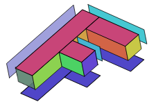

# WebGL 三维正射投影

上一篇文章概述了二维矩阵的工作原理，我们讲到了如何平移，旋转，缩放甚至从像素空间投影到裁剪空间，并且将这些操作通过一个矩阵实现，做三维只需要再迈出一小步。

二维例子中的二维点 (x, y) 与 3x3 的矩阵相乘，在三维中我们需要三维点 (x, y, z) 与 4x4 的矩阵相乘。

让我们将上个例子改成三维的，这里会继续使用 F，但是这次是三维的 'F' 。

首先需要修改顶点着色器以支持三维处理，这是原顶点着色器

```js
<script id="vertex-shader-2d" type="x-shader/x-vertex">
   attribute vec2 a_position;

   uniform mat3 u_matrix;

   void main() {
      // 将位置和矩阵相乘
      gl_Position = vec4((u_matrix * vec3(a_position, 1)).xy, 0, 1);
   }
</script>
```

这是新着色器

```js{2,4,8}
<script id="vertex-shader-3d" type="x-shader/x-vertex">
   attribute vec4 a_position;

   uniform mat4 u_matrix;

   void main() {
      // 将位置和矩阵相乘
      gl_Position = u_matrix * a_position;
   }
</script>
```

它甚至变简单了！在二维中我们提供 x 和 y 并设置 z 为 1，在三维中我们将提供 x，y 和 z，然后将 w 设置为 1，而在属性中 w 的默认值就是 1，我们可以利用这点不用再次设置。

然后提供三维数据。

```js{4}
// ...

// 告诉属性怎么从 positionBuffer (ARRAY_BUFFER) 中读取位置
var size = 3; // 每次迭代使用 3 个单位的数据
var type = gl.FLOAT; // 单位数据类型是 32 位的浮点型
var normalize = false; // 不需要归一化数据
var stride = 0; // 0 = 移动距离 * 单位距离长度 sizeof(type)，每次迭代跳多少距离到下一个数据
var offset = 0; // 从绑定缓冲的起始处开始
gl.vertexAttribPointer(positionAttributeLocation, size, type, normalize, stride, offset);

// ...

// 填充当前 ARRAY_BUFFER 缓冲
// 使用组成 'F' 的数据填充缓冲.
function setGeometry(gl) {
  gl.bufferData(
    gl.ARRAY_BUFFER,
    new Float32Array([
      // 左竖
      0,
      0,
      0,
      30,
      0,
      0,
      0,
      150,
      0,
      0,
      150,
      0,
      30,
      0,
      0,
      30,
      150,
      0,

      // 上横
      30,
      0,
      0,
      100,
      0,
      0,
      30,
      30,
      0,
      30,
      30,
      0,
      100,
      0,
      0,
      100,
      30,
      0,

      // 下横
      30,
      60,
      0,
      67,
      60,
      0,
      30,
      90,
      0,
      30,
      90,
      0,
      67,
      60,
      0,
      67,
      90,
      0
    ]),
    gl.STATIC_DRAW
  );
}
```

接下来把二维矩阵方法改成三维的

这是二维（之前的）版本的 `m3.translation`, `m3.rotation`, 和 `m3.scaling` 方法

```js
var m3 = {
  translation: function translation(tx, ty) {
    return [1, 0, 0, 0, 1, 0, tx, ty, 1];
  },

  rotation: function rotation(angleInRadians) {
    var c = Math.cos(angleInRadians);
    var s = Math.sin(angleInRadians);
    return [c, -s, 0, s, c, 0, 0, 0, 1];
  },

  scaling: function scaling(sx, sy) {
    return [sx, 0, 0, 0, sy, 0, 0, 0, 1];
  }
};
```

这是升级到三维的版本。

```js
var m4 = {
  translation: function(tx, ty, tz) {
    return [1, 0, 0, 0, 0, 1, 0, 0, 0, 0, 1, 0, tx, ty, tz, 1];
  },

  xRotation: function(angleInRadians) {
    var c = Math.cos(angleInRadians);
    var s = Math.sin(angleInRadians);

    return [1, 0, 0, 0, 0, c, s, 0, 0, -s, c, 0, 0, 0, 0, 1];
  },

  yRotation: function(angleInRadians) {
    var c = Math.cos(angleInRadians);
    var s = Math.sin(angleInRadians);

    return [c, 0, -s, 0, 0, 1, 0, 0, s, 0, c, 0, 0, 0, 0, 1];
  },

  zRotation: function(angleInRadians) {
    var c = Math.cos(angleInRadians);
    var s = Math.sin(angleInRadians);

    return [c, s, 0, 0, -s, c, 0, 0, 0, 0, 1, 0, 0, 0, 0, 1];
  },

  scaling: function(sx, sy, sz) {
    return [sx, 0, 0, 0, 0, sy, 0, 0, 0, 0, sz, 0, 0, 0, 0, 1];
  }
};
```

注意到我们现在有三个旋转方法，在二维中只需要一个是因为我们只需要绕 Z 轴旋转，现在在三维中还可以绕 X 轴和 Y 轴旋转。它们看起来还是很简单，如果使用它们后你会发现和之前一样

绕 Z 轴旋转

```
newX = x * c + y * s;
newY = x * -s + y * c;
```

绕 Y 轴旋转

```
newX = x * c + z * s;
newZ = x * -s + z * c;
```

绕 X 轴旋转

```
newY = y * c + z * s;
newZ = y * -s + z * c;
```

它们提供这些旋转方式。

[axis-diagram](embedded-codesandbox://webgl-fundamental-3d/axis-diagram?view=preview)

同样的我们将实现一些简单的方法

```js
translate: function(m, tx, ty, tz) {
   return m4.multiply(m, m4.translation(tx, ty, tz));
},

xRotate: function(m, angleInRadians) {
   return m4.multiply(m, m4.xRotation(angleInRadians));
},

yRotate: function(m, angleInRadians) {
   return m4.multiply(m, m4.yRotation(angleInRadians));
},

zRotate: function(m, angleInRadians) {
   return m4.multiply(m, m4.zRotation(angleInRadians));
},

scale: function(m, sx, sy, sz) {
   return m4.multiply(m, m4.scaling(sx, sy, sz));
},
```

我们还需要更新投影方法，这是原代码

```js
projection: function (width, height) {
   // 注意：这个矩阵翻转了 Y 轴，所以 0 在上方
   return [
      2 / width, 0, 0,
      0, -2 / height, 0,
      -1, 1, 1
   ];
},
```

它将像素坐标转换到裁剪空间，在初次尝试三维时我们将这样做

```js
projection: function(width, height, depth) {
   // 注意：这个矩阵翻转了 Y 轴，所以 0 在上方
   return [
      2 / width, 0, 0, 0,
      0, -2 / height, 0, 0,
      0, 0, 2 / depth, 0,
      -1, 1, 0, 1,
   ];
},
```

就像 X 和 Y 需要从像素空间转换到裁剪空间一样，Z 也需要。在这个例子中我也将 Z 单位化了，我会传递一些和 width 相似的值给 depth，所以我们的空间将会是 0 到 width 像素宽，0 到 height 像素高，但是对于 depth 将会是 -depth / 2 到 +depth / 2 。

最后需要更新计算矩阵的代码

```js
// 计算矩阵
var matrix = m4.projection(gl.canvas.clientWidth, gl.canvas.clientHeight, 400);
matrix = m4.translate(matrix, translation[0], translation[1], translation[2]);
matrix = m4.xRotate(matrix, rotation[0]);
matrix = m4.yRotate(matrix, rotation[1]);
matrix = m4.zRotate(matrix, rotation[2]);
matrix = m4.scale(matrix, scale[0], scale[1], scale[2]);

// 设置矩阵
gl.uniformMatrix4fv(matrixLocation, false, matrix);
```

这是结果

[webgl-3d-step1](embedded-codesandbox://webgl-fundamental-3d/webgl-3d-step1?view=preview)

我们遇到的第一个问题是 F 在三维中过于扁平，所以很难看出三维效果。解决这个问题的方法是将它拉伸成三维几何体。现在的 F 是由三个矩形组成，每个矩形两个三角形。让它变三维需要 16 个矩形。三个矩形在正面，三个背面，一个左侧，四个右侧，两个上侧，三个底面。



需要列出的还有很多，16 个矩形每个有两个三角形，每个三角形有 3 个顶点，所以一共有 96 个顶点。如果你想看这些可以去示例的源码里找。

我们需要绘制更多顶点所以

```js{4}
// 绘制几何体
var primitiveType = gl.TRIANGLES;
var offset = 0;
var count = 16 * 6;
gl.drawArrays(primitiveType, offset, count);
```

这是对应结果

[webgl-3d-step2](embedded-codesandbox://webgl-fundamental-3d/webgl-3d-step2?view=preview)

拖动滑块很难看出它是三维的，让我们给矩形上不同的颜色。需要在顶点着色器中添加一个属性和一个可变量，将颜色值传到片断着色器中。

这是新的顶点着色器

```js{3,7,13-14}
<script id="vertex-shader-3d" type="x-shader/x-vertex">
   attribute vec4 a_position;
   attribute vec4 a_color;

   uniform mat4 u_matrix;

   varying vec4 v_color;

   void main() {
      // 将位置和矩阵相乘
      gl_Position = u_matrix * a_position;

      // 将颜色传递给片断着色器
      v_color = a_color;
   }
</script>
```

然后在片断着色器中使用颜色

```js{4-5,8}
<script id="fragment-shader-3d" type="x-shader/x-fragment">
   precision mediump float;

   // 从顶点着色器中传入
   varying vec4 v_color;

   void main() {
      gl_FragColor = v_color;
   }
</script>
```

我们需要找到属性的位置，然后在另一个缓冲中存入对应的颜色。

```js
// ...
var colorLocation = gl.getAttribLocation(program, 'a_color');

// ...
// 给颜色创建一个缓冲
var colorBuffer = gl.createBuffer();
gl.bindBuffer(gl.ARRAY_BUFFER, colorBuffer);
// 将颜色值传入缓冲
setColors(gl);

// ...
// 向缓冲传入 'F' 的颜色值
function setColors(gl) {
  gl.bufferData(
    gl.ARRAY_BUFFER,
    new Uint8Array([
      // 正面左竖
      200,
      70,
      120,
      200,
      70,
      120,
      200,
      70,
      120,
      200,
      70,
      120,
      200,
      70,
      120,
      200,
      70,
      120,

      // 正面上横
      200,
      70,
      120,
      200,
      70,
      120
    ]),
    // ...
    // ...
    gl.STATIC_DRAW
  );
}
```

在渲染时告诉颜色属性如何从缓冲中获取颜色值

```js
// 启用颜色属性
gl.enableVertexAttribArray(colorLocation);

// 绑定颜色缓冲
gl.bindBuffer(gl.ARRAY_BUFFER, colorBuffer);

// 告诉颜色属性怎么从 colorBuffer (ARRAY_BUFFER) 中读取颜色值
var size = 3; // 每次迭代使用 3 个单位的数据
var type = gl.UNSIGNED_BYTE; // 单位数据类型是无符号 8 位整数
var normalize = true; // 标准化数据 (从 0-255 转换到 0.0-1.0)
var stride = 0; // 0 = 移动距离 * 单位距离长度sizeof(type)，每次迭代跳多少距离到下一个数据
var offset = 0; // 从绑定缓冲的起始处开始
gl.vertexAttribPointer(colorLocation, size, type, normalize, stride, offset);
```

现在我们得到这个。

[webgl-3d-step3](embedded-codesandbox://webgl-fundamental-3d/webgl-3d-step3?view=preview)
