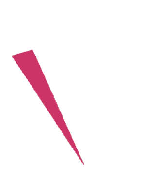
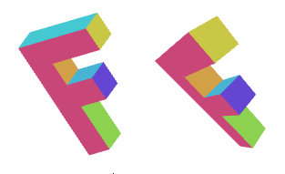
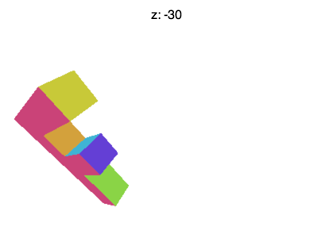

# WebGL 三维正射投影

上一篇文章概述了二维矩阵的工作原理，我们讲到了如何平移，旋转，缩放甚至从像素空间投影到裁剪空间，并且将这些操作通过一个矩阵实现，做三维只需要再迈出一小步。

二维例子中的二维点 (x, y) 与 3x3 的矩阵相乘，在三维中我们需要三维点 (x, y, z) 与 4x4 的矩阵相乘。

让我们将上个例子改成三维的，这里会继续使用 F，但是这次是三维的 'F' 。

首先需要修改顶点着色器以支持三维处理，这是原顶点着色器

```js
<script id="vertex-shader-2d" type="x-shader/x-vertex">
   attribute vec2 a_position;

   uniform mat3 u_matrix;

   void main() {
      // 将位置和矩阵相乘
      gl_Position = vec4((u_matrix * vec3(a_position, 1)).xy, 0, 1);
   }
</script>
```

这是新着色器

```js{2,4,8}
<script id="vertex-shader-3d" type="x-shader/x-vertex">
   attribute vec4 a_position;

   uniform mat4 u_matrix;

   void main() {
      // 将位置和矩阵相乘
      gl_Position = u_matrix * a_position;
   }
</script>
```

它甚至变简单了！在二维中我们提供 x 和 y 并设置 z 为 1，在三维中我们将提供 x，y 和 z，然后将 w 设置为 1，而在属性中 w 的默认值就是 1，我们可以利用这点不用再次设置。

然后提供三维数据。

```js{4}
// ...

// 告诉属性怎么从 positionBuffer (ARRAY_BUFFER) 中读取位置
var size = 3; // 每次迭代使用 3 个单位的数据
var type = gl.FLOAT; // 单位数据类型是 32 位的浮点型
var normalize = false; // 不需要归一化数据
var stride = 0; // 0 = 移动距离 * 单位距离长度 sizeof(type)，每次迭代跳多少距离到下一个数据
var offset = 0; // 从绑定缓冲的起始处开始
gl.vertexAttribPointer(positionAttributeLocation, size, type, normalize, stride, offset);

// ...

// 填充当前 ARRAY_BUFFER 缓冲
// 使用组成 'F' 的数据填充缓冲.
function setGeometry(gl) {
  gl.bufferData(
    gl.ARRAY_BUFFER,
    new Float32Array([
      // 左竖
      0,
      0,
      0,
      30,
      0,
      0,
      0,
      150,
      0,
      0,
      150,
      0,
      30,
      0,
      0,
      30,
      150,
      0,

      // 上横
      30,
      0,
      0,
      100,
      0,
      0,
      30,
      30,
      0,
      30,
      30,
      0,
      100,
      0,
      0,
      100,
      30,
      0,

      // 下横
      30,
      60,
      0,
      67,
      60,
      0,
      30,
      90,
      0,
      30,
      90,
      0,
      67,
      60,
      0,
      67,
      90,
      0
    ]),
    gl.STATIC_DRAW
  );
}
```

接下来把二维矩阵方法改成三维的

这是二维（之前的）版本的 `m3.translation`, `m3.rotation`, 和 `m3.scaling` 方法

```js
var m3 = {
  translation: function translation(tx, ty) {
    return [1, 0, 0, 0, 1, 0, tx, ty, 1];
  },

  rotation: function rotation(angleInRadians) {
    var c = Math.cos(angleInRadians);
    var s = Math.sin(angleInRadians);
    return [c, -s, 0, s, c, 0, 0, 0, 1];
  },

  scaling: function scaling(sx, sy) {
    return [sx, 0, 0, 0, sy, 0, 0, 0, 1];
  }
};
```

这是升级到三维的版本。

```js
var m4 = {
  translation: function(tx, ty, tz) {
    return [1, 0, 0, 0, 0, 1, 0, 0, 0, 0, 1, 0, tx, ty, tz, 1];
  },

  xRotation: function(angleInRadians) {
    var c = Math.cos(angleInRadians);
    var s = Math.sin(angleInRadians);

    return [1, 0, 0, 0, 0, c, s, 0, 0, -s, c, 0, 0, 0, 0, 1];
  },

  yRotation: function(angleInRadians) {
    var c = Math.cos(angleInRadians);
    var s = Math.sin(angleInRadians);

    return [c, 0, -s, 0, 0, 1, 0, 0, s, 0, c, 0, 0, 0, 0, 1];
  },

  zRotation: function(angleInRadians) {
    var c = Math.cos(angleInRadians);
    var s = Math.sin(angleInRadians);

    return [c, s, 0, 0, -s, c, 0, 0, 0, 0, 1, 0, 0, 0, 0, 1];
  },

  scaling: function(sx, sy, sz) {
    return [sx, 0, 0, 0, 0, sy, 0, 0, 0, 0, sz, 0, 0, 0, 0, 1];
  }
};
```

注意到我们现在有三个旋转方法，在二维中只需要一个是因为我们只需要绕 Z 轴旋转，现在在三维中还可以绕 X 轴和 Y 轴旋转。它们看起来还是很简单，如果使用它们后你会发现和之前一样

绕 Z 轴旋转

```
newX = x * c + y * s;
newY = x * -s + y * c;
```

绕 Y 轴旋转

```
newX = x * c + z * s;
newZ = x * -s + z * c;
```

绕 X 轴旋转

```
newY = y * c + z * s;
newZ = y * -s + z * c;
```

它们提供这些旋转方式。

[axis-diagram](embedded-codesandbox://webgl-fundamental-3d/axis-diagram?view=preview)

同样的我们将实现一些简单的方法

```js
translate: function(m, tx, ty, tz) {
   return m4.multiply(m, m4.translation(tx, ty, tz));
},

xRotate: function(m, angleInRadians) {
   return m4.multiply(m, m4.xRotation(angleInRadians));
},

yRotate: function(m, angleInRadians) {
   return m4.multiply(m, m4.yRotation(angleInRadians));
},

zRotate: function(m, angleInRadians) {
   return m4.multiply(m, m4.zRotation(angleInRadians));
},

scale: function(m, sx, sy, sz) {
   return m4.multiply(m, m4.scaling(sx, sy, sz));
},
```

我们还需要更新投影方法，这是原代码

```js
projection: function (width, height) {
   // 注意：这个矩阵翻转了 Y 轴，所以 0 在上方
   return [
      2 / width, 0, 0,
      0, -2 / height, 0,
      -1, 1, 1
   ];
},
```

它将像素坐标转换到裁剪空间，在初次尝试三维时我们将这样做

```js
projection: function(width, height, depth) {
   // 注意：这个矩阵翻转了 Y 轴，所以 0 在上方
   return [
      2 / width, 0, 0, 0,
      0, -2 / height, 0, 0,
      0, 0, 2 / depth, 0,
      -1, 1, 0, 1,
   ];
},
```

就像 X 和 Y 需要从像素空间转换到裁剪空间一样，Z 也需要。在这个例子中我也将 Z 单位化了，我会传递一些和 width 相似的值给 depth，所以我们的空间将会是 0 到 width 像素宽，0 到 height 像素高，但是对于 depth 将会是 -depth / 2 到 +depth / 2 。

最后需要更新计算矩阵的代码

```js
// 计算矩阵
var matrix = m4.projection(gl.canvas.clientWidth, gl.canvas.clientHeight, 400);
matrix = m4.translate(matrix, translation[0], translation[1], translation[2]);
matrix = m4.xRotate(matrix, rotation[0]);
matrix = m4.yRotate(matrix, rotation[1]);
matrix = m4.zRotate(matrix, rotation[2]);
matrix = m4.scale(matrix, scale[0], scale[1], scale[2]);

// 设置矩阵
gl.uniformMatrix4fv(matrixLocation, false, matrix);
```

这是结果

[webgl-3d-step1](embedded-codesandbox://webgl-fundamental-3d/webgl-3d-step1?view=preview)

我们遇到的第一个问题是 F 在三维中过于扁平，所以很难看出三维效果。解决这个问题的方法是将它拉伸成三维几何体。现在的 F 是由三个矩形组成，每个矩形两个三角形。让它变三维需要 16 个矩形。三个矩形在正面，三个背面，一个左侧，四个右侧，两个上侧，三个底面。


需要列出的还有很多，16 个矩形每个有两个三角形，每个三角形有 3 个顶点，所以一共有 96 个顶点。如果你想看这些可以去示例的源码里找。

我们需要绘制更多顶点所以

```js{4}
// 绘制几何体
var primitiveType = gl.TRIANGLES;
var offset = 0;
var count = 16 * 6;
gl.drawArrays(primitiveType, offset, count);
```

这是对应结果

[webgl-3d-step2](embedded-codesandbox://webgl-fundamental-3d/webgl-3d-step2?view=preview)

拖动滑块很难看出它是三维的，让我们给矩形上不同的颜色。需要在顶点着色器中添加一个属性和一个可变量，将颜色值传到片断着色器中。

这是新的顶点着色器

```js{3,7,13-14}
<script id="vertex-shader-3d" type="x-shader/x-vertex">
   attribute vec4 a_position;
   attribute vec4 a_color;

   uniform mat4 u_matrix;

   varying vec4 v_color;

   void main() {
      // 将位置和矩阵相乘
      gl_Position = u_matrix * a_position;

      // 将颜色传递给片断着色器
      v_color = a_color;
   }
</script>
```

然后在片断着色器中使用颜色

```js{4-5,8}
<script id="fragment-shader-3d" type="x-shader/x-fragment">
   precision mediump float;

   // 从顶点着色器中传入
   varying vec4 v_color;

   void main() {
      gl_FragColor = v_color;
   }
</script>
```

我们需要找到属性的位置，然后在另一个缓冲中存入对应的颜色。

```js
// ...
var colorLocation = gl.getAttribLocation(program, 'a_color');

// ...
// 给颜色创建一个缓冲
var colorBuffer = gl.createBuffer();
gl.bindBuffer(gl.ARRAY_BUFFER, colorBuffer);
// 将颜色值传入缓冲
setColors(gl);

// ...
// 向缓冲传入 'F' 的颜色值
function setColors(gl) {
  gl.bufferData(
    gl.ARRAY_BUFFER,
    new Uint8Array([
      // 正面左竖
      200,
      70,
      120,
      200,
      70,
      120,
      200,
      70,
      120,
      200,
      70,
      120,
      200,
      70,
      120,
      200,
      70,
      120,

      // 正面上横
      200,
      70,
      120,
      200,
      70,
      120
    ]),
    // ...
    // ...
    gl.STATIC_DRAW
  );
}
```

在渲染时告诉颜色属性如何从缓冲中获取颜色值

```js
// 启用颜色属性
gl.enableVertexAttribArray(colorLocation);

// 绑定颜色缓冲
gl.bindBuffer(gl.ARRAY_BUFFER, colorBuffer);

// 告诉颜色属性怎么从 colorBuffer (ARRAY_BUFFER) 中读取颜色值
var size = 3; // 每次迭代使用 3 个单位的数据
var type = gl.UNSIGNED_BYTE; // 单位数据类型是无符号 8 位整数
var normalize = true; // 标准化数据 (从 0-255 转换到 0.0-1.0)
var stride = 0; // 0 = 移动距离 * 单位距离长度sizeof(type)，每次迭代跳多少距离到下一个数据
var offset = 0; // 从绑定缓冲的起始处开始
gl.vertexAttribPointer(colorLocation, size, type, normalize, stride, offset);
```

现在我们得到这个。

[webgl-3d-step3](embedded-codesandbox://webgl-fundamental-3d/webgl-3d-step3?view=preview)

它好像把 'F' 的所有部分都按照提供的顺序显示出来了，正面，背面，侧面等等。有时候这并不是想要的结果，在背面的物体反而被绘制出来了。



红色部分是 'F' 的正面，但是因为它在数据的前部所以最先被绘制出来，然后它后面的面绘制后挡住了它。例如紫色部分实际上是 'F' 的背面，由于它在数据中是第二个所以第二个被画出来。

WebGL 中的三角形有正反面的概念，正面三角形的顶点顺序是逆时针方向，反面三角形是顺时针方向。


WebGL 可以只绘制正面或反面三角形，可以这样开启

```js
gl.enable(gl.CULL_FACE);
```

将它放在 drawScene 方法里，开启这个特性后 WebGL 默认“剔除”背面三角形，"剔除"在这里是“不用绘制”的花哨叫法。

对于 WebGL 而言，一个三角形是顺时针还是逆时针是根据裁剪空间中的顶点顺序判断的，换句话说，WebGL 是根据你在顶点着色器中运算后提供的结果来判定的，这就意味着如果你把一个顺时针的三角形沿 X 轴缩放 -1，它将会变成逆时针，或者将顺时针的三角形旋转 180 度后变成逆时针。由于我们没有开启 CULL_FACE，所以可以同时看到顺时针（正面）和逆时针（反面）三角形。现在开启了，任何时候正面三角形无论是缩放还是旋转的原因导致翻转了，WebGL 就不会绘制它。这件事很有用，因为通常情况下你只需要看到你正面对的面。

开启 CULL_FACE 后得到

[webgl-3d-step4](embedded-codesandbox://webgl-fundamental-3d/webgl-3d-step4?view=preview)

结果证明，大多数三角形朝向都是错的，旋转的时候你会看到背面的三角形，幸好它很容易解决，我们只需要看看哪些是三角形是反的，然后交换它们的两个顶点。例如一个反的三角形

```
  1,   2,   3,
 40,  50,  60,
700, 800, 900,
```

只需要交换后两个顶点的位置

```
  1,   2,   3,
700, 800, 900,
 40,  50,  60,
```

通过修正朝向错误后得到

[webgl-3d-step5](embedded-codesandbox://webgl-fundamental-3d/webgl-3d-step5?view=preview)

这很接近实际效果了但是还有一个问题，即使所有三角形的朝向是正确的，然后背面的被剔除了，有些应该在背面的部分还是出现在了前面。

深度缓冲有时也叫 Z-Buffer，是一个存储像素深度的矩形，一个深度像素对应一个着色像素，在绘制图像时组合使用。当 WebGL 绘制每个着色像素时也会写入深度像素，它的值基于顶点着色器返回的 Z 值，就像我们将 X 和 Y 转换到裁剪空间一样，Z 也在裁剪空间或者 (-1 到 +1)。这个值会被转换到深度空间( 0 到 +1)，WebGL 绘制一个着色像素之前会检查对应的深度像素，如果对应的深度像素中的深度值小于当前像素的深度值，WebGL 就不会绘制新的颜色。反之它会绘制片断着色器提供的新颜色并更新深度像素中的深度值。这也意味着在其他像素后面的像素不会被绘制。

我们可以像这样开启这个特性

```js
gl.enable(gl.DEPTH_TEST);
```

在开始绘制前还需要清除深度缓冲为 1.0。

```js
// 绘制场景
function drawScene() {
  // ...

  // 清空画布和深度缓冲
  gl.clear(gl.COLOR_BUFFER_BIT | gl.DEPTH_BUFFER_BIT);

  // ...
}
```

现在得到

[webgl-3d-step6](embedded-codesandbox://webgl-fundamental-3d/webgl-3d-step6?view=preview)

这才是三维！

还有一件小事，在大多数三维数学库中没有负责像素空间与裁剪空间转换的 projection 方法。代替的是叫做 ortho 或 orthographic 的方法，它看起来像这样

```js
var m4 = {
  orthographic: function(left, right, bottom, top, near, far) {
    return [
      2 / (right - left),
      0,
      0,
      0,
      0,
      2 / (top - bottom),
      0,
      0,
      0,
      0,
      2 / (near - far),
      0,

      (left + right) / (left - right),
      (bottom + top) / (bottom - top),
      (near + far) / (near - far),
      1
    ];
  }
};
```

和我们简单的 projection 方法不同的是正射投影有更多的参数可以传递，左，右，上，下，近和远，给我们更灵活的选择。为了用这个方法实现之前的投影，需要这样调用

```js
var left = 0;
var right = gl.canvas.clientWidth;
var bottom = gl.canvas.clientHeight;
var top = 0;
var near = 400;
var far = -400;
m4.orthographic(left, right, bottom, top, near, far);
```

# WebGL 三维透视投影

上一篇文章讲述了如何实现三维，那个三维用的不是透视投影，而是的所谓的“正射”投影，但那不是我们日常观看三维的方式。

我们应使用透视投影代替它，但什么是透视投影？它的基础特性就是离得越远显得越小。


在上方的示例中，远处的物体会变小，想要实现例子中近大远小的效果，简单的做法就是将裁减空间中的 X 和 Y 值除以 Z 值。

你可以这么想：如果一个线段是 (10, 15) 到 (20,15)，它长度为十个单位，在当前的代码中它就是 10 个像素长，但是如果我们将它除以 Z，且 Z 值 为 1

```
10 / 1 = 10
20 / 1 = 20
abs(10-20) = 10
```

它将是 10 个像素长，如果 Z 值为 2

```
10 / 2 = 5
20 / 2 = 10
abs(5 - 10) = 5
```

就是 5 像素了，当 Z 值为 3 时

```
10 / 3 = 3.333
20 / 3 = 6.666
abs(3.333 - 6.666) = 3.333
```

你可以看出随着 Z 变大距离就变远了，画的也会小一点。如果我们除以裁剪空间中的 Z，值可能会变大，因为 Z 是一个较小的值(-1 到 +1)。但是我们可以提供一个 fudgeFactor 因子和 Z 相乘，这样就可以调整缩放的程度。

让我们来试试，首先修改顶点着色器，除以 Z 再乘以我们的 "fudgeFactor" 因子。

```js{3,9-10,12-13}
<script id="vertex-shader-3d" type="x-shader/x-vertex">
  // ...
  uniform float u_fudgeFactor;
  // ...
  void main() {
    // 将位置和矩阵相乘
    vec4 position = u_matrix * a_position;

    // 调整除数
    float zToDivideBy = 1.0 + position.z * u_fudgeFactor;

    // x 和 y 除以调整后的除数
    gl_Position = vec4(position.xy / zToDivideBy, position.zw);
  }
</script>
```

注意，由于裁减空间中的 Z 值是 -1 到 +1 的，所以 +1 是为了让 zToDivideBy 变成 0 到 `+2 * fudgeFactor`

还需要更新代码以设置 fudgeFactor。

```js
// ...
var fudgeLocation = gl.getUniformLocation(program, 'u_fudgeFactor');

// ...
var fudgeFactor = 1;
// ...
function drawScene() {
  // ...
  // 设置 fudgeFactor
  gl.uniform1f(fudgeLocation, fudgeFactor);

  // 绘制几何体
  var primitiveType = gl.TRIANGLES;
  var offset = 0;
  var count = 16 * 6;
  gl.drawArrays(primitiveType, offset, count);
  // ...
}
```

[webgl-3d-perspective](embedded-codesandbox://webgl-fundamental-3d/webgl-3d-perspective?view=preview)

如果效果不明显，可以将 "fudgeFactor" 滑块从 1.0 拖到 0.0 来对比没添加这些代码之前的样子。



事实上 WebGL 会将我们提供给 `gl_Position` 的 x, y, z, w 值自动除以 w 。

我们可以通过修改着色器来证明，用 zToDivideBy 代替 `gl_Position.w`

```js{13}
<script id="vertex-shader-2d" type="x-shader/x-vertex">
   // ...
   uniform float u_fudgeFactor;
   // ...
   void main() {
      // 将位置和矩阵相乘
      vec4 position = u_matrix * a_position;

      // 调整除数
      float zToDivideBy = 1.0 + position.z * u_fudgeFactor;

      // 将 x y z 除以 zToDivideBy
      gl_Position = vec4(position.xyz, zToDivideBy);

      // 传递颜色到给片断着色器
      v_color = a_color;
   }
</script>
```

看他们多像。

[webgl-3d-perspective-w](embedded-codesandbox://webgl-fundamental-3d/webgl-3d-perspective-w?view=preview)

为什么 WebGL 会自动除以 W ？因为使用矩阵的魔力，可以用把值从 z 传值到 w 。

一个这样的矩阵

```
1, 0, 0, 0,
0, 1, 0, 0,
0, 0, 1, 1,
0, 0, 0, 0,
```

将会把 z 的值复制给 w，你可以把每列看作

```
x_out = x_in * 1 +
        y_in * 0 +
        z_in * 0 +
        w_in * 0 ;

y_out = x_in * 0 +
        y_in * 1 +
        z_in * 0 +
        w_in * 0 ;

z_out = x_in * 0 +
        y_in * 0 +
        z_in * 1 +
        w_in * 0 ;

w_out = x_in * 0 +
        y_in * 0 +
        z_in * 1 +
        w_in * 0 ;
```

简化后得到

```
x_out = x_in;
y_out = y_in;
z_out = z_in;
w_out = z_in;
```

如果 w 原来就是 1.0 就会加 1

```
1, 0, 0, 0,
0, 1, 0, 0,
0, 0, 1, 1,
0, 0, 0, 1,
```

他会将 W 的运算变为

```
w_out = x_in * 0 +
        y_in * 0 +
        z_in * 1 +
        w_in * 1 ;
```

因为 w_in = 1.0 是已知的

```
w_out = z_in + 1;
```

最后可以将 fudgeFactor 像这样放入矩阵中

```
1, 0, 0, 0,
0, 1, 0, 0,
0, 0, 1, fudgeFactor,
0, 0, 0, 1,
```

相当于

```
w_out = x_in * 0 +
        y_in * 0 +
        z_in * fudgeFactor +
        w_in * 1 ;
```

简化后为

```
w_out = z_in * fudgeFactor + 1;
```

我们来修改代码，使用这个矩阵。

首先将顶点着色器还原，又变成简单的样子

```js
<script id="vertex-shader-2d" type="x-shader/x-vertex">
   uniform mat4 u_matrix;

   void main() {
      // 位置和矩阵相乘
      gl_Position = u_matrix * a_position;
      // ...
   }
</script>
```

接下来定义一个方法实现 Z → W 的矩阵

```js
function makeZToWMatrix(fudgeFactor) {
  return [1, 0, 0, 0, 0, 1, 0, 0, 0, 0, 1, fudgeFactor, 0, 0, 0, 1];
}
```

然后使用它。

```js{3-4}
// ...
// 计算矩阵
var matrix = makeZToWMatrix(fudgeFactor);
matrix = m4.multiply(matrix, m4.projection(gl.canvas.clientWidth, gl.canvas.clientHeight, 400));
matrix = m4.translate(matrix, translation[0], translation[1], translation[2]);
matrix = m4.xRotate(matrix, rotation[0]);
matrix = m4.yRotate(matrix, rotation[1]);
matrix = m4.zRotate(matrix, rotation[2]);
matrix = m4.scale(matrix, scale[0], scale[1], scale[2]);

// ...
```

和之前的很像。

[webgl-3d-perspective-w-matrix](embedded-codesandbox://webgl-fundamental-3d/webgl-3d-perspective-w-matrix?view=preview)

这只是展示了除以 Z 值获可以实现透视投影，以及在 WebGL 中简单实现。

但还有一些问题需要解决，比如将 Z 值设置为 -100 左右的时候会遇到下面的情形



为什么会这样？为什么 F 提前消失了？WebGL 裁剪空间中的 X 和 Y 会被 +1 和 -1 裁剪，Z 也一样。我们看到的是 Z < -1 的情况。

我可以从数学方法深入探讨并寻找解决办法，但是你可以联想二维中的的解决方法。我们需要获取 Z 值，然后加上一些量，缩放一些量，就可以将任意范围映射到 -1 到 +1 的范围内。

最有意思的是这件事可以在一个矩阵中完成，更方便的是，我们可以定义一个 fieldOfView 代替 fudgeFactor，计算出更合适的值。

这是创建矩阵的方法。

```js
var m4 = {
  perspective: function(fieldOfViewInRadians, aspect, near, far) {
    var f = Math.tan(Math.PI * 0.5 - 0.5 * fieldOfViewInRadians);
    var rangeInv = 1.0 / (near - far);

    return [f / aspect, 0, 0, 0, 0, f, 0, 0, 0, 0, (near + far) * rangeInv, -1, 0, 0, near * far * rangeInv * 2, 0];
  }
};

// ...
```

这个矩阵会为我们完成所有转换。它可以调整单位以适应裁剪空间，它可以自定义视场角，选择 Z-裁剪面。假设有一个眼睛或者摄像机在原点(0, 0, 0)，根据 zNear 和 fieldOfView 可以将 zNear 对应到 Z = -1，在 zNear 平面上一半的 fieldOfView 长度对应画布中心到 Y = -1 或 Y = 1 的距离，X 的值通过乘以 aspect 获取，最后通过设置 zFar 对应 Z = 1，控制缩放的程度。

这是矩阵的图解。

[frustum-diagram](embedded-codesandbox://webgl-fundamental-3d/frustum-diagram?view=preview)

正方体所在的有四个侧面的椎体叫做“视锥”，矩阵将视锥中的空间转换到裁剪空间中，zNear 决定了被正面切割的位置，zFar 决定被背面切割的位置。将 zNear 设置为 23 就会看到正方体正面被切割，将 zFar 设置为 24 就会看到正方体背面被切割。

还有一个问题，矩阵假定观察位置为 0, 0, 0 并且看向 Z 轴负方向，Y 轴为上方向。这和我们目前为止做法不同，为了解决这个问题我们需要将物体放到视图范围内。

我们在 (45, 150, 0) 绘制的 F，可以将它移动到 (-150, 0, -360)

使用 m4.projection 方法代替之前的投影方法，可以调用 m4.perspective

```js
var aspect = gl.canvas.clientWidth / gl.canvas.clientHeight;
var zNear = 1;
var zFar = 2000;
var matrix = m4.perspective(fieldOfViewRadians, aspect, zNear, zFar);
matrix = m4.translate(matrix, translation[0], translation[1], translation[2]);
matrix = m4.xRotate(matrix, rotation[0]);
matrix = m4.yRotate(matrix, rotation[1]);
matrix = m4.zRotate(matrix, rotation[2]);
matrix = m4.scale(matrix, scale[0], scale[1], scale[2]);
```

结果在这里。

[webgl-3d-perspective-matrix](embedded-codesandbox://webgl-fundamental-3d/webgl-3d-perspective-matrix?view=preview)

我们讲了矩阵乘法，视角和自定义 Z 范围。还有很多没讲完，但这篇文章已经很长了，所以接下来继续讲相机。

> **为什么将 F 移动到那么远的距离（Z = -360）?**
>
> 在其他的例子中 F 都在 (45, 150, 0)，但在最后一个例子中它被移动到了 (-150, 0, -360)。为什么它被移动到那么远的地方？
>
> 原因是在最后一个例子中用 m4.projection 方法将像素移动到裁减空间，我们的显示范围是 `400 x 300` 像素，`像素` 在三维中无法解释。所以新投影创建了一个视锥，它在 zNear 的距离时是 2 个单位高和 `2 * aspect` 个单位宽。由于 `F` 的大小是 150 个单位，在近平面的时候只能看到 2 个单位的高度，所以我们将它移到足够远的地方才能看到完整的它。
>
> 同样的将 `X` 从 45 移动到 -150。过去视图表示的范围是 0 到 400 个单位，现在它表示的 -1 到 +1 个单位。

# WebGL 三维相机

在上篇文章中我们将 F 移动到了视锥中，原因是 `m4.perspective` 默认将相机放在了原点 `(0, 0, 0)` 并且视锥的范围是 `-zNear` 到 `-zFar`。

将物体移动到视场中可能并不是正确的方法，在实际生活中通常是移动相机去拍摄建筑物。

<iframe src="https://codesandbox.io/embed/rsob1c?codemirror=1&hidenavigation=1&theme=light&view=preview&initialpath=?mode=0" class="embedded-codesandbox" sandbox="allow-modals allow-forms allow-popups allow-scripts allow-same-origin"></iframe>

<!-- [camera-move-camera](embedded-codesandbox://webgl-fundamental-3d/camera-move-camera?view=preview&initialpath=?mode=0) -->

将物体移动到相机前面并不是常见做法。

<iframe src="https://codesandbox.io/embed/rsob1c?codemirror=1&hidenavigation=1&theme=light&view=preview&initialpath=?mode=1" class="embedded-codesandbox" sandbox="allow-modals allow-forms allow-popups allow-scripts allow-same-origin"></iframe>

<!-- [camera-move-camera](embedded-codesandbox://webgl-fundamental-3d/camera-move-camera?view=preview&initialpath=?mode=1) -->

但在上节中由于投影的原因物体需要在 -Z 轴上，我们通过将相机移动到原点，物体移动到相机前来保持原始的相对位置。

<iframe src="https://codesandbox.io/embed/rsob1c?codemirror=1&hidenavigation=1&theme=light&view=preview&initialpath=?mode=2" class="embedded-codesandbox" sandbox="allow-modals allow-forms allow-popups allow-scripts allow-same-origin"></iframe>

<!-- [camera-move-camera](embedded-codesandbox://webgl-fundamental-3d/camera-move-camera?view=preview&initialpath=?mode=2) -->

高效的将物体移动到相机前是非常重要的。最简单的方式是使用一个“逆向”矩阵，计算逆矩阵的数学原理比较复杂但概念很简单，逆就是你想通过一个值去抵消一个值。例如，123 的逆就是 -123，一个缩放为 5 的缩放矩阵的逆是缩放为 1/5 或 0.2 的缩放矩阵，一个绕 X 轴旋转 30° 的旋转矩阵的逆是绕 X 旋转 -30°。

目前为止我们使用过平移，旋转和缩放去控制 'F' 的位置和姿态，将这些矩阵相乘后得到一个矩阵，可以将物体从原始位置移动到期望的位置，大小和姿态。我们可以对相机进行同样的操作，一旦有了相机从原点移动旋转到目标位置的矩阵后，就可以计算出它的逆矩阵，利用这个逆矩阵可以不动相机，将物体从相反的方向移动到相机前。

让我们来做一个三维场景，像上图一样有一圈 'F' 。

首先，由于 5 个物体使用的是同一个投影矩阵，所以我们将投影矩阵的计算放在循环外

```js
// 计算投影矩阵
var aspect = gl.canvas.clientWidth / gl.canvas.clientHeight;
var zNear = 1;
var zFar = 2000;
var projectionMatrix = m4.perspective(fieldOfViewRadians, aspect, zNear, zFar);
```

接着计算相机矩阵，这个矩阵代表的是相机在世界坐标中的位置和姿态。下方的代码计算的是看向原点，在半径为 `radius * 1.5` 的圆上移动的相机。

<iframe src="https://codesandbox.io/embed/rsob1c?codemirror=1&hidenavigation=1&theme=light&view=preview&initialpath=?mode=3" class="embedded-codesandbox" sandbox="allow-modals allow-forms allow-popups allow-scripts allow-same-origin"></iframe>

<!-- [camera-move-camera](embedded-codesandbox://webgl-fundamental-3d/camera-move-camera?view=preview&initialpath=?mode=3) -->

```js
var numFs = 5;
var radius = 200;

// 计算相机的矩阵
var cameraMatrix = m4.yRotation(cameraAngleRadians);
cameraMatrix = m4.translate(cameraMatrix, 0, 0, radius * 1.5);
```

然后通过相机矩阵计算“视图矩阵”，视图矩阵是将所有物体以相反于相机的方向运动，尽管相机还是在原点但是相对关系是期望的。我们可以使用 inverse 方法计算逆矩阵（完全对立的转换矩阵），在这个例子中提供的是绕原点转动的矩阵，它的逆矩阵是移动相机以外的所有物体，好像相机在原点一样。

```js
// 通过相机矩阵计算视图矩阵
var viewMatrix = m4.inverse(cameraMatrix);
```

现在将视图矩阵和投影矩阵结合在一起

```js
// 计算组合矩阵
var viewProjectionMatrix = m4.multiply(projectionMatrix, viewMatrix);
```

最后绘制一圈 F，将每个 F 乘以视图投影矩阵，然后旋转和向外平移 radius 个单位。

```js
for (var ii = 0; ii < numFs; ++ii) {
  var angle = (ii * Math.PI * 2) / numFs;
  var x = Math.cos(angle) * radius;
  var y = Math.sin(angle) * radius;

  // 从视图投影矩阵开始
  // 计算 F 的矩阵
  var matrix = m4.translate(viewProjectionMatrix, x, 0, y);

  // 设置矩阵
  gl.uniformMatrix4fv(matrixLocation, false, matrix);

  // 获得几何体
  var primitiveType = gl.TRIANGLES;
  var offset = 0;
  var count = 16 * 6;
  gl.drawArrays(primitiveType, offset, count);
}
```

一个绕 F 旋转的相机。拖动 cameraAngle 滑块移动相机。

[webgl-3d-camera](embedded-codesandbox://webgl-fundamental-3d/webgl-3d-camera?view=preview)

// TODO https://webglfundamentals.org/webgl/lessons/zh_cn/webgl-3d-camera.html
