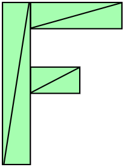
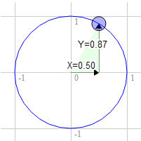
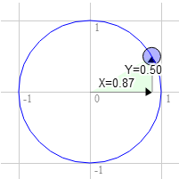
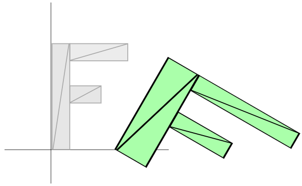
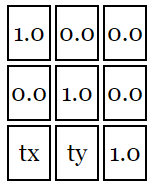
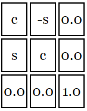

# WebGL 二维平移

平移就是普通意义的“移动”物体。这里有个例子基于前一个例子。首先我们来定义一些变量存储矩形的平移，宽，高和颜色。

```js
var translation = [0, 0];
var width = 100;
var height = 30;
var color = [Math.random(), Math.random(), Math.random(), 1];
```

然后定义一个方法重绘所有东西，我们可以在更新变换之后调用这个方法。

```js
// 绘制场景
function drawScene() {
  webglUtils.resizeCanvasToDisplaySize(gl.canvas);

  // 告诉 WebGL 如何从裁剪空间对应到像素
  gl.viewport(0, 0, gl.canvas.width, gl.canvas.height);

  // 清空画布
  gl.clear(gl.COLOR_BUFFER_BIT);

  // 使用我们的程序
  gl.useProgram(program);

  // 启用属性
  gl.enableVertexAttribArray(positionLocation);

  // 绑定位置缓冲
  gl.bindBuffer(gl.ARRAY_BUFFER, positionBuffer);

  // 设置矩形参数
  setRectangle(gl, translation[0], translation[1], width, height);

  // 告诉属性怎么从 positionBuffer 中读取数据 (ARRAY_BUFFER)
  var size = 2; // 每次迭代运行提取两个单位数据
  var type = gl.FLOAT; // 每个单位的数据类型是 32 位浮点型
  var normalize = false; // 不需要归一化数据
  var stride = 0; // 0 = 移动单位数量 * 每个单位占用内存（sizeof(type)）
  var offset = 0; // 从缓冲起始位置开始读取
  gl.vertexAttribPointer(positionLocation, size, type, normalize, stride, offset);

  // 设置分辨率
  gl.uniform2f(resolutionLocation, gl.canvas.width, gl.canvas.height);

  // 设置颜色
  gl.uniform4fv(colorLocation, color);

  // 绘制矩形
  var primitiveType = gl.TRIANGLES;
  var offset = 0;
  var count = 6;
  gl.drawArrays(primitiveType, offset, count);
}
```

在下方的例子中，我添加了一对滑块，当它们值改变时会更新 `translation[0]` 和 `translation[1]` 并且调用 drawScene 方法。拖动滑块来平移矩形。

[webgl-2d-rectangle-translate](embedded-codesandbox://webgl-fundamental-2d/webgl-2d-rectangle-translate?view=preview)

到目前为止还不错！但是想象一下如果对一个更复杂的图形做类似操作怎么办。

假设我们想绘制一个由六个三角形组成的 ‘F’ ，像这样



接着当前的代码我们需要修改 setRectangle，像这样

```js
// 在缓冲存储构成 'F' 的值
function setGeometry(gl, x, y) {
  var width = 100;
  var height = 150;
  var thickness = 30;
  gl.bufferData(
    gl.ARRAY_BUFFER,
    new Float32Array([
      // 左竖
      x,
      y,
      x + thickness,
      y,
      x,
      y + height,
      x,
      y + height,
      x + thickness,
      y,
      x + thickness,
      y + height,

      // 上横
      x + thickness,
      y,
      x + width,
      y,
      x + thickness,
      y + thickness,
      x + thickness,
      y + thickness,
      x + width,
      y,
      x + width,
      y + thickness,

      // 中横
      x + thickness,
      y + thickness * 2,
      x + (width * 2) / 3,
      y + thickness * 2,
      x + thickness,
      y + thickness * 3,
      x + thickness,
      y + thickness * 3,
      x + (width * 2) / 3,
      y + thickness * 2,
      x + (width * 2) / 3,
      y + thickness * 3
    ]),
    gl.STATIC_DRAW
  );
}
```

你可能发现这样做可能并不好，如果我们想绘制一个含有成百上千个线条的几何图形，将会有很复杂的代码。最重要的是，每次绘制 JavaScript 都要更新所有点。

这里有个简单的方式，上传几何体然后在着色器中进行平移，以下是新的着色器

```js
<script id="vertex-shader-2d" type="x-shader/x-vertex">
   attribute vec2 a_position;

   uniform vec2 u_resolution;
   uniform vec2 u_translation;

   void main() {
      // 加上平移量
      vec2 position = a_position + u_translation;

      // 从像素坐标转换到 0.0 到 1.0
      vec2 zeroToOne = position / u_resolution;
      // ...
   }
</script>
```

重构一下代码，首先我们只需要设置一次几何体。

```js
// 在缓冲存储构成 'F' 的值
function setGeometry(gl) {
  gl.bufferData(
    gl.ARRAY_BUFFER,
    new Float32Array([
      // 左竖
      0,
      0,
      30,
      0,
      0,
      150,
      0,
      150,
      30,
      0,
      30,
      150,

      // 上横
      30,
      0,
      100,
      0,
      30,
      30,
      30,
      30,
      100,
      0,
      100,
      30,

      // 中横
      30,
      60,
      67,
      60,
      30,
      90,
      30,
      90,
      67,
      60,
      67,
      90
    ]),
    gl.STATIC_DRAW
  );
}
```

然后我们只需要在绘制前更新 `u_translation` 为期望的平移量。

```js
// ...

var translationLocation = gl.getUniformLocation(program, 'u_translation');
// ...

// 创建一个存放位置信息的缓冲
var positionBuffer = gl.createBuffer();
// 绑定到 ARRAY_BUFFER (简单的理解为 ARRAY_BUFFER = positionBuffer)
gl.bindBuffer(gl.ARRAY_BUFFER, positionBuffer);
// 将几何数据存到缓冲
setGeometry(gl);

// ...

// 绘制场景
function drawScene() {
  // ...

  // 设置平移
  gl.uniform2fv(translationLocation, translation);

  // 绘制矩形
  var primitiveType = gl.TRIANGLES;
  var offset = 0;
  var count = 18;
  gl.drawArrays(primitiveType, offset, count);
}
```

注意到 setGeometry 只调用了一次，它不在 drawScene 内部了。

这里是那个例子，同样的，拖动滑块来更新平移量。

[webgl-2d-geometry-translate-better](embedded-codesandbox://webgl-fundamental-2d/webgl-2d-geometry-translate-better?view=preview)

现在当我们绘制时，WebGL 几乎做了所有事情，我们做的仅仅是设置平移然后让它绘制，即使我们的几何体有成千上万个点，主要的代码还是保持不变。

你可以对比上方例子中使用 JavaScript 更新所有点的情况。

# WebGL 二维旋转

首先我想向你介绍一个叫做 `单位圆` 的东西，一个圆有一个半径，圆的半径是圆心到圆边缘的距离，单位圆是半径为 1.0 的圆。


当你拖拽蓝色圆点的时候 X 和 Y 会改变，它们是那一点在圆上的坐标，在最上方时 Y 是 1 并且 X 是 0，在最右边的时候 X 是 1 并且 Y 是 0。

如果你还记得三年级的数学知识，数字和 1 相乘结果不变。例如 `123 * 1 = 123`，那么，单位圆半径为 1.0 的圆也是 1 的一种形式，它是旋转的 1。所以你可以把一些东西和单位圆相乘，除了发生一些魔法和旋转之外，某种程度上和乘以 1 相似。

我们将从单位元上任取一点，并将该点的 X 和 Y 与之前例子中的几何体相乘，以下是新的着色器。

```js
<script id="vertex-shader-2d" type="x-shader/x-vertex">
   attribute vec2 a_position;

   uniform vec2 u_resolution;
   uniform vec2 u_translation;
   uniform vec2 u_rotation;

   void main() {
      // 旋转位置
      vec2 rotatedPosition = vec2(
         a_position.x * u_rotation.y + a_position.y * u_rotation.x,
         a_position.y * u_rotation.y - a_position.x * u_rotation.x
      );

      // 加上平移
      vec2 position = rotatedPosition + u_translation;
   }
</script>
```

更新 JavaScript，传递两个值进去。

```js
// ...

var rotationLocation = gl.getUniformLocation(program, 'u_rotation');

// ...

var rotation = [0, 1];

// ...

// 绘制场景
function drawScene() {
  // ...

  // 设置平移
  gl.uniform2fv(translationLocation, translation);

  // 设置旋转
  gl.uniform2fv(rotationLocation, rotation);

  // 绘制几何体
  var primitiveType = gl.TRIANGLES;
  var offset = 0;
  var count = 18; // 6 个三角形组成 'F', 每个三角形 3 个点
  gl.drawArrays(primitiveType, offset, count);
}
```

这是结果，拖动圆形手柄来旋转或拖动滑块来平移。

<iframe src="https://codesandbox.io/embed/6g8g2i?codemirror=1&hidenavigation=1&theme=light&view=preview" class="embedded-codesandbox" sandbox="allow-modals allow-forms allow-popups allow-scripts allow-same-origin"></iframe>

<!-- [webgl-2d-geometry-rotation](embedded-codesandbox://webgl-fundamental-2d/webgl-2d-geometry-rotation?view=preview) -->

为什么会这样？来看看数学公式。

```js
rotatedX = a_position.x * u_rotation.y + a_position.y * u_rotation.x;
rotatedY = a_position.y * u_rotation.y - a_position.x * u_rotation.x;
```

假如你想旋转一个矩形，在开始旋转之前矩形右上角坐标是 3.0, 9.0，让我们在单位圆上以十二点方向为起点顺时针旋转 30 度后取一个点。



圆上该点的位置是 0.50 和 0.87

```
3.0 * 0.87 + 9.0 * 0.50 = 7.1
9.0 * 0.87 - 3.0 * 0.50 = 6.3
```

这个结果正好是我们需要的结果


顺时针 60 度也一样



圆上该点的位置是 0.87 和 0.50。

```
3.0 * 0.50 + 9.0 * 0.87 = 9.3
9.0 * 0.50 - 3.0 * 0.87 = 1.9
```

你会发现在我们顺时针旋转到右边的过程中，X 变大 Y 变小。如果我们继续旋转超过 90 度后，X 变小 Y 变大，这种形式形成了旋转。

单位圆上的点还有一个名字，叫做正弦和余弦。所以对于任意给定角，我们只需要求出正弦和余弦，像这样

```js
function printSineAndCosineForAnAngle(angleInDegrees) {
  var angleInRadians = (angleInDegrees * Math.PI) / 180;
  var s = Math.sin(angleInRadians);
  var c = Math.cos(angleInRadians);
  console.log('s = ' + s + ' c = ' + c);
}
```

如果把代码复制到 JavaScript 控制台，然后输入 `printSineAndCosignForAngle(30)`，会打印出 `s = 0.49 c = 0.87`(注意：我对结果四舍五入了)。

如果你把这些组合起来，就可以对几何体旋转任意角度，使用时只需要设置旋转的角度。

```js
// ...
var angleInRadians = (angleInDegrees * Math.PI) / 180;
rotation[0] = Math.sin(angleInRadians);
rotation[1] = Math.cos(angleInRadians);
```

这里有一个设置角度的版本，拖动滑块来旋转或平移。

[webgl-2d-geometry-rotation-angle](embedded-codesandbox://webgl-fundamental-2d/webgl-2d-geometry-rotation-angle?view=preview)

这并不是旋转常用的方式，请继续阅读

# WebGL 二维缩放

缩放和平移一样简单，让我们将位置乘以期望的缩放值，这是前例中的变化部分。

```js{7,10-11,15-16}
<script id="vertex-shader-2d" type="x-shader/x-vertex">
   attribute vec2 a_position;

   uniform vec2 u_resolution;
   uniform vec2 u_translation;
   uniform vec2 u_rotation;
   uniform vec2 u_scale;

   void main() {
      // 缩放
      vec2 scaledPosition = a_position * u_scale;

      // 旋转
      vec2 rotatedPosition = vec2(
         scaledPosition.x * u_rotation.y + scaledPosition.y * u_rotation.x,
         scaledPosition.y * u_rotation.y - scaledPosition.x * u_rotation.x);

      // 平移
      vec2 position = rotatedPosition + u_translation;
   }
</script>
```

然后需要在 JavaScript 中绘制的地方设置缩放量。

```js{3,7,21-22}
// ...

var scaleLocation = gl.getUniformLocation(program, 'u_scale');

// ...

var scale = [1, 1];

// ...

// 绘制场景
function drawScene() {
  // ...

  // 设置平移
  gl.uniform2fv(translationLocation, translation);

  // 设置旋转
  gl.uniform2fv(rotationLocation, rotation);

  // 设置缩放
  gl.uniform2fv(scaleLocation, scale);

  // 绘制几何体
  var primitiveType = gl.TRIANGLES;
  var offset = 0;
  var count = 18; // 6 个三角形组成 'F', 每个三角形 3 个点
  gl.drawArrays(primitiveType, offset, count);
}
```

现在我们有了缩放，拖动滑块试试。

[webgl-2d-geometry-scale](embedded-codesandbox://webgl-fundamental-2d/webgl-2d-geometry-scale?view=preview)

值得一提的是，缩放值为负数的时候会翻转几何体。

接下来我们将复习神奇的矩阵，这三种操作将包含在一个矩阵中，并表现为一种常用形式。

# WebGL 二维矩阵

之前的三篇文章讲了如何对二维物体进行平移，旋转和缩放。每种变换都改变了着色器并且这些变换还受先后顺序影响。在前例中我们先缩放，再旋转，最后平移，如果执行顺序不同结果也不同。

例如这是缩放 (2, 1)，旋转 30 度，然后平移 (100, 0) 的结果。



这是平移 (100, 0) ，旋转 30 度，然后缩放 (2, 1) 的结果。


结果截然不同，更糟的是，针对第二种情况中的转换顺序，需要写一个新的着色器。

有些比我聪明的人可能已经想到了矩阵，对于二维我们使用 3x3 的矩阵，3x3 的矩阵就像是有 9 个格子的格网。


在计算的时候我们将位置坐标沿着矩阵列的方向依次相乘再将结果加起来。我们的位置信息只有两个值，x 和 y。但是要进行运算需要三个值，所以我们将第三个值赋值为 1。

在这个例子中结果将是


你可能会想“这样做有什么意义？”，好吧，假设我们要进行平移，平移的量为 tx 和 ty，然后定义一个这样的矩阵



然后计算结果


如果你还记得线性代数的知识，我们可以删除和 0 相乘的部分，和 1 相乘相当于没变，所以简化后为


或者更简洁

```
newX = x + tx;
newY = y + ty;
```

其他的就不用关心了。这个看起来和平移例子中的代码有些相似。

同样的来实现旋转，在旋转章节提到过，旋转只需要和旋转角对应的正弦和余弦值

```
s = Math.sin(angleToRotateInRadians);
c = Math.cos(angleToRotateInRadians);
```

然后我们创建一个这样的矩阵



使用矩阵后得到


即

```
newX = x *  c + y * s;
newY = x * -s + y * c;
```

正是我们在旋转例子中得到的结果。

最后是缩放，我们将两个缩放因子叫做 sx 和 sy 。

然后创建一个这样的矩阵


使用矩阵后得到


即

```
newX = x * sx;
newY = y * sy;
```

和缩放例子相似。

现在你可能还会想“那又怎样，有什么意义？”，好像花了更多精力做之前做过的事情。

现在开始有趣的部分了，相乘后他们可以用一个矩阵代表三个变换，假定有一个方法 m3.multiply 可以将两个矩阵相乘并返回结果。

为了方便讲解，我们先创建平移，旋转和缩放矩阵。

```js
var m3 = {
  translation: function (tx, ty) {
    return [1, 0, 0, 0, 1, 0, tx, ty, 1];
  },

  rotation: function (angleInRadians) {
    var c = Math.cos(angleInRadians);
    var s = Math.sin(angleInRadians);
    return [c, -s, 0, s, c, 0, 0, 0, 1];
  },

  scaling: function (sx, sy) {
    return [sx, 0, 0, 0, sy, 0, 0, 0, 1];
  }
};
```

现在该修改着色器了，原来的着色器像这样

```js
<script id="vertex-shader-2d" type="x-shader/x-vertex">
   attribute vec2 a_position;

   uniform vec2 u_resolution;
   uniform vec2 u_translation;
   uniform vec2 u_rotation;
   uniform vec2 u_scale;

   void main() {
      // 缩放
      vec2 scaledPosition = a_position * u_scale;

      // 旋转
      vec2 rotatedPosition = vec2(
         scaledPosition.x * u_rotation.y + scaledPosition.y * u_rotation.x,
         scaledPosition.y * u_rotation.y - scaledPosition.x * u_rotation.x);

      // 平移
      vec2 position = rotatedPosition + u_translation;
      // ...
   }
</script>
```

新着色器就简单多了。

```js
<script id="vertex-shader-2d" type="x-shader/x-vertex">
   attribute vec2 a_position;

   uniform vec2 u_resolution;
   uniform mat3 u_matrix;

   void main() {
      // 将位置乘以矩阵
      vec2 position = (u_matrix * vec3(a_position, 1)).xy;
      // ...
   }
</script>
```

这是使用的方法

```js
// 绘制场景
function drawScene() {
  // ...

  // 计算矩阵
  var translationMatrix = m3.translation(translation[0], translation[1]);
  var rotationMatrix = m3.rotation(angleInRadians);
  var scaleMatrix = m3.scaling(scale[0], scale[1]);

  // 矩阵相乘
  var matrix = m3.multiply(translationMatrix, rotationMatrix);
  matrix = m3.multiply(matrix, scaleMatrix);

  // 设置矩阵
  gl.uniformMatrix3fv(matrixLocation, false, matrix);

  // 绘制图形
  gl.drawArrays(gl.TRIANGLES, 0, 18);
}
```

这个例子用的新代码，滑块没变，还是对应平移，旋转和缩放，但是他们在着色器中做的事情是相似的。

[webgl-2d-geometry-matrix-transform](embedded-codesandbox://webgl-fundamental-2d/webgl-2d-geometry-matrix-transform?view=preview)

可能你还会问，那又怎样？看起来没什么特别好的地方。但是，如果现在我们想改变转换顺序的话，就不需要重写一个着色器了，只需要改变一下数学运算。

```js{3-5}
// ...

// 矩阵相乘
var matrix = m3.multiply(scaleMatrix, rotationMatrix);
matrix = m3.multiply(matrix, translationMatrix);

// ...
```

[webgl-2d-geometry-matrix-transform-trs](embedded-codesandbox://webgl-fundamental-2d/webgl-2d-geometry-matrix-transform-trs?view=preview)

像这样的矩阵相乘对层级变换至关重要，比如身体的手臂部分运动，月球属于绕太阳转动的地球的一部分，或者树上的树枝。写一个简单的层级运动的例子，我们来画 5 个 'F'，并且每个 'F' 都以前一个的矩阵为基础。

```js
// 绘制场景
function drawScene() {
  // 清空画布
  gl.clear(gl.COLOR_BUFFER_BIT);

  // 计算矩阵
  var translationMatrix = m3.translation(translation[0], translation[1]);
  var rotationMatrix = m3.rotation(angleInRadians);
  var scaleMatrix = m3.scaling(scale[0], scale[1]);

  // 初始矩阵
  var matrix = m3.identity();

  for (var i = 0; i < 5; ++i) {
    // 矩阵相乘
    matrix = m3.multiply(matrix, translationMatrix);
    matrix = m3.multiply(matrix, rotationMatrix);
    matrix = m3.multiply(matrix, scaleMatrix);

    // 设置矩阵
    gl.uniformMatrix3fv(matrixLocation, false, matrix);

    // 绘制图形
    gl.drawArrays(gl.TRIANGLES, 0, 18);
  }
}
```

在这个例子中用到了一个新方法 `m3.identity`，这个方法创建一个单位矩阵。单位矩阵就像 1.0 一样，和它相乘的矩阵不会变化

```js
var m3 = {
  identity: function () {
    return [1, 0, 0, 0, 1, 0, 0, 0, 1];
  }
};
```

这是 5 个 F。

[webgl-2d-geometry-matrix-transform-hierarchical](embedded-codesandbox://webgl-fundamental-2d/webgl-2d-geometry-matrix-transform-hierarchical?view=preview)

再看一个例子，之前的每个例子中 'F' 都是绕着它的左上角旋转 （当然，改变转换顺序的那个例子除外）。这是因为我们总是绕原点旋转，而 'F' 的原点就是左上角，也就是 (0, 0) 。

现在我们可以使用矩阵运算，并且自定义转换的顺序。所以让我们改变旋转的中心

```js
// 创建一个矩阵，可以将原点移动到 'F' 的中心
var moveOriginMatrix = m3.translation(-50, -75);
// ...

// 矩阵相乘
var matrix = m3.multiply(translationMatrix, rotationMatrix);
matrix = m3.multiply(matrix, scaleMatrix);
matrix = m3.multiply(matrix, moveOriginMatrix);
```

这是结果，注意到 F 现在绕中心旋转和缩放了。

[webgl-2d-geometry-matrix-transform-center-f](embedded-codesandbox://webgl-fundamental-2d/webgl-2d-geometry-matrix-transform-center-f?view=preview)

通过这种方式你可以绕任意点旋转和缩放，所以现在你可能知道为什么 PhotoShop 或 Flash 可以让你移动旋转中心。

还可以做更有趣的事情，如果你回想第一篇文章 WebGL 基础概念，可能会记得在着色器中我们将像素坐标转换到裁剪空间，这是当时的代码

```glsl
// ...
// 从像素坐标转换到 0.0 到 1.0
vec2 zeroToOne = position / u_resolution;

// 再把 0->1 转换 0->2
vec2 zeroToTwo = zeroToOne * 2.0;

// 把 0->2 转换到 -1->+1 (裁剪空间)
vec2 clipSpace = zeroToTwo - 1.0;

gl_Position = vec4(clipSpace * vec2(1, -1), 0, 1);
```

逐步观察，首先 `从像素坐标转换到 0.0 到 1.0` 事实上是一个缩放变换，第二步也是缩放变换，接着是一个平移和一个 Y 为 -1 的缩放。我们可以将这些操作放入一个矩阵传给着色器，创建两个缩放矩阵，一个缩放 1.0/分辨率，另一个缩放 2.0，第三个平移 (-1.0, -1.0), 然后第四个将 Y 缩放 -1。 然后将他们乘在一起，由于运算很简单，所以我们就直接定义一个 projection 方法，根据分辨率直接生成矩阵。

```js
var m3 = {
  projection: function (width, height) {
    // 注意：这个矩阵翻转了 Y 轴，所以 0 在上方
    return [2 / width, 0, 0, 0, -2 / height, 0, -1, 1, 1];
  }
};
```

现在可以简化着色器，这是新的着色器。

```js
<script id="vertex-shader-2d" type="x-shader/x-vertex">
   attribute vec2 a_position;

   uniform mat3 u_matrix;

   void main() {
      // 使位置和矩阵相乘
      gl_Position = vec4((u_matrix * vec3(a_position, 1)).xy, 0, 1);
   }
</script>
```

在 JavaScript 中需要乘上投影矩阵

```js
// 绘制场景
function drawScene() {
  // ...

  // 计算矩阵
  var projectionMatrix = m3.projection(gl.canvas.clientWidth, gl.canvas.clientHeight);

  // ...

  // 矩阵相乘
  var matrix = m3.multiply(projectionMatrix, translationMatrix);
  matrix = m3.multiply(matrix, rotationMatrix);
  matrix = m3.multiply(matrix, scaleMatrix);

  // ...
}
```

这里还去除了设置分辨率的代码，通过使用矩阵，我们就把着色器中 6-7 步的操作在一步中完成。

[webgl-2d-geometry-matrix-transform-with-projection](embedded-codesandbox://webgl-fundamental-2d/webgl-2d-geometry-matrix-transform-with-projection?view=preview)

在继续之前我们可以先简化一下操作，虽然先创建一些矩阵再将它们相乘很常见，但是按照我们的顺序依次操作矩阵也比较常见，比较高效的做法是创建这样的方法

```js
var m3 = {
  // ...

  translate: function (m, tx, ty) {
    return m3.multiply(m, m3.translation(tx, ty));
  },

  rotate: function (m, angleInRadians) {
    return m3.multiply(m, m3.rotation(angleInRadians));
  },

  scale: function (m, sx, sy) {
    return m3.multiply(m, m3.scaling(sx, sy));
  }

  // ...
};
```

这能够让我们将 7 行的矩阵代码转换成 4 行

```js
// 计算矩阵
var matrix = m3.projection(gl.canvas.clientWidth, gl.canvas.clientHeight); // 返回的是画布在浏览器中实际显示的大小，所以这里图片比例不会变化。相反如果直接用 canvas.width 和 canvas.height，画布将被拉伸导致图片变形
matrix = m3.translate(matrix, translation[0], translation[1]);
matrix = m3.rotate(matrix, angleInRadians);
matrix = m3.scale(matrix, scale[0], scale[1]);
```

这是结果

[webgl-2d-geometry-matrix-transform-simpler-functions](embedded-codesandbox://webgl-fundamental-2d/webgl-2d-geometry-matrix-transform-simpler-functions?view=preview)

最后一件事，我们之前使用了多种矩阵顺序。第一例中使用

```js
translation * rotation * scale; // 平移 * 旋转 * 缩放
```

第二例中使用

```js
scale * rotation * translation; // 缩放 * 旋转 * 平移
```

然后观察了它们的区别。

这有两种方式解读矩阵运算，给定这样一个表达式

```js
projectionMat * translationMat * rotationMat * scaleMat * position;
```

第一种可能是多数人觉得比较自然的方式，从右向左解释

首先将位置乘以缩放矩阵获得缩放后的位置

```js
scaledPosition = scaleMat * position;
```

然后将缩放后的位置和旋转矩阵相乘得到缩放旋转位置

```js
rotatedScaledPosition = rotationMat * scaledPosition;
```

然后将缩放旋转位置和平移矩阵相乘得到缩放旋转平移位置

```js
translatedRotatedScaledPosition = translationMat * rotatedScaledPosition;
```

最后和投影矩阵相乘得到裁剪空间中的坐标

```js
clipspacePosition = projectioMatrix * translatedRotatedScaledPosition;
```

第二种方式是从左往右解释，在这个例子中每一个矩阵改变的都是画布的坐标空间，画布的起始空间是裁剪空间的范围(-1 到 +1)，矩阵从左到右改变着画布所在的空间。

1. 没有矩阵（或者单位矩阵）

<iframe src="https://codesandbox.io/embed/siwlob?codemirror=1&hidenavigation=1&theme=light&view=preview&initialpath=?stage=0" class="embedded-codesandbox" sandbox="allow-modals allow-forms allow-popups allow-scripts allow-same-origin"></iframe>

<!-- [webgl-2d-matrix-space-change](embedded-codesandbox://webgl-fundamental-2d/webgl-2d-matrix-space-change?view=preview&initialpath=?stage=0) -->

白色区域是画布，蓝色是画布以外，我们正在裁剪空间中。传递到这里的点需要在裁剪空间内。

2. `matrix = m3.projection(gl.canvas.clientWidth, gl.canvas.clientHeight);`

<iframe src="https://codesandbox.io/embed/siwlob?codemirror=1&hidenavigation=1&theme=light&view=preview&initialpath=?stage=1" class="embedded-codesandbox" sandbox="allow-modals allow-forms allow-popups allow-scripts allow-same-origin"></iframe>

<!-- [webgl-2d-matrix-space-change](embedded-codesandbox://webgl-fundamental-2d/webgl-2d-matrix-space-change?view=preview&initialpath=?stage=1) -->

现在我们在像素空间，X 范围是 0 到 400，Y 范围是 0 到 300，0,0 点在左上角。传递到这里的点需要在像素空间内，你看到的闪烁是 Y 轴上下颠倒的原因。

3. `matrix = m3.translate(matrix, tx, ty);`

<iframe src="https://codesandbox.io/embed/siwlob?codemirror=1&hidenavigation=1&theme=light&view=preview&initialpath=?stage=2" class="embedded-codesandbox" sandbox="allow-modals allow-forms allow-popups allow-scripts allow-same-origin"></iframe>

<!-- [webgl-2d-matrix-space-change](embedded-codesandbox://webgl-fundamental-2d/webgl-2d-matrix-space-change?view=preview&initialpath=?stage=2) -->

原点被移动到了 tx, ty (150, 100)，所以空间移动了。

4. `matrix = m3.rotate(matrix, rotationInRadians);`

<iframe src="https://codesandbox.io/embed/siwlob?codemirror=1&hidenavigation=1&theme=light&view=preview&initialpath=?stage=3" class="embedded-codesandbox" sandbox="allow-modals allow-forms allow-popups allow-scripts allow-same-origin"></iframe>

<!-- [webgl-2d-matrix-space-change](embedded-codesandbox://webgl-fundamental-2d/webgl-2d-matrix-space-change?view=preview&initialpath=?stage=3) -->

空间绕 tx, ty 旋转

5. `matrix = m3.scale(matrix, sx, sy);`

<iframe src="https://codesandbox.io/embed/siwlob?codemirror=1&hidenavigation=1&theme=light&view=preview&initialpath=?stage=4" class="embedded-codesandbox" sandbox="allow-modals allow-forms allow-popups allow-scripts allow-same-origin"></iframe>

<!-- [webgl-2d-matrix-space-change](embedded-codesandbox://webgl-fundamental-2d/webgl-2d-matrix-space-change?view=preview&initialpath=?stage=4) -->

之前的旋转空间中心在 tx, ty，x 方向缩放 2，y 方向缩放 1.5

在着色器中执行 `gl_Position = matrix * position;`，position 被直接转换到这个空间。

选一个你容易接受的方式去理解吧。

# WebGL 实现 DrawImage 接口

此文上接 WebGL 三维正射投影，如果没读建议从那里开始，你也应了解纹理和纹理坐标，如果不清楚可以看看 WebGL 三维纹理。

实现大多数二维游戏只需要一个方法去绘制一个图像，当然也有一些二维游戏用线等技术做一些有趣的东西，但是如果你有绘制二维图像的方法，基本上可以做大多数二维游戏。

画布有一个非常灵活的二维接口叫做 drawImage，用于绘制图像。它有三个版本

```js
ctx.drawImage(image, dstX, dstY);
ctx.drawImage(image, dstX, dstY, dstWidth, dstHeight);
ctx.drawImage(image, srcX, srcY, srcWidth, srcHeight, dstX, dstY, dstWidth, dstHeight);
```

用你现在学到的所有东西如何使用 WebGL 实现这个接口？你想到的办法可能是创建一些顶点，像本站第一篇文章那样。将顶点传送到 GPU 是一个比较耗时的操作（尽管某些情况下比较快）。

这就是 WebGL 发挥作用的地方，讲究富有创造性地编写着色器和使用它们去解决问题。

## drawImage 版本一

让我们从第一个版本开始

```js
ctx.drawImage(image, x, y);
```

它可以在 x, y 位置处绘制一个原始大小的图像，为了实现相似的功能，WebGL 需要上传 x, y, `x + width`, y, x, `y + height` 和 `x + width`, `y + height` 对应的顶点，当绘制不同的图像或不同的位置时就创建不同的顶点集合。

一个更常用的方式是只使用一个单位矩形，我们上传一个长度为 1 个单位的正方形，然后使用矩阵运算缩放和平移单位矩形，以达到期望的大小和位置。

这是代码。

首先需要一个简单的顶点着色器

```glsl
attribute vec4 a_position;
attribute vec2 a_texcoord;

uniform mat4 u_matrix;

varying vec2 v_texcoord;

void main() {
   gl_Position = u_matrix * a_position;
   v_texcoord = a_texcoord;
}
```

和一个简单的片断着色器

```glsl
precision mediump float;

varying vec2 v_texcoord;

uniform sampler2D u_texture;

void main() {
   gl_FragColor = texture2D(u_texture, v_texcoord);
}
```

然后轮到方法

```js
// 不同于图像，纹理没有对应的长和宽
// 我们将向纹理传递长和宽
function drawImage(tex, texWidth, texHeight, dstX, dstY) {
  gl.bindTexture(gl.TEXTURE_2D, tex);

  // 告诉 WebGL 使用的程序
  gl.useProgram(program);

  // 设置属性，从缓冲中提取数据
  gl.bindBuffer(gl.ARRAY_BUFFER, positionBuffer);
  gl.enableVertexAttribArray(positionLocation);
  gl.vertexAttribPointer(positionLocation, 2, gl.FLOAT, false, 0, 0);
  gl.bindBuffer(gl.ARRAY_BUFFER, texcoordBuffer);
  gl.enableVertexAttribArray(texcoordLocation);
  gl.vertexAttribPointer(texcoordLocation, 2, gl.FLOAT, false, 0, 0);

  // 从像素空间转换到裁剪空间
  var matrix = m4.orthographic(0, gl.canvas.width, gl.canvas.height, 0, -1, 1);

  // 平移到 dstX, dstY
  matrix = m4.translate(matrix, dstX, dstY, 0);

  // 缩放单位矩形的宽和高到 texWidth, texHeight 个单位长度
  matrix = m4.scale(matrix, texWidth, texHeight, 1);

  // 设置矩阵
  gl.uniformMatrix4fv(matrixLocation, false, matrix);

  // 告诉着色器使用纹理单元 0
  gl.uniform1i(textureLocation, 0);

  // 绘制矩形
  gl.drawArrays(gl.TRIANGLES, 0, 6);
}
```

我们来加载一些图像用于纹理

```js
// 创建一个纹理信息 { width: w, height: h, texture: tex }
// 纹理起初为 1x1 像素，当图像加载完成后更新大小
function loadImageAndCreateTextureInfo(url) {
  var tex = gl.createTexture();
  gl.bindTexture(gl.TEXTURE_2D, tex);

  // 假设所有的图像维度都不是 2 的整数次幂
  gl.texParameteri(gl.TEXTURE_2D, gl.TEXTURE_WRAP_S, gl.CLAMP_TO_EDGE);
  gl.texParameteri(gl.TEXTURE_2D, gl.TEXTURE_WRAP_T, gl.CLAMP_TO_EDGE);
  gl.texParameteri(gl.TEXTURE_2D, gl.TEXTURE_MIN_FILTER, gl.LINEAR);

  var textureInfo = {
    width: 1, // 图像加载前不知道大小
    height: 1,
    texture: tex
  };
  var img = new Image();
  img.addEventListener('load', function () {
    textureInfo.width = img.width;
    textureInfo.height = img.height;

    gl.bindTexture(gl.TEXTURE_2D, textureInfo.texture);
    gl.texImage2D(gl.TEXTURE_2D, 0, gl.RGBA, gl.RGBA, gl.UNSIGNED_BYTE, img);
  });

  return textureInfo;
}

var textureInfos = [
  loadImageAndCreateTextureInfo('resources/star.jpg'),
  loadImageAndCreateTextureInfo('resources/leaves.jpg'),
  loadImageAndCreateTextureInfo('resources/keyboard.jpg')
];
```

绘制到随机位置

```js
var drawInfos = [];
var numToDraw = 9;
var speed = 60;
for (var ii = 0; ii < numToDraw; ++ii) {
  var drawInfo = {
    x: Math.random() * gl.canvas.width,
    y: Math.random() * gl.canvas.height,
    dx: Math.random() > 0.5 ? -1 : 1,
    dy: Math.random() > 0.5 ? -1 : 1,
    textureInfo: textureInfos[(Math.random() * textureInfos.length) | 0]
  };
  drawInfos.push(drawInfo);
}

function update(deltaTime) {
  drawInfos.forEach(function (drawInfo) {
    drawInfo.x += drawInfo.dx * speed * deltaTime;
    drawInfo.y += drawInfo.dy * speed * deltaTime;
    if (drawInfo.x < 0) {
      drawInfo.dx = 1;
    }
    if (drawInfo.x >= gl.canvas.width) {
      drawInfo.dx = -1;
    }
    if (drawInfo.y < 0) {
      drawInfo.dy = 1;
    }
    if (drawInfo.y >= gl.canvas.height) {
      drawInfo.dy = -1;
    }
  });
}

function draw() {
  gl.clear(gl.COLOR_BUFFER_BIT);

  drawInfos.forEach(function (drawInfo) {
    drawImage(
      drawInfo.textureInfo.texture,
      drawInfo.textureInfo.width,
      drawInfo.textureInfo.height,
      drawInfo.x,
      drawInfo.y
    );
  });
}

var then = 0;
function render(time) {
  var now = time * 0.001;
  var deltaTime = Math.min(0.1, now - then);
  then = now;

  update(deltaTime);
  draw();

  requestAnimationFrame(render);
}
requestAnimationFrame(render);
```

可以在这里看到运行结果

[webgl-2d-drawimage-01](embedded-codesandbox://webgl-fundamental-2d/webgl-2d-drawimage-01?view=preview)

## drawImage 版本二

处理 drawImage 方法的第二个版本

```js
ctx.drawImage(image, dstX, dstY, dstWidth, dstHeight);
```

没什么特别的地方，只是用 dstWidth 和 dstHeight 代替了 texWidth 和 texHeight。

```js{1-8,17-18}
function drawImage(tex, texWidth, texHeight, dstX, dstY, dstWidth, dstHeight) {
  if (dstWidth === undefined) {
    dstWidth = texWidth;
  }

  if (dstHeight === undefined) {
    dstHeight = texHeight;
  }

  gl.bindTexture(gl.TEXTURE_2D, tex);

  // ...

  // 从像素空间转换到裁剪空间
  var projectionMatrix = m3.projection(canvas.width, canvas.height, 1);

  // 缩放单位矩形的宽和高到 dstWidth, dstHeight 个单位长度
  var scaleMatrix = m4.scaling(dstWidth, dstHeight, 1);

  // 平移到 dstX, dstY
  var translationMatrix = m4.translation(dstX, dstY, 0);

  // 将矩阵乘起来
  var matrix = m4.multiply(translationMatrix, scaleMatrix);
  matrix = m4.multiply(projectionMatrix, matrix);

  // 设置矩阵
  gl.uniformMatrix4fv(matrixLocation, false, matrix);

  // 告诉着色器使用纹理单元 0
  gl.uniform1i(textureLocation, 0);

  // 绘制矩形
  gl.drawArrays(gl.TRIANGLES, 0, 6);
}
```

我将代码修改为使用不同的大小

<!-- // TODO ex

[webgl-2d-geometry-matrix-transform-center-f](embedded-codesandbox://webgl-fundamental-2d/webgl-2d-geometry-matrix-transform-center-f?view=preview) -->

## drawImage 版本三

```js
ctx.drawImage(image, srcX, srcY, srcWidth, srcHeight, dstX, dstY, dstWidth, dstHeight);
```

为了实现选择部分纹理，就需要操控纹理坐标。纹理坐标的工作原理在这篇文章中讲到，在那篇文章中我们手工创建纹理坐标，是一个非常常见的方式，但是我们也可以在运行时创建，然后使用矩阵简单的修改纹理坐标。

让我们给顶点着色器添加一个纹理坐标矩阵，然后将纹理坐标和矩阵相乘。

```glsl{5,11}
attribute vec4 a_position;
attribute vec2 a_texcoord;

uniform mat4 u_matrix;
uniform mat4 u_textureMatrix;

varying vec2 v_texcoord;

void main() {
   gl_Position = u_matrix * a_position;
   v_texcoord = (u_textureMatrix * vec4(a_texcoord, 0, 1)).xy;
}
```

现在我们要找到纹理矩阵的位置

```js
var matrixLocation = gl.getUniformLocation(program, 'u_matrix');
var textureMatrixLocation = gl.getUniformLocation(program, 'u_textureMatrix');
```

在 drawImage 方法中需要设置它，用于选择我们需要的部分。我们知道纹理坐标是一个单位矩形所以可以简单的修改，就像对位置的处理一样。

```js{1-18,21-22,26-27,50-57}
function drawImage(tex, texWidth, texHeight, srcX, srcY, srcWidth, srcHeight, dstX, dstY, dstWidth, dstHeight) {
  if (dstX === undefined) {
    dstX = srcX;
    srcX = 0;
  }

  if (dstY === undefined) {
    dstY = srcY;
    srcY = 0;
  }

  if (srcWidth === undefined) {
    srcWidth = texWidth;
  }

  if (srcHeight === undefined) {
    srcHeight = texHeight;
  }

  if (dstWidth === undefined) {
    dstWidth = srcWidth;
    srcWidth = texWidth;
  }

  if (dstHeight === undefined) {
    dstHeight = srcHeight;
    srcHeight = texHeight;
  }

  gl.bindTexture(gl.TEXTURE_2D, tex);

  // ...

  // 从像素空间转换到裁剪空间
  var projectionMatrix = m3.projection(canvas.width, canvas.height, 1);

  // 缩放单位矩形的宽和高到 dstWidth, dstHeight 个单位长度
  var scaleMatrix = m4.scaling(dstWidth, dstHeight, 1);

  // 平移到 dstX, dstY
  var translationMatrix = m4.translation(dstX, dstY, 0);

  // 将矩阵乘起来
  var matrix = m4.multiply(translationMatrix, scaleMatrix);
  matrix = m4.multiply(projectionMatrix, matrix);

  // 设置矩阵
  gl.uniformMatrix4fv(matrixLocation, false, matrix);

  // 因为纹理坐标的范围是 0 到 1
  // 并且我们的纹理坐标是一个单位矩形
  // 我们可以旋转平移矩形选择一部分纹理
  var texMatrix = m4.translation(srcX / texWidth, srcY / texHeight, 0);
  texMatrix = m4.scale(texMatrix, srcWidth / texWidth, srcHeight / texHeight, 1);

  // 设置纹理矩阵
  gl.uniformMatrix4fv(textureMatrixLocation, false, texMatrix);

  // 告诉着色器使用纹理单元 0
  gl.uniform1i(textureLocation, 0);

  // 绘制矩形
  gl.drawArrays(gl.TRIANGLES, 0, 6);
}
```

我也上传了这个版本的例子，这是结果
<!-- 
// TODO ex

[webgl-2d-geometry-matrix-transform-center-f](embedded-codesandbox://webgl-fundamental-2d/webgl-2d-geometry-matrix-transform-center-f?view=preview) -->

不同于画布的二维接口，WebGL 对 drawImage 的情况做了更多的处理。

一个是我们可以给源或者目标宽高传递负值，负的 srcWidth 会选择 srcX 左边的像素，负的 dstWidth 会将图像绘制在 dstX 的左边，在画布的二维接口中报错是好一点的情况，坏一点时会出现 udefined。

<!-- // TODO ex

[webgl-2d-geometry-matrix-transform-center-f](embedded-codesandbox://webgl-fundamental-2d/webgl-2d-geometry-matrix-transform-center-f?view=preview) -->

另一个是我们使用矩阵就可以实现任何矩阵运算可以实现的效果。

例如绕纹理中心旋转纹理坐标。

修改纹理坐标的矩阵代码

```js{1-12}
// 像二维投影矩阵那样将坐标从纹理空间转换到像素空间
var texMatrix = m4.scaling(1 / texWidth, 1 / texHeight, 1);

// 选择一个旋转中心
// 移动到中心旋转后在回来
var texMatrix = m4.translate(texMatrix, texWidth * 0.5, texHeight * 0.5, 0);
var texMatrix = m4.zRotate(texMatrix, srcRotation);
var texMatrix = m4.translate(texMatrix, texWidth * -0.5, texHeight * -0.5, 0);

// 因为在像素空间，缩放和平移现在是按像素单位
var texMatrix = m4.translate(texMatrix, srcX, srcY, 0);
var texMatrix = m4.scale(texMatrix, srcWidth, srcHeight, 1);

// 设置纹理矩阵
gl.uniformMatrix4fv(textureMatrixLocation, false, texMatrix);
```

<!-- // TODO ex

[webgl-2d-geometry-matrix-transform-center-f](embedded-codesandbox://webgl-fundamental-2d/webgl-2d-geometry-matrix-transform-center-f?view=preview) -->

可以看出一个问题，在旋转的过程中会看到超出边缘的纹理，由于设置的是 `CLAMP_TO_EDGE` 所以得到重复的边缘。

我们可以在着色器中丢弃超出 0 到 1 范围的纹理，discard 将会立即退出着色器，不写入像素。

```glsl{8-13}
precision mediump float;

varying vec2 v_texcoord;

uniform sampler2D texture;

void main() {
   if (v_texcoord.x < 0.0 ||
       v_texcoord.y < 0.0 ||
       v_texcoord.x > 1.0 ||
       v_texcoord.y > 1.0) {
     discard;
   }

   gl_FragColor = texture2D(texture, v_texcoord);
}
```

现在边缘消失了

<!-- // TODO ex

[webgl-2d-geometry-matrix-transform-center-f](embedded-codesandbox://webgl-fundamental-2d/webgl-2d-geometry-matrix-transform-center-f?view=preview) -->

或者你想的话也可以对超出的部分使用纯色

```glsl{12-13}
precision mediump float;

varying vec2 v_texcoord;

uniform sampler2D texture;

void main() {
   if (v_texcoord.x < 0.0 ||
       v_texcoord.y < 0.0 ||
       v_texcoord.x > 1.0 ||
       v_texcoord.y > 1.0) {
     gl_FragColor = vec4(0, 0, 1, 1); // 蓝色
     return;
   }

   gl_FragColor = texture2D(texture, v_texcoord);
}
```

<!-- // TODO ex

[webgl-2d-geometry-matrix-transform-center-f](embedded-codesandbox://webgl-fundamental-2d/webgl-2d-geometry-matrix-transform-center-f?view=preview) -->

接下来讲实现画布二维接口中的矩阵栈。

## 一个小优化

我并不是要建议使用这个优化，而是想提出更多创意性的想法，因为使用 WebGL 就是利用它提供的特性去做创意。

你可能会注意到我们使用的位置单位矩形和纹理坐标刚好匹配，所以我们就可以使用位置作为纹理坐标。

```glsl{11}
attribute vec4 a_position;
// attribute vec2 a_texcoord;

uniform mat4 u_matrix;
uniform mat4 u_textureMatrix;

varying vec2 v_texcoord;

void main() {
   gl_Position = u_matrix * a_position;
   v_texcoord = (u_textureMatrix * a_position).xy;
}
```

现在移除关于纹理坐标设置的代码，得到的结果和之前是相同的。

<!-- // TODO ex

[webgl-2d-geometry-matrix-transform-center-f](embedded-codesandbox://webgl-fundamental-2d/webgl-2d-geometry-matrix-transform-center-f?view=preview) -->

// TODO https://webglfundamentals.org/webgl/lessons/zh_cn/webgl-2d-matrix-stack.html
