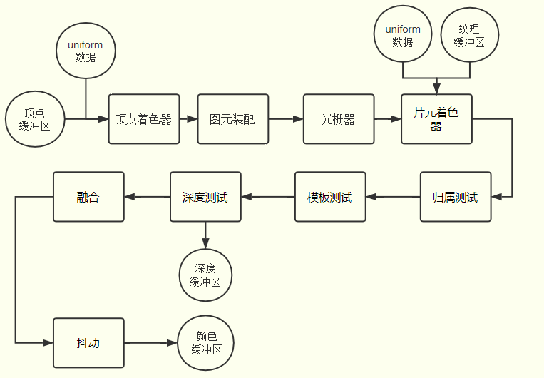

# 快速入门



## 绘制一个点

[draw-point](embedded-codesandbox://webgl-zero-based-practice-learn/draw-point)

### 着色器代码放在 script 标签中

```html
<!-- 顶点着色器源码 -->
<script id="vertexShader" type="x-shader/x-vertex">
  void main() {
    // 给内置变量 gl_PointSize 赋值像素大小
    gl_PointSize = 20.0;
    // 顶点位置，位于坐标原点
    gl_Position = vec4(0.0, 0.0, 0.0, 1.0);
  }
</script>
<!-- 片元着色器源码 -->
<script id="fragmentShader" type="x-shader/x-fragment">
  void main() {
    gl_FragColor = vec4(1.0, 0.0, 0.0, 1.0);
  }
</script>
```

```js
// 顶点着色器源码
var vertexShaderSource = document.getElementById('vertexShader').innerText;
// 片元着色器源码
var fragShaderSource = document.getElementById('fragmentShader').innerText;
// 初始化着色器
var program = initShader(gl, vertexShaderSource, fragShaderSource);
```

## 绘制一个矩形

[draw-rect](embedded-codesandbox://webgl-zero-based-practice-learn/draw-rect)

### attribute 关键字

声明顶点相关数据的时候需要用到 attribute 关键字，目的是为了 javascript 可以调用相关的 WebGL API 把顶点相关数据从 javascript 传递给顶点着色器 attribute 声明的变量。

### drawArrays 整体执行顺序


### 硬件相关

- 着色器语言编写的程序称为着色器程序(shader program)，在 GPU 顶点着色器单元上执行的是顶点着色器程序，在 GPU 片元着色器单元上执行的是片元着色器程序。

  顶点着色器

  ```glsl
  // attribute 声明 vec4 类型变量 apos
  attribute vec4 apos;
  void main() {
      // 顶点坐标 apos 赋值给内置变量 gl_Position
      // 逐顶点处理数据
      gl_Position = apos;
  }
  ```

  片元着色器

  ```glsl
  void main() {
      // 逐片元处理数据，所有片元(像素)设置为红色
      gl_FragColor = vec4(1.0,0.0,0.0,1.0);
  }
  ```

- 可编程顶点处理器(Programmable Vertex Processor)又称为顶点着色器，用来执行顶点着色器程序
- 可编程片元处理器(Programmable Fragment Processor)又称为片元着色器，用来执行片元着色器程序
- GPU 中有各种专门的寄存器，比如用来接收顶点坐标数据的寄存器是输入寄存器，从数据类型的角度看属于浮点寄存器，用来临时存储浮点数；存储输出到显示器像素的帧缓存是输出寄存器，从处理速度的角度看是数据缓冲寄存器，GPU 处理数据的速度要比显示器扫描帧缓存中像素数据的速度要快得多
- 显示器像素是显示器可以通过 RGB 值控制的最小单位，一幅图像是由大量像素点累积显示。着色器中的颜色定义会反映在显示器中
- 显示器的分辨率就是显示器长度方向像素点的个数 X 显示器宽度方向像素点的个数
- 屏幕相邻的两个像素单元的距离就是点距，点距越小显示效果越好，一般现在显示器 0.2mm~0.4mm 之间

## WebGL 坐标系—投影

[coordinate-system-projection](embedded-codesandbox://webgl-zero-based-practice-learn/coordinate-system-projection)

1. canvas 画布宽高采用的是像素值定义，以显示器为准，WebGL 中顶点坐标的表示方法采用的是相对坐标，相对于 canvas 而言 WebGL 坐标系统，X 轴水平向右，也就是 canvas 画布的 width 表示的宽度方向，x 等于 -1 表示 canvas 画布的左边界，x 等于 1 表示 canvas 画布的右边界，x 等于 0 对应的是画布宽度方向的中间。
2. WebGL 坐标系统，Y 轴竖直向上，也就是 canvas 画布的 height 表示的高度方向，y 等于 -1 表示 canvas 画布的下边界，y 等于 1 表示 canvas 画布的上边界，y 等于 0 对应的是画布高度方向的中间。
3. WebGL 坐标系统，Z 轴垂直 canvas 画布朝外，Z 值 -1 和 1 是 Z 方向的极限值，GPU 成像默认的沿着 Z 轴投影，你也可以抽象出一个概念，人眼睛位于 z 轴上，沿着 z 轴方向去观察物体，如果你在其他的书上看到视图坐标系等其它各类坐标系都是抽象出的概念都是建立在本节课所说的 WebGL 坐标系统之上，例如无人机导航中的所说的机体坐标系、地球坐标系都是直接对现实中事物的描述，三维场景中的各类坐标系与无人机中坐标系没什么区别，但是要显示在屏幕上，就要经过一些处理，这里不再详述，后面的教程后为大家引入各类坐标系概念，正射投影和透射投影概念。

// TODO http://www.yanhuangxueyuan.com/WebGL/
