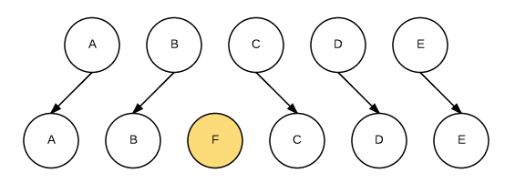

React 中最神奇的部分莫过于虚拟 DOM，以及其高效的 Diff 算法。这让我们可以无需担心性能问题而“毫无顾忌”的随时“刷新”整个页面，由虚拟 DOM 来确保只对界面上真正变化的部分进行实际的 DOM 操作。React 在这一部分已经做到足够透明，在实际开发中我们基本无需关心虚拟 DOM 是如何运作的。然而，作为有态度的程序员，我们总是对技术背后的原理充满着好奇。理解其运行机制不仅有助于更好的理解 React 组件的生命周期，而且对于进一步优化 React 程序也会有很大帮助。

# 什么是 DOM Diff 算法

Web 界面由 DOM 树来构成，当其中某一部分发生变化时，其实就是对应的某个 DOM 节点发生了变化。在 React 中，构建 UI 界面的思路是由当前状态决定界面。前后两个状态就对应两套界面，然后由 React 来比较两个界面的区别，这就需要对 DOM 树进行 Diff 算法分析。

即给定任意两棵树，找到最少的转换步骤。但是标准的的 Diff 算法复杂度需要 O(n^3)，这显然无法满足性能要求。要达到每次界面都可以整体刷新界面的目的，势必需要对算法进行优化。这看上去非常有难度，然而 Facebook 工程师却做到了，他们结合 Web 界面的特点做出了两个简单的假设，使得 Diff 算法复杂度直接降低到 O(n)

1. 两个相同组件产生类似的 DOM 结构，不同的组件产生不同的 DOM 结构；
2. 对于同一层次的一组子节点，它们可以通过唯一的 id 进行区分。

算法上的优化是 React 整个界面 Render 的基础，事实也证明这两个假设是合理而精确的，保证了整体界面构建的性能。

# 不同节点类型的比较

为了在树之间进行比较，我们首先要能够比较两个节点，在 React 中即比较两个虚拟 DOM 节点，当两个节点不同时，应该如何处理。这分为两种情况：（1）节点类型不同；（2）节点类型相同，但是属性不同。本节先看第一种情况。

当在树中的同一位置前后输出了不同类型的节点，React 直接删除前面的节点，然后创建并插入新的节点。假设我们在树的同一位置前后两次输出不同类型的节点。

```js
renderA: <div />
renderB: <span />
=> [removeNode <div />], [insertNode <span />]
```

当一个节点从 div 变成 span 时，简单的直接删除 div 节点，并插入一个新的 span 节点。这符合我们对真实 DOM 操作的理解。

需要注意的是，删除节点意味着彻底销毁该节点，而不是再后续的比较中再去看是否有另外一个节点等同于该删除的节点。如果该删除的节点之下有子节点，那么这些子节点也会被完全删除，它们也不会用于后面的比较。这也是算法复杂能够降低到 O（n）的原因。

上面提到的是对虚拟 DOM 节点的操作，而同样的逻辑也被用在 React 组件的比较，例如：

```js
renderA: <Header />
renderB: <Content />
=> [removeNode <Header />], [insertNode <Content />]
```

当 React 在同一个位置遇到不同的组件时，也是简单的销毁第一个组件，而把新创建的组件加上去。这正是应用了第一个假设，不同的组件一般会产生不一样的 DOM 结构，与其浪费时间去比较它们基本上不会等价的 DOM 结构，还不如完全创建一个新的组件加上去。

由这一 React 对不同类型的节点的处理逻辑我们很容易得到推论，那就是 React 的 DOM Diff 算法实际上只会对树进行逐层比较，如下所述。

# 逐层进行节点比较

提到树，相信大多数同学立刻想到的是二叉树，遍历，最短路径等复杂的数据结构算法。而在 React 中，树的算法其实非常简单，那就是两棵树只会对同一层次的节点进行比较。如下图所示：


React 只会对相同颜色方框内的 DOM 节点进行比较，即同一个父节点下的所有子节点。当发现节点已经不存在，则该节点及其子节点会被完全删除掉，不会用于进一步的比较。这样只需要对树进行一次遍历，便能完成整个 DOM 树的比较。

例如，考虑有下面的 DOM 结构转换：


A 节点被整个移动到 D 节点下，直观的考虑 DOM Diff 操作应该是

```js
A.parent.remove(A);
D.append(A);
```

但因为 React 只会简单的考虑同层节点的位置变换，对于不同层的节点，只有简单的创建和删除。当根节点发现子节点中 A 不见了，就会直接销毁 A；而当 D 发现自己多了一个子节点 A，则会创建一个新的 A 作为子节点。因此对于这种结构的转变的实际操作是：

```js
A.destroy();
A = new A();
A.append(new B());
A.append(new C());
D.append(A);
```

可以看到，以 A 为根节点的树被整个重新创建。

虽然看上去这样的算法有些“简陋”，但是其基于的是第一个假设：两个不同组件一般产生不一样的 DOM 结构。根据 React 官方博客，这一假设至今为止没有导致严重的性能问题。这当然也给我们一个提示，在实现自己的组件时，保持稳定的 DOM 结构会有助于性能的提升。例如，我们有时可以通过 CSS 隐藏或显示某些节点，而不是真的移除或添加 DOM 节点。

# 由 DOM Diff 算法理解组件的生命周期

在上一篇文章中介绍了 React 组件的生命周期，其中的每个阶段其实都是和 DOM Diff 算法息息相关的。例如以下几个方法：

- constructor: 构造函数，组件被创建时执行；
- componentDidMount: 当组件添加到 DOM 树之后执行；
- componentWillUnmount: 当组件从 DOM 树中移除之后执行，在 React 中可以认为组件被销毁；
- componentDidUpdate: 当组件更新时执行。

为了演示组件生命周期和 DOM Diff 算法的关系，笔者创建了一个示例：https://supnate.github.io/react-dom-diff/index.html ，大家可以直接访问试用。这时当 DOM 树进行如下转变时，即从“shape1”转变到“shape2”时。我们来观察这几个方法的执行情况：


浏览器开发工具控制台输出如下结果：

```js
C will unmount.
C is created.
B is updated.
A is updated.
C did mount.
D is updated.
R is updated.
```

可以看到，C 节点是完全重建后再添加到 D 节点之下，而不是将其“移动”过去。如果大家有兴趣，也可以 fork 示例代码：https://github.com/supnate/react-dom-diff 。从而可以自己添加其它树结构，试验它们之间是如何转换的。

# 相同类型节点的比较

第二种节点的比较是相同类型的节点，算法就相对简单而容易理解。React 会对属性进行重设从而实现节点的转换。例如：

```js
renderA: <div id="before" />
renderB: <div id="after" />
=> [replaceAttribute id "after"]
```

虚拟 DOM 的 style 属性稍有不同，其值并不是一个简单字符串而必须为一个对象，因此转换过程如下：

```js
renderA: <div style={{color: 'red'}} />
renderB: <div style={{fontWeight: 'bold'}} />
=> [removeStyle color], [addStyle font-weight 'bold']
```

# 列表节点的比较

上面介绍了对于不在同一层的节点的比较，即使它们完全一样，也会销毁并重新创建。那么当它们在同一层时，又是如何处理的呢？这就涉及到列表节点的 Diff 算法。相信很多使用 React 的同学大多遇到过这样的警告：


这是 React 在遇到列表时却又找不到 key 时提示的警告。虽然无视这条警告大部分界面也会正确工作，但这通常意味着潜在的性能问题。因为 React 觉得自己可能无法高效的去更新这个列表。

列表节点的操作通常包括添加、删除和排序。例如下图，我们需要往 B 和 C 直接插入节点 F，在 jQuery 中我们可能会直接使用\$(B).after(F)来实现。而在 React 中，我们只会告诉 React 新的界面应该是 A-B-F-C-D-E，由 Diff 算法完成更新界面。


这时如果每个节点都没有唯一的标识，React 无法识别每一个节点，那么更新过程会很低效，即，将 C 更新成 F，D 更新成 C，E 更新成 D，最后再插入一个 E 节点。效果如下图所示：


可以看到，React 会逐个对节点进行更新，转换到目标节点。而最后插入新的节点 E，涉及到的 DOM 操作非常多。而如果给每个节点唯一的标识（key），那么 React 能够找到正确的位置去插入新的节点，入下图所示：



对于列表节点顺序的调整其实也类似于插入或删除，下面结合示例代码我们看下其转换的过程。仍然使用前面提到的示例：https://supnate.github.io/react-dom-diff/index.html ，我们将树的形态从 shape5 转换到 shape6：


即将同一层的节点位置进行调整。如果未提供 key，那么 React 认为 B 和 C 之后的对应位置组件类型不同，因此完全删除后重建，控制台输出如下：

```js
B will unmount.
C will unmount.
C is created.
B is created.
C did mount.
B did mount.
A is updated.
R is updated.
```

而如果提供了 key，如下面的代码：

```js
shape5: function() {
  return (
    <Root>
      <A>
        <B key="B" />
        <C key="C" />
      </A>
    </Root>
  );
},

shape6: function() {
  return (
    <Root>
      <A>
        <C key="C" />
        <B key="B" />
      </A>
    </Root>
  );
},
```

那么控制台输出如下：

```js
C is updated.
B is updated.
A is updated.
R is updated.
```

可以看到，对于列表节点提供唯一的 key 属性可以帮助 React 定位到正确的节点进行比较，从而大幅减少 DOM 操作次数，提高了性能。

# 小结

本文分析了 React 的 DOM Diff 算法究竟是如何工作的，其复杂度控制在了 O（n），这让我们考虑 UI 时可以完全基于状态来每次 render 整个界面而无需担心性能问题，简化了 UI 开发的复杂度。而算法优化的基础是文章开头提到的两个假设，以及 React 的 UI 基于组件这样的一个机制。理解虚拟 DOM Diff 算法不仅能够帮助我们理解组件的生命周期，而且也对我们实现自定义组件时如何进一步优化性能具有指导意义。
