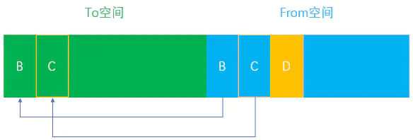
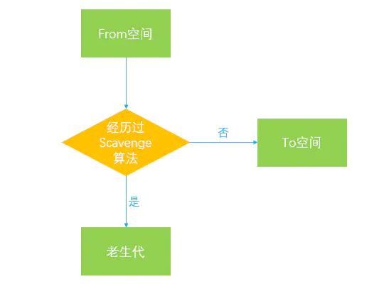

# 背景

作为目前最流行的 JavaScript 引擎，V8 引擎从出现的那一刻起便广泛受到人们的关注，我们知道 JavaScript 可以高效地运行在浏览器和 Nodejs 这两大宿主环境中，也是因为背后有强大的 V8 引擎在为其保驾护航，甚至成就了 Chrome 在浏览器中的霸主地位。不得不说，V8 引擎为了追求极致的性能和更好的用户体验，为我们做了太多太多，从原始的 Full-codegen 和 Crankshaft 编译器升级为 Ignition 解释器和 TurboFan 编译器的强强组合，到隐藏类、内联缓存和 HotSpot 热点代码收集等一系列强有力的优化策略，V8 引擎正在努力降低整体的内存占用和提升到更高的运行性能。

本篇主要是从 V8 引擎的垃圾回收机制入手，讲解一下在 JavaScript 代码执行的整个生命周期中 V8 引擎是采取怎样的垃圾回收策略来减少内存占比的，当然这部分的知识并不太影响我们写代码的流程，毕竟在一般情况下我们很少会遇到浏览器端出现内存溢出而导致程序崩溃的情况，但是至少我们对这方面有一定的了解之后，能增强我们在写代码过程中对减少内存占用，避免内存泄漏的主观意识，也许能够帮助你写出更加健壮和对 V8 引擎更加友好的代码。

# 为何需要垃圾回收

在 V8 引擎逐行执行 JavaScript 代码的过程中，当遇到函数的情况时，会为其创建一个函数执行上下文(Context)环境并添加到调用堆栈的栈顶，函数的作用域(handleScope)中包含了该函数中声明的所有变量，当该函数执行完毕后，对应的执行上下文从栈顶弹出，函数的作用域会随之销毁，其包含的所有变量也会统一释放并被自动回收。试想如果在这个作用域被销毁的过程中，其中的变量不被回收，即持久占用内存，那么必然会导致内存暴增，从而引发内存泄漏导致程序的性能直线下降甚至崩溃，因此内存在使用完毕之后理当归还给操作系统以保证内存的重复利用。

> 这个过程就好比你向亲戚朋友借钱，借得多了却不按时归还，那么你再下次借钱的时候肯定没有那么顺利了，或者说你的亲戚朋友不愿意再借你了，导致你的手头有点儿紧(内存泄漏，性能下降)，所以说有借有还，再借不难嘛，毕竟出来混都是要还的。

但是 JavaScript 作为一门高级编程语言，并不像 C 语言或 C++ 语言中需要手动地申请分配和释放内存，V8 引擎已经帮我们自动进行了内存的分配和管理，好让我们有更多的精力去专注于业务层面的复杂逻辑，这对于我们前端开发人员来说是一项福利，但是随之带来的问题也是显而易见的，那就是由于不用去手动管理内存，导致写代码的过程中不够严谨从而容易引发内存泄漏。

# V8 引擎的内存限制

虽然 V8 引擎帮助我们实现了自动的垃圾回收管理，解放了我们勤劳的双手，但 V8 引擎中的内存使用也并不是无限制的。具体来说，默认情况下，V8 引擎在 64 位系统下最多只能使用约 1.4GB 的内存，在 32 位系统下最多只能使用约 0.7GB 的内存，在这样的限制下，必然会导致在 node 中无法直接操作大内存对象，比如将一个 2GB 大小的文件全部读入内存进行字符串分析处理，即使物理内存高达 32GB 也无法充分利用计算机的内存资源，那么为什么会有这种限制呢？这个要回到 V8 引擎的设计之初，起初只是作为浏览器端 JavaScript 的执行环境，在浏览器端我们其实很少会遇到使用大量内存的场景，因此也就没有必要将最大内存设置得过高。但这只是一方面，其实还有另外两个主要的原因：

## JS 单线程机制

作为浏览器的脚本语言，JS 的主要用途是与用户交互以及操作 DOM，那么这也决定了其作为单线程的本质，单线程意味着执行的代码必须按顺序执行，在同一时间只能处理一个任务。试想如果 JS 是多线程的，一个线程在删除 DOM 元素的同时，另一个线程对该元素进行修改操作，那么必然会导致复杂的同步问题。既然 JS 是单线程的，那么也就意味着在 V8 执行垃圾回收时，程序中的其他各种逻辑都要进入暂停等待阶段，直到垃圾回收结束后才会再次重新执行 JS 逻辑。因此，由于 JS 的单线程机制，垃圾回收的过程阻碍了主线程逻辑的执行。

> 虽然 JS 是单线程的，但是为了能够充分利用操作系统的多核 CPU 计算能力，在 HTML5 中引入了新的 Web Worker 标准，其作用就是为 JS 创造多线程环境，允许主线程创建 Worker 线程，将一些任务分配给后者运行。在主线程运行的同时，Worker 在后台运行，两者互不干扰。等到 Worker 线程完成计算任务，再把结果返回给主线程。这样的好处是， 一些计算密集型或高延迟的任务，被 Worker 线程负担，主线程(通常负责 UI 交互)就会很流畅，不会被阻塞或者拖慢。Web Worker 不是 JS 的一部分，而是通过 JS 访问的浏览器特性，其虽然创造了一个多线程的执行环境，但是子线程完全受主线程控制，不能访问浏览器特定的 API，例如操作 DOM，因此这个新标准并没有改变 JS 单线程的本质。

## 垃圾回收机制

垃圾回收本身也是一件非常耗时的操作，假设 V8 的堆内存为 1.5G，那么 V8 做一次小的垃圾回收需要 50ms 以上，而做一次非增量式回收甚至需要 1s 以上，可见其耗时之久，而在这 1s 的时间内，浏览器一直处于等待的状态，同时会失去对用户的响应，如果有动画正在运行，也会造成动画卡顿掉帧的情况，严重影响应用程序的性能。因此如果内存使用过高，那么必然会导致垃圾回收的过程缓慢，也就会导致主线程的等待时间越长，浏览器也就越长时间得不到响应。

基于以上两点，V8 引擎为了减少对应用的性能造成的影响，采用了一种比较粗暴的手段，那就是直接限制堆内存的大小，毕竟在浏览器端一般也不会遇到需要操作几个 G 内存这样的场景。但是在 node 端，涉及到的 I/O 操作可能会比浏览器端更加复杂多样，因此更有可能出现内存溢出的情况。不过也没关系，V8 为我们提供了可配置项来让我们手动地调整内存大小，但是需要在 node 初始化的时候进行配置，我们可以通过如下方式来手动设置。

我们尝试在 node 命令行中输入以下命令：

> 本地安装的 node 版本为 v10.14.2，可通过 node -v 查看本地 node 的版本号，不同版本可能会导致下面的命令会有所差异。

```bash
// 该命令可以用来查看 node 中可用的 V8 引擎的选项及其含义
node --v8-options
```

然后我们会在命令行窗口中看到大量关于 V8 的选项，这里我们暂且只关注图中红色选框中的几个选项：


```bash
// 设置新生代内存中单个半空间的内存最小值，单位 MB
node --min-semi-space-size=1024 xxx.js

// 设置新生代内存中单个半空间的内存最大值，单位 MB
node --max-semi-space-size=1024 xxx.js

// 设置老生代内存最大值，单位 MB
node --max-old-space-size=2048 xxx.js
```

通过以上方法便可以手动放宽 V8 引擎所使用的内存限制，同时 node 也为我们提供了 process.memoryUsage() 方法来让我们可以查看当前 node 进程所占用的实际内存大小。


在上图中，包含的几个字段的含义分别如下所示，单位均为字节：

- heapTotal：表示 V8 当前申请到的堆内存总大小。
- heapUsed：表示当前内存使用量。
- external：表示 V8 内部的 C++ 对象所占用的内存。
- rss(resident set size)：表示驻留集大小，是给这个 node 进程分配了多少物理内存，这些物理内存中包含堆，栈和代码片段。对象，闭包等存于堆内存，变量存于栈内存，实际的 JavaScript 源代码存于代码段内存。使用 Worker 线程时，rss 将会是一个对整个进程有效的值，而其他字段则只针对当前线程。

> 在 JS 中声明对象时，该对象的内存就分配在堆中，如果当前已申请的堆内存已经不够分配新的对象，则会继续申请堆内存直到堆的大小超过 V8 的限制为止。

# V8 的垃圾回收策略

V8 的垃圾回收策略主要是基于分代式垃圾回收机制，其根据对象的存活时间将内存的垃圾回收进行不同的分代，然后对不同的分代采用不同的垃圾回收算法。

## V8 的内存结构

在 V8 引擎的堆结构组成中，其实除了新生代和老生代外，还包含其他几个部分，但是垃圾回收的过程主要出现在新生代和老生代，所以对于其他的部分我们没必要做太多的深入，V8 的内存结构主要由以下几个部分组成：

- 新生代(new_space)：大多数的对象开始都会被分配在这里，这个区域相对较小但是垃圾回收特别频繁，该区域被分为两半，一半用来分配内存，另一半用于在垃圾回收时将需要保留的对象复制过来。
- 老生代(old_space)：新生代中的对象在存活一段时间后就会被转移到老生代内存区，相对于新生代该内存区域的垃圾回收频率较低。老生代又分为老生代指针区和老生代数据区，前者包含大多数可能存在指向其他对象的指针的对象，后者只保存原始数据对象，这些对象没有指向其他对象的指针。
- 大对象区(large_object_space)：存放体积超越其他区域大小的对象，每个对象都会有自己的内存，垃圾回收不会移动大对象区。
- 代码区(code_space)：代码对象，会被分配在这里，唯一拥有执行权限的内存区域。
- map 区(map_space)：存放 Cell 和 Map，每个区域都是存放相同大小的元素，结构简单。

内存结构图如下所示：


上图中的带斜纹的区域代表暂未使用的内存，新生代(new_space)被划分为了两个部分，其中一部分叫做 inactive new space，表示暂未激活的内存区域，另一部分为激活状态，为什么会划分为两个部分呢，在下一小节我们会讲到。

## 新生代

在 V8 引擎的内存结构中，新生代主要用于存放存活时间较短的对象。新生代内存是由两个 semispace(半空间) 构成的，内存最大值在 64 位系统和 32 位系统上分别为 32MB 和 16MB，在新生代的垃圾回收过程中主要采用了 Scavenge 算法。

Scavenge 算法是一种典型的牺牲空间换取时间的算法，对于老生代内存来说，可能会存储大量对象，如果在老生代中使用这种算法，势必会造成内存资源的浪费，但是在新生代内存中，大部分对象的生命周期较短，在时间效率上表现可观，所以还是比较适合这种算法。

> 在 Scavenge 算法的具体实现中，主要采用了 Cheney 算法，它将新生代内存一分为二，每一个部分的空间称为 semispace，也就是我们在上图中看见的 new_space 中划分的两个区域，其中处于激活状态的区域我们称为 From 空间，未激活(inactive new space)的区域我们称为 To 空间。这两个空间中，始终只有一个处于使用状态，另一个处于闲置状态。我们的程序中声明的对象首先会被分配到 From 空间，当进行垃圾回收时，如果 From 空间中尚有存活对象，则会被复制到 To 空间进行保存，非存活的对象会被自动回收。当复制完成后，From 空间和 To 空间完成一次角色互换，To 空间会变为新的 From 空间，原来的 From 空间则变为 To 空间。

基于以上算法，我们可以画出如下的流程图：

- 假设我们在 From 空间中分配了三个对象 A、B、C 
- 当程序主线程任务第一次执行完毕后进入垃圾回收时，发现对象 A 已经没有其他引用，则表示可以对其进行回收 
- 对象 B 和对象 C 此时依旧处于活跃状态，因此会被复制到 To 空间中进行保存 
- 接下来将 From 空间中的所有非存活对象全部清除 
- 此时 From 空间中的内存已经清空，开始和 To 空间完成一次角色互换 
- 当程序主线程在执行第二个任务时，在 From 空间中分配了一个新对象 D 
- 任务执行完毕后再次进入垃圾回收，发现对象 D 已经没有其他引用，表示可以对其进行回收 
- 对象 B 和对象 C 此时依旧处于活跃状态，再次被复制到 To 空间中进行保存 
- 再次将 From 空间中的所有非存活对象全部清除 
- From 空间和 To 空间继续完成一次角色互换 

通过以上的流程图，我们可以很清楚地看到，Scavenge 算法的垃圾回收过程主要就是将存活对象在 From 空间和 To 空间之间进行复制，同时完成两个空间之间的角色互换，因此该算法的缺点也比较明显，浪费了一半的内存用于复制。

## 对象晋升

当一个对象在经过多次复制之后依旧存活，那么它会被认为是一个生命周期较长的对象，在下一次进行垃圾回收时，该对象会被直接转移到老生代中，这种对象从新生代转移到老生代的过程我们称之为晋升。

对象晋升的条件主要有以下两个：

- 对象是否经历过一次 Scavenge 算法
- To 空间的内存占比是否已经超过 25%

默认情况下，我们创建的对象都会分配在 From 空间中，当进行垃圾回收时，在将对象从 From 空间复制到 To 空间之前，会先检查该对象的内存地址来判断是否已经经历过一次 Scavenge 算法，如果地址已经发生变动则会将该对象转移到老生代中，不会再被复制到 To 空间，可以用以下的流程图来表示：



如果对象没有经历过 Scavenge 算法，会被复制到 To 空间，但是如果此时 To 空间的内存占比已经超过 25%，则该对象依旧会被转移到老生代，如下图所示:


之所以有 25% 的内存限制是因为 To 空间在经历过一次 Scavenge 算法后会和 From 空间完成角色互换，会变为 From 空间，后续的内存分配都是在 From 空间中进行的，如果内存使用过高甚至溢出，则会影响后续对象的分配，因此超过这个限制之后对象会被直接转移到老生代来进行管理。

## 老生代

在老生代中，因为管理着大量的存活对象，如果依旧使用 Scavenge 算法的话，很明显会浪费一半的内存，因此已经不再使用 Scavenge 算法，而是采用新的算法 Mark-Sweep(标记清除) 和 Mark-Compact(标记整理) 来进行管理。

在早前我们可能听说过一种算法叫做引用计数，该算法的原理比较简单，就是看对象是否还有其他引用指向它，如果没有指向该对象的引用，则该对象会被视为垃圾并被垃圾回收器回收，示例如下：

```js
// 创建了两个对象 obj1 和 obj2，其中 obj2 作为 obj1 的属性被 obj1 引用，因此不会被垃圾回收
let obj1 = {
  obj2: {
    a: 1
  }
};

// 创建 obj3 并将 obj1 赋值给 obj3，让两个对象指向同一个内存地址
let obj3 = obj1;

// 将 obj1 重新赋值，此时原来 obj1 指向的对象现在只由 obj3 来表示
obj1 = null;

// 创建 obj4 并将 obj3.obj2 赋值给 obj4
// 此时 obj2 所指向的对象有两个引用：一个是作为 obj3 的属性，另一个是变量 obj4
let obj4 = obj3.obj2;

// 将 obj3 重新赋值，此时本可以对 obj3 指向的对象进行回收，但是因为 obj3.obj2 被 obj4 所引用，因此依旧不能被回收
obj3 = null;

// 此时 obj3.obj2 已经没有指向它的引用，因此 obj3 指向的对象在此时可以被回收
obj4 = null;
```

上述例子在经过一系列操作后最终对象会被垃圾回收，但是一旦我们碰到循环引用的场景，就会出现问题，我们看下面的例子：

```js
function foo() {
  let a = {};
  let b = {};
  a.a1 = b;
  b.b1 = a;
}
foo();
```

这个例子中我们将对象 a 的 a1 属性指向对象 b，将对象 b 的 b1 属性指向对象 a，形成两个对象相互引用，在 foo 函数执行完毕后，函数的作用域已经被销毁，作用域中包含的变量 a 和 b 本应该可以被回收，但是因为采用了引用计数的算法，两个变量均存在指向自身的引用，因此依旧无法被回收，导致内存泄漏。

因此为了避免循环引用导致的内存泄漏问题，截至 2012 年所有的现代浏览器均放弃了这种算法，转而采用新的 Mark-Sweep(标记清除) 和 Mark-Compact(标记整理) 算法。在上面循环引用的例子中，因为变量 a 和变量 b 无法从 window 全局对象访问到，因此无法对其进行标记，所以最终会被回收。

Mark-Sweep(标记清除) 分为标记和清除两个阶段，在标记阶段会遍历堆中的所有对象，然后标记活着的对象，在清除阶段中，会将死亡的对象进行清除。Mark-Sweep 算法主要是通过判断某个对象是否可以被访问到，从而知道该对象是否应该被回收，具体步骤如下：

- 垃圾回收器会在内部构建一个根列表，用于从根节点出发去寻找那些可以被访问到的变量。比如在 JavaScript 中，window 全局对象可以看成一个根节点。
- 然后，垃圾回收器从所有根节点出发，遍历其可以访问到的子节点，并将其标记为活动的，根节点不能到达的地方即为非活动的，将会被视为垃圾。
- 最后，垃圾回收器将会释放所有非活动的内存块，并将其归还给操作系统。

> 以下几种情况都可以作为根节点：
>
> 1. 全局对象
> 2. 本地函数的局部变量和参数
> 3. 当前嵌套调用链上的其他函数的变量和参数


但是 Mark-Sweep 算法存在一个问题，就是在经历过一次标记清除后，内存空间可能会出现不连续的状态，因为我们所清理的对象的内存地址可能不是连续的，所以就会出现内存碎片的问题，导致后面如果需要分配一个大对象而空闲内存不足以分配，就会提前触发垃圾回收，而这次垃圾回收其实是没必要的，因为我们确实有很多空闲内存，只不过是不连续的。

为了解决这种内存碎片的问题，Mark-Compact(标记整理) 算法被提了出来，该算法主要就是用来解决内存的碎片化问题的，回收过程中将死亡对象清除后，在整理的过程中，会将活动的对象往堆内存的一端进行移动，移动完成后再清理掉边界外的全部内存，我们可以用如下流程图来表示：

- 假设在老生代中有 A、B、C、D 四个对象 
- 在垃圾回收的标记阶段，将对象 A 和对象 C 标记为活动的 
- 在垃圾回收的整理阶段，将活动的对象往堆内存的一端移动 
- 在垃圾回收的清除阶段，将活动对象左侧的内存全部回收 

至此就完成了一次老生代垃圾回收的全部过程，我们在前文中说过，由于 JS 的单线程机制，垃圾回收的过程会阻碍主线程同步任务的执行，待执行完垃圾回收后才会再次恢复执行主任务的逻辑，这种行为被称为全停顿(stop-the-world)。在标记阶段同样会阻碍主线程的执行，一般来说，老生代会保存大量存活的对象，如果在标记阶段将整个堆内存遍历一遍，那么势必会造成严重的卡顿。

因此，为了减少垃圾回收带来的停顿时间，V8 引擎又引入了 Incremental Marking(增量标记) 的概念，即将原本需要一次性遍历堆内存的操作改为增量标记的方式，先标记堆内存中的一部分对象，然后暂停，将执行权重新交给 JS 主线程，待主线程任务执行完毕后再从原来暂停标记的地方继续标记，直到标记完整个堆内存。这个理念其实有点像 React 框架中的 Fiber 架构，只有在浏览器的空闲时间才会去遍历 Fiber Tree 执行对应的任务，否则延迟执行，尽可能少地影响主线程的任务，避免应用卡顿，提升应用性能。

得益于增量标记的好处，V8 引擎后续继续引入了延迟清理(lazy sweeping)和增量式整理(incremental compaction)，让清理和整理的过程也变成增量式的。同时为了充分利用多核 CPU 的性能，也将引入并行标记和并行清理，进一步地减少垃圾回收对主线程的影响，为应用提升更多的性能。

# 如何避免内存泄漏

在我们写代码的过程中，基本上都不太会关注写出怎样的代码才能有效地避免内存泄漏，或者说浏览器和大部分的前端框架在底层已经帮助我们处理了常见的内存泄漏问题，但是我们还是有必要了解一下常见的几种避免内存泄漏的方式，毕竟在面试过程中也是经常考察的要点。

## 尽可能少地创建全局变量

在 ES5 中以 var 声明的方式在全局作用域中创建一个变量时，或者在函数作用域中不以任何声明的方式创建一个变量时，都会无形地挂载到 window 全局对象上，如下所示：

```js
var a = 1; // 等价于 window.a = 1;
```

```js
function foo() {
  a = 1;
}
```

等价于

```js
function foo() {
  window.a = 1;
}
```

我们在 foo 函数中创建了一个变量 a 但是忘记使用 var 来声明，此时会意想不到地创建一个全局变量并挂载到 window 对象上，另外还有一种比较隐蔽的方式来创建全局变量：

```js
function foo() {
  this.a = 1;
}
foo(); // 相当于 window.foo()
```

当 foo 函数在调用时，它所指向的运行上下文环境为 window 全局对象，因此函数中的 this 指向的其实是 window，也就无意创建了一个全局变量。当进行垃圾回收时，在标记阶段因为 window 对象可以作为根节点，在 window 上挂载的属性均可以被访问到，并将其标记为活动的从而常驻内存，因此也就不会被垃圾回收，只有在整个进程退出时全局作用域才会被销毁。如果你遇到需要必须使用全局变量的场景，那么请保证一定要在全局变量使用完毕后将其设置为 null 从而触发回收机制。

## 手动清除定时器

在我们的应用中经常会有使用 setTimeout 或者 setInterval 等定时器的场景，定时器本身是一个非常有用的功能，但是如果我们稍不注意，忘记在适当的时间手动清除定时器，那么很有可能就会导致内存泄漏，示例如下：

```js
const numbers = [];
const foo = function() {
  for (let i = 0; i < 100000; i++) {
    numbers.push(i);
  }
};
window.setInterval(foo, 1000);
```

在这个示例中，由于我们没有手动清除定时器，导致回调任务会不断地执行下去，回调中所引用的 numbers 变量也不会被垃圾回收，最终导致 numbers 数组长度无限递增，从而引发内存泄漏。

## 少用闭包

闭包是 JS 中的一个高级特性，巧妙地利用闭包可以帮助我们实现很多高级功能。一般来说，我们在查找变量时，在本地作用域中查找不到就会沿着作用域链从内向外单向查找，但是闭包的特性可以让我们在外部作用域访问内部作用域中的变量，示例如下：

```js
function foo() {
  let local = 123;
  return function() {
    return local;
  };
}
const bar = foo();
console.log(bar()); // -> 123
```

在这个示例中，foo 函数执行完毕后会返回一个匿名函数，该函数内部引用了 foo 函数中的局部变量 local，并且通过变量 bar 来引用这个匿名的函数定义，通过这种闭包的方式我们就可以在 foo 函数的外部作用域中访问到它的局部变量 local。一般情况下，当 foo 函数执行完毕后，它的作用域会被销毁，但是由于存在变量引用其返回的匿名函数，导致作用域无法得到释放，也就导致 local 变量无法回收，只有当我们取消掉对匿名函数的引用才会进入垃圾回收阶段。

## 清除 DOM 引用

以往我们在操作 DOM 元素时，为了避免多次获取 DOM 元素，我们会将 DOM 元素存储在一个数据字典中，示例如下：

```js
const elements = {
  button: document.getElementById('button')
};

function removeButton() {
  document.body.removeChild(document.getElementById('button'));
}
```

在这个示例中，我们想调用 removeButton 方法来清除 button 元素，但是由于在 elements 字典中存在对 button 元素的引用，所以即使我们通过 removeChild 方法移除了 button 元素，它其实还是依旧存储在内存中无法得到释放，只有我们手动清除对 button 元素的引用才会被垃圾回收。

## 弱引用

通过前几个示例我们会发现如果我们一旦疏忽，就会容易地引发内存泄漏的问题，为此，在 ES6 中为我们新增了两个有效的数据结构 WeakMap 和 WeakSet，就是为了解决内存泄漏的问题而诞生的。其表示弱引用，它的键名所引用的对象均是弱引用，弱引用是指垃圾回收的过程中不会将键名对该对象的引用考虑进去，只要所引用的对象没有其他的引用了，垃圾回收机制就会释放该对象所占用的内存。这也就意味着我们不需要关心 WeakMap 中键名对其他对象的引用，也不需要手动地进行引用清除，我们尝试在 node 中演示一下过程(参考阮一峰 ES6 标准入门中的示例，自己手动实现了一遍)。

首先打开 node 命令行，输入以下命令：

```bash
node --expose-gc // --expose-gc 表示允许手动执行垃圾回收机制
```

然后我们执行下面的代码

```js
// 手动执行一次垃圾回收保证内存数据准确
> global.gc();
undefined

// 查看当前占用的内存，主要关心 heapUsed 字段，大小约为 4.4MB
> process.memoryUsage();
{ rss: 21626880,
  heapTotal: 7585792,
  heapUsed: 4708440,
  external: 8710 }

// 创建一个 WeakMap
> let wm = new WeakMap();
undefined

// 创建一个数组并赋值给变量 key
> let key = new Array(1000000);
undefined

// 将 WeakMap 的键名指向该数组
// 此时该数组存在两个引用，一个是 key，一个是 WeakMap 的键名
// 注意 WeakMap 是弱引用
> wm.set(key, 1);
WeakMap { [items unknown] }

// 手动执行一次垃圾回收
> global.gc();
undefined

// 再次查看内存占用大小，heapUsed 已经增加到约 12MB
> process.memoryUsage();
{ rss: 30232576,
  heapTotal: 17694720,
  heapUsed: 13068464,
  external: 8688 }

// 手动清除变量 key 对数组的引用
// 注意这里并没有清除 WeakMap 中键名对数组的引用
> key = null;
null

// 再次执行垃圾回收
> global.gc()
undefined

// 查看内存占用大小，发现 heapUsed 已经回到了之前的大小(这里约为 4.8M，原来为 4.4M，稍微有些浮动)
> process.memoryUsage();
{ rss: 22110208,
  heapTotal: 9158656,
  heapUsed: 5089752,
  external: 8698 }
```

在上述示例中，我们发现虽然我们没有手动清除 WeakMap 中的键名对数组的引用，但是内存依旧已经回到原始的大小，说明该数组已经被回收，那么这个也就是弱引用的具体含义了。
