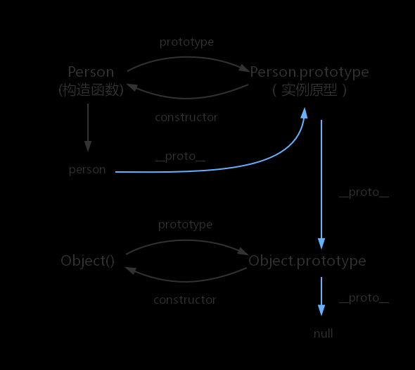

# HTML 篇

## HTML5 语义化

[html5 语义化标签](https://rainylog.com/post/ife-note-1)


# CSS 篇

## CSS 常见面试题

[50 道 CSS 经典面试题](https://www.itcodemonkey.com/article/2853.html)

## 能不能讲一讲 Flex 布局，以及常用的属性？

[阮一峰的 flex 系列](https://www.ruanyifeng.com/blog/2015/07/flex-grammar.html)

## BFC 是什么？能解决什么问题？

[什么是 BFC？什么条件下会触发？应用场景有哪些？](http://47.98.159.95/my_blog/css/008.html)

# JS 基础篇

## 讲讲 JS 的数据类型？

最新的 ECMAScript 标准定义了 8 种数据类型:

- 6 种原始类型
  - Boolean
  - Undefined
  - Number
  - BigInt
  - String
  - Symbol
- null
- Object
- Function

## 讲讲 Map 和 Set？

1. Map 的 key 相比较普通对象来说更为灵活，普通对象的 key 只能以基础数据类型作为 key 值，并且所有传入的 key 值都会被转化成 string 类型，而 Map 的 key 可以是各种数据类型格式。
2. Set 可以讲讲它去重的特性。

## WeakMap 和 Map 之间的区别？

WeakMap 只能以复杂数据类型也就是对象作为 key，并且 key 值是弱引用，对于垃圾回收更加友好。

## 讲讲原型链？

[JavaScript 深入之从原型到原型链](https://github.com/mqyqingfeng/Blog/issues/2)

```js
function Person() {}
var person = new Person();
console.log(person.constructor === Person); // true，person 没有 constructor 属性，会从 person 的原型也就是 Person.prototype 中取，即 person.constructor === Person.prototype.constructor
console.log(person.__proto__ == Person.prototype); // true，__proto__ 属性会指向该对象的原型
console.log(Person.prototype.constructor == Person); // true
// 顺便学习一个ES5的方法,可以获得对象的原型
console.log(Object.getPrototypeOf(person) === Person.prototype); // true
console.log(Object.prototype.__proto__ === null); // true
```



## 讲讲 this？

[JavaScript 中的 this](https://juejin.im/post/59748cbb6fb9a06bb21ae36d)

## 浅拷贝和深拷贝的区别

- 浅拷贝：一般指的是把对象的第一层拷贝到一个新对象上去，比如

  ```js
  var a = { count: 1, deep: { count: 2 } };
  var b = Object.assign({}, a);
  // 或者
  var b = { ...a };
  ```

- 深拷贝：一般需要借助递归实现，如果对象的值还是个对象，要进一步的深入拷贝，完全替换掉每一个复杂类型的引用。

  ```js
  var deepCopy = (obj) => {
    var ret = {};
    for (var key in obj) {
      var value = obj[key];
      ret[key] = typeof value === 'object' ? deepCopy(value) : value;
    }
    return ret;
  };
  ```

对于同一个用例来说

```js
// 浅拷贝
var a = { count: 1, deep: { count: 2 } };
var b = { ...a };

a.deep.count = 5;
b.deep.count; // 5

var a = { count: 1, deep: { count: 2 } };
var b = deepCopy(a);
a.deep.count = 5;
b.deep.count; // 2
```

## 讲讲事件冒泡和事件捕获以及事件代理？

[你真的理解事件冒泡和事件捕获吗？](https://juejin.im/post/5cc941436fb9a03236394027)

# 框架篇

## React

### React2019 高频面试题

[2019 年 17 道高频 React 面试题及详解](https://juejin.im/post/5d5f44dae51d4561df7805b4)

### 有没有使用过 React Hooks？

- 常用的有哪些？都有什么作用？
- 如何使用 hook 在依赖改变的时候重新发送请求？
- 写过自定义 hook 吗？解决了哪些问题。
- 讲讲 React Hooks 的闭包陷阱，你是怎么解决的？

[useEffect 完整指南](https://overreacted.io/zh-hans/a-complete-guide-to-useeffect/)

### 讲讲 React 中的组件复用？

[【React 深入】从 Mixin 到 HOC 再到 Hook](https://juejin.im/post/5cad39b3f265da03502b1c0a)

# 工具

## webpack 的基础知识

[掘金刘小夕的 webpack 系列](https://juejin.im/post/5e5c65fc6fb9a07cd00d8838)

# 性能优化

## 讲讲 web 各个阶段的性能优化？

[React 16 加载性能优化指南](https://mp.weixin.qq.com/s/XSvhOF_N0VbuOKStwi0IYw)

## webpack 代码分割是怎么做的？

[webpack 的代码分割（路由懒加载同理）](https://juejin.im/post/5e796ec1e51d45271e2a9af9)

# 网络

## 讲讲 http 的基本结构？

[http 的基础结构](http://47.98.159.95/my_blog/http/001.html#%E8%B5%B7%E5%A7%8B%E8%A1%8C)

## 浏览器从输入 url 到渲染页面，发生了什么？

[细说浏览器输入 URL 后发生了什么](https://juejin.im/post/5e32449d6fb9a02fe4581907)

## 讲讲你对 cookie 的理解？包括 SameSite 属性

[预测最近面试会考 Cookie 的 SameSite 属性](https://juejin.im/post/5e718ecc6fb9a07cda098c2d)

## 谈谈 https 的原理？为什么 https 能保证安全？

[谈谈 HTTPS](https://juejin.im/post/59e4c02151882578d02f4aca)

## 谈谈前端的安全知识？XSS、CSRF，以及如何防范。

[寒冬求职之你必须要懂的 Web 安全](https://juejin.im/post/5cd6ad7a51882568d3670a8e)

## 讲讲 http 的缓存机制吧，强缓存，协商缓存？

[深入理解浏览器的缓存机制](https://www.jianshu.com/p/54cc04190252)

# 手写系列

## 基础

### 手写各种原生方法

- 如何模拟实现一个 new 的效果？
- 如何模拟实现一个 bind 的效果？
- 如何实现一个 call/apply 函数？

[三元-手写代码系列](http://47.98.159.95/my_blog/js-api/001.html)

## 进阶

[手写 Promise 20 行](https://juejin.im/post/5e6f4579f265da576429a907)

[剖析 Promise 内部结构，一步一步实现一个完整的、能通过所有 Test case 的 Promise 类](https://github.com/xieranmaya/blog/issues/3)
