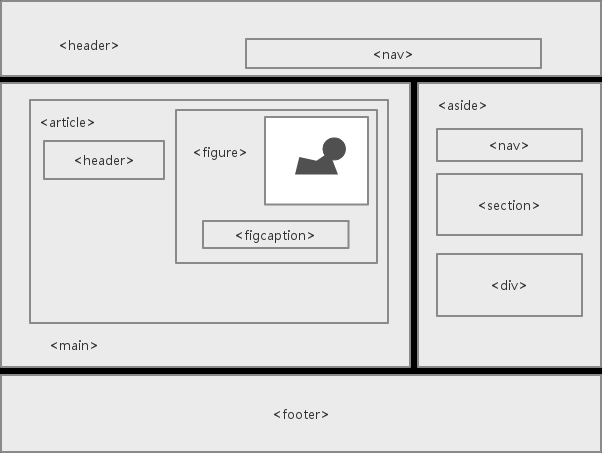

# HTML篇

## HTML5语义化

[html5语义化标签](https://rainylog.com/post/ife-note-1)



# CSS篇

## CSS常见面试题

[50道CSS经典面试题](https://www.itcodemonkey.com/article/2853.html)

## 能不能讲一讲Flex布局，以及常用的属性？

[阮一峰的flex系列](https://www.ruanyifeng.com/blog/2015/07/flex-grammar.html)

## BFC是什么？能解决什么问题？

[什么是BFC？什么条件下会触发？应用场景有哪些？](http://47.98.159.95/my_blog/css/008.html)

# JS基础篇

## 讲讲JS的数据类型？

最新的 ECMAScript 标准定义了 8 种数据类型:

- 6 种原始类型
  - Boolean
  - Undefined
  - Number
  - BigInt
  - String
  - Symbol
- null
- Object
- Function

## 讲讲Map和Set？

1. Map的key相比较普通对象来说更为灵活，普通对象的key只能以基础数据类型作为key值，并且所有传入的key值都会被转化成string类型，而Map的key可以是各种数据类型格式。
2. Set可以讲讲它去重的特性。

## WeakMap和Map之间的区别？

WeakMap只能以复杂数据类型也就是对象作为key，并且key值是弱引用，对于垃圾回收更加友好。

## 讲讲原型链？

[JavaScript深入之从原型到原型链](https://github.com/mqyqingfeng/Blog/issues/2)

```js
function Person() {

}
var person = new Person();
console.log(person.constructor === Person); // true，person 没有 constructor 属性，会从 person 的原型也就是 Person.prototype 中取，即 person.constructor === Person.prototype.constructor
console.log(person.__proto__ == Person.prototype) // true，__proto__ 属性会指向该对象的原型
console.log(Person.prototype.constructor == Person) // true
// 顺便学习一个ES5的方法,可以获得对象的原型
console.log(Object.getPrototypeOf(person) === Person.prototype) // true
console.log(Object.prototype.__proto__ === null) // true
```

## 讲讲this？

[JavaScript中的this](https://juejin.im/post/59748cbb6fb9a06bb21ae36d)

## 浅拷贝和深拷贝的区别

- 浅拷贝：一般指的是把对象的第一层拷贝到一个新对象上去，比如

  ```js
  var a = { count: 1, deep: { count: 2 } }
  var b = Object.assign({}, a)
  // 或者
  var b = {...a}
  ```
- 深拷贝：一般需要借助递归实现，如果对象的值还是个对象，要进一步的深入拷贝，完全替换掉每一个复杂类型的引用。

  ```js
  var deepCopy = (obj) => {
      var ret = {}
      for (var key in obj) {
          var value = obj[key]
          ret[key] = typeof value === 'object' ? deepCopy(value) : value
      }
      return ret
  }
  ```

对于同一个用例来说

```js
// 浅拷贝
var a = { count: 1, deep: { count: 2 } }
var b = {...a}

a.deep.count = 5
b.deep.count // 5

var a = { count: 1, deep: { count: 2 } }
var b = deepCopy(a)
a.deep.count = 5
b.deep.count // 2
```

## 讲讲事件冒泡和事件捕获以及事件代理？

[你真的理解事件冒泡和事件捕获吗？](https://juejin.im/post/5cc941436fb9a03236394027)

# 框架篇


 