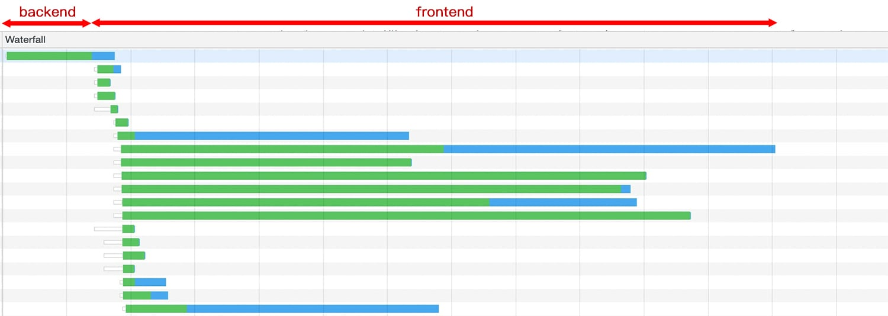

# RAIL 模型

RAIL 是一个以用户为中心的性能模型，它把用户的体验拆分成几个关键点（例如，tap，scroll，load），并且帮你定义好了每一个的性能指标。

有以下四个方面：

- Response
- Animation
- Idle
- Load


## 聚焦用户

以下是用户对性能延迟的感知：

| 延迟时间        | 用户感知                   |
| :-------------- | :------------------------- |
| 0-16ms          | 很流畅                     |
| 0-100ms         | 基本流畅                   |
| 100-1000ms      | 感觉到网站上有一些加载任务 |
| 1000ms or more  | 失去耐心了                 |
| 10000ms or more | 直接离开，不会再访问了     |

## Response: 事件处理最好在 50ms 内完成

### 目标

用户的输入到响应的时间不超过 100ms，给用户的感受是瞬间就完成了。

### 优化方案

- 事件处理函数在 50ms 内完成，考虑到 idle task 的情况，事件会排队，等待时间大概在 50ms。适用于 click，toggle，starting animations 等，不适用于 drag 和 scroll。
- 复杂的 js 计算尽可能放在后台，如 web worker，避免对用户输入造成阻塞
- 超过 50ms 的响应，一定要提供反馈，比如倒计时，进度百分比等。

> idle task：除了要处理输入事件，浏览器还有其它任务要做，这些任务会占用部分时间，一般情况会花费 50ms 的时间，输入事件的响应则排在其后。

下图是 idle task 对 input response 的影响：


## Animation: 在 10ms 内产生一帧

### 目标

- 产生每一帧的时间不要超过 10ms，为了保证浏览器 60 帧，每一帧的时间在 16ms 左右，但浏览器需要用 6ms 来渲染每一帧。
- 旨在视觉上的平滑。用户对帧率变化感知很敏感。

### 优化方案

- 在一些高压点上，比如动画，不要去挑战 cpu，尽可能地少做事，如：取 offset，设置 style 等操作。尽可能地保证 60 帧的体验。
- 在渲染性能上，针对不同的动画做一些特定优化

> 动画不只是 UI 的视觉效果，以下行为都属于
>
> - 视觉动画，如渐隐渐显，tweens，loading 等
> - 滚动，包含弹性滚动，松开手指后，滚动会持续一段距离
> - 拖拽，缩放，经常伴随着用户行为

## Idle: 最大化空闲时间

### 目标

最大化空闲时间，以增大 50ms 内响应用户输入的几率

### 优化方案

- 用空闲时间来完成一些延后的工作，如先加载页面可见的部分，然后利用空闲时间加载剩余部分，此处可以使用 requestIdleCallback API
- 在空闲时间内执行的任务尽量控制在 50ms 以内，如果更长的话，会影响 input handle 的 pending 时间
- 如果用户在空闲时间任务进行时进行交互，必须以此为最高优先级，并暂停空闲时间的任务

## Load: 传输内容到页面可交互的时间不超过 5 秒

如果页面加载比较慢，用户的焦点可能会离开。加载很快的页面，用户平均停留时间会变长，跳出率会更低，也就有更高的广告查看率

### 目标

- 优化加载速度，可以根据设备、网络等条件。目前，比较好的一个方式是，让你的页面在一个中配的 3G 网络手机上打开时间不超过 5 秒
- 对于第二次打开，尽量不超过 2 秒

### 优化方案

- 在手机设备上测试加载性能，选用中配的 3G 网络（400kb/s，400ms RTT），可以使用 [WebPageTest](https://www.webpagetest.org/easy) 来测试
- 要注意的是，即使用户的网络是 4G，但因为丢包或者网络波动，可能会比预期的更慢禁用渲染阻塞的资源
- [禁用渲染阻塞的资源，延后加载](https://web.dev/render-blocking-resources/)
- 可以采用 lazy load，code-splitting 等其他优化手段，让第一次加载的资源更少

## 总结

为了提升用户在网站的交互体验而不断探索。你需要去理解用户如何感知你的站点，这样才能设置最佳的性能目标

- 聚焦用户
- 100ms 内响应用户的输入
- 10ms 内产生 1 帧，在滚动或者动画执行时
- 最大化主线程的空闲时间
- 5s 内让网页变得可交互

# 性能优化

## 背景

性能优化一直以来都是前端工程领域中的一个重要部分。很多资料表明，网站应用的性能（加载速度、交互流畅度）优化对于提高用户留存、转化率等都有积极影响。可以理解为，提升你的网站性能，就是提升你的业务数据（甚至是业务收入）。

性能优化广义上会包含前端优化和后端优化。后端优化的关注点更多的时候是在增加资源利用率、降低资源成本以及提高稳定性上。相较于后端，前端的性能优化会更直接与用户的体验挂钩。从用户体验侧来说，前端服务 5s 的加载时间优化缩减 80%(1s) 与后端服务 50ms 的响应优化缩减 80%(10ms) 相比，用户的体验提升会更大。因此很多时候，与体验相关的性能的瓶颈会出现在前端。

> 当然后端性能优化非常重要，正如上面所说，它们的关注点可能不同。前端类似于最后一公里，由于和用户最近，所以性能问题会直接影响到用户体验。



## 缓存

[深入理解浏览器的缓存机制](/deep-learn-browser-cache/)

## 发送请求

在前一部分，我们介绍了浏览器缓存。当一个请求走过了各级前端缓存后，就会需要实际发送一个请求了。

> 在 HTTP 缓存中，我们其实也有发送请求；或者是在 HTTP/2 Push 下，使用了之前连接中推送的资源。不过为了保证思路的连贯，我还是把「发送请求」这个章节整体放在「缓存」之后了。

介绍网络请求其实可以包含复杂的网络知识。不过，今天咱们的旅程主要聚焦于“前端性能优化”。因此，主要会介绍一些在这个环节中，前端性能优化可能会做的事儿。

### 避免多余重定向

重定向是一个比较常用的技术手段。在一些情况下，你可能进行了服务迁移，修改了原有的 uri。这时候就可以使用重定向，把访问原网址的用户重定向到新的 uri。还有是在一些登录场景下，会使用到重定向技术。

重定向分为 301 的永久重定向和 302 的临时重定向。建议贴合语义，例如服务迁移的情况下，使用 301 重定向。对 SEO 也会更友好。

同时也不要滥用重定向。曾今也见过有业务在访问后重定向 3 次的情况，其实里面有些是不必要的。每次重定向都是有请求耗时的，建议避免过多的重定向。

### DNS 预解析

基本我们访问远程服务的时候，不会直接使用服务的 IP，而是使用域名。所以请求的一个重要环节就是域名解析。

DNS 服务本身是一个树状层级结构，其解析是一个递归与迭代的过程。例如 github.com 的大致解析流程如下：

1. 先检查本地 hosts 文件中是否有映射，有则使用；
2. 查找本地 DNS 缓存，有则返回；
3. 根据配置在 TCP/IP 参数中设置 DNS 查询服务器，并向其进行查询，这里先称为本地 DNS；
4. 如果该服务器无法解析域名（没有缓存），且不需要转发，则会向根服务器请求；
5. 根服务器根据域名类型判断对应的顶级域名服务器（.com），返回给本地 DNS，然后重复该过程，直到找到该域名；
6. 当然，如果设置了转发，本地 DNS 会将请求逐级转发，直到转发服务器返回或者也不能解析。

这里我们需要了解的是：

- 首先，DNS 解析流程可能会很长，耗时很高，所以整个 DNS 服务，包括客户端都会有缓存机制，这个作为前端不好涉入；
- 其次，在 DNS 解析上，前端还是可以通过浏览器提供的其他手段来“加速”的。

DNS Prefetch 就是浏览器提供给我们的一个 API。它是 Resource Hint 的一部分。它可以告诉浏览器：过会我就可能要去 yourwebsite.com 上下载一个资源啦，帮我先解析一下域名吧。这样之后用户点击某个按钮，触发了 yourwebsite.com 域名下的远程请求时，就略去了 DNS 解析的步骤。使用方式很简单：

```html
<link rel="dns-prefetch" href="//yourwebsite.com" />
```

当然，浏览器并不保证一定会去解析域名，可能会根据当前的网络、负载等状况做决定。标准里也明确写了

> user agent SHOULD resolve as early as possible

### 预先建立连接

我们知道，建立连接不仅需要 DNS 查询，还需要进行 TCP 协议握手，有些还会有 TLS/SSL 协议，这些都会导致连接的耗时。使用 Preconnect 可以帮助你告诉浏览器：“我有一些资源会用到某个源（origin），你可以帮我预先建立连接。”

根据规范，当你使用 Preconnect 时，浏览器大致做了如下处理：

- 首先，解析 Preconnect 的 url；
- 其次，根据当前 link 元素中的属性进行 cors 的设置；
- 然后，默认先将 credential 设为 true，如果 cors 为 Anonymous 并且存在跨域，则将 credential 置为 false；
- 最后，进行连接。

使用 Preconnect 只需要将 rel 属性设为 preconnect 即可：

```html
<link rel="preconnect" href="//sample.com" />
```

当然，你也可以设置 CORS：

```html
<link rel="preconnect" href="//sample.com" crossorigin />
```

需要注意的是，标准并没有硬性规定浏览器一定要（而是 SHOULD）完成整个连接过程，与 DNS Prefetch 类似，浏览器可以视情况完成部分工作。

### 使用 CDN

当我们实际把网络包发向我们的目标地址时，肯定希望越快到达目的地越好（对应的，也会希望越快获得响应）。而网络传输是有极限的，同样一个北京的用户，访问北京的服务器显然要比广州快很多。同时，服务的负载也会影响响应的速度。

对于静态资源，我们可以考虑通过 CDN 来降低时延。

对于使用 CDN 的资源，DNS 解析会将 CDN 资源的域名解析到 CDN 服务的负载均衡器上，负载均衡器可以通过请求的信息获取用户对应的地理区域，从而通过负载均衡算法，在背后的诸多服务器中，综合选择一台地理位置近、负载低的机器来提供服务。例如为北京联通用户解析北京的服务器 IP。这样，用户在之后访问 CDN 资源时都是访问北京服务器，距离近，速度快。

下图是请求声明周期中各个阶段的示意图，可以帮助我们理解发送请求（以及接收响应）的流程。


在缓存没法满足我们的情况下，就要开始真正发送请求了。从前端性能优化视角，我们会关注重定向、DNS 解析等问题，从而加速请求。但这块还预留了一小部分 —— 服务端的处理与响应。

过去，我们会将前端局限在浏览器中，但是随着 NodeJS 的兴起，很多业务都引入了基于 NodeJS 的 BFF 来为前端（客户端端）提供服务。所以咱们这次的旅程也会简单聊一下，在这一阶段可以做的一些优化。

## 服务端响应

把这一部分放进前端性能优化并不是很严谨：

- 服务端有着服务端的通用技术手段，这块深入去研究，会是一个不一样的领域；
- 我们既然在讨论前端性能优化，这部分主要还是指 NodeJS，但不是所有业务都使用 NodeJS。

所以这里只会提一些实践中碰到的小点，辅以一些拓展阅读，希望能帮助大家抛砖引玉，开拓思维。

### 使用流进行响应

目前，现代浏览器都支持根据流的返回形式来逐步进行页面内容的解析、处理。这就意味着，即使请求的响应没有完全结束，浏览器也可以从手里已有的响应结果中进行页面的解析与渲染。

例如 [css-only-chat-node](https://github.com/kkuchta/css-only-chat) 就利用了这个特点来实现无刷新、无 JavaScript 的页面更新。

### 业务聚合

BFF 非常合适做的一件事就是后端服务的聚合。

如果你有一个两个接口服务：第一个服务是先获取产品信息，再根据产品信息中的上架时间通过第二个服务获取该时间后的产品列表。这个业务逻辑如果放在前端（浏览器）处理将会串行发送两个请求。假设每个请求 200ms，那么就需要等待 400ms。如果引入 NodeJS，这一层可以放在 NodeJS 中实现。NodeJS 部署的位置一般离其他后端服务“更近”，例如同一个局域网。这类服务间的请求耗时显然更低，可能只需要 200(浏览器) + 30(NodeJS) \* 2 = 260ms。

此外，如果一个业务需要在前端并发三、四个请求来获取完整数据，那么放在 NodeJS 的 BFF 层也是一个不错的选择。

### 避免代码问题

代码问题其实就非常细节了。简单列举一些常见的问题：

- async await 的不当使用导致并行请求被串行化了；
- 频繁地 JSON.parse 和 JSON.stringify 大对象；
- 正则表达式的灾难性回溯；
- 闭包导致的内存泄漏；
- CPU 密集型任务导致事件循环 delay 严重；
- 未捕获的异常导致进程频繁退出，守护进程（pm2/supervisor）又将进程重启，这种频繁的启停也会比较消耗资源；

## 页面解析与处理

这一阶段浏览器需要处理的东西很多，为了更好地理解性能优化，我们主要将其分为几个部分：

- 页面 DOM 的解析；
- 页面静态资源的加载，包括了页面引用的 JavaScript/CSS/图片/字体等；
- 静态资源的解析与处理，像是 JavaScript 的执行、CSSOM 的构建与样式合成等；

大致过程就是解析页面 DOM 结构，遇到外部资源就加载，加载好了就使用。但是由于这部分的内容比较多，所以在这一节里我们重点关注页面的解析（其他部分在写一节中介绍）。

### 注意资源在页面文档中的位置

我们的目标是收到内容就尽快解析处理，页面有依赖的资源就尽快发送请求，收到响应则尽快处理。然而，这个美好的目标也有可能会被我们不小心破坏。

JavaScript 脚本和 CSS 样式表在关于 DOM 元素的属性，尤其是样式属性上都有操作的权利。这就像是一个多线程问题。服务端多线程编程中经常通过锁来保证线程间的互斥。回到咱们的前端，现在也是两方在竞争同一个资源，显然也是会有互斥的问题。这就带来了 DOM 解析、JavaScript 加载与执行、CSS 加载与使用之间的一些互斥关系。

仅仅看 DOM 与 CSS 的关系，则如下图所示：


HTML 解析为 DOM Tree，CSS 解析为 CSSOM，两者再合成 Render Tree，并行执行，非常完美。然而，当 JavaScript 入场之后，局面就变了：


根据标准规范，在 JavaScript 中可以访问 DOM。因此当遇到 JavaScript 后会阻塞 DOM 的解析。于此同时，为避免 CSS 与 JavaScript 之间的竞态，CSSOM 的构建会阻塞 JavaScript 的脚本执行。总结起来就是

> JavaScript 会阻塞 DOM 构建，而 CSSOM 的构建又会阻塞 JavaScript 的执行。

所以这就是为什么在优化的最佳实践中，我们基本都推荐把 CSS 样式表放在 `<head>` 之中（即页面的头部），把 JavaScript 脚本放在 `<body>` 的最后（即页面的尾部）。

### 使用 defer 和 async

上面提到了，当 DOM 解析遇到 JavaScript 脚本时，会停止解析，开始下载脚本并执行，再恢复解析，相当于是阻塞了 DOM 构建。

那除了将脚本放在 body 的最后，还有什么优化方法么？是有的。

可以使用 defer 或 async 属性。两者都会防止 JavaScript 脚本的下载阻塞 DOM 构建。但是两者也有区别，最直观的表现如下：


defer 会在 HTML 解析完成后，按照脚本出现的次序再顺序执行；而 async 则是下载完成就立即开始执行，同时阻塞页面解析，不保证脚本间的执行顺序。

根据它们的特点，推荐在一些与主业务无关的 JavaScript 脚本上使用 async。例如统计脚本、监控脚本、广告脚本等。这些脚本一般都是一份独立的文件，没有外部依赖，不需要访问 DOM，也不需要有严格的执行时机限制。在这些脚本上使用 async 可以有效避免这些非核心功能的加载影响页面解析速度。

### 页面文档压缩

HTML 的文档大小也会极大影响响应体下载的时间。一般会进行 HTML 内容压缩（uglify）的同时，使用文本压缩算法（例如 gzip）进行文本的压缩。关于资源压缩这一块，在下一节的内容中还会再详细进行介绍。
