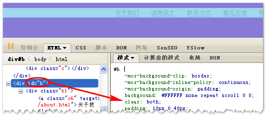
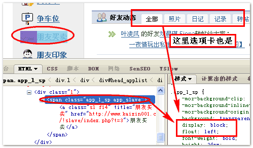

# 一些常见不必要CSS样式

## 与默认CSS样式一致

我们有时候写的CSS样式会与浏览器默认的CSS样式一致，有时候您自己都可能没有意识到。

常见的例子有：

###  width / height

```css
div {
  width: auto;
  height: auto;
}
```

很显然，这段样式是没有必要的，默认的任何块状元素的高度几乎都是auto。

### padding

```css
body,
p,
h1,
h2,
h3,
h4,
h5,
h6 {
  margin: 0; 
  padding: 0;
}
```

上面有关body,p等标签的样式中有个样式是无效的，与默认值一致的，这个样式就是padding:0，对于body,p,h1~6这些标签，本身的padding值就是0，所以只需要margin:0就可以了。

因为ul,ol还要独立设置list-style样式，而且常用的标签就ul,ol列表元素有默认的padding值，高效的写法应该是：

```css
body,
p,
h1,
h2,
h3,
h4,
h5,
h6 {
  margin :0;
}

ul,
ol {
  list-type: none;
  margin: 0;
  padding: 0;
}
```

### display: inline

```css
span {
  display: inline;
  float: left;
  margin-left: 3px;
}
```

出现这种情况的原因可能与IE6的浮动双边距bug有关，我们可以用设置display:inline的方法修复IE6的这个bug。

但是对于span/a/em/cite/i/b/strong等行内元素默认就是display:inline的，所以给其设置display:inline属性是多此一举。

类似的情况还有对本身就是block水平的元素设置display:block属性，例如：

```css
li {
  display: block;
  padding: 4px 0;
}
```

上面的情况屡见不鲜，甚至在比较优秀的网站上也会有这类低级的样式问题。

### 其他

```css
div {
  margin: auto;
}

textarea {
  overflow: auto;
}

img,
input,
button {
  vertical-align: baseline;
}

div {
  background-position: 0 0;
}
```

## 没有必要出现的样式

最常见的就是clear:both的使用。  
如果前后没有浮动元素干扰，使用clear:both是没有道理的。  
比如说新浪新版博客个人博客的首页，clear:both属性可以说是滥用：


在博客列表主体处基本上每个div标签都使用了clear:both属性，而这里所有的clear:both属性都是可以去除的。

clear:both的多余使用可以说是相当普遍使用的情况。像是开心网底部网站信息：



要是前后没有直接的浮动元素，使用clear:both就是多余的。

## 不起作用的单样式

有些CSS样式只针对特定显示水平的标签起作用。

### inline水平

inline水平的元素对很多CSS样式都不起反应，例如height/width, clear, margin-top/margin-bottom, overflow等。举个实例吧，拿overflow:hidden属性举例，对于inline水平的元素而言，设置overflow:hidden属性是没有作用的。例如下面的测试代码：

```html
<span style="overflow: hidden;">
  
<span>
```

对比于：

```html
<span style="display: inline-block; overflow: hidden;">
  
<span>
```

对比图如下：


### block水平

block水平的元素对vertical-align属性没有作用。

### 组合起作用

有些样式需要和其他一些特定的CSS属性一起使用才有作用。常见的就是z-index与position属性的组合使用，left/top/bottom/right与position属性的组合使用。

## 组合样式中多余的CSS代码

### display:block;

```css
a {
  display: block;
  float: left;
  margin-top: 2px;
}
```

这可以说是最常见的含有多余样式的例子了，开心网个人首页可谓随处可见，见下图：



这里的display属性完全没有必要，对于a或是span标签而言，没有任何理由使用display+float的组合，因为float所产生的“包裹”作用已经让元素如同一个inline-block水平的元素，这种作用大于直接的display设置。

仅仅一种情况下有必要使用display+float的组合，就是block水平的元素在IE6下的双边距bug问题，这种情况的唯一写法就是display:inline; float:left; margin-left:3px;一定要有与float浮动同方向的margin值，否则display:inline是多余的，可以直接去掉。

### height:25px;

```css
div {
  height: 25px;
  line-height: 25px;
}
```

这又是一种常见的平时不注意的可以精简的CSS代码，这段代码高度与line-height值一致，通常作用是实现单行文字的垂直居中显示。但是实际上，很多情况下，这里的height是个多余的值，尤其在模块标题处。对于单行文字而言，您设置line-height多大，其实际占据的垂直高度就是多高，没有任何的兼容性问题，可以放心使用。

但是，有时候这里的height值是有必要的，什么时候呢？就是IE6/7清除浮动影响的时候，IE6/7下设置height值可以让元素haslayout从而清除浮动的影响，而line-height无此作用，还有就是其他一些需要layout的情况。

### width:100%;

```css
span {
  display: block; 
  width: 100%;
}

div {
  width: 100%;
}

body {
  width: 100%;
}
```

这也是常见的使用多余CSS样式的情况，width:100%。在一般情况下，对于block属性的元素，width:100%这个属性绝对是多余的。默认的，block水平的元素就是宽度相对于父标签100%显示的。

当然，不使用100%的情况不是绝对的，下面这个组合可能使用width:100%是有必要的。

```css
div {
  width: 100%;
  overflow: hidden;
}
```

在IE6/7（没有IE8）下，对于block水平的元素，我们可以使用width:100%清除浮动造成的影响，原因与上例一样，haslayout，除了这种情况，纯粹的{width:100%;}样式（无float或是position:absolute之类的样式）是不可能出现的。所以，如果您的CSS代码中出现上述情况，检查下您的width:100%是不是多余的。（下图为搜狐白社会动态列表中多余width:100%情况）


### vertical-align:middle;

```css
div {
  float: left; /* 或display:inline;*/ 
  vertical-align: middle;
}
```

设置无用的vertical-align属性也是常见的。对于block/inline水平的元素或是设置了浮动属性或是absolute绝对定位的元素，其都不支持vertical-align属性。所以这些属性与vertical-align同时出现时，vertical-align属性不起任何作用是多余的。

例如人人网右侧的垂直菜单block水平的li元素：


或是淘宝新版首页左上侧的垂直列表：


### display:inline; float:left; margin-left:10px;

```css
div {
  position: absolute;
  left: 0;
  top: 0;
  display: inline;
  float: left;
  margin-left: 10px;
}
```

设置了绝对定位属性的元素相对特殊些，其不支持的CSS样式可就多了，首先对于display属性，完全没有必要，无论是block/inline-block/inline都是如此，除了显示隐藏外，没有任何组合使用的理由。还有其他很多属性都不支持，例如clear，vertical-align等。

### zoom:1;

```css
div {
  height: 20px; /* 或width:200px; */
  zoom: 1;
  overflow: hidden;
}
```

我们可能会使用zoom清除IE6/7（对IE8无效）浏览器下浮动造成的影响。但是对于IE6/7而言，如果您已经设置了高度值或是宽度值，那么zoom:1完全就是多余的，在IE6/7下含有定值的height或是width与zoom:1起到了同样的一个作用，就是使元素haslayout，可用来清除浮动产生的影响，所以，width/height与zoom:1同时出现也是没有任何理由的。

### 其他

```css
a {
  display: inline-block;
  *display: inline;
  *zoom: 1;
}
```

这是设置元素的inline-block属性，但是对于inline行内元素来说，后面的两个样式就是多余的，因为display:inline-block可以让inline水平的元素表现的就如同真正的inline-block水平一样。

所以，下图人人网样式代码中标注的代码就是多余的。如果是div，则需要上面完整代码。


