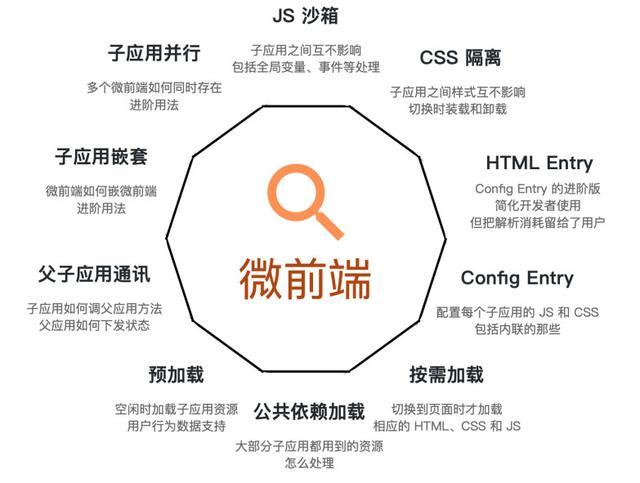

# 定义

`微前端`是一种类似于微服务的架构，它将微服务的理念应用于浏览器端，即将单页面前端应用由单一的单体应用转变为多个小型前端应用聚合为一的应用。各个前端应用还可以独立开发、独立部署。同时，它们也可以在共享组件的同时进行并行开发——这些组件可以通过 npm 或者 git tag、git submodule 来管理。

qiankun（乾坤）就是一款由蚂蚁金服推出的比较成熟的微前端框架，基于 single-spa 进行二次开发，用于将 Web 应用由单一的单体应用转变为多个小型前端应用聚合为一的应用。



# 目的

1.  js 沙箱：子应用之间互不影响
2.  css 隔离：子应用之间样式互不影响，切换时加载与卸载
3.  HTML Entry: Config Entry 的进阶版，简化开发者使用，但是把解析消耗留给了用户
4.  Config Entry: 配置每个子应用的 js 和 css，包含内联的部分
5.  按需加载：切换页面才加载相应的 html、css、js
6.  公共依赖加载: 大部分公共的依赖加载
7.  预加载: 空闲时加载子应用资源，需要用户行为数据支持
8.  父子应用通讯: 子应用如何调用父应用方法，父应用如何下发状态
9.  子应用嵌套: 微前端如何嵌套微前端
10.  子应用并行: 多个微前端同时存在

# 核心

1.  js 沙箱
2.  css 样式隔离
3.  应用 html 入口接入
4.  应用通信
5.  应用路由

# 技术介绍

## js 沙箱

JS 沙箱简单点说就是，主应用有一套全局环境 window，子应用有一套私有的全局环境 fakeWindow，子应用所有操作都只在新的全局上下文中生效，这样的子应用好比被一个个箱子装起来与主应用隔离，因此主应用加载子应用便不会造成 JS 变量的相互污染、JS 副作用、CSS 样式被覆盖等，每个子应用的全局上下文都是独立的。

### 快照沙箱（snapshotSandbox）

快照沙箱就是在应用沙箱挂载和卸载的时候记录快照，在应用切换的时候依据快照恢复环境。

#### 实现

<iframe src="/examples/qiankun-code-note/snapshot-sandbox.html" width="400" height="100"></iframe>

`embed:qiankun-code-note/snapshot-sandbox.html`

#### 优点

兼容几乎所有浏览器

#### 缺点

无法同时有多个运行时快照沙箱，否则在 window 上修改的记录会混乱，一个页面只能运行一个单实例微应用

### 代理沙箱（proxySandbox）

当有多个实例的时候，比如有 A、B 两个应用，A 应用就活在 A 应用的沙箱里面，B 应用就活在 B 应用的沙箱里面，A 和 B 无法互相干扰，这样的沙箱就是代理沙箱，这个沙箱的实现思路其实也是通过 ES6 的 proxy，通过代理特性实现的。

Proxy 对象用于创建一个对象的代理，从而实现基本操作的拦截和自定义（如属性查找、赋值、枚举、函数调用等）。简单来说就是，可以在对目标对象设置一层拦截。无论对目标对象进行什么操作，都要经过这层拦截

#### Proxy vs Object.defineProperty

Object.defineProperty 也能实现基本操作的拦截和自定义，那为什么用 Proxy 呢？因为 Proxy 能解决以下问题：

-  删除或者增加对象属性无法监听到
-  数组的变化无法监听到（vue2 正是使用的 Object.defineProperty 劫持属性，watch 中无法检测数组改变）

#### 实现

<iframe src="/examples/qiankun-code-note/proxy-sandbox.html" width="400" height="100"></iframe>

`embed:qiankun-code-note/proxy-sandbox.html`

#### 优点

-  可同时运行多个沙箱
-  不会污染 window 环境

#### 缺点

-  不兼容 ie
-  在全局作用域上通过 var 或 function 声明的变量和函数无法被代理沙箱劫持，因为代理对象 Proxy 只能识别在该对象上存在的属性，通过 var 或 function 声明声明的变量是开辟了新的地址，自然无法被 Proxy 劫持，比如

  ```js
  const proxy1 = new CreateProxySandbox({});
  proxy1.mountProxySandbox();
  (function(window) {
    var a = 'this is proxySandbox1';
    function b() {}
    console.log('代理沙箱 1 挂载后的 a, b:', window.a, window.b); // undefined undefined
  })(proxy1.proxy);

  proxy1.unmountProxySandbox();
  (function(window) {
    console.log('代理沙箱 1 卸载后的 a, b:', window.a, window.b); // undefined undefined
  })(proxy1.proxy);
  ```

  一种解决方案是不用 var 和 function 声明全局变量和全局函数，比如

  ```js
  var a = 1; // 失效
  a = 1; // 有效
  window.a = 1; // 有效

  function b() {} // 失效
  b = () => {}; // 有效
  window.b = () => {}; // 有效
  ```

## css 样式隔离

### 简介

页面中有多个微应用时，要确保 A 应用的样式不会影响 B 应用的样式，就需要对应用的样式采取隔离。

### 动态样式表（Dynamic Stylesheet）

对应的 style 标签样式表切换

### 工程化手段（BEM、CSS Modules、CSS in JS）

通过一系列约束和编译时生成不同类名、JS 中处理 CSS 生成不同类名来解决隔离问题

### Shadow DOM

Shadow DOM 允许将隐藏的 DOM 树附加到常规的 DOM 树中——它以 shadow root 节点为起始根节点，在这个根节点的下方，可以是任意元素，和普通的 DOM 元素一样，隐藏的 DOM 样式和其余 DOM 是完全隔离的，类似于 iframe 的样式隔离效果。

> 移动端框架 Ionic 的组件样式隔离就是采用的 Shadow DOM 方案，保证相同组件的样式不会冲突。

#### 实现

<iframe src="/examples/qiankun-code-note/shadow-dom.html" width="400" height="100"></iframe>

`embed:qiankun-code-note/shadow-dom.html`

#### 优点

完全隔离 CSS 样式

#### 缺点

在使用一些弹窗组件的时候（弹窗很多情况下都是默认添加到了 document.body）这个时候它就跳过了阴影边界，跑到了主应用里面，样式就丢了

### 运行时转换样式（runtime css transformer）

动态运行时地去改变 CSS，比如 A 应用的一个样式 `p.title`，转换后会变成 `div[data-qiankun-A] p.title`，`div[data-qiankun-A]` 是微应用最外层的容器节点，故保证 A 应用的样式只有在 `div[data-qiankun-A]` 下生效。

#### 实现

<iframe src="/examples/qiankun-code-note/runtime-css-transformer.html" width="400" height="100"></iframe>

`embed:qiankun-code-note/runtime-css-transformer.html`

#### 优点

-  支持大部分样式隔离需求
-  解决了 Shadow DOM 方案导致的丢失根节点问题

#### 缺点

运行时重新加载样式，会有一定性能损耗

## HTML Entry

### html 解析

当我们配置子应用的 entry 后，qiankun 会通过 fetch 获取到子应用的 html 字符串（这就是为什么需要子应用资源允许跨域）

拿到 html 字符串后，会调用 [processTpl](https://github.com/kuitos/import-html-entry/blob/76df4b3737d54112f6bf2dfabcd01709079468e4/src/process-tpl.js#L58) 方法通过一大堆正则去匹配获取 html 中对应的 js（内联、外联）、css（内联、外联）、注释、入口脚本 entry 等等。processTpl 方法会返回我们加载子应用所需要的四个组成部分：

-  template：html 模板;
-  script：js 脚本（内联、外联）;
-  styles：css 样式表（内联、外联）;
-  entry：子应用入口 js 脚本文件，如果没有默认以解析后的最后一个 js 脚本代替;

```js
export default function processTpl(tpl, baseURI) {
  // 省略详细代码，这里是对各种 css、js 等资源各种写法的预处理，用于规范后面对资源的统一处理

  return {
    template, // html 模板
    scripts, // js 脚本（内联、外联）
    styles, // css 样式表（内联、外联）
    entry: entry || scripts[scripts.length - 1] // 子应用入口 js 脚本文件，如果没有默认以解析后的最后一个 js 脚本代替；
  };
}
```

### css 处理

接下来在拿到子应用的依赖的各种资源关系后，会去通过 fetch 获取 css，并将 css 全部以内联形式嵌入 html 模板中，到此对 css 的处理大致就完成了。

```js
function getEmbedHTML(template, styles, opts = {}) {
  const { fetch = defaultFetch } = opts;
  let embedHTML = template;

  // 获取 css 资源
  // getExternalStyleSheets 同时处理了内联和外联 css 资源
  // 其中内联资源会获取 css code，外联会先 fetch 到 css code 然后处理
  return getExternalStyleSheets(styles, fetch).then((styleSheets) => {
    embedHTML = styles.reduce((html, styleSrc, i) => {
      // 内联处理全部的 css 资源
      html = html.replace(genLinkReplaceSymbol(styleSrc), `<style>/* ${styleSrc} */${styleSheets[i]}</style>`);
      return html;
    }, embedHTML);
    return embedHTML;
  });
}
```

### js 处理

接下来是对 js 的处理，这里 qiankun 和 icestack 的处理模式就不同了。

首先简单说下 icestark，icestark 是在解析完 html 后拿到子应用的 js 依赖，通过动态创建 script 标签的形式去加载 js，因此在 icestark 是无视 js 跨域的（icestark 的 entry 模式和 url 模式均是如此，区别在于 entry 模式多了一步 fetch 拉 html 字符串并解析 js、css 依赖，而 url 模式只需要指定子应用的脚本和样式依赖即可）。

而 qiankun 则采用了另一种办法，首先同理会先通过 fetch 获取外联的 js 字符串。

```js
export function getExternalScripts(scripts, fetch = defaultFetch, errorCallback = () => {}) {
  const fetchScript = (scriptUrl) => {
    // 通过 fetch 获取 js 资源，如果有缓存从缓存拿
    // 略
  };

  return Promise.all(
    scripts.map((script) => {
      if (typeof script === 'string') {
        if (isInlineCode(script)) {
          // 获取内联的 js code
          return getInlineCode(script);
        } else {
          // fetch 获取外联的 js code
          return fetchScript(script);
        }
      } else {
        // 上面说过了，processTpl 方法会处理各种 js css 资源，其中对于需要异步执行的 js 资源会打上 async 标识
        // 打上 async 标识的 js 资源，会使用 requestIdleCallback 延迟执行
        const { src, async } = script;
        if (async) {
          return {
            src,
            async: true,
            content: new Promise((resolve, reject) => requestIdleCallback(() => fetchScript(src).then(resolve, reject)))
          };
        }

        return fetchScript(src);
      }
    })
  );
}
```

接下来会创建一个匿名自执行函数包裹住获取到的 js 字符串，最后通过 eval 去创建一个执行上下文执行 js 代码。

```js
function getExecutableScript(scriptSrc, scriptText, proxy, strictGlobal) {
  const sourceUrl = isInlineCode(scriptSrc) ? '' : `//# sourceURL=${scriptSrc}\n`;

  window.proxy = proxy;
  return strictGlobal
    ? `;(function(window, self){with(window){;${scriptText}\n${sourceUrl}}}).bind(window.proxy)(window.proxy, window.proxy);`
    : `;(function(window, self){;${scriptText}\n${sourceUrl}}).bind(window.proxy)(window.proxy, window.proxy);`;
}
```

默认不会通过 with 劫持 window 对象的作用域，我们通过 webpack 打包后的 bundle 是会带着 with 劫持 window 对象的，qiankun 的 sandbox 实现原理是通过 Proxy 代理劫持 window 去做的，那么就会出现一个问题，window.xxx 这样形式的属性会被劫持掉，但是直接声明的全局对象不会被劫持。

因为 qiankun 是创建自己的执行上下文执行子应用的 js，因此在加载后的子应用中是看不到 js 资源引用的，仅有一个资源被执行替换的标识。

在 qiankun 中，通过调用 import-html-entry 导出的 execScript 函数，可以获取到子应用导出的生命周期勾子。

```js
// get the lifecycle hooks from module exports
// 上面说过的 eval 包裹 js 代码返回可执行的 bundle 就是 execScripts 主要做的事
const scriptExports: any = await execScripts(global, !singular);
const { bootstrap, mount, unmount, update } = getLifecyclesFromExports(scriptExports, appName, global);
```

## 清除 js 副作用

### 简介

子应用在沙箱中使用 window.addEventListener、setInterval 这些需异步监听的全局 api 时，要确保子应用在移除时也要移除对应的监听事件，否则会对其他应用造成副作用。

### 实现

<iframe src="/examples/qiankun-code-note/remove-js-side-effect.html" width="400" height="100"></iframe>

`embed:qiankun-code-note/remove-js-side-effect.html`
