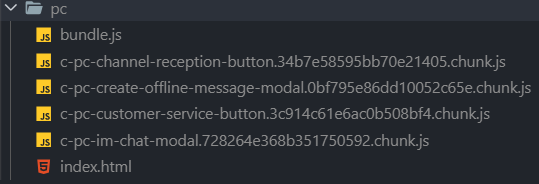
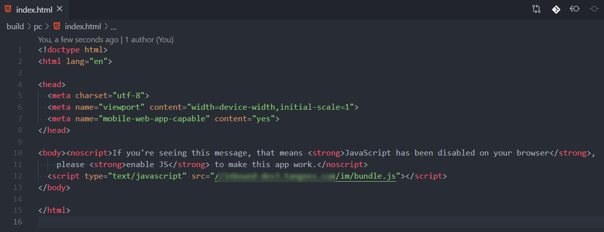
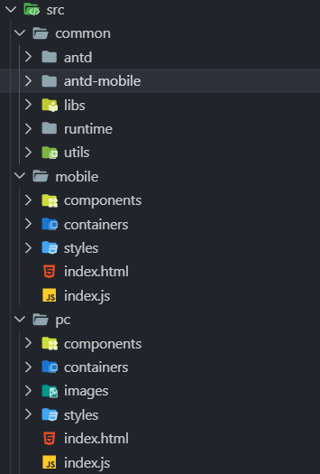
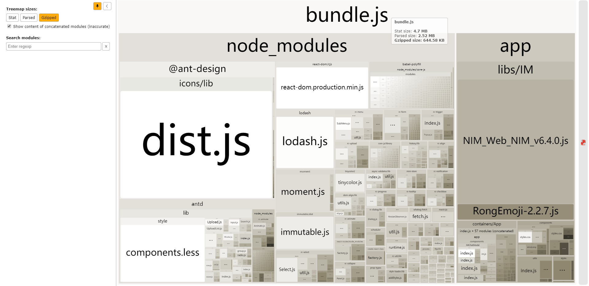
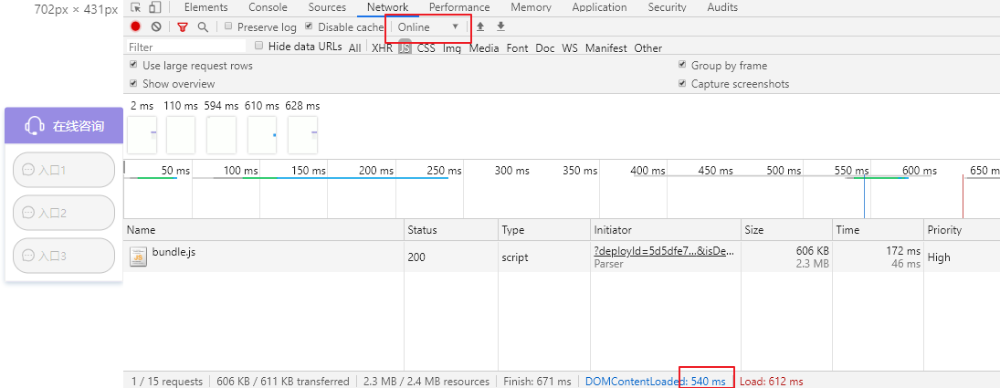
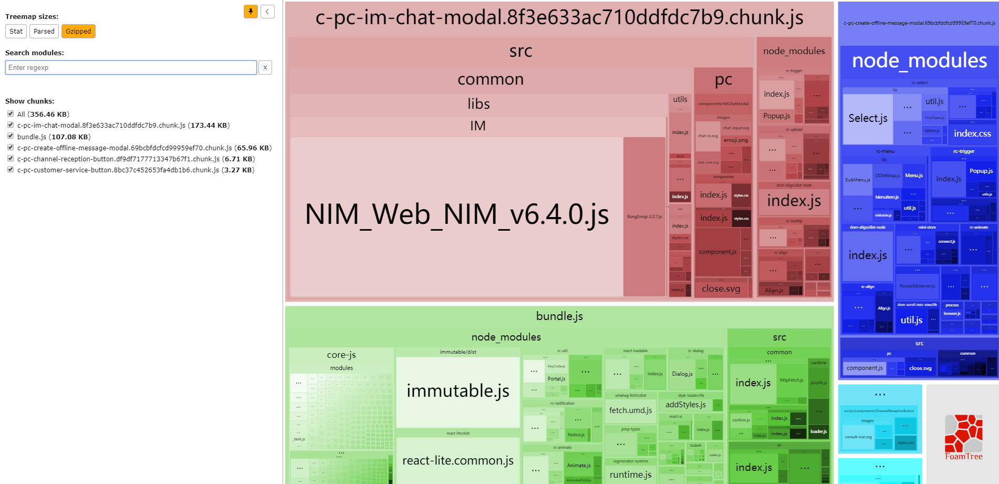
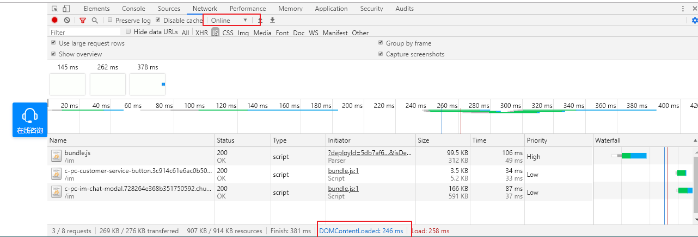
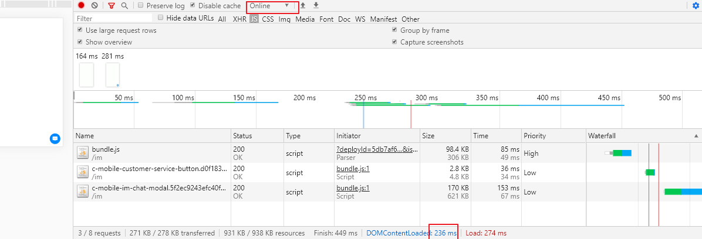
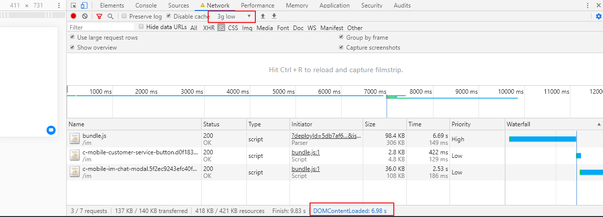

# 需求背景

需求背景接上文 [记一次组件打包为链接的实践](/components-pack-as-library/)

框架搭建接上文 [Webpack脚手架搭建笔记——记一次新项目搭建](/webpack-template-new-project/)

## 组件轻量化

在将客服组件上线后，由于未考虑到加载的组件包的大小，尤其是初始加载的包比较大，即使是压缩过初始加载也有600多k，严重影响首页加载，导致加载此脚本的网站需要很长时间才能响应，所以有了这次的优化任务

## 移动端适配

根据产品要求，此客服组件还需要兼容到移动端，微信端（微信网页、小程序）

# 方案调研

1. 组件异步加载，减少首屏加载大小，非首屏且较大的组件预加载，这里需要 nginx 的配合
2. 去除较大的库，改用轻量级的替代库或者不用
3. 所有用到的组件最好都由自己编写，有利于定制化功能、减小组件大小
4. 移动端可以和桌面端项目写在一起分开打包
5. 代码的分层尤其是 IM 层要分离出来，便于切换不同的 IM 提供商
6. 小程序端用 webview 加载的网页，需要注意在第三方小程序上配置 nginx

# 具体实施

## 组件异步加载

需要修改 webpack 配置，由于之前是在 webpack2 上开发，不能很完美的做到异步加载。此时将框架升级到和本文 [Webpack脚手架搭建笔记——记一次新项目搭建](/webpack-template-new-project/) 的同一版本，具体修改如下：

1. 去除 mini-css-extract-plugin，防止 css 单独抽离
2. 聚合初始加载脚本到一个文件，异步加载的在其他文件，且对异步加载的做 hash 处理
  
      boot\internals\webpack\webpack.prod.babel.js

      ```js
      entry: {
        bundle: ['runtime/polyfill', path.join(process.cwd(), buildMap.indexEntry)],
      },

      output: {
        filename: '[name].js',
        chunkFilename: '[name].[chunkhash].chunk.js',
      },

      // 关闭代码切割，防止首页产生除 bundle.js 外的其他文件
      // runtimeChunk: 'single',
      splitChunks: false,
      ```

生成构建文件如下：





首页只会引入 bundle.js 文件，且异步组件在其他文件

## 较大组件预加载 

这里为了打开聊天组件时不会卡顿，使用了预加载，一定要注意要在主入口加载完成，也就是请求加载完成后在进行预加载，否则同样会造成首页加载时间过长

这里采取的方案是请求完成后要提前知道加载哪个组件就立即预加载此组件（需要后端配合，不适用于点击后才知道加载哪个组件的情况。当然也可以全部预加载所有较大组件，不过为了省流就没这么做），不用等到点击后加载

## 精简依赖库

### 打包前依赖

package.json

```js
"dependencies": {
 "antd": "^3.11.0",
 "babel-polyfill": "6.26.0",
 "classnames": "^2.2.5",
 "element-resize-event": "^2.0.9",
 "immutable": "3.8.1",
 "invariant": "2.2.2",
 "lodash": "4.17.2",
 "md5": "^2.2.1",
 "moment": "^2.18.1",
 "prop-types": "^15.6.2",
 "raf": "^3.4.1",
 "react": "16.6.0",
 "react-dom": "16.6.0",
 "react-helmet": "5.2.0",
 "react-player": "^1.6.4",
 "react-redux": "5.1.0",
 "react-router": "3.2.1",
 "react-router-redux": "4.0.6",
 "react-router-scroll": "0.4.4",
 "redux": "3.6.0",
 "redux-immutable": "3.0.8",
 "redux-saga": "0.16.2",
 "reselect": "2.5.4",
 "rxjs": "5.5.3",
 "smoothscroll-polyfill": "^0.3.6",
 "warning": "3.0.0",
 "whatwg-fetch": "2.0.1"
},
```

### 打包后依赖

package.json

```js
"dependencies": {
 "array-tree-filter": "^2.1.0",
 "babel-polyfill": "6.26.0",
 "classnames": "2.2.5",
 "immutable": "3.8.2",
 "lodash": "4.17.2",
 "prop-types": "15.6.2",
 "rc-dialog": "^7.5.7",
 "rc-notification": "^3.3.1",
 "rc-select": "^9.2.0",
 "rc-tooltip": "^3.7.3",
 "rc-upload": "^2.8.1",
 "react-lite": "^0.15.40",
 "react-loadable": "5.5.0",
 "rmc-cascader": "^5.0.3",
 "rmc-feedback": "^2.0.0",
 "rmc-picker": "^5.0.10",
 "whatwg-fetch": "3.0.0"
},
```

### 主要变化

1. 去除比较大的依赖库 antd、moment、rxjs
2. 替换 react 为 react-lite

   其中需要对 react-lite 做下兼容处理，不影响之前依赖 react 的代码

   boot\internals\webpack\webpack.base.babel.js

   ```js
   'react': path.resolve(process.cwd(), 'node_modules/react-lite'),
   'react-dom': path.resolve(process.cwd(), 'node_modules/react-lite'),
   ```

## 组件自编写

此项目的所有组件使用 antd、antd-mobile 的底层组件，以便优化包大小、自定义功能，组件接口尽量保持一致

### antd 引入方式兼容

之前的项目用到 antd，这里采用了和 antd 一样的引用方式。

作用：有利于代码分割，不会将 antd 的组件代码分割到主入口，antd-mobile同理。

.babelrc

```js
[
   "import",
   {
     "libraryName": "antd",
     "libraryDirectory": "components",
     "camel2DashComponentName": false
   },
   "antd"
],
[
   "import",
   {
     "libraryName": "antd-mobile",
     "libraryDirectory": "components",
     "camel2DashComponentName": false
   },
   "antd-mobile"
],
```

文件目录如下


## 桌面移动端分离打包

考虑到桌面移动端的复用逻辑较多，所以将桌面移动端写在一个项目中，这里就涉及到了多平台分离打包

### 文件目录

总体上来说分为 3 个文件夹，分别是公用组件、移动端组件、桌面端组件



### 优化环境变量配置

将所有的环境变量整合到一个文件

boot\internals\scripts\get-build-map.js

```js
const path = require('path');
const prodEnv = process.env.PROD_ENV || 'pc';
const globalJSON = require(path.resolve(process.cwd(), 'global.json'));

const varsEnv = process.env.SERVER || 'master';
const globalVars = globalJSON.runtime[varsEnv];

const RESOLVE_MODULES_MAP = {
  pc: ['src/common', 'src/pc', 'node_modules'],
  mobile: ['src/common', 'src/mobile', 'node_modules'],
};

const OUTPUT_PATH_MAP = {
  pc: 'build/pc',
  mobile: 'build/mobile',
};

const resolveModules = RESOLVE_MODULES_MAP[prodEnv];
const outputPath = OUTPUT_PATH_MAP[prodEnv];

const INDEX_ENTRY_MAP = {
  pc: 'src/pc/index.js',
  mobile: 'src/mobile/index.js',
};

const INDEX_HTML_MAP = {
  pc: 'src/pc/index.html',
  mobile: 'src/mobile/index.html',
};

const indexEntry = INDEX_ENTRY_MAP[prodEnv];
const indexHtml = INDEX_HTML_MAP[prodEnv];

module.exports = {
  resolveModules,
  outputPath,
  indexEntry,
  indexHtml,
  globalVars,
};
```

### 使用环境变量进行分离打包

boot\internals\webpack\webpack.base.babel.js

```js
const buildMap = require('../scripts/get-build-map');

output: Object.assign({ // Compile into js/build.js
 // 根据环境变量输出到不同平台
 path: path.resolve(process.cwd(), buildMap.outputPath),
 publicPath: `${buildMap.globalVars.customerServiceOrigin}/im/`,
}, options.output), // Merge with env dependent settings

resolve: {
  // 根据环境变量决定相对路径的查找方式
  modules: buildMap.resolveModules,
},
```

以下都是根据环境变量输出到不同平台的文件夹下

boot\internals\webpack\webpack.dev.babel.js

```js
const buildMap = require('../scripts/get-build-map');

// Add hot reloading in development
entry: [
  'eventsource-polyfill', // Necessary for hot reloading with IE
  'webpack-hot-middleware/client?reload=true',
  path.join(process.cwd(), buildMap.indexEntry), // Start with src/index.js
],

new HtmlWebpackPlugin({
   inject: true, // Inject all files that are generated by webpack, e.g. bundle.js
   template: buildMap.indexHtml,
}),
```

boot\internals\webpack\webpack.prod.babel.js

```js
const buildMap = require('../scripts/get-build-map');

entry: {
   bundle: ['runtime/polyfill', path.join(process.cwd(), buildMap.indexEntry)],
},

new HtmlWebpackPlugin({
  template: buildMap.indexHtml,
  minify: {
    removeComments: true,
    collapseWhitespace: true,
    removeRedundantAttributes: true,
    useShortDoctype: true,
    removeEmptyAttributes: true,
    removeStyleLinkTypeAttributes: true,
    keepClosingSlash: true,
    minifyJS: true,
    minifyCSS: true,
    minifyURLs: true,
  },
  inject: true,
}),
```

### 优化打包脚本

#### 优化编译脚本

以下是其中一个脚本，主要是根据参数传递来进行打包

boot/scripts/build.js

```js
const shelljs = require('shelljs');
const argv = require('yargs').argv;
const $_SERVER = argv.server || 'master';
const $_NODE_ENV = argv.env || 'production';
const $_PROD_ENV = argv.prod || 'pc';

shelljs.exec(
  `rimraf ./build/${
    $_PROD_ENV
  }/* && cross-env NODE_ENV=${
    $_NODE_ENV
  } SERVER=${
    $_SERVER
  } PROD_ENV=${
    $_PROD_ENV
  } webpack --config boot/internals/webpack/webpack.prod.babel.js --color --progress`,
  { stdio: 'inherit' }
);
```

#### 多平台并行编译

采用 concurrently 三方库进行多平台的编译，唯一的缺点就是进度会刷屏，暂时未找到解决方案

global.json

```js
"APPS": {
 "dev": [
   "pc", "mobile"
 ],
}
```

boot\scripts\pre-build.js

```js
const shelljs = require('shelljs');
const argv = require('yargs').argv;
const path = require('path');
const $_SERVER = argv.server || 'master';
const APPS = require(path.resolve(process.cwd(), 'global.json')).APPS[$_SERVER];

console.log(`build environment: ${$_SERVER}`, `build apps: ${APPS}`);

const cmd = APPS.map((APP) => `"node boot/scripts/build --server=${$_SERVER} --prod=${APP}"`);

// 进度输出刷屏，待优化
// https://github.com/kimmobrunfeldt/concurrently/issues/188
// https://github.com/kimmobrunfeldt/concurrently/issues/85
shelljs.exec(
  `concurrently ${cmd.join(' ')}`,
  { stdio: 'inherit' }
);
```

这里调用会并行编译 pc、mobile 两个平台的代码

package.json

```json
"scripts": {
 "build:dev": "node boot/scripts/pre-build --server=dev",
}
```

编译速度：2个平台同时编译的情况下第一次 30~40s，第二次 8~10s

## 分离打包的 nginx 配置

### nginx 配置

由于之前第三方平台只用引入一个文件，这里的异步加载需要引入不止一个文件，所以要改下 nginx 配置，这里和主产品在一个域名下，故这里用前缀 /im/ 来代表加载客服组件

```bash
set $root_dir "/home/frontend/pony/pc/";
# 根据 $http_user_agent 来判断加载哪个目录下的脚本
if ( $http_user_agent ~ "(MIDP)|(WAP)|(UP.Browser)|(Smartphone)|(Obigo)|(Mobile)|(AU.Browser)|(wxd.Mms)|(WxdB.Browser)|(CLDC)|(UP.Link)|(KM.Browser)|(UCWEB)|(SEMC-Browser)|(Mini)|(Symbian)|(Palm)|(Nokia)|(Panasonic)|(MOT-)|(SonyEricsson)|(NEC-)|(Alcatel)|(Ericsson)|(BENQ)|(BenQ)|(Amoisonic)|(Amoi-)|(Capitel)|(PHILIPS)|(SAMSUNG)|(Lenovo)|(Mitsu)|(Motorola)|(SHARP)|(WAPPER)|(LG-)|(LG/)|(EG900)|(CECT)|(Compal)|(kejian)|(Bird)|(BIRD)|(G900/V1.0)|(Arima)|(CTL)|(TDG)|(Daxian)|(DAXIAN)|(DBTEL)|(Eastcom)|(EASTCOM)|(PANTECH)|(Dopod)|(Haier)|(HAIER)|(KONKA)|(KEJIAN)|(LENOVO)|(Soutec)|(SOUTEC)|(SAGEM)|(SEC-)|(SED-)|(EMOL-)|(INNO55)|(ZTE)|(iPhone)|(Android)|(Windows CE)|(Wget)|(Java)|(curl)|(Opera)" )
{
   set $root_dir "/home/frontend/pony/mobile/";
}

# 不缓存 bundle.js 入口文件，防止页面刷新后不是最新代码
location = /im/bundle.js {
   expires -1;
   add_header Pragma no-cache;
   alias "${root_dir}/bundle.js";
}

# 其他文件照常做缓存处理，并映射到 /im 路径
location ^~ /im {
 alias $root_dir;
}
```

### webpack 配合修改

webpack 也需要做下 public 的映射，否则资源访问不到，注意这里的 `buildMap.globalVars.customerServiceOrigin` 代表主产品的域名

webpack.base.babel.js

```js
output: Object.assign({
 path: path.resolve(process.cwd(), buildMap.outputPath),
 publicPath: `${buildMap.globalVars.customerServiceOrigin}/im/`,
}, options.output),
```

## 代码分层

这里主要对 IM 层、消息提醒功能做了分层。其他的桌面与移动端复用率不高，没有分层

### IM 层

主要把所有与第三方提供商、调用后台的接口整合到一个类中，各种消息的回调采用消息订阅的方式进行分发调用

### 消息提醒类

将公共的消息提醒逻辑抽成一个类

src\common\utils\TitleMessage\index.js

```js
import utils from 'utils';
import { filePrefix } from 'containers/App/constants';

import tungeeLogo from './images/tungee-logo.jpg';

class TitleMessage {
  constructor() {
    // 闪烁前标题
    this.originTitle = document.title;
    // 计数
    this.count = 0;
    // 计时器
    this.timer = null;
    // 提示音
    this.alertPlayer = document.createElement('audio');
    this.alertPlayer.src = `${filePrefix}message_alert.wav`;
    this.alertPlayer.style.display = 'none';
    document.body.appendChild(this.alertPlayer);
  }

  start(msg) {
    // 提示音
    this.alertPlayer.play();
    // 网页提示
    utils.showNotification(msg, {
      icon: tungeeLogo,
    });
    this.stop();
    this.timer = setInterval(() => {
      if (this.count % 2 === 0) {
        document.title = msg;
      } else {
        document.title = this.originTitle;
      }
      this.count += 1;
    }, 1000);
  }

  stop() {
    if (this.timer) {
      clearInterval(this.timer);
      this.timer = null;
      this.count = 0;
    }
    document.title = this.originTitle;
  }
}

export default TitleMessage;
```

## 小程序部署代理配置

小程序用到 webview 限制了接口调用必须是第三方的域名，需要更改第三方域名指向的服务器配置

这里以 nginx 为例：

```bash
location ^~ /im {
  # 反代到组件所在的域名，并把参数传递过去
  proxy_pass 组件所在的域名/im/$1;
  # 传递 http_user_agent 参数，否则不能判断移动端
  proxy_set_header User-Agent $http_user_agent;
}
```

# 优化效果

## 优化前

优化前包大小如下图，首页/全部加载大小都为 644.58kb。

加载速度（不限速）540ms，3g low（限速120 kb/s）40.75s。






## 优化后

### 桌面端

优化后，首页加载 107.08kb，全部加载 356.46kb。

加载速度（不限速） 246ms，3g low （限速120 kb/s）7s。






### 移动端

优化后，首页加载 105.89kb，全部加载 306.3kb。

加载速度（不限速）236ms，3g low（限速120 kb/s）6.98s。






# 优化总结

待优化的点：组件化复用做的不够好、以原生方式写客服组件体积会更小等等

