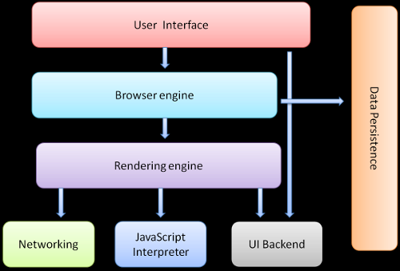

# 简介

网络浏览器很可能是使用最广的软件。在这篇入门文章中，我将会介绍它们的幕后工作原理。我们会了解到，从您在地址栏输入 google.com 直到您在浏览器屏幕上看到 Google 首页的整个过程中都发生了些什么。

## 浏览器的主要功能

浏览器的主要功能就是向服务器发出请求，在浏览器窗口中展示您选择的网络资源。这里所说的资源一般是指 HTML 文档，也可以是 PDF、图片或其他的类型。资源的位置由用户使用 URI（统一资源标示符）指定。

浏览器解释并显示 HTML 文件的方式是在 HTML 和 CSS 规范中指定的。这些规范由网络标准化组织 W3C（万维网联盟）进行维护。

多年以来，各浏览器都没有完全遵从这些规范，同时还在开发自己独有的扩展程序，这给网络开发人员带来了严重的兼容性问题。如今，大多数的浏览器都是或多或少地遵从规范。

浏览器的用户界面有很多彼此相同的元素，其中包括：

-  用来输入 URI 的地址栏
-  前进和后退按钮
-  书签设置选项
-  用于刷新和停止加载当前文档的刷新和停止按钮
-  用于返回主页的主页按钮

奇怪的是，浏览器的用户界面并没有任何正式的规范，这是多年来的最佳实践自然发展以及彼此之间相互模仿的结果。HTML5 也没有定义浏览器必须具有的用户界面元素，但列出了一些通用的元素，例如地址栏、状态栏和工具栏等。当然，各浏览器也可以有自己独特的功能，比如 Firefox 的下载管理器。

## 浏览器的高层结构

浏览器的主要组件为

1.  用户界面 - 包括地址栏、前进/后退按钮、书签菜单等。除了浏览器主窗口显示的您请求的页面外，其他显示的各个部分都属于用户界面。
2.  浏览器引擎 - 在用户界面和呈现引擎之间传送指令。
3.  呈现引擎 - 负责显示请求的内容。如果请求的内容是 HTML，它就负责解析 HTML 和 CSS 内容，并将解析后的内容显示在屏幕上。
4.  网络 - 用于网络调用，比如 HTTP 请求。其接口与平台无关，并为所有平台提供底层实现。
5.  用户界面后端 - 用于绘制基本的窗口小部件，比如组合框和窗口。其公开了与平台无关的通用接口，而在底层使用操作系统的用户界面方法。
6.  JavaScript 解释器。用于解析和执行 JavaScript 代码。
7.  数据存储。这是持久层。浏览器需要在硬盘上保存各种数据，例如 Cookie。新的 HTML 规范 (HTML5) 定义了“网络数据库”，这是一个完整（但是轻便）的浏览器内数据库。

值得注意的是，和大多数浏览器不同，Chrome 浏览器的每个标签页都分别对应一个呈现引擎实例。每个标签页都是一个独立的进程。

# 呈现引擎

呈现引擎的作用就是在浏览器的屏幕上显示请求的内容。

默认情况下，呈现引擎可显示 HTML 和 XML 文档与图片。通过插件（或浏览器扩展程序），还可以显示其他类型的内容；例如，使用 PDF 查看器插件就能显示 PDF 文档。但是在本章中，我们将集中介绍其主要用途：显示使用 CSS 格式化的 HTML 内容和图片。

本文所讨论的浏览器（Firefox、Chrome 浏览器和 Safari）是基于两种呈现引擎构建的。Firefox 使用的是 Gecko，这是 Mozilla 公司“自制”的呈现引擎。而 Safari 和 Chrome 浏览器使用的都是 WebKit。

WebKit 是一种开放源代码呈现引擎，起初用于 Linux 平台，随后由 Apple 公司进行修改，从而支持苹果机和 Windows。

## 主流程

呈现引擎一开始会从网络层获取请求文档的内容，内容的大小一般限制在 8000 个块以内。

然后进行如下所示的基本流程：

呈现引擎将开始解析 HTML 文档，并将各标记逐个转化成“内容树”上的 DOM 节点。同时也会解析外部 CSS 文件以及样式元素中的样式数据。HTML 中这些带有视觉指令的样式信息将用于创建另一个树结构：呈现树。

呈现树包含多个带有视觉属性（如颜色和尺寸）的矩形。这些矩形的排列顺序就是它们将在屏幕上显示的顺序。

呈现树构建完毕之后，进入“布局”处理阶段，也就是为每个节点分配一个应出现在屏幕上的确切坐标。下一个阶段是绘制 - 呈现引擎会遍历呈现树，由用户界面后端层将每个节点绘制出来。

需要着重指出的是，这是一个渐进的过程。为达到更好的用户体验，呈现引擎会力求尽快将内容显示在屏幕上。它不必等到整个 HTML 文档解析完毕之后，就会开始构建呈现树和设置布局。在不断接收和处理来自网络的其余内容的同时，呈现引擎会将部分内容解析并显示出来。

## 主流程示例

可以看出，虽然 WebKit 和 Gecko 使用的术语略有不同，但整体流程是基本相同的。

Gecko 将视觉格式化元素组成的树称为“框架树”。每个元素都是一个框架。WebKit 使用的术语是“呈现树”，它由“呈现对象”组成。对于元素的放置，WebKit 使用的术语是“布局”，而 Gecko 称之为“重排”。

对于连接 DOM 节点和可视化信息从而创建呈现树的过程，WebKit 使用的术语是“附加”。有一个细微的非语义差别，就是 Gecko 在 HTML 与 DOM 树之间还有一个称为“内容槽”的层，用于生成 DOM 元素。我们会逐一论述流程中的每一部分：

// TODO https://www.html5rocks.com/zh/tutorials/internals/howbrowserswork/#Parsing_general
