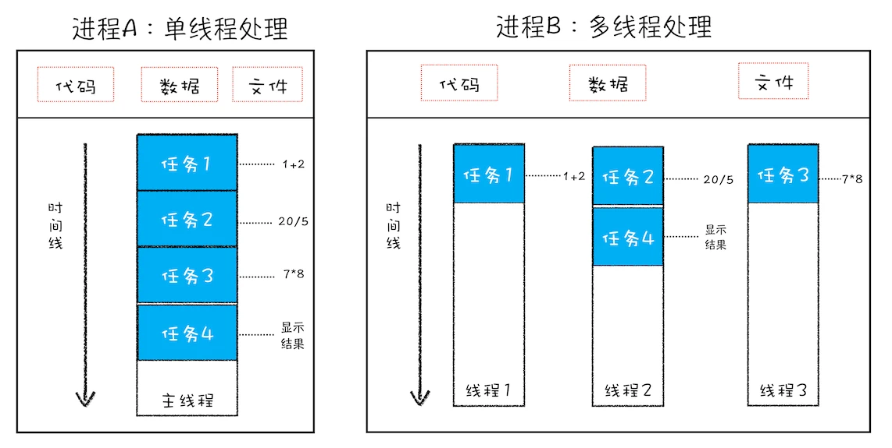

# Chrome 架构

在开始之前，我们一起看下，Chrome 打开一个页面需要启动多少进程？你可以点击 Chrome 浏览器右上角的“选项”菜单，选择“更多工具”子菜单，点击“任务管理器”，这将打开 Chrome 的任务管理器的窗口，如下图


和 Windows 任务管理器一样，Chrome 任务管理器也是用来展示运行中 Chrome 使用的进程信息的。从图中可以看到，Chrome 启动了 4 个进程，你也许会好奇，只是打开了 1 个页面，为什么要启动这么多进程呢？

在解答这个问题之前，我们需要了解一下进程的概念，不过由于好多人容易把进程和线程的概念混淆，从而影响后续其他概念的理解，所以这里我就将这两个概念以及它们之间的关系一并为你讲解下。

## 进程和线程

不过，在介绍进程和线程之前，我需要先讲解下什么是并行处理，因为如果你理解了并行处理的概念，那么再理解进程和线程之间的关系就会变得轻松许多。

### 什么是并行处理

计算机中的并行处理就是同一时刻处理多个任务，比如我们要计算下面这三个表达式的值，并显示出结果

```
A = 1+2
B = 20/5
C = 7*8
```

在编写代码的时候，我们可以把这个过程拆分为四个任务：

- 任务 1 是计算 A=1+2；
- 任务 2 是计算 B=20/5；
- 任务 3 是计算 C=7\*8；
- 任务 4 是显示最后计算的结果

正常情况下程序可以使用单线程来处理，也就是分四步按照顺序分别执行这四个任务。

如果采用多线程，会怎么样呢？我们只需分“两步走”：第一步，使用三个线程同时执行前三个任务；第二步，再执行第四个显示任务。

通过对比分析，你会发现用单线程执行需要四步，而使用多线程只需要两步。因此，使用并行处理能大大提升性能

### 线程 VS 进程

多线程可以并行处理任务，但是线程是不能单独存在的，它是由进程来启动和管理的。那什么又是进程呢？

一个进程就是一个程序的运行实例。详细解释就是，启动一个程序的时候，操作系统会为该程序创建一块内存，用来存放代码、运行中的数据和一个执行任务的主线程，我们把这样的一个运行环境叫进程。

为了让你更好地理解上述计算过程，我画了下面这张对比图



从图中可以看到，线程是依附于进程的，而进程中使用多线程并行处理能提升运算效率。

总结来说，进程和线程之间的关系有以下 4 个特点

1. 进程中的任意一线程执行出错，都会导致整个进程的崩溃。

    我们可以模拟以下场景：

    ```
    A = 1+2
    B = 20/0
    C = 7*8
    ```

    我把上述三个表达式稍作修改，在计算 B 的值的时候，我把表达式的分母改成 0，当线程执行到 B = 20/0 时，由于分母为 0，线程会执行出错，这样就会导致整个进程的崩溃，当然另外两个线程执行的结果也没有了

2. 线程之间共享进程中的数据。

    如下图所示，线程之间可以对进程的公共数据进行读写操作。

    
