# 页面性能分析：利用 chrome 做 web 性能分析

“浏览器中的页面循环系统”模块我们已经介绍完了，循环系统是页面的基础，理解了循环系统能让我们从本质上更好地理解页面的工作方式，加深我们对一些前端概念的理解。

接下来我们就要进入新的模块了，也就是“浏览器中的页面”模块，正如专栏简介中所言，页面是浏览器的核心，浏览器中的所有功能点都是服务于页面的，而 Chrome 开发者工具又是工程师调试页面的核心工具，所以在这个模块的开篇，我想先带你来深入了解下 Chrome 开发者工具。

Chrome 开发者工具（简称 DevTools）是一组网页制作和调试的工具，内嵌于 Google Chrome 浏览器中。Chrome 开发者工具非常重要，所蕴含的内容也是非常多的，熟练使用它能让你更加深入地了解浏览器内部工作原理。（Chrome 开发者工具也在不停地迭代改进，如果你想使用最新版本，可以使用 Chrome Canary。）

作为这一模块的第一篇文章，我们主要聚焦页面的源头和网络数据的接收，这些发送和接收的数据都能体现在开发者工具的网络面板上。不过为了你能更好地理解和掌握，我们会先对 Chrome 开发者工具做一个大致的介绍，然后再深入剖析网络面板

## Chrome 开发者工具

Chrome 开发者工具有很多重要的面板，比如与性能相关的有网络面板、Performance 面板、内存面板等，与调试页面相关的有 Elements 面板、Sources 面板、Console 面板等。

你可以在浏览器窗口的右上方选择 Chrome 菜单，然后选择“更多工具–> 开发者工具”来打开 Chrome 开发者工具。打开的页面如下图所示：


从图中可以看出，它一共包含了 10 个功能面板，包括了 Elements、Console、Sources、NetWork、Performance、Memory、Application、Security、Audits 和 Layers。

关于这 10 个面板的大致功能，我做了一个表格，感兴趣的话，你可以详细看下：


简单来说，Chrome 开发者工具为我们提供了通过界面访问或者编辑 DOM 和 CSSOM 的能力，还提供了强大的调试功能和查看性能指标的能力。

OK，接下来我们就要重点看下其中重要的 Network 面板，即网络面板

## 网络面板

网络面板由控制器、过滤器、抓图信息、时间线、详细列表和下载信息概要这 6 个区域构成（如下图所示）。

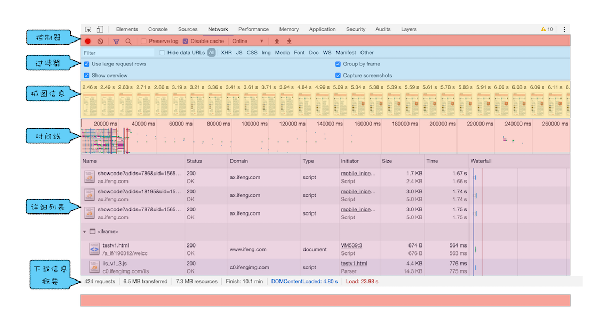

### 控制器

其中，控制器有 4 个比较重要的功能，我们按照下文中的这张图来简单介绍下。


- 红色圆点的按钮，表示“开始 / 暂停抓包”，这个功能很常见，很容易理解。
- “全局搜索”按钮，这个功能就非常重要了，可以在所有下载资源中搜索相关内容，还可以快速定位到某几个你想要的文件上。
- Disable cache，即“禁止从 Cache 中加载资源”的功能，它在调试 Web 应用的时候非常有用，因为开启了 Cache 会影响到网络性能测试的结果。
- Online 按钮，是“模拟 2G/3G”功能，它可以限制带宽，模拟弱网情况下页面的展现情况，然后你就可以根据实际展示情况来动态调整策略，以便让 Web 应用更加适用于这些弱网

### 过滤器

网络面板中的过滤器，主要就是起过滤功能。因为有时候一个页面有太多内容在详细列表区域中展示了，而你可能只想查看 JavaScript 文件或者 CSS 文件，这时候就可以通过过滤器模块来筛选你想要的文件类型。

### 抓图信息

抓图信息区域，可以用来分析用户等待页面加载时间内所看到的内容，分析用户实际的体验情况。比如，如果页面加载 1 秒多之后屏幕截图还是白屏状态，这时候就需要分析是网络还是代码的问题了。（勾选面板上的“Capture screenshots”即可启用屏幕截图。）

### 时间线

时间线，主要用来展示 HTTP、HTTPS、WebSocket 加载的状态和时间的一个关系，用于直观感受页面的加载过程。如果是多条竖线堆叠在一起，那说明这些资源被同时被加载。至于具体到每个文件的加载信息，还需要用到下面要讲的详细列表。

### 详细列表

这个区域是最重要的，它详细记录了每个资源从发起请求到完成请求这中间所有过程的状态，以及最终请求完成的数据信息。通过该列表，你就能很容易地去诊断一些网络问题。

详细列表是我们本篇文章介绍的重点，不过内容比较多，所以放到最后去专门介绍了。

### 下载信息概要

下载信息概要中，你要重点关注下 DOMContentLoaded 和 Load 两个事件，以及这两个事件的完成时间。

- DOMContentLoaded，这个事件发生后，说明页面已经构建好 DOM 了，这意味着构建 DOM 所需要的 HTML 文件、JavaScript 文件、CSS 文件都已经下载完成了。
- Load，说明浏览器已经加载了所有的资源（图像、样式表等）

通过下载信息概要面板，你可以查看触发这两个事件所花费的时间。

## 网络面板中的详细列表

下面我们就来重点介绍网络面板中的详细列表，这里面包含了大量有用的信息

### 列表的属性

列表的属性比较多，比如 Name、Status、Type、Initiator 等等，这个不难理解。当然，你还可以通过点击右键的下拉菜单来添加其他属性，这里我就不再赘述了，你可以自己上手实操一下。

另外，你也可以按照列表的属性来给列表排序，默认情况下，列表是按请求发起的时间来排序的，最早发起请求的资源在顶部。当然也可以按照返回状态码、请求类型、请求时长、内容大小等基础属性排序，只需点击相应属性即可。

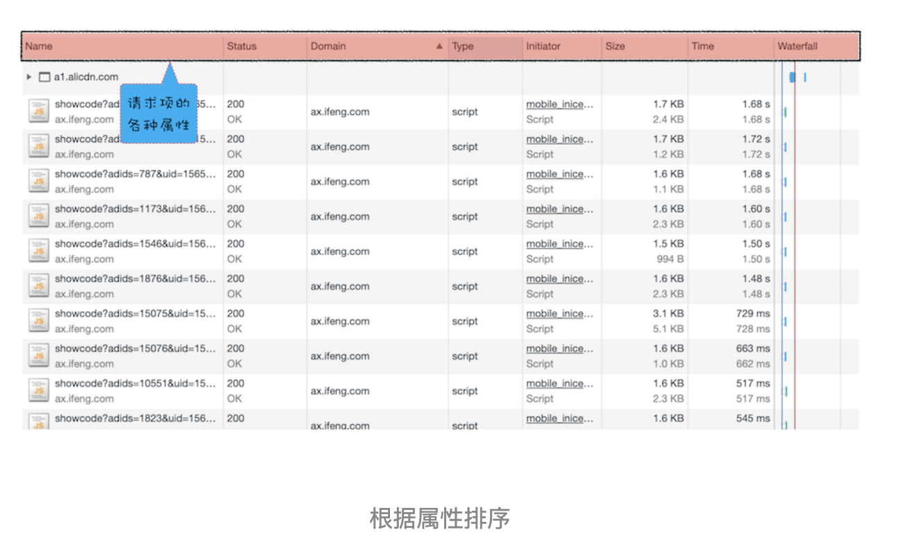

### 详细信息

如果你选中详细列表中的一项，右边就会出现该项的详细信息，如下所示：


你可以在此查看请求列表中任意一项的请求行和请求头信息，还可以查看响应行、响应头和响应体。然后你可以根据这些查看的信息来判断你的业务逻辑是否正确，或者有时候也可以用来逆向推导别人网站的业务逻辑。

### 单个资源的时间线

了解了每个资源的详细请求信息之后，我们再来分析单个资源请求时间线，这就涉及具体的 HTTP 请求流程了。


我们介绍过发起一个 HTTP 请求之后，浏览器首先查找缓存，如果缓存没有命中，那么继续发起 DNS 请求获取 IP 地址，然后利用 IP 地址和服务器端建立 TCP 连接，再发送 HTTP 请求，等待服务器响应；不过，如果服务器响应头中包含了重定向的信息，那么整个流程就需要重新再走一遍。这就是在浏览器中一个 HTTP 请求的基础流程。

那详细列表中是如何表示出这个流程的呢？这就要重点看下时间线面板了


那面板中这各项到底是什么含义呢？

> 第一个是 Queuing，也就是排队的意思，当浏览器发起一个请求的时候，会有很多原因导致该请求不能被立即执行，而是需要排队等待。导致请求处于排队状态的原因有很多。

- 首先，页面中的资源是有优先级的，比如 CSS、HTML、JavaScript 等都是页面中的核心文件，所以优先级最高；而图片、视频、音频这类资源就不是核心资源，优先级就比较低。通常当后者遇到前者时，就需要“让路”，进入待排队状态。
- 其次，我们前面也提到过，浏览器会为每个域名最多维护 6 个 TCP 连接，如果发起一个 HTTP 请求时，这 6 个 TCP 连接都处于忙碌状态，那么这个请求就会处于排队状态。
- 最后，网络进程在为数据分配磁盘空间时，新的 HTTP 请求也需要短暂地等待磁盘分配结束。

等待排队完成之后，就要进入发起连接的状态了。不过在发起连接之前，还有一些原因可能导致连接过程被推迟，这个推迟就表现在面板中的 Stalled 上，它表示停滞的意思。

这里需要额外说明的是，如果你使用了代理服务器，还会增加一个 Proxy Negotiation 阶段，也就是代理协商阶段，它表示代理服务器连接协商所用的时间，不过在上图中没有体现出来，因为这里我们没有使用代理服务器。

接下来，就到了 Initial connection/SSL 阶段了，也就是和服务器建立连接的阶段，这包括了建立 TCP 连接所花费的时间；不过如果你使用了 HTTPS 协议，那么还需要一个额外的 SSL 握手时间，这个过程主要是用来协商一些加密信息的。（关于 SSL 协商的详细过程，我们会在 Web 安全模块中介绍。）

和服务器建立好连接之后，网络进程会准备请求数据，并将其发送给网络，这就是 Request sent 阶段。通常这个阶段非常快，因为只需要把浏览器缓冲区的数据发送出去就结束了，并不需要判断服务器是否接收到了，所以这个时间通常不到 1 毫秒。

数据发送出去了，接下来就是等待接收服务器第一个字节的数据，这个阶段称为 Waiting (TTFB)，通常也称为“第一字节时间”。 TTFB 是反映服务端响应速度的重要指标，对服务器来说，TTFB 时间越短，就说明服务器响应越快。

接收到第一个字节之后，进入陆续接收完整数据的阶段，也就是 Content Download 阶段，这意味着从第一字节时间到接收到全部响应数据所用的时间

## 优化时间线上耗时项

了解了时间线面板上的各项含义之后，我们就可以根据这个请求的时间线来实现相关的优化操作了。

### 排队（Queuing）时间过久

排队时间过久，大概率是由浏览器为每个域名最多维护 6 个连接导致的。那么基于这个原因，你就可以让 1 个站点下面的资源放在多个域名下面，比如放到 3 个域名下面，这样就可以同时支持 18 个连接了，这种方案称为域名分片技术。除了域名分片技术外，我个人还建议你把站点升级到 HTTP2，因为 HTTP2 已经没有每个域名最多维护 6 个 TCP 连接的限制了。

### 第一字节时间（TTFB）时间过久

这可能的原因有如下：

- 服务器生成页面数据的时间过久。对于动态网页来说，服务器收到用户打开一个页面的请求时，首先要从数据库中读取该页面需要的数据，然后把这些数据传入到模板中，模板渲染后，再返回给用户。服务器在处理这个数据的过程中，可能某个环节会出问题。
- 网络的原因。比如使用了低带宽的服务器，或者本来用的是电信的服务器，可联通的网络用户要来访问你的服务器，这样也会拖慢网速。
- 发送请求头时带上了多余的用户信息。比如一些不必要的 Cookie 信息，服务器接收到这些 Cookie 信息之后可能需要对每一项都做处理，这样就加大了服务器的处理时长。

对于这三种问题，你要有针对性地出一些解决方案。面对第一种服务器的问题，你可以想办法去提高服务器的处理速度，比如通过增加各种缓存的技术；针对第二种网络问题，你可以使用 CDN 来缓存一些静态文件；至于第三种，你在发送请求时就去尽可能地减少一些不必要的 Cookie 数据信息

### Content Download 时间过久

如果单个请求的 Content Download 花费了大量时间，有可能是字节数太多的原因导致的。这时候你就需要减少文件大小，比如压缩、去掉源码中不必要的注释等方法。

## 总结

首先我们简单介绍了 Chrome 开发者工具 10 个基础的面板信息；然后重点剖析了网络面板，再结合之前介绍的网络请求流程来重点分析了网络面板中时间线的各个指标的含义；最后我们还简要分析了时间线中各项指标出现异常的可能原因，并给出了一些优化方案。

其实通过今天的分析，我们可以得出这样一个结论：如果你要去做一些实践性的项目优化，理解其背后的理论至关重要。因为理论就是一条“线”，它会把各种实践的内容“串”在一起，然后你可以围绕着这条“线”来排查问题

# DOM 树：JavaScript 是如何影响 DOM 树构建的

在上一篇文章中，我们通过开发者工具中的网络面板，介绍了网络请求过程的几种性能指标以及对页面加载的影响。

而在渲染流水线中，后面的步骤都直接或者间接地依赖于 DOM 结构，所以本文我们就继续沿着网络数据流路径来介绍 DOM 树是怎么生成的。然后再基于 DOM 树的解析流程介绍两块内容：第一个是在解析过程中遇到 JavaScript 脚本，DOM 解析器是如何处理的？第二个是 DOM 解析器是如何处理跨站点资源的？

## 什么是 DOM

从网络传给渲染引擎的 HTML 文件字节流是无法直接被渲染引擎理解的，所以要将其转化为渲染引擎能够理解的内部结构，这个结构就是 DOM。DOM 提供了对 HTML 文档结构化的表述。在渲染引擎中，DOM 有三个层面的作用

- 从页面的视角来看，DOM 是生成页面的基础数据结构。
- 从 JavaScript 脚本视角来看，DOM 提供给 JavaScript 脚本操作的接口，通过这套接口，JavaScript 可以对 DOM 结构进行访问，从而改变文档的结构、样式和内容。
- 从安全视角来看，DOM 是一道安全防护线，一些不安全的内容在 DOM 解析阶段就被拒之门外了。

简言之，DOM 是表述 HTML 的内部数据结构，它会将 Web 页面和 JavaScript 脚本连接起来，并过滤一些不安全的内容。

## DOM 树如何生成

在渲染引擎内部，有一个叫 HTML 解析器（HTMLParser）的模块，它的职责就是负责将 HTML 字节流转换为 DOM 结构。所以这里我们需要先要搞清楚 HTML 解析器是怎么工作的。

在开始介绍 HTML 解析器之前，我要先解释一个大家在留言区问到过好多次的问题：HTML 解析器是等整个 HTML 文档加载完成之后开始解析的，还是随着 HTML 文档边加载边解析的？

在这里我统一解答下，HTML 解析器并不是等整个文档加载完成之后再解析的，而是网络进程加载了多少数据，HTML 解析器便解析多少数据。

那详细的流程是怎样的呢？网络进程接收到响应头之后，会根据响应头中的 content-type 字段来判断文件的类型，比如 content-type 的值是“text/html”，那么浏览器就会判断这是一个 HTML 类型的文件，然后为该请求选择或者创建一个渲染进程。渲染进程准备好之后，网络进程和渲染进程之间会建立一个共享数据的管道，网络进程接收到数据后就往这个管道里面放，而渲染进程则从管道的另外一端不断地读取数据，并同时将读取的数据“喂”给 HTML 解析器。你可以把这个管道想象成一个“水管”，网络进程接收到的字节流像水一样倒进这个“水管”，而“水管”的另外一端是渲染进程的 HTML 解析器，它会动态接收字节流，并将其解析为 DOM。

解答完这个问题之后，接下来我们就可以来详细聊聊 DOM 的具体生成流程了。

前面我们说过代码从网络传输过来是字节流的形式，那么后续字节流是如何转换为 DOM 的呢？你可以参考下图：

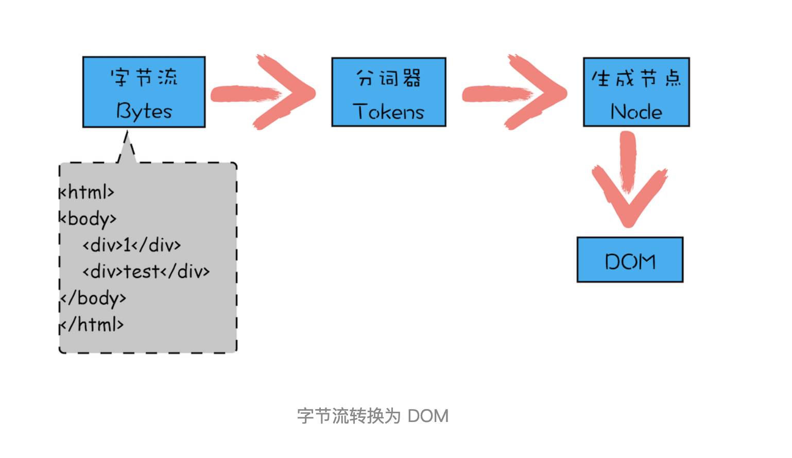

从图中你可以看出，字节流转换为 DOM 需要三个阶段。

第一个阶段，通过分词器将字节流转换为 Token。

前面文章中我们介绍过，V8 编译 JavaScript 过程中的第一步是做词法分析，将 JavaScript 先分解为一个个 Token。解析 HTML 也是一样的，需要通过分词器先将字节流转换为一个个 Token，分为 Tag Token 和文本 Token。上述 HTML 代码通过词法分析生成的 Token 如下所示：


由图可以看出，Tag Token 又分 StartTag 和 EndTag，分别对应图中的蓝色和红色块，文本 Token 对应的绿色块。至于后续的第二个和第三个阶段是同步进行的，需要将 Token 解析为 DOM 节点，并将 DOM 节点添加到 DOM 树中。

> HTML 解析器维护了一个 Token 栈结构，该 Token 栈主要用来计算节点之间的父子关系，在第一个阶段中生成的 Token 会被按照顺序压到这个栈中。具体的处理规则如下所示：

- 如果压入到栈中的是 StartTag Token，HTML 解析器会为该 Token 创建一个 DOM 节点，然后将该节点加入到 DOM 树中，它的父节点就是栈中相邻的那个元素生成的节点。
- 如果分词器解析出来是文本 Token，那么会生成一个文本节点，然后将该节点加入到 DOM 树中，文本 Token 是不需要压入到栈中，它的父节点就是当前栈顶 Token 所对应的 DOM 节点。
- 如果分词器解析出来的是 EndTag 标签，比如是 EndTag div，HTML 解析器会查看 Token 栈顶的元素是否是 StartTag div，如果是，就将 StartTag div 从栈中弹出，表示该 div 元素解析完成。

通过分词器产生的新 Token 就这样不停地压栈和出栈，整个解析过程就这样一直持续下去，直到分词器将所有字节流分词完成。

为了更加直观地理解整个过程，下面我们结合一段 HTML 代码（如下），来一步步分析 DOM 树的生成过程。

```html
<html>
  <body>
    <div>1</div>
    <div>test</div>
  </body>
</html>
```

这段代码以字节流的形式传给了 HTML 解析器，经过分词器处理，解析出来的第一个 Token 是 StartTag html，解析出来的 Token 会被压入到栈中，并同时创建一个 html 的 DOM 节点，将其加入到 DOM 树中。

这里需要补充说明下，HTML 解析器开始工作时，会默认创建了一个根为 document 的空 DOM 结构，同时会将一个 StartTag document 的 Token 压入栈底。然后经过分词器解析出来的第一个 StartTag html Token 会被压入到栈中，并创建一个 html 的 DOM 节点，添加到 document 上，如下图所示

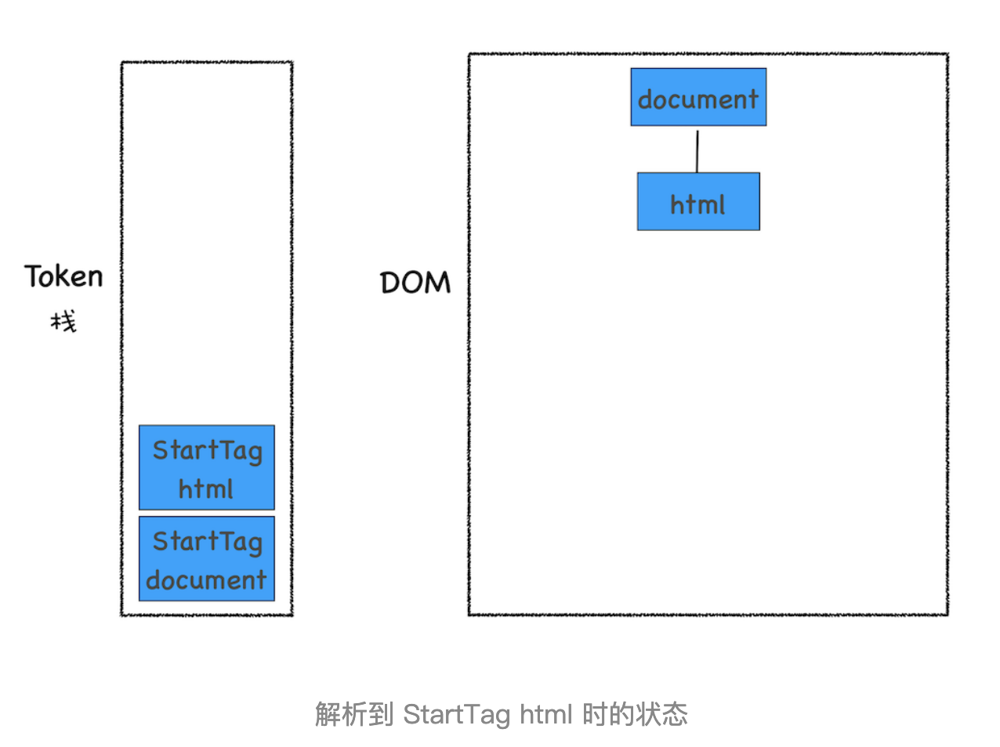

然后按照同样的流程解析出来 StartTag body 和 StartTag div，其 Token 栈和 DOM 的状态如下图所示：


接下来解析出来的是第一个 div 的文本 Token，渲染引擎会为该 Token 创建一个文本节点，并将该 Token 添加到 DOM 中，它的父节点就是当前 Token 栈顶元素对应的节点，如下图所示：


再接下来，分词器解析出来第一个 EndTag div，这时候 HTML 解析器会去判断当前栈顶的元素是否是 StartTag div，如果是则从栈顶弹出 StartTag div，如下图所示

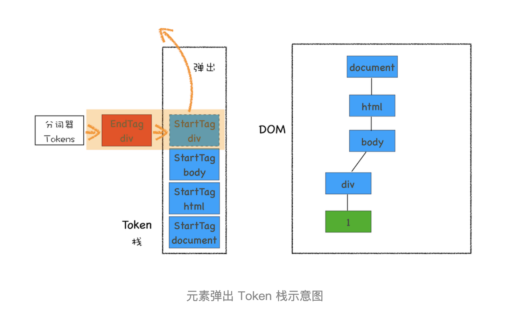

按照同样的规则，一路解析，最终结果如下图所示：


通过上面的介绍，相信你已经清楚 DOM 是怎么生成的了。不过在实际生产环境中，HTML 源文件中既包含 CSS 和 JavaScript，又包含图片、音频、视频等文件，所以处理过程远比上面这个示范 Demo 复杂。不过理解了这个简单的 Demo 生成过程，我们就可以往下分析更加复杂的场景了。

## JavaScript 是如何影响 DOM 生成的

我们再来看看稍微复杂点的 HTML 文件，如下所示：

```html
<html>
  <body>
    <div>1</div>
    <script>
      let div1 = document.getElementsByTagName('div')[0];
      div1.innerText = 'time.geekbang';
    </script>
    <div>test</div>
  </body>
</html>
```

我在两段 div 中间插入了一段 JavaScript 脚本，这段脚本的解析过程就有点不一样了。script 标签之前，所有的解析流程还是和之前介绍的一样，但是解析到 script 标签时，渲染引擎判断这是一段脚本，此时 HTML 解析器就会暂停 DOM 的解析，因为接下来的 JavaScript 可能要修改当前已经生成的 DOM 结构。

通过前面 DOM 生成流程分析，我们已经知道当解析到 script 脚本标签时，其 DOM 树结构如下所示：

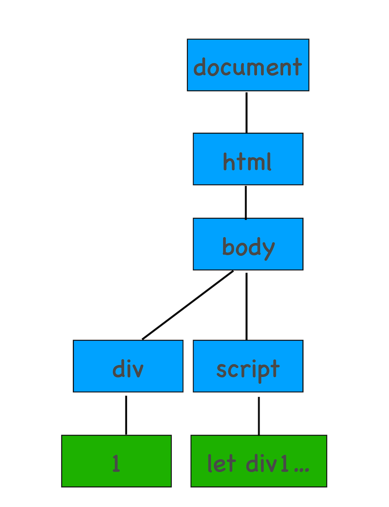

这时候 HTML 解析器暂停工作，JavaScript 引擎介入，并执行 script 标签中的这段脚本，因为这段 JavaScript 脚本修改了 DOM 中第一个 div 中的内容，所以执行这段脚本之后，div 节点内容已经修改为 time.geekbang 了。脚本执行完成之后，HTML 解析器恢复解析过程，继续解析后续的内容，直至生成最终的 DOM。

以上过程应该还是比较好理解的，不过除了在页面中直接内嵌 JavaScript 脚本之外，我们还通常需要在页面中引入 JavaScript 文件，这个解析过程就稍微复杂了些，如下面代码：

```js
//foo.js
let div1 = document.getElementsByTagName('div')[0];
div1.innerText = 'time.geekbang';
```

```html
<html>
  <body>
    <div>1</div>
    <script type="text/javascript" src="foo.js"></script>
    <div>test</div>
  </body>
</html>
```

这段代码的功能还是和前面那段代码是一样的，不过这里我把内嵌 JavaScript 脚本修改成了通过 JavaScript 文件加载。其整个执行流程还是一样的，执行到 JavaScript 标签时，暂停整个 DOM 的解析，执行 JavaScript 代码，不过这里执行 JavaScript 时，需要先下载这段 JavaScript 代码。这里需要重点关注下载环境，因为 JavaScript 文件的下载过程会阻塞 DOM 解析，而通常下载又是非常耗时的，会受到网络环境、JavaScript 文件大小等因素的影响。

不过 Chrome 浏览器做了很多优化，其中一个主要的优化是预解析操作。当渲染引擎收到字节流之后，会开启一个预解析线程，用来分析 HTML 文件中包含的 JavaScript、CSS 等相关文件，解析到相关文件之后，预解析线程会提前下载这些文件。

再回到 DOM 解析上，我们知道引入 JavaScript 线程会阻塞 DOM，不过也有一些相关的策略来规避，比如使用 CDN 来加速 JavaScript 文件的加载，压缩 JavaScript 文件的体积。另外，如果 JavaScript 文件中没有操作 DOM 相关代码，就可以将该 JavaScript 脚本设置为异步加载，通过 async 或 defer 来标记代码，使用方式如下所示：

```js
<script async type='text/javascript' src='foo.js'></script>
```

```js
<script defer type='text/javascript' src='foo.js'></script>
```

async 和 defer 虽然都是异步的，不过还有一些差异，使用 async 标志的脚本文件一旦加载完成，会立即执行；而使用了 defer 标记的脚本文件，需要在 DOMContentLoaded 事件之前执行。

现在我们知道了 JavaScript 是如何阻塞 DOM 解析的了，那接下来我们再来结合文中代码看看另外一种情况：

```html
<head>
  <style src="theme.css"></style>
</head>
```

```html
<body>
  <div>1</div>
  <script>
    let div1 = document.getElementsByTagName('div')[0]
    div1.innerText = 'time.geekbang' // 需要 DOM
    div1.style.color = 'red'  // 需要 CSSOM
  </script>
  <div>test</div>
</body>
</html>
```

该示例中，JavaScript 代码出现了 div1.style.color = ‘red' 的语句，它是用来操纵 CSSOM 的，所以在执行 JavaScript 之前，需要先解析 JavaScript 语句之上所有的 CSS 样式。所以如果代码里引用了外部的 CSS 文件，那么在执行 JavaScript 之前，还需要等待外部的 CSS 文件下载完成，并解析生成 CSSOM 对象之后，才能执行 JavaScript 脚本。

而 JavaScript 引擎在解析 JavaScript 之前，是不知道 JavaScript 是否操纵了 CSSOM 的，所以渲染引擎在遇到 JavaScript 脚本时，不管该脚本是否操纵了 CSSOM，都会执行 CSS 文件下载，解析操作，再执行 JavaScript 脚本。

所以说 JavaScript 脚本是依赖样式表的，这又多了一个阻塞过程。至于如何优化，我们在下篇文章中再来深入探讨。

通过上面的分析，我们知道了 JavaScript 会阻塞 DOM 生成，而样式文件又会阻塞 JavaScript 的执行，所以在实际的工程中需要重点关注 JavaScript 文件和样式表文件，使用不当会影响到页面性能。

## 总结

首先我们介绍了 DOM 是如何生成的，然后又基于 DOM 的生成过程分析了 JavaScript 是如何影响到 DOM 生成的。因为 CSS 和 JavaScript 都会影响到 DOM 的生成，所以我们又介绍了一些加速生成 DOM 的方案，理解了这些，能让你更加深刻地理解如何去优化首次页面渲染。

额外说明一下，渲染引擎还有一个安全检查模块叫 XSSAuditor，是用来检测词法安全的。在分词器解析出来 Token 之后，它会检测这些模块是否安全，比如是否引用了外部脚本，是否符合 CSP 规范，是否存在跨站点请求等。如果出现不符合规范的内容，XSSAuditor 会对该脚本或者下载任务进行拦截。详细内容我们会在后面的安全模块介绍，这里就不赘述了

# 渲染流水线：CSS 如何影响首次加载时的白屏时间？

在上一篇文章中我们详细介绍了 DOM 的生成过程，并结合具体例子分析了 JavaScript 是如何阻塞 DOM 生成的。那本文我们就继续深入聊聊渲染流水线中的 CSS。因为 CSS 是页面中非常重要的资源，它决定了页面最终显示出来的效果，并影响着用户对整个网站的第一体验。所以，搞清楚浏览器中的 CSS 是怎么工作的很有必要，只有理解了 CSS 是如何工作的，你才能更加深刻地理解如何去优化页面。

本文我们先站在渲染流水线的视角来介绍 CSS 是如何工作的，然后通过 CSS 的工作流程来分析性能瓶颈，最后再来讨论如何减少首次加载时的白屏时间

渲染流水线视角下的 CSS 我们先结合下面代码来看看最简单的渲染流程：

```css
/* theme.css */
div {
  color: coral;
  background-color: black;
}
```

```html
<html>
  <head>
    <link href="theme.css" rel="stylesheet" />
  </head>
  <body>
    <div>geekbang com</div>
  </body>
</html>
```

这两段代码分别由 CSS 文件和 HTML 文件构成，我们来分析下打开这段 HTML 文件时的渲染流水线，你可以先参考下面这张渲染流水线示意图：


下面我们结合上图来分析这个页面文件的渲染流水线。

首先是发起主页面的请求，这个发起请求方可能是渲染进程，也有可能是浏览器进程，发起的请求被送到网络进程中去执行。网络进程接收到返回的 HTML 数据之后，将其发送给渲染进程，渲染进程会解析 HTML 数据并构建 DOM。这里你需要特别注意下，请求 HTML 数据和构建 DOM 中间有一段空闲时间，这个空闲时间有可能成为页面渲染的瓶颈。

上一篇文章中我们提到过，当渲染进程接收 HTML 文件字节流时，会先开启一个预解析线程，如果遇到 JavaScript 文件或者 CSS 文件，那么预解析线程会提前下载这些数据。对于上面的代码，预解析线程会解析出来一个外部的 theme.css 文件，并发起 theme.css 的下载。这里也有一个空闲时间需要你注意一下，就是在 DOM 构建结束之后、theme.css 文件还未下载完成的这段时间内，渲染流水线无事可做，因为下一步是合成布局树，而合成布局树需要 CSSOM 和 DOM，所以这里需要等待 CSS 加载结束并解析成 CSSOM。

## 那渲染流水线为什么需要 CSSOM 呢？

和 HTML 一样，渲染引擎也是无法直接理解 CSS 文件内容的，所以需要将其解析成渲染引擎能够理解的结构，这个结构就是 CSSOM。和 DOM 一样，CSSOM 也具有两个作用，第一个是提供给 JavaScript 操作样式表的能力，第二个是为布局树的合成提供基础的样式信息。这个 CSSOM 体现在 DOM 中就是 document.styleSheets。具体结构你可以去查阅相关资料，这里我就不过多介绍了，你知道 CSSOM 的两个作用是怎样的就行了。

有了 DOM 和 CSSOM，接下来就可以合成布局树了，我们在前面讲解过布局树的构造过程，这里咱们再简单回顾下。等 DOM 和 CSSOM 都构建好之后，渲染引擎就会构造布局树。布局树的结构基本上就是复制 DOM 树的结构，不同之处在于 DOM 树中那些不需要显示的元素会被过滤掉，如 display:none 属性的元素、head 标签、script 标签等。复制好基本的布局树结构之后，渲染引擎会为对应的 DOM 元素选择对应的样式信息，这个过程就是样式计算。样式计算完成之后，渲染引擎还需要计算布局树中每个元素对应的几何位置，这个过程就是计算布局。通过样式计算和计算布局就完成了最终布局树的构建。再之后，就该进行后续的绘制操作了。

这就是在渲染过程中涉及到 CSS 的一些主要流程。

了解了这些之后，我们再来看看稍微复杂一点的场景，还是看下面这段 HTML 代码：

```css
/* theme.css */
div {
  color: coral;
  background-color: black;
}
```

```html
<html>
  <head>
    <link href="theme.css" rel="stylesheet" />
  </head>
  <body>
    <div>geekbang com</div>
    <script>
      console.log('time.geekbang.org');
    </script>
    <div>geekbang com</div>
  </body>
</html>
```

这段代码是我在开头代码的基础之上做了一点小修改，在 body 标签内部加了一个简单的 JavaScript。有了 JavaScript，渲染流水线就有点不一样了，可以参考下面这张渲染流水线图：

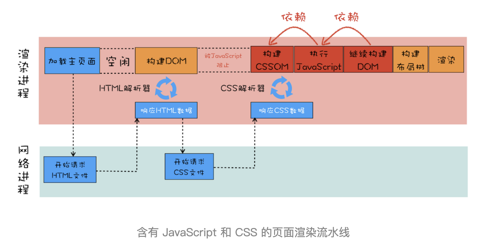

那我们就结合这张图来分析含有外部 CSS 文件和 JavaScript 代码的页面渲染流水线，上一篇文章中我们提到过在解析 DOM 的过程中，如果遇到了 JavaScript 脚本，那么需要先暂停 DOM 解析去执行 JavaScript，因为 JavaScript 有可能会修改当前状态下的 DOM。

不过在执行 JavaScript 脚本之前，如果页面中包含了外部 CSS 文件的引用，或者通过 style 标签内置了 CSS 内容，那么渲染引擎还需要将这些内容转换为 CSSOM，因为 JavaScript 有修改 CSSOM 的能力，所以在执行 JavaScript 之前，还需要依赖 CSSOM。也就是说 CSS 在部分情况下也会阻塞 DOM 的生成。

我们再来看看更加复杂一点的情况，如果在 body 中被包含的是 JavaScript 外部引用文件，Demo 代码如下所示：

```css
/* theme.css */
div {
  color: coral;
  background-color: black;
}
```

```js
// foo.js
console.log('time.geekbang.org');
```

```html
<html>
  <head>
    <link href="theme.css" rel="stylesheet" />
  </head>
  <body>
    <div>geekbang com</div>
    <script src="foo.js"></script>
    <div>geekbang com</div>
  </body>
</html>
```

从上面代码可以看出来，HTML 文件中包含了 CSS 的外部引用和 JavaScript 外部文件，那它们的渲染流水线是怎样的呢？可参考下图

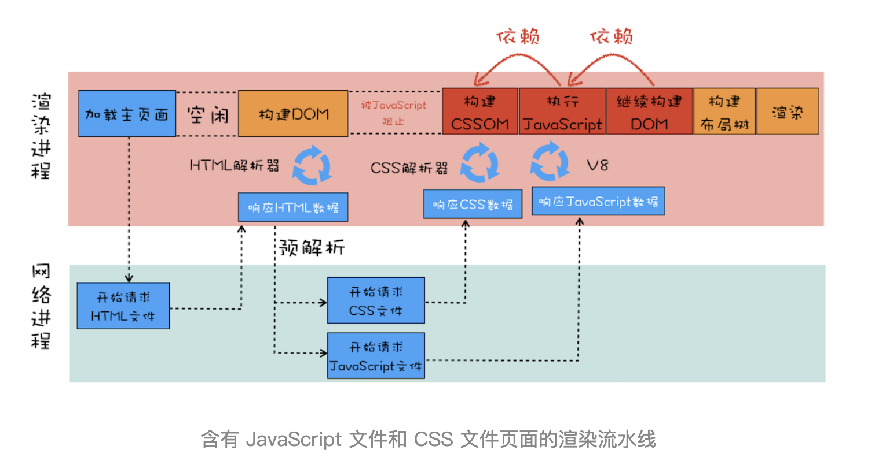

从图中可以看出来，在接收到 HTML 数据之后的预解析过程中，HTML 预解析器识别出来了有 CSS 文件和 JavaScript 文件需要下载，然后就同时发起这两个文件的下载请求，需要注意的是，这两个文件的下载过程是重叠的，所以下载时间按照最久的那个文件来算。

后面的流水线就和前面是一样的了，不管 CSS 文件和 JavaScript 文件谁先到达，都要先等到 CSS 文件下载完成并生成 CSSOM，然后再执行 JavaScript 脚本，最后再继续构建 DOM，构建布局树，绘制页面。

## 影响页面展示的因素以及优化策略

前面我们为什么要花这么多文字来分析渲染流水线呢？主要原因就是渲染流水线影响到了首次页面展示的速度，而首次页面展示的速度又直接影响到了用户体验，所以我们分析渲染流水线的目的就是为了找出一些影响到首屏展示的因素，然后再基于这些因素做一些针对性的调整。

那么接下来我们就来看看从发起 URL 请求开始，到首次显示页面的内容，在视觉上经历的三个阶段。

- 第一个阶段，等请求发出去之后，到提交数据阶段，这时页面展示出来的还是之前页面的内容。
- 第二个阶段，提交数据之后渲染进程会创建一个空白页面，我们通常把这段时间称为解析白屏，并等待 CSS 文件和 JavaScript 文件的加载完成，生成 CSSOM 和 DOM，然后合成布局树，最后还要经过一系列的步骤准备首次渲染。
- 第三个阶段，等首次渲染完成之后，就开始进入完整页面的生成阶段了，然后页面会一点点被绘制出来。

影响第一个阶段的因素主要是网络或者是服务器处理这块儿，前面文章中我们已经讲过了，这里我们就不再继续分析了。至于第三个阶段，我们会在后续文章中分析，所以这里也不做介绍了。

现在我们重点关注第二个阶段，这个阶段的主要问题是白屏时间，如果白屏时间过久，就会影响到用户体验。为了缩短白屏时间，我们来挨个分析这个阶段的主要任务，包括了解析 HTML、下载 CSS、下载 JavaScript、生成 CSSOM、执行 JavaScript、生成布局树、绘制页面一系列操作。

通常情况下的瓶颈主要体现在下载 CSS 文件、下载 JavaScript 文件和执行 JavaScript。

所以要想缩短白屏时长，可以有以下策略

- 通过内联 JavaScript、内联 CSS 来移除这两种类型的文件下载，这样获取到 HTML 文件之后就可以直接开始渲染流程了。
- 但并不是所有的场合都适合内联，那么还可以尽量减少文件大小，比如通过 webpack 等工具移除一些不必要的注释，并压缩 JavaScript 文件。
- 还可以将一些不需要在解析 HTML 阶段使用的 JavaScript 标记上 async 或者 defer。
- 对于大的 CSS 文件，可以通过媒体查询属性，将其拆分为多个不同用途的 CSS 文件，这样只有在特定的场景下才会加载特定的 CSS 文件。

通过以上策略就能缩短白屏展示的时长了，不过在实际项目中，总是存在各种各样的情况，这些策略并不能随心所欲地去引用，所以还需要结合实际情况来调整最佳方案。

## 总结

我们首先介绍了 CSS 在渲染流水线中的位置，以及 CSS 是如何影响到渲染流程的；接下来我们通过渲染流水线分析了从发出请求到页面首次绘制的三个阶段；最后重点介绍了第二个白屏阶段以及优化该阶段的一些策略。通过今天的内容我们可以知道虽然 JavaScript 和 CSS 给我们带来了极大的便利，不过也对页面的渲染带来了很多的限制，所以我们要关注资源加载速度，需要小心翼翼地处理各种资源之间的关联关系。

# 分层和合成机制：为什么 css 动画比 JavaScript 高效

本文我们主要讲解渲染引擎的分层和合成机制，因为分层和合成机制代表了浏览器最为先进的合成技术，Chrome 团队为了做到这一点，做了大量的优化工作。了解其工作原理，有助于拓宽你的视野，而且也有助于你更加深刻地理解 CSS 动画和 JavaScript 底层工作机制。

## 显示器是怎么显示图像的

每个显示器都有固定的刷新频率，通常是 60HZ，也就是每秒更新 60 张图片，更新的图片都来自于显卡中一个叫前缓冲区的地方，显示器所做的任务很简单，就是每秒固定读取 60 次前缓冲区中的图像，并将读取的图像显示到显示器上。

那么这里显卡做什么呢？

显卡的职责就是合成新的图像，并将图像保存到后缓冲区中，一旦显卡把合成的图像写到后缓冲区，系统就会让后缓冲区和前缓冲区互换，这样就能保证显示器能读取到最新显卡合成的图像。通常情况下，显卡的更新频率和显示器的刷新频率是一致的。但有时候，在一些复杂的场景中，显卡处理一张图片的速度会变慢，这样就会造成视觉上的卡顿。

## 帧 VS 帧率

了解了显示器是怎么显示图像的之后，下面我们再来明确下帧和帧率的概念，因为这是后续一切分析的基础。

当你通过滚动条滚动页面，或者通过手势缩放页面时，屏幕上就会产生动画的效果。之所以你能感觉到有动画的效果，是因为在滚动或者缩放操作时，渲染引擎会通过渲染流水线生成新的图片，并发送到显卡的后缓冲区。

大多数设备屏幕的更新频率是 60 次 / 秒，这也就意味着正常情况下要实现流畅的动画效果，渲染引擎需要每秒更新 60 张图片到显卡的后缓冲区。

我们把渲染流水线生成的每一副图片称为一帧，把渲染流水线每秒更新了多少帧称为帧率，比如滚动过程中 1 秒更新了 60 帧，那么帧率就是 60Hz（或者 60FPS）。

由于用户很容易观察到那些丢失的帧，如果在一次动画过程中，渲染引擎生成某些帧的时间过久，那么用户就会感受到卡顿，这会给用户造成非常不好的印象。

要解决卡顿问题，就要解决每帧生成时间过久的问题，为此 Chrome 对浏览器渲染方式做了大量的工作，其中最卓有成效的策略就是引入了分层和合成机制。分层和合成机制代表了当今最先进的渲染技术，所以接下来我们就来分析下什么是合成和渲染技术

## 如何生成一帧图像

不过在开始之前，我们还需要聊一聊渲染引擎是如何生成一帧图像的。这需要回顾下我们前面介绍的渲染流水线。关于其中任意一帧的生成方式，有重排、重绘和合成三种方式

这三种方式的渲染路径是不同的，通常渲染路径越长，生成图像花费的时间就越多。比如重排，它需要重新根据 CSSOM 和 DOM 来计算布局树，这样生成一幅图片时，会让整个渲染流水线的每个阶段都执行一遍，如果布局复杂的话，就很难保证渲染的效率了。而重绘因为没有了重新布局的阶段，操作效率稍微高点，但是依然需要重新计算绘制信息，并触发绘制操作之后的一系列操作。

相较于重排和重绘，合成操作的路径就显得非常短了，并不需要触发布局和绘制两个阶段，如果采用了 GPU，那么合成的效率会非常高。

所以，关于渲染引擎生成一帧图像的几种方式，按照效率我们推荐合成方式优先，若实在不能满足需求，那么就再退后一步使用重绘或者重排的方式。

本文我们的焦点在合成上，所以接下来我们就来深入分析下 Chrome 浏览器是怎么实现合成操作的。Chrome 中的合成技术，可以用三个词来概括总结：分层、分块和合成

## 分层和合成

通常页面的组成是非常复杂的，有的页面里要实现一些复杂的动画效果，比如点击菜单时弹出菜单的动画特效，滚动鼠标滚轮时页面滚动的动画效果，当然还有一些炫酷的 3D 动画特效。如果没有采用分层机制，从布局树直接生成目标图片的话，那么每次页面有很小的变化时，都会触发重排或者重绘机制，这种“牵一发而动全身”的绘制策略会严重影响页面的渲染效率。

为了提升每帧的渲染效率，Chrome 引入了分层和合成的机制。那该怎么来理解分层和合成机制呢？

你可以把一张网页想象成是由很多个图片叠加在一起的，每个图片就对应一个图层，Chrome 合成器最终将这些图层合成了用于显示页面的图片。如果你熟悉 PhotoShop 的话，就能很好地理解这个过程了，PhotoShop 中一个项目是由很多图层构成的，每个图层都可以是一张单独图片，可以设置透明度、边框阴影，可以旋转或者设置图层的上下位置，将这些图层叠加在一起后，就能呈现出最终的图片了。

在这个过程中，将素材分解为多个图层的操作就称为分层，最后将这些图层合并到一起的操作就称为合成。所以，分层和合成通常是一起使用的。

考虑到一个页面被划分为两个层，当进行到下一帧的渲染时，上面的一帧可能需要实现某些变换，如平移、旋转、缩放、阴影或者 Alpha 渐变，这时候合成器只需要将两个层进行相应的变化操作就可以了，显卡处理这些操作驾轻就熟，所以这个合成过程时间非常短。

理解了为什么要引入合成和分层机制，下面我们再来看看 Chrome 是怎么实现分层和合成机制的。

在 Chrome 的渲染流水线中，分层体现在生成布局树之后，渲染引擎会根据布局树的特点将其转换为层树（Layer Tree），层树是渲染流水线后续流程的基础结构。

层树中的每个节点都对应着一个图层，下一步的绘制阶段就依赖于层树中的节点。在前面我们介绍过，绘制阶段其实并不是真正地绘出图片，而是将绘制指令组合成一个列表，比如一个图层要设置的背景为黑色，并且还要在中间画一个圆形，那么绘制过程会生成|Paint BackGroundColor:Black | Paint Circle|这样的绘制指令列表，绘制过程就完成了。

有了绘制列表之后，就需要进入光栅化阶段了，光栅化就是按照绘制列表中的指令生成图片。每一个图层都对应一张图片，合成线程有了这些图片之后，会将这些图片合成为“一张”图片，并最终将生成的图片发送到后缓冲区。这就是一个大致的分层、合成流程。

需要重点关注的是，合成操作是在合成线程上完成的，这也就意味着在执行合成操作时，是不会影响到主线程执行的。这就是为什么经常主线程卡住了，但是 CSS 动画依然能执行的原因。

## 分块

如果说分层是从宏观上提升了渲染效率，那么分块则是从微观层面提升了渲染效率。

通常情况下，页面的内容都要比屏幕大得多，显示一个页面时，如果等待所有的图层都生成完毕，再进行合成的话，会产生一些不必要的开销，也会让合成图片的时间变得更久。

因此，合成线程会将每个图层分割为大小固定的图块，然后优先绘制靠近视口的图块，这样就可以大大加速页面的显示速度。不过有时候， 即使只绘制那些优先级最高的图块，也要耗费不少的时间，因为涉及到一个很关键的因素——纹理上传，这是因为从计算机内存上传到 GPU 内存的操作会比较慢。

为了解决这个问题，Chrome 又采取了一个策略：在首次合成图块的时候使用一个低分辨率的图片。比如可以是正常分辨率的一半，分辨率减少一半，纹理就减少了四分之三。在首次显示页面内容的时候，将这个低分辨率的图片显示出来，然后合成器继续绘制正常比例的网页内容，当正常比例的网页内容绘制完成后，再替换掉当前显示的低分辨率内容。这种方式尽管会让用户在开始时看到的是低分辨率的内容，但是也比用户在开始时什么都看不到要好

## 如何利用分层技术优化代码

通过上面的介绍，相信你已经理解了渲染引擎是怎么将布局树转换为漂亮图片的，理解其中原理之后，你就可以利用分层和合成技术来优化代码了。

在写 Web 应用的时候，你可能经常需要对某个元素做几何形状变换、透明度变换或者一些缩放操作，如果使用 JavaScript 来写这些效果，会牵涉到整个渲染流水线，所以 JavaScript 的绘制效率会非常低下。

这时你可以使用 will-change 来告诉渲染引擎你会对该元素做一些特效变换，CSS 代码如下：

```css
.box {
  will-change: transform, opacity;
}
```

这段代码就是提前告诉渲染引擎 box 元素将要做几何变换和透明度变换操作，这时候渲染引擎会将该元素单独实现一帧，等这些变换发生时，渲染引擎会通过合成线程直接去处理变换，这些变换并没有涉及到主线程，这样就大大提升了渲染的效率。这也是 CSS 动画比 JavaScript 动画高效的原因。

所以，如果涉及到一些可以使用合成线程来处理 CSS 特效或者动画的情况，就尽量使用 will-change 来提前告诉渲染引擎，让它为该元素准备独立的层。但是凡事都有两面性，每当渲染引擎为一个元素准备一个独立层的时候，它占用的内存也会大大增加，因为从层树开始，后续每个阶段都会多一个层结构，这些都需要额外的内存，所以你需要恰当地使用 will-change。

## 总结

- 首先我们介绍了显示器显示图像的原理，以及帧和帧率的概念，然后基于帧和帧率我们又介绍渲染引擎是如何实现一帧图像的。通常渲染引擎生成一帧图像有三种方式：重排、重绘和合成。其中重排和重绘操作都是在渲染进程的主线程上执行的，比较耗时；而合成操作是在渲染进程的合成线程上执行的，执行速度快，且不占用主线程。
- 然后我们重点介绍了浏览器是怎么实现合成的，其技术细节主要可以使用三个词来概括：分层、分块和合成。
- 最后我们还讲解了 CSS 动画比 JavaScript 动画高效的原因，以及怎么使用 will-change 来优化动画或特效。

# 页面性能：如何系统优化页面

在前面几篇文章中，我们分析了页面加载和 DOM 生成，讨论了 JavaScript 和 CSS 是如何影响到 DOM 生成的，还结合渲染流水线来讲解了分层和合成机制，同时在这些文章里面，我们还穿插说明了很多优化页面性能的最佳实践策略。通过这些知识点的学习，相信你已经知道渲染引擎是怎么绘制出帧的，不过之前我们介绍的内容比较零碎、比较散，那么今天我们就来将这些内容系统性地串起来。

那么怎么才能把这些知识点串起来呢？我的思路是从如何系统优化页面速度的角度来切入。

这里我们所谈论的页面优化，其实就是要让页面更快地显示和响应。由于一个页面在它不同的阶段，所侧重的关注点是不一样的，所以如果我们要讨论页面优化，就要分析一个页面生存周期的不同阶段。

通常一个页面有三个阶段：加载阶段、交互阶段和关闭阶段

- 加载阶段，是指从发出请求到渲染出完整页面的过程，影响到这个阶段的主要因素有网络和 JavaScript 脚本。
- 交互阶段，主要是从页面加载完成到用户交互的整合过程，影响到这个阶段的主要因素是 JavaScript 脚本。
- 关闭阶段，主要是用户发出关闭指令后页面所做的一些清理操作

这里我们需要重点关注加载阶段和交互阶段，因为影响到我们体验的因素主要都在这两个阶段，下面我们就来逐个详细分析下。

## 加载阶段

我们先来分析如何系统优化加载阶段中的页面，还是先看一个典型的渲染流水线，如下图所示

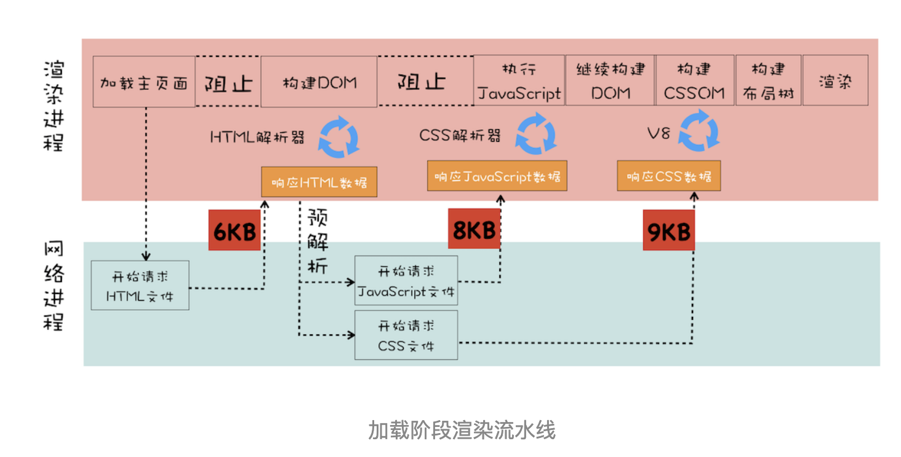

观察上面这个渲染流水线，你能分析出来有哪些因素影响了页面加载速度吗？下面我们就先来分析下这个问题。

通过前面文章的讲解，你应该已经知道了并非所有的资源都会阻塞页面的首次绘制，比如图片、音频、视频等文件就不会阻塞页面的首次渲染；而 JavaScript、首次请求的 HTML 资源文件、CSS 文件是会阻塞首次渲染的，因为在构建 DOM 的过程中需要 HTML 和 JavaScript 文件，在构造渲染树的过程中需要用到 CSS 文件。

我们把这些能阻塞网页首次渲染的资源称为关键资源。基于关键资源，我们可以继续细化出来三个影响页面首次渲染的核心因素。

### 核心因素

#### 关键资源个数

关键资源个数越多，首次页面的加载时间就会越长。比如上图中的关键资源个数就是 3 个，1 个 HTML 文件、1 个 JavaScript 和 1 个 CSS 文件。

#### 关键资源大小

通常情况下，所有关键资源的内容越小，其整个资源的下载时间也就越短，那么阻塞渲染的时间也就越短。上图中关键资源的大小分别是 6KB、8KB 和 9KB，那么整个关键资源大小就是 23KB。

#### 请求关键资源

请求关键资源需要多少个 RTT（Round Trip Time），那什么是 RTT 呢？ 在之前中我们分析过，当使用 TCP 协议传输一个文件时，比如这个文件大小是 0.1M，由于 TCP 的特性，这个数据并不是一次传输到服务端的，而是需要拆分成一个个数据包来回多次进行传输的。RTT 就是这里的往返时延。它是网络中一个重要的性能指标，表示从发送端发送数据开始，到发送端收到来自接收端的确认，总共经历的时延。通常 1 个 HTTP 的数据包在 14KB 左右，所以 1 个 0.1M 的页面就需要拆分成 8 个包来传输了，也就是说需要 8 个 RTT

我们可以结合上图来看看它的关键资源请求需要多少个 RTT。首先是请求 HTML 资源，大小是 6KB，小于 14KB，所以 1 个 RTT 就可以解决了。至于 JavaScript 和 CSS 文件，这里需要注意一点，由于渲染引擎有一个预解析的线程，在接收到 HTML 数据之后，预解析线程会快速扫描 HTML 数据中的关键资源，一旦扫描到了，会立马发起请求，你可以认为 JavaScript 和 CSS 是同时发起请求的，所以它们的请求是重叠的，那么计算它们的 RTT 时，只需要计算体积最大的那个数据就可以了。这里最大的是 CSS 文件（9KB），所以我们就按照 9KB 来计算，同样由于 9KB 小于 14KB，所以 JavaScript 和 CSS 资源也就可以算成 1 个 RTT。也就是说，上图中关键资源请求共花费了 2 个 RTT。

了解了影响加载过程中的几个核心因素之后，接下来我们就可以系统性地考虑优化方案了。总的优化原则就是减少关键资源个数，降低关键资源大小，降低关键资源的 RTT 次数

### 解决方案

#### 如何减少关键资源的个数？

一种方式是可以将 JavaScript 和 CSS 改成内联的形式，比如上图的 JavaScript 和 CSS，若都改成内联模式，那么关键资源的个数就由 3 个减少到了 1 个。另一种方式，如果 JavaScript 代码没有 DOM 或者 CSSOM 的操作，则可以改成 async 或者 defer 属性；同样对于 CSS，如果不是在构建页面之前加载的，则可以添加媒体取消阻止显现的标志。当 JavaScript 标签加上了 async 或者 defer、CSSlink 属性之前加上了取消阻止显现的标志后，它们就变成了非关键资源了。

#### 如何减少关键资源的大小？

可以压缩 CSS 和 JavaScript 资源，移除 HTML、CSS、JavaScript 文件中一些注释内容，也可以通过前面讲的取消 CSS 或者 JavaScript 中关键资源的方式。

#### 如何减少关键资源 RTT 的次数？

可以通过减少关键资源的个数和减少关键资源的大小搭配来实现。除此之外，还可以使用 CDN 来减少每次 RTT 时长。

在优化实际的页面加载速度时，你可以先画出优化之前关键资源的图表，然后按照上面优化关键资源的原则去优化，优化完成之后再画出优化之后的关键资源图表。

## 交互阶段

接下来我们再来聊聊页面加载完成之后的交互阶段以及应该如何去优化。谈交互阶段的优化，其实就是在谈渲染进程渲染帧的速度，因为在交互阶段，帧的渲染速度决定了交互的流畅度。因此讨论页面优化实际上就是讨论渲染引擎是如何渲染帧的，否则就无法优化帧率。

我们先来看看交互阶段的渲染流水线（如下图）。和加载阶段的渲染流水线有一些不同的地方是，在交互阶段没有了加载关键资源和构建 DOM、CSSOM 流程，通常是由 JavaScript 触发交互动画的。

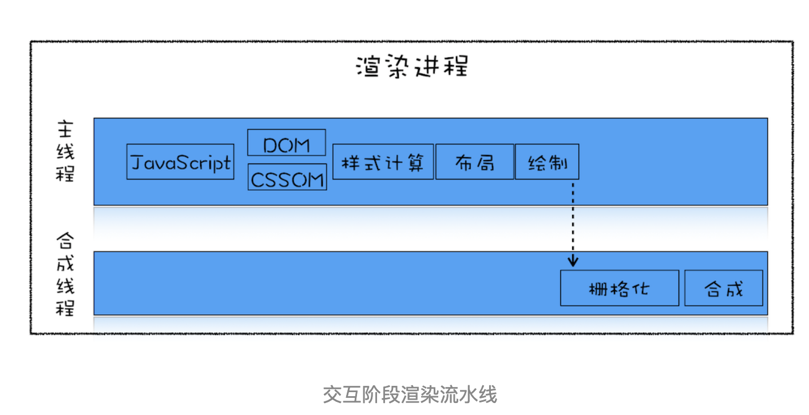

结合上图，我们来一起回顾下交互阶段是如何生成一个帧的。大部分情况下，生成一个新的帧都是由 JavaScript 通过修改 DOM 或者 CSSOM 来触发的。还有另外一部分帧是由 CSS 来触发的。

如果在计算样式阶段发现有布局信息的修改，那么就会触发重排操作，然后触发后续渲染流水线的一系列操作，这个代价是非常大的。

同样如果在计算样式阶段没有发现有布局信息的修改，只是修改了颜色一类的信息，那么就不会涉及到布局相关的调整，所以可以跳过布局阶段，直接进入绘制阶段，这个过程叫重绘。不过重绘阶段的代价也是不小的。

还有另外一种情况，通过 CSS 实现一些变形、渐变、动画等特效，这是由 CSS 触发的，并且是在合成线程上执行的，这个过程称为合成。因为它不会触发重排或者重绘，而且合成操作本身的速度就非常快，所以执行合成是效率最高的方式。

回顾了在交互过程中的帧是如何生成的，那接下来我们就可以讨论优化方案了。一个大的原则就是让单个帧的生成速度变快。所以，下面我们就来分析下在交互阶段渲染流水线中有哪些因素影响了帧的生成速度以及如何去优化

### 减少 JavaScript 脚本执行时间

有时 JavaScript 函数的一次执行时间可能有几百毫秒，这就严重霸占了主线程执行其他渲染任务的时间。针对这种情况我们可以采用以下两种策略

- 一种是将一次执行的函数分解为多个任务，使得每次的执行时间不要过久。
- 另一种是采用 Web Workers。你可以把 Web Workers 当作主线程之外的一个线程，在 Web Workers 中是可以执行 JavaScript 脚本的，不过 Web Workers 中没有 DOM、CSSOM 环境，这意味着在 Web Workers 中是无法通过 JavaScript 来访问 DOM 的，所以我们可以把一些和 DOM 操作无关且耗时的任务放到 Web Workers 中去执行

总之，在交互阶段，对 JavaScript 脚本总的原则就是不要一次霸占太久主线程。

### 避免强制同步布局

在介绍强制同步布局之前，我们先来聊聊正常情况下的布局操作。通过 DOM 接口执行添加元素或者删除元素等操作后，是需要重新计算样式和布局的，不过正常情况下这些操作都是在另外的任务中异步完成的，这样做是为了避免当前的任务占用太长的主线程时间。为了直观理解，你可以参考下面的代码：

```html
<html>
  <body>
    <div id="mian_div">
      <li id="time_li">time</li>
      <li>geekbang</li>
    </div>

    <p id="demo">强制布局 demo</p>
    <button onclick="foo()">添加新元素</button>

    <script>
      function foo() {
        let main_div = document.getElementById('mian_div');
        let new_node = document.createElement('li');
        let textnode = document.createTextNode('time.geekbang');
        new_node.appendChild(textnode);
        document.getElementById('mian_div').appendChild(new_node);
      }
    </script>
  </body>
</html>
```

对于上面这段代码，我们可以使用 Performance 工具来记录添加元素的过程，如下图所示：


从图中可以看出来，执行 JavaScript 添加元素是在一个任务中执行的，重新计算样式布局是在另外一个任务中执行，这就是正常情况下的布局操作。

理解了正常情况下的布局操作，接下来我们就可以聊什么是强制同步布局了。

所谓强制同步布局，是指 JavaScript 强制将计算样式和布局操作提前到当前的任务中。为了直观理解，这里我们对上面的代码做了一点修改，让它变成强制同步布局，修改后的代码如下所示：

```js
function foo() {
  let main_div = document.getElementById('mian_div');
  let new_node = document.createElement('li');
  let textnode = document.createTextNode('time.geekbang');
  new_node.appendChild(textnode);
  document.getElementById('mian_div').appendChild(new_node);
  // 由于要获取到 offsetHeight，
  // 但是此时的 offsetHeight 还是老的数据，
  // 所以需要立即执行布局操作
  console.log(main_div.offsetHeight);
}
```

将新的元素添加到 DOM 之后，我们又调用了 `main_div.offsetHeight` 来获取新 `main_div` 的高度信息。如果要获取到 `main_div` 的高度，就需要重新布局，所以这里在获取到 `main_div` 的高度之前，JavaScript 还需要强制让渲染引擎默认执行一次布局操作。我们把这个操作称为强制同步布局。

同样，你可以看下面通过 Performance 记录的任务状态：

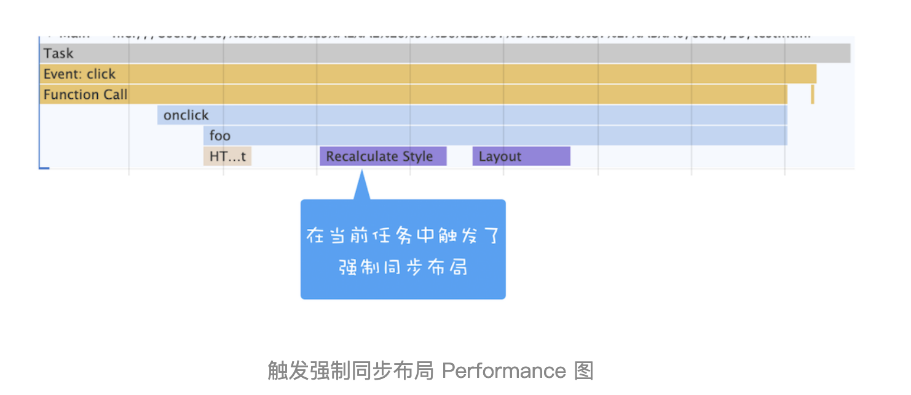

从上图可以看出来，计算样式和布局都是在当前脚本执行过程中触发的，这就是强制同步布局。

为了避免强制同步布局，我们可以调整策略，在修改 DOM 之前查询相关值。代码如下所示：

```js
function foo() {
  let main_div = document.getElementById('mian_div');
  // 为了避免强制同步布局，在修改 DOM 之前查询相关值
  console.log(main_div.offsetHeight);
  let new_node = document.createElement('li');
  let textnode = document.createTextNode('time.geekbang');
  new_node.appendChild(textnode);
  document.getElementById('mian_div').appendChild(new_node);
}
```

### 避免布局抖动

还有一种比强制同步布局更坏的情况，那就是布局抖动。所谓布局抖动，是指在一次 JavaScript 执行过程中，多次执行强制布局和抖动操作。为了直观理解，你可以看下面的代码：

```js
function foo() {
  let time_li = document.getElementById('time_li');
  for (let i = 0; i < 100; i++) {
    let main_div = document.getElementById('mian_div');
    let new_node = document.createElement('li');
    let textnode = document.createTextNode('time.geekbang');
    new_node.appendChild(textnode);
    new_node.offsetHeight = time_li.offsetHeight;
    document.getElementById('mian_div').appendChild(new_node);
  }
}
```

我们在一个 for 循环语句里面不断读取属性值，每次读取属性值之前都要进行计算样式和布局。执行代码之后，使用 Performance 记录的状态如下所示


从上图可以看出，在 foo 函数内部重复执行计算样式和布局，这会大大影响当前函数的执行效率。这种情况的避免方式和强制同步布局一样，都是尽量不要在修改 DOM 结构时再去查询一些相关值。

### 合理利用 CSS 合成动画

合成动画是直接在合成线程上执行的，这和在主线程上执行的布局、绘制等操作不同，如果主线程被 JavaScript 或者一些布局任务占用，CSS 动画依然能继续执行。所以要尽量利用好 CSS 合成动画，如果能让 CSS 处理动画，就尽量交给 CSS 来操作。

另外，如果能提前知道对某个元素执行动画操作，那就最好将其标记为 will-change，这是告诉渲染引擎需要将该元素单独生成一个图层。

### 避免频繁的垃圾回收

我们知道 JavaScript 使用了自动垃圾回收机制，如果在一些函数中频繁创建临时对象，那么垃圾回收器也会频繁地去执行垃圾回收策略。这样当垃圾回收操作发生时，就会占用主线程，从而影响到其他任务的执行，严重的话还会让用户产生掉帧、不流畅的感觉。

所以要尽量避免产生那些临时垃圾数据。那该怎么做呢？可以尽可能优化储存结构，尽可能避免小颗粒对象的产生。

## 总结

我们主要讲解了如何系统优化加载阶段和交互阶段的页面。

在加载阶段，核心的优化原则是：优化关键资源的加载速度，减少关键资源的个数，降低关键资源的 RTT 次数。

在交互阶段，核心的优化原则是：尽量减少一帧的生成时间。可以通过减少单次 JavaScript 的执行时间、避免强制同步布局、避免布局抖动、尽量采用 CSS 的合成动画、避免频繁的垃圾回收等方式来减少一帧生成的时长。

# 虚拟 DOM：虚拟 DOM 和实际 DOM 有何不同

虚拟 DOM 是最近非常火的技术，两大著名前端框架 React 和 Vue 都使用了虚拟 DOM，所以我觉得非常有必要结合浏览器的工作机制对虚拟 DOM 进行一次分析。当然了，React 和 Vue 框架本身所蕴含的知识点非常多，而且也不是我们专栏的重点，所以在这里我们还是把重心聚焦在虚拟 DOM 上。

在本文我们会先聊聊 DOM 的一些缺陷，然后在此基础上介绍虚拟 DOM 是如何解决这些缺陷的，最后再站在双缓存和 MVC 的视角来聊聊虚拟 DOM。理解了这些会让你对目前的前端框架有一个更加底层的认识，这也有助于你更好地理解这些前端框架。

## DOM 的缺陷

通过前面一系列文章的学习，你对 DOM 的生成过程应该已经有了比较深刻的理解，并且也知道了通过 JavaScript 操纵 DOM 是会影响到整个渲染流水线的。另外，DOM 还提供了一组 JavaScript 接口用来遍历或者修改节点，这套接口包含了 getElementById、removeChild、appendChild 等方法。

比如，我们可以调用 `document.body.appendChild(node)` 往 body 节点上添加一个元素，调用该 API 之后会引发一系列的连锁反应。首先渲染引擎会将 node 节点添加到 body 节点之上，然后触发样式计算、布局、绘制、栅格化、合成等任务，我们把这一过程称为重排。除了重排之外，还有可能引起重绘或者合成操作，形象地理解就是“牵一发而动全身”。另外，对于 DOM 的不当操作还有可能引发强制同步布局和布局抖动的问题，这些操作都会大大降低渲染效率。因此，对于 DOM 的操作我们时刻都需要非常小心谨慎。

当然，对于简单的页面来说，其 DOM 结构还是比较简单的，所以以上这些操作 DOM 的问题并不会对用户体验产生太多影响。但是对于一些复杂的页面或者目前使用非常多的单页应用来说，其 DOM 结构是非常复杂的，而且还需要不断地去修改 DOM 树，每次操作 DOM 渲染引擎都需要进行重排、重绘或者合成等操作，因为 DOM 结构复杂，所生成的页面结构也会很复杂，对于这些复杂的页面，执行一次重排或者重绘操作都是非常耗时的，这就给我们带来了真正的性能问题。

所以我们需要有一种方式来减少 JavaScript 对 DOM 的操作，这时候虚拟 DOM 就上场了

## 什么是虚拟 DOM

在谈论什么是虚拟 DOM 之前，我们先来看看虚拟 DOM 到底要解决哪些事情。

- 将页面改变的内容应用到虚拟 DOM 上，而不是直接应用到 DOM 上。
- 变化被应用到虚拟 DOM 上时，虚拟 DOM 并不急着去渲染页面，而仅仅是调整虚拟 DOM 的内部状态，这样操作虚拟 DOM 的代价就变得非常轻了。
- 在虚拟 DOM 收集到足够的改变时，再把这些变化一次性应用到真实的 DOM 上。

基于以上三点，我们再来看看什么是虚拟 DOM。为了直观理解，你可以参考下图：

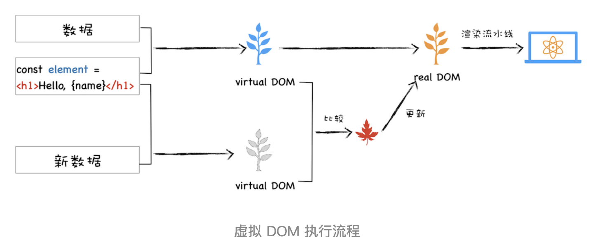

该图是我结合 React 流程画的一张虚拟 DOM 执行流程图，下面我们就结合这张图来分析下虚拟 DOM 到底怎么运行的。

- 创建阶段。首先依据 JSX 和基础数据创建出来虚拟 DOM，它反映了真实的 DOM 树的结构。然后由虚拟 DOM 树创建出真实 DOM 树，真实的 DOM 树生成完后，再触发渲染流水线往屏幕输出页面。
- 更新阶段。如果数据发生了改变，那么就需要根据新的数据创建一个新的虚拟 DOM 树；然后 React 比较两个树，找出变化的地方，并把变化的地方一次性更新到真实的 DOM 树上；最后渲染引擎更新渲染流水线，并生成新的页面

既然聊到虚拟 DOM 的更新，那我们就不得不聊聊最新的 React Fiber 更新机制。通过上图我们知道，当有数据更新时，React 会生成一个新的虚拟 DOM，然后拿新的虚拟 DOM 和之前的虚拟 DOM 进行比较，这个过程会找出变化的节点，然后再将变化的节点应用到 DOM 上。

这里我们重点关注下比较过程，最开始的时候，比较两个虚拟 DOM 的过程是在一个递归函数里执行的，其核心算法是 reconciliation。通常情况下，这个比较过程执行得很快，不过当虚拟 DOM 比较复杂的时候，执行比较函数就有可能占据主线程比较久的时间，这样就会导致其他任务的等待，造成页面卡顿。为了解决这个问题，React 团队重写了 reconciliation 算法，新的算法称为 Fiber reconciler，之前老的算法称为 Stack reconciler。

在前面我们介绍了协程，其实协程的另外一个称呼就是 Fiber，所以在这里我们可以把 Fiber 和协程关联起来，那么所谓的 Fiber reconciler 相信你也很清楚了，就是在执行算法的过程中出让主线程，这样就解决了 Stack reconciler 函数占用时间过久的问题。至于具体的实现过程在这里我就不详细分析了，如果感兴趣的话，你可以自行查阅相关资料进行学习。

了解完虚拟 DOM 的大致执行流程，你应该也就知道为何需要虚拟 DOM 了。不过以上都从单纯的技术视角来分析虚拟 DOM 的，那接下来我们再从双缓存和 MVC 模型这两个视角来聊聊虚拟 DOM。

### 双缓存

在开发游戏或者处理其他图像的过程中，屏幕从前缓冲区读取数据然后显示。但是很多图形操作都很复杂且需要大量的运算，比如一幅完整的画面，可能需要计算多次才能完成，如果每次计算完一部分图像，就将其写入缓冲区，那么就会造成一个后果，那就是在显示一个稍微复杂点的图像的过程中，你看到的页面效果可能是一部分一部分地显示出来，因此在刷新页面的过程中，会让用户感受到界面的闪烁。

而使用双缓存，可以让你先将计算的中间结果存放在另一个缓冲区中，等全部的计算结束，该缓冲区已经存储了完整的图形之后，再将该缓冲区的图形数据一次性复制到显示缓冲区，这样就使得整个图像的输出非常稳定。

在这里，你可以把虚拟 DOM 看成是 DOM 的一个 buffer，和图形显示一样，它会在完成一次完整的操作之后，再把结果应用到 DOM 上，这样就能减少一些不必要的更新，同时还能保证 DOM 的稳定输出。

### MVC 模式

到这里我们了解了虚拟 DOM 是一种类似双缓存的实现。不过如果站在技术角度来理解虚拟缓存，依然不能全面理解其含义。那么接下来我们再来看看虚拟 DOM 在 MVC 模式中所扮演的角色。

在各大设计模式当中，MVC 是一个非常重要且应用广泛的模式，因为它能将数据和视图进行分离，在涉及到一些复杂的项目时，能够大大减轻项目的耦合度，使得程序易于维护。

关于 MVC 的基础结构，你可以先参考下图：

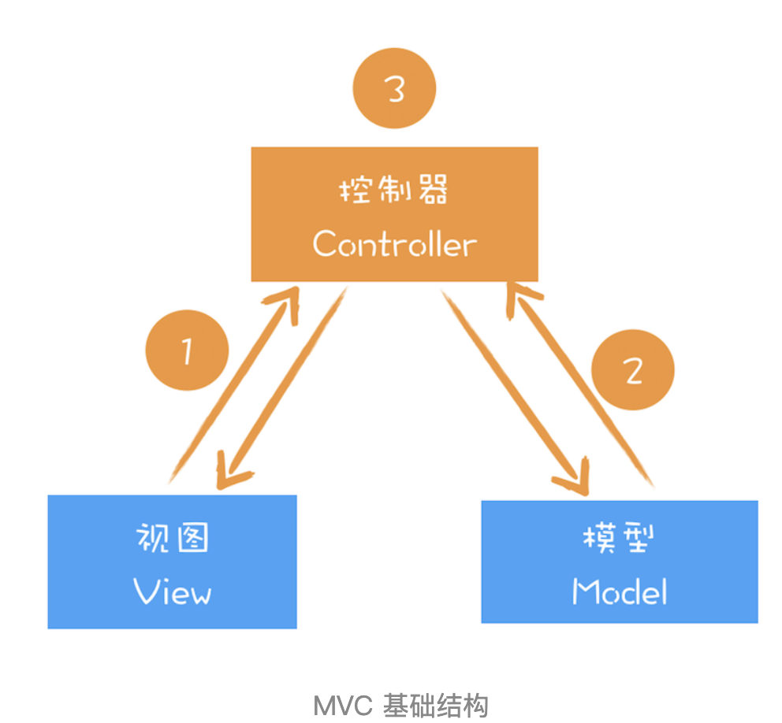

通过上图你可以发现，MVC 的整体结构比较简单，由模型、视图和控制器组成，其核心思想就是将数据和视图分离，也就是说视图和模型之间是不允许直接通信的，它们之间的通信都是通过控制器来完成的。通常情况下的通信路径是视图发生了改变，然后通知控制器，控制器再根据情况判断是否需要更新模型数据。当然还可以根据不同的通信路径和控制器不同的实现方式，基于 MVC 又能衍生出很多其他的模式，如 MVP、MVVM 等，不过万变不离其宗，它们的基础骨架都是基于 MVC 而来。

所以在分析基于 React 或者 Vue 这些前端框架时，我们需要先重点把握大的 MVC 骨架结构，然后再重点查看通信方式和控制器的具体实现方式，这样我们就能从架构的视角来理解这些前端框架了。比如在分析 React 项目时，我们可以把 React 的部分看成是一个 MVC 中的视图，在项目中结合 Redux 就可以构建一个 MVC 的模型结构，如下图所示：


在该图中，我们可以把虚拟 DOM 看成是 MVC 的视图部分，其控制器和模型都是由 Redux 提供的。其具体实现过程如下：

- 图中的控制器是用来监控 DOM 的变化，一旦 DOM 发生变化，控制器便会通知模型，让其更新数据；
- 模型数据更新好之后，控制器会通知视图，告诉它模型的数据发生了变化；
- 视图接收到更新消息之后，会根据模型所提供的数据来生成新的虚拟 DOM；
- 新的虚拟 DOM 生成好之后，就需要与之前的虚拟 DOM 进行比较，找出变化的节点；
- 比较出变化的节点之后，React 将变化的虚拟节点应用到 DOM 上，这样就会触发 DOM 节点的更新；
- DOM 节点的变化又会触发后续一系列渲染流水线的变化，从而实现页面的更新

在实际工程项目中，你需要学会分析出这各个模块，并梳理出它们之间的通信关系，这样对于任何框架你都能轻松上手了。

## 总结

首先我们分析了直接操作 DOM 会触发渲染流水线的一系列反应，如果对 DOM 操作不当的话甚至还会触发强制同步布局和布局抖动的问题，这也是我们在操作 DOM 时需要非常小心谨慎的原因。

在此分析的基础上，我们介绍了虚拟 DOM 是怎么解决直接操作 DOM 所带来的问题以及 React Fiber 更新机制。

要聊前端框架，就绕不开设计模式，所以接下来我们又从双缓存和 MVC 角度分析了虚拟 DOM。双缓存是一种经典的思路，应用在很多场合，能解决页面无效刷新和闪屏的问题，虚拟 DOM 就是双缓存思想的一种体现。而基于 MVC 的设计思想也广泛地渗透到各种场合，并且基于 MVC 又衍生出了很多其他模式（如 MVP、MVVM 等），不过万变不离其宗，它们的基础骨架都是基于 MVC 而来。站在 MVC 视角来理解虚拟 DOM 能让你看到更为“广阔的世界”。

# PWA：解决了 web 应用哪些问题

PWA，全称是 Progressive Web App，翻译过来就是渐进式网页应用。根据字面意思，它就是“渐进式 +Web 应用”。对于 Web 应用很好理解了，就是目前我们普通的 Web 页面，所以 PWA 所支持的首先是一个 Web 页面。至于“渐进式”，就需要从下面两个方面来理解。

- 站在 Web 应用开发者来说，PWA 提供了一个渐进式的过渡方案，让普通站点逐步过渡到 Web 应用。采取渐进式可以降低站点改造的代价，使得站点逐步支持各项新技术，而不是一步到位。
- 站在技术角度来说，PWA 技术也是一个渐进式的演化过程，在技术层面会一点点演进，比如逐渐提供更好的设备特性支持，不断优化更加流畅的动画效果，不断让页面的加载速度变得更快，不断实现本地应用的特性。

从这两点可以看出来，PWA 采取的是非常一个缓和的渐进式策略，不再像以前那样激进，动不动就是取代本地 App、取代小程序。与之相反，而是要充分发挥 Web 的优势，渐进式地缩短和本地应用或者小程序的距离。

那么 Web 最大的优势是什么呢？我认为是自由开放，也正是因为自由和开放，所以大家就很容易对同一件事情达成共识，达成共识之后，一套代码就可以运行在各种设备之上了，这就是跨平台，这也恰恰是本地应用所不具备的。而对于小程序，倒是可以实现跨平台，但要让各家达成共识，目前来看，似乎还是非常不切实际的。

所以我给 PWA 的定义就是：它是一套理念，渐进式增强 Web 的优势，并通过技术手段渐进式缩短和本地应用或者小程序的距离。基于这套理念之下的技术都可以归类到 PWA。

那今天我们就主要来聊聊 PWA 主要采用了哪些技术手段来缩短它和本地应用或者小程序的距离。

## Web 应用 VS 本地应用

那相对于本地应用，Web 页面到底缺少了什么？

- 首先，Web 应用缺少离线使用能力，在离线或者在弱网环境下基本上是无法使用的。而用户需要的是沉浸式的体验，在离线或者弱网环境下能够流畅地使用是用户对一个应用的基本要求。
- 其次，Web 应用还缺少了消息推送的能力，因为作为一个 App 厂商，需要有将消息送达到应用的能力。
- 最后，Web 应用缺少一级入口，也就是将 Web 应用安装到桌面，在需要的时候直接从桌面打开 Web 应用，而不是每次都需要通过浏览器来打开。

针对以上 Web 缺陷，PWA 提出了两种解决方案：通过引入 Service Worker 来试着解决离线存储和消息推送的问题，通过引入 manifest.json 来解决一级入口的问题。下面我们就来详细分析下 Service Worker 是如何工作的。

## 什么是 Service Worker

我们先来看看 Service Worker 是怎么解决离线存储和消息推送的问题。

其实在 Service Worker 之前，WHATWG 小组就推出过用 App Cache 标准来缓存页面，不过在使用过程中 App Cache 所暴露的问题比较多，遭到多方吐槽，所以这个标准最终也只能被废弃了，可见一个成功的标准是需要经历实践考量的。

所以在 2014 年的时候，标准委员会就提出了 Service Worker 的概念，它的主要思想是在页面和网络之间增加一个拦截器，用来缓存和拦截请求。整体结构如下图所示：


在没有安装 Service Worker 之前，WebApp 都是直接通过网络模块来请求资源的。安装了 Service Worker 模块之后，WebApp 请求资源时，会先通过 Service Worker，让它判断是返回 Service Worker 缓存的资源还是重新去网络请求资源。一切的控制权都交由 Service Worker 来处理。

## Service Worker 的设计思路

现在我们知道 Service Worker 的主要功能就是拦截请求和缓存资源，接下来我们就从 Web 应用的需求角度来看看 Service Worker 的设计思路。

### 架构

通过前面页面循环系统的分析，我们已经知道了 JavaScript 和页面渲染流水线的任务都是在页面主线程上执行的，如果一段 JavaScript 执行时间过久，那么就会阻塞主线程，使得渲染一帧的时间变长，从而让用户产生卡顿的感觉，这对用户来说体验是非常不好的。

为了避免 JavaScript 过多占用页面主线程时长的情况，浏览器实现了 Web Worker 的功能。Web Worker 的目的是让 JavaScript 能够运行在页面主线程之外，不过由于 Web Worker 中是没有当前页面的 DOM 环境的，所以在 Web Worker 中只能执行一些和 DOM 无关的 JavaScript 脚本，并通过 postMessage 方法将执行的结果返回给主线程。所以说在 Chrome 中， Web Worker 其实就是在渲染进程中开启的一个新线程，它的生命周期是和页面关联的。

“让其运行在主线程之外”就是 Service Worker 来自 Web Worker 的一个核心思想。不过 Web Worker 是临时的，每次 JavaScript 脚本执行完成之后都会退出，执行结果也不能保存下来，如果下次还有同样的操作，就还得重新来一遍。所以 Service Worker 需要在 Web Worker 的基础之上加上储存功能。

另外，由于 Service Worker 还需要会为多个页面提供服务，所以还不能把 Service Worker 和单个页面绑定起来。在目前的 Chrome 架构中，Service Worker 是运行在浏览器进程中的，因为浏览器进程生命周期是最长的，所以在浏览器的生命周期内，能够为所有的页面提供服务。

### 消息推送

消息推送也是基于 Service Worker 来实现的。因为消息推送时，浏览器页面也许并没有启动，这时就需要 Service Worker 来接收服务器推送的消息，并将消息通过一定方式展示给用户。关于消息推送的细节这里我们就不详述了，如果你感兴趣的话可以自行搜索相关资料去学习。

### 安全

基于 Web 应用的业务越来越多了，其安全问题是不可忽视的，所以在设计 Service Worker 之初，安全问题就被提上了日程。

关于安全，其中最为核心的一条就是 HTTP。我们知道，HTTP 采用的是明文传输信息，存在被窃听、被篡改和被劫持的风险，在项目中使用 HTTP 来传输数据无疑是“裸奔”。所以在设计之初，就考虑对 Service Worker 采用 HTTPS 协议，因为采用 HTTPS 的通信数据都是经过加密的，即便拦截了数据，也无法破解数据内容，而且 HTTPS 还有校验机制，通信双方很容易知道数据是否被篡改。关于 HTTPS 协议，我们会在最后的安全模块详细介绍。

所以要使站点支持 Service Worker，首先必要的一步就是要将站点升级到 HTTPS。

除了必须要使用 HTTPS，Service Worker 还需要同时支持 Web 页面默认的安全策略、储入同源策略、内容安全策略（CSP）等，关于这些，后续我们也会详细介绍。

## 总结

我们先分析了 PWA，它是由很多技术组成的一个理念，其核心思想是渐进式。对于开发者，它提供了非常温和的方式，让开发者将普通的站点逐步过渡到 Web 应用。对于技术本身而言，它是渐进式演进，逐渐将 Web 技术发挥到极致的同时，也逐渐缩小和本地应用的差距。在此基础上，我们又分析了 PWA 中的 Service Worker 的设计思路。

另外，PWA 还提供了 manifest.json 配置文件，可以让开发者自定义桌面的图标、显示名称、启动方式等信息，还可以设置启动画面、页面主题颜色等信息。关于 manifest.json 的配置还是比较简单的，详细使用教程网上有很多，这里我就不做介绍了。

添加桌面标、增加离线缓存、增加消息推送等功能是 PWA 走向设备的必备功能，但我认为真正决定 PWA 能否崛起的还是底层技术，比如页面渲染效率、对系统设备的支持程度、WebAssembly 等，而这些技术也在渐进式进化过程中。所以未来如何，我们拭目以待

# WebComponent：像搭积木一样构建 web 应用

什么是组件化呢？

其实组件化并没有一个明确的定义，不过这里我们可以使用 10 个字来形容什么是组件化，那就是：对内高内聚，对外低耦合。对内各个元素彼此紧密结合、相互依赖，对外和其他组件的联系最少且接口简单。

可以说，程序员对组件化开发有着天生的需求，因为一个稍微复杂点的项目，就涉及到多人协作开发的问题，每个人负责的组件需要尽可能独立完成自己的功能，其组件的内部状态不能影响到别人的组件，在需要和其他组件交互的地方得提前协商好接口。通过组件化可以降低整个系统的耦合度，同时也降低程序员之间沟通复杂度，让系统变得更加易于维护。

使用组件化能带来很多优势，所以很多语言天生就对组件化提供了很好的支持，比如 C/C++ 就可以很好地将功能封装成模块，无论是业务逻辑，还是基础功能，抑或是 UI，都能很好地将其组合在一起，实现组件内部的高度内聚、组件之间的低耦合。

大部分语言都能实现组件化，归根结底在于编程语言特性，大多数语言都有自己的函数级作用域、块级作用域和类，可以将内部的状态数据隐藏在作用域之下或者对象的内部，这样外部就无法访问了，然后通过约定好的接口和外部进行通信。

JavaScript 虽然有不少缺点，但是作为一门编程语言，它也能很好地实现组件化，毕竟有自己的函数级作用域和块级作用域，所以封装内部状态数据并提供接口给外部都是没有问题的。

既然 JavaScript 可以很好地实现组件化，那么我们所谈论的 WebComponent 到底又是什么呢？

## 阻碍前端组件化的因素

在前端虽然 HTML、CSS 和 JavaScript 是强大的开发语言，但是在大型项目中维护起来会比较困难，如果在页面中嵌入第三方内容时，还需要确保第三方的内容样式不会影响到当前内容，同样也要确保当前的 DOM 不会影响到第三方的内容。

所以要聊 WebComponent，得先看看 HTML 和 CSS 是如何阻碍前端组件化的，这里我们就通过下面这样一个简单的例子来分析下：

```html
<style>
  p {
    background-color: brown;
    color: cornsilk;
  }
</style>
<p>time.geekbang.org</p>
```

```html
<style>
  p {
    background-color: red;
    color: blue;
  }
</style>
<p>time.geekbang</p>
```

上面这两段代码分别实现了自己 p 标签的属性，如果两个人分别负责开发这两段代码的话，那么在测试阶段可能没有什么问题，不过当最终项目整合的时候，其中内部的 CSS 属性会影响到其他外部的 p 标签的，之所以会这样，是因为 CSS 是影响全局的。

渲染引擎会将所有的 CSS 内容解析为 CSSOM，在生成布局树的时候，会在 CSSOM 中为布局树中的元素查找样式，所以有两个相同标签最终所显示出来的效果是一样的，渲染引擎是不能为它们分别单独设置样式的。

除了 CSS 的全局属性会阻碍组件化，DOM 也是阻碍组件化的一个因素，因为在页面中只有一个 DOM，任何地方都可以直接读取和修改 DOM。所以使用 JavaScript 来实现组件化是没有问题的，但是 JavaScript 一旦遇上 CSS 和 DOM，那么就相当难办了

## WebComponent 组件化开发

现在我们了解了 CSS 和 DOM 是阻碍组件化的两个因素，那要怎么解决呢？

WebComponent 给出了解决思路，它提供了对局部视图封装能力，可以让 DOM、CSSOM 和 JavaScript 运行在局部环境中，这样就使得局部的 CSS 和 DOM 不会影响到全局。

了解了这些，下面我们就结合具体代码来看看 WebComponent 是怎么实现组件化的。

前面我们说了，WebComponent 是一套技术的组合，具体涉及到了 Custom elements（自定义元素）、Shadow DOM（影子 DOM）和 HTML templates（HTML 模板），详细内容你可以参考 MDN 上的[相关链接](https://developer.mozilla.org/zh-CN/docs/Web/Web_Components)。

下面我们就来演示下这 3 个技术是怎么实现数据封装的，如下面代码所示：

```html
<!DOCTYPE html>
<html>
  <body>
    <!--
      一：定义模板
      二：定义内部 CSS 样式
      三：定义 JavaScript 行为
    -->
    <template id="geekbang-t">
      <style>
        p {
          background-color: brown;
          color: cornsilk;
        }

        div {
          width: 200px;
          background-color: bisque;
          border: 3px solid chocolate;
          border-radius: 10px;
        }
      </style>
      <div>
        <p>time.geekbang.org</p>
        <p>time1.geekbang.org</p>
      </div>
      <script>
        function foo() {
          console.log('inner log');
        }
      </script>
    </template>
    <script>
      class GeekBang extends HTMLElement {
        constructor() {
          super();
          // 获取组件模板
          const content = document.querySelector('#geekbang-t').content;
          // 创建影子 DOM 节点
          const shadowDOM = this.attachShadow({ mode: 'open' });
          // 将模板添加到影子 DOM 上
          shadowDOM.appendChild(content.cloneNode(true));
        }
      }
      customElements.define('geek-bang', GeekBang);
    </script>

    <geek-bang></geek-bang>
    <div>
      <p>time.geekbang.org</p>
      <p>time1.geekbang.org</p>
    </div>
    <geek-bang></geek-bang>
  </body>
</html>
```

详细观察上面这段代码，我们可以得出：要使用 WebComponent，通常要实现下面三个步骤。

首先，使用 template 属性来创建模板。利用 DOM 可以查找到模板的内容，但是模板元素是不会被渲染到页面上的，也就是说 DOM 树中的 template 节点不会出现在布局树中，所以我们可以使用 template 来自定义一些基础的元素结构，这些基础的元素结构是可以被重复使用的。一般模板定义好之后，我们还需要在模板的内部定义样式信息。

其次，我们需要创建一个 GeekBang 的类。在该类的构造函数中要完成三件事：

- 查找模板内容；
- 创建影子 DOM；
- 再将模板添加到影子 DOM 上

上面最难理解的是影子 DOM，其实影子 DOM 的作用是将模板中的内容与全局 DOM 和 CSS 进行隔离，这样我们就可以实现元素和样式的私有化了。你可以把影子 DOM 看成是一个作用域，其内部的样式和元素是不会影响到全局的样式和元素的，而在全局环境下，要访问影子 DOM 内部的样式或者元素也是需要通过约定好的接口的。

总之，通过影子 DOM，我们就实现了 CSS 和元素的封装，在创建好封装影子 DOM 的类之后，我们就可以使用 `customElements.define` 来自定义元素了（可参考上述代码定义元素的方式）。

> 最后，就很简单了，可以像正常使用 HTML 元素一样使用该元素，如上述代码中的 `<geek-bang></geek-bang>`。

上述代码最终渲染出来的页面，如下图所示：

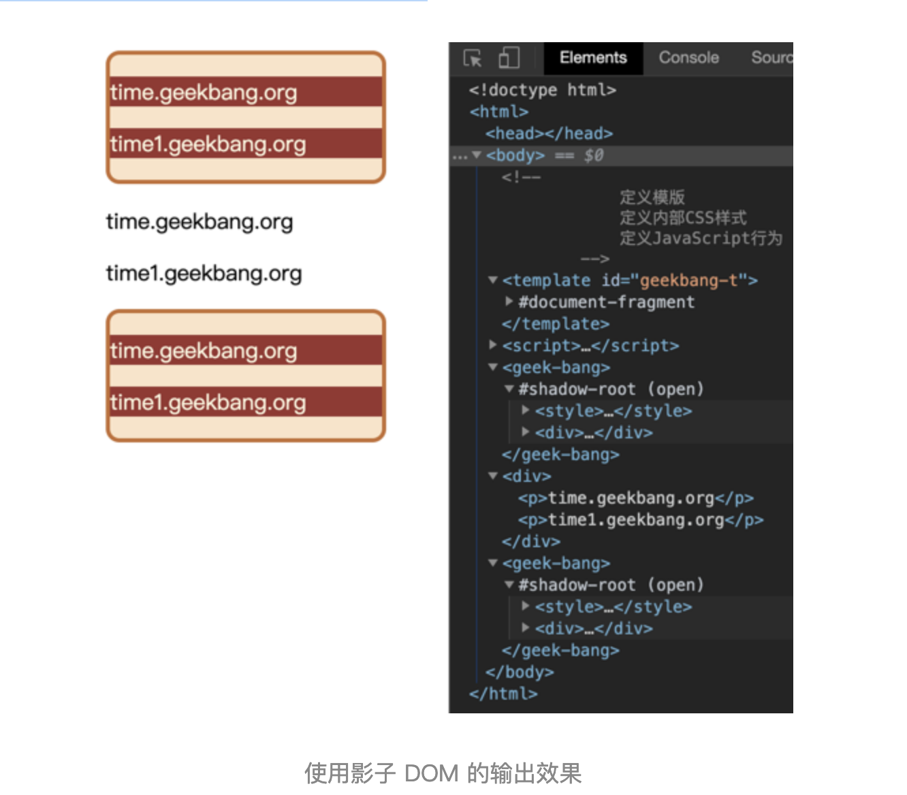

从图中我们可以看出，影子 DOM 内部的样式是不会影响到全局 CSSOM 的。另外，使用 DOM 接口也是无法直接查询到影子 DOM 内部元素的，比如你可以使用 document.getElementsByTagName('div')来查找所有 div 元素，这时候你会发现影子 DOM 内部的元素都是无法查找的，因为要想查找影子 DOM 内部的元素需要专门的接口，所以通过这种方式又将影子内部的 DOM 和外部的 DOM 进行了隔离。

通过影子 DOM 可以隔离 CSS 和 DOM，不过需要注意一点，影子 DOM 的 JavaScript 脚本是不会被隔离的，比如在影子 DOM 定义的 JavaScript 函数依然可以被外部访问，这是因为 JavaScript 语言本身已经可以很好地实现组件化了。

## 浏览器如何实现影子 DOM

关于 WebComponent 的使用方式我们就介绍到这里。WebComponent 整体知识点不多，内容也不复杂，我认为核心就是影子 DOM。上面我们介绍影子 DOM 的作用主要有以下两点：

- 影子 DOM 中的元素对于整个网页是不可见的；
- 影子 DOM 的 CSS 不会影响到整个网页的 CSSOM，影子 DOM 内部的 CSS 只对内部的元素起作用。

那么浏览器是如何实现影子 DOM 的呢？下面我们就来分析下，如下图：

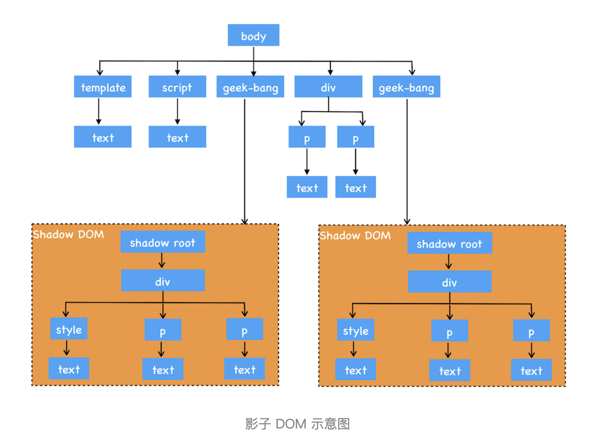

该图是上面那段示例代码对应的 DOM 结构图，从图中可以看出，我们使用了两次 geek-bang 属性，那么就会生成两个影子 DOM，并且每个影子 DOM 都有一个 shadow root 的根节点，我们可以将要展示的样式或者元素添加到影子 DOM 的根节点上，每个影子 DOM 你都可以看成是一个独立的 DOM，它有自己的样式、自己的属性，内部样式不会影响到外部样式，外部样式也不会影响到内部样式。

浏览器为了实现影子 DOM 的特性，在代码内部做了大量的条件判断，比如当通过 DOM 接口去查找元素时，渲染引擎会去判断 geek-bang 属性下面的 shadow-root 元素是否是影子 DOM，如果是影子 DOM，那么就直接跳过 shadow-root 元素的查询操作。所以这样通过 DOM API 就无法直接查询到影子 DOM 的内部元素了。

另外，当生成布局树的时候，渲染引擎也会判断 geek-bang 属性下面的 shadow-root 元素是否是影子 DOM，如果是，那么在影子 DOM 内部元素的节点选择 CSS 样式的时候，会直接使用影子 DOM 内部的 CSS 属性。所以这样最终渲染出来的效果就是影子 DOM 内部定义的样式。

## 总结

首先，我们介绍了组件化开发是程序员的刚需，所谓组件化就是功能模块要实现高内聚、低耦合的特性。不过由于 DOM 和 CSSOM 都是全局的，所以它们是影响了前端组件化的主要元素。基于这个原因，就出现 WebComponent，它包含自定义元素、影子 DOM 和 HTML 模板三种技术，使得开发者可以隔离 CSS 和 DOM。在此基础上，我们还重点介绍了影子 DOM 到底是怎么实现的。

关于 WebComponent 的未来如何，这里我们不好预测和评判，但是有一点可以肯定，WebComponent 也会采用渐进式迭代的方式向前推进，未来依然有很多坑需要去填
