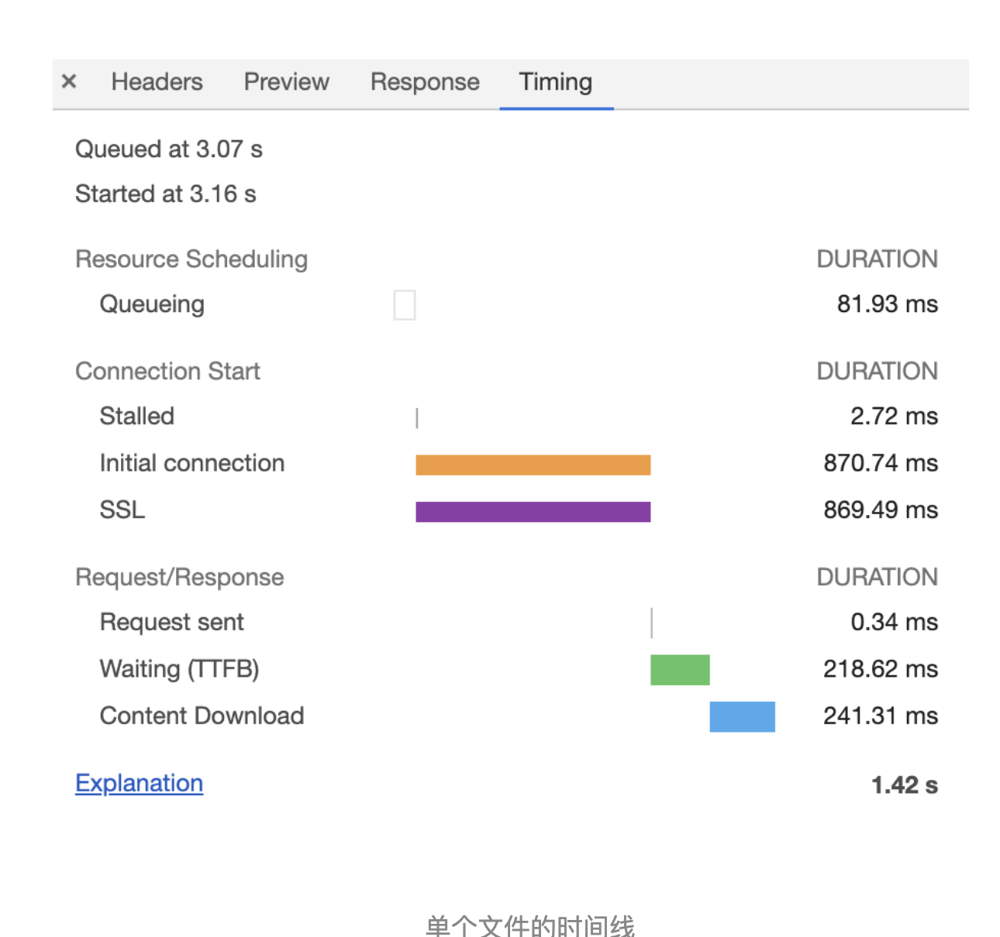
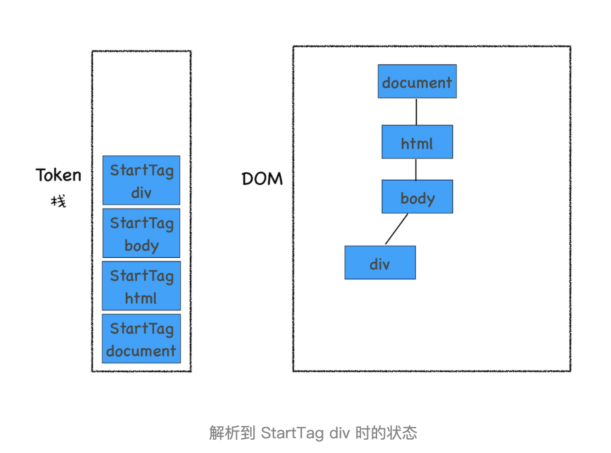
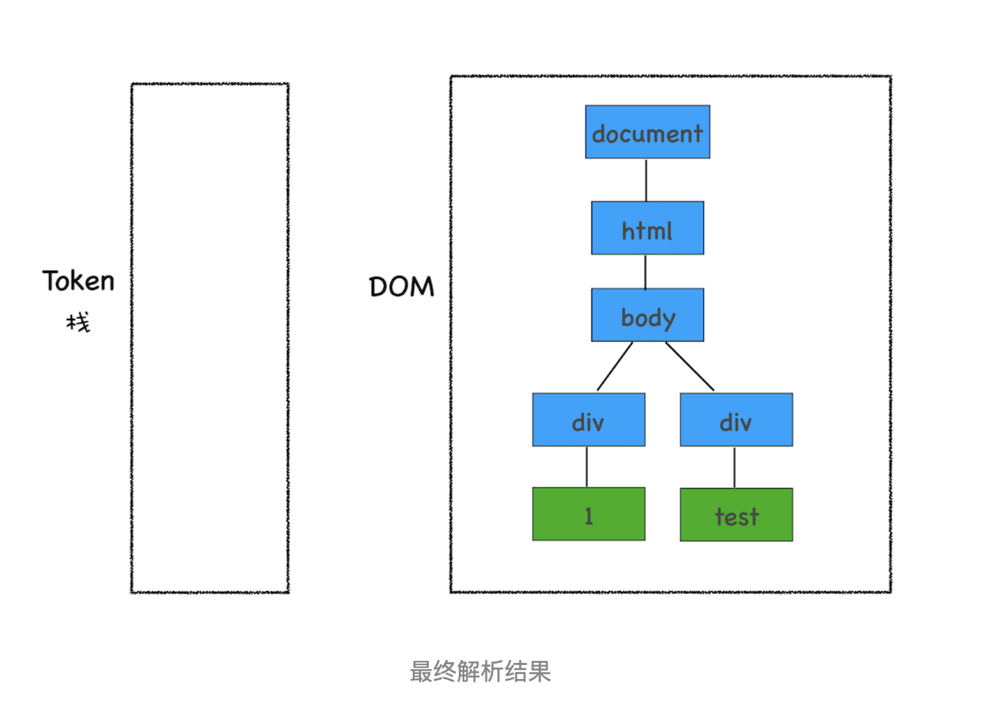

# 页面性能分析：利用 chrome 做 web 性能分析

“浏览器中的页面循环系统”模块我们已经介绍完了，循环系统是页面的基础，理解了循环系统能让我们从本质上更好地理解页面的工作方式，加深我们对一些前端概念的理解。

接下来我们就要进入新的模块了，也就是“浏览器中的页面”模块，正如专栏简介中所言，页面是浏览器的核心，浏览器中的所有功能点都是服务于页面的，而 Chrome 开发者工具又是工程师调试页面的核心工具，所以在这个模块的开篇，我想先带你来深入了解下 Chrome 开发者工具。

Chrome 开发者工具（简称 DevTools）是一组网页制作和调试的工具，内嵌于 Google Chrome 浏览器中。Chrome 开发者工具非常重要，所蕴含的内容也是非常多的，熟练使用它能让你更加深入地了解浏览器内部工作原理。（Chrome 开发者工具也在不停地迭代改进，如果你想使用最新版本，可以使用 Chrome Canary。）

作为这一模块的第一篇文章，我们主要聚焦页面的源头和网络数据的接收，这些发送和接收的数据都能体现在开发者工具的网络面板上。不过为了你能更好地理解和掌握，我们会先对 Chrome 开发者工具做一个大致的介绍，然后再深入剖析网络面板

## Chrome 开发者工具

Chrome 开发者工具有很多重要的面板，比如与性能相关的有网络面板、Performance 面板、内存面板等，与调试页面相关的有 Elements 面板、Sources 面板、Console 面板等。

你可以在浏览器窗口的右上方选择 Chrome 菜单，然后选择“更多工具–> 开发者工具”来打开 Chrome 开发者工具。打开的页面如下图所示：


从图中可以看出，它一共包含了 10 个功能面板，包括了 Elements、Console、Sources、NetWork、Performance、Memory、Application、Security、Audits 和 Layers。

关于这 10 个面板的大致功能，我做了一个表格，感兴趣的话，你可以详细看下：


简单来说，Chrome 开发者工具为我们提供了通过界面访问或者编辑 DOM 和 CSSOM 的能力，还提供了强大的调试功能和查看性能指标的能力。

OK，接下来我们就要重点看下其中重要的 Network 面板，即网络面板

## 网络面板

网络面板由控制器、过滤器、抓图信息、时间线、详细列表和下载信息概要这 6 个区域构成（如下图所示）。


### 控制器

其中，控制器有 4 个比较重要的功能，我们按照下文中的这张图来简单介绍下。


- 红色圆点的按钮，表示“开始 / 暂停抓包”，这个功能很常见，很容易理解。
- “全局搜索”按钮，这个功能就非常重要了，可以在所有下载资源中搜索相关内容，还可以快速定位到某几个你想要的文件上。
- Disable cache，即“禁止从 Cache 中加载资源”的功能，它在调试 Web 应用的时候非常有用，因为开启了 Cache 会影响到网络性能测试的结果。
- Online 按钮，是“模拟 2G/3G”功能，它可以限制带宽，模拟弱网情况下页面的展现情况，然后你就可以根据实际展示情况来动态调整策略，以便让 Web 应用更加适用于这些弱网

### 过滤器

网络面板中的过滤器，主要就是起过滤功能。因为有时候一个页面有太多内容在详细列表区域中展示了，而你可能只想查看 JavaScript 文件或者 CSS 文件，这时候就可以通过过滤器模块来筛选你想要的文件类型。

### 抓图信息

抓图信息区域，可以用来分析用户等待页面加载时间内所看到的内容，分析用户实际的体验情况。比如，如果页面加载 1 秒多之后屏幕截图还是白屏状态，这时候就需要分析是网络还是代码的问题了。（勾选面板上的“Capture screenshots”即可启用屏幕截图。）

### 时间线

时间线，主要用来展示 HTTP、HTTPS、WebSocket 加载的状态和时间的一个关系，用于直观感受页面的加载过程。如果是多条竖线堆叠在一起，那说明这些资源被同时被加载。至于具体到每个文件的加载信息，还需要用到下面要讲的详细列表。

### 详细列表

这个区域是最重要的，它详细记录了每个资源从发起请求到完成请求这中间所有过程的状态，以及最终请求完成的数据信息。通过该列表，你就能很容易地去诊断一些网络问题。

详细列表是我们本篇文章介绍的重点，不过内容比较多，所以放到最后去专门介绍了。

### 下载信息概要

下载信息概要中，你要重点关注下 DOMContentLoaded 和 Load 两个事件，以及这两个事件的完成时间。

- DOMContentLoaded，这个事件发生后，说明页面已经构建好 DOM 了，这意味着构建 DOM 所需要的 HTML 文件、JavaScript 文件、CSS 文件都已经下载完成了。
- Load，说明浏览器已经加载了所有的资源（图像、样式表等）

通过下载信息概要面板，你可以查看触发这两个事件所花费的时间。

## 网络面板中的详细列表

下面我们就来重点介绍网络面板中的详细列表，这里面包含了大量有用的信息

### 列表的属性

列表的属性比较多，比如 Name、Status、Type、Initiator 等等，这个不难理解。当然，你还可以通过点击右键的下拉菜单来添加其他属性，这里我就不再赘述了，你可以自己上手实操一下。

另外，你也可以按照列表的属性来给列表排序，默认情况下，列表是按请求发起的时间来排序的，最早发起请求的资源在顶部。当然也可以按照返回状态码、请求类型、请求时长、内容大小等基础属性排序，只需点击相应属性即可。


### 详细信息

如果你选中详细列表中的一项，右边就会出现该项的详细信息，如下所示：


你可以在此查看请求列表中任意一项的请求行和请求头信息，还可以查看响应行、响应头和响应体。然后你可以根据这些查看的信息来判断你的业务逻辑是否正确，或者有时候也可以用来逆向推导别人网站的业务逻辑。

### 单个资源的时间线

了解了每个资源的详细请求信息之后，我们再来分析单个资源请求时间线，这就涉及具体的 HTTP 请求流程了。


我们介绍过发起一个 HTTP 请求之后，浏览器首先查找缓存，如果缓存没有命中，那么继续发起 DNS 请求获取 IP 地址，然后利用 IP 地址和服务器端建立 TCP 连接，再发送 HTTP 请求，等待服务器响应；不过，如果服务器响应头中包含了重定向的信息，那么整个流程就需要重新再走一遍。这就是在浏览器中一个 HTTP 请求的基础流程。

那详细列表中是如何表示出这个流程的呢？这就要重点看下时间线面板了



那面板中这各项到底是什么含义呢？

> 第一个是 Queuing，也就是排队的意思，当浏览器发起一个请求的时候，会有很多原因导致该请求不能被立即执行，而是需要排队等待。导致请求处于排队状态的原因有很多。

- 首先，页面中的资源是有优先级的，比如 CSS、HTML、JavaScript 等都是页面中的核心文件，所以优先级最高；而图片、视频、音频这类资源就不是核心资源，优先级就比较低。通常当后者遇到前者时，就需要“让路”，进入待排队状态。
- 其次，我们前面也提到过，浏览器会为每个域名最多维护 6 个 TCP 连接，如果发起一个 HTTP 请求时，这 6 个 TCP 连接都处于忙碌状态，那么这个请求就会处于排队状态。
- 最后，网络进程在为数据分配磁盘空间时，新的 HTTP 请求也需要短暂地等待磁盘分配结束。

等待排队完成之后，就要进入发起连接的状态了。不过在发起连接之前，还有一些原因可能导致连接过程被推迟，这个推迟就表现在面板中的 Stalled 上，它表示停滞的意思。

这里需要额外说明的是，如果你使用了代理服务器，还会增加一个 Proxy Negotiation 阶段，也就是代理协商阶段，它表示代理服务器连接协商所用的时间，不过在上图中没有体现出来，因为这里我们没有使用代理服务器。

接下来，就到了 Initial connection/SSL 阶段了，也就是和服务器建立连接的阶段，这包括了建立 TCP 连接所花费的时间；不过如果你使用了 HTTPS 协议，那么还需要一个额外的 SSL 握手时间，这个过程主要是用来协商一些加密信息的。（关于 SSL 协商的详细过程，我们会在 Web 安全模块中介绍。）

和服务器建立好连接之后，网络进程会准备请求数据，并将其发送给网络，这就是 Request sent 阶段。通常这个阶段非常快，因为只需要把浏览器缓冲区的数据发送出去就结束了，并不需要判断服务器是否接收到了，所以这个时间通常不到 1 毫秒。

数据发送出去了，接下来就是等待接收服务器第一个字节的数据，这个阶段称为 Waiting (TTFB)，通常也称为“第一字节时间”。 TTFB 是反映服务端响应速度的重要指标，对服务器来说，TTFB 时间越短，就说明服务器响应越快。

接收到第一个字节之后，进入陆续接收完整数据的阶段，也就是 Content Download 阶段，这意味着从第一字节时间到接收到全部响应数据所用的时间

## 优化时间线上耗时项

了解了时间线面板上的各项含义之后，我们就可以根据这个请求的时间线来实现相关的优化操作了。

### 排队（Queuing）时间过久

排队时间过久，大概率是由浏览器为每个域名最多维护 6 个连接导致的。那么基于这个原因，你就可以让 1 个站点下面的资源放在多个域名下面，比如放到 3 个域名下面，这样就可以同时支持 18 个连接了，这种方案称为域名分片技术。除了域名分片技术外，我个人还建议你把站点升级到 HTTP2，因为 HTTP2 已经没有每个域名最多维护 6 个 TCP 连接的限制了。

### 第一字节时间（TTFB）时间过久

这可能的原因有如下：

- 服务器生成页面数据的时间过久。对于动态网页来说，服务器收到用户打开一个页面的请求时，首先要从数据库中读取该页面需要的数据，然后把这些数据传入到模板中，模板渲染后，再返回给用户。服务器在处理这个数据的过程中，可能某个环节会出问题。
- 网络的原因。比如使用了低带宽的服务器，或者本来用的是电信的服务器，可联通的网络用户要来访问你的服务器，这样也会拖慢网速。
- 发送请求头时带上了多余的用户信息。比如一些不必要的 Cookie 信息，服务器接收到这些 Cookie 信息之后可能需要对每一项都做处理，这样就加大了服务器的处理时长。

对于这三种问题，你要有针对性地出一些解决方案。面对第一种服务器的问题，你可以想办法去提高服务器的处理速度，比如通过增加各种缓存的技术；针对第二种网络问题，你可以使用 CDN 来缓存一些静态文件；至于第三种，你在发送请求时就去尽可能地减少一些不必要的 Cookie 数据信息

### Content Download 时间过久

如果单个请求的 Content Download 花费了大量时间，有可能是字节数太多的原因导致的。这时候你就需要减少文件大小，比如压缩、去掉源码中不必要的注释等方法。

## 总结

首先我们简单介绍了 Chrome 开发者工具 10 个基础的面板信息；然后重点剖析了网络面板，再结合之前介绍的网络请求流程来重点分析了网络面板中时间线的各个指标的含义；最后我们还简要分析了时间线中各项指标出现异常的可能原因，并给出了一些优化方案。

其实通过今天的分析，我们可以得出这样一个结论：如果你要去做一些实践性的项目优化，理解其背后的理论至关重要。因为理论就是一条“线”，它会把各种实践的内容“串”在一起，然后你可以围绕着这条“线”来排查问题

# DOM 树：JavaScript 是如何影响 DOM 树构建的

在上一篇文章中，我们通过开发者工具中的网络面板，介绍了网络请求过程的几种性能指标以及对页面加载的影响。

而在渲染流水线中，后面的步骤都直接或者间接地依赖于 DOM 结构，所以本文我们就继续沿着网络数据流路径来介绍 DOM 树是怎么生成的。然后再基于 DOM 树的解析流程介绍两块内容：第一个是在解析过程中遇到 JavaScript 脚本，DOM 解析器是如何处理的？第二个是 DOM 解析器是如何处理跨站点资源的？

## 什么是 DOM

从网络传给渲染引擎的 HTML 文件字节流是无法直接被渲染引擎理解的，所以要将其转化为渲染引擎能够理解的内部结构，这个结构就是 DOM。DOM 提供了对 HTML 文档结构化的表述。在渲染引擎中，DOM 有三个层面的作用

- 从页面的视角来看，DOM 是生成页面的基础数据结构。
- 从 JavaScript 脚本视角来看，DOM 提供给 JavaScript 脚本操作的接口，通过这套接口，JavaScript 可以对 DOM 结构进行访问，从而改变文档的结构、样式和内容。
- 从安全视角来看，DOM 是一道安全防护线，一些不安全的内容在 DOM 解析阶段就被拒之门外了。

简言之，DOM 是表述 HTML 的内部数据结构，它会将 Web 页面和 JavaScript 脚本连接起来，并过滤一些不安全的内容。

## DOM 树如何生成

在渲染引擎内部，有一个叫 HTML 解析器（HTMLParser）的模块，它的职责就是负责将 HTML 字节流转换为 DOM 结构。所以这里我们需要先要搞清楚 HTML 解析器是怎么工作的。

在开始介绍 HTML 解析器之前，我要先解释一个大家在留言区问到过好多次的问题：HTML 解析器是等整个 HTML 文档加载完成之后开始解析的，还是随着 HTML 文档边加载边解析的？

在这里我统一解答下，HTML 解析器并不是等整个文档加载完成之后再解析的，而是网络进程加载了多少数据，HTML 解析器便解析多少数据。

那详细的流程是怎样的呢？网络进程接收到响应头之后，会根据响应头中的 content-type 字段来判断文件的类型，比如 content-type 的值是“text/html”，那么浏览器就会判断这是一个 HTML 类型的文件，然后为该请求选择或者创建一个渲染进程。渲染进程准备好之后，网络进程和渲染进程之间会建立一个共享数据的管道，网络进程接收到数据后就往这个管道里面放，而渲染进程则从管道的另外一端不断地读取数据，并同时将读取的数据“喂”给 HTML 解析器。你可以把这个管道想象成一个“水管”，网络进程接收到的字节流像水一样倒进这个“水管”，而“水管”的另外一端是渲染进程的 HTML 解析器，它会动态接收字节流，并将其解析为 DOM。

解答完这个问题之后，接下来我们就可以来详细聊聊 DOM 的具体生成流程了。

前面我们说过代码从网络传输过来是字节流的形式，那么后续字节流是如何转换为 DOM 的呢？你可以参考下图：


从图中你可以看出，字节流转换为 DOM 需要三个阶段。

第一个阶段，通过分词器将字节流转换为 Token。

前面文章中我们介绍过，V8 编译 JavaScript 过程中的第一步是做词法分析，将 JavaScript 先分解为一个个 Token。解析 HTML 也是一样的，需要通过分词器先将字节流转换为一个个 Token，分为 Tag Token 和文本 Token。上述 HTML 代码通过词法分析生成的 Token 如下所示：


由图可以看出，Tag Token 又分 StartTag 和 EndTag，分别对应图中的蓝色和红色块，文本 Token 对应的绿色块。至于后续的第二个和第三个阶段是同步进行的，需要将 Token 解析为 DOM 节点，并将 DOM 节点添加到 DOM 树中。

> HTML 解析器维护了一个 Token 栈结构，该 Token 栈主要用来计算节点之间的父子关系，在第一个阶段中生成的 Token 会被按照顺序压到这个栈中。具体的处理规则如下所示：

- 如果压入到栈中的是 StartTag Token，HTML 解析器会为该 Token 创建一个 DOM 节点，然后将该节点加入到 DOM 树中，它的父节点就是栈中相邻的那个元素生成的节点。
- 如果分词器解析出来是文本 Token，那么会生成一个文本节点，然后将该节点加入到 DOM 树中，文本 Token 是不需要压入到栈中，它的父节点就是当前栈顶 Token 所对应的 DOM 节点。
- 如果分词器解析出来的是 EndTag 标签，比如是 EndTag div，HTML 解析器会查看 Token 栈顶的元素是否是 StartTag div，如果是，就将 StartTag div 从栈中弹出，表示该 div 元素解析完成。

通过分词器产生的新 Token 就这样不停地压栈和出栈，整个解析过程就这样一直持续下去，直到分词器将所有字节流分词完成。

为了更加直观地理解整个过程，下面我们结合一段 HTML 代码（如下），来一步步分析 DOM 树的生成过程。

```html
<html>
  <body>
    <div>1</div>
    <div>test</div>
  </body>
</html>
```

这段代码以字节流的形式传给了 HTML 解析器，经过分词器处理，解析出来的第一个 Token 是 StartTag html，解析出来的 Token 会被压入到栈中，并同时创建一个 html 的 DOM 节点，将其加入到 DOM 树中。

这里需要补充说明下，HTML 解析器开始工作时，会默认创建了一个根为 document 的空 DOM 结构，同时会将一个 StartTag document 的 Token 压入栈底。然后经过分词器解析出来的第一个 StartTag html Token 会被压入到栈中，并创建一个 html 的 DOM 节点，添加到 document 上，如下图所示


然后按照同样的流程解析出来 StartTag body 和 StartTag div，其 Token 栈和 DOM 的状态如下图所示：



接下来解析出来的是第一个 div 的文本 Token，渲染引擎会为该 Token 创建一个文本节点，并将该 Token 添加到 DOM 中，它的父节点就是当前 Token 栈顶元素对应的节点，如下图所示：


再接下来，分词器解析出来第一个 EndTag div，这时候 HTML 解析器会去判断当前栈顶的元素是否是 StartTag div，如果是则从栈顶弹出 StartTag div，如下图所示


按照同样的规则，一路解析，最终结果如下图所示：



通过上面的介绍，相信你已经清楚 DOM 是怎么生成的了。不过在实际生产环境中，HTML 源文件中既包含 CSS 和 JavaScript，又包含图片、音频、视频等文件，所以处理过程远比上面这个示范 Demo 复杂。不过理解了这个简单的 Demo 生成过程，我们就可以往下分析更加复杂的场景了。

## JavaScript 是如何影响 DOM 生成的

我们再来看看稍微复杂点的 HTML 文件，如下所示：

```html
<html>
  <body>
    <div>1</div>
    <script>
      let div1 = document.getElementsByTagName('div')[0];
      div1.innerText = 'time.geekbang';
    </script>
    <div>test</div>
  </body>
</html>
```

我在两段 div 中间插入了一段 JavaScript 脚本，这段脚本的解析过程就有点不一样了。script 标签之前，所有的解析流程还是和之前介绍的一样，但是解析到 script 标签时，渲染引擎判断这是一段脚本，此时 HTML 解析器就会暂停 DOM 的解析，因为接下来的 JavaScript 可能要修改当前已经生成的 DOM 结构。

通过前面 DOM 生成流程分析，我们已经知道当解析到 script 脚本标签时，其 DOM 树结构如下所示：


这时候 HTML 解析器暂停工作，JavaScript 引擎介入，并执行 script 标签中的这段脚本，因为这段 JavaScript 脚本修改了 DOM 中第一个 div 中的内容，所以执行这段脚本之后，div 节点内容已经修改为 time.geekbang 了。脚本执行完成之后，HTML 解析器恢复解析过程，继续解析后续的内容，直至生成最终的 DOM。

以上过程应该还是比较好理解的，不过除了在页面中直接内嵌 JavaScript 脚本之外，我们还通常需要在页面中引入 JavaScript 文件，这个解析过程就稍微复杂了些，如下面代码：

```js
//foo.js
let div1 = document.getElementsByTagName('div')[0];
div1.innerText = 'time.geekbang';
```

```html
<html>
  <body>
    <div>1</div>
    <script type="text/javascript" src="foo.js"></script>
    <div>test</div>
  </body>
</html>
```

这段代码的功能还是和前面那段代码是一样的，不过这里我把内嵌 JavaScript 脚本修改成了通过 JavaScript 文件加载。其整个执行流程还是一样的，执行到 JavaScript 标签时，暂停整个 DOM 的解析，执行 JavaScript 代码，不过这里执行 JavaScript 时，需要先下载这段 JavaScript 代码。这里需要重点关注下载环境，因为 JavaScript 文件的下载过程会阻塞 DOM 解析，而通常下载又是非常耗时的，会受到网络环境、JavaScript 文件大小等因素的影响。

不过 Chrome 浏览器做了很多优化，其中一个主要的优化是预解析操作。当渲染引擎收到字节流之后，会开启一个预解析线程，用来分析 HTML 文件中包含的 JavaScript、CSS 等相关文件，解析到相关文件之后，预解析线程会提前下载这些文件。

再回到 DOM 解析上，我们知道引入 JavaScript 线程会阻塞 DOM，不过也有一些相关的策略来规避，比如使用 CDN 来加速 JavaScript 文件的加载，压缩 JavaScript 文件的体积。另外，如果 JavaScript 文件中没有操作 DOM 相关代码，就可以将该 JavaScript 脚本设置为异步加载，通过 async 或 defer 来标记代码，使用方式如下所示：

```js
<script async type='text/javascript' src='foo.js'></script>
```

```js
<script defer type='text/javascript' src='foo.js'></script>
```

async 和 defer 虽然都是异步的，不过还有一些差异，使用 async 标志的脚本文件一旦加载完成，会立即执行；而使用了 defer 标记的脚本文件，需要在 DOMContentLoaded 事件之前执行。

现在我们知道了 JavaScript 是如何阻塞 DOM 解析的了，那接下来我们再来结合文中代码看看另外一种情况：

```html
<head>
  <style src="theme.css"></style>
</head>
```

```html
<body>
  <div>1</div>
  <script>
    let div1 = document.getElementsByTagName('div')[0]
    div1.innerText = 'time.geekbang' // 需要 DOM
    div1.style.color = 'red'  // 需要 CSSOM
  </script>
  <div>test</div>
</body>
</html>
```

该示例中，JavaScript 代码出现了 div1.style.color = ‘red' 的语句，它是用来操纵 CSSOM 的，所以在执行 JavaScript 之前，需要先解析 JavaScript 语句之上所有的 CSS 样式。所以如果代码里引用了外部的 CSS 文件，那么在执行 JavaScript 之前，还需要等待外部的 CSS 文件下载完成，并解析生成 CSSOM 对象之后，才能执行 JavaScript 脚本。

而 JavaScript 引擎在解析 JavaScript 之前，是不知道 JavaScript 是否操纵了 CSSOM 的，所以渲染引擎在遇到 JavaScript 脚本时，不管该脚本是否操纵了 CSSOM，都会执行 CSS 文件下载，解析操作，再执行 JavaScript 脚本。

所以说 JavaScript 脚本是依赖样式表的，这又多了一个阻塞过程。至于如何优化，我们在下篇文章中再来深入探讨。

通过上面的分析，我们知道了 JavaScript 会阻塞 DOM 生成，而样式文件又会阻塞 JavaScript 的执行，所以在实际的工程中需要重点关注 JavaScript 文件和样式表文件，使用不当会影响到页面性能。

## 总结

首先我们介绍了 DOM 是如何生成的，然后又基于 DOM 的生成过程分析了 JavaScript 是如何影响到 DOM 生成的。因为 CSS 和 JavaScript 都会影响到 DOM 的生成，所以我们又介绍了一些加速生成 DOM 的方案，理解了这些，能让你更加深刻地理解如何去优化首次页面渲染。

额外说明一下，渲染引擎还有一个安全检查模块叫 XSSAuditor，是用来检测词法安全的。在分词器解析出来 Token 之后，它会检测这些模块是否安全，比如是否引用了外部脚本，是否符合 CSP 规范，是否存在跨站点请求等。如果出现不符合规范的内容，XSSAuditor 会对该脚本或者下载任务进行拦截。详细内容我们会在后面的安全模块介绍，这里就不赘述了

# 渲染流水线：CSS 如何影响首次加载时的白屏时间？

在上一篇文章中我们详细介绍了 DOM 的生成过程，并结合具体例子分析了 JavaScript 是如何阻塞 DOM 生成的。那本文我们就继续深入聊聊渲染流水线中的 CSS。因为 CSS 是页面中非常重要的资源，它决定了页面最终显示出来的效果，并影响着用户对整个网站的第一体验。所以，搞清楚浏览器中的 CSS 是怎么工作的很有必要，只有理解了 CSS 是如何工作的，你才能更加深刻地理解如何去优化页面。

本文我们先站在渲染流水线的视角来介绍 CSS 是如何工作的，然后通过 CSS 的工作流程来分析性能瓶颈，最后再来讨论如何减少首次加载时的白屏时间

渲染流水线视角下的 CSS 我们先结合下面代码来看看最简单的渲染流程：

```css
/* theme.css */
div {
  color: coral;
  background-color: black;
}
```

```html
<html>
  <head>
    <link href="theme.css" rel="stylesheet" />
  </head>
  <body>
    <div>geekbang com</div>
  </body>
</html>
```

这两段代码分别由 CSS 文件和 HTML 文件构成，我们来分析下打开这段 HTML 文件时的渲染流水线，你可以先参考下面这张渲染流水线示意图：


下面我们结合上图来分析这个页面文件的渲染流水线。

首先是发起主页面的请求，这个发起请求方可能是渲染进程，也有可能是浏览器进程，发起的请求被送到网络进程中去执行。网络进程接收到返回的 HTML 数据之后，将其发送给渲染进程，渲染进程会解析 HTML 数据并构建 DOM。这里你需要特别注意下，请求 HTML 数据和构建 DOM 中间有一段空闲时间，这个空闲时间有可能成为页面渲染的瓶颈。

上一篇文章中我们提到过，当渲染进程接收 HTML 文件字节流时，会先开启一个预解析线程，如果遇到 JavaScript 文件或者 CSS 文件，那么预解析线程会提前下载这些数据。对于上面的代码，预解析线程会解析出来一个外部的 theme.css 文件，并发起 theme.css 的下载。这里也有一个空闲时间需要你注意一下，就是在 DOM 构建结束之后、theme.css 文件还未下载完成的这段时间内，渲染流水线无事可做，因为下一步是合成布局树，而合成布局树需要 CSSOM 和 DOM，所以这里需要等待 CSS 加载结束并解析成 CSSOM。

## 那渲染流水线为什么需要 CSSOM 呢？

和 HTML 一样，渲染引擎也是无法直接理解 CSS 文件内容的，所以需要将其解析成渲染引擎能够理解的结构，这个结构就是 CSSOM。和 DOM 一样，CSSOM 也具有两个作用，第一个是提供给 JavaScript 操作样式表的能力，第二个是为布局树的合成提供基础的样式信息。这个 CSSOM 体现在 DOM 中就是 document.styleSheets。具体结构你可以去查阅相关资料，这里我就不过多介绍了，你知道 CSSOM 的两个作用是怎样的就行了。

有了 DOM 和 CSSOM，接下来就可以合成布局树了，我们在前面《05 | 渲染流程（上）：HTML、CSS 和 JavaScript 文件，是如何变成页面的？》这篇文章中讲解过布局树的构造过程，这里咱们再简单回顾下。等 DOM 和 CSSOM 都构建好之后，渲染引擎就会构造布局树。布局树的结构基本上就是复制 DOM 树的结构，不同之处在于 DOM 树中那些不需要显示的元素会被过滤掉，如 display:none 属性的元素、head 标签、script 标签等。复制好基本的布局树结构之后，渲染引擎会为对应的 DOM 元素选择对应的样式信息，这个过程就是样式计算。样式计算完成之后，渲染引擎还需要计算布局树中每个元素对应的几何位置，这个过程就是计算布局。通过样式计算和计算布局就完成了最终布局树的构建。再之后，就该进行后续的绘制操作了。

这就是在渲染过程中涉及到 CSS 的一些主要流程。

了解了这些之后，我们再来看看稍微复杂一点的场景，还是看下面这段 HTML 代码：

```css
// theme.css
div {
  color: coral;
  background-color: black;
}
```

```html
<html>
  <head>
    <link href="theme.css" rel="stylesheet" />
  </head>
  <body>
    <div>geekbang com</div>
    <script>
      console.log('time.geekbang.org');
    </script>
    <div>geekbang com</div>
  </body>
</html>
```

这段代码是我在开头代码的基础之上做了一点小修改，在 body 标签内部加了一个简单的 JavaScript。有了 JavaScript，渲染流水线就有点不一样了，可以参考下面这张渲染流水线图：


那我们就结合这张图来分析含有外部 CSS 文件和 JavaScript 代码的页面渲染流水线，上一篇文章中我们提到过在解析 DOM 的过程中，如果遇到了 JavaScript 脚本，那么需要先暂停 DOM 解析去执行 JavaScript，因为 JavaScript 有可能会修改当前状态下的 DOM。

不过在执行 JavaScript 脚本之前，如果页面中包含了外部 CSS 文件的引用，或者通过 style 标签内置了 CSS 内容，那么渲染引擎还需要将这些内容转换为 CSSOM，因为 JavaScript 有修改 CSSOM 的能力，所以在执行 JavaScript 之前，还需要依赖 CSSOM。也就是说 CSS 在部分情况下也会阻塞 DOM 的生成。

我们再来看看更加复杂一点的情况，如果在 body 中被包含的是 JavaScript 外部引用文件，Demo 代码如下所示：

```css
// theme.css
div {
  color: coral;
  background-color: black;
}
```

```js
// foo.js
console.log('time.geekbang.org');
```

```html
<html>
  <head>
    <link href="theme.css" rel="stylesheet" />
  </head>
  <body>
    <div>geekbang com</div>
    <script src="foo.js"></script>
    <div>geekbang com</div>
  </body>
</html>
```

从上面代码可以看出来，HTML 文件中包含了 CSS 的外部引用和 JavaScript 外部文件，那它们的渲染流水线是怎样的呢？可参考下图


从图中可以看出来，在接收到 HTML 数据之后的预解析过程中，HTML 预解析器识别出来了有 CSS 文件和 JavaScript 文件需要下载，然后就同时发起这两个文件的下载请求，需要注意的是，这两个文件的下载过程是重叠的，所以下载时间按照最久的那个文件来算。

后面的流水线就和前面是一样的了，不管 CSS 文件和 JavaScript 文件谁先到达，都要先等到 CSS 文件下载完成并生成 CSSOM，然后再执行 JavaScript 脚本，最后再继续构建 DOM，构建布局树，绘制页面。

## 影响页面展示的因素以及优化策略

前面我们为什么要花这么多文字来分析渲染流水线呢？主要原因就是渲染流水线影响到了首次页面展示的速度，而首次页面展示的速度又直接影响到了用户体验，所以我们分析渲染流水线的目的就是为了找出一些影响到首屏展示的因素，然后再基于这些因素做一些针对性的调整。

那么接下来我们就来看看从发起 URL 请求开始，到首次显示页面的内容，在视觉上经历的三个阶段。

- 第一个阶段，等请求发出去之后，到提交数据阶段，这时页面展示出来的还是之前页面的内容。
- 第二个阶段，提交数据之后渲染进程会创建一个空白页面，我们通常把这段时间称为解析白屏，并等待 CSS 文件和 JavaScript 文件的加载完成，生成 CSSOM 和 DOM，然后合成布局树，最后还要经过一系列的步骤准备首次渲染。
- 第三个阶段，等首次渲染完成之后，就开始进入完整页面的生成阶段了，然后页面会一点点被绘制出来。

影响第一个阶段的因素主要是网络或者是服务器处理这块儿，前面文章中我们已经讲过了，这里我们就不再继续分析了。至于第三个阶段，我们会在后续文章中分析，所以这里也不做介绍了。

现在我们重点关注第二个阶段，这个阶段的主要问题是白屏时间，如果白屏时间过久，就会影响到用户体验。为了缩短白屏时间，我们来挨个分析这个阶段的主要任务，包括了解析 HTML、下载 CSS、下载 JavaScript、生成 CSSOM、执行 JavaScript、生成布局树、绘制页面一系列操作。

通常情况下的瓶颈主要体现在下载 CSS 文件、下载 JavaScript 文件和执行 JavaScript。

所以要想缩短白屏时长，可以有以下策略

- 通过内联 JavaScript、内联 CSS 来移除这两种类型的文件下载，这样获取到 HTML 文件之后就可以直接开始渲染流程了。
- 但并不是所有的场合都适合内联，那么还可以尽量减少文件大小，比如通过 webpack 等工具移除一些不必要的注释，并压缩 JavaScript 文件。
- 还可以将一些不需要在解析 HTML 阶段使用的 JavaScript 标记上 sync 或者 defer。
- 对于大的 CSS 文件，可以通过媒体查询属性，将其拆分为多个不同用途的 CSS 文件，这样只有在特定的场景下才会加载特定的 CSS 文件。

通过以上策略就能缩短白屏展示的时长了，不过在实际项目中，总是存在各种各样的情况，这些策略并不能随心所欲地去引用，所以还需要结合实际情况来调整最佳方案。

## 总结

我们首先介绍了 CSS 在渲染流水线中的位置，以及 CSS 是如何影响到渲染流程的；接下来我们通过渲染流水线分析了从发出请求到页面首次绘制的三个阶段；最后重点介绍了第二个白屏阶段以及优化该阶段的一些策略。通过今天的内容我们可以知道虽然 JavaScript 和 CSS 给我们带来了极大的便利，不过也对页面的渲染带来了很多的限制，所以我们要关注资源加载速度，需要小心翼翼地处理各种资源之间的关联关系。
