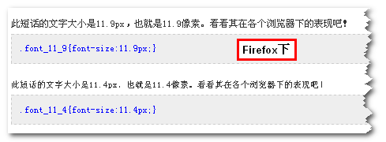

# 解析差异

上面一行是 11.9 像素大小的文字，下面一行是 11.4 像素大小的文字，看看各个浏览器下都表现得怎么样：

IE6 浏览器下（IE 下与此表现一致，避免重复，IE7 下图略）


Firefox 浏览器下



chrome 浏览器下（Safari 同内核，同表现）


当文字大小 11.9 像素时，IE6 和 Firefox 等浏览器的表现是不一致的。IE6 下显示的是 11 像素大小的文字效果，而 Firefox 等 w3c 标准的浏览器则 12 像素显示，这就是差异所在，也是本文的关键核心所在。但在 12.4 像素下，各个浏览器表现都是一致的。

IE（IE8 未测）与其他浏览器对于小数像素的解析差异：IE 对小数像素采取取整的策略，类似于 Math.floor()方法，就算你大小为 11.999999 像素，最后还是显示 11 像素文字的大小（已测试）；而 Firefox 等一些浏览器则采取四舍五入的策略，类似于 Math.round()方法，11.4 像素就表现为 11 像素，11.5 像素就表现为 12 像素（已测试）。由于平时很少有人用小数值，所以这种差异很少有人注意，所以很少有人关注。然而这个不起眼的浏览器差异有时候却是解决一些兼容性问题的绝妙武器。

IE8 浏览器下对于小数的解析与 Firefox，Chrome 等浏览器一致。

# 应用

例如，淘宝首页 css 代码里面有这么一段 hack，见下图（图对应淘宝网首页上部搜索选项卡样式）：


这段 hack 是个相差 1 像素的 hack，用“\*”表示区分 IE 和其他浏览器。我们验证过 IE 和其他浏览器对小数值的解析是有差异的，准确说是小数点后大于 5 的小数值像素解析是有差异的，而这个差异正好可以解决这里的兼容性问题，于是这个 hack 就可以一脚踢掉了。直接改成下面的样式就可以了：

```css
padding: 0 11.9px;
```

不仅仅缩短的代码的长度，还节省了一个 css hack。首先加载文件小了，其次去掉一个 hack，资源消耗少了。不用小看这么一点小小的节省，这可是淘宝网的首页，每天的浏览量可是相当惊人的哦！

附上 demo 实例页面验证结果图放大 800 倍的对比图，从 photoshop 上沿标尺可以读出 padding 值，您可以发现 IE6 下 11 像素，而 Firefox 浏览器下 12 像素。这与 hack 达到了同样的功效，但是代码却是没有 hack，更简短更简明，更神奇，您不妨也试试！


# 总结

虽说这个小数值解决一些兼容性问题很神奇，但是它的缺点也很明显，就是适用范围问题，只能解决相差 1 像素的浏览器差异，只能解决 IE 下值小 1 像素的浏览器差异。
