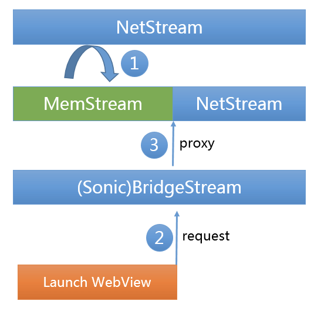

# 常用加速方法

通常的 web 优化方法，基本围绕在资源加载和 html 渲染两个方面。前者针对首屏，后者针对可交互。

资源优化上，我们总的方向是围绕更小的资源包上，比如常见的：压缩、减包、拆包、动态加载包及图片优化上。

html 渲染上总的方向是更快的展示内容，比如通过 cdn 分发、dns 解析、http 缓存、数据预请求，数据缓存及首屏优化大杀器——直出等。

这些方案是各种前端面试中必考点，也是作为一个前端开发，当遇到性能问题、需要解决性能问题时最为首要和基本的思路。而具体应该使用什么样的方案，取决于实际开发需求、优先级、综合成本、及投入产出比等。

在 react-native、weex 及 flutter 等客户端的技术不断在冲击传统 hybrid 的时候，hybrid 也在一路演化、加速，朝着一个使其达到与原生相媲美的方向发展。下面归纳了 hybrid 发展中出现的一些方案，排序不分先后。

# 直出 + 离线包缓存

为了优化首屏，大部分主流的页面会通过服务器进行渲染，吐出 html 文件到前端，解决转菊花比较久的问题，不同类型的主流框架，都会有一套后台渲染方案，比如 vue-server-renderer、react-dom/server 等。直出省去了前端渲染，及 ajax 请求的时间，虽然直出能够通过各种缓存策略优化得很好，但加载 html 仍然需要时间。

通过离线包技术能够很好解决 html 文件本身加载需要时间的问题。离线包基本思路都是通过 webview 统一拦截 url，将资源映射到本地离线包，更新的时候对版本资源检测，下载和维护本地缓存目录中的资源。比如腾讯的 webso 和 Alloykit 的离线包方案。

离线包策略在很多大厂运用比较成熟，它对 web 端而言，是相对透明，侵入性非常小。

# 客户端代理的 VasSonic

在 hybrid h5 中，用户从点击到看见页面之间，还存在 webview 初始化，请求资源的时间，而这里的过程是串行的，对于追求更极致的体验来说，这里是有优化掉的空间和可能。

VasSonic 是腾讯增值会员团队研发的一个轻量级 hybrid 框架，支持上面提到的离线包策略，更进一步的是，它还做了以下优化：

- webview 初始化和通过客户端代理资源请求并行
- 流式拦截请求，边加载边渲染
- 实现了动态缓存和增量更新

简单说下它是怎么做到的，客户端代理资源请求并行没什么好说的，就是在创建 webview 之前，通过客户端代理建立网络连接，请求 html，然后缓存起来，等待 webview 线程发起 html 资源请求的时候，客户端进行拦截，将缓存好的 html 返回给 webview。

动态缓存和增量更新如何做到呢？

VasSonic 将 html 的内容分为 html 模板和动态数据两部分，如何区分这两种类型呢，它自己定义了一套 html 注释标记规则，通过标签划分哪些是动态数据，哪些是模板数据。然后再拓展了 http 头部，定制了一套请求后台的约定。webview 发起 http 请求时会将页面内容的 id 携带过去，后台处理判断后，再告诉客户端是否需要更新局部数据，如果是则将缓存的 html 模板与新数据拼接成新的 html，最后计算出数据差异部分，通过 js 回调给页面，进行布局刷新。

VasSonic 的方案整体思路和效果非常不错，特别是对于大部分 web 场景，通常我们的模板较少发生变化，大部分是数据部分变化，能够很好的通过局部刷新做到秒开效果。对于首次加载而言，通过并发请求和 webview 创建带来了不错的性能提升，还能无缝的支持离线包策略。

但是 VasSonic 定义了一套特殊的注释标记及拓展了头部，需要包括后台在内的前后端进行改造，对 web 侵入性非常强，接入的工作量及维护成本会非常大。

# PWA + 直出 + 预加载

不管是离线包技术，还是 webview 代理请求，都是对前端侵入非常大的，pwa 作为 web 标准，能够通过纯 web 的方案去加速和优化加载性能。

首先，pwa 能够通过 cacheStorage 缓存普通的图片、js、css 资源。另一方面，在传统的 http cache 中，我们一般不会缓存 html，这是因为页面一旦设置了过长的 max-age，在浏览器缓存过期时间内，用户看到的永远将是旧的。

如果使用了 pwa 的 html 页面，能否直接缓存呢？由于 pwa 可精细化控制缓存，答案是可以的。

对于直出 html，我们可以配合 pwa，将从后台直出的文件，缓存到 cacheStorage，在下一次请求时，优先从本地缓存中获取，同时发起网络请求更新本地 html 文件。

但是在 hybrid 的 h5 应用，第一次启动的加载资源仍然费时，我们可以通过 app 端上支持预加载一个 javascript 脚本，拉取需要 PWA 缓存的页面，可以提前完成缓存。

对于非直出的页面，我们仍然无法避免浏览器渲染 html 时间的问题，应该如何减少这里的时间呢？

这里明确两个点，第一次永远只能靠提前加载，所以上面的借助端上预加载脚本仍然生效；第二点非直出页面，每个页面需要有独一无二的标记，比如 hash。浏览器获取到数据，并且渲染好的 html，能够通过 outerHTML 方法，将 html 页面缓存到 cacheStorage 中，第二次访问优先从本地获取，同时发起 html 请求，通过对比其中唯一标识的差异，决定是否需要更新。

pwa 一系列方案替代离线包策略，带来的好处是，属于 web 标准，适用于普通能够支持 service-worker 的 H5 页面。在允许兼容问题允许的情况下，建议主加。

# NSR 渲染

GMTC 2019 全球大前端技术上 UC 团队提到了 0.3 秒的 “闪开” 方案。NSR 就是前端版本的 SSR，非常具有启发性。

其核心思路是，借助浏览器启用一个 JS-Runtime，提前将下载好的 html 模板及预取的 feed 流数据进行渲染，然后将 html 设置到内存级别的 MemoryCache 中，从而达到点开即看的效果。

NSR 将 SSR 渲染的过程分发到了各个用户的端中，在减少了后台请求压力的同时，也加进一步快了页面打开速度，堪称做到极致。

问题是数据预取和预渲染带来额外的流量和性能开销，特别是流量，如何更准确的预测用户行为，提高命中率是非常重要的事。类似 NSR 的方案我们也在逐步探索中。

# 客户端 PWA

在实际测试以及和浏览器团队的同学了解和沟通中，service-worker 在 webview 实现性能并没有想象中好。在某项目下掉 sw 后，整体大盘访问速度整体反而提升上升了大概 300ms。
这对 hybrid 应用而言，就提出了一项新的思路和挑战，能否在客户端上实现一套基本的 service-worker api？从而达到和 web 标准相兼容。这里也只是一种思路和想法，有大量待探索的问题点，比如 webview sw 具体的性能现状，未来的支持情况呢，自行实现的成本，及最终带来的效果和价值等。

# 小程序化

小程序生态已经非常成熟了，各大厂也都已经推出了自己平台的小程序，国内厂商也不断在尝试推进 MiniApp w3c 标准。不管从加载速度还是页面流畅度小程序都要高于 H5 页面，其原因是通过在架构上对开发进行规范化和约束化，小程序内部将 webview 渲染和 js 执行分离开来，然后通过离线包，页面拆分，预加载页面等一系列优化手段，让小程序天然具备了大量的 H5 优化后的效果，其代价是牺牲了 web 的灵活性。但对于 hybrid 开发，通过原生客户端底层支持这种小程序环境，然后大量业务逻辑采用小程序方案开发，来达到迭代速度与性能兼并的效果，是一种非常不错的方向。

# 小结

不管哪种类型的方案，发现其总的思路和方向都是：

- 在整个链路中减少中间环节。比如将串行改并行，包括小程序内部执行机制。
- 尽可能的预加载、预执行。比如从数据预取，到页面预取渲染等。

任何转换都有代价，加速本质上就是在用更多的网络、内存和 CPU 换取速度，以空间换时间。

