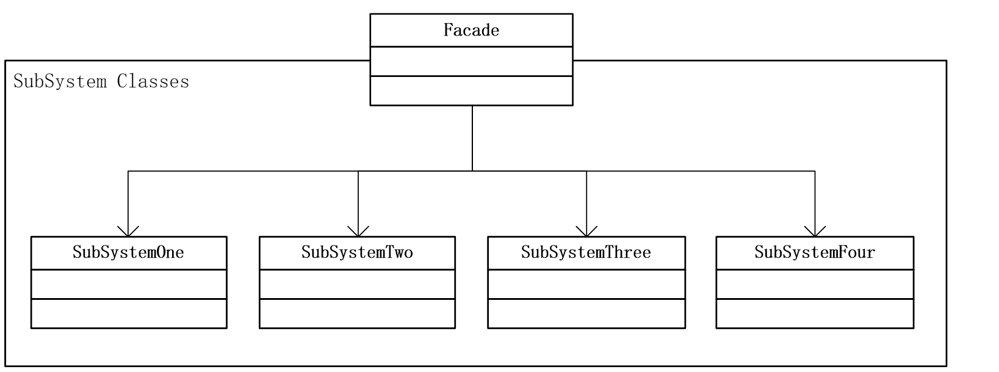
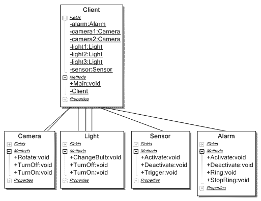
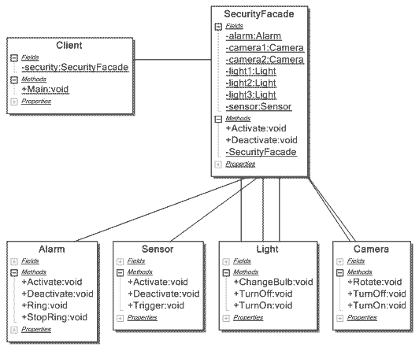
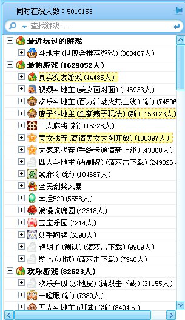
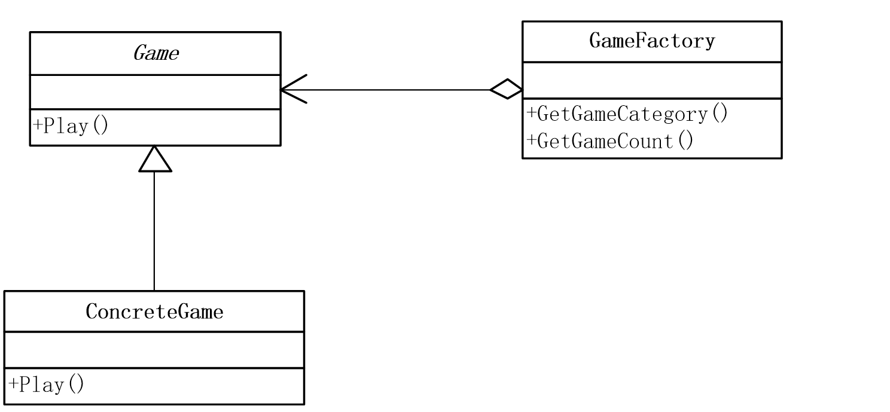
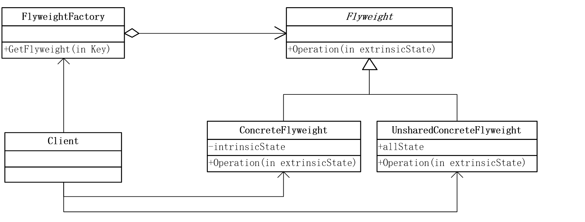
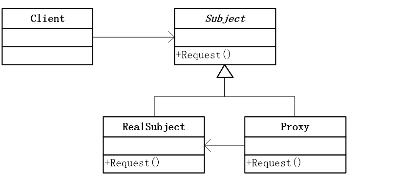

## 外观模式(Facade)

为子系统中的一组接口提供一个一致的界面，Facade模式定义了一个高层接口，这个接口使得这一子系统更加容易使用。

### 模式背景

当客户来进行抵押贷款时，有如下几件事情需要确认：

1. 到银行子系统查询他是否有足够多的存款
2. 到信用子系统查询他是否有良好的信用
3. 到贷款子系统查询他有无贷款劣迹

只有这三个子系统都通过时才可进行抵押。


```cpp
//顾客类
public class Customer
{
    private string _name;

    public Customer(string name)
    {
        this._name = name;
    }

    public string Name
    {
        get { return _name; }
    }
}
public class Bank  //银行子系统
{
    public bool HasSufficientSavings(Customer c, int amount)
    {
        Console.WriteLine("查询银行信息，客户名 " + c.Name);
        return true;
    }
}
public class Credit   //信用子系统
{
    public bool HasGoodCredit(Customer c)
    {
        Console.WriteLine("查询信用信息，客户名 " + c.Name);
        return true;
    }
}
public class Loan   //贷款子系统
{
    public bool HasNoBadLoans(Customer c)
    {
        Console.WriteLine("查询贷款信息，客户名 " + c.Name);
        return true;
    }
}
static void Main(string[] args)
{
    Bank bank = new Bank();
    Loan loan = new Loan();
    Credit credit = new Credit();
    int Money = 12000;
    Customer customer = new Customer("张三");
    bool eligible = true;
    
    if (!bank.HasSufficientSavings(customer, Money))
    {
        eligible = false;
    }
    else if (!loan.HasNoBadLoans(customer))
    {
        eligible = false;
    }
    else if (!credit.HasGoodCredit(customer))
    {
        eligible = false;
    }

    Console.WriteLine("客户 " + customer.Name + " 已经被 " + (eligible ? "通过" : "拒绝"));
    Console.ReadLine();
}
```

可以看到，客户程序与三个子系统都发生了耦合，这种耦合使得客户程序依赖于子系统，当子系统变化时，客户程序也将面临很多变化的挑战。

### 模式动机

- 将一个系统划分为若干个子系统有利于降低系统的复杂性，一个常见的设计目标是使子系统间的通信和相互依赖关系达到最小，而达到该目标的途径之一就是引入一个外观对象，它为子系统中较一般的设置提供了一个单一而简单的界面。
- 外观模式要求一个子系统的外部与其内部的通信必须通过一个统一的外观(Facade)对象进行。就如同医院的接待员一样，外观模式的外观类将客户端与子系统的内部复杂性分隔开，使得客户端只需要与外观对象打交道，而不需要与子系统内部的很多对象打交道。
- 在没有外观类(Facade)之前，客户类(Client)需要和子系统类(Subsystem)进行复杂的交互，系统的耦合度很大；而增加一个外观类之后，客户类只需要直接和外观类交互，子系统类之间的复杂关系由外观类来实现，从而降低了系统的耦合度。

### 模式定义

外部与一个子系统的通信必须通过一个统一的外观对象进行，为子系统中的一组接口提供一个一致的界面，外观模式定义了一个高层接口，这个接口使得这一子系统更加容易使用。外观模式是对象的结构模式。


```cpp
public class Mortgage     //外观类
{
    private Bank bank = new Bank();
    private Loan loan = new Loan();
    private Credit credit = new Credit();

    public bool IsEligible(Customer cust, int amount)
    {
        Console.WriteLine("{0} 申请 {1:C} 贷款 ", cust.Name, amount);

        bool eligible = true;

        if (!bank.HasSufficientSavings(cust, amount))
        {
            eligible = false;
        }
        else if (!loan.HasNoBadLoans(cust))
        {
            eligible = false;
        }
        else if (!credit.HasGoodCredit(cust))
        {
            eligible = false;
        }

        return eligible;
    }
}
static void Main(string[] args)
{
    Mortgage mortgage = new Mortgage();   //外观

    Customer customer = new Customer("张三");
    bool eligable = mortgage.IsEligible(customer, 125000);

    Console.WriteLine("客户 " +customer.Name+" 已经被 "+(eligable ? "通过" : "拒绝"));
    Console.ReadLine();
}
```

引入Facade模式后，客户程序只与Mortgage发生依赖，也就是Mortgage屏蔽了子系统之间的复杂的操作，达到了解耦内部子系统与客户程序之间的依赖。

### 模式结构



- Facade：外观角色 
- SubSystem：子系统角色

**保安系统**

一个保安系统由两个录像机、三个电灯、一个遥感器和一个警报器组成。保安系统的操作人员需要经常将这些仪器启动和关闭。



Client对象需要引用到所有的录像机(Camera)、电灯(Light)、感应器(Sensor)和警报器(Alarm)对象。

```cpp
public class Camera
{
    public void TurnOn()
    {
        Console.WriteLine("Turning on the camera.");
    }
    public void TurnOff()
    {
        Console.WriteLine("Turning off the camera.");
    }
    public void Rotate(int degrees){
        Console.WriteLine("Rotating the camera by {0} degrees.", degrees);
    }
} 
public class Light
{
    public void TurnOff()
    {
        Console.WriteLine("Turning on the light.");
    }
    public void TurnOn()
    {
        Console.WriteLine("Turning off the light.");
    }
    public void ChangeBulb()
    {
        Console.WriteLine("changing the light-bulb.");
    }
} 
public class Sensor
{
    public void Activate()
    {
        Console.WriteLine("Activating the sensor.");
    }
    public void Deactivate()
    {
        Console.WriteLine("Deactivating the sensor.");
    }
    public void Trigger()
    {
        Console.WriteLine("The sensor has triggered.");
    }
}
public static void Main( string[] args ){
    private static Camera camera1, camera2;
    private static Light light1, light2, light3;
    private static Sensor sensor;
    private static Alarm alarm;
    camera1 = new Camera();
    camera2 = new Camera();
    light1 = new Light();
    light2 = new Light();
    light3 = new Light();
    sensor = new Sensor();
    alarm = new Alarm();
    camera1.TurnOn();
    camera2.TurnOn();
    light1.TurnOn();
    light2.TurnOn();
    light3.TurnOn();
    sensor.Activate();
    alarm.Activate();
} 
```

一个合情合理的改进方法就是准备一个系统的控制台，作为保安系统的用户界面。



```cpp
public class SecurityFacade
{
    private static Camera camera1, camera2;
    private static Light light1, light2, light3;
    private static Sensor sensor;
    private static Alarm alarm;
    static SecurityFacade()
    {
        camera1 = new Camera();
        camera2 = new Camera();
        light1 = new Light();
        light2 = new Light();
        light3 = new Light();
        sensor = new Sensor();
        alarm = new Alarm();
    }
    public void Activate()
    {
        camera1.TurnOn();
        camera2.TurnOn();
        light1.TurnOn();
        light2.TurnOn();
        light3.TurnOn();
        sensor.Activate();
        alarm.Activate();
    }
    public void Deactivate()
    {
        camera1.TurnOff();
        camera2.TurnOff();
        light1.TurnOff();
        light2.TurnOff();
        light3.TurnOff();
        sensor.Deactivate();
        alarm.Deactivate();
    }
} 
public static void Main( string[] args )
{
    private static SecurityFacade security;
    security = new SecurityFacade();
    security.Activate();
    Console.WriteLine("\n--------------------\n");
    security.Deactivate();
} 
```

### 优缺点

- 它对客户屏蔽子系统组件，减少了客户处理的对象数目使得子系统使用起来更加容易。 
- 它实现了子系统与客户之间的松耦合关系。这使得子系统的组件变化不会影响到它的客户。 
- 提高了安全性，通过外观模式，屏蔽子系统业务逻辑。
- 它简化了系统在不同平台之间的移植过程，因为编译一个子系统一般不需要编译所有其它的子系统。 
- 它并不限制复杂应用使用子系统类。 
- 外观模式并不增加任何功能性模式，它仅仅是一些简单化接口。

### 模式使用

- 当要为一个复杂子系统提供一个简单接口时。这个接口对大多数用户来说已经足够好；那些需要更多可定制性的用户可以越过Facade层。 
- 子系统相对独立——外界只需黑箱操作即可。例如利息计算。 
- 预防操作人员带来的风险扩散。

### 模式应用

- 子系统可以有多个外观。
- 外观不参与子系统的业务逻辑。

## 享元模式(Flyweight)

运用共享技术有效地支持大量细粒度的对象。

### 模式背景



如何设计能有效减少系统开销?

```cpp
class Game  //游戏
{
    private string name = "";
    public Game(string name)
    {
        this.name = name;
    }

    public void Play()
    {
        Console.WriteLine("运行游戏：" + name);
    }
}
static void Main(string[] args)
{
    Game zs = new Game("斗地主");
    zs.Play();

    Game ls = new Game("斗地主");
    ls.Play();

    Game ww = new Game("斗地主");
    ww.Play();

    Game zl = new Game("麻将");
    zl.Play();

    Game sq = new Game("麻将");
    sq.Play();

    Game zb = new Game("麻将");
    zb.Play();

    Console.Read();
}
```

三个斗地主实例，本质都是一样的代码，但是随着用户增多，实例也会增多，对服务器资源造成浪费，希望共享代码

### 享元模式

- 享元模式对那些通常因为数量太大而难以用对象来表示的概念或实体进行建模。
- 如为字母表中的每一个字符创建一个享元，每个享元对象存储一个字符代码。逻辑上，文档中的给定字符每次出现都有一个对象与其对应，然而物理上相同的字符共享一个享元对象，而这个对象可以出现在文档结构的不同地方。
- 由于不同的字符对象数远小于文档中的字符数，因此，对象的总数远小于一个初次执行的程序所使用的对象数目。对于一个所有字符都使用同样的字体和颜色的文档而言，不管这个文档有多长，只需要分配100个左右的字符对象（大约是ASCII字符集的数目）。由于大多数文档使用的字体颜色的组合不超过10 种，实际应用中这一数目不会明显增加。因此，对单个字符进行对象抽象是具有实际意义的。

### 模式定义

运用共享技术有效地支持大量细粒度的对象。 系统只使用少量的对象，而这些对象都很近，状态变化很小，对象使用次数增多。享元模式是一种对象结构型模式。



```cpp
abstract class Game   //游戏
{
    public abstract void Play();
}
class ConcreteGame : Game //具体的游戏
{
    private string name = "";
    public ConcreteGame(string name)
    {
        this.name = name;
    }

    public override void Play()
    {
        Console.WriteLine("运行游戏：" + name);
    }
}
class GameFactory   //游戏工厂
{
    private Hashtable flyweights = new Hashtable();

    //获得游戏分类
    public Game GetGameCategory(string key)
    {
        if (!flyweights.ContainsKey(key))
            flyweights.Add(key, new ConcreteGame(key));
        return ((Game)flyweights[key]);
    }

    //获得游戏分类总数
    public int GetGameCount()
    {
        return flyweights.Count;
    }
}
static void Main(string[] args)
{

    GameFactory f = new GameFactory();

    Game zs = f.GetGameCategory("斗地主");
    zs.Play();
    Game ls = f.GetGameCategory("斗地主");
    ls.Play();
    Game ww = f.GetGameCategory("斗地主");
    ww.Play();
    Game zl = f.GetGameCategory("麻将");
    zl.Play();
    Game sq = f.GetGameCategory("麻将");
    sq.Play();
    Game zb = f.GetGameCategory("麻将");
    zb.Play();
    Console.WriteLine("游戏逻辑总数为 {0}", f.GetGameCount());

    Console.Read();
}
```

- 实现了享元模式共享的目的，无论几个用户，运行游戏一样，就只保留一个游戏逻辑代码。
- 但是，这些用户毕竟不是同一个用户，用户名不同，用户的牌也不同。
- 我们称享元对象内部不随环境变化的共享部分称为内部状态。
- 而随环境而改变，不可以共享的称为外部状态。


```cpp
public class User //用户
{
    private string name;

    public User(string name)
    {
        this.name = name;
    }

    public string Name
    {
        get { return name; }
    }
}
abstract class Game   //游戏
{
    public abstract void Play(User user);
}
class ConcreteGame : Game //具体的游戏
{
    private string name = "";
    public ConcreteGame(string name)
    {
        this.name = name;
    }

    public override void Play(User user)
    {
        Console.WriteLine("运行游戏：" + name + " 用户：" + user.Name);
    }
}
static void Main(string[] args)
{
    GameFactory f = new GameFactory();

    Game zs = f.GetGameCategory("斗地主");
    zs.Play(new User("张三"));
    Game ls = f.GetGameCategory("斗地主");
    ls.Play(new User("李四"));
    Game ww = f.GetGameCategory("斗地主");
    ww.Play(new User("王五"));
    Game zl = f.GetGameCategory("麻将");
    zl.Play(new User("赵六"));
    Game sq = f.GetGameCategory("麻将");
    sq.Play(new User("孙七"));
    Game zb = f.GetGameCategory("麻将");
    zb.Play(new User("周八"));

    Console.WriteLine("游戏逻辑总数为 {0}", f.GetGameCount());

    Console.Read();
}
```

### 模式结构



- Flyweight：抽象享元类 
- ConcreteFlyweight：具体享元类 
- UnsharedConcreteFlyweight：非共享具体享元类 
- FlyweightFactory：享元工厂类 
- Client：客户类

### 优缺点

- 大幅度地降低内存中对象的数量。
- 使得系统更加复杂。 
- 为了使对象可以共享，需要将一些状态外部化，这使得程序的逻辑复杂化。
- 享元模式将享元对象的状态外部化，而读取外部状态使得运行时间稍微变长。

### 模式使用

- 一个系统有大量的对象，造成耗费大量的内存。 
- 这些对象的状态中的大部分都可以外部化。 
- 这些对象可以按照内部状态分成很多的组，当把外部对象从对象中剔除时，每一个组都可以用相对较少的共享对象代替。 
- 软件系统不依赖于这些对象的身份，换言之，这些对象可以是不可分辨的。

### 模式应用

- 在编辑器软件中大量使用，如在一个文档中多次出现相同的图片，则只需要创建一个图片对象，通过在应用程序中设置该图片出现的位置，可以实现该图片在不同地方多次重复显示。
- Windows DLL(动态链接库)
- String类型

## 代理模式(Proxy)

为其他对象提供一种代理以控制对这个对象的访问。

### 模式使用

```cpp
//快递工作人员
class ExpressPerson
{
    private string name;
    public string Name
    {
        get { return name; }
        set { name = value; }
    }
}
//毕业生
class Graduate
{
    ExpressPerson YDY;
    public Graduate(ExpressPerson YDY)
    {
        this.YDY = YDY;
    }
    public void GiveComputer()
    {
        Console.WriteLine(YDY.Name + " 请你托运计算机");
    }
    public void GiveBaggage()
    {
        Console.WriteLine(YDY.Name + " 请你托运行李");
    }
}
static void Main(string[] args)
{
    ExpressPerson YDY = new ExpressPerson();
    YDY.Name = "宅急送";

    Graduate zhangsan = new Graduate(YDY);

    zhangsan.GiveComputer();
    zhangsan.GiveBaggage();

    Console.Read();
}
//女同学
class Classmate
{
    ExpressPerson YDY;
    public Classmate(ExpressPerson YDY)
    {
        this.YDY = YDY;
    }
    public void GiveComputer()
    {
        Console.WriteLine(YDY.Name + " 请你托运计算机");
    }
    public void GiveBaggage()
    {
        Console.WriteLine(YDY.Name + " 请你托运行李");
    }
}
static void Main(string[] args)
{
    ExpressPerson YDY = new ExpressPerson();
    YDY.Name = "宅急送";

    Classmate Girl = new Classmate(YDY);

    Girl.GiveComputer();
    Girl.GiveBaggage();

    Console.Read();
}
```

以上代码复用性太低，有何解决办法？


```cpp
//寄东西
interface GiveObject
{
    void GiveComputer();
    void GiveBaggage();
}
//毕业生
class Graduate : GiveObject
{
    ExpressPerson YDY;
    public Graduate(ExpressPerson YDY)
    {
        this.YDY = YDY;
    }
    public void GiveComputer()
    {
        Console.WriteLine(YDY.Name + " 请你托运计算机");
    }
    public void GiveBaggage()
    {
        Console.WriteLine(YDY.Name + " 请你托运行李");
    }
}
//女同学 : GiveGift
class Classmate : GiveObject
{
    Graduate zhangsan;
    public Classmate(ExpressPerson YDY)
    {
        zhangsan = new Graduate(YDY);
    }
    public void GiveComputer()
    {
        zhangsan.GiveComputer();
    }
    public void GiveBaggage()
    {
        zhangsan.GiveBaggage();
    }
}
static void Main(string[] args)
{
    ExpressPerson YDY = new ExpressPerson();
    YDY.Name = "宅急送";

    Classmate Girl = new Classmate(YDY);

    Girl.GiveComputer();
    Girl.GiveBaggage();

    Console.Read();
}
```

以上代码就是代理模式，复用了中介的功能。

### 模式动机

一个客户不想或者不能够直接引用一个对象，而代理对象可以在客户端和目标对象之间起到中介的作用，去掉客户不能看到的内容和服务或者增添客户需要的额外服务。如在网页上查看一张图片，由于网速等原因图片不能立即显示，我们可以在图片传输过程中先把一些简单的用于描述图片的文字传输到客户端，此时这些文字就成为了图片的代理。

### 模式定义

给某一个对象提供一个代理，并由代理对象控制对原对象的引用。代理模式的英文叫做Proxy或Surrogate。代理模式是一种对象结构型模式。

### 模式结构



- Subject：抽象主题角色 
- Proxy：代理主题角色 
- RealSubject：真实主题角色 

### 模式使用

- 远程（Remote）代理 
- 虚拟（Virtual）代理 
- 保护（Protect or Access）代理 
- 缓冲（Cache）代理 
- 防火墙（Firewall）代理 
- 同步化（Synchronization）代理 
- 智能引用（Smart Reference）代理

### 优缺点

- 优点
    - 代理模式能够协调调用者和被调用者，能够在一定程度上降低系统的耦合度。 
    - 当对象在远程机器上，要通过网络来生成时速度可能会很慢，此时应用代理模式可以掩盖对象在网络上生成的过程，系统的速度会加快。 
    - 对于大对象的加载(如大图片)，虚拟代理可以让加载过程在后台执行，前台使用的代理对象会使得整体运行速度得到优化。
- 缺点
    - 请求的处理速度会变慢，并且实现代理模式需要额外的工作。

### 模式应用

- 图片代理 
- AOP(Aspect Oriented Programming)
