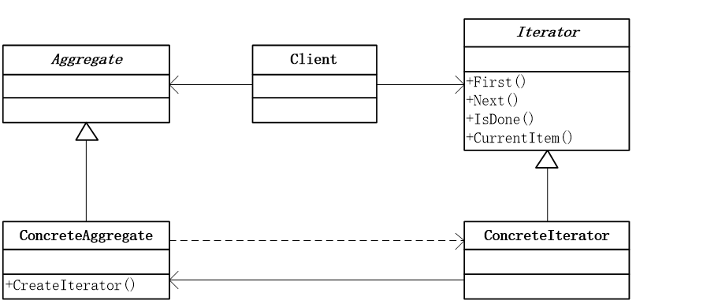
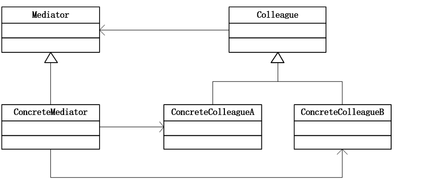

## 职责链模式(Chain of Responsibility)

使多个对象都有机会处理请求，从而避免请求的发送者和接收者之间的耦合关系。将这些对象连成一条链,  并沿着这条链传递该请求，直到有一个对象处理它为止。

### 模式背景

加薪、请假非要老总批?

- 每级领导都有一定限度的权利，对待申请，需判断是否有权来决策
- 经理可以批 2 天以下请假，如果没权利，向总监上报
- 总监可以批 5 天以下请假，如果没权利，向总经理上报

```cpp
class Request   //申请
{
    //申请类别
    private string requestType;
    public string RequestType
    {
        get { return requestType; }
        set { requestType = value; }
    }

    //申请内容
    private string requestContent;
    public string RequestContent
    {
        get { return requestContent; }
        set { requestContent = value; }
    }

    //数量
    private int number;
    public int Number
    {
        get { return number; }
        set { number = value; }
    }
}
class Manager
{
    protected string name;
    public Manager(string name)
    {
        this.name = name;
    }
    public void GetResult(ManagerLevel managerLevel, Request request)
    {
        if (managerLevel == ManagerLevel.经理)
        {
            if (request.RequestType == "请假" && request.Number <= 2)
            {
                Console.WriteLine("{0}:{1} 数量{2} 被批准", name, request.RequestContent, request.Number);
            }
            else
            {
                Console.WriteLine("{0}:{1} 数量{2} 我无权处理", name, request.RequestContent, request.Number);
            }
        }
        else if (managerLevel == ManagerLevel.总监)
        {
            if (request.RequestType == "请假" && request.Number <= 5)
            {
                Console.WriteLine("{0}:{1} 数量{2} 被批准", name, request.RequestContent, request.Number);
            }
            else
            {
                Console.WriteLine("{0}:{1} 数量{2} 我无权处理", name, request.RequestContent, request.Number);
            }
        }
        else if (managerLevel == ManagerLevel.总经理)
        {
            if (request.RequestType == "请假")
            {
                Console.WriteLine("{0}:{1} 数量{2} 被批准", name, request.RequestContent, request.Number);
            }
            else if (request.RequestType == "加薪" && request.Number <= 500)
            {
                Console.WriteLine("{0}:{1} 数量{2} 被批准", name, request.RequestContent, request.Number);
            }
            else if (request.RequestType == "加薪" && request.Number > 500)
            {
                Console.WriteLine("{0}:{1} 数量{2} 再说吧", name, request.RequestContent, request.Number);
            }
        }
    }
}
static void Main(string[] args)
{
    Manager jinli = new Manager("金利");
    Manager zongjian = new Manager("宗剑");
    Manager zhongjingli = new Manager("钟精励");

    Request request = new Request();
    request.RequestType = "加薪";
    request.RequestContent = "张三请求加薪";
    request.Number = 1000;

    jinli.GetResult(ManagerLevel.经理, request);
    zongjian.GetResult(ManagerLevel.总监, request);
    zhongjingli.GetResult(ManagerLevel.总经理, request);

    Request request2 = new Request();
    request2.RequestType = "请假";
    request2.RequestContent = "张三请假";
    request2.Number = 3;

    jinli.GetResult(ManagerLevel.经理, request2);
    zongjian.GetResult(ManagerLevel.总监, request2);
    zhongjingli.GetResult(ManagerLevel.总经理, request2);

    Console.Read();
}
```

### 模式动机

- 职责链可以是一条直线、一个环或者一个树形结构，最常见的职责链是直线型，即沿着一条单向的链来传递请求。
- 链上的每一个对象都是请求处理者，职责链模式可以将请求的处理者组织成一条链，并使请求沿着链传递，由链上的处理者对请求进行相应的处理。
- 客户端无须关心请求的处理细节以及请求的传递，只需将请求发送到链上即可，将请求的发送者和请求的处理者解耦。这就是职责链模式的模式动机。

### 模式定义

避免请求发送者与接收者耦合在一起，让多个对象都有可能接收请求，将这些对象连接成一条链，并且沿着这条链传递请求，直到有对象处理它为止。职责链模式又称为责任链模式，它是一种对象行为型模式。


```cpp
//管理者
abstract class Manager
{
    protected string name;
    //管理者的上级
    protected Manager superior;

    public Manager(string name)
    {
        this.name = name;
    }

    //设置管理者的上级
    public void SetSuperior(Manager superior)
    {
        this.superior = superior;
    }

    //申请请求
    abstract public void RequestApplications(Request request);
}
class CommonManager : Manager    //经理
{
    public CommonManager(string name) : base(name)
    { }
    public override void RequestApplications(Request request)
    {
        if (request.RequestType == "请假" && request.Number <= 2)
        {
        Console.WriteLine("{0}:{1} 数量{2} 被批准", name, request.RequestContent, request.Number);
        }
        else
        {
            if (superior != null)
                superior.RequestApplications(request);
        }
    }
}
class Majordomo : Manager  //总监
{
    public Majordomo(string name) : base(name)
    { }
    public override void RequestApplications(Request request)
    {
        if (request.RequestType == "请假" && request.Number <= 5)
        {
        Console.WriteLine("{0}:{1} 数量{2} 被批准", name, request.RequestContent, request.Number);
        }
        else
        {
            if (superior != null)
                superior.RequestApplications(request);
        }
    }
}
class GeneralManager : Manager    //总经理
{
    public GeneralManager(string name) : base(name)
    { }
    public override void RequestApplications(Request request)
    {
        if (request.RequestType == "请假")
        {
        Console.WriteLine("{0}:{1} 数量{2} 被批准", name, request.RequestContent, request.Number);
        }
        else if (request.RequestType == "加薪" && request.Number <= 500)
        {
        Console.WriteLine("{0}:{1} 数量{2} 被批准", name, request.RequestContent, request.Number);
        }
        else if (request.RequestType == "加薪" && request.Number > 500)
        {
        Console.WriteLine("{0}:{1} 数量{2} 再说吧", name, request.RequestContent, request.Number);
        }
    }
}
static void Main(string[] args)
{
    CommonManager jinli = new CommonManager("金利");
    Majordomo zongjian = new Majordomo("宗剑");
    GeneralManager zhongjingli = new GeneralManager("钟精励");
    jinli.SetSuperior(zongjian);
    zongjian.SetSuperior(zhongjingli);

    Request request = new Request();
    request.RequestType = "请假";
    request.RequestContent = "张三请假";
    request.Number = 1;
    jinli.RequestApplications(request);

    Request request3 = new Request();
    request3.RequestType = "加薪";
    request3.RequestContent = "张三请求加薪";
    request3.Number = 500;
    jinli.RequestApplications(request3);

    Console.Read();
}
```

### 模式结构


- Handler: 抽象处理者
- ConcreteHandler: 具体处理者
- Client: 客户类

### 职责链模式和状态模式比较

- 当客户提交一个请求时，请求是沿链传递直至有一个 ConcreteHander 对象负责处理它。链中的对象自己并不知道链的结构，在运行时确定。结果是职责链可简化对象的相互连接，它们仅需保持一个指向其后继者的引用或指针，而不需要保持它所有的候选接受者。这也就大大降低了耦合度了。也就是说，我们可以随时地增加或修改处理一个请求的结构。增强了给对象指派职责的灵活性。
- 状态模式主要解决的是当控制一个对象状态转换的条件表达式过于复杂的情况。把状态的判断逻辑转移到表示不同状态的一系列类当中，可以把复杂的判断逻辑简化。定义新的子类可以很容易地增加新的状态和转换。这样做的目的是为了消除庞大的条件分支语句。状态模式通过把各种状态转移逻辑分布到 State 的子类之间，来减少相互间的依赖。
- 职责链模式与状态模式的最大的不同是设置自己的下一级的问题上，状态模式是在类的设计阶段就定好的，不能在客户端改变，而职责链的下一级是在客户端自己来确定的。
- 职责链模式注重职责的传递，由客户端配置；状态模式注重对象状态的转换，转换过程对客户端是透明的。

请假例子，找班长请假，班长只能请半天，否则班长向老师申请，如果请假时间超过一周，老师要跟副年级主任请示，如果请假超出一个月，主任要跟年级正主任请示，然后被批准，或不被批准。

问题：如果班长请假了，用状态模式，其他学生都请不了假了，也就是如果状态模式中任何一环缺失的话，这个事件都无法进行下去

职责链模式的链式是在客户端连接的，也就是说，如果我们请假，请假制度一旦改变，比如说我们不需要班长，或者是先请求老师后直接请求主任或者中间多了一个环节，都是很容易实现的，所以，职责链模式要比状态模式灵活很多。

### 优缺点

- 优点
   - 降低耦合度
   - 可简化对象的相互连接
   - 增强给对象指派职责的灵活性
   - 增加新的请求处理类很方便
- 缺点
   - 不能保证请求一定被接收。
   - 系统性能将受到一定影响，而且在进行代码调试时不太方便；可能会造成循环调用。

### 模式使用

- 有多个对象可以处理同一个请求，具体哪个对象处理该请求由运行时刻自动确定。
- 在不明确指定接收者的情况下，向多个对象中的一个提交一个请求。
- 可动态指定一组对象处理请求

### 模式应用

**异常处理机制**

```java
try
{
    ……
}
catch(ArrayIndexOutOfBoundsException e1)
{
    ……
}
catch(ArithmeticException e2)
{
    ……
}
catch(IOException e3)
{
    ……
}
finally
{
    ……
}
```

### 纯与不纯的职责链模式

- 一个纯的职责链模式要求一个具体处理者对象只能在两个行为中选择一个：一个是承担责任，另一个是把责任推给下家。不允许出现某一个具体处理者对象在承担了一部分责任后又将责任向下传的情况。
- 在一个纯的职责链模式里面，一个请求必须被某一个处理者对象所接收；在一个不纯的职责链模式里面，一个请求可以最终不被任何接收端对象所接收。

## 命令模式(Command)

将一个请求封装为一个对象，从而使你可用不同的请求对客户进行参数化；对请求排队或记录请求日志,以及支持可撤消的操作。

### 模式背景

去烧烤店吃烧烤, 如果客人直接和烧烤的伙计打交道, 则烧烤的伙计将直接面对各种各样的客户各种各样的需求,各种各样的口味, 而且有的客人会因为等不及而走掉,但是伙计却不知道......最后烧烤伙计手忙脚乱.

那么，我们增加一个服务员，负责接待客户，那么客人将向服务员点菜；服务员手中拿着烧烤订单纸，客人只要把自己想要的东西写上，并注明需要的口味，服务员需按客人点餐的顺序把订单放在烧烤伙计的窗台上；如果有客人退单了，那么她只需要把订单抽掉就行了；烧烤伙计则只需要看订单安心做烧烤就行了.


### 模式动机

在软件设计中，我们经常需要向某些对象发送请求，但是并不知道请求的接收者是谁，也不知道被请求的操作是哪个，我们只需在程序运行时指定具体的请求接收者即可，此时，可以使用命令模式来进行设计，使得请求发送者与请求接收者消除彼此之间的耦合，让对象之间的调用关系更加灵活。

### 模式定义

将一个请求封装为一个对象，从而使我们可用不同的请求对客户进行参数化；对请求排队或者记录请求日志，以及支持可撤销的操作。命令模式是一种对象行为型模式，其别名为动作(Action)模式或事务(Transaction)模式。

### 模式结构


- Command: 抽象命令类
- ConcreteCommand: 具体命令类
- Invoker: 调用者
- Receiver: 接收者
- Client:客户类

```cpp
//烤肉串者
public class Barbecuer
{
    public void BakeMutton()
    {
        Console.WriteLine("烤羊肉串!");
    }

    public void BakeChickenWing()
    {
        Console.WriteLine("烤鸡翅!");
    }
}
//抽象命令
public abstract class Command
{
    protected Barbecuer receiver;

    public Command(Barbecuer receiver)
    {
        this.receiver = receiver;
    }

    //执行命令
    abstract public void ExcuteCommand();
}

//烤羊肉串命令
class BakeMuttonCommand : Command
{
    public BakeMuttonCommand(Barbecuer receiver) : base(receiver)
    { }

    public override void ExcuteCommand()
    {
        receiver.BakeMutton();
    }
}

//服务员
public class Waiter
{
    private Command command;

    //设置订单
    public void SetOrder(Command command)
    {
        this.command = command;
    }
    //通知执行
    public void Notify()
    {
        command.ExcuteCommand();
    }
}

static void Main(string[] args)
{
    //开店前的准备
    Barbecuer boy = new Barbecuer();
    Command bakeMuttonCommand1 = new BakeMuttonCommand(boy);
    Command bakeMuttonCommand2 = new BakeMuttonCommand(boy);
    Command bakeChickenWingCommand1 = new BakeChickenWingCommand(boy);
    Waiter girl = new Waiter();

    //开门营业
    girl.SetOrder(bakeMuttonCommand1);
    girl.Notify();
    girl.SetOrder(bakeMuttonCommand2);
    girl.Notify();
    girl.SetOrder(bakeChickenWingCommand1);
    girl.Notify();

    Console.Read();

}

```

### 优缺点

- 优点
   - 降低系统的耦合度。
   - 新的命令可以很容易地加入到系统中。
   - 可以比较容易地设计一个命令队列和宏命令（组合命令）。
   - 可以方便地实现对请求的 Undo 和 Redo。
- 缺点
   - 使用命令模式可能会导致某些系统有过多的具体命令类。因为针对每一个命令都需要设计一个具体命令类，因此某些系统可能需要大量具体命令类，这将影响命令模式的使用。

### 模式使用

- 系统需要将请求调用者和请求接收者解耦，使得调用者和接收者不直接交互。
- 系统需要在不同的时间指定请求、将请求排队和执行请求。
- 系统需要支持命令的撤销(Undo)操作和恢复(Redo)操作。
- 系统需要将一组操作组合在一起，即支持宏命令。

## 迭代器模式(Iterator)

提供一种方法顺序访问一个聚合对象中各个元素，而又不暴露该对象的内部表示。

### 模式背景

每个人都要买车票

```cpp
static void Main(string[] args)
{
    ArrayList a = new ArrayList() ;
    a.Add("大鸟");
    a.Add("小菜");
    a.Add("行李");
    a.Add("老外");
    a.Add("公交内部员工");
    a.Add(“小朋友");

    foreach (string item in a)
    {
        Console.WriteLine("{0} 请买车票!", item);
    }
    Console.Read();
}
```

### 模式动机

- 一个聚合对象，如一个列表(List)或者一个集合(Set)，应该提供一种方法来让别人可以访问它的元素，而又不需要暴露它的内部结构。
- 针对不同的需要，可能还要以不同的方式遍历整个聚合对象，但是我们并不希望在聚合对象的抽象层接口中充斥着各种不同遍历的操作。
- 怎样遍历一个聚合对象，又不需要了解聚合对象的内部结构，还能够提供多种不同的遍历方式，这就是迭代器模式所要解决的问题。
- 在迭代器模式中，提供一个外部的迭代器来对聚合对象进行访问和遍历，迭代器定义了一个访问该聚合元素的接口，并且可以跟踪当前遍历的元素，了解哪些元素已经遍历过而哪些没有。
- 有了迭代器模式，我们会发现对一个复杂的聚合对象的操作会变得如此简单。

### 模式定义

提供一种方法来访问聚合对象，而不用暴露这个对象的内部表示，其别名为游标(Cursor)。迭代器模式是一种对象行为型模式。

### 模式结构



- Iterator: 抽象迭代器
- ConcreteIterator: 具体迭代器
- Aggregate: 抽象聚合类
- ConcreteAggregate: 具体聚合类

```cpp
abstract class Iterator
{
    public abstract object First();
    public abstract object Next();
    public abstract bool IsDone();
    public abstract object CurrentItem();
}
abstract class Aggregate
{
    public abstract Iterator CreateIterator();
}
class ConcreteAggregate : Aggregate
{
    private IList<object> items = new List<object>();
    public override Iterator CreateIterator()
    {
        return new ConcreteIterator(this);
    }

    public int Count
    {
        get { return items.Count; }
    }

    public object this[int index]
    {
        get { return items[index]; }
        set { items.Insert(index, value); }
    }
}
class ConcreteIterator : Iterator
{
    private ConcreteAggregate aggregate;
    private int current = 0;
    public ConcreteIterator(ConcreteAggregate aggregate)
    {
        this.aggregate = aggregate;
    }
    public override object First()
    {
        return aggregate[0];
    }
    public override object Next()
    {
        object ret = null;
        current++;
        if (current < aggregate.Count)
        {
            ret = aggregate[current];
        }
        return ret;
    }
    public override object CurrentItem()
    {
        return aggregate[current];
    }
    public override bool IsDone()
    {
        return current >= aggregate.Count ? true : false;
    }
}
static void Main(string[] args)
{
    ConcreteAggregate a = new ConcreteAggregate();
    a[0] = "大鸟";
    a[1] = "小菜";
    a[2] = "行李";
    a[3] = "老外";
    a[4] = "公交内部员工";
    a[5] = "小朋友";
    Iterator i = a.CreateIterator();
    object item = i.First();
    while (!i.IsDone())
    {
        Console.WriteLine("{0} 请买车票!", i.CurrentItem());
        i.Next();
    }
    Console.Read();
}
```

### 索引器

索引器允许类和结构的实例用下标进行访问，这种方式类似于访问数组、集合的元素，但不单单是通过下标，例如通过对象的各属性值也是可以的。索引器写在类或者结构中，其格式类似于：

```cpp
public object this[int index]
{
    get { return objects[int]; }
    set { objects[int] = value; }
}
```

索引器是特殊的属性，可以有 get、set 访问器，可以重载。object 是返回的对象类型，this 代表类或结构自己，int index 表示索引类型。这与索引器的调用格式：对象[索引]，相对应。

```cpp
public class Car
{
    /// <summary>
    /// 品牌
    /// </summary>
    public string Brand { get; set; }

    /// <summary>
    /// 颜色
    /// </summary>
    public string Color { get; set; }

    /// <summary>
    /// 覆盖object的ToString()方法
    /// </summary>
    /// <returns></returns>
    public override string ToString()
    {
        return string.Format("A {0} {1}.", this.Color, this.Brand);
    }
}
public class Cars
{
    public IList<Car> List { get; set; }
    /// <summary>
    /// 用下标访问的索引器
    /// </summary>
    /// <param name="index">下标</param>
    /// <returns>汽车</returns>
    public Car this[int index]
    {
        get { return this.List[index]; }
    }
    /// <summary>
    /// 用品牌访问的索引器
    /// </summary>
    /// <param name="brand">品牌</param>
    /// <returns>汽车</returns>
    public Car this[string brand]
    {
        get
        {
            for (int i = 0; i < List.Count; i+
                if (brand.Equals(this.List[i].Brand))
                return this.List[i];
            return null;
        }
    }
}

public static void Main(string[] args)
{
    Cars cars = new Cars
    {
        List = new List<Car>
        {
            new Car { Brand = "BMW", Color = "Black" },     // 黑色宝马
            new Car { Brand = "Benz", Color = "Red" },      // 红色奔驰
            new Car { Brand = "Porsche", Color = "Yellow" } // 黄色保时捷
        }
    };

    Console.Title = "索引器";
    Console.WriteLine(cars[0].ToString());
    Console.WriteLine(cars["Porsche"].ToString());

    Console.ReadLine();
}
```

### 优缺点

- 优点
   - 它支持以不同的方式遍历一个聚合对象。
   - 迭代器简化了聚合类。
   - 在同一个聚合上可以有多个遍历。
   - 在迭代器模式中，增加新的聚合类和迭代器类都很方便，无须修改原有代码，满足“开闭原则”的要求。
- 缺点
   - 由于迭代器模式将存储数据和遍历数据的职责分离，增加新的聚合类需要对应增加新的迭代器类，类的个数成对增加，这在一定程度上增加了系统的复杂性。

### 模式使用

- 访问一个聚合对象的内容而无须暴露它的内部表示。
- 需要为聚合对象提供多种遍历方式。
- 为遍历不同的聚合结构提供一个统一的接口。

## 中介者模式(Mediator)

用一个中介对象来封装一系列的对象交互。中介者使各对象不需要显式地相互引用，从而使其耦合松散，而且可以独立地改变它们之间的交互。


系统将出现如下问题

- 系统结构复杂：对象之间存在大量的相互关联和调用，若有一个对象发生变化，则需要跟踪和该对象关联的其他所有对象，并进行适当处理。
- 对象可重用性差：由于一个对象和其他对象具有很强的关联，若没有其他对象的支持，一个对象很难被另一个系统或模块重用，这些对象表现出来更像一个不可分割的整体，职责较为混乱。
- 系统扩展性低：增加一个新的对象需要在原有相关对象上增加引用，增加新的引用关系也需要调整原有对象，系统耦合度很高，对象操作很不灵活，扩展性差。

### 模式动机

- 在面向对象的软件设计与开发过程中，根据“单一职责原则”，我们应该尽量将对象细化，使其只负责或呈现单一的职责。
- 对于一个模块，可能由很多对象构成，而且这些对象之间可能存在相互的引用，为了减少对象两两之间复杂的引用关系，使之成为一个松耦合的系统，我们需要使用中介者模式，这就是中介者模式的模式动机。

### 模式定义

用一个中介对象来封装一系列的对象交互，中介者使各对象不需要显式地相互引用，从而使其耦合松散，而且可以独立地改变它们之间的交互。中介者模式又称为调停者模式，它是一种对象行为型模式。

### 模式结构



- Mediator: 抽象中介者
- ConcreteMediator: 具体中介者
- Colleague: 抽象同事类
- ConcreteColleague: 具体同事类

```cpp
abstract class Colleague
{
    protected Mediator mediator;

    public Colleague(Mediator mediator)
    {
        this.mediator = mediator;
    }
}
abstract class Mediator
{
    public abstract void Send(string message, Colleague colleague);
}
class ConcreteColleague1 : Colleague
{
    public ConcreteColleague1(Mediator mediator) : base(mediator)
    {
    }
    public void Send(string message)
    {
        mediator.Send(message, this);
    }
    public void Notify(string message)
    {
        Console.WriteLine("同事1得到信息:" + message);
    }
}
class ConcreteColleague2 : Colleague
{
    public ConcreteColleague2(Mediator mediator) : base(mediator)
    {
    }
    public void Send(string message)
    {
        mediator.Send(message, this);
    }
    public void Notify(string message)
    {
        Console.WriteLine("同事2得到信息:" + message);
    }
}
class ConcreteMediator : Mediator
{
    private ConcreteColleague1 colleague1;
    private ConcreteColleague2 colleague2;

    public ConcreteColleague1 Colleague1
    {
        set { colleague1 = value; }
    }

    public ConcreteColleague2 Colleague2
    {
        set { colleague2 = value; }
    }

    public override void Send(string message, Colleague colleague)
    {
        if (colleague == colleague1)
        {
            colleague2.Notify(message);
        }
        else
        {
            colleague1.Notify(message);
        }
    }
}
static void Main(string[] args)
{
    ConcreteMediator m = new ConcreteMediator();

    ConcreteColleague1 c1 = new ConcreteColleague1(m);
    ConcreteColleague2 c2 = new ConcreteColleague2(m);

    m.Colleague1 = c1;
    m.Colleague2 = c2;

    c1.Send("吃过饭了吗?");
    c2.Send("没有呢，你打算请客？");

    Console.Read();
}
```

### 优缺点

- 优点
   - 简化了对象之间的交互。
   - 将各同事解耦。
   - 减少子类生成。
   - 可以简化各同事类的设计和实现。
- 缺点
   - 在具体中介者类中包含了同事之间的交互细节，可能会导致具体中介者类非常复杂，使得系统难以维护。

### 模式使用

- 系统中对象之间存在复杂的引用关系，产生的相互依赖关系结构混乱且难以理解。
- 一个对象由于引用了其他很多对象并且直接和这些对象通信，导致难以复用该对象。
- 想通过一个中间类来封装多个类中的行为，而又不想生成太多的子类。可以通过引入中介者类来实现，在中介者中定义对象交互的公共行为，如果需要改变行为则可以增加新的中介者类。

### 模式应用

- 中介者模式与迪米特法则
- 在中介者模式中，通过创造出一个中介者对象，将系统中有关的对象所引用的其他对象数目减少到最少，使得一个对象与其同事之间的相互作用被这个对象与中介者对象之间的相互作用所取代。因此，中介者模式就是迪米特法则的一个典型应用。
