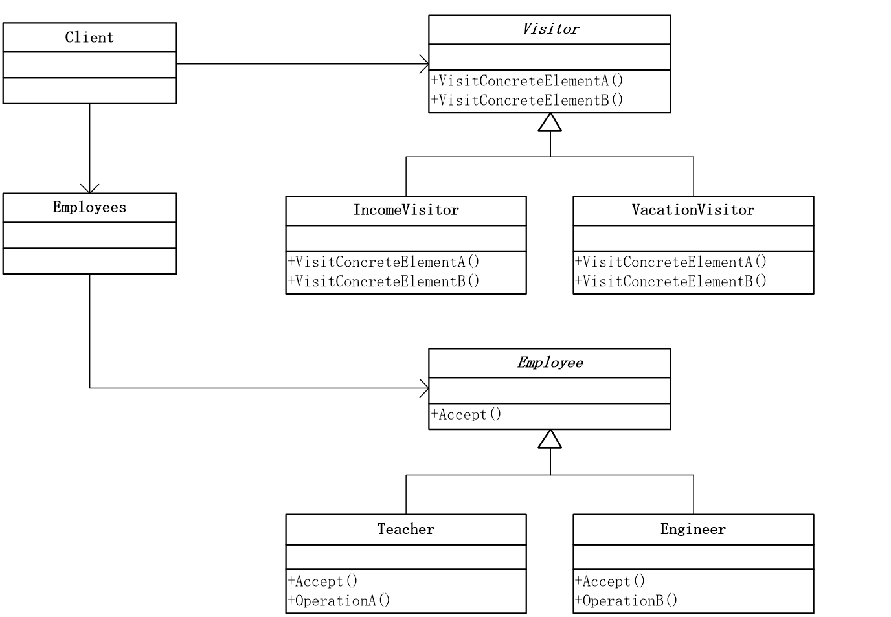
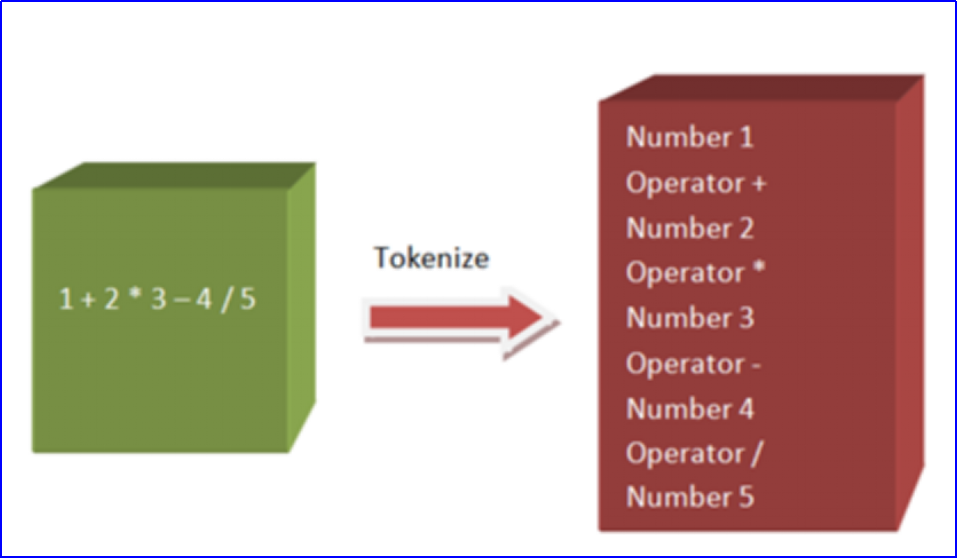
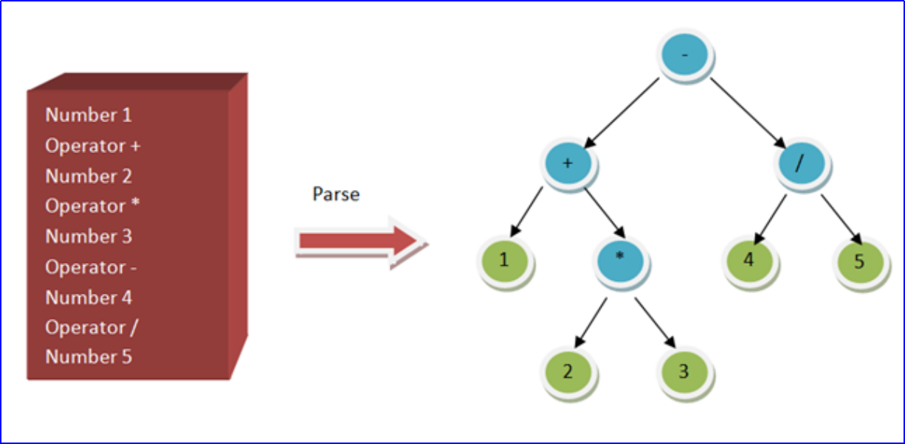
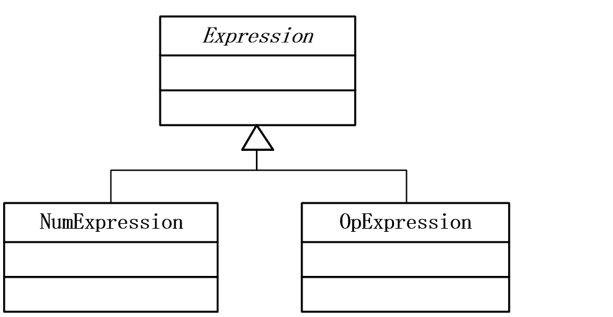
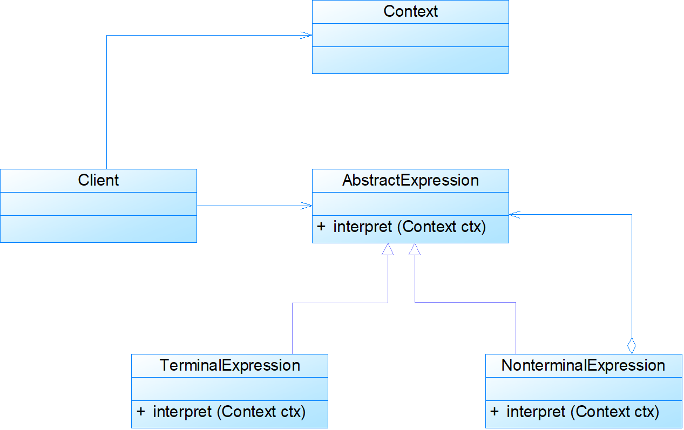

## 模板方法模式(Template Method)

定义一个操作中的算法的骨架，而将一些步骤延迟到子类中。TemplateMethod 使得子类可以不改变一个算法的结构即可重定义该算法的某些特定步骤。

### 模式背景

题目抄错，会做也白搭

```cpp
class TestPaperA
{
    //试题1
    public void TestQuestion1()
    {
        Console.WriteLine(" 杨过得到，后来给了郭靖，炼成倚天剑、屠龙刀的玄铁可能是[ ] a.球磨铸铁 b.马口铁 c.高速合金钢 d.碳素纤维 ");
        Console.WriteLine("答案：b");
    }
    //试题2
    public void TestQuestion2()
    {
        Console.WriteLine(" 杨过、程英、陆无双铲除了情花，造成[ ] a.使这种植物不再害人b.使一种珍稀物种灭绝 c.破坏了那个生物圈的生态平衡 d.造成该地区沙漠化  ");
        Console.WriteLine("答案：a");
    }
    //试题3
    public void TestQuestion3()
    {
        Console.WriteLine(" 蓝凤凰的致使华山师徒、桃谷六仙呕吐不止,如果你是大夫,会给他们开什么药[ ] a.阿司匹林 b.牛黄解毒片 c.氟哌酸 d.让他们喝大量的生牛奶 e.以上全不对   ");
        Console.WriteLine("答案：c");
    }
}

class TestPaperB
{
    //试题1
    public void TestQuestion1()
    {
        Console.WriteLine(" 杨过得到，后来给了郭靖，炼成倚天剑、屠龙刀的玄铁可能是[ ] a.球磨铸铁 b.马口铁 c.高速合金钢 d.碳素纤维 ");
        Console.WriteLine("答案：d");
    }
    //试题2
    public void TestQuestion2()
    {
        Console.WriteLine(" 杨过、程英、陆无双铲除了情花，造成[ ] a.使这种植物不再害人b.使一种珍稀物种灭绝 c.破坏了那个生物圈的生态平衡 d.造成该地区沙漠化  ");
        Console.WriteLine("答案：b");
    }
    //试题3
    public void TestQuestion3()
    {
        Console.WriteLine(" 蓝凤凰的致使华山师徒、桃谷六仙呕吐不止,如果你是大夫,会给他们开什么药[ ] a.阿司匹林 b.牛黄解毒片 c.氟哌酸 d.让他们喝大量的生牛奶 e.以上全不对   ");
        Console.WriteLine("答案：a");
    }
}

static void Main(string[] args)
{
    Console.WriteLine("学生甲的试卷：");
    TestPaperA studentA = new TestPaperA();
    studentA.TestQuestion1();
    studentA.TestQuestion2();
    studentA.TestQuestion3();

    Console.WriteLine("学生乙的试卷：");
    TestPaperB studentB = new TestPaperB();
    studentB.TestQuestion1();
    studentB.TestQuestion2();
    studentB.TestQuestion3();

    Console.Read();
}

```

学生甲和学生乙的试卷类非常类似，除了答案不同，没什么区别，如果老师修改题目，2 个类都需要修改。

```cpp
class TestPaper
{
    //试题1
    public void TestQuestion1()
    {
        Console.WriteLine(" 杨过得到，后来给了郭靖，炼成倚天剑、屠龙刀的玄铁可能是[ ] a.球磨铸铁 b.马口铁 c.高速合金钢 d.碳素纤维 ");
        Console.WriteLine("答案：b");
    }
    //试题2
    public void TestQuestion2()
    {
        Console.WriteLine(" 杨过、程英、陆无双铲除了情花，造成[ ] a.使这种植物不再害人 b.使一种珍稀物种灭绝 c.破坏了那个生物圈的生态平衡 d.造成该地区沙漠化  ");
        Console.WriteLine("答案：a");
    }
    //试题3
    public void TestQuestion3()
    {
        Console.WriteLine(" 蓝凤凰的致使华山师徒、桃谷六仙呕吐不止,如果你是大夫,会给他们开什么药[ ] a.阿司匹林 b.牛黄解毒片 c.氟哌酸 d.让他们喝大量的生牛奶 e.以上全不对   ");
        Console.WriteLine("答案：c");
    }
}

class TestPaperA : TestPaper
{
    public new void TestQuestion1()
    {
        base.TestQuestion1();
        Console.WriteLine("答案：c");
    }

    public new void TestQuestion2()
    {
        base.TestQuestion2();
        Console.WriteLine("答案：b");
    }

    public new void TestQuestion3()
    {
        base.TestQuestion3();
        Console.WriteLine("答案：a");
    }
}

class TestPaperB : TestPaper
{
    public new void TestQuestion1()
    {
        base.TestQuestion1();
        Console.WriteLine("答案：d");
    }

    public new void TestQuestion2()
    {
        base.TestQuestion2();
        Console.WriteLine("答案：c");
    }

    public new void TestQuestion3()
    {
        base.TestQuestion3();
        Console.WriteLine("答案：a");
    }
}
```

是不是可以进一步的优化？

```cpp
class TestPaper
{
    public void TestQuestion1()
    {
        Console.WriteLine(" 杨过得到，后来给了郭靖，炼成倚天剑、屠龙刀的玄铁可能是[ ] a.球磨铸铁 b.马口铁 c.高速合金钢 d.碳素纤维 ");
        Console.WriteLine("答案：" + Answer1());
    }

    protected virtual string Answer1()
    {
        return "";
    }
}

//学生甲抄的试卷
class TestPaperA : TestPaper
{
    protected override string Answer1()
    {
        return "b";
    }

    protected override string Answer2()
    {
        return "c";
    }

    protected override string Answer3()
    {
        return "a";
    }
}

//学生乙抄的试卷
class TestPaperB : TestPaper
{
    protected override string Answer1()
    {
        return "c";
    }

    protected override string Answer2()
    {
        return "a";
    }

    protected override string Answer3()
    {
        return "a";
    }
}

static void Main(string[] args)
{
    Console.WriteLine("学生甲抄的试卷：");
    TestPaper studentA = new TestPaperA();
    studentA.TestQuestion1();
    studentA.TestQuestion2();
    studentA.TestQuestion3();

    Console.WriteLine("学生乙抄的试卷：");
    TestPaper studentB = new TestPaperB();
    studentB.TestQuestion1();
    studentB.TestQuestion2();
    studentB.TestQuestion3();

    Console.Read();
}

```

### 模式动机

- 准备一个抽象类，将部分逻辑以具体方法以及具体构造函数的形式实现，然后声明一些抽象方法来迫使子类实现剩余的逻辑。不同的子类可以以不同的方式实现这些抽象方法，从而对剩余的逻辑有不同的实现。这就是模版方法模式的用意。
- 很多人可能没有想到，模版方法模式实际上是所有模式中最为常见的几个模式之一，而且很多人可能使用过模版方法模式而没有意识到自己已经使用了这个模式。模版方法模式是基于继承的代码复用的基本技术，模版方法模式的结构和用法也是面向对象设计的核心。
- 模版方法模式需要开发抽象类和具体子类的设计师之间的协作。一个设计师负责给出一个算法的轮廓和骨架，另一些设计师则负责给出这个算法的各个逻辑步骤。代表这些具体逻辑步骤的方法称做基本方法（primitive method）；而将这些基本法方法总汇起来的方法叫做模版方法（template method），这个设计模式的名字就是从此而来。

### 模式定义

定义一个操作中算法的骨架，而将一些步骤延迟到子类中。模板方法使得子类可以不改变一个算法的结构即可重定义该算法的某些特定步骤。模板方法是一种类行为型模式。

### 模式结构


- AbstractClass：抽象类
- ConcreteClass：具体子类

```cpp
public abstract class AbstractCar
{
    protected abstract string StartUp();
    protected abstract string Run();
    protected abstract string Stop();

    public void DriveOnTheRoad()
    {
        Console.WriteLine(StartUp());
        Console.WriteLine(Run());
        Console.WriteLine(Stop());
    }
}
public class BORA : AbstractCar
{
    protected override string StartUp()
    {
        return "BORA is StartUp";
    }

    protected override string Run()
    {
        return "BORA is Running";
    }

    protected override string Stop()
    {
        return "BORA is Stoped";
    }
}

static void Main(string[] args)
{
     AbstractCar car = new BORA();
     car.DriveOnTheRoad();
     Console.Read();
}

```

AbstractCar 中的 DriveOnTheRoad 方法叫做 template method（模板方法），template method 用 primitive operation 定义一个算法，是相对稳定的部分。（子类中重新定义 primitive operation）。

在这段代码中，抽象方法 StartUp、Run、Stop 叫做 primitive operation（原语操作），它们是在子类中的扩展点。

### 优缺点

- 优点
  - 模板方法模式在一个类中形式化地定义算法，而由它的子类实现细节的处理。模板方法模式的优势是，在子类定义详细的处理算法时不会改变算法的结构。
  - 模板方法是一种代码复用的基本技术，它们在类库中尤为重要，它们提取了类库中的公共行为。
  - 模板方法导致一种反向的控制结构，一个父类调用一个子类的操作，而不是相反。
- 缺点
  - 每个不同的实现都需要定义一个子类，这会导致类的个数增加，但是更加符合类职责的分配原则，使得类的内聚性得以提高。

### 模式使用

- 一次性实现一个算法的不变的部分，并将可变的行为留给子类来实现。
- 各子类中公共的行为应被提取出来并集中到一个公共父类中以避免代码重复。
- 对一些复杂的算法进行分割，将其算法中固定不变的部分设计为模板方法和父类具体方法，而一些可以改变的细节由其子类来实现。

### 模式应用

- 模板方法模式主要应用于框架设计，以确保父类控制处理流程的逻辑顺序（如框架的初始化）。
- 模板方法模式鼓励我们恰当使用继承，此模式可以用来改写一些拥有相同功能的相关类，将可复用的一般性的行为代码移到父类里面，而将特殊化的行为代码移到子类里面。这也进一步说明，虽然继承复用存在一些问题，但是在某些情况下还是可以给开发人员带来方便，模板方法模式就是体现继承优势的模式之一。
- 在模板方法模式中，子类不显式调用父类的方法，而是通过覆盖父类的方法来实现某些具体的业务逻辑，父类控制对子类的调用，这种机制被称为好莱坞原则(Hollywood Principle)，即“不要给我们打电话，我们会给你打电话(Don‘t call us, we’ll call you)”。
- 在模板方法模式中，好莱坞原则体现在：子类不需要调用父类，而通过父类来调用子类，将某些步骤的实现写在子类中，由父类来控制整个过程。

## 访问者模式(Visitor)

表示一个作用于某对象结构中的各元素的操作，它使你可以在不改变各元素的类的前提下定义作用于这些元素的新操作。

### 模式背景

学校有教师和工程师

```cpp
abstract class Employee
{
    private string name;
    private double income;
    private int vacationDays;

    public string Name
    {
        get { return name; }
        set { name = value; }
    }
    public double Income
    {
        get { return income; }
        set { income = value; }
    }
    public int VacationDays
    {
        get { return vacationDays; }
        set { vacationDays = value; }
    }
}

class Teacher : Employee
{
    public Teacher(string name, double income,int vacationDays)
    {
        Name = name;
        Income = income;
        VacationDays = vacationDays;
    }
}

class Engineer : Employee
{
    public Engineer(string name, double income,int vacationDays)
    {
        Name = name;
        Income = income;
        VacationDays = vacationDays;
    }
}

static void Main(string[] args)
{
    Teacher zhangsan = new Teacher("张三", 2500.0, 14);
    Engineer lisi    = new Engineer("李四", 3500.0, 16);

    Console.WriteLine(zhangsan.Name + "的收入是"+ zhangsan.Income +
                                ", 假期是"+ zhangsan.VacationDays);

    Console.WriteLine(lisi.Name + "的收入是" + lisi.Income +                                        ", 假期是" + lisi.VacationDays);

    Console.ReadKey();
}

```

如何批量给员工加薪，加假期？

### 模式动机

- 对于系统中的某些对象，它们存储在同一个集合中，且具有不同的类型，而且对于该集合中的对象，可以接受一类称为访问者的对象来访问，而且不同的访问者其访问方式有所不同，访问者模式为解决这类问题而诞生。
- 在实际使用时，对同一集合对象的操作并不是唯一的，对相同的元素对象可能存在多种不同的操作方式。
- 而且这些操作方式并不稳定，可能还需要增加新的操作，以满足新的业务需求。
- 此时，访问者模式就是一个值得考虑的解决方案。

### 模式定义

表示一个作用于某对象结构中的各元素的操作。它使我们可以在不改变各元素的类的前提下定义作用于这些元素的新操作。访问者模式是一种对象行为型模式。

### 模式结构


- Vistor：抽象访问者
- ConcreteVisitor：具体访问者
- Element：抽象元素
- ConcreteElement：具体元素
- ObjectStructure：对象结构



```cpp
abstract class Employee
{
    private string name;
    private double income;
    private int vacationDays;

    public string Name
    {
        get { return name; }
        set { name = value; }
    }
    public double Income
    {
        get { return income; }
        set { income = value; }
    }
    public int VacationDays
    {
        get { return vacationDays; }
        set { vacationDays = value; }
    }

    abstract public void Accept(Visitor visitor);
}
class Teacher : Employee
{
    public Teacher(string name, double income,int vacationDays)
    {
        Name = name;
        Income = income;
        VacationDays = vacationDays;
    }
    public override void Accept(Visitor visitor)
    {
        visitor.Visit(this);
    }
}
class Engineer : Employee
{
    public Engineer(string name, double income,int vacationDays)
    {
        Name = name;
        Income = income;
        VacationDays = vacationDays;
    }
    public override void Accept(Visitor visitor)
    {
        visitor.Visit(this);
    }
}

abstract class Visitor
{
    abstract public void Visit(Employee element);
}

class IncomeVisitor : Visitor
{
    public override void Visit(Employee element)
    {
        element.Income *= 1.10;
        Console.WriteLine(element.Name + "的新工资是: " + element.Income);
    }
}

class VacationVisitor : Visitor
{
    public override void Visit(Employee element)
    {
        element.VacationDays += 3;
        Console.WriteLine(element.Name + "的新假期是" + element.VacationDays);
    }
}

class Employees
{
    private ArrayList employees = new ArrayList();
    public void Attach(Employee employee)
    {
        employees.Add(employee);
    }
    public void Detach(Employee employee)
    {
        employees.Remove(employee);
    }
    public void Accept(Visitor visitor)
    {
        foreach (Employee e in employees)
            e.Accept(visitor);
    }
}

static void Main(string[] args)
{
    Teacher zhangsan = new Teacher("张三", 2500.0, 14);
    Engineer lisi    = new Engineer("李四", 3500.0, 16);

    Employees e = new Employees();
    e.Attach(zhangsan);
    e.Attach(lisi);

    IncomeVisitor v1 = new IncomeVisitor();
    VacationVisitor v2 = new VacationVisitor();

    e.Accept(v1);
    e.Accept(v2);
    Console.Read();
}

```

### 优缺点

- 优点
  - 使得增加新的操作变得很容易。如果一些操作依赖于一个复杂的结构对象的话，那么一般而言，增加新的操作会很复杂。而使用访问者模式，增加新的操作就意味着增加一个新的访问者类，因此将变得很容易。
  - 将有关的行为集中到一个访问者对象中，而不是分散到一个个的节点类中。
  - 可以跨过几个类的等级结构访问属于不同的等级结构的成员类。
- 缺点
  - 破坏封装。访问者模式要求访问者对象访问并调用每一个节点对象的操作，这隐含了一个对所有节点对象的要求：它们必须暴露一些自己的操作和内部状态。不然，访问者的访问就变得没有意义。由于访问者对象自己会积累访问操作所需的状态，从而使这些状态不再存储在节点对象中，这也是破坏封装的。
  - 增加新的节点类变得很困难。每增加一个新的节点都意味着要在抽象访问者角色中增加一个新的抽象操作，并在每一个具体访问者类中增加相应的具体操作。

### 模式使用

- 定义对象结构的类很少改变，但经常需要在此结构上定义新的操作。
- 对象需要添加很多不同的并且不相关的操作，而我们想避免让这些操作“污染”这些对象的类。访问者模式使得我们可以将相关的操作集中起来定义在一个类中。当该对象结构被很多应用共享时，用访问者模式让每个应用仅包含需要用到的操作。

### 模式应用

- 访问者模式中对象结构存储了不同类型的元素对象，以供不同访问者访问。访问者模式包括两个层次结构，一个是访问者层次结构，提供了抽象访问者和具体访问者，一个是元素层次结构，提供了抽象元素和具体元素。相同的访问者可以以不同的方式访问不同的元素，相同的元素可以接受不同访问者以不同访问方式访问。
- 在访问者模式中，增加新的访问者无须修改原有系统，系统具有较好的可扩展性。

### 模式小结

访问者模式的主要优点在于使得增加新的访问操作变得很容易，将有关元素对象的访问行为集中到一个访问者对象中，而不是分散到一个个的元素类中，还可以跨过类的等级结构访问属于不同的等级结构的元素类，让用户能够在不修改现有类层次结构的情况下，定义该类层次结构的操作；其主要缺点在于增加新的元素类很困难，而且在一定程度上破坏系统的封装性。

## 解释器模式(Interpreter)

给定一个语言，定义它的文法的一种表示，并定义一个解释器，这个解释器使用该表示来解释语言中的句子。

### 模式背景

设计与实现一个四则算术运算解释器

- 可以分析任意+、-、\*、/表达式，并计算其数值
- 输入表达式为一个字符串表达式
- 输出结果为双精度浮点数(Double)

输入是一个用字符串表达的四则运算，比如 1 + 2 \* 3 。目的是试图去理解这个字符串表达的运算指令，然后计算出结果 7。之所以是一个解释器 Interpreter，而不是一个编译器 Compiler，是因为程序是去理解指令并且执行指令，而不是把指令编译成机器代码来运行；后者是编译器的目标。

第一个部分，是截取输入字符串，然后返回单元指令。比如，对于指令 1 + 2 \* 3 – 4 / 5，就需要被分解成如下所示的单元指令集：



第二个部分，把单元指令集组成一个树结构，称之为 Abstract Syntax Tree。按照将来需要解释的顺序，优先执行的指令放在树的叶的位置，最后执行的指令是树根 Root。



程序只有 2 种单元指令：操作数 NumExpression 和 运算符 OpExpression 。

定义了一个抽象类，叫做 Expression，然后 NumExpression 和 OpExpression 继承了该抽象类。



```cpp
abstract class Expression
{
    abstract public double Interpreter(Syntax root);
}

class NumExpression : Expression
{
    private double _value;

    public NumExpression(double value)
    {
        this._value = value;
    }
    public double Value
    {
        get { return this._value; }
    }
    public override double Interpreter(Syntax root)
    {
        return ((NumExpression)(root.Expression)).Value;
    }
}

enum Op : int
{
    Plus = '+',
    Minus = '-',
    Multiply = '*',
    Divide = '/'
}
enum Prioirty
{
    Lv2 = 2,
    Lv1 = 1,
    Lv0 = 0
}

class OpExpression : Expression
{
    private Op _value;
    ……
    public override double Interpreter(Syntax root)
    {
        double lvalue, rvalue;
        if (root.LeftChild == null)
            lvalue = 0;
        else
            lvalue = ((Expression)root.LeftChild.Expression).Interpreter(root.LeftChild);

        if (root.RightChild == null)
            rvalue = 0;
        else
            rvalue = ((Expression)root.RightChild.Expression).Interpreter(root.RightChild);
        switch (((OpExpression)root.Expression).Value)
        {
            case Op.Plus:
                return lvalue + rvalue;
            case Op.Minus:
                return lvalue - rvalue;
            case Op.Multiply:
                return lvalue * rvalue;
            case Op.Divide:
                return lvalue / rvalue;
            default:
                return 0;
        }
    }
}

class Syntax
{
    private Expression _Expression;
    private Syntax _left;
    private Syntax _right;
    public Syntax(Expression Expression)
    {
        this._Expression = Expression;
        this._left = null;
        this._right = null;
    }
    public Expression Expression
    {
        get { return this._Expression; }
    }
    public Syntax LeftChild
    {
        get { return this._left; }
        set { this._left = value; }
    }
    public Syntax RightChild
    {
        get { return this._right; }
        set { this._right = value; }
    }
}

class SyntaxTree
{
    private Syntax _root;
    private int _count;

    public SyntaxTree()
    {
        this._root = null;
        this._count = 0;
    }
    public Syntax Root
    {
        get { return this._root; }
    }
    public void Append(Expression Expression)
    {
        this._root = this.Append(this._root, Expression);
        this._count++;
    }
    private Syntax Append(Syntax root, Expression Expression)
    {
        ……
    }
}

class Interpreter
{
    private Expressionizer Expressionizer = new Expressionizer();

    public SyntaxTree Eval(String expr)
    {
        Expression[] Expressions = Expressionizer.Parse(expr);
        SyntaxTree astree = new SyntaxTree();

        foreach (Expression Expression in Expressions)
        {
            astree.Append(Expression);
        }
        return astree;
    }
}

```

### 模式动机

- 如果在系统中某一特定类型的问题发生的频率很高，此时可以考虑将这些问题的实例表述为一个语言中的句子，因此可以构建一个解释器，该解释器通过解释这些句子来解决这些问题。
- 解释器模式描述了如何构成一个简单的语言解释器，主要应用在使用面向对象语言开发的编译器中。

### 模式定义

定义语言的文法，并且建立一个解释器来解释该语言中的句子，这里的“语言”意思是使用规定格式和语法的代码，它是一种类行为型模式。

### 模式结构



- AbstractExpression: 抽象表达式
- TerminalExpression: 终结符表达式
- NonterminalExpression: 非终结符表达式
- Context: 环境类
- Client: 客户类

### 模式分析

解释器模式描述了如何为简单的语言定义一个文法，如何在该语言中表示一个句子，以及如何解释这些句子。

文法规则实例：

- expression ::= value | symbol
- symbol ::= expression '+' expression | expression '-‘
- value ::= an integer //一个整数值
- 在文法规则定义中可以使用一些符号来表示不同的含义，如使用“|”表示或，使用“{”和“}”表示组合，使用“\*”表示出现 0 次或多次等。

抽象语法树：

除了使用文法规则来定义一个语言，在解释器模式中还可以通过一种称之为抽象语法树(Abstract Syntax Tree, AST)的图形方式来直观地表示语言的构成，每一棵抽象语法树对应一个语言实例。

- 抽象语法树描述了如何构成一个复杂的句子，通过对抽象语法树的分析，可以识别出语言中的终结符和非终结符类。
- 在解释器模式中，每一种终结符和非终结符都有一个具体类与之对应，正因为使用类来表示每一个语法规则，使得系统具有较好的扩展性和灵活性。

### 优缺点

- 优点
  - 易于改变和扩展文法。
  - 易于实现文法。
  - 增加了新的解释表达式的方式。
- 缺点
  - 对于复杂文法难以维护。
  - 执行效率较低。
  - 应用场景很有限。

### 模式使用

- 可以将一个需要解释执行的语言中的句子表示为一个抽象语法树。
- 一些重复出现的问题可以用一种简单的语言来进行表达。
- 文法较为简单。
- 效率不是关键问题。

### 模式应用

- 解释器模式在使用面向对象语言实现的编译器中得到了广泛的应用，如 Smalltalk 语言的编译器。
- 目前有一些基于 Java 抽象语法树的源代码处理工具，如在 Eclipse 中就提供了 Eclipse AST，它是 Eclipse JDT 的一个重要组成部分，用来表示 Java 语言的语法结构，用户可以通过扩展其功能，创建自己的文法规则。
- 可以使用解释器模式，通过 C++、Java、C#等面向对象语言开发简单的编译器，如数学表达式解析器、正则表达式解析器等，用于增强这些语言的功能，使之增加一些新的文法规则，用于解释一些特定类型的语句。
- 在实际项目开发中如果需要解析数学公式，无须再运用解释器模式进行设计，可以直接使用一些第三方解析工具包，它们可以统称为数学表达式解析器(Math Expression Parser, MEP)，如 Expression4J、Jep、JbcParser、Symja、Math Expression String Parser(MESP)等来取代解释器模式，它们可以方便地解释一些较为复杂的文法，功能强大，且使用简单，效率较好。
- Expression4J：Expression4J 是一个基于 Java 的开源框架，它用于对数学表达式进行操作，是一个数学公式解析器，在 Expression4J 中可以将数学表达式存储在字符串对象中。Expression4J 是高度定制的，用户可以自定义文法，其主要功能包括实数和复数的基本数学运算，支持基本数学函数、复杂函数以及用户使用 Java 语言自定义的函数和文法，还可以定义函数目录（函数集）、支持 XML 配置文件等。

### 模式总结

- 解释器模式定义语言的文法，并且建立一个解释器来解释该语言中的句子，这里的“语言”意思是使用规定格式和语法的代码，它是一种类行为型模式。
- 解释器模式描述了如何为简单的语言定义一个文法，如何在该语言中表示一个句子，以及如何解释这些句子。
- 解释器模式主要包含如下四个角色：在抽象表达式中声明了抽象的解释操作，它是所有的终结符表达式和非终结符表达式的公共父类；终结符表达式是抽象表达式的子类，它实现了与文法中的终结符相关联的解释操作；非终结符表达式也是抽象表达式的子类，它实现了文法中非终结符的解释操作；环境类又称为上下文类，它用于存储解释器之外的一些全局信息。
- 对于一个简单的语言可以使用一些文法规则来进行定义，还可以通过抽象语法树的图形方式来直观地表示语言的构成，每一棵抽象语法树对应一个语言实例。
- 解释器模式的主要优点包括易于改变和扩展文法，易于实现文法并增加了新的解释表达式的方式；其主要缺点是对于复杂文法难以维护，执行效率较低且应用场景很有限。
- 解释器模式适用情况包括：可以将一个需要解释执行的语言中的句子表示为一个抽象语法树；一些重复出现的问题可以用一种简单的语言来进行表达；文法较为简单且效率不是关键问题。
