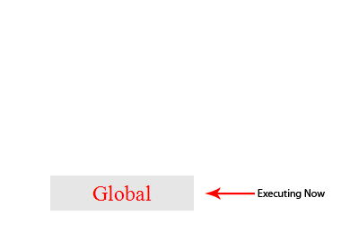
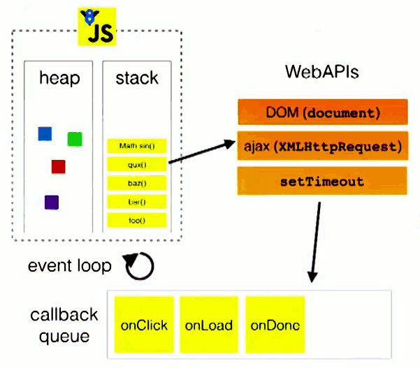

# 背景

我们都知道，javascript 从诞生之日起就是一门单线程的非阻塞的脚本语言。这是由其最初的用途来决定的：与浏览器交互。

单线程意味着 javascript 代码在执行的任何时候，都只有一个主线程来处理所有的任务。

而非阻塞则是当代码需要进行一项异步任务（无法立刻返回结果，需要花一定时间才能返回的任务，如 I/O 事件）的时候，主线程会挂起（pending）这个任务，然后在异步任务返回结果的时候再根据一定规则去执行相应的回调。

单线程是必要的，也是 javascript 这门语言的基石，原因之一在最主要的执行环境浏览器中，我们需要进行各种各样的 dom 操作。试想一下如果 javascript 是多线程的，那么当两个线程同时对 dom 进行一项操作，例如一个向其添加事件，而另一个删除了这个 dom，此时该如何处理呢？因此，为了保证不会发生类似于这个例子中的情景，javascript 选择只用一个主线程来执行代码，这样就保证了程序执行的一致性。

当然，现如今人们也意识到，单线程在保证了执行顺序的同时也限制了 javascript 的效率，因此开发出了 web worker 技术，这项技术号称让 javascript 成为一门多线程语言。

然而，使用 web worker 技术的多线程有着诸多限制，例如所有新线程都受主线程的完全控制，不能独立执行。这意味着这些“线程” 实际上应属于主线程的子线程。另外，这些子线程并没有执行 I/O 操作的权限，只能为主线程分担一些诸如计算等任务。所以严格来讲这些线程并没有完整的功能，也因此这项技术并非改变了 javascript 语言的单线程本质。

可以预见，未来的 javascript 也会一直是一门单线程的语言。

话说回来，前面提到 javascript 的另一个特点是“非阻塞”，那么 javascript 引擎到底是如何实现的这一点呢？答案就是今天这篇文章的主角——event loop（事件循环）。

> 注：虽然 nodejs 中的也存在与传统浏览器环境下的相似的事件循环。然而两者间却有着诸多不同，故把两者分开，单独解释。

# 浏览器事件循环

## 执行栈与事件队列

当 javascript 代码执行的时候会将不同的变量存于内存中的不同位置：堆（heap）和栈（stack）中来加以区分。其中，堆里存放着一些对象，而栈中则存放着一些基础类型变量以及对象的指针，但是我们这里说的执行栈和上面这个栈的意义却有些不同。

我们知道，当我们调用一个方法的时候，js 会生成一个与这个方法对应的执行环境（context），又叫执行上下文。这个执行环境中存在着这个方法的私有作用域，上层作用域的指向，方法的参数，这个作用域中定义的变量以及这个作用域的 this 对象。 而当一系列方法被依次调用的时候，因为 js 是单线程的，同一时间只能执行一个方法，于是这些方法被排队在一个单独的地方，这个地方被称为执行栈。

当一个脚本第一次执行的时候，js 引擎会解析这段代码，并将其中的同步代码按照执行顺序加入执行栈中，然后从头开始执行。如果当前执行的是一个方法，那么 js 会向执行栈中添加这个方法的执行环境，然后进入这个执行环境继续执行其中的代码。当这个执行环境中的代码执行完毕并返回结果后，js 会退出这个执行环境并把这个执行环境销毁，回到上一个方法的执行环境。这个过程反复进行，直到执行栈中的代码全部执行完毕。

下面这个图片非常直观的展示了这个过程，其中的 global 就是初次运行脚本时向执行栈中加入的代码：



从图片可知，一个方法执行会向执行栈中加入这个方法的执行环境，在这个执行环境中还可以调用其他方法，甚至是自己，其结果不过是在执行栈中再添加一个执行环境。这个过程可以是无限进行下去的，除非发生了栈溢出，即超过了所能使用内存的最大值。

以上的过程说的都是同步代码的执行，那么当一个异步代码（如发送 ajax 请求数据）执行后会如何呢？前文提过，js 的另一大特点是非阻塞，实现这一点的关键在于下面要说的这项机制——事件队列（Task Queue）。

js 引擎遇到一个异步事件后并不会一直等待其返回结果，而是会将这个事件挂起，继续执行执行栈中的其他任务。当一个异步事件返回结果后，js 会将这个事件加入与当前执行栈不同的另一个队列，我们称之为事件队列。被放入事件队列不会立刻执行其回调，而是等待当前执行栈中的所有任务都执行完毕，主线程处于闲置状态时，主线程会去查找事件队列是否有任务。如果有，那么主线程会从中取出排在第一位的事件，并把这个事件对应的回调放入执行栈中，然后执行其中的同步代码，如此反复，这样就形成了一个无限的循环，这个过程被称为“事件循环（Event Loop）”。

这里还有一张图来展示这个过程：



图中的 stack 表示我们所说的执行栈，web apis 则是代表一些异步事件，而 callback queue 即事件队列。

## macro task 与 micro task

以上的事件循环过程是一个宏观的表述，实际上因为异步任务之间并不相同，因此他们的执行优先级也有区别。不同的异步任务被分为两类：微任务（micro task）和宏任务（macro task）。

以下事件属于宏任务：

- setInterval()
- setTimeout()

以下事件属于微任务

- new Promise()
- new MutationObserver()

前面我们介绍过，在一个事件循环中，异步事件返回结果后会被放到一个任务队列中。然而，根据这个异步事件的类型，这个事件实际上会进入对应的宏任务队列或者微任务队列中。并且在当前执行栈为空的时候，主线程会查看微任务队列是否有事件存在。如果不存在，那么再去宏任务队列中取出一个事件并把对应的加入当前执行栈；如果存在，则会依次执行队列中事件对应的回调，直到微任务队列为空，然后去宏任务队列中取出最前面的一个事件，把对应的回调加入当前执行栈，如此反复，进入循环。

我们只需记住当前执行栈执行完毕时会立刻先处理所有微任务队列中的事件，然后再去宏任务队列中取出一个事件。同一次事件循环中，微任务永远在宏任务之前执行。

这样就能解释下面这段代码的结果：

```js
setTimeout(function() {
  console.log(1);
});

new Promise(function(resolve, reject) {
  console.log(2);
  resolve(3);
}).then(function(val) {
  console.log(val);
});
```

结果为：

```
2
3
1
```

# node 事件循环

## 与浏览器环境的不同

在 node 中，事件循环表现出的状态与浏览器中大致相同。不同的是 node 中有一套自己的模型。node 中事件循环的实现是依靠的 libuv 引擎。我们知道 node 选择 chrome v8 引擎作为 js 解释器，v8 引擎将 js 代码分析后去调用对应的 node api，而这些 api 最后则由 libuv 引擎驱动，执行对应的任务，并把不同的事件放在不同的队列中等待主线程执行。因此实际上 node 中的事件循环存在于 libuv 引擎中。

## 事件循环模型

下面是一个 libuv 引擎中的事件循环的模型:

```
 ┌───────────────────────┐
┌─>│        timers         │
│  └──────────┬────────────┘
│  ┌──────────┴────────────┐
│  │     I/O callbacks     │
│  └──────────┬────────────┘
│  ┌──────────┴────────────┐
│  │     idle, prepare     │
│  └──────────┬────────────┘      ┌───────────────┐
│  ┌──────────┴────────────┐      │   incoming:   │
│  │         poll          │<──connections───     │
│  └──────────┬────────────┘      │   data, etc.  │
│  ┌──────────┴────────────┐      └───────────────┘
│  │        check          │
│  └──────────┬────────────┘
│  ┌──────────┴────────────┐
└──┤    close callbacks    │
   └───────────────────────┘
```

> 注：模型中的每一个方块代表事件循环的一个阶段

这个模型是 node 官网上的一篇文章中给出的，下面的解释也都来源于这篇文章。

## 事件循环各阶段详解

从上面这个模型中，我们可以大致分析出 node 中的事件循环的顺序：

外部输入数据 --> 轮询阶段(poll) --> 检查阶段(check) --> 关闭事件回调阶段(close callback) --> 定时器检测阶段(timer) --> I/O 事件回调阶段(I/O callbacks) --> 闲置阶段(idle, prepare) --> 轮询阶段

以上各阶段的名称是根据我个人理解的翻译，为了避免错误和歧义，下面解释的时候会用英文来表示这些阶段。

这些阶段大致的功能如下：

- timers: 这个阶段执行定时器队列中的回调如 setTimeout() 和 setInterval()。
- I/O callbacks: 这个阶段执行几乎所有的回调，但是不包括 close 事件，定时器和 setImmediate() 的回调。
- idle, prepare: 这个阶段仅在内部使用，可以不必理会。
- poll: 等待新的 I/O 事件，node 在一些特殊情况下会阻塞在这里。
- check: setImmediate() 的回调会在这个阶段执行。
- close callbacks: 例如 socket.on('close', ...) 这种 close 事件的回调。

下面我们来按照代码第一次进入 libuv 引擎后的顺序来详细解说这些阶段：

### poll 阶段

当 v8 引擎将 js 代码解析传入 libuv 引擎后，循环首先进入 poll 阶段。poll 阶段的执行逻辑如下：先查看 poll queue 中是否有事件，有任务就按先进先出的顺序依次执行回调。当 queue 为空时，会检查是否有 setImmediate() 的 callback，如果有就进入 check 阶段执行这些 callback。但同时也会检查是否有到期的 timer，如果有，就把这些到期的 timer 的 callback 按照调用顺序放到 timer queue 中，之后循环会进入 timer 阶段执行 queue 中的 callback。这两者的顺序是不固定的，受到代码运行的环境的影响。如果两者的 queue 都是空的，那么 loop 会在 poll 阶段停留，直到有一个 i/o 事件返回，循环会进入 i/o callback 阶段并立即执行这个事件的 callback。

值得注意的是，poll 阶段在执行 poll queue 中的回调时实际上不会无限的执行下去，有两种情况 poll 阶段会终止执行 poll queue 中的下一个回调：

1. 所有回调执行完毕。
2. 执行数超过了 node 的限制。

### check 阶段

check 阶段专门用来执行 setImmediate() 方法的回调，当 poll 阶段进入空闲状态，并且 setImmediate queue 中有 callback 时，事件循环进入这个阶段。

### close 阶段

当一个 socket 连接或者一个 handle 被突然关闭时（例如调用了 socket.destroy() 方法），close 事件会被发送到这个阶段执行回调，否则事件会用 process.nextTick() 方法发送出去。

### timer 阶段

这个阶段以先进先出的方式执行所有到期的加入 timer 队列里的 callback，一个 timer callback 指得是一个通过 setTimeout 或者 setInterval 函数设置的回调函数。

### I/O callback 阶段

如上文所言，这个阶段主要执行大部分 I/O 事件的回调，包括一些为操作系统执行的回调。例如一个 TCP 连接错误时，系统需要执行回调来获得这个错误的报告。

## process.nextTick()

尽管没有提及，但是实际上 node 中存在着一个特殊的队列，即 nextTick queue。这个队列中的回调执行虽然没有被表示为一个阶段，当时这些事件却会在每一个阶段执行完毕准备进入下一个阶段时优先执行。当事件循环准备进入下一个阶段之前，会先检查 nextTick queue 中是否有任务，如果有，那么会先清空这个队列。与执行 poll queue 中的任务不同的是，这个操作在队列清空前是不会停止的。这也就意味着，错误的使用 process.nextTick() 方法会导致 node 进入一个死循环，直到内存泄漏。

那么怎么使用这个方法比较合适呢？下面有一个例子：

```js
const server = net.createServer(() => {}).listen(8080);

server.on('listening', () => {});
```

这个例子中当 listen 方法被调用时，除非端口被占用，否则会立刻绑定在对应的端口上。这意味着此时这个端口可以立刻触发 listening 事件并执行其回调。然而，这时候 `on('listening')` 还没有将 callback 设置好，自然没有 callback 可以执行。为了避免出现这种情况，node 会在 listen 事件中使用 process.nextTick()方法，确保事件在回调函数绑定后被触发。

## setTimeout() 和 setImmediate()

在三个方法中，这两个方法最容易被弄混。实际上，某些情况下这两个方法的表现也非常相似。然而实际上，这两个方法的意义却大为不同。

setTimeout() 方法是定义一个回调，并且希望这个回调在我们所指定的时间间隔后第一时间去执行。注意这个“第一时间执行”，这意味着，受到操作系统和当前执行任务的诸多影响，该回调并不会在我们预期的时间间隔后精准的执行。执行的时间存在一定的延迟和误差，这是不可避免的。node 会在可以执行 timer 回调的第一时间去执行你所设定的任务。

setImmediate() 方法从意义上将是立刻执行的意思，但是实际上它却是在一个固定的阶段才会执行回调，即 poll 阶段之后。有趣的是，这个名字的意义和之前提到过的 process.nextTick() 方法才是最匹配的。node 的开发者们也清楚这两个方法的命名上存在一定的混淆，他们表示不会把这两个方法的名字调换过来---因为有大量的 node 程序使用着这两个方法，调换命名所带来的好处与它的影响相比不值一提。

setTimeout() 和不设置时间间隔的 setImmediate() 表现上及其相似。猜猜下面这段代码的结果是什么？

```js
setTimeout(() => {
  console.log('timeout');
}, 0);

setImmediate(() => {
  console.log('immediate');
});
```

实际上，答案是不一定。没错，就连 node 的开发者都无法准确的判断这两者的顺序谁前谁后。这取决于这段代码的运行环境。运行环境中的各种复杂的情况会导致在同步队列里两个方法的顺序随机决定。但是，在一种情况下可以准确判断两个方法回调的执行顺序，那就是在一个 I/O 事件的回调中。下面这段代码的顺序永远是固定的：

```js
const fs = require('fs');

fs.readFile(__filename, () => {
  setTimeout(() => {
    console.log('timeout');
  }, 0);
  setImmediate(() => {
    console.log('immediate');
  });
});
```

答案永远是：

```
immediate
timeout
```

因为在 I/O 事件的回调中，setImmediate 方法的回调永远在 timer 的回调前执行。
