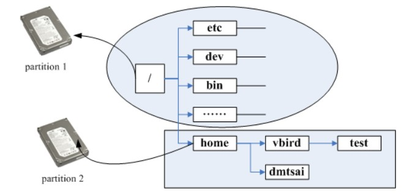
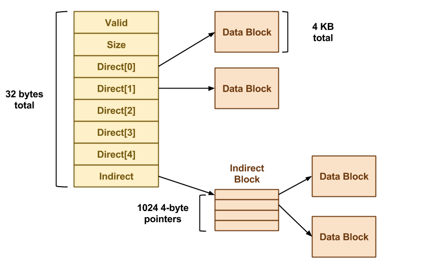
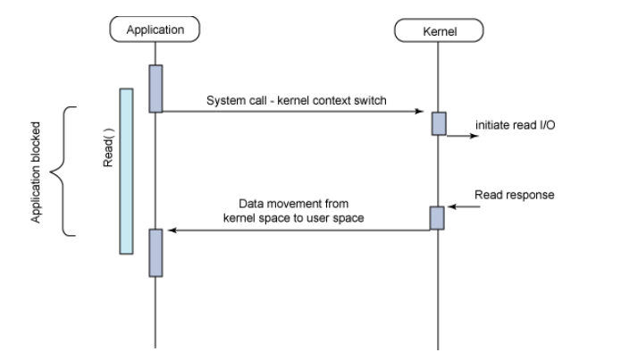
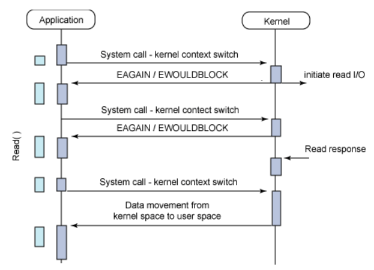
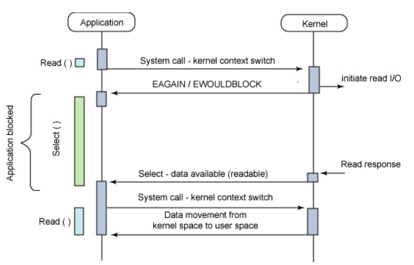
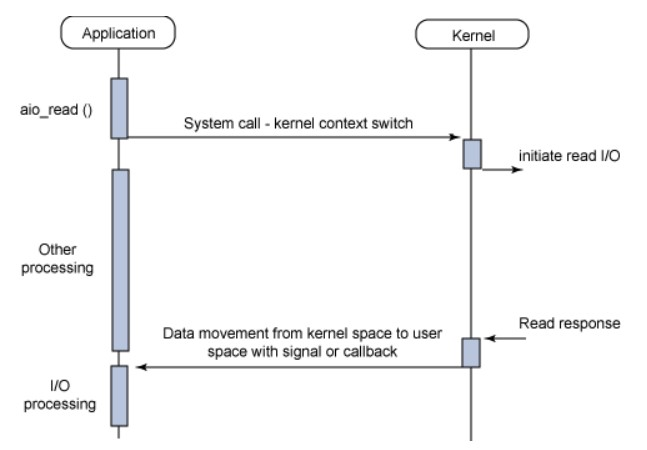

# 常用操作以及概念

## 求助

### 1. help

指令的基本用法与选项介绍。

### 2. man

man 是 manual 的缩写，将指令的具体信息显示出来。

当执行 man date 时，有 DATE(1) 出现，其中的数字代表指令的类型，常用的数字及其类型如下：

| 代号 | 类型                                            |
| :--: | ----------------------------------------------- |
|  1   | 用户在 shell 环境中可以操作的指令或者可执行文件 |
|  5   | 配置文件                                        |
|  8   | 系统管理员可以使用的管理指令                    |

### 3. info

info 与 man 类似，但是 info 将文档分成一个个页面，每个页面可以进行跳转。

## 关机

### 1. sync

为了加快对磁盘文件的读写速度，位于内存中的文件数据不会立即同步到磁盘上，因此关机之前需要先进行 sync 同步操作。

### 2. shutdown

```bash
# /sbin/shutdown [-krhc] [时间] [警告讯息]
-k ： 不会关机，只是发送警告讯息，通知所有在线的用户
-r ： 将系统的服务停掉后就重新启动
-h ： 将系统的服务停掉后就立即关机
-c ： 取消已经在进行的 shutdown 指令内容
```

### 3. 其它关机指令

reboot、halt、poweroff。

## PATH

可以在环境变量 PATH 中声明可执行文件的路径，路径之间用 : 分隔。

```html
/usr/local/bin:/usr/bin:/usr/local/sbin:/usr/sbin:/home/dmtsai/.local/bin:/home/dmtsai/bin
```

## 运行等级

- 0：关机模式
- 1：单用户模式（可用于破解 root 密码）
- 2：无网络支持的多用户模式
- 3：有网络支持的多用户模式（文本模式，工作中最常用的模式）
- 4：保留，未使用
- 5：有网络支持的 X-windows 多用户模式（桌面）
- 6：重新引导系统，即重启

## sudo

使用 sudo 允许一般用户使用 root 可执行的命令，只有在 /etc/sudoers 配置文件中添加的用户才能使用该指令。

```bash
# User privilege specification
root    ALL=(ALL:ALL) ALL
towavephone ALL=(ALL:ALL) ALL
```

## GNU

GNU 计划，译为革奴计划，它的目标是创建一套完全自由的操作系统，称为 GNU，其内容软件完全以 GPL 方式发布。其中 GPL 全称为 GNU 通用公共许可协议，包含了以下内容：

- 以任何目的运行此程序的自由；
- 再复制的自由；
- 改进此程序，并公开发布改进的自由。

## 包管理工具

RPM 和 DPKG 为最常见的两类软件包管理工具。RPM 全称为 Redhat Package Manager，最早由 Red Hat 公司制定实施，随后被 GNU 开源操作系统接受并成为很多 Linux 系统 (RHEL) 的既定软件标准。与 RPM 进行竞争的是基于 Debian 操作系统 (UBUNTU) 的 DEB 软件包管理工具－ DPKG，全称为 Debian Package，功能方面与 RPM 相似。

YUM 基于 RPM 包管理工具，具有依赖管理功能，并具有软件升级的功能。

## 发行版

Linux 发行版是 Linux 内核及各种应用软件的集成版本。

| 基于的包管理工具 | 商业发行版 | 社区发行版      |
| ---------------- | ---------- | --------------- |
| DPKG             | Ubuntu     | Debian          |
| RPM              | Red Hat    | Fedora / CentOS |

## VIM 三个模式

- 一般指令模式（Command mode）：进入 VIM 的默认模式，可以用于移动游标查看内容；
- 编辑模式（Insert mode）：按下 "i" 等按键之后进入，可以对文本进行编辑；
- 指令列模式（Bottom-line mode）：按下 ":" 按键之后进入，用于保存退出等操作。


在指令列模式下，有以下命令用于离开或者保存文件。

| 命令 | 作用                                                                   |
| :--: | ---------------------------------------------------------------------- |
|  :w  | 写入磁盘                                                               |
| :w!  | 当文件为只读时，强制写入磁盘。到底能不能写入，与用户对该文件的权限有关 |
|  :q  | 离开                                                                   |
| :q!  | 强制离开不保存                                                         |
| :wq  | 写入磁盘后离开                                                         |
| :wq! | 强制写入磁盘后离开                                                     |

# 分区

## 磁盘的文件名

Linux 中每个硬件都被当做一个文件，包括磁盘。常见磁盘的文件名如下：

- SCSI/SATA/USB 磁盘：/dev/sd[a-p]
- IDE 磁盘：/dev/hd[a-d]

其中文件名后面的序号的确定与磁盘插入的顺序有关，而与磁盘所插入的插槽位置无关。

## 分区表

磁盘分区表主要有两种格式，一种是限制较多的 MBR 分区表，一种是较新且限制较少的 GPT 分区表。

### 1. MBR

MBR 中，第一个扇区最重要，里面有主要开机记录（Master boot record, MBR）及分区表（partition table），其中 MBR 占 446 bytes，分区表占 64 bytes。

分区表只有 64 bytes，最多只能存储 4 个分区，这 4 个分区为主分区（Primary）和扩展分区（Extended）。其中扩展分区只有一个，它将其它空间用来记录分区表，因此通过扩展分区可以分出更多分区，这些分区称为逻辑分区。

Linux 也把分区当成文件，分区文件的命名方式为：磁盘文件名 + 编号，例如 /dev/sda1。注意，逻辑分区的编号从 5 开始。

### 2. GPT

不同的磁盘有不同的扇区大小，例如 512 bytes 和最新磁盘的 4 k。GPT 为了兼容所有磁盘，在定义扇区上使用逻辑区块地址（Logical Block Address, LBA）。

GPT 第 1 个区块记录了 MBR，紧接着是 33 个区块记录分区信息，并把最后的 33 个区块用于对分区信息进行备份。

GPT 没有扩展分区概念，都是主分区，最多可以分 128 个分区。


## 开机检测程序

### 1. BIOS

BIOS 是开机的时候计算机执行的第一个程序，这个程序知道可以开机的磁盘，并读取磁盘第一个扇区的 MBR，由 MBR 执行其中的开机管理程序，这个开机管理程序会加载操作系统的核心文件。

MBR 中的开机管理程序提供以下功能：选单、载入核心文件以及转交其它开机管理程序。转交这个功能可以用来实现了多重引导，只需要将另一个操作系统的开机管理程序安装在其它分区的启动扇区上，在启动 MBR 中的开机管理程序时，就可以选择启动当前的操作系统或者转交给其它开机管理程序从而启动另一个操作系统。

安装多重引导，最好先安装 Windows 再安装 Linux。因为安装 Windows 时会覆盖掉 MBR，而 Linux 可以选择将开机管理程序安装在 MBR 或者其它分区的启动扇区，并且可以设置开机管理程序的选单。


### 2. UEFI

UEFI 相比于 BIOS 来说功能更为全面，也更为安全。

## 挂载

挂载利用目录作为分区的进入点，也就是说，进入目录之后就可以读取分区的数据。



# 文件

## 文件权限概念

把用户分为三种：文件拥有者、群组以及其它人，对不同的用户有不同的文件权限。

使用 ls 查看一个文件时，会显示一个文件的信息，例如 `drwxr-xr-x. 3 root root 17 May 6 00:14 .config`，对这个信息的解释如下：

- drwxr-xr-x：文件类型以及权限，第 1 位为文件类型字段，后 9 位为文件权限字段。
- 3：链接数；
- root：文件拥有者；
- root：所属群组；
- 17：文件大小；
- May 6 00:14：文件最后被修改的时间；
- .config：文件名。

常见的文件类型及其含义有：

- d：目录；
- -：文件；
- l：链接文件；

9 位的文件权限字段中，每 3 个为一组，共 3 组，每一组分别代表对文件拥有者、所属群组以及其它人的文件权限。一组权限中的 3 位分别为 r、w、x 权限，表示可读、可写、可执行。

## 文件属性以及权限的修改

### 1. 修改文件所属群组

```html
# chgrp [-R] groupname dirname/filename -R：递归修改
```

### 2. 修改文件拥有者

不仅可以修改文件拥有者，也可以修改文件所属群组。

```html
# chown [-R] 用户名:群组名 dirname/filename
```

### 3. 修改权限

可以将一组权限用数字来表示，此时一组权限的 3 个位当做二进制数字的位，从左到右每个位的权值为 4、2、1，即每个权限对应的数字权值为 r : 4、w : 2、x : 1。

```html
# chmod [-R] xyz dirname/filename
```

范例：将 .bashrc 文件的权限修改为 -rwxr-xr--。

```html
# chmod 754 .bashrc
```

也可以使用符号来设定权限。

```html
# chmod [ugoa] [+-=] [rwx] dirname/filename - u：拥有者 - g：所属群组 - o：其他人 - a：所有人 - +：添加权限 -
-：移除权限 - =：设定权限
```

范例：为 .bashrc 文件的所有用户添加写权限。

```html
# chmod a+w .bashrc
```

## 目录的权限

文件名不是存储在一个文件的内容中，而是存储在一个文件所在的目录中。因此，拥有文件的 w 权限并不能对文件名进行修改。

目录存储文件列表，一个目录的权限也就是对其文件列表的权限。因此，目录的 r 权限表示可以读取文件列表；w 权限表示可以修改文件列表，具体来说，就是添加删除文件，对文件名进行修改；x 权限可以让该目录成为工作目录，x 权限是 r 和 w 权限的基础，如果不能使一个目录成为工作目录，也就没办法读取文件列表以及对文件列表进行修改了。

## 文件默认权限

- 文件默认权限：文件默认没有可执行权限，因此为 666，也就是 -rw-rw-rw- 。
- 目录默认权限：目录必须要能够进入，也就是必须拥有可执行权限，因此为 777 ，也就是 drwxrwxrwx。

可以通过 umask 设置或者查看文件的默认权限，通常以掩码的形式来表示，例如 002 表示其它用户的权限去除了一个 2 的权限，也就是写权限，因此建立新文件时默认的权限为 -rw-rw-r-- 。

## 目录配置

为了使不同 Linux 发行版本的目录结构保持一致性，Filesystem Hierarchy Standard (FHS) 规定了 Linux 的目录结构。最基础的三个目录如下：

- / (root, 根目录)
- /usr (unix software resource)：所有系统默认软件都会安装到这个目录；
- /var (variable)：存放系统或程序运行过程中的数据文件。


## 文件时间

1. modification time (mtime)：文件的内容更新就会更新；
2. status time (ctime)：文件的状态（权限、属性）更新就会更新；
3. access time (atime)：读取文件时就会更新。

## 文件与目录的基本操作

### 1. ls

列出文件或者目录的信息，目录的信息就是其中包含的文件。

```html
# ls [-aAdfFhilnrRSt] file|dir -a ：列出全部的文件 -d ：仅列出目录本身 -l
：以长数据串行列出，包含文件的属性与权限等等数据
```

### 2. cp

复制操作。

如果源文件有两个以上，则目的文件一定要是目录才行。

```html
cp [-adfilprsu] source destination -a ：相当于 -dr --preserve=all 的意思，至于 dr 请参考下列说明 -d
：若来源文件为链接文件，则复制链接文件属性而非文件本身 -i ：若目标文件已经存在时，在覆盖前会先询问 -p
：连同文件的属性一起复制过去 -r ：递归持续复制 -u ：destination 比 source 旧才更新 destination，或 destination
不存在的情况下才复制 --preserve=all ：除了 -p 的权限相关参数外，还加入 SELinux 的属性, links, xattr 等也复制了
```

### 3. rm

移除操作。

```html
# rm [-fir] 文件或目录 -r ：递归删除
```

### 4. mv

移动操作。

```html
# mv [-fiu] source destination # mv [options] source1 source2 source3 .... directory -f ： force
强制的意思，如果目标文件已经存在，不会询问而直接覆盖
```

## 获取文件内容

### 1. cat

取得文件内容。

```html
# cat [-AbEnTv] filename -n ：打印出行号，连同空白行也会有行号，-b 不会
```

### 2. tac

是 cat 的反向操作，从最后一行开始打印。

### 3. more

可以一页一页查看文件内容，和文本编辑器类似。

### 4. less

和 more 类似。

### 5. head

可以取得文件前几行。

```html
# head [-n number] filename -n ：后面接数字，代表显示几行的意思
```

### 6. tail

是 head 的反向操作，只是取得是后几行。

### 7. od

可以以字符或者十六进制的形式显示二进制文件。

### 8. touch

修改文件时间或者建立新文件。

```html
# touch [-acdmt] filename -a ： 更新 atime -c ： 更新 ctime，若该文件不存在则不建立新文件 -m ： 更新 mtime -d ：
后面可以接更新日期而不使用当前日期，也可以使用 --date="日期或时间" -t ：
后面可以接更新时间而不使用当前时间，格式为[YYYYMMDDhhmm]
```

## 指令与文件搜索

### 1. which

指令搜索。

```html
# which [-a] command -a ：将所有指令列出，而不是只列第一个
```

### 2. whereis

whereis 搜索文件的速度比较快，因为它只搜索几个特定的目录。

```html
# whereis [-bmsu] dirname/filename
```

### 3. locate

locate 可以用关键字或者正则表达式进行搜索。

locate 使用 /var/lib/mlocate/ 这个数据库来进行搜索，它存储在内存中，并且每天更新一次，所以无法用 locate 搜索新建的文件。可以使用 updatedb 来立即更新数据库。

```html
# locate [-ir] keyword -r：接正则表达式
```

### 4. find

find 可以使用文件的属性和权限进行搜索。

```html
# find filename [option]
```

（一）与时间有关的选项

```html
-mtime n ：列出在 n 天前的那一天修改过内容的文件 -mtime +n ：列出在 n 天之前 (不含 n 天本身) 修改过内容的文件 -mtime -n
：列出在 n 天之内 (含 n 天本身) 修改过内容的文件 -newer file ： 列出比 file 更新的文件
```

+4、4 和 -4 的指示的时间范围如下：


（二）与文件拥有者和所属群组有关的选项

```html
-uid n -gid n -user name -group name -nouser ：搜索拥有者不存在 /etc/passwd 的文件 -nogroup：搜索所属群组不存在于
/etc/group 的文件
```

（三）与文件权限和名称有关的选项

```html
-name filename -size [+-]SIZE：搜寻比 SIZE 还要大 (+) 或小 (-) 的文件。这个 SIZE 的规格有：c: 代表 byte，k: 代表
1024bytes。所以，要找比 50KB 还要大的文件，就是 -size +50k -type TYPE -perm mode ：搜索权限等于 mode 的文件 -perm -mode
：搜索权限包含 mode 的文件 -perm /mode ：搜索权限包含任一 mode 的文件
```

# 磁盘与文件系统

## 文件系统的组成

对分区进行格式化是为了在分区上建立文件系统。一个分区通常只能格式化为一个文件系统，但是磁盘阵列等技术可以将一个分区格式化为多个文件系统，因此只有文件系统能被挂载，而分区不能被挂载。

文件系统有以下三个结构：

1. superblock：记录文件系统的整体信息，包括 inode 和 block 的总量、使用量、剩余量，以及文件系统的格式与相关信息等；
2. inode：一个文件占用一个 inode，记录文件的属性，同时记录此文件的内容所在的 block 号码；
3. block：记录文件的内容，文件太大时，会占用多个 block。


当要读取一个文件的内容时，先在 inode 中去查找文件内容所在的所有 block，然后把所有 block 的内容读出来。

磁盘碎片是指一个文件内容所在的 block 过于分散。

## inode

Ext2 文件系统支持的 block 大小有 1k、2k 和 4k 三种，不同的 block 大小限制了单一文件的大小。而每个 inode 大小是固定为 128 bytes。

inode 中记录了文件内容所在的 block，但是每个 block 非常小，一个大文件随便都需要几十万的 block。而一个 inode 大小有限，无法直接引用这么多 block。因此引入了间接、双间接、三间接引用。间接引用是指，让 inode 记录的引用 block 块当成 inode 用来记录引用信息。



inode 具体包含以下信息：

- 该文件的存取模式 (read/write/excute)；
- 该文件的拥有者与群组 (owner/group)；
- 该文件的容量；
- 该文件建立或状态改变的时间 (ctime)；
- 最近一次的读取时间 (atime)；
- 最近修改的时间 (mtime)；
- 定义文件特性的旗标 (flag)，如 SetUID...；
- 该文件真正内容的指向 (pointer)。

## 目录的 inode 与 block

建立一个目录时，会分配一个 inode 与至少一个 block。block 记录的内容是目录下所有文件的 inode 编号以及文件名。可以看出文件的 inode 本身不记录文件名，文件名记录在目录中，因此新增文件、删除文件、更改文件名这些操作与目录的 w 权限有关。

## 实体链接与符号链接

```html
# ln [-sf] source_filename dist_filename -s ：默认是 hard link，加 -s 为 symbolic link -f
：如果目标文件存在时，先删除目标文件
```

### 1. 实体链接

它和普通文件类似，实体链接文件的 inode 都指向源文件所在的 block 上，也就是说读取文件直接从源文件的 block 上读取。

删除任意一个条目，文件还是存在，只要引用数量不为 0。

有以下限制：不能跨越 File System、不能对目录进行链接。

```html
# ln /etc/crontab . # ll -i /etc/crontab crontab 34474855 -rw-r--r--. 2 root root 451 Jun 10 2014 crontab 34474855
-rw-r--r--. 2 root root 451 Jun 10 2014 /etc/crontab
```

### 2. 符号链接

符号链接文件保存着源文件所在的绝对路径，在读取时会定位到源文件上，可以理解为 Windows 的快捷方式。

当源文件被删除了，链接文件就打不开了。

可以为目录建立链接。

```html
# ll -i /etc/crontab /root/crontab2 34474855 -rw-r--r--. 2 root root 451 Jun 10 2014 /etc/crontab 53745909 lrwxrwxrwx. 1
root root 12 Jun 23 22:31 /root/crontab2 -> /etc/crontab
```

# 压缩与打包

## 压缩

Linux 底下有很多压缩文件的扩展名，常见的如下：

| 扩展名     | 压缩程序                              |
| ---------- | ------------------------------------- |
| \*.Z       | compress                              |
| \*.zip     | zip                                   |
| \*.gz      | gzip                                  |
| \*.bz2     | bzip2                                 |
| \*.xz      | xz                                    |
| \*.tar     | tar 程序打包的数据，没有经过压缩      |
| \*.tar.gz  | tar 程序打包的文件，经过 gzip 的压缩  |
| \*.tar.bz2 | tar 程序打包的文件，经过 bzip2 的压缩 |
| \*.tar.xz  | tar 程序打包的文件，经过 xz 的压缩    |

### 1. gzip

gzip 是 Linux 使用最广的压缩指令，可以解开 compress、zip 与 gzip 所压缩的文件。

经过 gzip 压缩过，源文件就不存在了。

有 9 个不同的压缩等级可以使用。

可以使用 zcat、zmore、zless 来读取压缩文件的内容。

```html
$ gzip [-cdtv#] filename -c ：将压缩的数据输出到屏幕上 -d ：解压缩 -t ：检验压缩文件是否出错 -v ：显示压缩比等信息 -# ：
# 为数字的意思，代表压缩等级，数字越大压缩比越高，默认为 6
```

### 2. bzip2

提供比 gzip 更高的压缩比。

查看命令：bzcat、bzmore、bzless、bzgrep。

```html
$ bzip2 [-cdkzv#] filename -k ：保留源文件
```

### 3. xz

提供比 bzip2 更佳的压缩比。

可以看到，gzip、bzip2、xz 的压缩比不断优化。不过要注意的是，压缩比越高，压缩的时间也越长。

查看命令：xzcat、xzmore、xzless、xzgrep。

```html
$ xz [-dtlkc#] filename
```

## 打包

压缩指令只能对一个文件进行压缩，而打包能够将多个文件打包成一个大文件。tar 不仅可以用于打包，也可以使用 gip、bzip2、xz 将打包文件进行压缩。

```html
$ tar [-z|-j|-J] [cv] [-f 新建的 tar 文件] filename... ==打包压缩 $ tar [-z|-j|-J] [tv] [-f 已有的 tar 文件] ==查看 $
tar [-z|-j|-J] [xv] [-f 已有的 tar 文件] [-C 目录] ==解压缩 -z ：使用 zip； -j ：使用 bzip2； -J ：使用 xz； -c
：新建打包文件； -t ：查看打包文件里面有哪些文件； -x ：解打包或解压缩的功能； -v
：在压缩/解压缩的过程中，显示正在处理的文件名； -f : filename：要处理的文件； -C 目录 ： 在特定目录解压缩。
```

| 使用方式 | 命令                                                  |
| -------- | ----------------------------------------------------- |
| 打包压缩 | tar -jcv -f filename.tar.bz2 要被压缩的文件或目录名称 |
| 查 看    | tar -jtv -f filename.tar.bz2                          |
| 解压缩   | tar -jxv -f filename.tar.bz2 -C 要解压缩的目录        |

# Bash

可以通过 Shell 请求内核提供服务，Bash 正是 Shell 的一种。

## 特性

1. 命令历史：记录使用过的命令。本次登录所执行的命令都会暂时存放到内存中，\~/.bash_history 文件中记录的是前一次登录所执行过的命令。

2. 命令与文件补全：快捷键：tab。

3. 命名别名：例如 lm 是 ls -al 的别名。

4. shell scripts。

5. 通配符：例如 ls -l /usr/bin/X\* 列出 /usr/bin 下面所有以 X 开头的文件。

## 变量操作

- 对一个变量赋值直接使用 = ；
- 对变量取用需要在变量前加上 \$ ，也可以用 \${} 的形式；
- 输出变量使用 echo 命令。

```bash
$ var=abc
$ echo $var
$ echo ${var}
```

变量内容如果有空格，必须需要使用双引号或者单引号。

- 双引号内的特殊字符可以保留原本特性，例如 var="lang is \$LANG"，则 var 的值为 lang is zh_TW.UTF-8；
- 单引号内的特殊字符就是特殊字符本身，例如 var='lang is \$LANG'，则 var 的值为 lang is \$LANG。

可以使用 \`指令\` 或者 \$(指令) 的方式将指令的执行结果赋值给变量。例如 version=\$(uname -r)，则 version 的值为 3.10.0-229.el7.x86_64。

可以使用 export 命令将自定义变量转成环境变量，环境变量可以在子程序中使用，所谓子程序就是由当前 Bash 而产生的子 Bash。

Bash 的变量可以声明为数组和整数数字。注意数字类型没有浮点数。如果不进行声明，默认是字符串类型。变量的声明使用 declare 命令：

```html
$ declare [-aixr] variable -a ： 定义为数组类型 -i ： 定义为整数类型 -x ： 定义为环境变量 -r ： 定义为 readonly 类型
```

使用 [ ] 来对数组进行索引操作：

```bash
$ array[1]=a
$ array[2]=b
$ echo ${array[1]}
```

## 指令搜索顺序

1. 以绝对或相对路径来执行指令，例如 /bin/ls 或者 ./ls ；
2. 由别名找到该指令来执行；
3. 由 Bash 内建的指令来执行；
4. 按 \$PATH 变量指定的搜索路径的顺序找到第一个指令来执行。

## 数据流重定向

重定向指的是使用文件代替标准输入、标准输出和标准错误输出。

|           1           | 代码 |  运算符   |
| :-------------------: | :--: | :-------: |
|   标准输入 (stdin)    |  0   |  < 或 <<  |
|   标准输出 (stdout)   |  1   |  > 或 >>  |
| 标准错误输出 (stderr) |  2   | 2> 或 2>> |

其中，有一个箭头的表示以覆盖的方式重定向，而有两个箭头的表示以追加的方式重定向。

可以将不需要的标准输出以及标准错误输出重定向到 /dev/null，相当于扔进垃圾箱。

如果需要将标准输出以及标准错误输出同时重定向到一个文件，需要将某个输出转换为另一个输出，例如 2>&1 表示将标准错误输出转换为标准输出。

```bash
$ find /home -name .bashrc > list 2>&1
```

# 管线指令

管线是将一个命令的标准输出作为另一个命令的标准输入，在数据需要经过多个步骤的处理之后才能得到我们想要的内容时就可以使用管线。在命令之间使用 | 分隔各个管线命令。

```bash
$ ls -al /etc | less
```

## 提取指令

cut 对数据进行切分，取出想要的部分。提取过程一行一行地进行。

```html
$ cut -d ：分隔符 -f ：经过 -d 分隔后，使用 -f n 取出第 n 个区间 -c ：以字符为单位取出区间
```

范例 1：last 将显示的登入者的信息，要求仅显示用户名。

```html
$ last root pts/1 192.168.201.101 Sat Feb 7 12:35 still logged in root pts/1 192.168.201.101 Fri Feb 6 12:13 - 18:46
(06:33) root pts/1 192.168.201.254 Thu Feb 5 22:37 - 23:53 (01:16) $ last | cut -d ' ' -f 1
```

范例 2：将 export 输出的讯息，取得第 12 字符以后的所有字符串。

```html
$ export declare -x HISTCONTROL="ignoredups" declare -x HISTSIZE="1000" declare -x HOME="/home/dmtsai" declare -x
HOSTNAME="study.centos.vbird" .....(其他省略)..... $ export | cut -c 12
```

## 排序指令

**sort** 进行排序。

```html
$ sort [-fbMnrtuk] [file or stdin] -f ：忽略大小写 -b ：忽略最前面的空格 -M ：以月份的名字来排序，例如 JAN，DEC -n
：使用数字 -r ：反向排序 -u ：相当于 unique，重复的内容只出现一次 -t ：分隔符，默认为 tab -k ：指定排序的区间
```

范例：/etc/passwd 内容是以 : 来分隔的，以第三栏来排序。

```html
$ cat /etc/passwd | sort -t ':' -k 3 root:x:0:0:root:/root:/bin/bash dmtsai:x:1000:1000:dmtsai:/home/dmtsai:/bin/bash
alex:x:1001:1002::/home/alex:/bin/bash arod:x:1002:1003::/home/arod:/bin/bash
```

**uniq** 可以将重复的数据只取一个。

```html
$ uniq [-ic] -i ：忽略大小写 -c ：进行计数
```

范例：取得每个人的登录总次数

```html
$ last | cut -d ' ' -f 1 | sort | uniq -c 1 6 (unknown 47 dmtsai 4 reboot 7 root 1 wtmp
```

## 双向输出重定向

输出重定向会将输出内容重定向到文件中，而 **tee** 不仅能够完成这个功能，还能保留屏幕上的输出。也就是说，使用 tee 指令，一个输出会同时传送到文件和屏幕上。

```html
$ tee [-a] file
```

## 字符转换指令

**tr** 用来删除一行中的字符，或者对字符进行替换。

```html
$ tr [-ds] SET1 ... -d ： 删除行中 SET1 这个字符串
```

范例，将 last 输出的信息所有小写转换为大写。

```html
$ last | tr '[a-z]' '[A-Z]'
```

**col** 将 tab 字符转为空格字符。

```html
$ col [-xb] -x ： 将 tab 键转换成对等的空格键
```

**expand** 将 tab 转换一定数量的空格，默认是 8 个。

```html
$ expand [-t] file -t ：tab 转为空格的数量
```

**join** 将有相同数据的那一行合并在一起。

```html
$ join [-ti12] file1 file2 -t ：分隔符，默认为空格 -i ：忽略大小写的差异 -1 ：第一个文件所用的比较字段 -2
：第二个文件所用的比较字段
```

**paste** 直接将两行粘贴在一起。

```html
$ paste [-d] file1 file2 -d ：分隔符，默认为 tab
```

## 分区指令

**split** 将一个文件划分成多个文件。

```html
$ split [-bl] file PREFIX -b ：以大小来进行分区，可加单位，例如 b, k, m 等 -l ：以行数来进行分区。 - PREFIX
：分区文件的前导名称
```

# 正则表达式

## grep

使用正则表示式把匹配的行提取出来。

```html
$ grep [-acinv] [--color=auto] 搜寻字符串 filename -a ： 将 binary 文件以 text 文件的方式进行搜寻 -c ： 计算找到个数 -i
： 忽略大小写 -n ： 输出行号 -v ： 反向选择，亦即显示出没有 搜寻字符串 内容的那一行 --color=auto
：找到的关键字加颜色显示
```

范例：把含有 the 字符串的行提取出来（注意默认会有 --color=auto 选项，因此以下内容在 Linux 中有颜色显示 the 字符串）

```html
$ grep -n 'the' regular_express.txt 8:I can't finish the test. 12:the symbol '*' is represented as start. 15:You are the
best is mean you are the no. 1. 16:The world Happy is the same with "glad". 18:google is the best tools for search
keyword
```

因为 { 和 } 在 shell 是有特殊意义的，因此必须要使用转义字符进行转义。

```html
$ grep -n 'go\{2,5\}g' regular_express.txt
```

## printf

用于格式化输出。

它不属于管道命令，在给 printf 传数据时需要使用 \$( ) 形式。

```html
$ printf '%10s %5i %5i %5i %8.2f \n' $(cat printf.txt) DmTsai 80 60 92 77.33 VBird 75 55 80 70.00 Ken 60 90 70 73.33
```

## awk

可以根据字段的某些条件进行匹配，例如匹配字段小于某个值的那一行数据。

```html
$ awk ' 条件类型 1 {动作 1} 条件类型 2 {动作 2} ...' filename
```

awk 每次处理一行，处理的最小单位是字段，每个字段的命名方式为：\$n，n 为字段号，从 1 开始，\$0 表示一整行。

范例 1：取出登录用户的用户名和 ip

```html
$ last -n 5 dmtsai pts/0 192.168.1.100 Tue Jul 14 17:32 still logged in dmtsai pts/0 192.168.1.100 Thu Jul 9 23:36 -
02:58 (03:22) dmtsai pts/0 192.168.1.100 Thu Jul 9 17:23 - 23:36 (06:12) dmtsai pts/0 192.168.1.100 Thu Jul 9 08:02 -
08:17 (00:14) dmtsai tty1 Fri May 29 11:55 - 12:11 (00:15) $ last -n 5 | awk '{print $1 "\t" $3}
```

awk 变量：

| 变量名称 | 代表意义                     |
| -------- | ---------------------------- |
| NF       | 每一行拥有的字段总数         |
| NR       | 目前所处理的是第几行数据     |
| FS       | 目前的分隔字符，默认是空格键 |

范例 2：输出正在处理的行号，并显示每一行有多少字段

```html
$ last -n 5 | awk '{print $1 "\t lines: " NR "\t columns: " NF}' dmtsai lines: 1 columns: 10 dmtsai lines: 2 columns: 10
dmtsai lines: 3 columns: 10 dmtsai lines: 4 columns: 10 dmtsai lines: 5 columns: 9
```

可以使用条件，其中等于使用 ==。

范例 3：/etc/passwd 文件第三个字段为 UID，对 UID 小于 10 的数据进行处理。

```text
$ cat /etc/passwd | awk 'BEGIN {FS=":"} $3 < 10 {print $1 "\t " $3}'
root 0
bin 1
daemon 2
```

# 进程管理

## 查看进程

### 1. ps

查看某个时间点的进程信息

示例一：查看自己的进程

```bash
# ps -l
```

示例二：查看系统所有进程

```bash
# ps aux
```

示例三：查看特定的进程

```bash
# ps aux | grep threadx
```

### 2. top

实时显示进程信息

示例：两秒钟刷新一次

```bash
# top -d 2
```

### 3. pstree

查看进程树

示例：查看所有进程树

```bash
# pstree -A
```

### 4. netstat

查看占用端口的进程

```bash
# netstat -anp | grep port
```

## 进程状态


| 状态 | 说明                                                                  |
| :--: | --------------------------------------------------------------------- |
|  R   | running or runnable (on run queue)                                    |
|  D   | uninterruptible sleep (usually IO)                                    |
|  S   | interruptible sleep (waiting for an event to complete)                |
|  Z   | defunct/zombie, terminated but not reaped by its parent               |
|  T   | stopped, either by a job control signal or because it is being traced |

## SIGCHILD

当一个子进程改变了它的状态时：停止运行，继续运行或者退出，有两件事会发生在父进程中：

- 得到 SIGCHLD 信号；
- 阻塞的 waitpid(2)（或者 wait）调用会返回。


## 孤儿进程和僵死进程

### 1. 孤儿进程

一个父进程退出，而它的一个或多个子进程还在运行，那么这些子进程将成为孤儿进程。孤儿进程将被 init 进程（进程号为 1）所收养，并由 init 进程对它们完成状态收集工作。

由于孤儿进程会被 init 进程收养，所以孤儿进程不会对系统造成危害。

### 2. 僵死进程

一个子进程的进程描述符在子进程退出时不会释放，只有当父进程通过 wait 或 waitpid 获取了子进程信息后才会释放。如果子进程退出，而父进程并没有调用 wait 或 waitpid，那么子进程的进程描述符仍然保存在系统中，这种进程称之为僵死进程。

僵死进程通过 ps 命令显示出来的状态为 Z。

系统所能使用的进程号是有限的，如果大量的产生僵死进程，将因为没有可用的进程号而导致系统不能产生新的进程。

要消灭系统中大量的僵死进程，只需要将其父进程杀死，此时所有的僵死进程就会变成孤儿进程，从而被 init 所收养，这样 init 就会释放所有的僵死进程所占有的资源，从而结束僵死进程。

# I/O 复用

## 概念理解

I/O Multiplexing 又被称为 Event Driven I/O，它可以让单个进程具有处理多个 I/O 事件的能力。

当某个 I/O 事件条件满足时，进程会收到通知。

如果一个 Web 服务器没有 I/O 复用，那么每一个 Socket 连接都需要创建一个线程去处理。如果同时连接几万个连接，那么就需要创建相同数量的线程。并且相比于多进程和多线程技术，I/O 复用不需要进程线程创建和切换的开销，系统开销更小。

## I/O 模型

- 阻塞（Blocking）
- 非阻塞（Non-blocking）
- 同步（Synchronous）
- 异步（Asynchronous）

阻塞非阻塞是等待 I/O 完成的方式，阻塞要求用户程序停止执行，直到 I/O 完成，而非阻塞在 I/O 完成之前还可以继续执行。

同步异步是获知 I/O 完成的方式，同步需要时刻关心 I/O 是否已经完成，异步无需主动关心，在 I/O 完成时它会收到通知。


### 1. 同步-阻塞

这是最常见的一种模型，用户程序在使用 read() 时会执行系统调用从而陷入内核，之后就被阻塞直到系统调用完成。

应该注意到，在阻塞的过程中，其他程序还可以执行，因此阻塞不意味着整个操作系统都被阻塞。因为其他程序还可以执行，因此不消耗 CPU 时间，这种模型的执行效率会比较高。



### 2. 同步-非阻塞

非阻塞意味着用户程序在执行系统调用后还可以继续执行，内核并不是马上执行完 I/O，而是以一个错误码来告知用户程序 I/O 还未完成。为了获得 I/O 完成事件，用户程序必须调用多次系统调用去询问内核，甚至是忙等，也就是在一个循环里面一直询问并等待。

由于 CPU 要处理更多的用户程序的询问，因此这种模型的效率是比较低的。



### 3. 异步-阻塞

这是 I/O 复用使用的一种模式，通过使用 select，它可以监听多个 I/O 事件，当这些事件至少有一个发生时，用户程序会收到通知。



### 4. 异步-非阻塞

该模式下，I/O 操作会立即返回，之后可以处理其它操作，并且在 I/O 完成时会收到一个通知，此时会中断正在处理的操作，然后继续之前的操作。



## select poll epoll

这三个都是 I/O 多路复用的具体实现，select 出现的最早，之后是 poll，再是 epoll。

### 1. select

```c
int select (int n, fd_set *readfds, fd_set *writefds, fd_set *exceptfds, struct timeval *timeout);
```

- fd_set 表示描述符集合；
- readset、writeset 和 exceptset 这三个参数指定让操作系统内核测试读、写和异常条件的描述符；
- timeout 参数告知内核等待所指定描述符中的任何一个就绪可花多少时间；
- 成功调用返回结果大于 0；出错返回结果为 -1；超时返回结果为 0。

```c
fd_set fd_in, fd_out;
struct timeval tv;

// Reset the sets
FD_ZERO( &fd_in );
FD_ZERO( &fd_out );

// Monitor sock1 for input events
FD_SET( sock1, &fd_in );

// Monitor sock2 for output events
FD_SET( sock2, &fd_out );

// Find out which socket has the largest numeric value as select requires it
int largest_sock = sock1 > sock2 ? sock1 : sock2;

// Wait up to 10 seconds
tv.tv_sec = 10;
tv.tv_usec = 0;

// Call the select
int ret = select( largest_sock + 1, &fd_in, &fd_out, NULL, &tv );

// Check if select actually succeed
if ( ret == -1 )
    // report error and abort
else if ( ret == 0 )
    // timeout; no event detected
else
{
    if ( FD_ISSET( sock1, &fd_in ) )
        // input event on sock1

    if ( FD_ISSET( sock2, &fd_out ) )
        // output event on sock2
}
```

每次调用 select() 都需要将 fd_set \*readfds, fd_set \*writefds, fd_set \*exceptfds 链表内容全部从用户进程内存中复制到操作系统内核中，内核需要将所有 fd_set 遍历一遍，这个过程非常低效。

返回结果中内核并没有声明哪些 fd_set 已经准备好了，所以如果返回值大于 0 时，程序需要遍历所有的 fd_set 判断哪个 I/O 已经准备好。

在 Linux 中 select 最多支持 1024 个 fd_set 同时轮询，其中 1024 由 Linux 内核的 FD_SETSIZE 决定。如果需要打破该限制可以修改 FD_SETSIZE，然后重新编译内核。

### 2. poll

```c
int poll (struct pollfd *fds, unsigned int nfds, int timeout);
```

```c
struct pollfd {
    int fd;       //文件描述符
    short events; //监视的请求事件
    short revents; //已发生的事件
};
```

```c
// The structure for two events
struct pollfd fds[2];

// Monitor sock1 for input
fds[0].fd = sock1;
fds[0].events = POLLIN;

// Monitor sock2 for output
fds[1].fd = sock2;
fds[1].events = POLLOUT;

// Wait 10 seconds
int ret = poll( &fds, 2, 10000 );
// Check if poll actually succeed
if ( ret == -1 )
    // report error and abort
else if ( ret == 0 )
    // timeout; no event detected
else
{
    // If we detect the event, zero it out so we can reuse the structure
    if ( pfd[0].revents & POLLIN )
        pfd[0].revents = 0;
        // input event on sock1

    if ( pfd[1].revents & POLLOUT )
        pfd[1].revents = 0;
        // output event on sock2
}
```

它和 select() 功能基本相同。同样需要每次将 struct pollfd \*fds 复制到内核，返回后同样需要进行轮询每一个 pollfd 是否已经 I/O 准备好。poll() 取消了 1024 个描述符数量上限，但是数量太大以后不能保证执行效率，因为复制大量内存到内核十分低效，所需时间与描述符数量成正比。poll() 在 pollfd 的重复利用上比 select() 的 fd_set 会更好。

如果在多线程下，如果一个线程对某个描述符调用了 poll() 系统调用，但是另一个线程关闭了该描述符，会导致 poll() 调用结果不确定，该问题同样出现在 select() 中。

### 3. epoll

```c
int epoll_create(int size);
int epoll_ctl(int epfd, int op, int fd, struct epoll_event *event)；
int epoll_wait(int epfd, struct epoll_event * events, int maxevents, int timeout);
```

```c
// Create the epoll descriptor. Only one is needed per app, and is used to monitor all sockets.
// The function argument is ignored (it was not before, but now it is), so put your favorite number here
int pollingfd = epoll_create( 0xCAFE );

if ( pollingfd < 0 )
 // report error

// Initialize the epoll structure in case more members are added in future
struct epoll_event ev = { 0 };

// Associate the connection class instance with the event. You can associate anything
// you want, epoll does not use this information. We store a connection class pointer, pConnection1
ev.data.ptr = pConnection1;

// Monitor for input, and do not automatically rearm the descriptor after the event
ev.events = EPOLLIN | EPOLLONESHOT;
// Add the descriptor into the monitoring list. We can do it even if another thread is
// waiting in epoll_wait - the descriptor will be properly added
if ( epoll_ctl( epollfd, EPOLL_CTL_ADD, pConnection1->getSocket(), &ev ) != 0 )
    // report error

// Wait for up to 20 events (assuming we have added maybe 200 sockets before that it may happen)
struct epoll_event pevents[ 20 ];

// Wait for 10 seconds, and retrieve less than 20 epoll_event and store them into epoll_event array
int ready = epoll_wait( pollingfd, pevents, 20, 10000 );
// Check if epoll actually succeed
if ( ret == -1 )
    // report error and abort
else if ( ret == 0 )
    // timeout; no event detected
else
{
    // Check if any events detected
    for ( int i = 0; i < ret; i++ )
    {
        if ( pevents[i].events & EPOLLIN )
        {
            // Get back our connection pointer
            Connection * c = (Connection*) pevents[i].data.ptr;
            c->handleReadEvent();
         }
    }
}
```

epoll 仅仅适用于 Linux OS。

它是 select 和 poll 的增强版，更加灵活而且没有描述符限制。它将用户关心的描述符放到内核的一个事件表中，从而只需要在用户空间和内核空间拷贝一次。

select 和 poll 方式中，进程只有在调用一定的方法后，内核才对所有监视的描述符进行扫描。而 epoll 事先通过 epoll_ctl() 来注册描述符，一旦基于某个描述符就绪时，内核会采用类似 callback 的回调机制，迅速激活这个描述符，当进程调用 epoll_wait() 时便得到通知。

新版本的 epoll_create(int size) 参数 size 不起任何作用，在旧版本的 epoll 中如果描述符的数量大于 size，不保证服务质量。

epoll_ctl() 执行一次系统调用，用于向内核注册新的描述符或者是改变某个文件描述符的状态。已注册的描述符在内核中会被维护在一棵红黑树上，通过回调函数内核会将 I/O 准备好的描述符加入到一个链表中管理。

epoll_wait() 取出在内核中通过链表维护的 I/O 准备好的描述符，将他们从内核复制到程序中，不需要像 select/poll 对注册的所有描述符遍历一遍。

epoll 对多线程编程更有友好，同时多个线程对同一个描述符调用了 epoll_wait 也不会产生像 select/poll 的不确定情况。或者一个线程调用了 epoll_wait 另一个线程关闭了同一个描述符也不会产生不确定情况。

## select 和 poll 比较

### 1. 功能

它们提供了几乎相同的功能，但是在一些细节上有所不同：

- select 会修改 fd_set 参数，而 poll 不会；
- select 默认只能监听 1024 个描述符，如果要监听更多的话，需要修改 FD_SETSIZE 之后重新编译；
- poll 提供了更多的事件类型。

### 2. 速度

poll 和 select 在速度上都很慢。

- 它们都采取轮询的方式来找到 I/O 完成的描述符，如果描述符很多，那么速度就会很慢；
- select 只使用每个描述符的 3 位，而 poll 通常需要使用 64 位，因此 poll 需要复制更多的内核空间。

### 3. 可移植性

几乎所有的系统都支持 select，但是只有比较新的系统支持 poll。

## eopll 工作模式

epoll_event 有两种触发模式：LT（level trigger）和 ET（edge trigger）。

### 1. LT 模式

当 epoll_wait() 检测到描述符事件发生并将此事件通知应用程序，应用程序可以不立即处理该事件。下次调用 epoll_wait() 时，会再次响应应用程序并通知此事件。是默认的一种模式，并且同时支持 Blocking 和 No-Blocking。

### 2. ET 模式

当 epoll_wait() 检测到描述符事件发生并将此事件通知应用程序，应用程序必须立即处理该事件。如果不处理，下次调用 epoll_wait() 时，不会再次响应应用程序并通知此事件。很大程度上减少了 epoll 事件被重复触发的次数，因此效率要比 LT 模式高。只支持 No-Blocking，以避免由于一个文件句柄的阻塞读/阻塞写操作把处理多个文件描述符的任务饿死。

## select poll epoll 应用场景

很容易产生一种错觉认为只要用 epoll 就可以了，select poll 都是历史遗留问题，并没有什么应用场景，其实并不是这样的。

### 1. select 应用场景

select() poll() epoll_wait() 都有一个 timeout 参数，在 select() 中 timeout 的精确度为 1ns，而 poll() 和 epoll_wait() 中则为 1ms。所以 select 更加适用于实时要求更高的场景，比如核反应堆的控制。

select 历史更加悠久，它的可移植性更好，几乎被所有主流平台所支持。

### 2. poll 应用场景

poll 没有最大描述符数量的限制，如果平台支持应该采用 poll 且对实时性要求并不是十分严格，而不是 select。

需要同时监控小于 1000 个描述符。那么也没有必要使用 epoll，因为这个应用场景下并不能体现 epoll 的优势。

需要监控的描述符状态变化多，而且都是非常短暂的。因为 epoll 中的所有描述符都存储在内核中，造成每次需要对描述符的状态改变都需要通过 epoll_ctl() 进行系统调用，频繁系统调用降低效率。epoll 的描述符存储在内核，不容易调试。

### 3. epoll 应用场景

程序只需要运行在 Linux 平台上，有非常大量的描述符需要同时轮询，而且这些连接最好是长连接。

### 4. 性能对比

> [epoll Scalability Web Page](http://lse.sourceforge.net/epoll/index.html)
